**控制流平坦化和LLVM:**   在移动平台下经常出现一种混淆，叫做控制流平坦化，一提到这个名词常常会想起Ollvm，但是事实上控制流平坦化本质上只是基于llvm的一个pass，Ollvm其实就是在llvm中集成了一个或多个混淆Pass，所以无论是平坦化还是虚假控制流亦或是指令替换，都是依附于LLVM，而LLVM是一种先进的编译器框架，支持多种前端，多种后端，中间使用中间语言LLVM IR，Pass则是类似于代码生成过程中的插件，会对模块，函数，基本块的IR进行修改。   控制流平坦化的本质是对程序的CFG进行变形，将BasicBlock(基本块)之间的关系进行变换，变成一种扁平化的结构，下图是一个典型的平坦化之后的CFG。 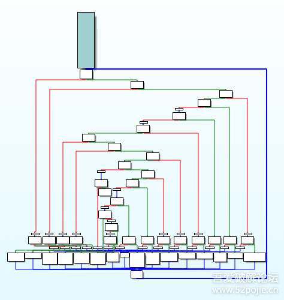   LLVM下的几个概念：Module 模块，Function 模块下的函数，BasicBlock 函数下基本块，Instruction 基本块下的IR指令。 ***\*控制流平坦化:\****   首先，每一块基本块可能会有后继和前驱，总体上的大体思路就是：先将所有的基本块保存下来，找到开头的基本块，分配一个变量switchVar并赋值，在后面添加一个Switch指令，根据switchVar跳转向其他的基本块，然后更新switchVar，让基本块跳转到正确的后继基本块中。   由于是在llvm10.0.1中实现，所以有一些问题需要注意，在调用其他的LowerSwitchPass中，不能直接Create了，必须override一个函数来描述Pass的依赖关系 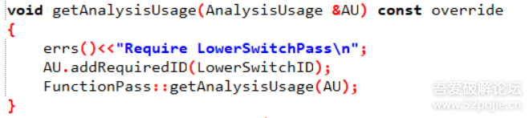   接下来来分析DoFlatten函数，传入了Function对象的指针和种子，用于初始化随机数，代码先获取了所有的基本块，然后取出入口基本块，判断该入口基本快的最后一个语句是否是无条件的跳转，如果是的则不处理，否则找到最后一条指令，将整个if结构给割裂开来，使用的是splitBasicBlock，割裂后两个块之间会自动添加跳转指令，所以可以将原来的基本块割裂后的if结构放入要处理的基本块列表。 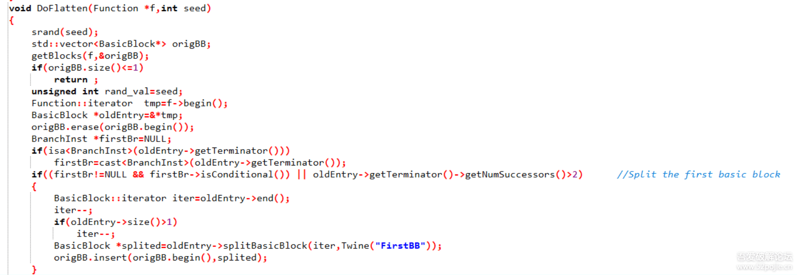    大概就是如下的操作，对EntryBlock进行分割，这样就可以保证EntryBlock只有一个后继基本块。  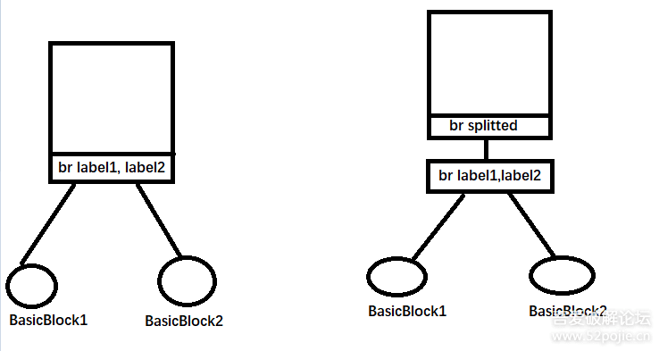    初始工作做完之后，开始建立一些新的基本块，并且开始创建Flatten的基本骨架，利用AllocaInst分配创建了一个switchVar，并把值利用LoadInst加载出来，利用该值创建SwitchInst进行跳转，并准备一些骨架所需的基本块。 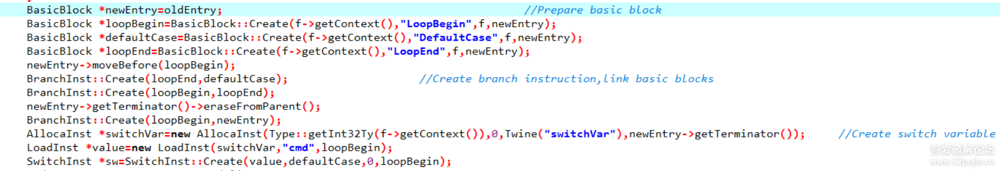   LoopBegin是循环开始的基本块，LoopEnd则是跳转回LoopBegin指令所在的基本块，而DefaultCase则是Switch指令默认跳转的基本块，此时的函数CFG类似这个样子。 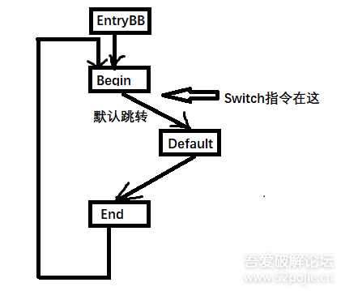   然后开始将剩余的基本块放入到骨架之中，新建几个ConstantInt(常量)，并将常量分配给对应的基本块，也就是addCase，更新SwitchInst的操作数，并且记录下第一个基本块的数值常量，便于后期给入口基本块(EntryBlock)的switchVar赋予初始值。 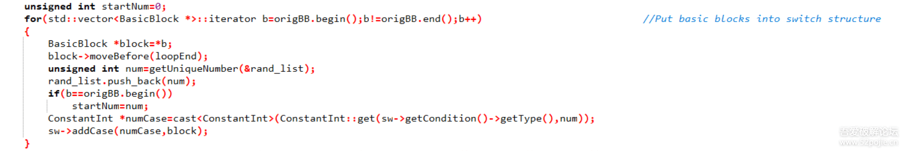    接下来就利用这个保存的常量值赋给在EntryBlock创建的switchVar变量。     但是现在的结构并不正确，原函数的基本块与基本块之间的关系并没有处理，所以得处理。 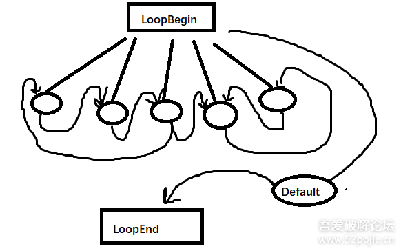   具体的处理操作是：若只有一个后继基本块，则只需要修改switchVar的值，然后抹除原有的跳转，新建一个跳转跳转到LoopEnd，若有两个后继基本块，则建立SelectInst指令，继承原来跳转指令的条件，选择正确后继基本块对应的值，然后储存到switchVar里，然后抹除原有跳转，新建一个跳转跳转到LoopEnd。 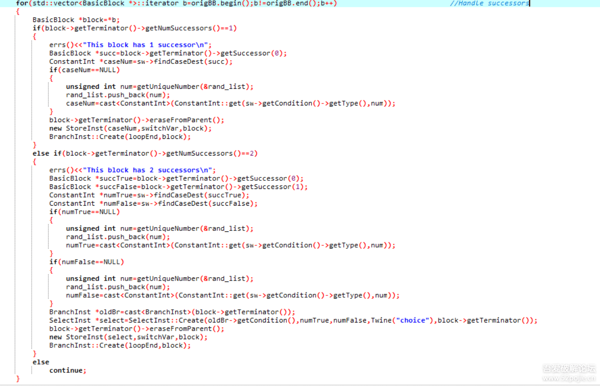 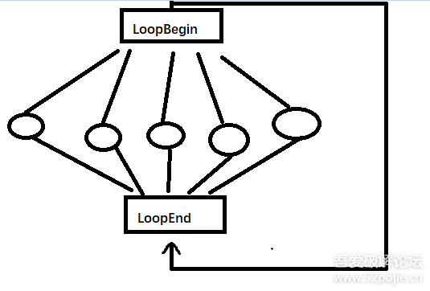   到这里大概是实现了平坦化的大概逻辑，其实还有一些代码，是处理PHINode和一些值在基本块中的关系的过程，大概也就是将值从寄存器转换到用栈储存。 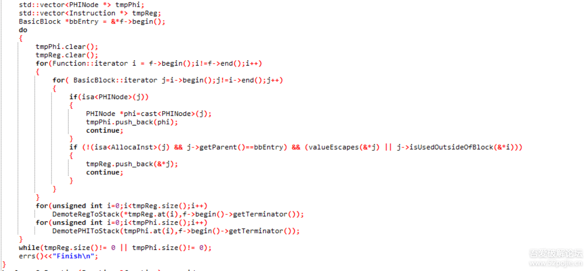 ***\*控制流平坦化魔改:\**** 但是正常的控制流平坦化已经被研究透了，但是大部分的方法都是基于定位LoopEnd基本块，实际上，这种简单的IR结构编译成汇编代码也是这个样子，就很容易定位LoopEnd基本块，所以只要稍加修改一下骨架结构，就能实现较好的效果，在这里我们就直接在LoopEnd基本块后面加一个新的SwitchInst，然后跳转到基本块，相当于从开始的Switch转移到了后面来了。 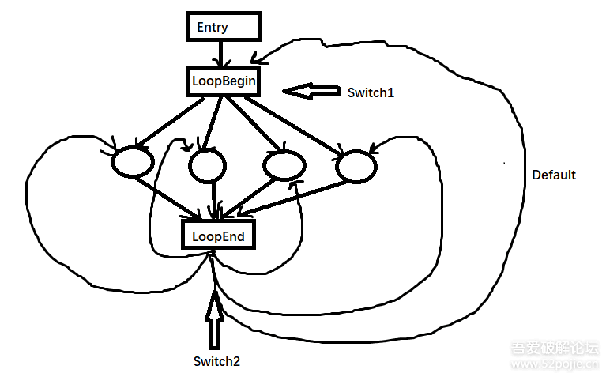   所以只需要在原来的代码后面新增对LoopEnd基本块的操作即可：抹除原来的跳转(或者是再准备骨架的时候让LoopEnd不建立跳转到LoopBegin的指令)，插入LoadInst加载switchVar，再用于SwitchInst跳转 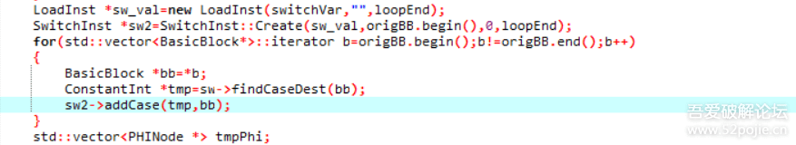   效果图：    发现确实是平坦化的逻辑，但是CFG却变得难以分类了，且LoopEnd难以定位了，但是可以通过BasicBlock的入度最多的来进行定位LoopEnd，然后找到所有的真实基本块，因此可以使用多个LoopEnd，使得真实块分配跳转到不同的LoopEnd基本块处，这样就难以找到所有的LoopEnd和真实块了。 给出代码：

```
void DoFlatten(Function *f,int seed,int loopEndNum)
              {
                        srand(seed);
                        std::vector<BasicBlock*> origBB;
                        getBlocks(f,&origBB);
                        if(origBB.size()<=1 || origBB.size()<loopEndNum)
                                return ;
                        unsigned int rand_val=seed;
                        Function::iterator  tmp=f->begin();
                        BasicBlock *oldEntry=&*tmp;
                        origBB.erase(origBB.begin());
                        BranchInst *firstBr=NULL;
                        if(isa<BranchInst>(oldEntry->getTerminator()))
                                firstBr=cast<BranchInst>(oldEntry->getTerminator());
                        if((firstBr!=NULL && firstBr->isConditional()) || oldEntry->getTerminator()->getNumSuccessors()>2)                //Split the first basic block
                        {
                                BasicBlock::iterator iter=oldEntry->end();
                                iter--;
                                if(oldEntry->size()>1)
                                        iter--;
                                BasicBlock *splited=oldEntry->splitBasicBlock(iter,Twine("FirstBB"));
                                origBB.insert(origBB.begin(),splited);
                        }
                        BasicBlock *newEntry=oldEntry;                                                                                                //Prepare basic block
                        BasicBlock *loopBegin=BasicBlock::Create(f->getContext(),"LoopBegin",f,newEntry);
                        BasicBlock *defaultCase=BasicBlock::Create(f->getContext(),"DefaultCase",f,newEntry);
                        std::vector<BasicBlock*> loopEndBlocks;
                        for(int i=0;i<loopEndNum;i++)
                                loopEndBlocks.push_back(BasicBlock::Create(f->getContext(),"LoopEnd",f,newEntry));
                        newEntry->moveBefore(loopBegin);
                        BranchInst::Create(origBB.at(rand()%origBB.size()),defaultCase);                                        //Create branch instruction,link basic blocks
                    newEntry->getTerminator()->eraseFromParent();
                    BranchInst::Create(loopBegin,newEntry);
                    AllocaInst *switchVar=new AllocaInst(Type::getInt32Ty(f->getContext()),0,Twine("switchVar"),newEntry->getTerminator());                //Create switch variable
                    LoadInst *value=new LoadInst(switchVar,"cmd",loopBegin);
                        SwitchInst *sw=SwitchInst::Create(value,defaultCase,0,loopBegin);
                        std::vector<unsigned int> rand_list;
                        unsigned int startNum=0;
                        for(std::vector<BasicBlock *>::iterator b=origBB.begin();b!=origBB.end();b++)                                                        //Put basic blocks into switch structure
                        {
                                BasicBlock *block=*b;
                                block->moveBefore(*loopEndBlocks.begin());
                                unsigned int num=getUniqueNumber(&rand_list);
                                rand_list.push_back(num);
                                if(b==origBB.begin())
                                        startNum=num;
                                ConstantInt *numCase=cast<ConstantInt>(ConstantInt::get(sw->getCondition()->getType(),num));
                                sw->addCase(numCase,block);
                        }
                        ConstantInt *startVal=cast<ConstantInt>(ConstantInt::get(sw->getCondition()->getType(),startNum));                //Set the entry value
                        new StoreInst(startVal,switchVar,newEntry->getTerminator());
                        errs()<<"Put Block Into Switch\n";
                        int every=(int)((double)origBB.size()/(double)loopEndNum);
                        int counter=0;
                        std::vector<BasicBlock *>::iterator end_iter=loopEndBlocks.begin();
                        for(std::vector<BasicBlock *>::iterator b=origBB.begin();b!=origBB.end();b++)                                                        //Handle successors
                        {
                                BasicBlock *block=*b;
                                if(counter==every)
                                {
                                        counter=0;
                                        end_iter++;
                                }
                                BasicBlock *loopEnd=*end_iter;
                                if(block->getTerminator()->getNumSuccessors()==1)
                                {
                                        errs()<<"This block has 1 successor\n";
                                        BasicBlock *succ=block->getTerminator()->getSuccessor(0);
                                        ConstantInt *caseNum=sw->findCaseDest(succ);
                                        if(caseNum==NULL)
                                        {
                                                unsigned int num=getUniqueNumber(&rand_list);
                                                rand_list.push_back(num);
                                                caseNum=cast<ConstantInt>(ConstantInt::get(sw->getCondition()->getType(),num));
                                        }
                                        block->getTerminator()->eraseFromParent();
                                        new StoreInst(caseNum,switchVar,block);
                                        BranchInst::Create(loopEnd,block);
                                }
                                else if(block->getTerminator()->getNumSuccessors()==2)
                                {
                                        errs()<<"This block has 2 successors\n";
                                        BasicBlock *succTrue=block->getTerminator()->getSuccessor(0);
                                        BasicBlock *succFalse=block->getTerminator()->getSuccessor(1);
                                        ConstantInt *numTrue=sw->findCaseDest(succTrue);
                                        ConstantInt *numFalse=sw->findCaseDest(succFalse);
                                        if(numTrue==NULL)
                                        {
                                                unsigned int num=getUniqueNumber(&rand_list);
                                                rand_list.push_back(num);
                                                numTrue=cast<ConstantInt>(ConstantInt::get(sw->getCondition()->getType(),num));
                                        }
                                        if(numFalse==NULL)
                                        {
                                                unsigned int num=getUniqueNumber(&rand_list);
                                                rand_list.push_back(num);
                                                numFalse=cast<ConstantInt>(ConstantInt::get(sw->getCondition()->getType(),num));
                                        }
                                        BranchInst *oldBr=cast<BranchInst>(block->getTerminator());
                                        SelectInst *select=SelectInst::Create(oldBr->getCondition(),numTrue,numFalse,Twine("choice"),block->getTerminator());
                                        block->getTerminator()->eraseFromParent();
                                        new StoreInst(select,switchVar,block);
                                        BranchInst::Create(loopEnd,block);
                                }
                                counter++;
                        }
                        for(std::vector<BasicBlock*>::iterator x=loopEndBlocks.begin();x!=loopEndBlocks.end();x++)
                        {
                                BasicBlock *loopEnd=*x;
                                LoadInst *sw_val=new LoadInst(switchVar,"",loopEnd);
                                SwitchInst *sw2=SwitchInst::Create(sw_val,origBB.at(rand()%origBB.size()),0,loopEnd);
                                for(std::vector<BasicBlock*>::iterator b=origBB.begin();b!=origBB.end();b++)
                                {
                                        BasicBlock *bb=*b;
                                        ConstantInt *tmp=sw->findCaseDest(bb);
                                        sw2->addCase(tmp,bb);
                                }
                        }
                        std::vector<PHINode *> tmpPhi;
                    std::vector<Instruction *> tmpReg;
                        BasicBlock *bbEntry = &*f->begin();
                        do
                        {
                                tmpPhi.clear();
                                tmpReg.clear();
                                for(Function::iterator i = f->begin();i!=f->end();i++)
                                {
                                        for( BasicBlock::iterator j=i->begin();j!=i->end();j++)
                                        {
                                                if(isa<PHINode>(j))
                                                {
                                                        PHINode *phi=cast<PHINode>(j);
                                                        tmpPhi.push_back(phi);
                                                        continue;
                                                }
                                                if (!(isa<AllocaInst>(j) && j->getParent()==bbEntry) && (valueEscapes(&*j) || j->isUsedOutsideOfBlock(&*i)))
                                                {
                                                        tmpReg.push_back(&*j);
                                                        continue;
                                                }
                                        }
                                }
                                for(unsigned int i=0;i<tmpReg.size();i++)
                                        DemoteRegToStack(*tmpReg.at(i),f->begin()->getTerminator());
                                for(unsigned int i=0;i<tmpPhi.size();i++)
                                        DemotePHIToStack(tmpPhi.at(i),f->begin()->getTerminator());
                        }
                        while(tmpReg.size()!= 0 || tmpPhi.size()!= 0);
                        errs()<<"Finish\n";
              }
```


  ***\*函数合并Pass:\****   

在逆向过程中，我们的快乐体验往往取决于程序员是否当人，如果程序员的代码写的极其的反人类，逻辑上混乱，那么我们在逆向的过程中往往会感受到愉悦，而且逆向工程讲究步步为营，一个函数一个函数的拿下，这样就能一步步的弄清楚整体的逻辑，基于此，我们可以涉及一个pass，把各种而样的函数，甚至是不是一个功能的函数合并在一起，这样逆向工程师将在这逆向旅途之中倍感折磨。   如何去实现这样的功能，我们可以写一个ModulePass，模块pass来处理，首先得定位哪些函数需要被合并，然后加入到一个List之中进行处理，先创建一个函数MixFunction，它的参数将所有的函数的参数合并，然后将List中的所有函数CopyInto这个MixFunction之中，然后修正一下各个函数对参数的引用，这时的函数内部的逻辑并不正确,需要修正一下，具体的修正过程就是添加个switch指令，根据MixFunction添加的最后一个函数来确定选用哪个原函数的BasicBlock块。 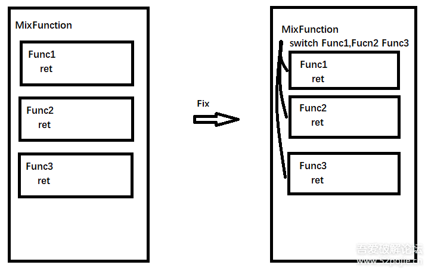    此时MixFunction已经被修正了，可以作为单独的函数了，但是源程序的所有Call指令Call的都是原来的函数，MixFunction并没有被调用，所以我们需要遍历所有指令，然后替换掉这些Call指令，让他变成Call我们的MixFunction，传入的最后一个参数标识使用的MixFunction的哪个函数部分。

```
#include "llvm/Pass.h"
#include "llvm/IR/Function.h"
#include "llvm/IR/Module.h"
#include "llvm/IR/CFG.h"
#include "llvm/ADT/SmallSet.h"
#include "llvm/ADT/SmallVector.h"
#include "llvm/IR/BasicBlock.h"
#include "llvm/Support/raw_ostream.h"
#include "llvm/IR/LegacyPassManager.h"
#include "llvm/LinkAllPasses.h"
#include "llvm/Transforms/Utils/Cloning.h"
#include "llvm/Transforms/IPO/PassManagerBuilder.h"
#include<vector>
#include<algorithm>
#include<map>
#include<ctime>
#include<cstdlib>
using namespace llvm;
namespace
{
    struct CombineFunction : public ModulePass
    {
        static char ID;
        CombineFunction() : ModulePass(ID) {}
        std::vector<BasicBlock*> *getBlocks(Function *function,std::vector<BasicBlock*> *lists)    //得到函数下的所有基本块
        {
            lists->clear();
            for(BasicBlock &basicBlock:*function)
                lists->push_back(&basicBlock);
            return lists;
        }
        std::vector<Function*> *getFunctions(Module *module,std::vector<Function*> *lists)    //得到模块下的所有函数
        {
            lists->clear();
            for(Function &func:*module)
                lists->push_back(&func);
            return lists;
        }
        std::string readAnnotate(Function *f)     //从OLLVM借用的，用于读取函数的标识，确定那些函数需要合并在一起
        {
            std::string annotation = "";
            /* Get annotation variable */
            GlobalVariable *glob=f->getParent()->getGlobalVariable( "llvm.global.annotations" );
            if ( glob != NULL )
            {
                /* Get the array */
                if ( ConstantArray * ca = dyn_cast<ConstantArray>( glob->getInitializer() ) )
                {
                    for ( unsigned i = 0; i < ca->getNumOperands(); ++i )
                    {
                        /* Get the struct */
                        if ( ConstantStruct * structAn = dyn_cast<ConstantStruct>( ca->getOperand( i ) ) )
                        {
                            if ( ConstantExpr * expr = dyn_cast<ConstantExpr>( structAn->getOperand( 0 ) ) )
                            {
                                /*
                                 * If it's a bitcast we can check if the annotation is concerning
                                 * the current function
                                 */
                                if ( expr->getOpcode() == Instruction::BitCast && expr->getOperand( 0 ) == f )
                                {
                                    ConstantExpr *note = cast<ConstantExpr>( structAn->getOperand( 1 ) );
                                    /*
                                     * If it's a GetElementPtr, that means we found the variable
                                     * containing the annotations
                                     */
                                    if ( note->getOpcode() == Instruction::GetElementPtr )
                                    {
                                        if ( GlobalVariable * annoteStr = dyn_cast<GlobalVariable>( note->getOperand( 0 ) ) )
                                        {
                                            if ( ConstantDataSequential * data = dyn_cast<ConstantDataSequential>( annoteStr->getInitializer() ) )
                                            {
                                                if ( data->isString() )
                                                {
                                                    annotation += data->getAsString().lower() + " ";
                                                }
                                            }
                                        }
                                    }
                                }
                            }
                        }
                    }
                }
            }
            return(annotation);
        }
        Function *Combine(std::vector<Function*> *func_list,ValueToValueMapTy* VMap,Twine name,std::vector<unsigned int> *argPosList)    //单纯的将原来的函数放入MixFunction
        {
            if(func_list->size()<1)    //如果只有一个函数，没必要合并
                return NULL;
            errs()<<"Check Function Type\n";
            for(std::vector<Function *>::iterator f=func_list->begin();f!=func_list->end();f++)    //遍历vector中的函数
            {
                Function *func=*f;
                if(func->isDeclaration() || func->hasAvailableExternallyLinkage()!=0 || func->getFunctionType()->isVarArg()!=false)    //检测函数是否有内容(有BasicBlock),是否是变长参数，这里都处理不了
                    return NULL;
            }
            errs()<<" Done\n";
            errs()<<"Prepare Function Type\n";
            std::vector<Type*> ArgTypes;
            for(std::vector<Function *>::iterator f=func_list->begin();f!=func_list->end();f++)  
            {
                Function *func=*f;
                for(Argument &I:func->args())    //对于每个函数，将其参数类型保存下来，用于建立函数MixFunction
                    ArgTypes.push_back(I.getType());
            }
            errs()<<" Done\n";
            errs()<<"Check Function Return Type\n";
            Function *first=*func_list->begin();
            ArgTypes.push_back(Type::getInt32Ty(first->getParent()->getContext()));    //添加最后一个参数用于标识函数部分
            for(std::vector<Function *>::iterator f=func_list->begin();f!=func_list->end();f++)
            {
                Function *func=*f;
                if(func->getFunctionType()->getReturnType()!=first->getFunctionType()->getReturnType())    //检验函数的返回值是否相等
                    return NULL;
                if(func->getParent()!=first->getParent())    //检验函数是否在同一个模块内(这显然)
                    return NULL;
                if(func->getLinkage()!=first->getLinkage())
                    return NULL;
            }
            FunctionType *fty=FunctionType::get(first->getFunctionType()->getReturnType(),ArgTypes,false);    //声明函数的类型
            Function *result=Function::Create(fty,first->getLinkage(),first->getAddressSpace(),name,first->getParent());    //创建函数
            Function ::arg_iterator iter=result->arg_begin();    //迭代器指向MixFunction函数的参数
            errs()<<" Done\n";
            errs()<<"Start Working\n";
            unsigned int index=0;
            for(std::vector<Function *>::iterator f=func_list->begin();f!=func_list->end();f++)    //对于每个函数
            {
                Function *func=*f;
                argPosList->push_back(index);    //存储每个函数参数起始位置是第几个
                for(Argument &I:func->args())    //对于每个参数
                    (*VMap)[&I]=&*iter++,index++;    //添加参数映射，用于CloneInto，迭代器++，位置序号++
            }
            SmallVector<ReturnInst*,8> returns;
            ClonedCodeInfo CodeInfo;
            for(std::vector<Function *>::iterator f=func_list->begin();f!=func_list->end();f++)
            {
                Function *func=*f;
                CloneFunctionInto(result,func,*VMap,func->getSubprogram()!= nullptr,returns,"",&CodeInfo);    //开始将原来的函数一个个克隆到MixFunction
            }
            errs()<<" Done\n";
            return result;
        }
        unsigned int getUniqueNumber(std::vector<unsigned int> *rand_list)    //用于保证不会出现重复的随机数
        {
            unsigned int num=rand();
            while(true)
            {
                bool state=true;
                for(std::vector<unsigned int>::iterator n=rand_list->begin();n!=rand_list->end();n++)
                    if(*n==num)
                    {
                        state=false;
                        break;
                    }
                if(state)
                    break;
                num=rand();
            }
            return num;
        }
        bool FixFunction(Function *target,std::vector<Function*> *orig_list,ValueToValueMapTy *VMap,std::vector<unsigned int> *valueList)    //将函数逻辑链接起来，使得MixFunction逻辑正确
        {
            std::vector<BasicBlock*> entryBlocks;
            std::vector<BasicBlock*> bodyBlock;
            errs()<<"Get all entry blocks\n";
            for(std::vector<Function *>::iterator f=orig_list->begin();f!=orig_list->end();f++)    //遍历函数，保存下MixFunction下原来组成函数的入口BasicBlock
            {
                Function *func=*f;
                BasicBlock *entry=&*func->begin();
                Value *ptr=(Value*)VMap->lookup(entry);    //从CloneFunctionInto返回的Map中，找到原来函数入口BasicBlock对应在MixFunction中的入口BasicBlock
                if(isa<BasicBlock>(*ptr))
                    entryBlocks.push_back((BasicBlock*)ptr);
                else
                    return false;
            }
            getBlocks(target,&bodyBlock);
            errs()<<" Done\n";
            errs()<<"Build switch\n";
            BasicBlock *entry=BasicBlock::Create(target->getContext(),"Entry",target);    //建立新的入口BasicBlock
            BasicBlock *selector=BasicBlock::Create(target->getContext(),"Selector",target);    //建立选择BasicBlock，其中包含SwitchInst
            entry->moveBefore(*entryBlocks.begin());    //表面上的movebefore
            selector->moveBefore(*entryBlocks.begin());
            AllocaInst *var=new AllocaInst(Type::getInt32Ty(target->getContext()),0,Twine("switchVar"),entry);    //在入口BasicBlock中分配一个变量
            Function::arg_iterator iter=target->arg_end();
            Value *controlArg=--iter;    //找到最后一个参数
            new StoreInst(controlArg,var,entry);    //把最后一个参数的值储存到刚才分配的变量中
            BranchInst::Create(selector,entry);    //把入口BasicBlock和selector的BasicBlock通过跳转指令链接起来
            LoadInst *load=new LoadInst(var,Twine(""),selector);    //在selector的BasicBlock中把保存的变量加载出来
            BasicBlock *endBlock=BasicBlock::Create(target->getContext(),"DefaultEnd",target);    //创建结束的BasicBlock
            ReturnInst *ret=ReturnInst::Create(target->getContext(),Constant::getNullValue(target->getFunctionType()->getReturnType()),endBlock);    //在结束的BasicBlock中创建返回语句
            SwitchInst *sw=SwitchInst::Create(load,endBlock,0,selector);    [/font][/size][size=2][font=微软雅黑][size=2][font=微软雅黑]//在selector的BasicBlock后添加SwitchInst[/font][/size]           std::vector<unsigned int> rand_list;
            std::vector<BasicBlock*>::iterator bblist_iter=entryBlocks.begin();
            for(std::vector<Function *>::iterator f=orig_list->begin();f!=orig_list->end();f++)    //将原来函数在MixFunction中的入口块放入到SwitchInst的case中
            {
                unsigned int val=getUniqueNumber(&rand_list);    //分配一个随机数
                rand_list.push_back(val);
                ConstantInt *numCase=cast<ConstantInt>(ConstantInt::get(sw->getCondition()->getType(),val));
                valueList->push_back(val);
                sw->addCase(numCase,*bblist_iter);
                bblist_iter++;
            }
            errs()<<" Done\n";
            errs()<<"Add useless code\n";
            for(std::vector<BasicBlock *>::iterator b=bodyBlock.begin();b!=bodyBlock.end();b++)    //添加一些垃圾指令，其实没有必要
            {
                BasicBlock *basicBlock=*b;
                BranchInst *br=NULL;
                if(isa<BranchInst>(*basicBlock->getTerminator()))
                {
                    br=(BranchInst*)basicBlock->getTerminator();
                    if(br->isUnconditional())
                    {
                        BasicBlock *rand_target=entryBlocks.at(rand()%entryBlocks.size());
                        BasicBlock *right=basicBlock->getTerminator()->getSuccessor(0);
                        basicBlock->getTerminator()->eraseFromParent();
                        unsigned int val=getUniqueNumber(&rand_list);
                        rand_list.push_back(val);
                        LoadInst *cmpValA=new LoadInst(var,Twine(""),basicBlock);
                        ConstantInt *cmpValB=ConstantInt::get(Type::getInt32Ty(target->getContext()),val);
                        ICmpInst *condition=new ICmpInst(*basicBlock,ICmpInst::ICMP_EQ,cmpValA,cmpValB);
                        BranchInst::Create(rand_target,right,condition,basicBlock);    //恒成立的跳转
                    }
                }
 
            }
 
            errs()<<" Done\n";
            return true;
        }
        bool FixCallInst(Function *target,std::vector<Function*> *orig_list,ValueToValueMapTy *VMap,std::vector<unsigned int> *valueList,std::vector<unsigned int> *argPosList)    //修正Call指令
        {
            std::vector<unsigned int>::iterator  v=valueList->begin(),a=argPosList->begin();
            std::vector<CallInst*> remove_list;
            for(std::vector<Function *>::iterator f=orig_list->begin();f!=orig_list->end();f++,v++,a++)    //遍历合并的每个函数
            {
                unsigned int val=*v,argPos=*a;
                Function *ff=*f;
                for(Function &func:*ff->getParent())
                    for(BasicBlock &bb:func)
                        for(Instruction &ii:bb)    //遍历所有的指令
                        {
                            if(isa<CallInst>(ii))    //如果发现是个Call指令
                            {
                                CallInst* callInst=&cast<CallInst>(ii);
                                if(callInst->getCalledFunction()==ff)     //查看每个Call指令调用的是不是这个函数
                                {
                                    std::vector<Value *> arg_list;
                                    Function ::arg_iterator itera=target->arg_begin();    //迭代器MixFunction的参数
                                    User::op_iterator iterb=callInst->arg_begin();    //迭代器指向call指令的参数
                                    for(size_t i=0;i<target->arg_size()-1;i++,itera++)    //遍历，构造新的call指令参数
                                    {
                                        if(i>=argPos && i<argPos+callInst->arg_size())    //相应位置参数填写
                                        {
                                            arg_list.push_back(*iterb);
                                            iterb++;
                                        }
                                        else    //否则就填空值
                                            arg_list.push_back(Constant::getNullValue((*itera).getType()));
                                    }
                                    arg_list.push_back(ConstantInt::get(Type::getInt32Ty(target->getContext()),val));
                                    CallInst *newCall=CallInst::Create(target,arg_list,Twine(""),callInst);    //创建修正过的CallInst
                                    remove_list.push_back(callInst);
                                    callInst->replaceAllUsesWith(newCall);    //[/font][/size][size=2][font=微软雅黑][size=2][font=微软雅黑]取代旧的CallInst[/font][/size][/font][/size]
[size=2][font=微软雅黑]                             }
                            }
                        }
 
            }
            for(std::vector<CallInst *>::iterator c=remove_list.begin();c!=remove_list.end();c++)
                (*c)->eraseFromParent();
            return true;
        }
        bool runOnModule(Module &module) override
        {
            std::vector<Function*>  func_list;
            getFunctions(&module,&func_list);
            std::vector<Function*>  work_list;
            errs()<<"Function List:\n";
            for(std::vector<Function *>::iterator f=func_list.begin();f!=func_list.end();f++)
            {
                Function *func=*f;
                errs()<<" ";
                errs().write_escaped(func->getName()) << '\n';
                if(!readAnnotate(func).find("combine"))
                {
                    errs()<<"     -Add to work list\n";
                    work_list.push_back(func);
                }
            }
            ValueToValueMapTy VMap;
            std::vector<unsigned int> values,argPos;
            Function *target=Combine(&work_list,&VMap,"MixFunction",&argPos);
            if(target==NULL)
            {
                errs()<<"Combine Fail\n";
                return false;
            }
 
            if(!FixFunction(target,&work_list,&VMap,&values))
            {
                errs()<<"FixFunction Fail\n";
                return false;
            }
            if(!FixCallInst(target,&work_list,&VMap,&values,&argPos))
            {
                errs()<<"FixCallInst Fail\n";
                return false;
            }
            module.getGlobalVariable("llvm.global.annotations")->eraseFromParent();
            for(std::vector<Function *>::iterator f=work_list.begin();f!=work_list.end();f++)
            {
                Function *func=*f;
                func->eraseFromParent();
            }
            return false;
        }
    };
}
 
char CombineFunction ::ID=0;    //pass标准格式
static RegisterPass<CombineFunction > X("combine", "MyCombine");
 
// Register for clang
static RegisterStandardPasses Y(PassManagerBuilder::EP_EarlyAsPossible,
  [](const PassManagerBuilder &Builder, legacy::PassManagerBase &PM) {
    PM.add(new CombineFunction ());
  });
```


​     效果图(配上递归效果更佳哟)： 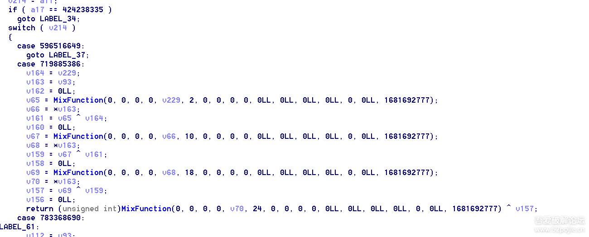 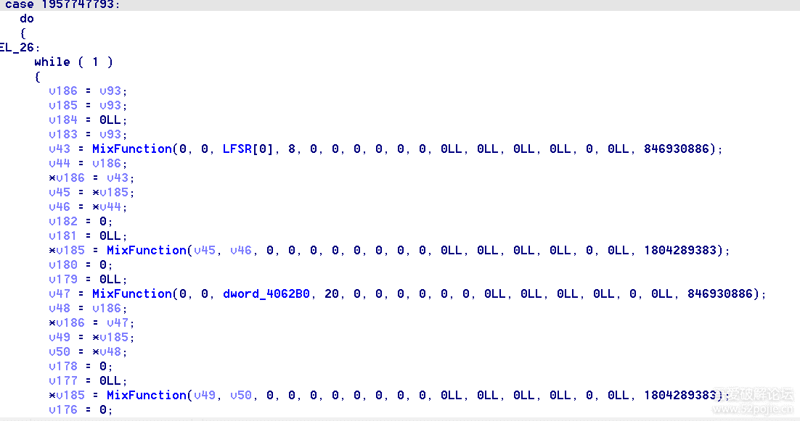

- 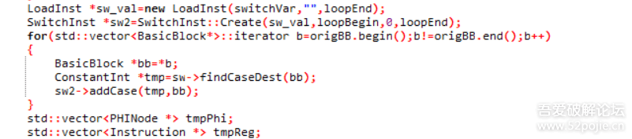