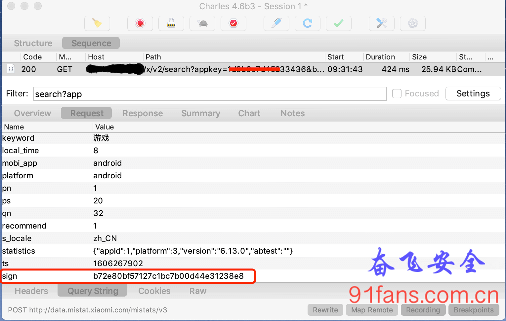

# 某站App签名算法解析(一)

## 一、目标

我们来分析某站 App的sign签名算法，先搜索一下 游戏 ，抓包结果:

1:charlesb

## 二、步骤

### 这个sign依然是32位的字符串

都9020年了，这种规模用户的App应该是不会裸奔在java层了，我们就直接一点，在so里面搜索 sign=

可惜没有结果……

### 藏起来的东西一定是重要的东西

so层导出函数给java层调用，有两种方法，一种是静态注册，直接会体现在so的导出表里。 一种是RegisterNatives来动态注册，这种就比较隐晦了，从导出表里看不到痕迹。

所以我们Hook下RegisterNatives，看看它藏了什么？

```js
// hook register 打印动态注册的函数地址
function hook_register(){
    // libart.so 所有导出函数表
    var symbols = Module.enumerateSymbolsSync("libart.so");
    var addr_register = null;
    for(var i = 0; i < symbols.length; i++){
        var symbol = symbols[i];
        var method_name = symbol.name;
        if(method_name.indexOf("art") >= 0){

            if(method_name.indexOf("_ZN3art3JNI15RegisterNativesEP7_JNIEnvP7_jclassPK15JNINativeMethodi") >= 0){
                addr_register = symbol.address;
            }
        }
    }

    // 开始hook
    if(addr_register){
        Interceptor.attach(addr_register, {
            onEnter: function(args){
                var methods = ptr(args[2]);
                var method_count = args[3];
                console.log("[RegisterNatives] method_count:", method_count);
                for(var i = 0; i < method_count; i++){
                    var fn_ptr = methods.add(i * Process.pointerSize * 3 + Process.pointerSize * 2).readPointer();
                    var find_module = Process.findModuleByAddress(fn_ptr);
                    if(i == 0){
                        console.log("module name", find_module.name);
                        console.log("module base", find_module.base);
                    }
                    console.log("\t method_name:", methods.add(i * Process.pointerSize * 3).readPointer().readCString(), "method_sign:", methods.add(i * Process.pointerSize * 3 + Process.pointerSize).readPointer().readCString(), "method_fnPtr:", fn_ptr, "method offset:", fn_ptr.sub(find_module.base));
                }
            }, onLeave(retval){

            }
        })
    }

}
```

挂上我心爱的frida，跑起来……

这种函数命名可读性这么好，望文生义就知道不是做sign

```bash
[RegisterNatives] method_count: 0x6
module name libimagepipeline.so
module base 0x7c29c000
	 method_name: nativeAllocate method_sign: (I)J method_fnPtr: 0x7c29cc6d method offset: 0xc6d
	 method_name: nativeFree method_sign: (J)V method_fnPtr: 0x7c29ccb5 method offset: 0xcb5
	 method_name: nativeCopyToByteArray method_sign: (J[BII)V method_fnPtr: 0x7c29ccbb method offset: 0xcbb
	 method_name: nativeCopyFromByteArray method_sign: (J[BII)V method_fnPtr: 0x7c29ccd7 method offset: 0xcd7
	 method_name: nativeMemcpy method_sign: (JJI)V method_fnPtr: 0x7c29ccf3 method offset: 0xcf3
	 method_name: nativeReadByte method_sign: (J)B method_fnPtr: 0x7c29ccff method offset: 0xcff
```

这个 libbili.so 大兄弟看上去不像好人，都9020年了，函数命名个 a、b、s之类，这么明目张胆的写bug，在我司是要被李老板拉出去打PP的。

```bash
[RegisterNatives] method_count: 0x7
module name libbili.so
module base 0x88e2b000
	 method_name: a method_sign: (Ljava/lang/String;)Ljava/lang/String; method_fnPtr: 0x88e2cc35 method offset: 0x1c35
	 method_name: ao method_sign: (Ljava/lang/String;II)Ljava/lang/String; method_fnPtr: 0x88e2cc3b method offset: 0x1c3b
	 method_name: b method_sign: (Ljava/lang/String;)Ljavax/crypto/spec/IvParameterSpec; method_fnPtr: 0x88e2cc49 method offset: 0x1c49
	 method_name: s method_sign: (Ljava/util/SortedMap;)Lcom/bilibili/nativelibrary/SignedQuery; method_fnPtr: 0x88e2cc4f method offset: 0x1c4f
	 method_name: so method_sign: (Ljava/util/SortedMap;II)Lcom/bilibili/nativelibrary/SignedQuery; method_fnPtr: 0x88e2cc55 method offset: 0x1c55
	 method_name: getCpuCount method_sign: ()I method_fnPtr: 0x88e2cc63 method offset: 0x1c63
	 method_name: getCpuId method_sign: ()I method_fnPtr: 0x88e2cc67 method offset: 0x1c67
```

既然不是好人，那就问询一下，Hook之:

```js
var biliNative = Java.use("com.bilibili.nativelibrary.LibBili");

biliNative.a.implementation = function(a){
	var result = this.a(a);
    console.log("biliNative a(" + a + ") = " + result);
	return result;
}

biliNative.ao.implementation = function(a,b,c){
     var result = this.ao(a,b,c);
     console.log("biliNative ao(" + a + "," + b + "," + c + ") = " + result);
	return result;
}

biliNative.b.overload('java.lang.String').implementation = function(a){
	var result = this.b(a);
    console.log("biliNative b(" + a + ") = " + result);
	return result;
}

biliNative.s.implementation = function(map){
	var result = this.s(map);
    console.log("biliNative s(" + map + ") = " + result);
	return result;
}

biliNative.so.implementation = function(a,b,c){
     var result = this.so(a,b,c);
     console.log("biliNative so(" + a + "," + b + "," + c + ") = " + result);
	return result;
}
```

现形了，收工。

1:signshow

慢着！李老板出场了，为什么老板总在下班的时候出现？上班的时候他们干什么去了？(｡╯︵╰｡)

奋飞呀，签名是出来的，但是入参呢？你总不能告诉我入参是个Object吧？

### 搞SortedMap入参

入参从之前打印的结果可以看出来，是个 Ljava/util/SortedMap;, 那就so easy了，把它打印出来即可。

半小时后…… 找了一圈google只告诉了我一个 HashMap 的打印方法，不管了，先打出来

```js
biliNative.s.implementation = function(HashMap){
	   var result = this.s(HashMap);

	var keys = HashMap.keySet();
	var key_set = keys.iterator();
	while (key_set.hasNext()) {
    var key = key_set.next().toString();
    var value = HashMap.get(key).toString();
    console.log(key + ": " + value);
	}

       console.log("biliNative s(" + HashMap + ") = " + result);
	   return result;
}
```

继续跑，Duang…..

```bash
{'type': 'error', 'description': "TypeError: undefined not callable (property 'get' of [object Object])", 'stack': "TypeError: undefined not callable (property 'get' of [object Object])\n    at [anon] (../../../frida-gum/bindings/gumjs/duktape.c:67616)\n    at /script1.js:111\n    at je (frida/node_modules/frida-java-bridge/lib/class-factory.js:633)\n    at frida/node_modules/frida-java-bridge/lib/class-factory.js:616", 'fileName': '/script1.js', 'lineNumber': 111, 'columnNumber': 1}
```

貌似是说 SortedMap没有get()这个方法 ????

鲁迅先生曾经说过：年轻人不能偷懒，到处抄代码是不对的。

1:lx

先查查java文档，分析下 SortedMap 的成员函数，其实奋飞也是个优秀的java程序员。

- java.util.SortedMap.comparator() //接收比较器，用于Map排序
- java.util.SortedMap.entrySet() //后去Map中的entrySet集合
- java.util.SortedMap.firstKey() //第一个key
- java.util.SortedMap.headMap(K k) //在k之前的键值对
- java.util.SortedMap.keySet() //获取key的set集合
- java.util.SortedMap.lastKey() //最后的key
- java.util.SortedMap.subMap(K k1, K k2) //k1，k2之间的键值对
- java.util.SortedMap.tailMap(K) //集合最后的键值对
- java.util.SortedMap.values() //集合所有的values

好吧，那就简单了，我们先把 key 遍历出来，然后在把 values() 打印出来。

哪位同学有更好的办法，请给奋飞留言.Orz

###### Tip:

网友：飞雪的日子，提供了一个更帅的方式 console.log(map.entrySet().toArray());

```js
biliNative.s.implementation = function(map){
	var result = this.s(map);

	var keyStr = ""
	var keys = map.keySet();
	var key_set = keys.iterator();
	while (key_set.hasNext()) {
		var key = key_set.next().toString();
		keyStr += ","+key
	}

	console.log(keyStr)
	console.log(map.values().toArray());

	console.log("biliNative s(" + map + ") = " + result);
	return result;
}
```

嗯嗯，效果不错，打印出来了，收工

1:rc

## 三、总结

好东西要藏起来，逆向一下，藏起来的肯定是好东西(^_~)

╮(‵▽′)╭ 每天叫醒我的不是闹钟，而是知识星球新用户加入的消息铃声 (￣ˇ￣)

###### Tip:

本文的目的只有一个就是学习更多的逆向技巧和思路，如果有人利用本文技术去进行非法商业获取利益带来的法律责任都是操作者自己承担，和本文以及作者没关系，本文涉及到的代码项目可以去 奋飞的朋友们 知识星球自取，欢迎加入知识星球一起学习探讨技术。有问题可以加我wx: fenfei331 讨论下。