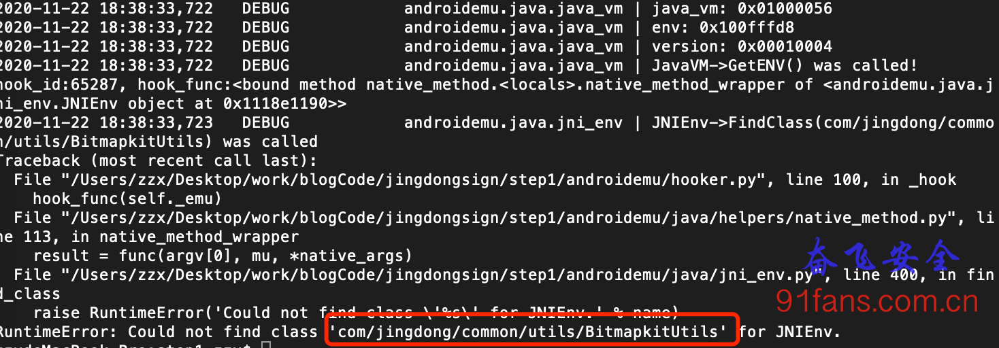
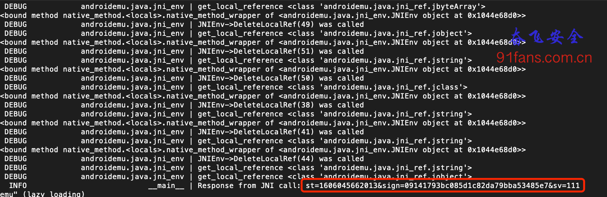
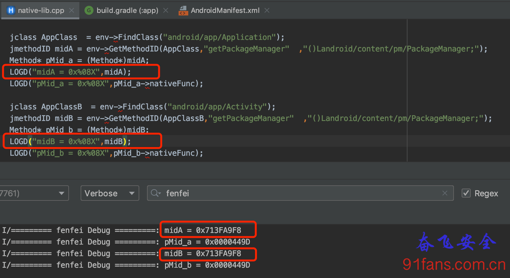
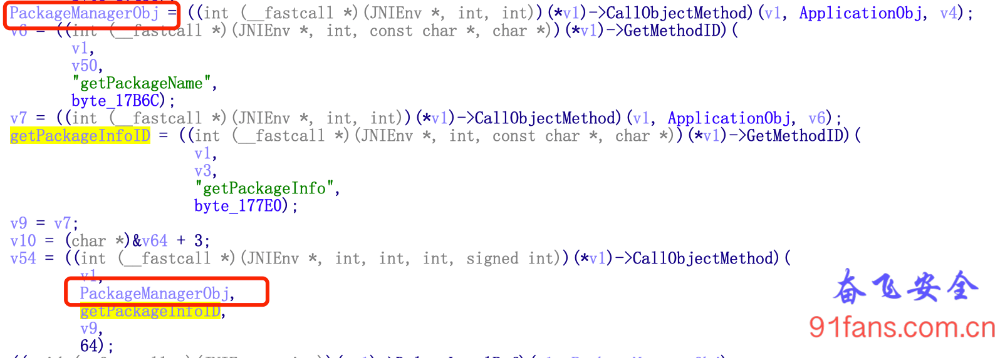
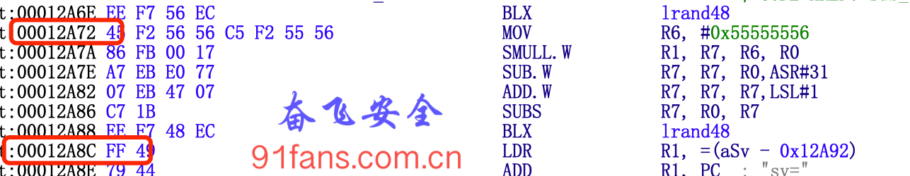
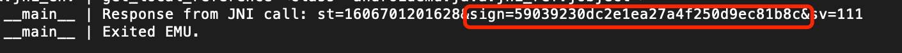
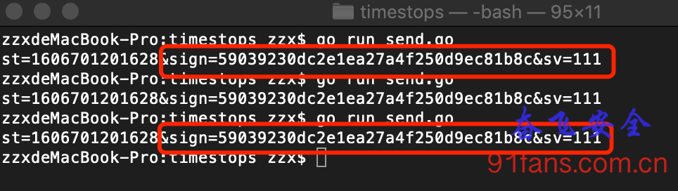

# AndroidNativeEmu模拟执行计算出某电商App sign

## 一、目标

这几天写代码写的很爽，因为经过几天没日没夜的调试，终于成功的把某电商App的sign用 **AndroidNativeEmu** 跑出来了，填了无数的坑，跑出正确结果的那一刻，内牛满面呀，心里充满了对 AeonLucid 大神的敬意，请收下我的膝盖 https://github.com/AeonLucid/AndroidNativeEmu，从大神的介绍里面看应该是荷兰人。

其实算出结果并不重要， 填坑、调试并修改原工程 最终跑出sign的过程才是最重要的。没有人告诉我们牛顿发现万有引力定律时的思考过程，当然，牛顿可以慷慨地把他的思考结果告诉我们，但是，他那可以点石成金的“金手指”却没有教给我们。所以这里插播一个广告： 我预计会花2-3周的时间，把这次从原工程到跑出sign的过程详细到每一步的所思所想和解决方法完整的过程发布出来，绝对是全网唯一一个AndroidNativeEmu实操教程，仅会发布至 "奋飞的朋友们" 知识星球,星球在满100人之后会提价到199，这份教程一定会让你物超所值

请注意，要学习这个AndroidNativeEmu实例教程有两个前置条件:

1、Android编程入门，起码能写个Hello World；

2、能读懂 [AndroidNativeEmu使用指南](http://91fans.com.cn/post/androidnativeemu/) 并跑通例子代码

**否则强练九阴真经会走火入魔的。**(=￣ω￣=)　

以下是正文……

## 二、分析

李老板： 奋飞呀，你不是说某电商App的签名已经搞定了吗？

奋飞： 对呀，连上手机签名，就可以正常拿到数据了。

李老板从裤兜里掏出了iphone 12pro， 奋飞: (￣ε(#￣)　(其实iPhone连手机签名奋飞有更稳定成熟的方案，以后的文章介绍)

奋飞只好默默的掏出了AndroidNativeEmu,跑起来,Duang……，不出意外，程序挂了

1:signrun1

这个问题还好，把BitmapkitUtils类补上就行了

```py
class BitmapkitUtils(metaclass=JavaClassDef, jvm_name='com/jingdong/common/utils/BitmapkitUtils',jvm_fields=[JavaFieldDef("a", "Landroid/app/Application;", True, Application())]):

    def __init__(self):
        pass

    @java_method_def(name='a', signature='([Ljava/lang/String;)Ljava/lang/String;', native=True)
    def a(self, mu,str):
        logger.info("calll BitmapKitUtils a %s" % str)
        pass

    @java_method_def(name='encodeJni', signature='([BZ)[B', native=True)
    def encodeJni(self, mu):
        pass

    @java_method_def(
        name='getSignFromJni',
        args_list=['jobject',"jstring","jstring","jstring","jstring","jstring"],
        signature='(Landroid/content/Context;Ljava/lang/String;Ljava/lang/String;Ljava/lang/String;Ljava/lang/String;Ljava/lang/String;)Ljava/lang/String;',
        native=True)
    def getSignFromJni(self, mu):
        pass

    @java_method_def(name='getstring', signature='(Ljava/lang/String;)Ljava/lang/String;', native=True)
    def getstring(self, mu):
        pass
```

其他还有一堆坑都给填上，这里就不详述了，星球里下周发的详细教程 见。

成功算出sign

1:runrc

算完了，总不能复制过去吧， 这里我们参照 [某右协议分析(三)](http://91fans.com.cn/post/zysignthr/),通过Flask起个web Server来搞

```py
app = Flask(__name__)
@app.route('/getSignFromJni', methods=['POST']) # 数据加密
def getSignFromJni():
    global emulator
    global lib_module

    str = request.form.get('str')
    str2 = request.form.get('str2')
    str3 = request.form.get('str3')
    str4 = request.form.get('str4')
    str5 = request.form.get('str5')

    activity_Th = ActivityThread()
    bit_Utils = BitmapkitUtils()
    result = emulator.call_symbol(lib_module, 'Java_com_jingdong_common_utils_BitmapkitUtils_getSignFromJni',emulator.java_vm.jni_env.address_ptr,0x00, activity_Th.getSystemContext(emulator), str, str2,str3, str4,str5)

    return result.toString(emulator)
```

好了，再接上上次我们写的send.go,这次搜索一下 “小米”

1:sendrc

结果正常， 收工。

╮(‵▽′)╭ 每天叫醒我的不是闹钟，而是知识星球新用户加入的消息铃声 (￣ˇ￣)


# AndroidNativeEmu模拟执行大厂so实操教程(一) 如何搞一个类

## 一、目标

从这篇文章开始，我们一步一步介绍如何 填坑、调试并修改原工程 代码 **ExAndroidNativeEmu** 到跑出某电商Appsign的过程。

本文使用的原始代码在 [AndroidNativeEmu使用指南](http://91fans.com.cn/post/androidnativeemu/)中。

## 二、步骤

### 先跑起来，报错

```bash
RuntimeError: Could not find class 'com/jingdong/common/utils/BitmapkitUtils' for JNIEnv.
```

Unicorn是一个虚拟cpu，它模拟的cpu的执行，所以一些纯算法的函数，可以直接用Unicorn跑出来。我们学过计算机组成原理，计算机在硬件cpu之上还跑着一个操作系统，windows、linux、Android、ios和mac这些就是操作系统。

那么要执行so，我们还需要把操作系统给模拟出来。理论上来说我们需要把操作系统的库函数malloc、free等等都给重写一遍，那肯定疯了，所以AndroidEmu已经处理好了，把libc.so libstdc++.so libdvm.so等等都给跑通了，严格意义上说，已经完整的跑通了一个Mini linux。

那为什么很多so都不能顺利执行呢？因为还有个拦路虎是 JNI ，JNI不仅赋予了java程序调用c(Native)的能力，也赋予了c(Native)程序调用java的能力，所以很多大厂so故意在Native层大量 恶意 的调用java层的函数来做逻辑，从而抵抗AndroidEmu和Unidbg之类的模拟器来模拟执行。

androidemu/java/classes 下面是 AeonLucid 大神 Orz 预先写好的几个类来模拟同名的java类，我们创建的新类可以参照这里。

先解释一下

```py
class BitmapkitUtils(metaclass=JavaClassDef, jvm_name='com/jingdong/common/utils/BitmapkitUtils',jvm_fields=[JavaFieldDef("a", "Landroid/app/Application;", True, Application())]):
```

class BitmapkitUtils : 说明定义一个Python类，类名是 BitmapkitUtils。

metaclass=JavaClassDef : 这个 metaclass是什么鬼？这是Python一个很magic的用法，神奇到我都没搞明白，你只要记住加上这个标志的类，在实例化的时候会首先进入到 JavaClassDef. *init*()做初始化工作，这样统一改变了这些实例的属性和初始化公共部分。

jvm_name : 这个就好理解了,它描述了BitmapkitUtils这个类在jvm虚拟机里面的类名，Native代码调用它就靠这个名字。

完整代码如下:

```py
class BitmapkitUtils(metaclass=JavaClassDef, jvm_name='com/jingdong/common/utils/BitmapkitUtils'):

    def __init__(self):
        pass

# 在虚拟机里注册 BitmapkitUtils类
emulator.java_classloader.add_class(BitmapkitUtils)
```

### 再跑一下

```bash
RuntimeError: Could not find static field ('a', 'Landroid/app/Application;') in class com/jingdong/common/utils/BitmapkitUtils.
```

说明BitmapkitUtils类里面有个叫 a 的 静态变量被调用了，加上他,

```py
class BitmapkitUtils(metaclass=JavaClassDef, jvm_name='com/jingdong/common/utils/BitmapkitUtils',jvm_fields=[JavaFieldDef("a", "Landroid/app/Application;", True, Application())]):
```

jvm_fields : 是类的成员变量， 参考 androidemu/java/java_field_def.py 的定义

由于这是个静态的成员变量，类型是 **Application** ， 所以咱们还得搞个 Application 类。

完整代码如下:

```py
class Application(metaclass=JavaClassDef, jvm_name='android/app/Application'):
    def __init__(self):
        pass

class BitmapkitUtils(metaclass=JavaClassDef, jvm_name='com/jingdong/common/utils/BitmapkitUtils',jvm_fields=[JavaFieldDef("a", "Landroid/app/Application;", True, Application())]):

    def __init__(self):
        pass

emulator.java_classloader.add_class(Application)
emulator.java_classloader.add_class(BitmapkitUtils)
```

#### 继续跑

```bash
RuntimeError: Could not find class 'android/app/Activity' for JNIEnv.
```

搞上它

```py
class Application(metaclass=JavaClassDef, jvm_name='android/app/Application'):
    def __init__(self):
        pass

class Activity(metaclass=JavaClassDef, jvm_name='android/app/Activity'):
    def __init__(self):
        pass

class BitmapkitUtils(metaclass=JavaClassDef, jvm_name='com/jingdong/common/utils/BitmapkitUtils',jvm_fields=[JavaFieldDef("a", "Landroid/app/Application;", True, Application())]):

    def __init__(self):
        pass


    emulator.java_classloader.add_class(Application)
    emulator.java_classloader.add_class(Activity)
    emulator.java_classloader.add_class(BitmapkitUtils)
```

#### 还跑

```bash
RuntimeError: Could not find class 'android/content/pm/Signature' for JNIEnv.
```

再搞

```bash
RuntimeError: Could not find method ('getPackageManager', '()Landroid/content/pm/PackageManager;') in class android/app/Activity.
```

这说明啥，说明在 android/app/Activity 类中有个成员函数 getPackageManager， 参数为空 () 返回值是 Landroid/content/pm/PackageManager;

类咱们今天就搞到这里吧，成员函数明天搞 ｍ（．＿．）ｍ


# AndroidNativeEmu模拟执行大厂so实操教程(二) 增加成员函数

## 一、目标

上篇文章我们学会了如何增加一个java类，最后遇到的问题是这个java类需要有成员函数被so调用

```bash
RuntimeError: Could not find method ('getPackageManager', '()Landroid/content/pm/PackageManager;') in class android/app/Activity.
```

## 二、步骤

### 需要在 android/app/Activity 类，增加一个成员函数 getPackageManager

```py
class Activity(metaclass=JavaClassDef, jvm_name='android/app/Activity'):
    def __init__(self):
        self.__pkg_Manager = PackageManager()
        pass

    @java_method_def(name='getPackageManager', signature='()Landroid/content/pm/PackageManager;' , native=False)
    def getPackageManager(self, mu):
        logger.info("Im in Activity.getPackageManager")
	    pass
```

@的函数修饰符，实现类似 getPackageManager = java_method_def(getPackageManager) 的效果，定义在androidemu/java/java_method_def.py里面， 主要注意的是 native参数：

- native=True 说明是一个native函数，实现在so中，会被Unicorn执行。
- native=False 说明是一个模拟的java函数，可能会被so中的函数调用，我们在python代码里要实现他的逻辑。

### 跑一下

```bash
  File "step1/androidemu/java/jni_env.py", line 678, in call_object_method
    raise NotImplementedError()
NotImplementedError
```

call_object_method函数报错，从jni_env.py里面找到这个函数，发现大神没有实现这个函数……

从Ida的反汇编代码看:

(*v1)→CallObjectMethod)(v1, ApplicationObj, v4);

CallObjectMethod 除了 env参数之外，还有两个参数，分别是 object_id 和 method_id。

我们直接实现它

```py
def call_object_method(self, mu,env,obj_idx, method_id):
	logger.debug("JNIEnv->call_object_method(%d,%s) was called" % (obj_idx,method_id) )
    return self.__call_xxx_method(mu, env, obj_idx, method_id, None, 1)
```

### 再跑

```bash
2020-11-25 17:04:00,265   DEBUG            androidemu.java.jni_env | JNIEnv->call_object_method(4096,3523215368) was called
Traceback (most recent call last):
  File "step1/androidemu/hooker.py", line 100, in _hook
    hook_func(self._emu)
  File "step1/androidemu/java/helpers/native_method.py", line 115, in native_method_wrapper
    result = func(argv[0], mu, *native_args)
  File "step1/androidemu/java/jni_env.py", line 680, in call_object_method
    return self.__call_xxx_method(mu, env, obj_idx, method_id, None, 1)
  File "step1/androidemu/java/jni_env.py", line 689, in __call_xxx_method
    method = pyobj.__class__.find_method_by_id(method_id)
  File "step1/androidemu/java/java_class_def.py", line 75, in find_method_by_id
    return cls.jvm_methods[jvm_id]
KeyError: 3523215368
```

从错误提示上来看，应该是调用 3523215368 这个函数失败， 这个有点奇怪，这里实际上是so埋下的第一个坑，我们下节课来填它。


# AndroidNativeEmu模拟执行大厂so实操教程(三) 填jmethodID相同的坑

## 一、目标

本文是这次AndroidNativeEmu实操教程最精华的部分，这要从上次文章的call_object_method报错说起。

call_object_method主要有两个参数obj_idx和method_id，也就是对象id和方法id。顾名思义就是操作这个对象的方法。这个没毛病呀，我们先把报错的obj_idx和method_id打印出来：

```bash
JNIEnv->call_object_method(4096,3523215368) was called
```

4096 是谁？ 3523215368 又是何许人也？ 我们先从FindClass和GetMethodId开始

```bash
logger.debug("JNIEnv->FindClass(%s) was called, rc = %d" % (name,rc))
logger.debug("JNIEnv->GetMethodId(%d, %s, %s) was called，jvm_id = %d" % (clazz_idx, name, sig，method.jvm_id))
```

运行一下看结果

```bash
JNIEnv->FindClass(android/app/Activity) was called, rc = 3
JNIEnv->GetMethodId(3, getPackageManager, ()Landroid/content/pm/PackageManager;) was called，jvm_id = 3523215368
```

从打印结果来看，3523215368是android/app/Activity类的getPackageManager方法，这没毛病呀，我们上篇教程已经在Activity类里面增加了getPackageManager方法，不应该有问题的。

那现在来看看这个4096又是什么鬼？

在call_xxx_method中打印

```bash
logger.debug(type(pyobj))
```

运行一下看结果

```bash
<class '__main__.Application'>
```

what the fu**!!! 这段代码解释起来就是，调用Application类中的 Activity类的getPackageManager方法, 这是什么骚操作，首先Application类中目前我们并没有getPackageManager方法，其次怎么能从A类对象中调用B类的方法呢？？？

只有一种解释，Application和Activity类中都有getPackageManager方法，而且功能都是一样的，所以为了优雅，伟大的google工程师就把这两个jmethodID的地址设置成一样的，这样造成了Application类的对象可以调用Activity类的getPackageManager。

**这个猜测是不对的，jmethodID相同的真实原因是** ： Application 和 Activity 都是 ContextWrapper 的子类， getPackageManager 是 ContextWrapper 里的方法，获取的两个 jmethodid 自然是一样的。 **感谢@葫芦娃**

1:lei

赶紧我们证明一下：

1:midsame

好吧，这不是玩死我们嘛，在我们AndroidNativeEmu里每个方法都有唯一的jmethodID，自然不存在jmethodID相同的情况，遇到这种骚操作只好崩溃以对了。

找到问题了就好解决了，我们在java_method_def方法定义的时候来增加一个jvm_id参数，并且把他们设置成一样的值

```py
class Application(metaclass=JavaClassDef, jvm_name='android/app/Application'):
    def __init__(self):
        pass

    @java_method_def(name='getPackageManager', signature='()Landroid/content/pm/PackageManager;' , native=False,jvm_id=0xd2000000+0x1000)
    def getPackageManager(self, mu):
        logger.info("Im in Application.getPackageManager")
        pass

class Activity(metaclass=JavaClassDef, jvm_name='android/app/Activity'):
    def __init__(self):
        pass

    @java_method_def(name='getPackageManager', signature='()Landroid/content/pm/PackageManager;' , native=False,jvm_id=0xd2000000+0x1000)
    def getPackageManager(self, mu):
        logger.info("Im in Activity.getPackageManager")
        pass

# androidemu/java/java_method_def.py
class JavaMethodDef:

    def __init__(self, func_name, func, name, signature, native, args_list=None, modifier=None, ignore=None,jvm_id = None):

        if jvm_id == None:
            self.jvm_id = next_method_id()
        else:
            self.jvm_id = jvm_id
        logger.debug("JavaMethodDef name =%s,jvm_id = %s" % (name,self.jvm_id))
```

赶紧跑一下

```bash
 androidemu.java.jni_env | JNIEnv->call_object_method(4096,3523219456) was called
2020-11-25 20:42:03,974   DEBUG            androidemu.java.jni_env | <class '__main__.Application'>
2020-11-25 20:42:03,974   DEBUG            androidemu.java.jni_env | JNIEnv->CallXXXMethodX(android/app/Application, getPackageManager <()Landroid/content/pm/PackageManager;>, None) was called
2020-11-25 20:42:03,974    INFO                           __main__ | Im in Application.getPackageManager
```

成功的跑到了 Application.getPackageManager ＼（Ｔ∇Ｔ）／


# AndroidNativeEmu模拟执行大厂so实操教程(四) 函数功能实现


## 一、目标

上篇教程我们填了jmethodID相同的坑之后，报错:

```bash
logger.debug("JNIEnv->GetMethodId(%d, %s, %s) was called，jvm_id = %d" % (clazz_idx, name, sig, method.jvm_id))
AttributeError: 'NoneType' object has no attribute 'jvm_id'
```

## 二、步骤

### 从错误提示上看应该是 method的类型是 Nonetype, 先不管，我们看看别的参数是什么，把打印部分的代码改成：

###### Tip:

实际上这个报错是上篇文章我们为了打出jmethodID而导致的，所以改回来就好了

```py
logger.debug("JNIEnv->GetMethodId(%s, %d, %s, %s) was called" % (type(clazz), clazz_idx, name, sig))
```

### 再跑

```bash
RuntimeError: Could not find method ('getPackageName', '()Ljava/lang/String;') in class android/app/Activity.
```

好吧，把Activity的getPackageName方法加上，这里也有jmethodID相同的把戏，所以我们把jvm_id也加上一个。

```py
class Application(metaclass=JavaClassDef, jvm_name='android/app/Application'):
    def __init__(self):
        pass

    @java_method_def(name='getPackageManager', signature='()Landroid/content/pm/PackageManager;' , native=False,jvm_id=0xd2000000+0x1000)
    def getPackageManager(self, mu):
        logger.info("Im in Application.getPackageManager")
        pass

    @java_method_def(name='getPackageName', signature='()Ljava/lang/String;' , native=False,jvm_id=0xd2000000+0x1004)
    def getPackageName(self, mu):
        logger.info("Im in Application.getPackageName")
        return "com.jingdong.app.mall"

class Activity(metaclass=JavaClassDef, jvm_name='android/app/Activity'):
    def __init__(self):
        pass

    @java_method_def(name='getPackageManager', signature='()Landroid/content/pm/PackageManager;' , native=False,jvm_id=0xd2000000+0x1000)
    def getPackageManager(self, mu):
        logger.info("Im in Activity.getPackageManager")
        pass

    @java_method_def(name='getPackageName', signature='()Ljava/lang/String;' , native=False,jvm_id=0xd2000000+0x1004)
    def getPackageName(self, mu):
        logger.info("Im in Application.getPackageName")
        return "com.jingdong.app.mall"
```

#### 在跑

```bash
 androidemu.java.jni_env | JNIEnv->call_object_method(16780528,3523215368) was called
 ......
 raise RuntimeError('Invalid get_reference(%d)' % idx)
RuntimeError: Invalid get_reference(16780528)
```

3523215386 从前面的日志能找到是getPackageInfo方法的jvm_id，那16780528是什么？从日志里看不出来。

```bash
 DEBUG    androidemu.java.java_method_def | JavaMethodDef name =getPackageInfo,jvm_id = 3523215368
```

我们来看看IDA反编译出来的代码:

###### Tip:

打开androidemu.utils.debug_utils.dump_code(emu, address, size, g_cfd) 开关，会输出汇编代码，可以方便定位出错的代码位置。

1:package

这是之前调用 Application.getPackageManager() 来返回的PackageManager对象，在之前的代码里我们只打印了一下日志，并没有实现这个函数， 参考下原作者定义的PackageManager类，我们学着实现这个函数：

```py
class Application(metaclass=JavaClassDef, jvm_name='android/app/Application'):
    def __init__(self):
        self.__pkg_Manager = PackageManager()
        pass

    @java_method_def(name='getPackageManager', signature='()Landroid/content/pm/PackageManager;' , native=False,jvm_id=0xd2000000+0x1000)
    def getPackageManager(self, mu):
        logger.info("Im in Application.getPackageManager")
        return self.__pkg_Manager


class Activity(metaclass=JavaClassDef, jvm_name='android/app/Activity'):
    def __init__(self):
        self.__pkg_Manager = PackageManager()
        pass

    @java_method_def(name='getPackageManager', signature='()Landroid/content/pm/PackageManager;' , native=False,jvm_id=0xd2000000+0x1000)
    def getPackageManager(self, mu):
        logger.info("Im in Activity.getPackageManager")
        return self.__pkg_Manager
```

### 继续跑，成功跑过去，明天再继续


# AndroidNativeEmu模拟执行大厂so实操教程(五) 增加字段(成员变量)

## 一、目标

上篇教程我们实现了getPackageManager函数之后，报错:

```bash
RuntimeError: Could not find field ('signatures', '[Landroid/content/pm/Signature;') in class android/content/pm/PackageInfo.
```

## 二、步骤

### field又是一个新玩意

这是需要给PackageInfo类增加一个signatures字段(也就是成员变量)，需要注意的是PackageInfo类原作者已经实现了，在 **androidemu/java/classes/package_manager.py**， 我们只需要在这里面增加signatures字段即可。

字段的定义在 androidemu/java/java_field_def.py中

```bash
class JavaFieldDef:
    def __init__(self, name, signature, is_static, static_value=None, ignore=False):
```

- name： 字段的名称
- signature: 字段类型
- is_static: 是否是静态字段
- static_value: 静态字段就需要赋个值，否则可以设置为 None
- ignore: 是否可以忽略(本次教程没有发现这个参数的具体用法，以后遇上再说)

由于signatures字段的类型是[android/content/pm/Signature，也就是Signature类型的数组， [ 代表数组的意思

为了调用方便，我们把之前在runEmu.py里面实现的Signature类挪到package_manager.py中，

```py
class Signature(metaclass=JavaClassDef, jvm_name='android/content/pm/Signature'):
    def __init__(self):
        pass

class PackageInfo(metaclass=JavaClassDef, jvm_name='android/content/pm/PackageInfo',
jvm_fields=[
           JavaFieldDef('applicationInfo', 'Landroid/content/pm/ApplicationInfo;', False),
           JavaFieldDef("signatures", "[Landroid/content/pm/Signature;", False),
           ]):
    def __init__(self):
        self.applicationInfo = ApplicationInfo()
        self.signatures = [Signature(),]
```

### 跑起来

```bash
RuntimeError: Could not find method ('toByteArray', '()[B') in class android/content/pm/Signature.
```

继续增加toByteArray, 它的返回值是个字节数组，所以我们用python的bytearray.fromhex先随便返回一个 '1234567890'

具体实际的值后面我们再研究。

```py
class Signature(metaclass=JavaClassDef, jvm_name='android/content/pm/Signature'):
    def __init__(self):
        pass

    @java_method_def(name='toByteArray', signature='()[B')
    def toByteArray(self,mu):
        logger.info("Im in Signature.toByteArray 3082")
        return bytearray.fromhex('1234567890')
```

### 继续跑，成功跑过去，明天再继续


# AndroidNativeEmu中Hook gettimeofday和lrand48来验证签名值

## 一、目标

我们已经拿AndroidNativeEmu模拟执行出了sign的值，但是这个值对不对，除了直接往服务器发送之后，最好是能和真机算出来的对比验算下，这样才好放心它有没有做别的小动作。

###### Note:

- AndroidNativeEmu
- gettimeofday
- lrand48

## 二、分析

[算法还原的助手(一) 先让时间停下来](http://91fans.com.cn/post/timestops/) 的文章里面我们已经把联手机签名的结果固定下来了，所以在AndroidNativeEmu里面我们也需要Hook gettimeofday和lrand48。

1:gettimeofday

从IDA的分析中可以看到，调用gettimeofday函数的时候 tv 的指针在R5寄存器中，所以我们只需要在函数返回之后的 0x129C0 地址上断下来，然后把R5地址所指向的内存值改成我们需要的定值就行了。

1:rand48

lrand48就比较简单了，函数的返回值一般都是存在R0寄存器里，我们只需要在函数返回的时候，在 0x00012A72 和 0x00012A8C 把R0写成我们需要的定值就行了。

```py
def hook_code(mu, address, size, user_data):
	global lib_moduleBase

	try:
		emu = user_data
		if (not emu.memory.check_addr(address, UC_PROT_EXEC)):
			logger.error("addr 0x%08X out of range"%(address,))
			sys.exit(-1)

		# 修改gettimeofday返回值
		if (lib_moduleBase + 0x129C0) == address:
			# 读取R5寄存器的值
			r5 = mu.reg_read(UC_ARM_REG_R5)
			logger.info(">>> addr 0x%08X,r5=0x%08X" %(address,r5))

			# 读取R5指向的内存地址的值，就是tv的值
			b = mu.mem_read(r5, 8).hex().upper()
			logger.info(b)

			# 给 tv写入一个定值
			mu.mem_write(r5,b"\x91\x50\xc4\x5f\x15\x97\x09\x00")

			# 看一眼，是不是写对了
			b = mu.mem_read(r5, 8).hex().upper()
			logger.info(b)

		# 修改 lrand48的返回值
		if (lib_moduleBase + 0x00012A72) == address  or (lib_moduleBase + 0x00012A8C) == address :
			r0 = mu.reg_read(UC_ARM_REG_R0)
			logger.info(">>> addr 0x%08X,r0=0x%08X" %(address,r0))
			mu.reg_write(UC_ARM_REG_R0,1)

		except Exception as e:
			logger.exception("exception in hook_code")
			sys.exit(-1)
```

好了，跑一下，算出来的结果和联手机签名的结果一致，收工

1:rcok

1:rcold

## 三、总结

验算是个好习惯


# AndroidNativeEmu模拟执行大厂so实操教程(六) 补齐jni函数

## 一、目标

这次的报错是get_byte_array_elements

```bash
/androidemu/java/jni_env.py", line 1492, in get_byte_array_elements
    raise NotImplementedError()
NotImplementedError
```

## 二、步骤

这个方法作者没有实现，我们先google一下 GetByteArrayElements 函数的作用

参考文章 https://blog.csdn.net/brooknew/article/details/7583721

它的作用是将jbyteArray转成jbyte指针，参数有2个，jbyteArray对象和一个bool型的变量， 还得熟练参考android源代码:(

GetByteArrayElements和ReleaseByteArrayElements是成对出现的，我们实现如下：

```py
def get_byte_array_elements(self, mu, env,array_idx,isCopy):
    logger.debug("JNIEnv->get_byte_array_elements (%d,%d) was called ", array_idx,isCopy)
    obj = self.get_local_reference(array_idx)


    if not isinstance(obj,jbyteArray):
        raise ValueError("Expected a jbyteArray")

    data_ptr = self._emu.native_memory.allocate(len(obj.value))

    mu.mem_write(data_ptr,bytes(obj.value))

    return data_ptr

@native_method
def release_byte_array_elements(self, mu, env,jbArr,jb_ptr):
	logger.debug("JNIEnv->release_byte_array_elements was called")
	self._emu.native_memory.free(jb_ptr)
```

继续跑，成功跑过去…… 明天继续

## 三、总结

补齐jni函数有下面三个方法

- google 看看有没有别的兄弟已经实现了
- 参考aosp(Android Open Source Project),这需要有个好一点的源代码阅读器
- 参考unidbg，unidbg在jni函数的实现上比较努力，比AndroidNativeEmu要完善的多

# AndroidNativeEmu模拟执行大厂so实操教程(七) 构造参数来调用Native函数

## 一、目标

这次的报错是

```bash
Could not find class 'com/jingdong/jdsdk/widget/ToastUtils' for JNIEnv.
```

## 二、步骤

这个简单，再增加一个 **ToastUtils** 类

```py
class ToastUtils(metaclass=JavaClassDef, jvm_name='com/jingdong/jdsdk/widget/ToastUtils'):
    def __init__(self):
        pass

    @java_method_def(name='longToast',args_list=["jstring"], signature='(Ljava/lang/String;)V')
    def longToast(self, mu, *args, **kwargs):
        logger.info("longToast %r" % args)
        pass

emulator.java_classloader.add_class(ToastUtils)
```

跑一下，耶！！！ **JNI_OnLoad** 跑通了，

### 下面开始来构造参数调用我们的目标 getSignFromJni

getSignFromJni函数我们之前分析过，它一共有6个参数，第一个参数是Context，后面5个都是String

Context正好原作者有实现,(实际在本例中Context只是传进去了，并没有使用)

调用方法如下:

```py
activity_Th = ActivityThread()
result = emulator.call_symbol(lib_module, 'Java_com_jingdong_common_utils_BitmapkitUtils_getSignFromJni',emulator.java_vm.jni_env.address_ptr,0x00, activity_Th.getSystemContext(emulator),"asynInteface", '{"intefaceType":"asynIntefaceType","skuId":"100008667315"}', "99001184062989-f460e22c02fa", "android", "9.2.2")

logger.info("Response from JNI call: %s" % result.toString(emulator))
```

为什么前面多两个参数呢？ 我们看看 IDA出来的伪码，比java调用的多两个参数，第一个是 JNIEnv *env, 第二个是 jobject obj

```py
int __fastcall Java_com_jingdong_common_utils_BitmapkitUtils_getSignFromJni(JNIEnv *a1, int a2, int a3, int a4, int a5, int a6, int a7, int a8)
{
  return sub_127E4(a1, a3, a4, a5, a6, a7, a8);
}
```

JNIEnv类型实际上代表了Java环境，通过这个JNIEnv* 指针，就可以对Java端的代码进行操作。例如，创建Java类中的对象，调用Java对象的方法，获取Java对象中的属性等等。JNIEnv的指针会被JNI传入到本地方法的实现函数中来对Java端的代码进行操作。

参数:jobject obj的解释:

如果native方法不是static的话，这个obj就代表这个native方法的类实例

如果native方法是static的话，这个obj就代表这个native方法的类的class对象实例(static方法不需要类实例的，所以就代表这个类的class对象)

这两个参数是所有的JNI函数都有的。

好了，继续跑

### 这次要增加java/lang/StringBuffer

这时候就体现 **unidbg** 的优势了，增加 **StringBuffer** 这种java类，用java来写，太TMD的简单了。用python就不那么好过了。

```py
class StringBuffer(metaclass=JavaClassDef, jvm_name='java/lang/StringBuffer'):
    def __init__(self):
        self._str = ''
        pass

    @java_method_def(name='<init>', signature='()V', native=False)
    def init(self, emu):
        pass

    @java_method_def(name='append', args_list=["jstring"], signature='(Ljava/lang/String;)Ljava/lang/StringBuffer;', native=False)
    def append(self, emu,*args, **kwargs):
        logger.info("append %r" % args)
        pyobj = JNIEnv.jobject_to_pyobject(args[0])
        self._str += pyobj
        return self

    @java_method_def(name='toString', signature='()Ljava/lang/String;', native=False)
    def toString(self, emu):
        logger.info("toString %r" % self._str)
        return String(self._str)
```

这里我们实现了 **append** 和 **toString** 这两个函数。

再依葫芦画瓢增加好 java/lang/Integer 和 java/lang/String

再跑一下， 成功了

## 三、总结

本次教程，一共介绍了

- 增加类
- 增加成员函数
- 填jmethodID相同的坑
- 实现函数的功能
- 增加字段(成员变量)
- 补齐jni函数 最后 构造参数来调用Native函数。

其中最难的部分就是 **补齐jni函数** 和 **实现java类** 。 这里需要对Android开发和java开发的熟悉，在实现java类方面 unidbg 有天然的优势。而 **填jmethodID相同的坑** 就要靠经验和细心了，再就是绝不放弃的精神。

做逆向，七分靠运气，三分靠努力，诸君共勉