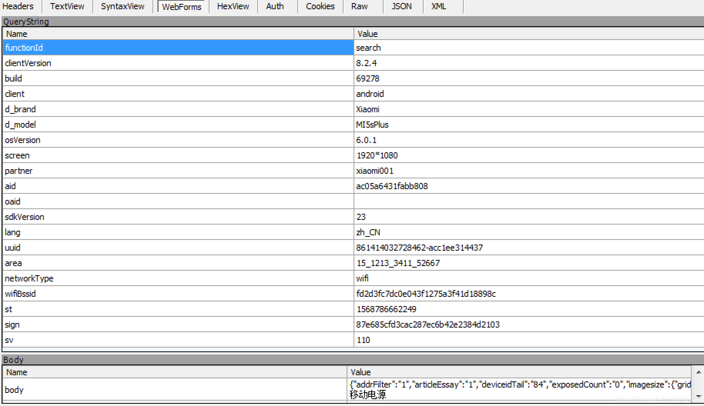

# 京东 APP SIGN算法分析

针对同一款商品进行两次访问，发现唯一的不同只有st、sv、sign三个数值, st是当前时间，sv代表选了哪一种算法，sign是计算后的最终签名。

反编译APK代码一步一步跟踪到具体的SIGN计算方法，发现最终的调用的是一个SO文件的Native方法，进一步反编译SO文件，没想到SO文件竟然还被加了壳。

对SO文件脱壳后，选择其中一个SV计算方式，对SIGN计算逻辑进行分析，用JAVA对该方法进行重写，测试结果可以正常获取到返回的数据。