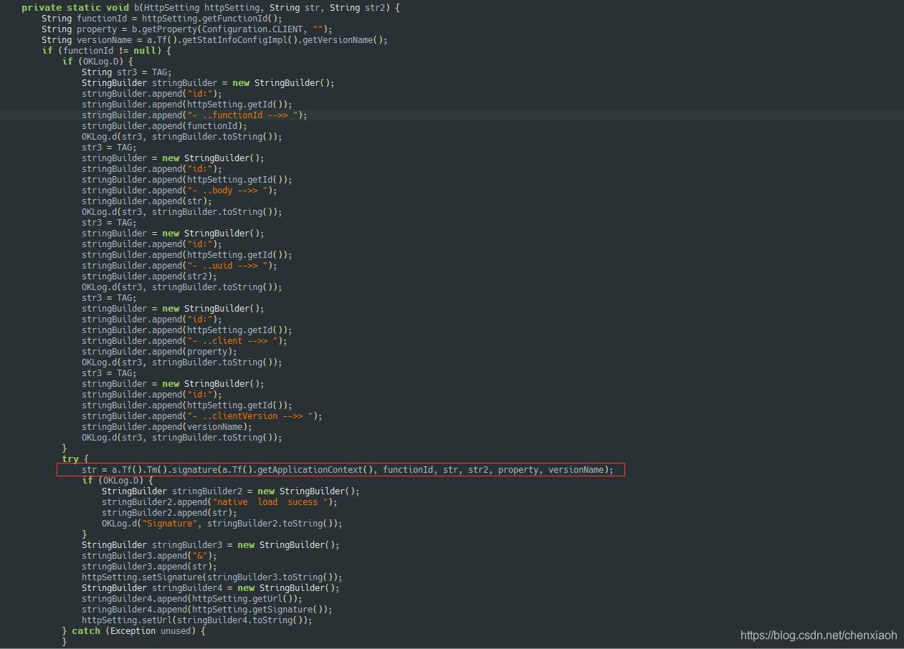
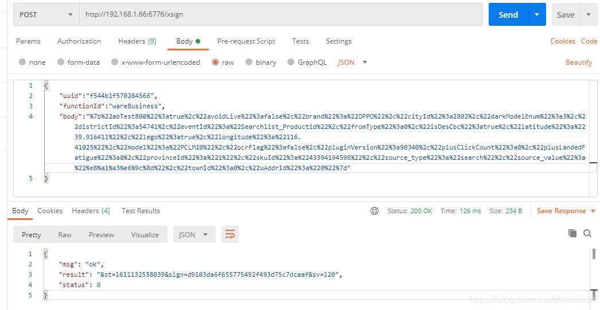

# 手机京东app sign st sv 签名 9.3.4版本签名算法分析

最近需要调用京东app的接口，发现接口需要3个签名的参数 st sign sv 这三个参数，下面记录分析过程

```bash
POST /client.action?functionId=wareBusiness&clientVersion=9.3.4
&build=86388
&client=android
&d_brand=OPPO
&d_model=PCLM10
&osVersion=5.1.1
&screen=1920*1080
&partner=jlhdqj07
&aid=29654a32a62e4040916d94edd68e988d
&oaid=
&eid=eidAd8534121d2l53756a5f6563e12f43936c7c5d0ac949ad0bab82bcQaVmcrr5ta4ENkpLK/rDDXSaMUft4jw+X916TTkXog1lIE6JpsFZcXsuVJi&sdkVersion=22&lang=zh_CN
&uuid=f544b1f570284566
&eu=8363531363630323234393337343
&fv=93D2030383134636833613736673
&area=1_2802_54741_0
&networkType=wifi
&wifiBssid=unknown
&st=1610617469025
&sign=a8a7e2871652f63cf6c5de8963663bbd
&sv=111

Cookie: whwswswws=pamzV7tC22V+zIdRAmywyP/fGLLVShSML44PBuR/fBY4pwBBpP24Toa/LCxz5+0XALSmW+gsri7uQACIa3FUzAPmyUWb3IuPQwFb/CK1pQoCFsLVlh7ilZXQ/l2aljn2p;unionwsws={"devicefinger":"eidA2c1081229fsbSbnhfsVNSTWm9vFuEXnuPEm54vXFjwehdj9tPjmw6HsfFUk+RO0d53ZXVp9Pfi2cKcb7TAMWn3j7LUxKnG+FEZFBKrTm9r2XSfpM","jmafinger":"pamzV7tC22V+zIdRAmywyP\/fGLLVShSML44PBuR\/fBY4pwBBpP24Toa\/LCxz5+0XALSmW+gsri7uQACIa3FUzAPmyUWb3IuPQwFb\/CK1pQoCFsLVlh7ilZXQ\/l2aljn2p"};
Charset: UTF-8
host: api.m.jd.com
Connection: Keep-Alive
jdc-backup: whwswswws=pamzV7tC22V+zIdRAmywyP/fGLLVShSML44PBuR/fBY4pwBBpP24Toa/LCxz5+0XALSmW+gsri7uQACIa3FUzAPmyUWb3IuPQwFb/CK1pQoCFsLVlh7ilZXQ/l2aljn2p;unionwsws={"devicefinger":"eidA2c1081229fsbSbnhfsVNSTWm9vFuEXnuPEm54vXFjwehdj9tPjmw6HsfFUk+RO0d53ZXVp9Pfi2cKcb7TAMWn3j7LUxKnG+FEZFBKrTm9r2XSfpM","jmafinger":"pamzV7tC22V+zIdRAmywyP\/fGLLVShSML44PBuR\/fBY4pwBBpP24Toa\/LCxz5+0XALSmW+gsri7uQACIa3FUzAPmyUWb3IuPQwFb\/CK1pQoCFsLVlh7ilZXQ\/l2aljn2p"};
Accept-Encoding: gzip,deflate
Cache-Control: no-cache
Content-Type: application/x-www-form-urlencoded; charset=UTF-8
Content-Length: 674
User-Agent: okhttp/3.12.1
body={"abTest800":true,"avoidLive":false,"brand":"OPPO","cityId":2802,"darkModelEnum":3,"districtId":54741,"eventId":"Searchlist_Productid","fromType":0,"isDesCbc":true,"latitude":"39.916411","lego":true,"longitude":"116.41025","model":"PCLM10","ocrFlag":false,"pluginVersion":90340,"plusClickCount":0,"plusLandedFatigue":0,"provinceId":"1","skuId":"43394194598","source_type":"search","source_value":"衣服","townId":0,"uAddrId":"0"}
1234567891011121314151617181920212223242526272829303132
```

老手法jadx打开，经过一顿搜索，找到签名的地方

a.Tf().Tm().signature(a.Tf().getApplicationContext(), functionId, str, str2, property, versionName);
这就是签名的地方，传app对象，请求url的functionId+请求的body+请参数的uuid，进去签名，返回st sign sv 参数

把签名的参数拼接在url就可以去调用了

技术支持 + 接口测试

联系qq: 980436963