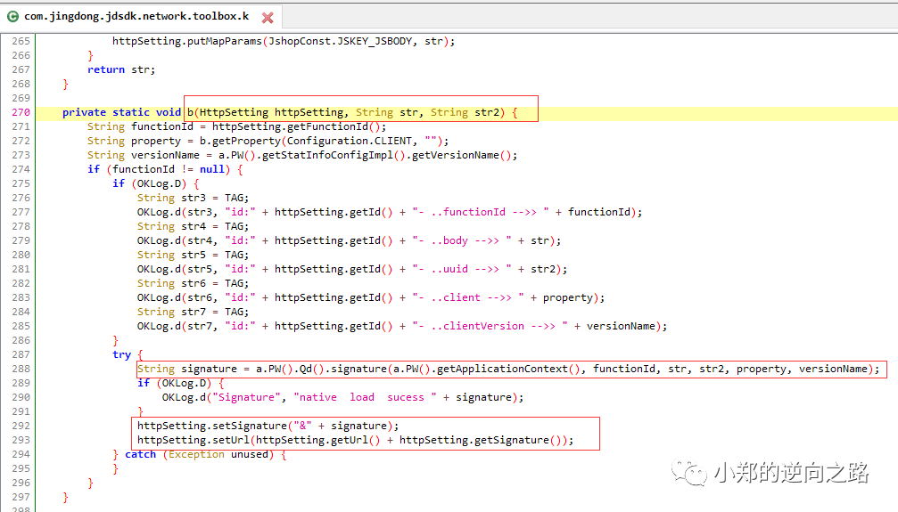

# 抓包实时打印_某东直播弹幕实时抓取

这次案例用的版本是9.2的，9.2以后的版本有frida检测。

## 1.抓包，查找sign

对于已经拿到sign只想看弹幕的部分直接跳到4。

用的抓包工具是HttpCanary，随便进入一间直播间，可以看到弹幕走的是websocket，携带的url参数token来自于下面post返回的结果，经过分析只有st,sign,sv三个参数会变，其余都不变。


既然分析完了，那就从sign开始入手。当时我找这个sign找了一会没找出来，由于sign会跟其它参数拼接成url，所以我就搜其它参数wifiBssid，搜出来很明显就在第一个。


这里hook这个getReportString方法，把它的调用堆栈打印出来，然后去查看。


这里我就直接贴出来了，省得大家浪费时间去找，眼尖的可以看到里面有signature，不就跟我们要的sign很像吗，这里把b方法三个参数hook打印一下，



进到signature这个方法，可以看到这只是接口，那就搜索这个类，看它在哪里被实现。


被getSignFromJni方法实现了，再深入看一下，可以看到加密过程在so里面。


这里就直接hook这个函数打印参数，多调用几次，然后跟抓到的数据做对比，看哪些参数不变。经过我的测试，这些参数不用修改，可以直接拿过来用，而且都是string类型的，也不用做什么类型转换。返回值的st，sign，sv都是组成url需要的参数，而且这里的参数v3是post的body的值。


## 2.使用rpc进行调用

这里就直接使用rpc进行调用就可以了，根据它的参数照搬就可以了。


```
import frida
import json
 
rpc_sign = """
rpc.exports = {
    getsign: function(function_id, body_string, uuid){
      var sig = "";
      Java.perform(
        function(){
            //拿到context上下文
            var currentApplication = Java.use('android.app.ActivityThread').currentApplication();
            var context = currentApplication.getApplicationContext();
            var BitmapkitUtils = Java.use('com.jingdong.common.utils.BitmapkitUtils');
 
            sig = BitmapkitUtils.getSignFromJni(context, function_id, body_string, uuid, 'android', '9.2.0');
        } 
      )
       return sig;
    }
};
 
"""
 
def get_sign(function_id, body_string, u):
    process = frida.get_remote_device().attach('com.jingdong.app.mall')
    script = process.create_script(rpc_sign)
    script.load()
    sign = script.exports.getsign(function_id, body_string, u)
    return sign
 
body_data = {"appId":"jd.mall","content":"tbV8seY199tCdw6GllmkWyCNNENuGsgwLByA7svt5HbPXvlI9wQhHMk3dT7f0ldfpq6M0MCiUD+A\nVrY390Yct0FSub03INUml9n1bS9rZSF3XT0q1kQdehKPO4CccMiEA6NQXYiqYn9wLsDDYEIjmkVA\nEbXI88CwO0K7uhwemdhQMZrcIFj6jMmyiDNDxSA1OjFw88hR0oSCF0m8ll9o9iU2MVSHDipF5ZDn\nFR4E+82mwfRYIxamafB+nWG8GuHcKhiQOWGbChTcG3TxcGT053wfcc6uuMD7+L4PcsNRQjM9syFc\nXR6FBu/sCV/kH/3rT8w/m3zV1c9JpW9lq/7WVzCVvAIj7RNt2zzYFisymCE="}
body_string = json.dumps(body_data, ensure_ascii=False).replace(" ", "")
function_id = 'liveauth'
u = '-a08d16f38776'
sign = get_sign(function_id, body_string, u)
print(sign)
```


```
import asyncio
import logging
from datetime import datetime
from aiowebsocket.converses import AioWebSocket
import LiveBarrage
import json
 
async def startup(uri):
    async with AioWebSocket(uri) as aws:
        converse = aws.manipulator
        # 客户端给服务端发送消息
        a = {
            "aid": "dongdong",
            "body": {"ext":
                        {"appid":"jd.mall",
                        "entrace":"6",
                        "ver":"1.1"},
                    "groupid":"3092724", # 这个是房间号
                    "nickName":"神秘观众",
                    "type":"join_live_broadcast"},
            "from":{"app":"jd.live",
                    "clientType":"android",
                    "dvc":"-a08d16f38776",
                    "pin":""},
            "id":"df09a645-8e9b-4aad-b699-d44753ca8738",
            "type":"chat_group_message",
            "ver":"9.3.2"
        }
        # 把json转换为字符串
        body_string = json.dumps(a, ensure_ascii=False).replace(" ", "")
        # print(body_string)
        await converse.send(body_string)
        while True:
            mes = await converse.receive()
            # 设置编码
            mes = mes.decode('utf8')
            # nickName是用户名，判断nickName可以过滤非弹幕消息
            if 'nickName' in mes:
                print('{time}-Client receive: {rec}'
                    .format(time=datetime.now().strftime('%Y-%m-%d %H:%M:%S'), rec=mes))
 
if __name__ == '__main__':
    token = LiveBarrage.token()  # 这里返回的是post请求后拿到的token
    #remote = 'wss://api.bbxapp.vip/v1/ifcontract/realTime'
    print(token)
    try:
        asyncio.get_event_loop().run_until_complete(startup(token))
    except KeyboardInterrupt as exc:
        logging.info('Quit.')

```

结果：

```

st=1608288325570&sign=bf449b04f88afea4c08e18006127cace&sv=121

```

## 3.构造请求拿到认证

上面只是拿到了sign，还得拼接url进行请求，这里就不展示了，要的参数基本都有了，其它不变的参数照搬就行，我就直接post请求拿结果了。

```

{'code': 0, 'msg': '鉴权成功', 'data': {'liveUrl': 'wss://live-ws4.jd.com', 'token': 'amQubWFsbF_muLjlrqJfOTMxMTE0MzY4NDNfMTYwODI3OTE4NzA5NGxTNkViVw=='}}

```

## 4.建立WebSocket

保存刚才请求websocket，打开可以看到它请求的参数。

```

{  "app": "com.jingdong.app.mall",  "host": "live-ws4.jd.com",  "remoteIp": "106.39.169.212",  "remotePort": 443,  "sessionId": "c77ac6e9-019d-4ac9-8611-92f24eb29851",  "time": "2020-12-19 23:48:18",  "url": "wss://live-ws4.jd.com/?token\u003damQubWFsbF_muLjlrqJfMjg5NDU0ODc3NDZfMTYwODI3Mjg5ODE0NFdSb0xibw\u003d\u003d"}

```

怎么建立WebSocket连接呢？

这里就需要用到python的aiowebsocket库。

详细的说明和使用方法请看：https://zhuanlan.zhihu.com/p/82089648

代码如下：

```
import asyncio
import logging
from datetime import datetime
from aiowebsocket.converses import AioWebSocket
import LiveBarrage
import json
 
async def startup(uri):
    async with AioWebSocket(uri) as aws:
        converse = aws.manipulator
        # 客户端给服务端发送消息
        a = {
            "aid": "dongdong",
            "body": {"ext":
                        {"appid":"jd.mall",
                        "entrace":"6",
                        "ver":"1.1"},
                    "groupid":"3092724", # 这个是房间号
                    "nickName":"神秘观众",
                    "type":"join_live_broadcast"},
            "from":{"app":"jd.live",
                    "clientType":"android",
                    "dvc":"-a08d16f38776",
                    "pin":""},
            "id":"df09a645-8e9b-4aad-b699-d44753ca8738",
            "type":"chat_group_message",
            "ver":"9.3.2"
        }
        # 把json转换为字符串
        body_string = json.dumps(a, ensure_ascii=False).replace(" ", "")
        # print(body_string)
        await converse.send(body_string)
        while True:
            mes = await converse.receive()
            # 设置编码
            mes = mes.decode('utf8')
            # nickName是用户名，判断nickName可以过滤非弹幕消息
            if 'nickName' in mes:
                print('{time}-Client receive: {rec}'
                    .format(time=datetime.now().strftime('%Y-%m-%d %H:%M:%S'), rec=mes))
 
if __name__ == '__main__':
    token = LiveBarrage.token()  # 这里返回的是post请求后拿到的token
    #remote = 'wss://api.bbxapp.vip/v1/ifcontract/realTime'
    print(token)
    try:
        asyncio.get_event_loop().run_until_complete(startup(token))
    except KeyboardInterrupt as exc:
        logging.info('Quit.')

```

运行结果如下：


可以看到是实时抓取的，到这里就结束了。

## 5.其它接口

这个app的接口参数都是一样的，不同的接口由functionId这个参数决定的。


这里我就把其它的接口名发出来，就省得大家去找了。然后post的参数hook查看一下照搬就可以了。

搜索search

商品评价列表getCommentListWithCard

问答getQuestionList

直播带货商品liveCartDetail

弹幕liveauth

相关资源：[HttpCanary.apk.zip](https://download.csdn.net/download/u011701060/12302100?spm=1001.2101.3001.5697)