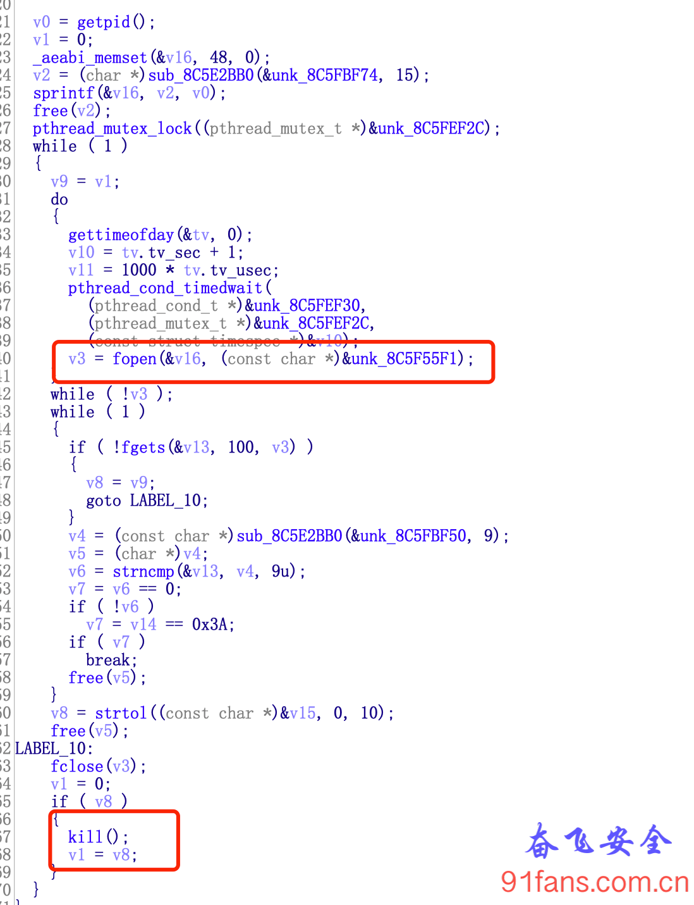
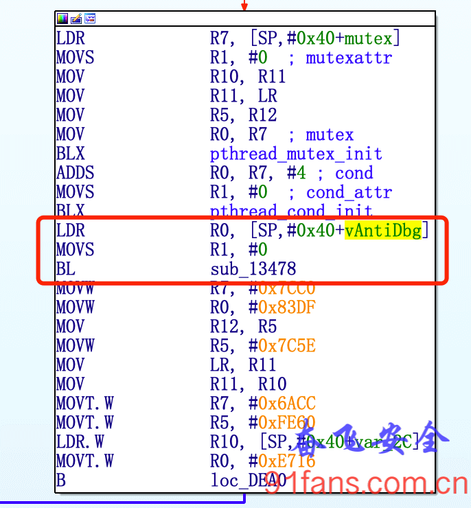
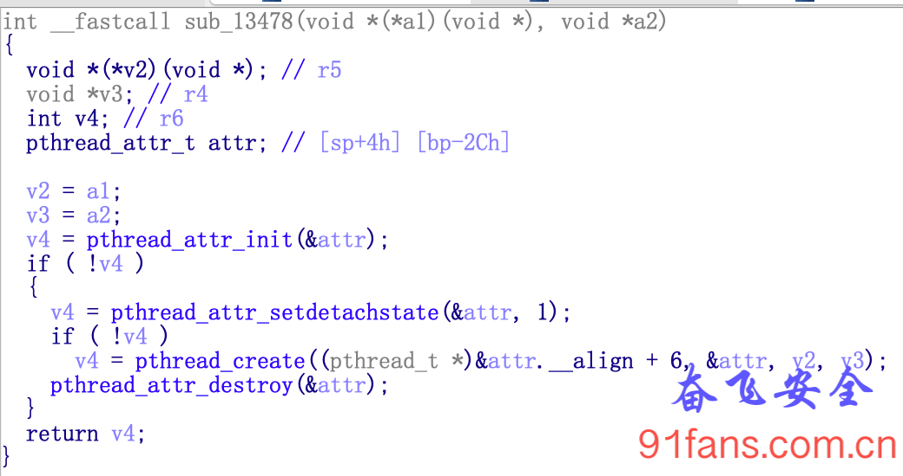
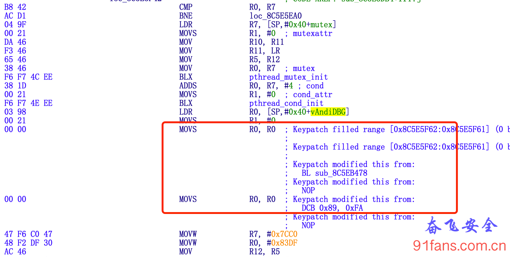
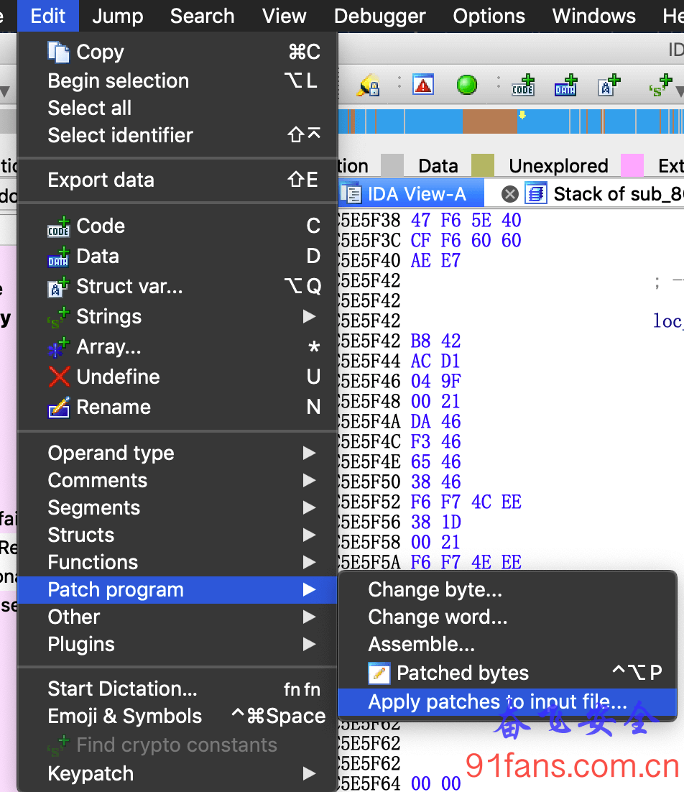

# 某电商App反反调试

## 一、目标

经过两篇文章的分析，今天计划来还原一下某电商App的sign算法，按照 [Ida动态调试so](http://91fans.com.cn/post/idadbg/) 的步骤挂上ida，Duang…… ida飞了。看来某电商App有反调试，干反调试嘛，奋飞最有经验了。

## 二、步骤

给 **fopen，mmap，time，gettimeofday** 等等等下断点，然后慢慢分析，迅速(其实花了一晚上)定位到了这里

1:antidbg

通过fopen打开/proc/self/status，检测tracerid，正常情况下 Tracerid 的值是0，非正常情况下(被调试了)Tracerid的值是非0。

要躲开这个反调试检测，大概有以下三种方案：

1. **究极方案** : 修改Android源码，重新编译内核，让Tracerid的值永远是0。
2. **折腾方案** : 逆向修改内核文件，patch二进制文件
3. **偷懒方案** : hook fgets 函数，检测/proc/pid/status调用。

Android编译我还没有研究过，patch内核文件嘛，网上也没有找到我的测试机的例子。只好试试偷懒的方案了。

```js
//干掉 TracerPid
function hook_fgets() {

    var fgets_ptr = Module.findExportByName('libc.so', 'fgets');
    var fgets = new NativeFunction(fgets_ptr, 'pointer', ['pointer', 'int', 'pointer']);

    Interceptor.replace(fgets_ptr, new NativeCallback(function (buffer, n, fileStream) {
        var ret = fgets(buffer, n, fileStream);
        var line = buffer.readUtf8String();
        if (line.indexOf('TracerPid') != -1) {
            console.error("hook_fgets '" + line + "'");
            buffer.writeUtf8String("TracerPid:\t0\n");

			// console.log('RegisterNatives called from:\n' +
			// 	Thread.backtrace(this.context, Backtracer.ACCURATE)
		    //     .map(DebugSymbol.fromAddress).join('\n') + '\n');

        } else {
            // console.log("hook_fgets '" + line + "'");
        }
        return ret;
    }, 'pointer', ['pointer', 'int', 'pointer']));
}
```

先挂起心爱的frida，顺利打印出日志。 再挂上老当益壮的ida，顺利断到了目标函数。 收工。

## 三、继续

李老板过来了，老板说：奋飞呀，这么玩不行，调个程序得挂上两个调试器，你不累手机还累呢，想想办法，再搞的完美点。

唉，打工人得努力工作，老板才能过上他想要的生活。没办法，继续打开ida，分析谁调用了这个 AntiDbg 函数。

从ida的交叉参考里面找到这里

1:call1

进到 **sub_13478** 看一眼，很明显的就是启动一个线程

1:call2

找到位置就好办了，BL sub_13478 指令是4个字节，这里我们用两条 MOVS R0,0 指令来替代

1:call3

然后保存修改，

1:patch

重新把修改后的 libJDMobileSec.so 文件替换回去

```bash
# 有些人的机器在 /data/app-lib/com.jingdong.app.mall-1 文件夹
adb push libJDMobileSec.so /data/data/com.jingdong.app.mall/lib
```

最后挂上ida，完美，收工