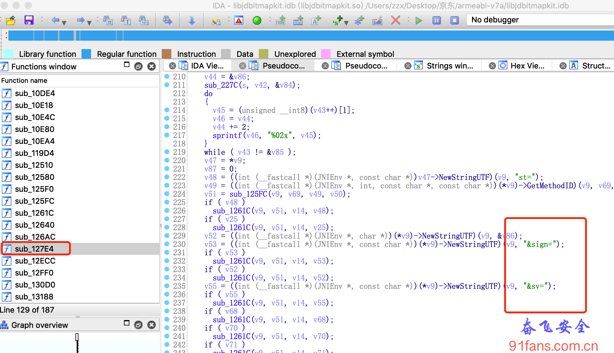

# 某电商App签名算法解析(一)

## 一、目标

我们来分析某电商App的sign签名算法，先搜索一个商品，抓包结果:

1:charles

## 二、步骤

### sign是32位的字符串，从长度上看，很像md5，我们先用jadx全局搜索 sign=

1:jadx1

一共十几个结果，一个一个去hook肯定不现实，我们点进去分析代码找到了这个部分:

1:jadx2

这就简单了，我们在源头拦住，直接hook javax.crypto.spec.SecretKeySpec 相关的函数:

```js
var secretKeySpec = Java.use('javax.crypto.spec.SecretKeySpec');
secretKeySpec.$init.overload('[B','java.lang.String').implementation = function (a,b) {
	var result = this.$init(a, b);
    console.log(">>> 算法名" + b);
    return result;
}
```

挂上我们心爱的frida跑着，Duang…… 某电商App挂了，白屏，偶尔还重启。看来是监测到了被搞了。

之前看雪上读到过一篇检测 **frida** 的文章(参考链接在文末)。这里我们做了如下两步来反检测:

1. **更名:** 将frida-server改名为fenfeiserver
2. **改端口:** 手机里面用 fenfeiserver -l 127.0.0.1:8080 来启动; 电脑里面先映射 adb forward tcp:8080 tcp:8080; 然后启动 frida -H 127.0.0.1:8080 -l jd.js com.jingdong.app.mall

输出结果:

```bash
>>> 算法名HmacSHA256
mac ======================================
算法名：HmacSHA256
mac ======================================
doFinal参数:yingyan&{"msg":[{"appId":"","clientVersion":"9.2.2","buildCode":"85371","uuid":""}]}&85&android&9.2.2&xiaomi&Redmi 6A&uvReport&8.1.0&lc029&jd_AjVDrKGR&1344*720&27&1605345127514&xx-xx
doFinal结果(hex):3ac0a00ed48d8fffadef281d97b970c13b3c8dec06d685ae0d62615f28c7751b
```

其实从字面上也能看出这不是我们要的结果，SHA256的结果是64位的字符串，而我们需要的sign是32位的。

怎么办？ 把jadx里面能搜到的sign hook了遍都没有找到，只好从http请求下手了。

### 我们hook http请求，找到sign所在的请求，然后打出堆栈信息

```js
var OkHttpClient = Java.use("okhttp3.OkHttpClient");

OkHttpClient.newCall.implementation = function (request) {
	var result = this.newCall(request);
    console.log(request.toString());

    var stack = threadinstance.currentThread().getStackTrace();
    console.log("http >>> Full call stack:" + Where(stack));

    return result;
};
```

输出结果

1:http

很明显这个http请求是我们的目标，但是这个堆栈没有给我们有用的提示，这应该是启动了一个新的线程来做的http请求，所以组装参数的函数没有体现在这里。

### 下面用一个比较猥琐的办法，hook currentTimeMillis

我们仔细观察一下，请求里面有个 st=1605338355285 换算一下正好是当前的时间戳，那么我们hook java获取当前系统时间函数，然后找到和http请求里面相同的时间，再打印出堆栈，不就可以找到组装参数的地方了嘛

```js
var SystemClass = Java.use('java.lang.System');
SystemClass.currentTimeMillis.implementation = function(){
	var result = this.currentTimeMillis();
	console.log("==== " + result + " ====");
	return result;
}
```

结果还是令人沮丧，没有和http请求里面的值相同的时间戳，看来要么app并没有用currentTimeMillis函数，要么就是在so层把活偷偷的干了。

### 在so文件里面搜索 sign=

这次前方传来好消息

Binary file ./libjdbitmapkit.so matchse

看来有可能是这哥们干的，拖进ida伺候。

1:ida

找到它的调用者 Java_com_jingdong_common_utils_BitmapkitUtils_getSignFromJni,它应该就是目标了，hook之:

```js
var checkHookG = Java.use('com.jingdong.common.utils.BitmapkitUtils');
checkHookG.getSignFromJni.implementation = function(a,b,c,d,e,f){
	var result = this.getSignFromJni(a,b,c,d,e,f);
	console.log(">>> checkHookG = " + b + ' / ' + c + ' / ' + d + ' / ' + d + ' / ' + f + ' \n rc= ' + result);
	return result;
}
```

1:rc

逮住了，就是它，收工。

## 三、总结

sign的查找要多方尝试，除了直接了当的找sign还可以从它的兄弟参数入手。

参考链接： https://bbs.pediy.com/thread-217482.htm 多种特征检测 Frida

###### Tip:

本文的目的只有一个就是学习更多的逆向技巧和思路，如果有人利用本文技术去进行非法商业获取利益带来的法律责任都是操作者自己承担，和本文以及作者没关系，本文涉及到的代码项目可以去 奋飞的朋友们 知识星球自取，欢迎加入知识星球一起学习探讨技术。有问题可以加我wx: fenfei331 讨论下。