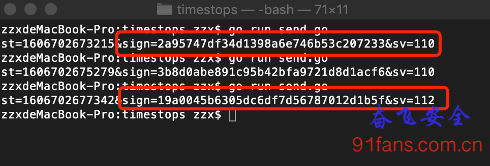
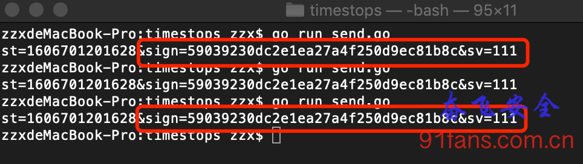

# 算法还原的助手(一) 先让时间停下来

## 一、目标

**时间静止** 。这是使用奥特念力所拓展出来的特别能力，能让生物短暂的停止行动，就好像时间停止了一样，我们在爱迪奥特曼身上，也同样见识过。

在还原算法的时候，有个讨厌的情况,我们一模一样的参数进去，算出来的结果每次都不一样:

1:rc1

这种干扰项极大的影响了我们还原算法时的心情。

###### Tip:

frida修改函数返回参数的值和函数返回值

## 二、分析

干扰项分为2种，一种是当前的时间戳，另一种就是随机函数了。本例中使用的是gettimeofday和lrand48

函数原型： **int gettimeofday(struct timeval\*tv, struct timezone \*tz);**

其参数 tv 是保存获取时间结果的结构体，参数 tz 用于保存时区结果：

```c
struct timezone{
    int tz_minuteswest;	/* 格林威治时间往西方的时差 */
    int tz_dsttime;		/* DST 时间的修正方式 */
}
```

timezone 参数若不使用则传入NULL即可。

而结构体timeval的定义为：

```c
struct timeval{
    long int tv_sec; // 秒数
    long int tv_usec; // 微秒数
}
```

所以我们需要把 tv 参数的值写成定值就行，

lrand48函数就比较简单: **int lrand48(void)** , 我们只需要修改它的返回值就行。

我们先从 gettimeofday 开始:

```js
var outbufferptr = 0;
Interceptor.attach(Module.findExportByName("libc.so" , "gettimeofday"), {
	onEnter: function(args) {
		outbufferptr = args[0];
     },
    onLeave:function(retval){
		console.log("---- base ---- ");
		console.log(hexdump(outbufferptr, { length: 8, ansi: true }));
		Memory.writeByteArray(outbufferptr,[0x91,0x50,0xc4,0x5f,0x15,0x97,0x09,0x00]);
		console.log("---- modify ---- ");
		console.log(hexdump(outbufferptr, { length: 8, ansi: true }));
    }
});
```

在32位系统下，struct timeval 的前4个字节为秒数 0x9150c45f 转成 十进制是 1606701201 ，后4个字节是微秒数。

挂上心爱的frida跑起来，程序挂了……

1:gua

为什么？ 因为我们把这个App全局的时间都给定死了，它很多正常的需要当前系统时间的逻辑都跑不通了，自然崩溃以对了。

看来不能这么玩，我们只要分析指定的算法，那么我们在算法入口的时候设置一个开关，进入算法的时候打开，算法跑完就关。

```js
var gModifyTime = false;
var gModifyRand = false;

var checkHookG = Java.use('com.xxx.xxx.xxx');
checkHookG.getSignFromJni.implementation = function(a,b,c,d,e,f){
    // 判断是我们要分析的参数进来，就打开开关
    if(c.indexOf('100008667315') > 0 && c.indexOf('asynInteface')>0){
        gModifyTime = true;
        gModifyRand = true;
    }

    var result = this.getSignFromJni(a,b,c,d,e,f);
    gModifyTime = false;
    gModifyRand = false;

    return result;
}


var outbufferptr = 0;
Interceptor.attach(Module.findExportByName("libc.so" , "gettimeofday"), {
    onEnter: function(args) {
        if (gModifyTime){
                outbufferptr = args[0];
        }
    },
    onLeave:function(retval){
        if (gModifyTime){
                console.log("---- base ---- ");
                console.log(hexdump(outbufferptr, { length: 8, ansi: true }));
                Memory.writeByteArray(outbufferptr,[0x91,0x50,0xc4,0x5f,0x15,0x97,0x09,0x00]);
                console.log("---- modify ---- ");
                console.log(hexdump(outbufferptr, { length: 8, ansi: true }));
                gModifyTime = false;
        }
    }
});

Interceptor.attach(Module.findExportByName("libc.so" , "lrand48"), {
    onEnter: function(args) {
    },
    onLeave:function(retval){
        console.log("lrand48 called!" + retval.toInt32());
        if (gModifyRand){
                retval.replace(1);
        }
    }
});
```

好了，这次可以愉快的分析了

1:rcok

## 三、总结

分析完一轮之后就把写死的时间更新一下，不然时间太滞后了，可能会触发其他的风控。