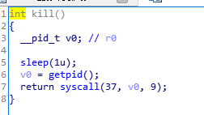
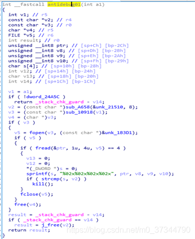
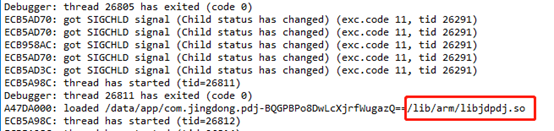

# 某东到家app 签名算法分析

自参加实习以来很久没写过博客了，闲来无事更新一下，这是一篇水文，参加面试的一道题目，要求就是分析一下某东到家的其中一个签名算法（signKeyV1），复原算法，过程中要求要用动态调试，native层有混淆，有反调试，虽然比较水，但总比没得更新得好（最近比较无聊）。

### 1.java层分析

直接打开jadx，拖进apk，开始分析，搜索signKeyV1，直接拿到出处。

通过native Method k2 计算 signKeyV1；
public static native String k2(byte[] bArr); 在 [libjdpdj.so](http://libjdpdj.so/) 里
JNI_OnLoad:


易得 k2 nativefunc的地址。
通过静态分析，流程大致如下：
（1）先通过getsign函数获取应用签名，对key 赋值
（2）对key进行简单运算赋值，当作hmac_sha256算法的密钥
（3）对输入的字符串（json）除最后33位之外的部分进行hmac_sha256
（4）返回hmac_sha256算法结果
算法恢复如下（java）：


```
import javax.crypto.Mac;
import javax.crypto.spec.SecretKeySpec;

public class Main {
    public static char[] key = "18c05fdbef008d61f2e8fce4ef4457a6".toCharArray();


    public static void main(String[] args){
        String message = "Paidaojia&6.0.3&{\"code\":\"pdj\",\"platform\":\"ANDROID\",\"version\":\"V6.0.3.0\"}&Android&Ucllq&1&7a888c1c17b0b5069664a46a224ffaaf&AOSP on msm8&7a888c1c17b0b5069664a46a224ffaaf&Android&317b83d0a0fa8f16&39.983418&116.490746&WIFI&Ucllq&android&9&1080*1794&48fdecc964b45d323a6217f2300ee4e7&6.0.3.0&1540906186844&7a888c1c17b0b5069664a46a224ffaaf1540906163568";
        for(int i = 0; i < 33; i++){
            message += ' ';
        }
        System.out.println("Message content:" + message+", len:" + message.length());
        String result = gk2(message.getBytes());
        System.out.println("result:"+result);
    }

    public static  String gk2(byte[] input){
        System.out.println("key.Len = " + key.length);
        boolean keyFlag = false;
        if(key[0] == 49){
            keyFlag = true;
        }
        int inputLen = input.length;
        if(inputLen < 33){
            System.out.println("{+}------ error -------{+}");
        }else {
            char t1, t2, t3, t4, t5, t6;
            int signStart = inputLen - 33;
            if(keyFlag){
                t1 = 48;
                t2 = 1;
                t3 = (char) (key[25] - 3);
                t4 = (char) -43;
                t5 = (char) (key[26] + 2);
                t6 = (char) -1;
                input[signStart] = (byte) (key[0] +5);
                input[signStart + 1] = (byte) (key[1] - 7);
                input[signStart + 2] = (byte) key[2];
                input[signStart + 3] = (byte) (key[3] + 52);
                input[signStart + 4] = (byte) key[4];
                input[signStart + 5] = (byte) (key[5] - 54);
                input[signStart + 6] = (byte) (key[6] - 3);
                input[signStart + 7] = (byte) (key[7] - 50);
                input[signStart + 8] = (byte) (key[8] - 2);
                input[signStart + 9] = (byte) key[9];
                input[signStart + 10] = (byte) (key[10] + 3);
                input[signStart + 11] = (byte) (key[11] + 8);
                input[signStart + 12] = (byte) (key[12] - 4);
                input[signStart + 13] = (byte) (key[13] - 47);
                input[signStart + 14] = (byte) (key[14] - 1);
                input[signStart + 15] = (byte) (key[15] + 7);
                input[signStart + 16] = (byte) (key[16] - 5);
                input[signStart + 17] = (byte) (key[17] + 52);
                input[signStart + 18] = (byte) (key[18] - 1);
                input[signStart + 19] = (byte) (key[19] + 42);
                input[signStart + 20] = (byte) (key[20] - 47);
                input[signStart + 21] = (byte) (key[21] - 50);
                input[signStart + 22] = (byte) (key[22] - 49);
                input[signStart + 23] = (byte) (key[23] - 3);
                input[signStart + 24] = (byte) (key[24] - 53);

            }else{
                t1 = 1;
                t2 = (char) -46;
                t5 = key[26];
                t6 = 4;
                t3 = (char) (key[25] + 46);
                t4 = (char) -2;
                input[signStart] = (byte) (key[0] + 3);
                input[signStart + 1] = (byte) (key[1] - 51);
                input[signStart + 2] = (byte) (key[2] + 43);
                input[signStart + 3] = (byte) key[3];
                input[signStart + 4] = (byte) key[4];
                input[signStart + 5] = (byte) (key[5] - 8);
                input[signStart + 6] = (byte) (key[6] - 5);
                input[signStart + 7] = (byte) (key[7] - 49);
                input[signStart + 8] = (byte) (key[8] + 1);
                input[signStart + 9] = (byte) key[9];
                input[signStart + 10] = (byte) (key[10] - 48);
                input[signStart + 11] = (byte) (key[11] + 3);
                input[signStart + 12] = (byte) (key[12] - 50);
                input[signStart + 13] = (byte) key[13];
                input[signStart + 14] = (byte) (key[14] - 45);
                input[signStart + 15] = (byte) (key[15] - 41);
                input[signStart + 16] = (byte) (key[16] + 46);
                input[signStart + 17] = (byte) (key[17] + 54);
                input[signStart + 18] = (byte) (key[18] - 2);
                input[signStart + 19] = (byte) (key[19] + 44);
                input[signStart + 20] = (byte) (key[20] - 44);
                input[signStart + 21] = (byte) (key[21] - 49);
                input[signStart + 22] = (byte) (key[22] - 5);
                input[signStart + 23] = (byte) (key[23] - 49);
                input[signStart + 24] = (byte) (key[24] - 5);
            }
            input[signStart+26] = (byte) t5;
            input[signStart + 25] = (byte) t3;
            input[signStart + 27] = (byte) (key[27] + t2);
            input[signStart + 28] = (byte) (key[28] + t1);
            input[signStart + 29] = (byte) (key[29] - 7);
            input[signStart + 30] = (byte) (t4 + key[30]);
            input[signStart + 32] = 0;
            input[signStart + 31] = (byte) (t6 + key[31]);
        }
        byte[] messgeBytes = new byte[inputLen - 33];
        byte[] keyBytes = new byte[32];

        System.arraycopy(input,0,messgeBytes,0,inputLen - 33);
        System.arraycopy(input,inputLen-33,keyBytes,0,32);
        String message = new String(messgeBytes);
        String newKey = new String(keyBytes);
        System.out.println("Message content:" + message+", len:" + message.length());
        System.out.println("hashKey content:" + newKey+", len:" + newKey.length());
        return sha256_HMAC(message,newKey);
    }

    private static String byteArrayToHexString(byte[] b) {
        StringBuilder hs = new StringBuilder();
        String stmp;
        for (int n = 0; b!=null && n < b.length; n++) {
            stmp = Integer.toHexString(b[n] & 0XFF);
            if (stmp.length() == 1)
                hs.append('0');
            hs.append(stmp);
        }
        return hs.toString().toLowerCase();
    }

    private static String sha256_HMAC(String message, String secret) {
        String hash = "";
        try {
            Mac sha256_HMAC = Mac.getInstance("HmacSHA256");
            SecretKeySpec secret_key = new SecretKeySpec(secret.getBytes(), "HmacSHA256");
            sha256_HMAC.init(secret_key);
            byte[] bytes = sha256_HMAC.doFinal(message.getBytes());
            hash = byteArrayToHexString(bytes);
        } catch (Exception e) {
            System.out.println("{+}------ error -------{+}");
        }
        return hash;
    }
}

```

恢复的时候没多动脑筋，比较死板，凑合看吧。

### 2.进行动态验证

应用存在反调试，附加的调试进程退出前最后一个load的so为libJDMobileSec.so且通过名称判断可能为反调试所在的库。
[libJDMobileSec.so](http://libjdmobilesec.so/) 的 JNI_OnLoad 函数经过混淆，考虑到反调试的特点，重点查看fopen，mmap，time，gettimeofday等可能用于反调试的函数的交叉引用；

通过静态分析，找到偏移为0x000113B8的kill函数（重命名过）的地方：

再结合关键函数的交叉引用，大概可以确定一下两条反调试：
偏移为0x00009304的antibug01（经过重命名）

偏移为0x 0000D110的antidebug02：

猜测为 另起线程检测tracerid；当然可能存在其他反调试，因为混淆过，就不细看了。
分别在antidebug01，antidebug02，fopen，gettimeofday 函数下断点，第一次发现gettimeofday函数接连两次调用并不会产生影响，所以忽略。动态调试起来后断在fopen函数，可同步R0寄存器查看参数；

F9可到第一个反调试的地方：

检测特定端口，通过启动代理服务的修改端口可过掉。

通过LR寄存器可查看调用的地方

发现没在发现的两个函数里，可能是漏了，过掉就可以。
再F9，到了发现的antidebug02的地方，通过fopen打开/proc/self/status，检测tracerid，并发现运行在其他线程中：


可通过ida提供的Suspend thread功能暂停这个线程。
再F9，到了发现的antidebug01的地方，发现并不是反调试，然后一路F9便过完了反调试，应用正常跑起来，并加载了我们的目标的so。

然后通过动调libjdpdj.so的gk2目标函数，可验证恢复的算法是否正确，恢复正确。

### 3.用xposed/frida进行hook 算法输入

#### xposed Hook

已知这个算法是个native 函数，frida可以hook native没有问题，xposed只能hook java层，怎么办呢，我们可以用so劫持的思路，这是看雪上一个大神提出来的，我自己动手实践了一下。大概思路就是hook java层 加载native 库的api，替换路径达到劫持的目的，替换成自己的so，在自己so里实现hook功能和加载原so的逻辑。
参考： https://bbs.pediy.com/thread-223699.htm
我写了个实现so劫持Hook的demo：https://github.com/shuaihuFENG/XpSohijackDemo

#### frida hook

frida 可以hook native ，但是本例存在反调试，且时机较早，不大好写脚本，干脆自己编译了一个可过反调试的内核，网上资料挺多的就不细讲了，直接上hook 脚本。

```

import frida
import sys
rdev = frida.get_remote_device()
session = rdev.attach("com.jingdong.pdj")
scr = """
var JNi_OnloadNativePointer = Module.findExportByName("libjdpdj.so" , "JNI_OnLoad");
var hmac_sha256Pointer = Module.findExportByName("libjdpdj.so" , "hmac_sha256");


send("JNI_Onload :  nativePointer = " + JNi_OnloadNativePointer);
send("hmac_sha256Pointer :  nativePointer = " + hmac_sha256Pointer);

send("enter Hook: ");

Interceptor.attach(hmac_sha256Pointer, {
    onEnter: function(args) {
        send("enter hmac_sha256 ");
        send("input content: (" + Memory.readUtf8String(args[0])+")" );
    },
    onLeave:function(retval){
    
    }
});
"""
script = session.create_script(scr)
def on_message(message ,data):
    print (message)
script.on("message" , on_message)
script.load()
sys.stdin.read()

```

## 欢迎讨论q1254553524