# **xhs 6.73+ XYshield算法** 

本文仅供学习交流，勿作其他一切用途  最近xhs版本已更新到6.74，从6.73开始，shield计算结果都是以XY开头的字符串。之前发过一篇新版shield算法(6.73之前)，与之前重复的工作不再过多赘述。https://www.52pojie.cn/thread-1292385-1-1.html。 本贴也是基于上一篇而写。事实上，XY的计算也是基于之前的shield而得到。 首先下载最新版xhs，抓包。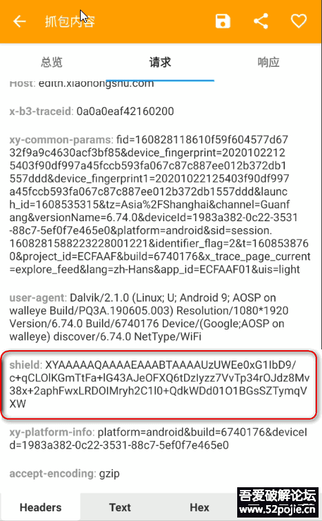可以发现，shield已不再是之前的32位哈希值，而是一串以XY开头的字符串。 通过之前的分析，我们知道shield是在libshield.so的拦截器中实现的。之前的版本中，该so中存在两个shield算法。在6.73之后则又新增了一个算法。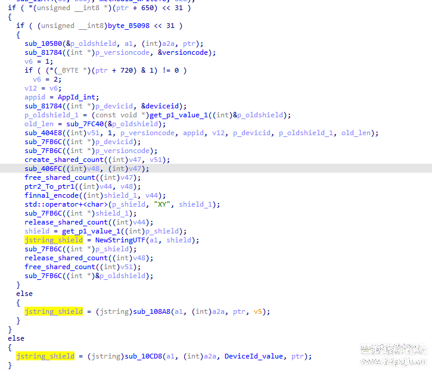后面两个分支sub_108A8和sub_10CD8对应着旧版算法，上面为新版的算法，最后在开头拼接上"XY"作为shield。 下面进入新的shield分支。在走到该分支之前，流程都和旧版一致，获取xy_ter_str计算main_hamc，拼接参数等等...所以留给我们的工作并不多。 先看第一个函数sub_105B0，第一个参数作为返回值，其余的参数与旧版计算的参数一致：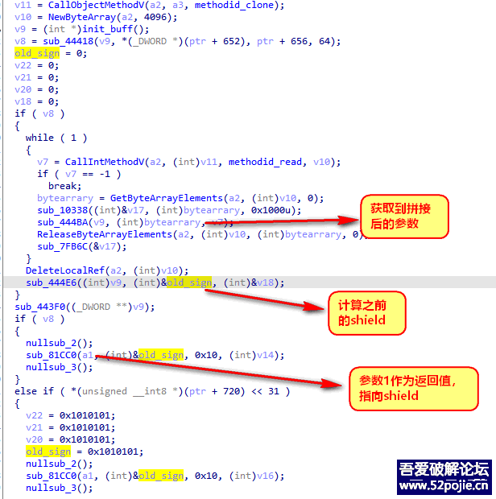如果分析过之前的版本，那么这段代码应该很熟悉，也就是6.6版本中shield计算的逻辑：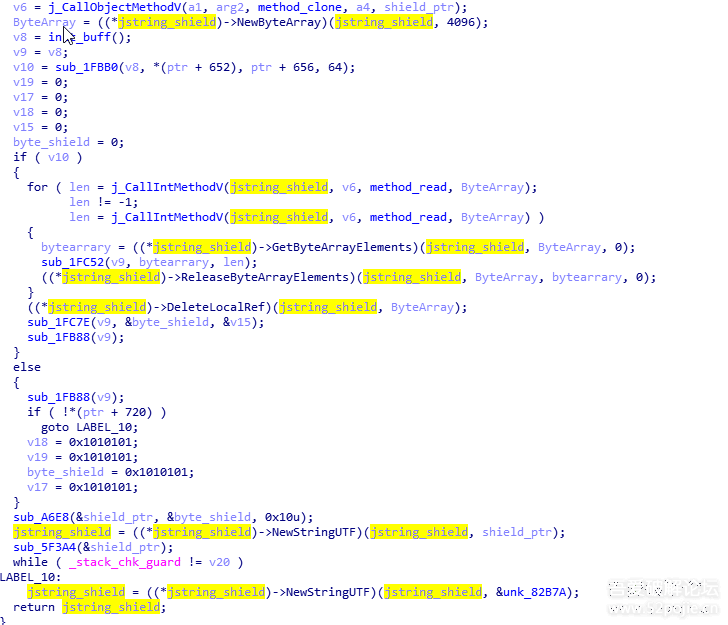只不过原先直接返回了shield的jstring对象，而在这返回值则保存在第一个参数中。 经过验证也确实如此，sub_105B0所返回的与我们之前的shield计算结果一致：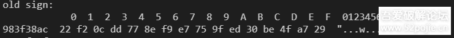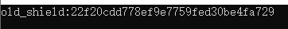拿到之前的shield之后，又拿了版本号，设备号，appId等信息：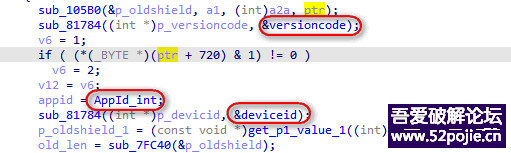这些值是在initializeNative中通过反射获取的。除了这些信息，还有ptr+720的标志，该标志在initialize中设置，获取到main_hmac则置1：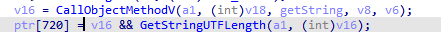最终作为sub_404E8参数：该函数作用就是对参数1指向的内容进行赋值：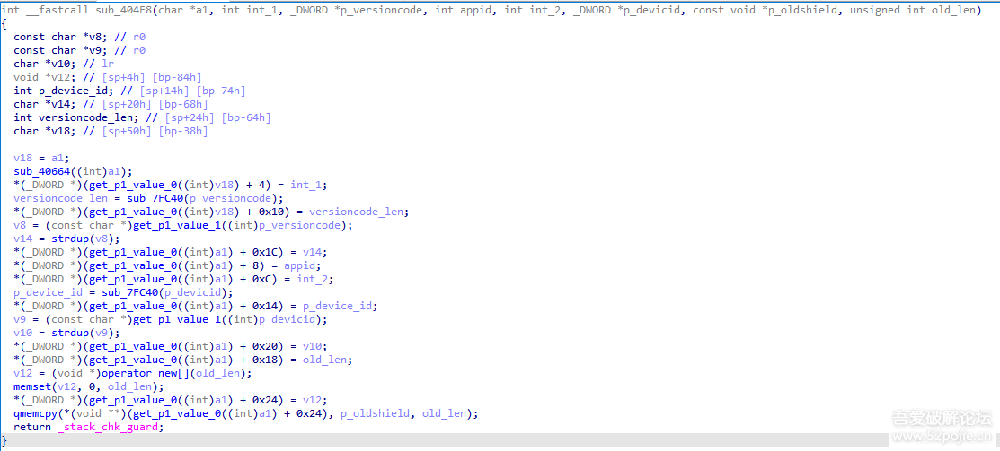参数1赋值后如下，将之前的信息构造成一个对象：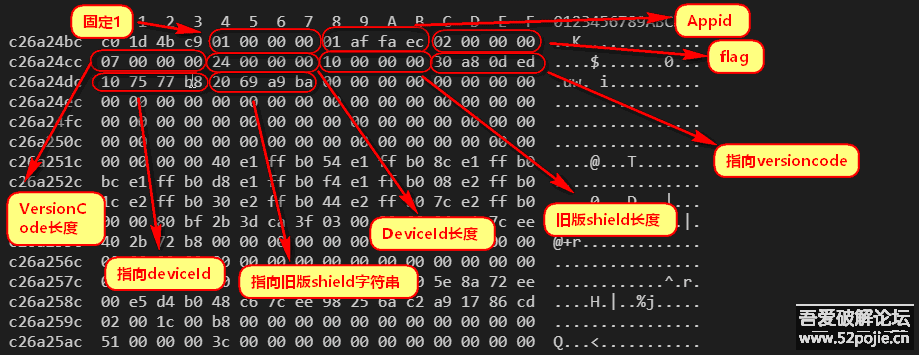接下来sub_406FC也比较类似，根据参数2给参数1赋值，而参数2就是刚才sub_404E8所返回的对象：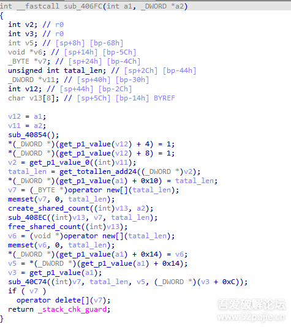赋值后的对象结构如下：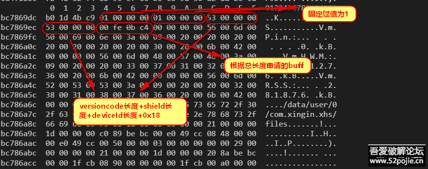其中的关键在于偏移0x14所指向的Buff。在sub_406FC中，根据计算的长度申请了两块空间v6和v7，其中v7在`sub_408EC((int)v13, v7, tatal_len);`中，用于获取并拼接之前的对象信息：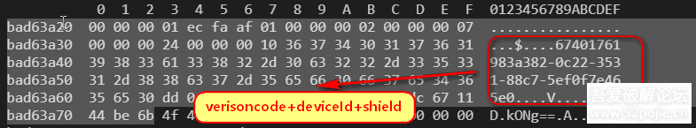之后在`sub_40C74((int)v7, tatal_len, v5, (_DWORD *)(v3 + 0xC));`中根据V7内容对buff偏移0x14所指向内容进行赋值：

```
int __fastcall sub_40C74(int a1, int a2, int a3, _DWORD *a4)
{
  char v9[1032]; // [sp+2Ch] [bp-41Ch] BYREF

  sub_4AF1C(v9, 13, "std::abort();");
  sub_4A94C(v9, a2, a1, a3);
  *a4 = a2;
  return 1;
}
```


sub_4AF1C用于初始化加密表：

```
int __fastcall sub_4AF1C(_DWORD *a1, int a2, int a3)
{
  unsigned int i; // [sp+Ch] [bp-2Ch]
  unsigned int j; // [sp+Ch] [bp-2Ch]
  _DWORD *v6; // [sp+10h] [bp-28h]
  int v7; // [sp+14h] [bp-24h]
  int v8; // [sp+14h] [bp-24h]
  int v9; // [sp+14h] [bp-24h]
  int v10; // [sp+14h] [bp-24h]
  int v11; // [sp+18h] [bp-20h]
  int v12; // [sp+18h] [bp-20h]
  int v13; // [sp+18h] [bp-20h]
  int v14; // [sp+18h] [bp-20h]
  int v15; // [sp+1Ch] [bp-1Ch]
  int v16; // [sp+1Ch] [bp-1Ch]
  int v17; // [sp+1Ch] [bp-1Ch]
  int v18; // [sp+1Ch] [bp-1Ch]

  v6 = a1 + 2;
  *a1 = 0;
  a1[1] = 0;
  LOBYTE(v7) = 0;
  v11 = 0;
  for ( i = 0; i <= 0xFF; ++i )
    v6[i] = i;
  for ( j = 0; j <= 0xFF; j += 4 )
  {
    v15 = v6[j];
    v8 = (unsigned __int8)(*(_BYTE *)(a3 + v11) + v15 + v7);
    v12 = v11 + 1;
    if ( v12 == a2 )
      v12 = 0;
    v6[j] = v6[v8];
    v6[v8] = v15;
    v16 = v6[j + 1];
    v9 = (unsigned __int8)(*(_BYTE *)(a3 + v12) + v16 + v8);
    v13 = v12 + 1;
    if ( v13 == a2 )
      v13 = 0;
    v6[j + 1] = v6[v9];
    v6[v9] = v16;
    v17 = v6[j + 2];
    v10 = (unsigned __int8)(*(_BYTE *)(a3 + v13) + v17 + v9);
    v14 = v13 + 1;
    if ( v14 == a2 )
      v14 = 0;
    v6[j + 2] = v6[v10];
    v6[v10] = v17;
    v18 = v6[j + 3];
    v7 = (unsigned __int8)(*(_BYTE *)(a3 + v14) + v18 + v10);
    v11 = v14 + 1;
    if ( v11 == a2 )
      v11 = 0;
    v6[j + 3] = v6[v7];
    v6[v7] = v18;
  }
  return _stack_chk_guard;
}
```


之后在sub_4A94C中对之前申请出的V7信息进行加密：

```
int __fastcall sub_4A94C(int *table, unsigned int len, _BYTE *ori_buff, _BYTE *res_buff)
{
  unsigned int i; // [sp+14h] [bp-3Ch]
  unsigned int v6; // [sp+14h] [bp-3Ch]
  unsigned int v7; // [sp+14h] [bp-3Ch]
  unsigned int v8; // [sp+14h] [bp-3Ch]
  unsigned int v9; // [sp+14h] [bp-3Ch]
  unsigned int v10; // [sp+14h] [bp-3Ch]
  unsigned int v11; // [sp+14h] [bp-3Ch]
  unsigned int v12; // [sp+14h] [bp-3Ch]
  int v13; // [sp+18h] [bp-38h]
  int v14; // [sp+18h] [bp-38h]
  int v15; // [sp+18h] [bp-38h]
  int v16; // [sp+18h] [bp-38h]
  int v17; // [sp+18h] [bp-38h]
  int v18; // [sp+18h] [bp-38h]
  int v19; // [sp+18h] [bp-38h]
  int v20; // [sp+18h] [bp-38h]
  int v21; // [sp+18h] [bp-38h]
  int v22; // [sp+18h] [bp-38h]
  int v23; // [sp+18h] [bp-38h]
  int v24; // [sp+18h] [bp-38h]
  int v25; // [sp+18h] [bp-38h]
  int v26; // [sp+18h] [bp-38h]
  int v27; // [sp+18h] [bp-38h]
  int v28; // [sp+1Ch] [bp-34h]
  int v29; // [sp+1Ch] [bp-34h]
  int v30; // [sp+1Ch] [bp-34h]
  int v31; // [sp+1Ch] [bp-34h]
  int v32; // [sp+1Ch] [bp-34h]
  int v33; // [sp+1Ch] [bp-34h]
  int v34; // [sp+1Ch] [bp-34h]
  int v35; // [sp+1Ch] [bp-34h]
  int v36; // [sp+1Ch] [bp-34h]
  int v37; // [sp+1Ch] [bp-34h]
  int v38; // [sp+1Ch] [bp-34h]
  int v39; // [sp+1Ch] [bp-34h]
  int v40; // [sp+1Ch] [bp-34h]
  int v41; // [sp+1Ch] [bp-34h]
  int v42; // [sp+1Ch] [bp-34h]
  int v43; // [sp+20h] [bp-30h]
  int v44; // [sp+20h] [bp-30h]
  int v45; // [sp+20h] [bp-30h]
  int v46; // [sp+20h] [bp-30h]
  int v47; // [sp+20h] [bp-30h]
  int v48; // [sp+20h] [bp-30h]
  int v49; // [sp+20h] [bp-30h]
  int v50; // [sp+20h] [bp-30h]
  int v51; // [sp+24h] [bp-2Ch]
  int v52; // [sp+24h] [bp-2Ch]
  int v53; // [sp+24h] [bp-2Ch]
  int v54; // [sp+24h] [bp-2Ch]
  int v55; // [sp+24h] [bp-2Ch]
  int v56; // [sp+24h] [bp-2Ch]
  int v57; // [sp+24h] [bp-2Ch]
  int v58; // [sp+24h] [bp-2Ch]
  int *v59; // [sp+28h] [bp-28h]

  v51 = *table;
  v43 = table[1];
  v59 = table + 2;
  for ( i = len >> 3; i; --i )
  {
    v52 = (unsigned __int8)(v51 + 1);
    v28 = v59[v52];
    v44 = (unsigned __int8)(v28 + v43);
    v13 = v59[v44];
    v59[v52] = v13;
    v59[v44] = v28;
    *res_buff = v59[(unsigned __int8)(v28 + v13)] ^ *ori_buff;
    v53 = (unsigned __int8)(v52 + 1);
    v29 = v59[v53];
    v45 = (unsigned __int8)(v29 + v44);
    v14 = v59[v45];
    v59[v53] = v14;
    v59[v45] = v29;
    res_buff[1] = v59[(unsigned __int8)(v29 + v14)] ^ ori_buff[1];
    v54 = (unsigned __int8)(v53 + 1);
    v30 = v59[v54];
    v46 = (unsigned __int8)(v30 + v45);
    v15 = v59[v46];
    v59[v54] = v15;
    v59[v46] = v30;
    res_buff[2] = v59[(unsigned __int8)(v30 + v15)] ^ ori_buff[2];
    v55 = (unsigned __int8)(v54 + 1);
    v31 = v59[v55];
    v47 = (unsigned __int8)(v31 + v46);
    v16 = v59[v47];
    v59[v55] = v16;
    v59[v47] = v31;
    res_buff[3] = v59[(unsigned __int8)(v31 + v16)] ^ ori_buff[3];
    v56 = (unsigned __int8)(v55 + 1);
    v32 = v59[v56];
    v48 = (unsigned __int8)(v32 + v47);
    v17 = v59[v48];
    v59[v56] = v17;
    v59[v48] = v32;
    res_buff[4] = v59[(unsigned __int8)(v32 + v17)] ^ ori_buff[4];
    v57 = (unsigned __int8)(v56 + 1);
    v33 = v59[v57];
    v49 = (unsigned __int8)(v33 + v48);
    v18 = v59[v49];
    v59[v57] = v18;
    v59[v49] = v33;
    res_buff[5] = v59[(unsigned __int8)(v33 + v18)] ^ ori_buff[5];
    v58 = (unsigned __int8)(v57 + 1);
    v34 = v59[v58];
    v50 = (unsigned __int8)(v34 + v49);
    v19 = v59[v50];
    v59[v58] = v19;
    v59[v50] = v34;
    res_buff[6] = v59[(unsigned __int8)(v34 + v19)] ^ ori_buff[6];
    v51 = (unsigned __int8)(v58 + 1);
    v35 = v59[v51];
    v43 = (unsigned __int8)(v35 + v50);
    v20 = v59[v43];
    v59[v51] = v20;
    v59[v43] = v35;
    res_buff[7] = v59[(unsigned __int8)(v35 + v20)] ^ ori_buff[7];
    ori_buff += 8;
    res_buff += 8;
  }
  v6 = len & 7;
  if ( (len & 7) != 0 )
  {
    do
    {
      v51 = (unsigned __int8)(v51 + 1);
      v36 = v59[v51];
      v43 = (unsigned __int8)(v36 + v43);
      v21 = v59[v43];
      v59[v51] = v21;
      v59[v43] = v36;
      *res_buff = v59[(unsigned __int8)(v36 + v21)] ^ *ori_buff;
      v7 = v6 - 1;
      if ( !v7 )
        break;
      v51 = (unsigned __int8)(v51 + 1);
      v37 = v59[v51];
      v43 = (unsigned __int8)(v37 + v43);
      v22 = v59[v43];
      v59[v51] = v22;
      v59[v43] = v37;
      res_buff[1] = v59[(unsigned __int8)(v37 + v22)] ^ ori_buff[1];
      v8 = v7 - 1;
      if ( !v8 )
        break;
      v51 = (unsigned __int8)(v51 + 1);
      v38 = v59[v51];
      v43 = (unsigned __int8)(v38 + v43);
      v23 = v59[v43];
      v59[v51] = v23;
      v59[v43] = v38;
      res_buff[2] = v59[(unsigned __int8)(v38 + v23)] ^ ori_buff[2];
      v9 = v8 - 1;
      if ( !v9 )
        break;
      v51 = (unsigned __int8)(v51 + 1);
      v39 = v59[v51];
      v43 = (unsigned __int8)(v39 + v43);
      v24 = v59[v43];
      v59[v51] = v24;
      v59[v43] = v39;
      res_buff[3] = v59[(unsigned __int8)(v39 + v24)] ^ ori_buff[3];
      v10 = v9 - 1;
      if ( !v10 )
        break;
      v51 = (unsigned __int8)(v51 + 1);
      v40 = v59[v51];
      v43 = (unsigned __int8)(v40 + v43);
      v25 = v59[v43];
      v59[v51] = v25;
      v59[v43] = v40;
      res_buff[4] = v59[(unsigned __int8)(v40 + v25)] ^ ori_buff[4];
      v11 = v10 - 1;
      if ( !v11 )
        break;
      v51 = (unsigned __int8)(v51 + 1);
      v41 = v59[v51];
      v43 = (unsigned __int8)(v41 + v43);
      v26 = v59[v43];
      v59[v51] = v26;
      v59[v43] = v41;
      res_buff[5] = v59[(unsigned __int8)(v41 + v26)] ^ ori_buff[5];
      v12 = v11 - 1;
      if ( !v12 )
        break;
      v51 = (unsigned __int8)(v51 + 1);
      v42 = v59[v51];
      v43 = (unsigned __int8)(v42 + v43);
      v27 = v59[v43];
      v59[v51] = v27;
      v59[v43] = v42;
      res_buff[6] = v59[(unsigned __int8)(v42 + v27)] ^ ori_buff[6];
      v6 = v12 - 1;
    }
    while ( v6 );
  }
  *table = v51;
  table[1] = v43;
  return _stack_chk_guard;
}
```


加密的结果会传入sub_40CFC进行最后一步的加密：

```
int __fastcall sub_40CFC(int *out_shield, _DWORD *a2)
{
  int *v3; // [sp+0h] [bp-30h]
  char v5[8]; // [sp+18h] [bp-18h] BYREF
  int v6; // [sp+20h] [bp-10h] BYREF

  ptr2_To_ptr1((int)v5, a2);
  sub_40D88(&v6, (int)v5);
  release_shared_count((int)v5);
  v3 = sub_40EA8(&v6);
  sub_81784(out_shield, v3);
  sub_7FB6C(&v6);
  return _stack_chk_guard;
}
```


sub_40D88是对传入的对象进行预处理，获取到待加密的buff,主要逻辑在sub_41EC0中，将部分字节序反序，并拼接上偏移0x14处的加密buff: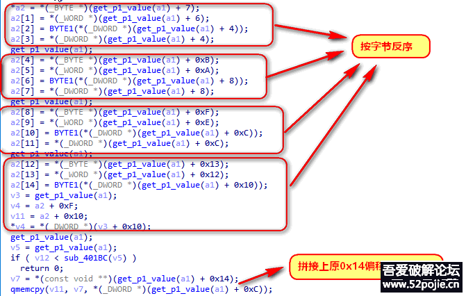后面的sub_40EA8内部其实就是实现的一个base64，sub_40EA8->sub45258：

```
_BYTE *__fastcall sub_45258(_BYTE *a1, int a2, int a3)
{
  _BYTE *v3; // r1
  _BYTE *v4; // r0
  unsigned __int8 v6; // [sp+15h] [bp-23h]
  unsigned __int8 v7; // [sp+16h] [bp-22h]
  unsigned __int8 v8; // [sp+16h] [bp-22h]
  unsigned __int8 v9; // [sp+17h] [bp-21h]
  unsigned __int8 v10; // [sp+17h] [bp-21h]
  _BYTE *v11; // [sp+18h] [bp-20h]
  int i; // [sp+1Ch] [bp-1Ch]
  _BYTE *v14; // [sp+28h] [bp-10h]

  v14 = a1;
  v11 = a1;
  for ( i = 0; i < a3 - 2; i += 3 )
  {
    v9 = *(_BYTE *)(a2 + i);
    v7 = *(_BYTE *)(a2 + i + 1);
    v6 = *(_BYTE *)(a2 + i + 2);
    *v11 = byte_A8640[v9];
    v11[1] = BASE64_table_A8740[(16 * (v9 & 3)) | (v7 >> 4)];
    v11[2] = BASE64_table_A8740[(4 * (v7 & 0xF)) | (v6 >> 6)];
    v3 = v11 + 3;
    v11 += 4;
    *v3 = BASE64_table_A8840[v6];
  }
  if ( a3 != i )
  {
    v10 = *(_BYTE *)(a2 + i);
    if ( a3 - i == 1 )
    {
      *v11 = byte_A8640[v10];
      v11[1] = BASE64_table_A8740[16 * (v10 & 3)];
      v11[2] = 61;
    }
    else
    {
      v8 = *(_BYTE *)(a2 + i + 1);
      *v11 = byte_A8640[v10];
      v11[1] = BASE64_table_A8740[(16 * (v10 & 3)) | (v8 >> 4)];
      v11[2] = BASE64_table_A8840[4 * (v8 & 0xF)];
    }
    v4 = v11 + 3;
    v11 += 4;
    *v4 = 61;
  }
  *v11 = 0;
  return (_BYTE *)(v11 - v14);
}
```


验证一下，最后一步的确是标准的base64：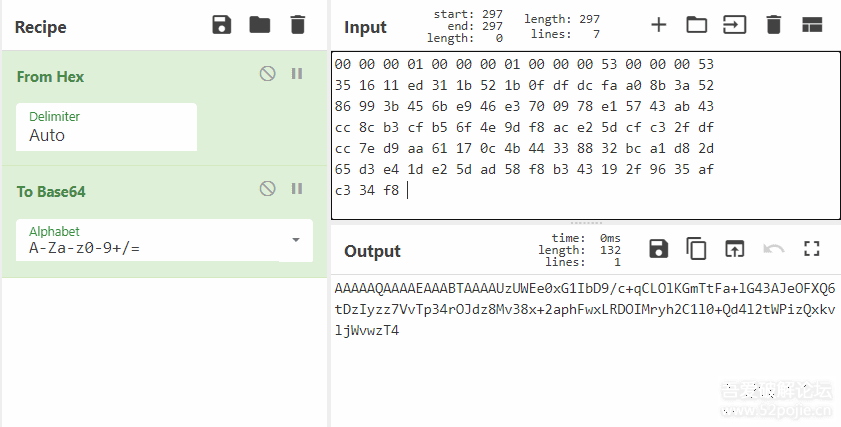计算完之后再开头加上XY即为新版的shield了：

```
std::operator+<char>(p_shield, "XY", shield_1);
```


至此，XY版本的shield也就分析完了。 最后我们再自己算一下刚开始抓的那个包的shield：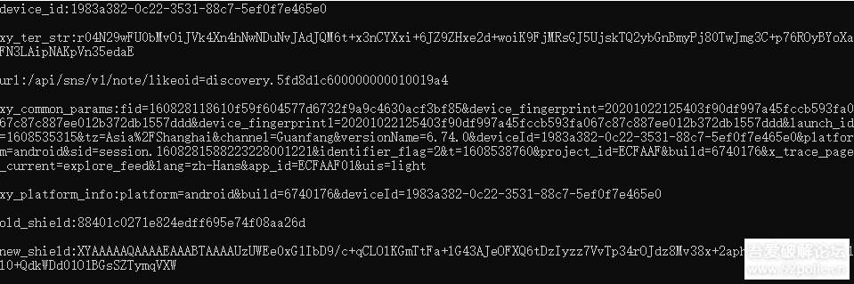