# xhs新版shield算法

本文仅供学习交流，勿作其他一切用途

没有xhs的业务，纯粹最近工作比较闲，就下了一个xhs，版本为6.67。
虽然没做过相关业务，但多少也了解过一点。shield的生成是在libshield.so中利用okhttp拦截器实现的，所以定位起来也没什么难度。拦截器在Java层的接口也很容易找到：

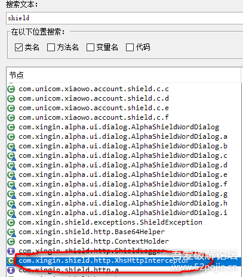


其中包含四个native函数：

```
 复制代码 隐藏代码
    private static native void initializeNative();

    public native void destroy(long j);

    public native long initialize(String str);

    public native Response intercept(Interceptor.Chain chain, long j) throws IOException;
```

加载时调用initializeNative，主要通过相关JNI获取一些方法。该类构造中调用initialize，并返回一个指针ptr，而在intercept中会传入该指针，shield的计算也在intercept中。
下面进入so层，由于函数都是动态注册的，所以直接拿hook libart的脚本跑一下，但跑一半报了异常。好在该so没做什么处理，所以直接搜字符串引用，或者直接在data段往下拉一点就能看到JNINativeMethod结构体：

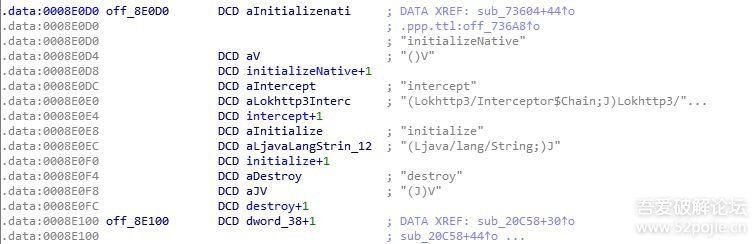


首先是initializeNative：

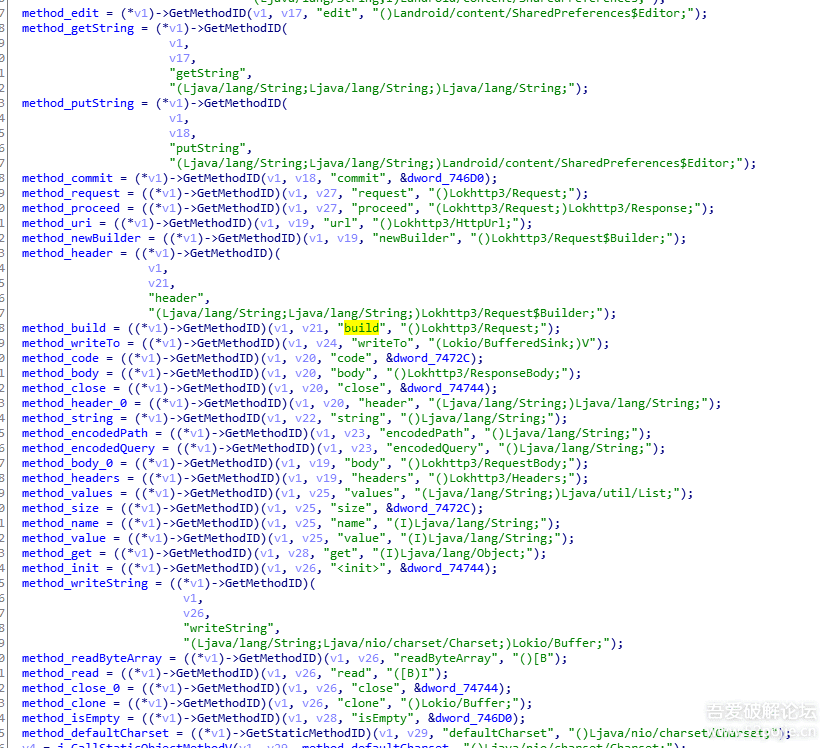


主要就是初始化，获取拦截器相关方法，在此之前，还进行了TracerPid的检测：

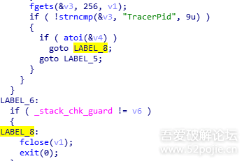


不为0时就exit(0)退出程序。
接下来是构造函数中的initialize，该函数实际作用就是创建并返回一个ptr。不过由于仅在XhsHttpInterceptor构造中调用，后续生成shield并不会再次调用构造，所以可能需要主动调用分析其细节：

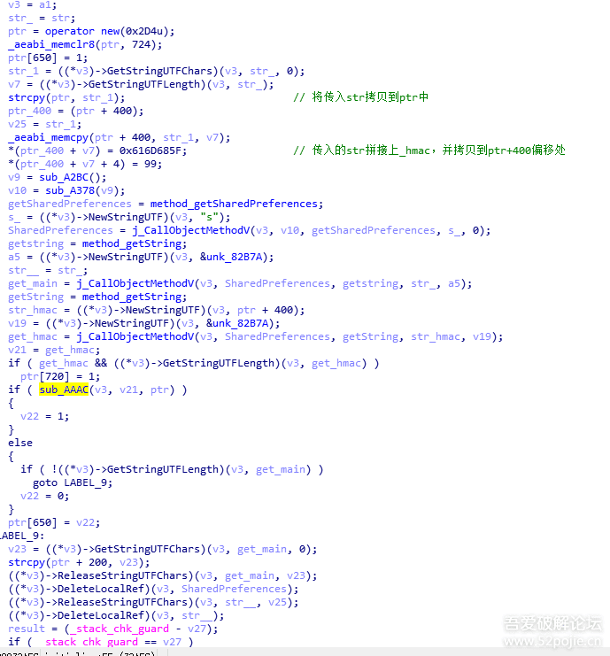


首先将传入的字符串str拷贝到返回值ptr中，并拼接了一个str+hmac拷贝到ptr+400偏移处。在后续intercept调用参数中，我们可以知道传入的str为main。接着通过getSharedPreferences获取s.xml中的键值，key就是拼接后的main_hmac，我们可以从手机上pull出该文件：

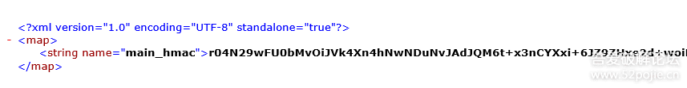


实际上，在s.xml中也仅存在这一个key。然后进入sub_AAAC，对main_hmac进行解码后，和device_id一并传入sub_200B8：

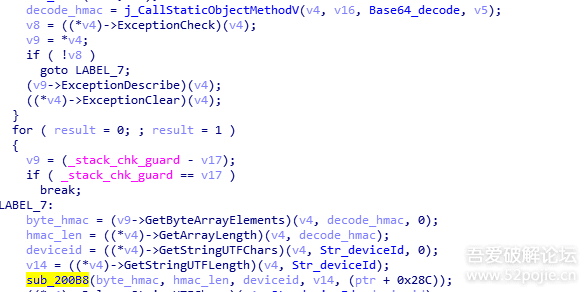


sub_200B8判断了一下main_hmac长度，又进入sub_1FE48：

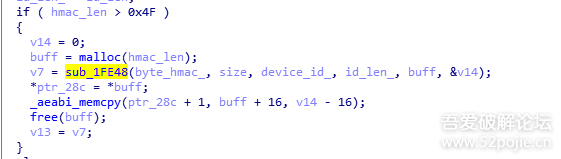


sub_1FE48则是hmac的哈希算法，但通过幻数来看是做了一些变形。

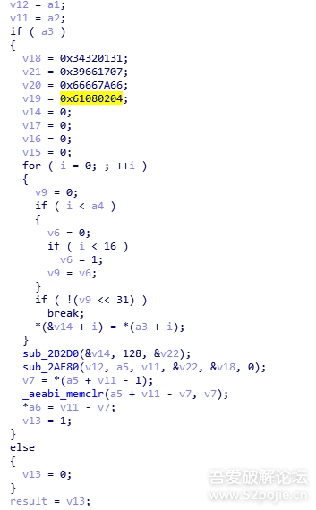


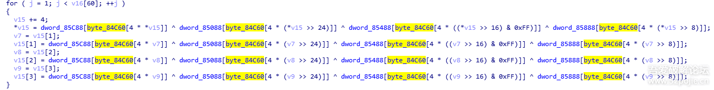


这一块将相关代码抠出来即可。最后根据main_hmac计算得出的一串hash会拷贝到ptr的末尾：

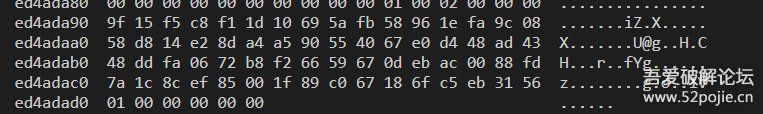


通过putString引用可以找到main_hmac相关逻辑，当请求返回406时，返回头中的xy_ter_str即是main_hmac

```
 复制代码 隐藏代码 if ( code != 406 )
    goto LABEL_26;
hash = j_CallObjectMethodV(v8, v9, method_header_0, NewStringUTF_xy_ter_str, a5a);
.......
j_CallObjectMethodV(v8, v21, putString, main_hmac, hash);
```

我们新安装一个xhs抓包后也能找到该接口，以及返回当前devicec_id所对应的main_hmac值：

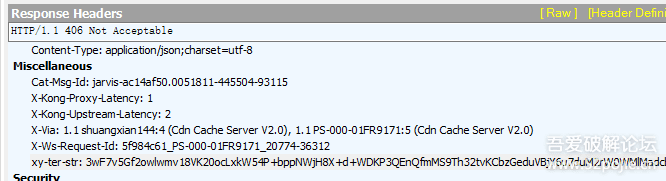


最后进入intercept，此时，之前根据main_hmac所生成的一段哈希作为参数ptr中的数据传入，当dvicec_id不变时，其所对应的main_hmac也是固定的，最终传入的ptr数据也是固定的。
intercept中很容易找到shield赋值的地方：

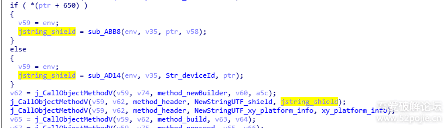


其值是根据传入的*(ptr+650)值，来决定走sub_ABB8或是sub_AD14计算分支。ptr+650在sub_AAAC对main_hmac解码并计算返回为true时，赋值为1：

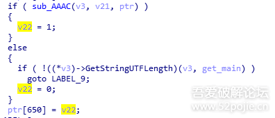


目前版本所走分支为sub_ABB8，sub_AD14可能是旧版的s1-s12，因为我也没看过：

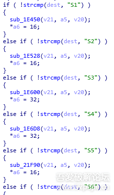


这个函数就不看了，回过头来进入到sub_ABB8当中，返回值即是shield：

```
 复制代码 隐藏代码
jstring_shield = ((*jstring_shield)->NewStringUTF)(jstring_shield, shield_ptr);
```

往上找找shield_ptr，可以很容易找到sub_1FC7E(v9, &byte_shield, &v15);该函数执行完后shield也就算好了：

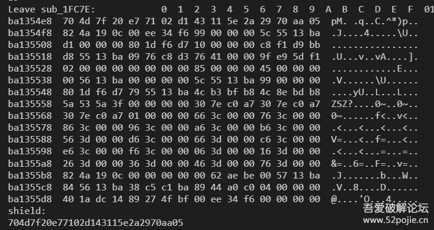


计算的参数则是sub_1FC7E中的第一个参数v9：

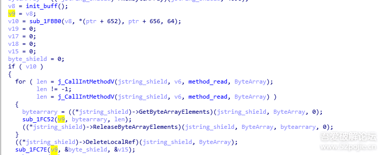


可以把这参数当作一个结构体，在init_buff中new出来，在sub_1FBB0会根据之前的ptr进行第一次计算，在sub_1FC52中会传入路径进行第二次计算，最终通过sub_1FC7E得出结果：

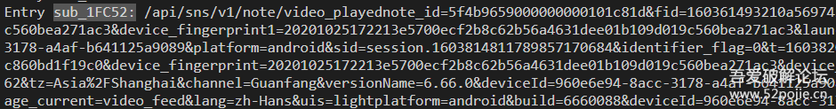


具体路径是从sub_ABB8第二个参数arg2中读取出的：

```
 复制代码 隐藏代码v6 = j_CallObjectMethodV(a1, arg2, method_clone, a4, shield_ptr);
......
len = j_CallIntMethodV(jstring_shield, v6, method_read, ByteArray
```

往上回到intercept可以找到sub_ABB8第二个参数赋值的逻辑，通过writeString写入了uri

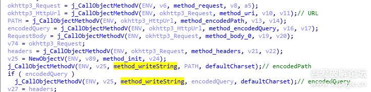


实际上除了uri的路径，还会判断xy-相关的头部进行拼接：

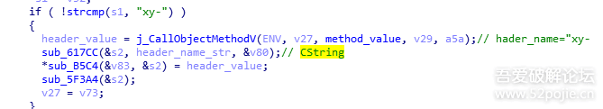


如果是post，还得拼上请求体：

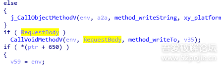


其实这部分结合抓包的链接，请求头请求体也能看出来。

最后的最后，就是把后面的算法抠出来，追求速度的话应该也能模拟调用（大佬们直接重写算法请无视我）。
init_buff你也同样构造这样的一个结构。sub_1FBB0稍有点麻烦，其中会进行赋值，之后会有多处通过偏移进行函数指针的调用：

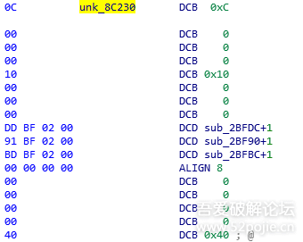


类似于：
v4 = (*(*a1 + 16))();
这部分还是得通过汇编确定调用参数等。

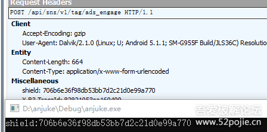


然后就是不断地调试测试