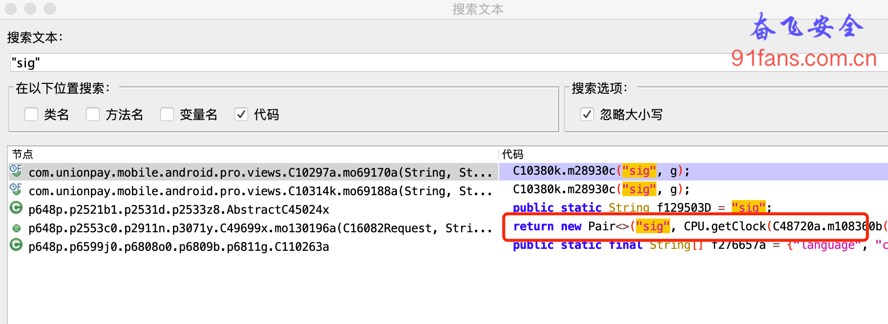
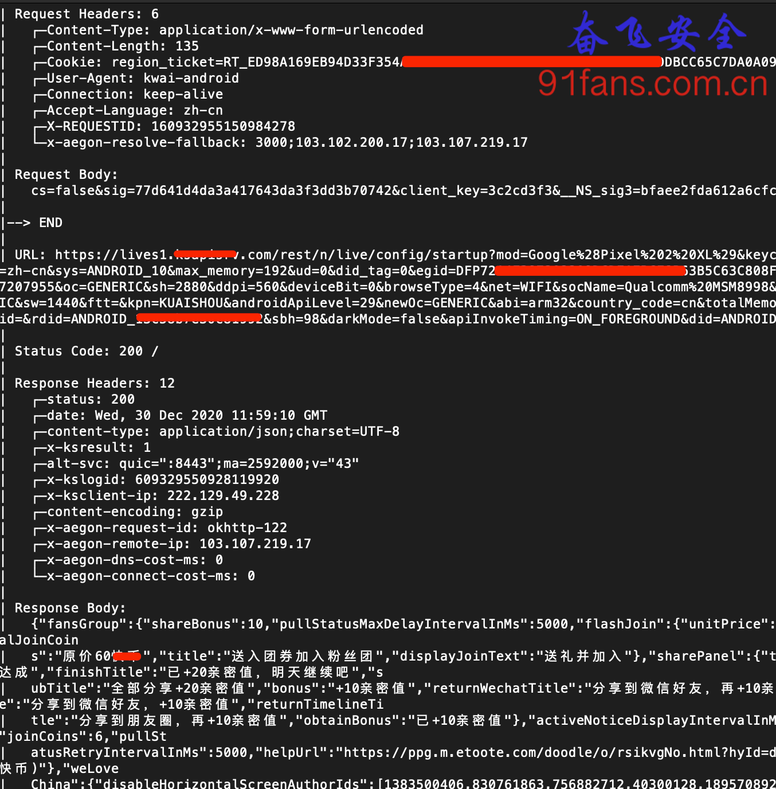
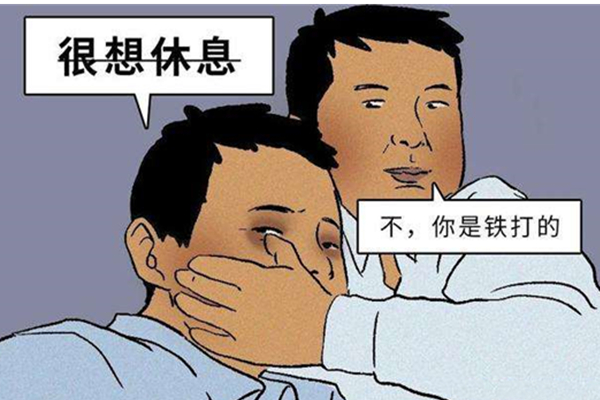
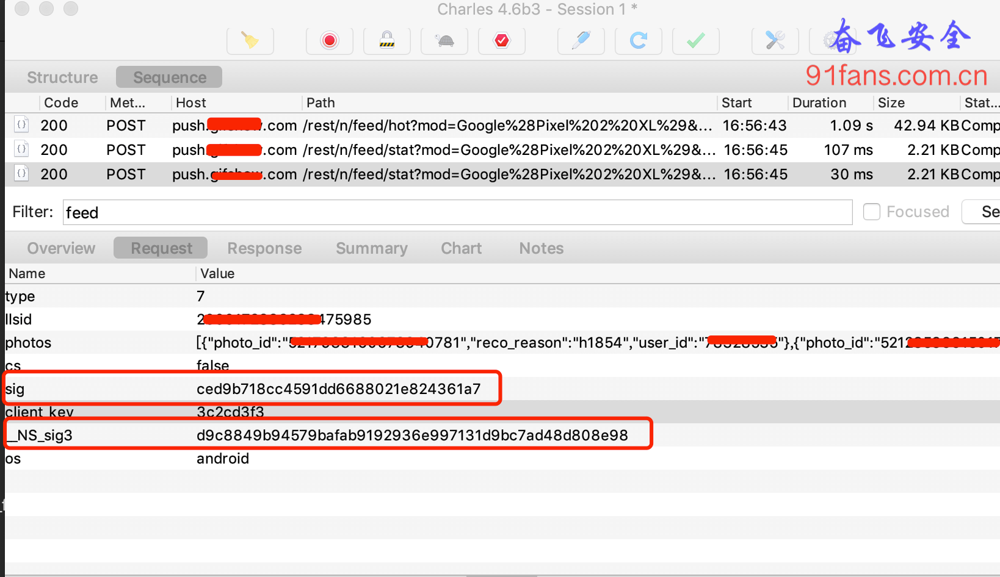
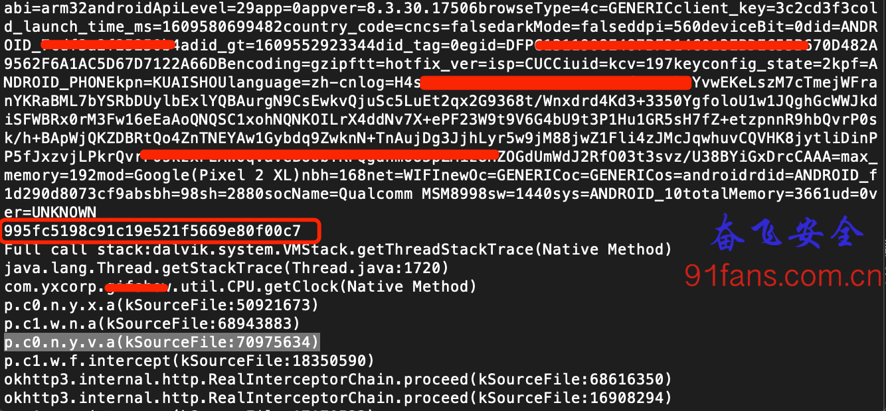
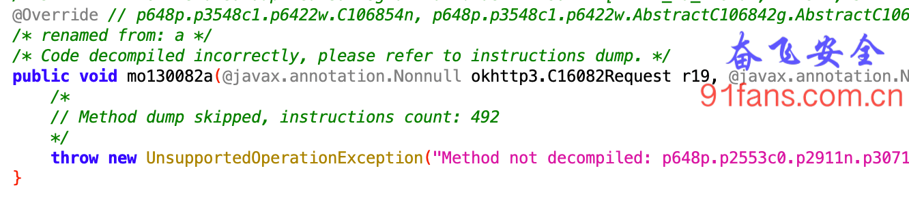
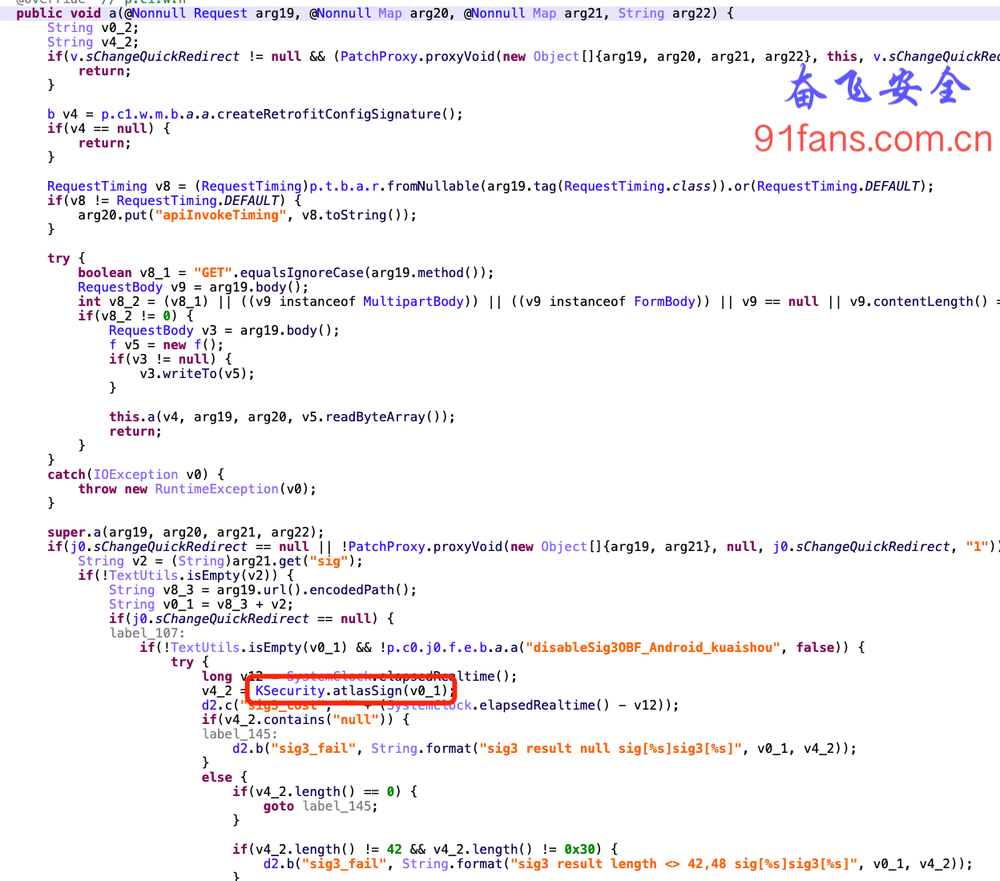
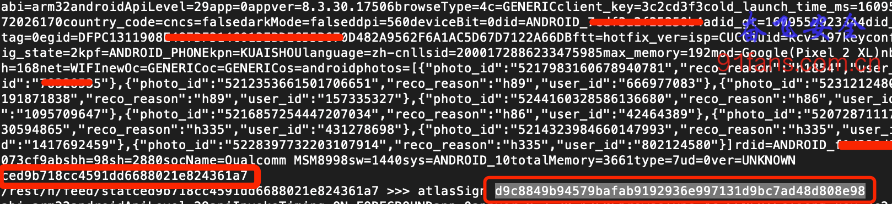

# 某小视频App v8.x 签名计算方法(一) 先从抓包说起


## 一、目标

某小视频App早就搞过好几次了，不过人家努力，几天小版本，几周大版本，一不留神就看不懂了，这不升级到 8.x 之后，包都抓不到了。蓝瘦香菇。

###### Tip:

新鲜热乎的 8.3.30.17506

## 二、步骤

### 先从okhttp3搞起

Charles就不用祭出来了，象征性的抓了几个无关痛痒的数据。看不到热门数据包不好玩。我们先从okhttp3入手，从jadx里看okhttp3还是没有被放弃的。

使用okhttp3发送一个请求，大概如下两步:

```java
Call call = new OkHttpClient().newCall(new Request.Builder().build());
Response response=call.execute();
```

那我们就先hook newCall

```js
var OkHttpClient = Java.use("okhttp3.OkHttpClient");
OkHttpClient.newCall.implementation = function (request) {
    var result = this.newCall(request);
    console.log(request.toString());
    return result;
};
```

太棒了，Request数据打印出来了， 那Response数据我也要，hook execute

```js
Override // okhttp3.Call.Factory
    public Call newCall(C16082Request request) {
        return RealCall.newRealCall(this, request, false);
    }
```

从jadx的代码里看 newCall 返回的是 RealCall对象，所以我们也要hook RealCall的execute

```js
var OkHttpRealCall = Java.use("okhttp3.RealCall");
OkHttpRealCall.execute.implementation = function(){
        var result = this.execute();
		console.log(result.toString());
        return result;
}
```

1:rc1

通讯协议是 QUIC，怪不得Charles搞不定。不过这个抓包结果怎么看怎么不开心，发送过去的数据也看不到，接收回来的数据也看不到。脱了一半让人更着急。

### OkHttpLogger-Frida

开始介绍新朋友了， https://github.com/siyujie/OkHttpLogger-Frida 用了一堆神奇的方法达到了命令行版的Charles的效果。

首先将 okhttpfind.dex 拷贝到 /data/local/tmp/

然后 frida -U -l okhttp_poker.js -f com.example.demo --no-pause 就可以跑起来了。

1:rcall

这个效果还不错，感觉又回到了Charles的美好时光。

### 过滤url

美好的时光总是短暂的，刷了一会，App就提示网络无法访问。难道还有什么坑？

先把返回值数据的打印屏蔽掉。这怎么玩都不会提示了。奋飞怀疑，在取热门数据数据包的时候，由于数据比较大，所以我们打印出来比较费时，可能就会导致访问超时。

还好作者提供了一个 filterUrl 函数，可以指定打印你需要分析的url，这样可以防止再产生超时的问题。

## 三、总结

打工人还是很苦逼呀，升级这么快，不搞点新花样都没法好好抓包了。

1:end

不要和我谈梦想，我打工就是为了钱


# 某小视频App v8.x 签名计算方法(二) sig和__NS_sig3

## 一、目标

今天的目标是 **sig和__NS_sig3**，咱们抓个包先

1:main

## 二、步骤

### sig目测像是MD5

先jadx搜索 **sig=** ，没有找到结果。

再试试 **sig** ，晕倒 6k多个结果，突然灵光一闪，这些参数，必然是要加入到 Map中，那么我们搜索 **"sig"**

1:rc1

应该就是这个 **CPU.getClock**,Hook之

```js
var  signCls = Java.use('com.yxcorp.xxx.util.CPU');
signCls.getClock.implementation = function(a,b,c){
    var result = this.getClock(a,b,c);
    console.log(bytesToString(b));
    console.log(result);

    var stack = threadinstance.currentThread().getStackTrace();
    console.log("Full call stack:" + Where(stack));

    return result;
}
```

结果还是令人满意的:

1:rcex

入参就是url和post里面的参数做个排序，然后粘贴在一起。咱们顺接堆栈往上找，**sig** 出现了，**__NS_sig3** 应该不远了。

### jeb要出场了

一直回溯到 **p.c0.n.y.v.a** 开始不开心了，jadx罢工了

1:jadx

这下可怎么办？真要回去直接手撕 **smali**？虽然比Arm汇编长得好看一点点，毕竟也是歪瓜裂枣呀。

还好我们一直奉行朋友多了路好走，来新朋友Jeb Pro登场 http://91fans.com.cn/post/jebtool/

Jeb果然比jadx牛X一些些，有IDA的风格，啃Apk就啃了好几分钟。

1:jeb

先生曾经说过，饭量越大，能力越大。

1:lx

在Jeb的大胃王的帮助下，我们很快定位了 **KSecurity.atlasSign(v0_1)**

啥也甭说了，大兄弟，Hook你：

```js
var IKSecurityExCls = Java.use("com.xxx.android.security.KSecurity");
IKSecurityExCls.atlasSign.implementation = function(a){
    var result = this.atlasSign(a);
    console.log(a + " >>> atlasSignB " + result);
    return result;
}
```

结果非常美丽:

1:rc

## 三、总结

开发经验很重要，有些关键字关键函数的的定位需要开发经验的帮助。然后手头都掌握几个工具，jadx歇了咱们还有jeb嘛。