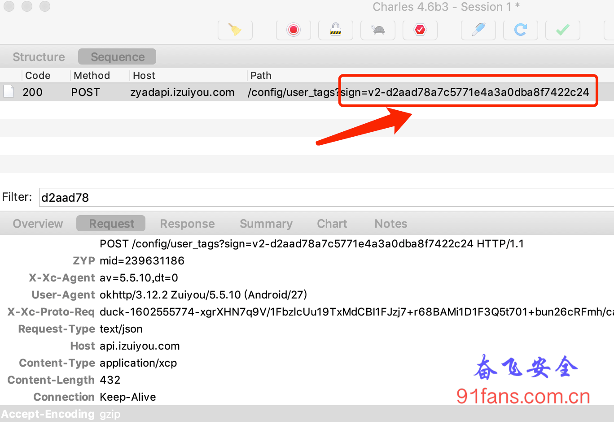
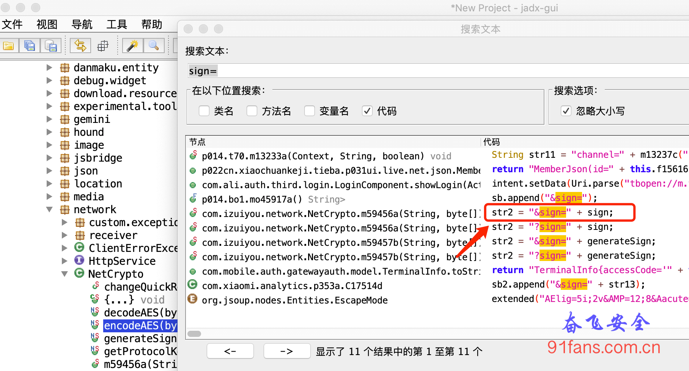
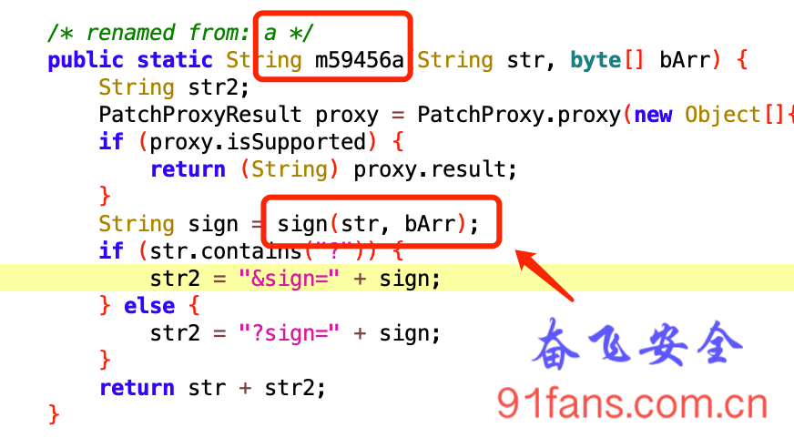
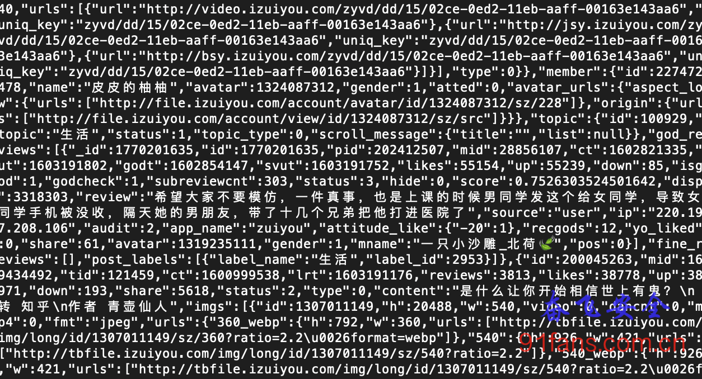
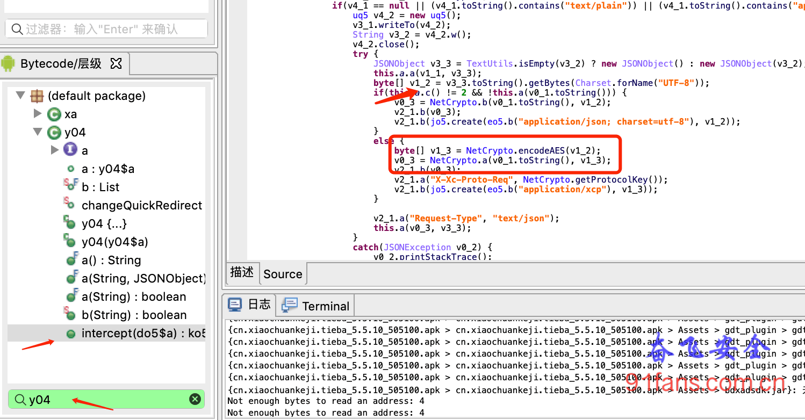

# 某段子App签名计算方法(一)

## 一、目标

用python的Flask库启动一个web Server，结合frida通过直接调用某段子App的方法来计算sign。

- 某段子App版本 5.5.10

###### Note:

- frida buf参数打印
- frida 基本框架

## 二、分析

- 使用charles对目标app进行抓包，抓包结果如下：

1:charles

- 使用 [jadx](https://github.com/skylot/jadx)反编译某段子App的apk,然后搜索文本 sign=

2:jadx

- 双击之后进入到对应的代码中

3:jadxcode

- 我们用frida来hook这个sign函数，sign函数有两个参数，String和byte[]

```js
var ZYNetCrypto = Java.use("com.izuiyou.network.NetCrypto");

ZYNetCrypto.sign.implementation = function(arg1, arg2){
	console.log("\nNetCrypto.sign\n");
	console.log("str=" + arg1 + "\nbuf=" + printBytes(arg2) + "\nbuf2=" + Bytes2HexString(arg2) + "\njson=" + JSON.stringify(arg2));

	var result = this.sign(arg1, arg2);
	console.log("\nOut Rc=" + result);
	return result;
}
```

- 运行 python3 run.py hook, 输出结果

```bash
str=https://api.izuiyou.com/config/user_tags
buf=0x69, 0x0c, 0x47, 0x56, 0x66, 0x75, 0x75, 0x85, 0x94, 0x94, 0x34, 0x44, 0x53, 0x53, 0x63, 0x72, 0x9b, 0x9b, 0x6a, 0xa6, 0x32, 0x5e, 0x75, 0x5f, 0x53, 0x9e, 0x8e, 0x59, 0xfd, 0x41, 0xe6, 0x62, 0xf3 ....
Out rc=https://api.izuiyou.com/config/user_tags?sign=v2-d2aad78a7c5771e4a3a0dba8f7422c24
```

签名sign的值是 v2-d2aad78a7c5771e4a3a0dba8f7422c24

- 现在我们用同样的参数直接调用 com.izuiyou.network.NetCrypto.sign 函数

run.py

```py
app = Flask(__name__)

@app.route('/zy')
def zy_test():
    global gScript

    str = 'https://api.izuiyou.com/config/user_tags'
    buf = bytearray([0x69, 0x0c, 0x47, 0x56, 0x66, 0x75, 0x75, 0x85, 0x94, 0x94, 0x34, 0x44, 0x53, 0x53, 0x63, 0x72, 0x9b, 0x9b, 0x6a, 0xa6, 0x32, 0x5e, 0x75, 0x5f, 0x53, 0x9e, 0x8e, 0x59, 0xfd, 0x41, 0xe6, 0x62, 0xf3 ....])
	res = gScript.exports.callzyfun(str,buf.hex());
	return jsonify(res);
```

hook.js

```js
function callSignFunZy(str,buf){
	var result = 'null';

	console.log(str);
	var arr = HexString2Bytes(buf);

    Java.perform(function () {
        var ZYNetCrypto = Java.use("com.izuiyou.network.NetCrypto");
        var res = ZYNetCrypto.sign(str,arr) ;
        result = res;
    });

    return result;

}


rpc.exports = {
    callzyfun : callSignFunZy,	// 导出名不可以有大写字母和下划线
};
```

从浏览器里访问Flask服务 http://127.0.0.1:5000/zy 可以得到一样的结果 v2-d2aad78a7c5771e4a3a0dba8f7422c24

4:rc


# 某段子App协议分析(二)

## 一、目标

分析某段子App的通讯协议，实现段子爬虫。

- 某段子App版本 5.5.10

###### Note:

- frida 打印调用函数堆栈

## 二、分析

上一篇文章我们已经分析出了 [某段子App的签名sign计算方法](http://91fans.com.cn/post/zysignone/)，但是签名之前的数据是二进制的密文，所以我们首先要定位明文的数据。

- 这里介绍一个用frida定位的方式：堆栈定位法,通过打印被hook函数的堆栈来定位调用的函数。

```js
        var threadef = Java.use('java.lang.Thread');
        var threadinstance = threadef.$new();

        function Where(stack){
            var at = ""
            for(var i = 0; i < stack.length; ++i){
                at += stack[i].toString() + "\n"
            }
            return at
        }

		// 被hook的函数体中使用
        var stack = threadinstance.currentThread().getStackTrace();
        console.log("Full call stack:" + Where(stack));
```

- 运行 python3 run.py hook, 输出结果

```bash
Full call stack:dalvik.system.VMStack.getThreadStackTrace(Native Method)
java.lang.Thread.getStackTrace(Thread.java:1538)
com.izuiyou.network.NetCrypto.sign(Native Method)
com.izuiyou.network.NetCrypto.a(SourceFile:1)
y04.intercept(SourceFile:42)
jp5.a(SourceFile:11)
jp5.a(SourceFile:2)
c40.intercept(SourceFile:8)
jp5.a(SourceFile:11)
```

可以看到调用签名函数NetCrypto.a的位置是 y04.intercept

- 这次我们使用一个新的反编译工具 [JEB 3.19.1 PRO](http://91fans.com.cn/post/jebtool/) 来反编译某段子App的apk，然后搜索 y04

1:jadxcode

可以看到在调用 **NetCrypto.a** 之前入参的byte数组先经过了 **NetCrypto.encodeAES** 来加密，加密之前的数据类型也是一个byte数组 v1_2，但是仔细从前面的几行代码里找一下，发现 v1_2其实是String变量，现在我们需要把这个String打印出来。

- hook NetCrypto.encodeAES函数来打印入参字符串

```js
		ZYNetCrypto.encodeAES.implementation = function(arg1){
			console.log("\nNetCrypto.encodeAES\n");

			var strIn = Java.use('java.lang.String');
			var outStr = strIn.$new(arg1);
			console.log(outStr);

			var result = this.encodeAES(arg1);
			return result;
		}
```

这里有个小技巧，入参是byte数组，如何转换成String呢？

```java
//string 转 byte[]
String str = "Hello";
byte[] srtbyte = str.getBytes();

// byte[] 转 string
String res = new String(srtbyte);
System.out.println(res);
```

这次协议的明文显示出来了。

```bash
NetCrypto.encodeAES

{"h_av":"5.5.10","h_dt":0,"h_os":27,"h_app":"zuiyou","h_model":"Redmi 6A","h_did":"7011dadb0bff95b1","h_nt":1,"h_m":231231186,"h_ch":"xiaomi","h_ts":1602637244846,"token":"TfKcNnqg13_aFV9JwkfuiZtvPrbLuJ1ypraRae1vujr2MHJrhnuhgvnVTXOVyr5V2M3gh","android_id":"8018dadb0bff13b1","h_ids":{"imei2":"869839142239784","meid":"99002284061989","imei1":"868939032239776","imei":"99002284063389"},"h_os_type":"miui"}
```

## 三、总结

某段子App的通讯协议流程是， 请求参数→AES加密→密文做sign签名,下一篇文章我们就来实现这个爬虫。


# 某段子App协议分析(三)

## 一、目标

分析某段子App的通讯协议，实现段子爬虫

- 某段子App版本 5.5.10

###### Note:

- frida rpc调用

## 二、分析

我们上篇文章分析完了，某段子App的通讯协议流程是 请求参数→AES加密→密文做sign签名 ,所以我们需要通过frida的rpc调用Aes加解密函数和密文签名函数。

用jeb打开之前分析的 **com.izuiyou.network.NetCrypto** 类,可以找到目标函数

```java
 public static native byte[] decodeAES(byte[] arg0, boolean arg1) {
  }

  public static native byte[] encodeAES(byte[] arg0) {
  }

  public static native String getProtocolKey() {
  }

  public static native void setProtocolKey(String arg0) {
  }

  public static native String sign(String arg0, byte[] arg1) {
  }
```

我们以调用encodeAES为例，encodeAES函数的参数和返回值都是byte数组，但是encodeAES的参数实际是个字符串，所以我们在python调用时传入字符串，然后在js代码中来转成byte[]类型。

返回值的处理比较麻烦，因为python和js对byte[]类型的处理可能不一样，所以我们在js代码中把byte数组转成对应hex字符串，然后再返回给python。

run.py

```py
@app.route('/aesenc', methods=['POST']) # 数据加密
def zy_aesenc():
    global gScript

    data = request.get_data()
    print(data.decode("utf-8"))

    res = gScript.exports.callencaes(data.decode("utf-8"))
	return res
```

hook.js

```js
function callEncodeAes(strData){
	var result = 'null';

	Java.perform(function() {
		var ZYNetCrypto = Java.use("com.izuiyou.network.NetCrypto");

        var strIn = Java.use('java.lang.String');
        var byteIn = strIn.$new(strData).getBytes();

		var res = ZYNetCrypto.encodeAES(byteIn);

        result =  Bytes2HexString(res);

    });

	return result;
}
```

某段子App请求的返回值也是加密数据，解密函数由decodeAES完成，调用decodeAES的时候遇到一个问题，decodeAES函数的返回值是byte[]类型，但是实际上是String类型的明文。所以一开始我们用

```js
	var result = this.decodeAES(arg1,arg2);
	var strIn = Java.use('java.lang.String');
	var outStr = strIn.$new(result);
```

这种方式把类型转换成String，然后直接返回给python代码，结果总是异常报错，百思不得其解。 最后还是用encodeAES一样的方式来转成hex字符串来输出:

run.py

```py
@app.route('/aesdec', methods=['POST']) # 数据解密
def zy_aesdec():
    global gScript

    data = request.get_data()
    res = gScript.exports.calldecaes(data.decode("utf-8"))
    return res
```

hook.js

```js
// 解密
function callDecodeAes(dataBuf){
	var rc = 'null';

	var arr = HexString2Bytes(dataBuf);

    Java.perform(function() {
        var ZYNetCrypto = Java.use("com.izuiyou.network.NetCrypto");
		var res = ZYNetCrypto.decodeAES(arr,true);
		rc = Bytes2HexString(res);
    });

	return rc;
}
```

最后我们用一个python来组装获取某段子App热门数据的请求

```py
# 获取数据
def get_data(uri, msg):
    postData = dataAesEnc(msg)
    # print(postData)
    sign = dataSign(postData)
    # print(sign)
    protocolKey = dataGetKey()
    # print(protocolKey)

    url = uri + str(sign)
    headers = { 'ZYP': 'mid=239631186',
                'X-Xc-Agent' : 'av=5.5.11,dt=0',
                'User-Agent': 'okhttp/3.12.2 Zuiyou/5.5.11 (Android/27)',
                'X-Xc-Proto-Req' : protocolKey,
                'Request-Type' : 'text/json',
                'Content-Type' : 'application/xcp',
                }
    byte_data = bytes.fromhex(postData)

    # proxies = {'http': '127.0.0.1:8888',
    #  'https': '127.0.0.1:8888'
    #  }

    try:
        # ,proxies=proxies
        r = requests.post(url, headers=headers, data=byte_data, verify=False,stream=True,timeout=15)

        # print(r.headers['X-Xc-Proto-Res'])
        # key是 cat开头的就需要把返回包里面的duck key设置进去，
        if protocolKey.find('cat') == 0:
            print(protocolKey)
            print(r.headers['X-Xc-Proto-Res'])
            dataSetKey(r.headers['X-Xc-Proto-Res'])
        # 这里要做一些错误处理
        bufRc =  r.raw.read();
        rcStr = dataAesDec(bufRc.hex())
        rc = bytes.fromhex(rcStr).decode("utf-8")
        return rc

    except RequestException as e:
        print(e)

def main():
    # 手机端首页推荐地址
    uri = 'http://api.izuiyou.com/index/recommend?sign='
    msg = '{"filter":"all","auto":0,"tab":"推荐","direction":"down","c_types":[1,2,11,15,16,51,17,52,53,40,50,41,22,25,27],"sdk_ver":{"tt":"3.1.0.3","tx":"4.211.1081","bd":"5.86","mimo":"5.0.3","tt_aid":"5004095","tx_aid":"1106701465","bd_aid":"c8655095","mimo_aid":"2882303761518470184"},"ad_wakeup":1,"h_ua":"Mozilla\/5.0 (Linux; Android 8.1.0; Redmi 6A Build\/O11019; wv) AppleWebKit\/537.36 (KHTML, like Gecko) Version\/4.0 Chrome\/62.0.3202.84 Mobile Safari\/537.36","manufacturer":"Xiaomi","h_av":"5.5.11","h_dt":0,"h_os":27,"h_app":"zuiyou","h_model":"Redmi 6A","h_did":"866655030396869","h_nt":1,"h_m":239631186,"h_ch":"xiaomi","h_ts":1603179121590,"token":"T7K4Nnqg98_aFV9JwkfuiZtvPrRJ02EXxbnm7TXr3qiIWWaT1vjNNNCpcUu112TDw_VXu","android_id":"57b9b8465c2e440b","h_ids":{"imei2":"878739042239784","meid":"98001184062989","imei1":"878739042239776","imei":"98001184062989"},"h_os_type":"miui"}'

    items = get_data(uri, msg)
    print(items)
```

结果如下，可以成功获取到数据:

1:bashrc

## 三、总结

frida rpc调用主要就是处理好参数类型，python和js的互相调用。实际运行过程中 frida不是很稳定，偶尔会崩溃退出，所以线上环境还是建议用Xposed来做rpc。


# 某段子App协议分析(四)

## 一、目标

在 [某段子App协议分析(三)](http://91fans.com.cn/post/zysignthr/) 这篇文章里面，我们用frida rpc调用的方式来实现了某段子App的段子爬虫，但是在实际使用的过程中，我们发现有如下两个问题:

1. frida不是很稳定，偶尔会崩溃退出
2. flask服务是运行在pc上，所以还需要一台pc一直开机

所以我们最好能实现在Android手机中运行一个稳定的web服务，然后把 手机的端口通过路由器映射出去,这样就可以在任意环境下来调用签名服务了。

###### Note:

- Xposed rpc调用
- NanoHTTPD
- 手机端口映射到公网ip

## 二、分析

Xposed模块的开发方法可以参照 [最新的Xposed模块编写教程2020](http://91fans.com.cn/post/xposedone/),在xposed中调用App中的静态函数使用 XposedHelpers.callStaticMethod:

```java
public static Object callMethod(Object obj, String methodName, Object... args)

public static Object callMethod(Object obj, String methodName, Class<?>[] parameterTypes, Object... args)

public static Object callStaticMethod(Class<?> clazz, String methodName, Object... args)

public static Object callStaticMethod(Class<?> clazz, String methodName, Class<?>[] parameterTypes, Object... args)
```

我们以调用 **com.izuiyou.network.NetCrypto.getProtocolKey** 为例:

```java
Class<?> clazzZy = null;
try {
	// 首先获取 com.izuiyou.network.NetCrypto类
	clazzZy = loadPackageParam.classLoader.loadClass("com.izuiyou.network.NetCrypto");
	log("load class:" + clazzZy);
} catch (Exception e) {
	log("load class err:" + Log.getStackTraceString(e));
	return newFixedLengthResponse("load class is null");
}

// 然后调用 getProtocolKey
String rc = (String) XposedHelpers.callStaticMethod(clazzZy, "getProtocolKey");
```

调用函数完成之后，我们需要启动一个http服务来把数据传输出来，这里使用 NanoHTTPD

1. 下载nanohttpd-2.3.1.jar 放到Android项目中的libs目录下。

2. 在 **/app/build.gradle** 文件的dependencies段增加

   ```bash
     compileOnly 'org.nanohttpd:nanohttpd:2.3.1’
   ```

1、2步也可以试试合并成直接在 **/app/build.gradle** 文件的dependencies段增加

```bash
  implementation'org.nanohttpd:nanohttpd:2.3.1'
```

###### Tip:

最后记得NanoHTTPD需要添加网络权限

```bash
 <uses-permission android:name="android.permission.INTERNET"/>
```

然后我们创建一个myHttpServer类来启动http服务

```java
import java.io.IOException;
import fi.iki.elonen.NanoHTTPD;

class myHttpServer extends NanoHTTPD {

public myHttpServer() throws IOException {
	// 端口是8088，也就是说要通过http://127.0.0.1:8088来访当问
	super(8888);
	start(NanoHTTPD.SOCKET_READ_TIMEOUT, true);
	log("---fenfei Server---");
}

@Override
public Response serve(IHTTPSession session) {
	// log("serve");
	//这个就是之前分析，重写父类的一个参数的方法，
	//这里边已经把所有的解析操作已经在这里执行了
	return super.serve(session);
}

@Override
public Response serve(String uri, Method method, Map<String, String> headers, Map<String, String> parms, Map<String, String> files) {

	// 获取类
	Class<?> clazzZy = null;
	try {
		clazzZy = loadPackageParam.classLoader.loadClass("com.izuiyou.network.NetCrypto");
		log("load class:" + clazzZy);
	} catch (Exception e) {
		log("load class err:" + Log.getStackTraceString(e));
		return newFixedLengthResponse("load class is null");
	}

	// 判断是否是getkey请求
	if (StringUtils.containsIgnoreCase(uri, "getkey")) {//判断uri是否正确
	return getKey(clazzZy);
	}

	// 判断是否是setkey请求，并且取出post过来的数据
	if (StringUtils.containsIgnoreCase(uri, "setkey")) {//判断uri是否正确
		String postData = files.get("postData");
		if (!StringUtils.isEmpty(postData)) {//判断post过来的数据是否正确
			return setkey(clazzZy,postData);
		}else{
			return newFixedLengthResponse("postData is null");
		}
	}
}

public Response setkey(Class<?> clazzUse,String strKey){
	XposedHelpers.callStaticMethod(clazzUse, "setProtocolKey",strKey);
	log("setkey = "+strKey);
	return newFixedLengthResponse("set key ok");
}

}

// 创建httpServer实例
new myHttpServer();
```

把上次从frida RPC获取签名的地址 **[http://127.0.0.1:5000](http://127.0.0.1:5000/)** 改成新的xposed RPC的地址 **[http://192.168.2.102:8888](http://192.168.2.102:8888/)**,就可以正常获取数据了。

1:bashrc

## 三、总结

Xposed RPC比frida RPC稳定，如果线上环境使用的话，还需要增加一个看门狗程序，当某段子App异常退出之后，可以及时的把某段子App再调起来。