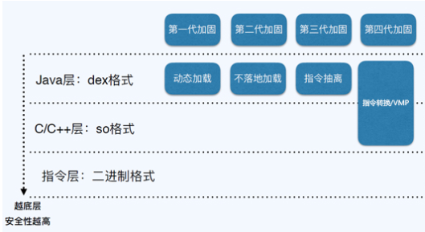
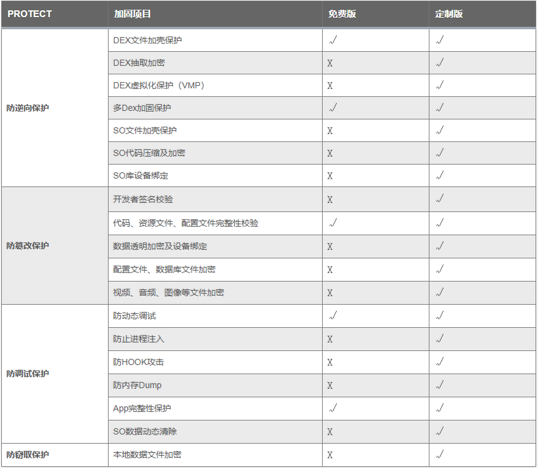
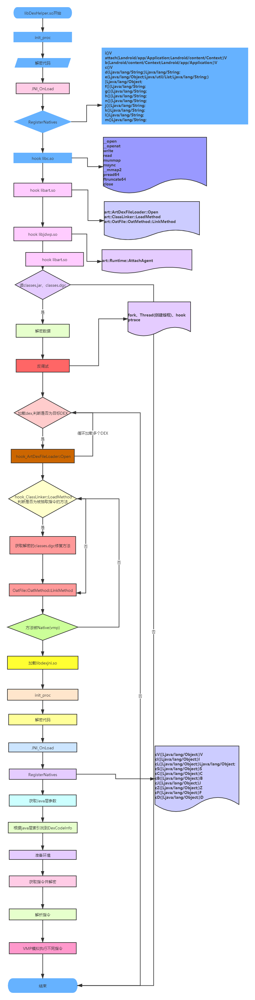
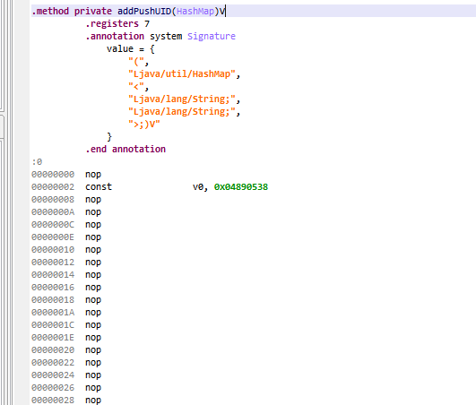
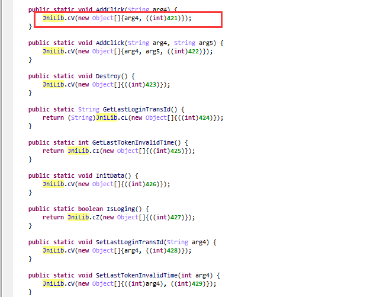
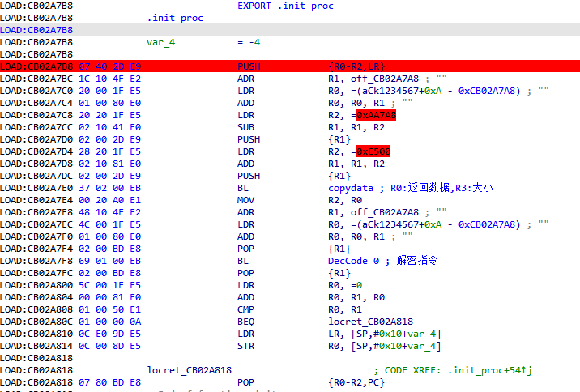
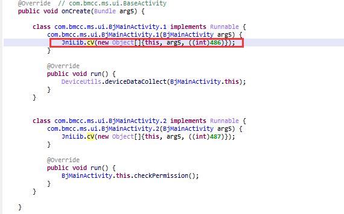

# 梆梆APP加固产品方案浅析

url：https://www.cnblogs.com/2014asm/p/14547218.html

#### 一、APP加固背景

##### 1.1、概述

Android系统是基于Linux开发己具有其开放性、自由性的一种操作系统，现主要应用于移动设备，如手机、平板电脑和车载系统等。从2007年Google推出第一代Android操作系统至今已有10多年的时间，移动行业的市场份额与规模也在急速增长，现在几乎每人都在用或曾用过接触过Android智能手机。

##### 1.2、安全问题

移动APP越来越普及，大多业务己放到APP中完 成，带来的安全隐患也越来越突出，漏洞、APP破解、恶意代码植入、广告植入、病毒木马、支付篡改、数据爬取等安全问题。
在发版前可通过对APP进行安全检测，加固APP可以提高安全性，解决大部分风险。

#### 二、APP加固前世今生

##### 2.1、APP加固发展与现状

App加固技术，前后经历了四代技术变更，保护级别在每一代都有所提升，破解成本也越来超高，发展流程大致如图2-1所示:



　　　　　　　　　　　　图2-1

###### 第一代加固技术(动态加载):

第一代Android加固技术用于保护应用的逻辑不被逆向与分析，最早普遍在恶意软件中使用，其主要基于虚拟机提供的动态加载技术。
缺陷:只能对抗静态分析，无法对抗攻击者通过动态调试或自定义虚拟机进行脱壳。

###### 第二代加固技术(内存加载):

第二代加固技术在APK修改方面已经完善，能做到对开发的零干扰。开发过程中不需要对应用做特殊处理，只需要在最终发布前进行保护即可。而为了实现这个零干扰的流程，Loader需要处理好Android的组件的生命周期。hook读写等方法，读写文件时进行加解密。
缺陷:只能对抗静态分析，无法对抗攻击者通过动态调试、内存dump或自定义虚拟机进行脱壳。

###### 第三代加固技术(指令抽取):

第三代加固技术对Dex中代码的方法名和方法体进行分离，并对分离的方法体进行加密，通过Hook虚拟机方法，在程序运行的同时对方法进行解密运行。这种保护技术有效的防止了破解者通过内存dump的方式获取明文dex，将保护级别降到了函数级别。
缺陷:无法对抗攻击者通过自定义Android虚拟机进行脱壳。

###### 第四代加固技术(java2C/VMP):

第四代加固技术对DEX中方法提取并转化成native方法后在底层进行注册，在调用native方法的同时在底层使用自定义解释器解释虚拟机指令。
java2c是将DEX文件内的函数被标记为native，内容被抽离并转换成一个符合JNI要求的动态库。动态库内通过JNI方法和Android系统进行交互。
缺陷：不论VMP还是java2c，都必须通过虚拟机提供的JNI接口与虚拟机进行交互，攻击者可以直接hook系统JNI接口、记录和分析执行流程，进而推断出完整DEX程序。

##### 2.1、产品介绍

梆梆加固产品主要分为免费版与定制版，应用场景如下：

###### 防逆向（Anti-RE） :

抽取classes.dex中的所有代码，剥离敏感函数功能，混淆关键逻辑代码，整体文件深度加密加壳，防止通过apktool，dex2jar，JEB等静态工具来查看应用的Java层代码，防止通过IDA，readelf等工具对so里面的逻辑进行分析，保护native代码。

###### 防篡改（Anti-tamper）

每个代码文件、资源文件、配置文件都会分配唯一识别指纹，替换任何一个文件，将会导致应用无法运行，存档替换、病毒广告植入、内购破解、功能屏蔽等恶意行为将无法实施。

###### 防调试（Anti-debug）

多重加密技术防止代码注入，彻底屏蔽游戏外挂、应用辅助工具，避免钓鱼攻击、交易劫持、数据修改等调试行为。

###### 防窃取（Storage Encryption）

支持存储数据加密，提供输入键盘保护、通讯协议加密、内存数据变换、异常进程动态跟踪等安防技术，有效防止针对应用动、静态数据的捕获、劫持和篡改。 免费版与定制版本区别如图2-2所示：



　　　　　　　　　　　　图2-2

免费版本相对于定制化加固在安全能力方面要弱很多，我们分析的目标是定制版本的加固。

#### 三、整体框架

梆梆定制版加固保护代码的方式主要分为两种，一是指令抽取，二是指令虚拟化，指令还原与虚拟化基本的流程与逻辑如图3-1所示：



　　　　　　　　　　　　图3-1

#### 四、详细流程分析

##### 4.1 加固后APP基本情况介绍

通过JEB反编译DUMP出来的DEX，方法指令抽取与指令虚拟化后如图4-1与4-2所示，方法指令抽取后的结果如图4-1所示：



　　　　　　　　　　　　图4-1

方法指令虚拟化后大部分函数是调用JniLib.cV解析执行的，最后一个参数是一个函数code索引，用来查找被虚拟化后的指令，其它是方法参数，如图4-2所示：



　　　　　　　　　　　　图4-2

##### 4.2 So壳简单分析

壳的SO文件本身做了加壳保护，壳入口为.init_proc，如图4-3所示：



　　　　　　　　　　　　图4-3

解壳流程如大致为获取加密的代码基址->解密->修改属性，解密代码如下：

[](javascript:void(0);)

```
#define CODE_DATA_SIZE 0X00053DB3
#define CODE_DATA_OFFSET 0XE500
int DecCode(int copydata, unsigned int datasize, int codebufer, int* a4)
{
    index_2 = 0;
    v5 = 1;
    index = 0;
    v7 = 0;
    while (1)
    {
        while (1)
        {
            v8 = (v7 & 0x7F) == 0;
            if ((v7 & 0x7F) != 0)
                v7 *= 2;
            else
                v7 = *(unsigned __int8*)(copydata + index);
            if (v8)
            {
                v7 = 2 * v7 + 1;
                ++index;
            }
            if ((v7 & 0x100) == 0)
                break;
            codebyte = *(unsigned char*)(copydata + index++);
            *(unsigned char*)(codebufer + index_2++) = codebyte;
        }
        for (i = 1; ; i = v20 + ((unsigned int)(v7 << 23) >> 31))
        {
            v11 = (v7 & 0x7F) == 0;
            if ((v7 & 0x7F) != 0)
                v12 = 2 * v7;
            else
                v12 = *(unsigned __int8*)(copydata + index);
            if (v11)
            {
                v12 = 2 * v12 + 1;
                ++index;
            }
            v13 = (v12 & 0x7F) == 0;
            v14 = v12 << 23;
            if ((v12 & 0x7F) != 0)
                v15 = 2 * v12;
            else
                v15 = *(unsigned __int8*)(copydata + index);
            if (v13)
                v15 = 2 * v15 + 1;
            v16 = 2 * i;
            if (v13)
                ++index;
            v17 = v16 + (v14 >> 31);
            if ((v15 & 0x100) != 0)
                break;
            v18 = (v15 & 0x7F) == 0;
            if ((v15 & 0x7F) == 0)
                v15 = *(unsigned __int8*)(copydata + index);
            v19 = v17 + 0x7FFFFFFF;
            v7 = 2 * v15;
            if (v18)
                ++v7;
            v20 = 2 * v19;
            if (v18)
                ++index;
        }
        index_1 = index;
        if (v17 != 2)
            break;
        v22 = (v15 & 0x7F) == 0;
        if ((v15 & 0x7F) != 0)
            v15 *= 2;
        else
            v15 = *(unsigned __int8*)(copydata + index);
        if (v22)
            v15 = 2 * v15 + 1;
        if (v22)
            ++index;
        v23 = (v15 >> 8) & 1;
    LABEL_41:
        v25 = (v15 & 0x7F) == 0;
        if ((v15 & 0x7F) != 0)
            v7 = 2 * v15;
        else
            v7 = *(unsigned __int8*)(copydata + index);
        if (v25)
            v7 = 2 * v7 + 1;
        v26 = 2 * v23;
        if (v25)
            ++index;
        v27 = v26 + ((unsigned int)(v7 << 23) >> 31);
        if (!v27)
        {
            v28 = 1;
            do
            {
                v29 = (v7 & 0x7F) == 0;
                if ((v7 & 0x7F) != 0)
                    v30 = 2 * v7;
                else
                    v30 = *(unsigned __int8*)(copydata + index);
                if (v29)
                {
                    v30 = 2 * v30 + 1;
                    ++index;
                }
                v31 = (v30 & 0x7F) == 0;
                v32 = v30 << 23;
                if ((v30 & 0x7F) != 0)
                    v7 = 2 * v30;
                else
                    v7 = *(unsigned __int8*)(copydata + index);
                if (v31)
                    v7 = 2 * v7 + 1;
                v33 = 2 * v28;
                if (v31)
                    ++index;
                v28 = v33 + (v32 >> 31);
            } while ((v7 & 0x100) == 0);
            v27 = v28 + 2;
        }
        if (v5 > 0x500)
            v34 = v27 + 1;
        else
            v34 = v27;
        v35 = (unsigned char*)(codebufer + index_2 - v5);
        *(unsigned char*)(codebufer + index_2) = *v35;
        v36 = index_2 + 1;
        v37 = &v35[v34];
        v38 = codebufer + index_2;
        do
        {
            v39 = *++v35;
            *(unsigned char*)++v38 = v39;
        } while (v35 != v37);
        index_2 = v36 + v34;
    }
    v24 = *(unsigned __int8*)(copydata + index++) + ((v17 + 16777213) << 8);
    if (v24 != -1)
    {
        v23 = !(*(unsigned char*)(copydata + index_1) & 1);
        v5 = (v24 >> 1) + 1;
        goto LABEL_41;
    }
    *a4 = index_2;
    if (index == datasize)
        return 0;
    if (index >= datasize)
        return -201;
    return -205;
}
int __fastcall sub_D1F2EA88(int result, int a2)
{
    int v2; // r4
    unsigned int v3; // r12
    int v4; // r6
    int v5; // r7
    int v6; // r5
    int v7; // r2
    unsigned int v8; // r5
    int v9; // r3
    int v10; // r6
    unsigned int v11; // r1

    v2 = *(int*)(result + a2 + 8);
    v3 = *(int*)(result + a2 + 12);
    v4 = *(int*)(result + a2 + 16);
    v5 = *(int*)(result + a2 + 20);
    v6 = *(int*)(result + a2 + 24);
    if (*(int*)(result + a2) == 2146926590)
    {
        result += *(int*)(result + a2 + 4);
        v7 = 0;
        v8 = v3 + 4 * v6;
        v9 = 0;
        v10 = v5 + v4;
        while (v9 != v2)
        {
            v11 = *(int*)(result + 8 * v9);
            if (v11 >= v3 && v11 < v8)
                * (int*)(result + 8 * v9) = v10 + 4 * v7++;
            ++v9;
        }
    }
    return result;
}
```

[](javascript:void(0);)

##### 4.3 DEX 指令抽取原理分析

###### JNI_OnLoad 分析

壳解密完成后执行到JNI_OnLoad方法，JNI_OnLoad主要完成几个重要步骤。
1、注册JNI方法，方法如下：

[](javascript:void(0);)

```
i()V
attach(Landroid/app/Application;Landroid/content/Context;)V
b(Landroid/content/Context;Landroid/app/Application;)V
c()V
d(Ljava/lang/String;)Ljava/lang/String;
e(Ljava/lang/Object;Ljava/util/List;Ljava/lang/String;)[Ljava/lang/Object;
f()[Ljava/lang/String;
g()[Ljava/lang/String;
h()[Ljava/lang/String;
n()[Ljava/lang/String;
j()[Ljava/lang/String;
k()Ljava/lang/String;
l()Ljava/lang/String;
m()Ljava/lang/String;
```

[](javascript:void(0);)

2、hook libc.so方法，hook如下方法：

[](javascript:void(0);)

```
__open
__openat
write
read
munmap
msync
__mmap2
pread64
ftruncate64
close
```

[](javascript:void(0);)

3、读取classes0.jar、classes.dgc并解密，代码逻辑如下：

[](javascript:void(0);)

```
//读取资源文件
seg131:CEE8E1B0 01 1C       MOVS            R1, R0
seg131:CEE8E1B2 06 98       LDR             R0, [SP,#0x18]
seg131:CEE8E1B4 D1 F7 A4 EA BLX             AAssetManager_fromJava_0
seg131:CEE8E1B8 31 1C       MOVS            R1, R6
seg131:CEE8E1BA 03 22       MOVS            R2, #3
seg131:CEE8E1BC D1 F7 A6 EA BLX             AAssetManager_open_0
seg131:CEE8E1C0 17 90       STR             R0, [SP,#0x5C]
seg131:CEE8E1C2 D1 F7 B0 EA BLX             AAsset_getBuffer_0
seg131:CEE8E1C6 1D 90       STR             R0, [SP,#0x74]
seg131:CEE8E1C8             ; START OF FUNCTION CHUNK FOR map_bufer
seg131:CEE8E1C8
seg131:CEE8E1C8             loc_CEE8E1C8                            ; CODE XREF: map_bufer+62↑j
seg131:CEE8E1C8 17 98       LDR             R0, [SP,#0x5C]          ; asset
seg131:CEE8E1CA D1 F7 A6 EA BLX             AAsset_getLength_0
seg131:CEE8E1CE 00 23       MOVS            R3, #0
seg131:CEE8E1D0 33 93       STR             R3, [SP,#0xCC]
seg131:CEE8E1D2 33 9A       LDR             R2, [SP,#0xCC]
seg131:CEE8E1D4 A4 4A       LDR             R2, =0xFFFFFC84

//解密代码
seg131:CEE72568             EXPORT Dec_classes_dgc_p1053869DF5E0CBA2E958A4809845A982
seg131:CEE72568             Dec_classes_dgc_p1053869DF5E0CBA2E958A4809845A982
seg131:CEE72568             var_248= -0x248
seg131:CEE72568             var_244= -0x244
seg131:CEE72568             var_240= -0x240
seg131:CEE72568             var_238= -0x238
seg131:CEE72568             var_11C= -0x11C
seg131:CEE72568             var_1C= -0x1C
seg131:CEE72568             arg_48=  0x48
seg131:CEE72568             arg_314=  0x314
seg131:CEE72568 F0 B5       PUSH            {R4-R7,LR}
seg131:CEE7256A 87 4C       LDR             R4, loc_CEE72788
seg131:CEE7256C 87 4A       LDR             R2, loc_CEE7278C
seg131:CEE7256E 88 4B       LDR             R3, loc_CEE72790
seg131:CEE72570 A5 44       ADD             SP, R4
seg131:CEE72572 01 90       STR             R0, [SP,#0x248+var_244]
seg131:CEE72574 80 20       MOVS            R0, #0x80
seg131:CEE72576 7A 44       ADD             R2, PC             
seg131:CEE72578 D6 58       LDR             R6, [R2,R3]
seg131:CEE7257A 00 91       STR             R1, [SP,#0x248+var_248]
seg131:CEE7257C
seg131:CEE7257C             loc_CEE7257C  
seg131:CEE7257C 80 02       LSLS            R0, R0, #0xA
seg131:CEE7257E 33 68       LDR             R3, [R6]
seg131:CEE72580 04 96       STR             R6, [SP,#0x248+var_238]
seg131:CEE72582 8B 93       STR             R3, [SP,#0x248+var_1C]
seg131:CEE72584 81 42       CMP             R1, R0
seg131:CEE72586 00 DD       BLE             loc_CEE7258A
seg131:CEE72588 00 90       STR             R0, [SP,#0x248+var_248]
seg131:CEE7258A
seg131:CEE7258A             loc_CEE7258A
seg131:CEE7258A 82 4B       LDR             R3, loc_CEE72794
seg131:CEE7258C 7B 44       ADD             R3, PC
seg131:CEE7258E 1B 68       LDR             R3, [R3]
seg131:CEE72590 00 2B       CMP             R3, #0
seg131:CEE72592 40 D1       BNE             loc_CEE72616
seg131:CEE72594 80 49       LDR             R1, loc_CEE72798
seg131:CEE72596 52 58       LDR             R2, [R2,R1]
seg131:CEE72598 12 68       LDR             R2, [R2]
seg131:CEE7259A 02 92       STR             R2, [SP,#0x248+var_240]
seg131:CEE7259C 80 22 52 00 MOVS            R2, #0x100
seg131:CEE725A0
seg131:CEE725A0             loc_CEE725A0
seg131:CEE725A0 4B A9       ADD             R1, SP, #0x248+var_11C
seg131:CEE725A2 5B 54       STRB            R3, [R3,R1]
seg131:CEE725A4
seg131:CEE725A4             loc_CEE725A4
seg131:CEE725A4 01 33       ADDS            R3, #1
seg131:CEE725A6 93 42       CMP             R3, R2
seg131:CEE725A8 FA D1       BNE             loc_CEE725A0
seg131:CEE725AA 00 23       MOVS            R3, #0
seg131:CEE725AC 0F 27       MOVS            R7, #0xF
seg131:CEE725AE 1D 1C       MOVS            R5, R3
seg131:CEE725B0 18 1C       MOVS            R0, R3
seg131:CEE725B2 9C 46       MOV             R12, R3
seg131:CEE725B4
seg131:CEE725B4             loc_CEE725B4
seg131:CEE725B4 02 9A       LDR             R2, [SP,#(dword_CEE727D4 - 0xCEE727CC)]
seg131:CEE725B6 46 5C       LDRB            R6, [R0,R1]
seg131:CEE725B8
seg131:CEE725B8             loc_CEE725B8               
seg131:CEE725B8 64 46       MOV             R4, R12
seg131:CEE725BA D2 5C       LDRB            R2, [R2,R3]
seg131:CEE725BC 01 33       ADDS            R3, #1
seg131:CEE725BE 92 19       ADDS            R2, R2, R6
seg131:CEE725C0 55 19       ADDS            R5, R2, R5
seg131:CEE725C2 FF 22       MOVS            R2, #0xFF
seg131:CEE725C4 15 40       ANDS            R5, R2
seg131:CEE725C6 DA 0F       LSRS            R2, R3, #0x1F
seg131:CEE725C8
seg131:CEE725C8             loc_CEE725C8 
seg131:CEE725C8 9F 42       CMP             R7, R3
seg131:CEE725CA
seg131:CEE725CA             loc_CEE725CA     
seg131:CEE725CA 62 41       ADCS            R2, R4
seg131:CEE725CC 52 42       NEGS            R2, R2
seg131:CEE725CE 13 40       ANDS            R3, R2
seg131:CEE725D0
seg131:CEE725D0             loc_CEE725D0
seg131:CEE725D0 4A 5D       LDRB            R2, [R1,R5]
seg131:CEE725D2 0A 54       STRB            R2, [R1,R0]
seg131:CEE725D4 80 22       MOVS            R2, #0x80
seg131:CEE725D6 01 30       ADDS            R0, #1
seg131:CEE725D8 4E 55       STRB            R6, [R1,R5]
seg131:CEE725DA 52 00       LSLS            R2, R2, #1
seg131:CEE725DC 90 42       CMP             R0, R2
seg131:CEE725DE E9 D1       BNE             loc_CEE725B4
seg131:CEE725DE         
seg131:CEE725DE
seg131:CEE725E0
seg131:CEE725E0
seg131:CEE725E0             loc_CEE725E0
seg131:CEE725E0 00 22       MOVS            R2, #0
seg131:CEE725E2 FF 27       MOVS            R7, #0xFF
seg131:CEE725E4 10 1C       MOVS            R0, R2
seg131:CEE725E6 01 99       LDR             R1, [SP,#4]
seg131:CEE725E8 00 9B       LDR             R3, [SP]
seg131:CEE725EA CC 18       ADDS            R4, R1, R3
seg131:CEE725EC             ; START OF FUNCTION CHUNK FOR DecString_5
seg131:CEE725EC
seg131:CEE725EC             loc_CEE725EC 
seg131:CEE725EC                    
seg131:CEE725EC A1 42       CMP             R1, R4
seg131:CEE725EE 00 D1       BNE             loc_CEE725F2
seg131:CEE725F0 BE E0       B               loc_CEE72770
seg131:CEE725F2
seg131:CEE725F2             loc_CEE725F2
seg131:CEE725F2 01 30       ADDS            R0, #1
seg131:CEE725F4
seg131:CEE725F4             loc_CEE725F4
seg131:CEE725F4 4B AE       ADD             R6, SP, #0x248+var_11C
seg131:CEE725F6 38 40       ANDS            R0, R7
seg131:CEE725F8 33 5C       LDRB            R3, [R6,R0]
seg131:CEE725FA
seg131:CEE725FA             loc_CEE725FA 
seg131:CEE725FA D2 18       ADDS            R2, R2, R3
seg131:CEE725FC 3A 40       ANDS            R2, R7
seg131:CEE725FE B5 5C       LDRB            R5, [R6,R2]
seg131:CEE72600 35 54       STRB            R5, [R6,R0]
seg131:CEE72602 B3 54       STRB            R3, [R6,R2]
seg131:CEE72604 35 5C       LDRB            R5, [R6,R0]
seg131:CEE72606 ED 18       ADDS            R5, R5, R3
seg131:CEE72608 3D 40       ANDS            R5, R7
seg131:CEE7260A 0B 78       LDRB            R3, [R1]
seg131:CEE7260C 75 5D       LDRB            R5, [R6,R5]
seg131:CEE7260E 6B 40       EORS            R3, R5
seg131:CEE72610 0B 70       STRB            R3, [R1]
seg131:CEE72612 01 31       ADDS            R1, #1
seg131:CEE72614 EA E7       B               loc_CEE725EC
seg131:CEE72616
seg131:CEE72616             loc_CEE72616 
seg131:CEE72616 01 2B       CMP             R3, #1
seg131:CEE72618 00 D0       BEQ             loc_CEE7261C
seg131:CEE7261A
seg131:CEE7261A             loc_CEE7261A
seg131:CEE7261A A9 E0       B               loc_CEE72770
seg131:CEE7261C
seg131:CEE7261C             loc_CEE7261C
seg131:CEE7261C 5E 4B       LDR             R3, loc_CEE72798
seg131:CEE7261E 06 A8       ADD             R0, SP, #0x248+var_230
seg131:CEE72620 D3 58       LDR             R3, [R2,R3]
seg131:CEE72620             ; END OF FUNCTION CHUNK FOR DecString_5
seg131:CEE72622 19 68       LDR             R1, [R3]
seg131:CEE72624 FF F7 48 FC BL              _Z33p70A9D4C5060D53A50764B3505C16E6F2P33p4ABCBA1E0CA9993D681F7E561B3486DCPh
seg131:CEE72628 00 98       LDR             R0, [SP]
seg131:CEE7262A EC F7 98 EF BLX             malloc_0
seg131:CEE7262E 01 99       LDR             R1, [SP,#4]
seg131:CEE72630 00 9A       LDR             R2, [SP]
seg131:CEE72632 06 1C       MOVS            R6, R0
seg131:CEE72634 EC F7 80 EF BLX             memcpy_0_
seg131:CEE72638 01 9D       LDR             R5, [SP,#4]
seg131:CEE7263A             loc_CEE7263A 
seg131:CEE7263A 00 9B       LDR             R3, [SP,#0x130+var_130]
seg131:CEE7263C
seg131:CEE7263C             loc_CEE7263C  
seg131:CEE7263C 01 9A       LDR             R2, [SP,#0x130+var_12C]
seg131:CEE7263E 5B 1B       SUBS            R3, R3, R5
seg131:CEE72640 D3 18       ADDS            R3, R2, R3
seg131:CEE72642 00 2B       CMP             R3, #(unk_13F0E000 - 0x13F0E000)
seg131:CEE72644
seg131:CEE72644             loc_CEE72644  
seg131:CEE72644 00 DC       BGT             loc_CEE72648
seg131:CEE72646 93 E0       B               loc_CEE72770
seg131:CEE72648             loc_CEE72648
seg131:CEE72648 27 AF       ADD             R7, SP, #0x130+var_94
seg131:CEE7264A 00 21       MOVS            R1, #0                  ; int
seg131:CEE7264C 90 22       MOVS            R2, #0x90               ; size_t
seg131:CEE7264E 38 1C       MOVS            R0, R7                  ; void *
seg131:CEE72650 EC F7 96 EF BLX             memset_0
seg131:CEE72654 31 78       LDRB            R1, [R6]
seg131:CEE72656 73 78       LDRB            R3, [R6,#1]
seg131:CEE72658 B2 78       LDRB            R2, [R6,#2]
seg131:CEE7265A 09 06       LSLS            R1, R1, #0x18
seg131:CEE7265C 1B 04       LSLS            R3, R3, #0x10
seg131:CEE7265E 0B 43       ORRS            R3, R1
seg131:CEE72660 F1 78       LDRB            R1, [R6,#3]
seg131:CEE72662 12 02       LSLS            R2, R2, #arg_8
seg131:CEE72664 02 97       STR             R7, [SP,#0x130+var_128]
seg131:CEE72666 0B 43       ORRS            R3, R1
seg131:CEE72668 13 43       ORRS            R3, R2
seg131:CEE7266A 27 93       STR             R3, [SP,#0x130+var_94]
seg131:CEE7266C 31 79       LDRB            R1, [R6,#4]
seg131:CEE7266E 73 79       LDRB            R3, [R6,#5]
seg131:CEE72670 B2 79       LDRB            R2, [R6,#arg_4+2]
seg131:CEE72672 09 06       LSLS            R1, R1, #0x18
seg131:CEE72674 1B 04       LSLS            R3, R3, #0x10
seg131:CEE72676 0B 43       ORRS            R3, R1
seg131:CEE72678 F1 79       LDRB            R1, [R6,#7]
seg131:CEE7267A 
seg131:CEE7267A 12 02       LSLS            R2, R2, #8
seg131:CEE7267C 0B 43       ORRS            R3, R1
seg131:CEE7267E
seg131:CEE7267E             loc_CEE7267E 
seg131:CEE7267E 13 43       ORRS            R3, R2
seg131:CEE72680
seg131:CEE72680             loc_CEE72680
seg131:CEE72680 7B 60       STR             R3, [R7,#4]
seg131:CEE72682 31 7A       LDRB            R1, [R6,#8]
seg131:CEE72684 73 7A       LDRB            R3, [R6,#9]
seg131:CEE72686 B2 7A       LDRB            R2, [R6,#arg_8+2]
seg131:CEE72688 09 06       LSLS            R1, R1, #0x18
seg131:CEE7268A 1B 04       LSLS            R3, R3, #0x10
seg131:CEE7268C 0B 43       ORRS            R3, R1
seg131:CEE7268E F1 7A       LDRB            R1, [R6,#0xB]
seg131:CEE72690
seg131:CEE72690             loc_CEE72690 
seg131:CEE72690 12 02       LSLS            R2, R2, #8
seg131:CEE72692 0B 43       ORRS            R3, R1
seg131:CEE72694 13 43       ORRS            R3, R2
seg131:CEE72696 BB 60       STR             R3, [R7,#8]
seg131:CEE72698 31 7B       LDRB            R1, [R6,#0xC]
seg131:CEE7269A 73 7B       LDRB            R3, [R6,#0xD]
seg131:CEE7269C B2 7B       LDRB            R2, [R6,#0xE]
seg131:CEE7269E 09 06       LSLS            R1, R1, #0x18
seg131:CEE726A0             loc_CEE726A0
seg131:CEE726A0 1B 04       LSLS            R3, R3, #0x10
seg131:CEE726A2 0B 43       ORRS            R3, R1
seg131:CEE726A4 F1 7B       LDRB            R1, [R6,#0xF]
seg131:CEE726A6 12 02       LSLS            R2, R2, #8
seg131:CEE726A8 0B 43       ORRS            R3, R1
seg131:CEE726AA 13 43       ORRS            R3, R2
seg131:CEE726AC
seg131:CEE726AC             loc_CEE726AC 
seg131:CEE726AC FB 60       STR             R3, [R7,#0xC]
seg131:CEE726AE
seg131:CEE726AE
seg131:CEE726AE             loc_CEE726AE
seg131:CEE726AE 06 AB       ADD             R3, SP, #0x18
seg131:CEE726B0 05 93       STR             R3, [SP,#0x14]
seg131:CEE726B2 3A 4B       LDR             R3, loc_CEE7279C
seg131:CEE726B4 00 21       MOVS            R1, #0
seg131:CEE726B6
seg131:CEE726B6             loc_CEE726B6 
seg131:CEE726B6 7B 44       ADD             R3, PC
seg131:CEE726B8 9C 46       MOV             R12, R3
seg131:CEE726BA             loc_CEE726BA
seg131:CEE726BA 60 46       MOV             R0, R12
seg131:CEE726BC 02 9B       LDR             R3, [SP,#8]
seg131:CEE726BE 64 46       MOV             R4, R12
seg131:CEE726C0             loc_CEE726C0
seg131:CEE726C0 5F 18       ADDS            R7, R3, R1
seg131:CEE726C2 7B 68       LDR             R3, [R7,#4]
seg131:CEE726C4 BA 68       LDR             R2, [R7,#8]
seg131:CEE726C6 5A 40       EORS            R2, R3
seg131:CEE726C8 FB 68       LDR             R3, [R7,#0xC]
seg131:CEE726CA 5A 40       EORS            R2, R3
seg131:CEE726CC             loc_CEE726CC 
seg131:CEE726CC 05 9B       LDR             R3, [SP,#0x14]
seg131:CEE726CE
seg131:CEE726CE             loc_CEE726CE
seg131:CEE726CE 5B 18       ADDS            R3, R3, R1
seg131:CEE726D0 5B 68       LDR             R3, [R3,#4]
seg131:CEE726D2             loc_CEE726D2
seg131:CEE726D2 5A 40       EORS            R2, R3
seg131:CEE726D4 13 0E       LSRS            R3, R2, #0x18
seg131:CEE726D6 C3 5C       LDRB            R3, [R0,R3]
seg131:CEE726D8             loc_CEE726D8
seg131:CEE726D8 FF 20       MOVS            R0, #0xFF
seg131:CEE726DA 10 40       ANDS            R0, R2
seg131:CEE726DC 20 5C       LDRB            R0, [R4,R0]
seg131:CEE726DE FF 24       MOVS            R4, #0xFF
seg131:CEE726E0
seg131:CEE726E0             loc_CEE726E0
seg131:CEE726E0 1B 06       LSLS            R3, R3, #0x18
seg131:CEE726E2 03 43       ORRS            R3, R0
seg131:CEE726E4
seg131:CEE726E4             loc_CEE726E4
seg131:CEE726E4 10 0C       LSRS            R0, R2, #0x10
seg131:CEE726E6 20 40       ANDS            R0, R4
seg131:CEE726E8 64 46       MOV             R4, R12
seg131:CEE726EA 20 5C       LDRB            R0, [R4,R0]
seg131:CEE726EC 12 0A       LSRS            R2, R2, #8
seg131:CEE726EE 00 04       LSLS            R0, R0, #0x10
seg131:CEE726F0
seg131:CEE726F0             loc_CEE726F0
seg131:CEE726F0 18 43       ORRS            R0, R3
seg131:CEE726F2 FF 23       MOVS            R3, #0xFF
seg131:CEE726F4             loc_CEE726F4
seg131:CEE726F4 1A 40       ANDS            R2, R3
seg131:CEE726F6 A3 5C       LDRB            R3, [R4,R2]
seg131:CEE726F8 02 9A       LDR             R2, [SP,#8]
seg131:CEE726FA 1B 02       LSLS            R3, R3, #8
seg131:CEE726FC 03 43       ORRS            R3, R0
seg131:CEE726FE 1C 1C       MOVS            R4, R3
seg131:CEE72700 1E 20       MOVS            R0, #0x1E
seg131:CEE72702 C4 41       RORS            R4, R0
seg131:CEE72704 8A 58       LDR             R2, [R1,R2]
seg131:CEE72706 16 20       MOVS            R0, #(loc_CEE72932 - 0xCEE7291C) 
seg131:CEE72708 03 92       STR             R2, [SP,#0xC]
seg131:CEE7270A 5A 40       EORS            R2, R3
seg131:CEE7270C
seg131:CEE7270C             loc_CEE7270C 
seg131:CEE7270C 62 40       EORS            R2, R4
seg131:CEE7270E 1C 1C       MOVS            R4, R3
seg131:CEE72710 C4 41       RORS            R4, R0
seg131:CEE72712 0E 20       MOVS            R0, #0xE
seg131:CEE72714
seg131:CEE72714             loc_CEE72714
seg131:CEE72714 62 40       EORS            R2, R4
seg131:CEE72716 1C 1C       ADDS            R4, R3, #0
seg131:CEE72718             loc_CEE72718
seg131:CEE72718 C4 41       RORS            R4, R0
seg131:CEE7271A 08 20       MOVS            R0, #8
seg131:CEE7271C C3 41       RORS            R3, R0
seg131:CEE7271E 62 40       EORS            R2, R4
seg131:CEE72720 5A 40       EORS            R2, R3
seg131:CEE72722 04 31       ADDS            R1, #4
seg131:CEE72724 3A 61       STR             R2, [R7,#0x10]
seg131:CEE72726
seg131:CEE72726             loc_CEE72726
seg131:CEE72726 80 29       CMP             R1, #0x80
seg131:CEE72728
seg131:CEE72728             loc_CEE72728
seg131:CEE72728 C7 D1       BNE             loc_CEE726BA
seg131:CEE7272A 4A 9B       LDR             R3, [SP,#0x128]
seg131:CEE7272C 10 36       ADDS            R6, #0x10
seg131:CEE7272E 1A 0E       LSRS            R2, R3, #0x18
seg131:CEE72730
seg131:CEE72730             loc_CEE72730
seg131:CEE72730 2A 70       STRB            R2, [R5]
seg131:CEE72732 1A 0C       LSRS            R2, R3, #0x10
seg131:CEE72734 6A 70       STRB            R2, [R5,#1]
seg131:CEE72736 EB 70       STRB            R3, [R5,#3]
seg131:CEE72738 1A 0A       LSRS            R2, R3, #8
seg131:CEE7273A 49 9B       LDR             R3, [SP,#0x124]
seg131:CEE7273C AA 70       STRB            R2, [R5,#2]
seg131:CEE7273E 1A 0E       LSRS            R2, R3, #0x18
seg131:CEE72740 2A 71       STRB            R2, [R5,#4]
seg131:CEE72742 1A 0C       LSRS            R2, R3, #0x10
seg131:CEE72744
seg131:CEE72744             loc_CEE72744
seg131:CEE72744 6A 71       STRB            R2, [R5,#5]
seg131:CEE72746 EB 71       STRB            R3, [R5,#7]
seg131:CEE72748
seg131:CEE72748             loc_CEE72748
seg131:CEE72748 1A 0A       LSRS            R2, R3, #8
seg131:CEE7274A 48 9B       LDR             R3, [SP,#0x120]
seg131:CEE7274C AA 71       STRB            R2, [R5,#arg_4+2]
seg131:CEE7274E 1A 0E       LSRS            R2, R3, #0x18
seg131:CEE72750
seg131:CEE72750             loc_CEE72750
seg131:CEE72750 2A 72       STRB            R2, [R5,#8]
seg131:CEE72752 1A 0C       LSRS            R2, R3, #0x10
seg131:CEE72754 6A 72       STRB            R2, [R5,#9]
seg131:CEE72756 EB 72       STRB            R3, [R5,#0xB]
seg131:CEE72758 1A 0A       LSRS            R2, R3, #8
seg131:CEE7275A 47 9B       LDR             R3, [SP,#0x11C]
seg131:CEE7275C AA 72       STRB            R2, [R5,#arg_8+2]
seg131:CEE7275E 1A 0E       LSRS            R2, R3, #0x18
seg131:CEE72760 2A 73       STRB            R2, [R5,#0xC]
seg131:CEE72762 1A 0C       LSRS            R2, R3, #0x10
seg131:CEE72764             loc_CEE72764
seg131:CEE72764 6A 73       STRB            R2, [R5,#0xD]
seg131:CEE72766 1A 0A       LSRS            R2, R3, #8
seg131:CEE72768 AA 73       STRB            R2, [R5,#0xE]
seg131:CEE7276A EB 73       STRB            R3, [R5,#0xF]
seg131:CEE7276C 10 35       ADDS            R5, #0x10
seg131:CEE7276E 64 E7       B               loc_CEE7263A
seg131:CEE72770
seg131:CEE72770             loc_CEE72770
seg131:CEE72770 04 9B       LDR             R3, [SP,#0x248+var_238]
seg131:CEE72772 8B 9A       LDR             R2, [SP,#0x248+var_1C]
seg131:CEE72774 1B 68       LDR             R3, [R3]
seg131:CEE72776 9A 42       CMP             R2, R3
seg131:CEE72778 01 D0       BEQ             loc_CEE7277E
seg131:CEE7277A EC F7 D8 EE BLX             sub_CEE5F52C
seg131:CEE7277E
seg131:CEE7277E             loc_CEE7277E
seg131:CEE7277E 8D 23       MOVS            R3, #0x8D
seg131:CEE72780
seg131:CEE72780             loc_CEE72780
seg131:CEE72780 9B 00       LSLS            R3, R3, #2
seg131:CEE72782 9D 44       ADD             SP, R3
seg131:CEE72784 F0 BD       POP             {R4-R7,PC}
```

[](javascript:void(0);)

classes0.jar:解密出DEX明文。
classes.dgc:解密出被抽取的指令。
4、hook libart.so虚拟机方法
我调试的系统版为android 9，该系统主要hook了如下两个方法：

```
art::ArtDexFileLoader::Open
art::ClassLinker::LoadMethod
```

5、反调试
反调试主要分为以下几种方式：
1、fork多进程相互监控。
2、多线程监控，创建3个线程监控调试状态，检查TracerPid和命令行中的gdb gdbserver android_server，文件监控。
3、hook ptrace 方法判断是否有调试器。
4、hook art::Runtime::AttachAgent 监控是否在调试
5、hook vmDebug_notifyDebuggerActivityStart监控调试器

###### 方法指令还原：

当被抽取指令的方法被执行时，会调用art::ClassLinker::LoadMethod，在hook LoadMethod中，先判断是否为目标方法，然后修复，会给每一个加载的目标类方法设置一个DEX文件类方法索引，以及关联一个ArtMethod对象指针数组，如下所示：

[](javascript:void(0);)

```
//判断是否为目标方法
seg157:CEE75928 3A A9       ADD             R1, SP, #0xE8
seg157:CEE7592A 04 22       MOVS            R2, #4
seg157:CEE7592C 9B 6A       LDR             R3, [R3,#0x28]
seg157:CEE7592E 62 26       MOVS            R6, #0x62 ; 'b'
seg157:CEE75930 18 1C       MOVS            R0, R3
seg157:CEE75932 04 93       STR             R3, [SP,#0x10]
seg157:CEE75934 E9 F7 CC EE BLX             memcmp_0_
seg157:CEE75938 00 28       CMP             R0, #0                  ; 比较是否为目标方法
seg157:CEE7593A 00 D1       BNE             loc_CEE7593E
seg157:CEE7593C 03 E7       B               loc_CEE75746

//修复方法索引
seg156:CEE75C3C 12 9B       LDR             R3, [SP,#0x48]          ; 进入修复流程
seg156:CEE75C3E 3A 98       LDR             R0, [SP,#0xE8]
seg156:CEE75C40
seg156:CEE75C40             loc_CEE75C40 
seg156:CEE75C40 5C 26       MOVS            R6, #0x5C ; '\'
seg156:CEE75C42 5B 68       LDR             R3, [R3,#4]
seg156:CEE75C44
seg156:CEE75C44             loc_CEE75C44 
seg156:CEE75C44 04 93       STR             R3, [SP,#0x10]
seg156:CEE75C46 12 9B       LDR             R3, [SP,#0x48]
seg156:CEE75C48 04 99       LDR             R1, [SP,#0x10]
seg156:CEE75C4A DB 68       LDR             R3, [R3,#0xC]
seg156:CEE75C4C 07 93       STR             R3, [SP,#0x1C]
seg156:CEE75C4E 1A 1C       MOVS            R2, R3
seg156:CEE75C50 12 9B       LDR             R3, [SP,#0x48]
seg156:CEE75C5
seg156:CEE75C52 08 33       ADDS            R3, #8
seg156:CEE75C54
seg156:CEE75C54             loc_CEE75C54 
seg156:CEE75C54 FC F7 86 FB BL              fixcode_p9AB5A5CE7069322A1CDE6359EAB11FAE
seg156:CEE75C58 12 9B       LDR             R3, [SP,#0x48]
seg156:CEE75C5A 9B 68       LDR             R3, [R3,#8]
seg156:CEE75C5C 1A 93       STR             R3, [SP,#0x68]
seg156:CEE75C5E 83 4B       LDR             R3, loc_CEE75E6C
seg156:CEE75C60 FB 58       LDR             R3, [R7,R3]
seg156:CEE75C62 04 93       STR             R3, [SP,#0x10]
seg156:CEE75C64 1B 78       LDRB            R3, [R3]
seg156:CEE75C66 00 2B       CMP             R3, #0

//根据解密后的classes.dgc查找索引修复,循环修复每一个方法
seg156:CEE723D4             cmp_end 
seg156:CEE723D4 B5 42       CMP             R5, R6
seg156:CEE723D6 00 DB       BLT             FindTable_dgc 
seg156:CEE723D8 A8 E0       B               loc_CEE7252C
seg156:CEE723DA             FindTable_dgc
seg156:CEE723DA 13 78       LDRB            R3, [R2]
seg156:CEE723DC 02 98       LDR             R0, [SP,#arg_8]
seg156:CEE723DE 05 91       STR             R1, [SP,#0x14]
seg156:CEE723E0 63 40       EORS            R3, R4
seg156:CEE723E2 C3 5C       LDRB            R3, [R0,R3]
seg156:CEE723E4 13 70       STRB            R3, [R2]
seg156:CEE723E6 05 9B       LDR             R3, [SP,#0x14+arg_0]
seg156:CEE723E8 07 23       MOVS            R3, #7
seg156:CEE723EA
seg156:CEE723EA             loc_CEE723EA
seg156:CEE723EA 06 93       STR             R3, [SP,#0x18]
seg156:CEE723EC 00 23       MOVS            R3, #0
seg156:CEE723EE
seg156:CEE723EE             loc_CEE723EE
seg156:CEE723EE 06 98       LDR             R0, [SP,#0x18]
seg156:CEE723F0
seg156:CEE723F0             def_CEE723FA
seg156:CEE723F0 0F 28       CMP             R0, #0xF
seg156:CEE723F2 00 D1       BNE             loc_CEE723F6
seg156:CEE723F4 9E E0       B               index__
seg156:CEE723F6
seg156:CEE723F6             loc_CEE723F6 
seg156:CEE723F6 0E 28       CMP             R0, #0xE
seg156:CEE723F8
seg156:CEE723F8             loc_CEE723F8
seg156:CEE723F8 FA D8       BHI             def_CEE723FA
```

[](javascript:void(0);)

##### 4.4 DEX VMP原理分析

VMP的实现逻辑是在libdexjni.so中，在java层注册如下几个jni方法供被虚拟化的方法调用：

[](javascript:void(0);)

```
public static native byte cB(Object[] arg0)
public static native char cC(Object[] arg0)
public static native double cD(Object[] arg0)
public static native float cF(Object[] arg0)
public static native int cI(Object[] arg0)
public static native long cJ(Object[] arg0)
public static native Object cL(Object[] arg0)
public static native short cS(Object[] arg0)
public static native void cV(Object[] arg0)
public static native boolean cZ(Object[] arg0)
```

[](javascript:void(0);)

如果加载的方法中调用JniLib.cV这样的Native方法时，该方法指令被虚拟化，如图4-4所示：



　　　　　　　　　　　　图 4-4

JNI方法中前几个参数为原始方法参数，最后一个整形参数是一个索引值，虚拟机解释执行的过程主要分为如下几个步骤：
1、根据Java层传入的最后一个整形参数索引值获取方法的DexCode指令，代码如下：

[](javascript:void(0);)

```
seg135:C6299EF0             loc_C6299EF0                            
seg135:C6299EF0 90 47       BLX             R2  ; GetArrayLength，获取参数个数
seg135:C6299EF2 AD 21       MOVS            R1, #0xAD
seg135:C6299EF4 09 91       STR             R1, [SP,#0x24]
seg135:C6299EF6 89 00       LSLS            R1, R1, #2
seg135:C6299EF8 32 68       LDR             R2, [R6]
seg135:C6299EFA 53 58       LDR             R3, [R2,R1]
seg135:C6299EFC 44 1E       SUBS            R4, R0, #1
seg135:C6299EFE 30 46       MOV             R0, R6
seg135:C6299F00 29 46       MOV             R1, R5
seg135:C6299F02 22 46       MOV             R2, R4
seg135:C6299F04
seg135:C6299F04             loc_C6299F04 
seg135:C6299F04 98 47       BLX             R3  ; GetObjectArrayElement,获取最后一个参数
seg135:C6299F06 01 46       MOV             R1, R0
seg135:C6299F08 9C 48       LDR             R0,
seg135:C6299F0A 78 44       ADD             R0, PC
seg135:C6299F0C 8F 4A       LDR             R2, unk_C629A14C
seg135:C6299F0E 10 18       ADDS            R0, R2, R0
seg135:C6299F10 00 68       LDR             R0, [R0]
seg135:C6299F12 6B 22 92 00 MOVS            R2, #0x1AC
seg135:C6299F16 82 58       LDR             R2, [R0,R2]
seg135:C6299F16
seg135:C6299F18
seg135:C6299F18 30 46       MOV             R0, R6
seg135:C6299F1A 4F F0 AD FD BL              CallIntMethod
seg135:C6299F1E 4F F0 7B FD BL              GetVmpStrut_j_j__l_S0lSlI$5llll5SI0l$I5IIlOOSlS0Sl$Ill_$__5l0_OllS5$_0
seg135:C6299F22 05 46       MOV             R5, R0
```

[](javascript:void(0);)

2、从获取的数据内容还原结构体如下：

```
strut VMJavaInfo {
    uint32_t DexCodeindex; // 这是java层传递的指令索引
    uint32_t CodeSize; // 指令大小
    uint64_t dexcode; // dexcode指针
};
```

3、通过上面结构体获取dexcode指针，代码如下：

[](javascript:void(0);)

```
seg135:C629A0F4             loc_C629A0F4 
seg135:C629A0F4 A8 68       LDR             R0, [R5,#8] ; 取dexcodeinfo
seg135:C629A0F6 48 60       STR             R0, [R1,#4] ; 存dexcodeinfo
seg135:C629A0F8 28 68       LDR             R0, [R5]
seg135:C629A0FA 88 60       STR             R0, [R1,#8]
seg135:C629A0FC 68 68       LDR             R0, [R5,#4]
seg135:C629A0FE C8 60       STR             R0, [R1,#0xC]
seg135:C629A100 04 20       MOVS            R0, #4
seg135:C629A102 D5 E7       B               def_C629A0C0
seg135:C629A104 09 98       LDR             R0, [SP,#0x24]
```

[](javascript:void(0);)

dexcode结构体如下：

[](javascript:void(0);)

```
struct DexCode {
    u2  registersSize; 
    u2  insSize;
    u2  outsSize;
    u2  triesSize;
    u4  debugInfoOff; 
    u4  insnsSize;
    u2  insns[1]; 
    }
```

[](javascript:void(0);)

4、根据DexCode结构体获取自定义指令，代码如下：

[](javascript:void(0);)

```
seg135:C632663A C8 68       LDR             R0, [R1,#0xC]           ; 取得DexCodeInfo数据
seg135:C632663C 8A 69       LDR             R2, [R1,#0x18]
seg135:C632663E 06 9C       LDR             R4, [SP,#0x18]
seg135:C6326640 E2 61       STR             R2, [R4,#0x1C]
seg135:C6326642 10 30       ADDS            R0, #0x10               ; 定位到DexCode
seg135:C6326644 20 70       STRB            R0, [R4]                ; 存放DexCode地址
seg135:C6326646 02 0E       LSRS            R2, R0, #0x18
seg135:C6326648 E2 70       STRB            R2, [R4,#3]
seg135:C632664A 02 0C       LSRS            R2, R0, #0x10
seg135:C632664C A2 70       STRB            R2, [R4,#2]
seg135:C632664E 00 0A       LSRS            R0, R0, #8
seg135:C6326650 60 70       STRB            R0, [R4,#1]
seg135:C6326652 2B 68       LDR             R3, [R5]
seg135:C6326654 20 46       MOV             R0, R4
seg135:C6326656 3E 46       MOV             R6, R7
seg135:C6326658 2F 46       MOV             R7, R5
seg135:C632665A 04 9D       LDR             R5, [SP,#0x10]
seg135:C632665C 2A 46       MOV             R2, R5
seg135:C632665E 4F F0 CB F9 BL              VMP_j__lI$$lllIIS0OlSOlI0lllOIllllSIllIO_ll$0I_0SlSIIlIS5$_0 ; R0:DexCode//进入VMP
seg135:C6326662 A0 68       LDR             R0, [R4,#8]
seg135:C6326664 E1 68       LDR             R1, [R4,#0xC]
```

[](javascript:void(0);)

5、解密自定义指令,代码如下：

[](javascript:void(0);)

```
//解密指令
seg135:C635308A 1B 68       LDR             R3, [R3] ; 取DEXCodeInfo
seg135:C635308C 18 79       LDRB            R0, [R3,#4]; 解密DexCode地址
seg135:C635308E 59 79       LDRB            R1, [R3,#5]
seg135:C6353090 09 02       LSLS            R1, R1, #8
seg135:C6353092 01 43       ORRS            R1, R0
seg135:C6353094 98 79       LDRB            R0, [R3,#6]
seg135:C6353096 DA 79       LDRB            R2, [R3,#7]
seg135:C6353098 12 02       LSLS            R2, R2, #8
seg135:C635309A 02 43       ORRS            R2, R0
seg135:C635309C 10 04       LSLS            R0, R2, #0x10
seg135:C635309E 08 43       ORRS            R0, R1
seg135:C63530A0 5E 4C       LDR             R4, unk_C635321C
seg135:C63530A2 6C 44       ADD             R4, SP
seg135:C63530A4 20 60       STR             R0, [R4]
seg135:C63530A6 18 78       LDRB            R0, [R3]
seg135:C63530A8 59 78       LDRB            R1, [R3,#1]
seg135:C63530AA 09 02       LSLS            R1, R1, #8
seg135:C63530AC 01 43       ORRS            R1, R0
seg135:C63530AE 98 78       LDRB            R0, [R3,#2]
seg135:C63530B0 DA 78       LDRB            R2, [R3,#3]
seg135:C63530B2 12 02       LSLS            R2, R2, #8
seg135:C63530B4 02 43       ORRS            R2, R0
seg135:C63530B6 12 04       LSLS            R2, R2, #0x10
seg135:C63530B8 0A 43       ORRS            R2, R1  ; 得到解密的DexCode地址
seg135:C63530BA 36 4C       LDR             R4, loc_C6353194
seg135:C63530BC 6C 44       ADD             R4, SP

//解密指令
seg135:C62B5948 1B 68       LDR             R3, [R3]   ; 取DexCode地址
seg135:C62B594A 59 1A       SUBS            R1, R3, R1
seg135:C62B594C 49 00       LSLS            R1, R1, #1
seg135:C62B594E 03 22       MOVS            R2, #3
seg135:C62B5950 D2 43       MVNS            R2, R2
seg135:C62B5952 0A 40       ANDS            R2, R1
seg135:C62B5954 8E 49       LDR             R1, =0x8F0
seg135:C62B5956 69 44       ADD             R1, SP
seg135:C62B5958 09 68       LDR             R1, [R1]
seg135:C62B595A C9 68       LDR             R1, [R1,#0xC]
seg135:C62B595C 89 18       ADDS            R1, R1, R2
seg135:C62B595E 09 68       LDR             R1, [R1]  ; 取密钥
seg135:C62B5960 1A 88       LDRH            R2, [R3]  ; 取指令
seg135:C62B5962 4A 40       EORS            R2, R1    ; 解密
seg135:C62B5964 8B 4B       LDR             R3, =0x904
seg135:C62B5966 6B 44       ADD             R3, SP
seg135:C62B5968 1A 60       STR             R2, [R3]   ; 存放指令
```

[](javascript:void(0);)

6、VMP解释执行，代码如下:

[](javascript:void(0);)

```
//根据解密出来的指令计算对应的handle地址
eg135:C62B5968 1A 60       STR             R2, [R3]  ; 存放指令
seg135:C62B596A FF 21       MOVS            R1, #0xFF
seg135:C62B596C 11 40       ANDS            R1, R2
seg135:C62B596E 89 00       LSLS            R1, R1, #2
seg135:C62B5970 40 18       ADDS            R0, R0, R1  ; 根据指令计算handle偏移

seg135:C62B5972 00 68       LDR             R0, [R0] ; 取handle
seg135:C62B5974 81 4F       LDR             R7, =0x940
seg135:C62B5976 6F 44       ADD             R7, SP
seg135:C62B5978 3F 68       LDR             R7, [R7]
seg135:C62B597A 87 46       MOV             PC, R0  ; 跳到对应的handle执行

//调用JNI接口调用java方法
seg135:C62C2466 5D 20 80 00 MOVS            R0, #0x174
seg135:C62C246A 51 4D       LDR             R5, =0x90C
seg135:C62C246C 6D 44       ADD             R5, SP
seg135:C62C246E 2D 68       LDR             R5, [R5]
seg135:C62C2470 29 68       LDR             R1, [R5]
seg135:C62C2472 0C 58       LDR             R4, [R1,R0]
seg135:C62C2474 4F 48       LDR             R0, =0x9A8
seg135:C62C2476 68 44       ADD             R0, SP
seg135:C62C2478 69 46       MOV             R1, SP
seg135:C62C247A 08 60       STR             R0, [R1]
seg135:C62C247C 28 46       MOV             R0, R5
seg135:C62C247E 3F 49       LDR             R1, =0x8E8
seg135:C62C2480 69 44       ADD             R1, SP
seg135:C62C2482 09 68       LDR             R1, [R1]
seg135:C62C2484 4D 4A       LDR             R2, =0x8E4
seg135:C62C2486 6A 44       ADD             R2, SP
seg135:C62C2488 12 68       LDR             R2, [R2]
seg135:C62C248A 45 4B       LDR             R3, =0x8E0
seg135:C62C248C 6B 44       ADD             R3, SP
seg135:C62C248E 1B 68       LDR             R3, [R3]
seg135:C62C2490  
seg135:C62C2490 A0 47       BLX             R4  ; CallNonvirtualVoidMethodA
seg135:C62C2492 4F 48       LDR             R0, =0xC566
```

[](javascript:void(0);)

7、循环取指令解密指令到跳转到对应Handle执行的模板代码如下：

[](javascript:void(0);)

```
seg135:C62A78E2 A4 48       LDR             R0, =(_GLOBAL_OFFSET_TABLE_ - 0xC62A78E8)
seg135:C62A78E4 78 44       ADD             R0, PC  
seg135:C62A78E6 97 49       LDR             R1, =0xFFFFFA84
seg135:C62A78E8 08 18       ADDS            R0, R1, R0
seg135:C62A78EA 93 49       LDR             R1, unk_C62A7B38
seg135:C62A78EC 69 44       ADD             R1, SP
seg135:C62A78EE 09 68       LDR             R1, [R1]  ; 指令基址
seg135:C62A78F0 7B 4B       LDR             R3, =0x910
seg135:C62A78F2 6B 44       ADD             R3, SP
seg135:C62A78F4 1B 68       LDR             R3, [R3]   ; 当前要取指令的基址
seg135:C62A78F6 59 1A       SUBS            R1, R3, R1  ; 求也取指令的长度
seg135:C62A78F8 49 00       LSLS            R1, R1, #1
seg135:C62A78FA
seg135:C62A78FA             loc_C62A78FA  
seg135:C62A78FA 03 22       MOVS            R2, #3
seg135:C62A78FC D2 43       MVNS            R2, R2  ; handle基地加上指令计算得到的偏移
seg135:C62A78FE 0A 40       ANDS            R2, R1
seg135:C62A7900 91 49       LDR             R1, =0x8F0
seg135:C62A7902
seg135:C62A7902             loc_C62A7902
seg135:C62A7902 69 44       ADD             R1, SP
seg135:C62A7904 09 68       LDR             R1, [R1]
seg135:C62A7906 C9 68       LDR             R1, [R1,#0xC]
seg135:C62A7908 89 18       ADDS            R1, R1, R2
seg135:C62A790A 09 68       LDR             R1, [R1]  ; 取密钥
seg135:C62A790C 1A 88       LDRH            R2, [R3]  ; 取指令
seg135:C62A790E 4A 40       EORS            R2, R1    ; 解密指令
seg135:C62A7910 70 4B       LDR             R3, loc_C62A7AD4
seg135:C62A7912 6B 44       ADD             R3, SP
seg135:C62A7914 1A 60       STR             R2, [R3]   ; 存指令
seg135:C62A7916 FF 21       MOVS            R1, #0xFF
seg135:C62A7918 11 40       ANDS            R1, R2
seg135:C62A791A 89 00       LSLS            R1, R1, #2
seg135:C62A791C
seg135:C62A791C             loc_C62A791C 
seg135:C62A791C 40 18       ADDS            R0, R0, R1  ; handle基地加上指令计算得到的偏移
seg135:C62A791E 00 68       LDR             R0, [R0]  ; 取指令对应的handle
seg135:C62A7920 75 4F       LDR             R7, loc_C62A7AF8
seg135:C62A7922 6F 44       ADD             R7, SP
seg135:C62A7924 3F 68       LDR             R7, [R7]
seg135:C62A7926 87 46       MOV             PC, R0  ; 跳到handle执行
seg135:C62A7928 93 4E       LDR             R6, =0x42D
```

[](javascript:void(0);)

8、指令模拟过程
一条VMP指令：

```
48 10  10 19
48 10 ->解密后 10 8E
10 19->字符串索引
```

上面指令是设置BaseEntity中的code字段值(int类型)，代码模拟如下：

[](javascript:void(0);)

```
seg135:C62D16DA 01 9E       LDR             R6, [SP,#0x40+var_3C]
seg135:C62D16DC 31 68       LDR             R1, [R6]
seg135:C62D16DE 20 68       LDR             R0, [R4]
seg135:C62D16E0 82 69       LDR             R2, [R0,#0x18]
seg135:C62D16E2 20 46       MOV             R0, R4
seg135:C62D16E4 90 47       BLX             R2                      ; FindClass
seg135:C62D16E6 07 46       MOV             R7, R0
seg135:C62D16E8 09 97       STR             R7, [SP,#0x40+var_1C]
seg135:C62D16EA 2F 20 C0 00 MOVS            R0, #0x178
seg135:C62D16EE 21 68       LDR             R1, [R4]
seg135:C62D16F0 0D 58       LDR             R5, [R1,R0]
seg135:C62D16F2 73 68       LDR             R3, [R6,#4]
seg135:C62D16F4 B2 68       LDR             R2, [R6,#8]
seg135:C62D16F6 20 46       MOV             R0, R4
seg135:C62D16F8 39 46       MOV             R1, R7
seg135:C62D16FA A8 47       BLX             R5                      ; GetFieldID
seg135:C62D16FC 08 90       STR             R0, [SP,#0x40+var_20]
seg135:C62D16FE 05 27       MOVS            R7, #5
seg135:C62D1700 02 21       MOVS            R1, #2
seg135:C62D1702 00 28       CMP             R0, #0
seg135:C62D1704 96 D0       BEQ             loc_C62D1634
seg135:C62D1706 0F 46       MOV             R7, R1
seg135:C62D1708 94 E7       B               loc_C62D1634
seg135:C62D1692 6D 20 80 00 MOVS            R0, #0x1B4 
seg135:C62D1696 21 68       LDR             R1, [R4]
seg135:C62D1698 0F 58       LDR             R7, [R1,R0]
seg135:C62D169A 20 46       MOV             R0, R4
seg135:C62D169C 06 99       LDR             R1, [SP,#0x40+var_28]
seg135:C62D169E 08 9A       LDR             R2, [SP,#0x40+var_20]
seg135:C62D16A0 07 9B       LDR             R3, [SP,#0x40+var_24]
seg135:C62D16A2 B8 47       BLX             R7                      ; SetIntField
seg135:C62D16A4 2F 46       MOV             R7, R5
```

[](javascript:void(0);)

其它指令也是类似的解释过程进行模拟执行。

#### 五、总结

梆梆企业定制版主要功能与上面产品介绍中功能相同，主要是DEX文件加壳保护、DEX抽取加密、DEX虚拟化保护(VMP)、多Dex加固保护、SO文件加壳保护。壳本身做了加壳与指令混淆，每一个Handle之间都连接着的，再加上流程上混淆，字符串加密，方法名混淆，反调试，检测自动脱壳框架，增加了一定的逆向分析难度。
从Java层到Native层都做了相应的保护，由其是代码虚拟化加上指令混淆抗破解能力还是比较强的，要想完整还原Java代码还是需要花很多的时间与精力，整体而言从个人破解者角度来说安全系数还是比较高的。

欢迎关注公众号

