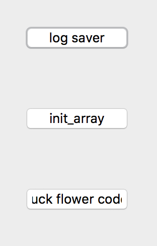
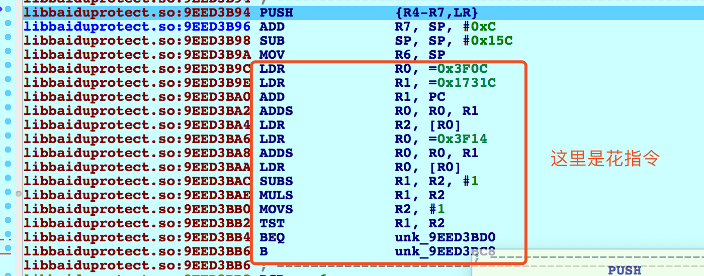
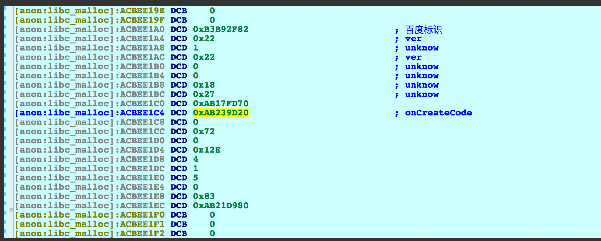
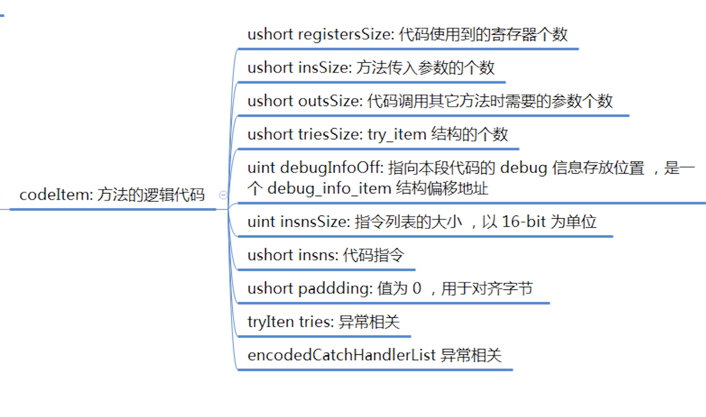
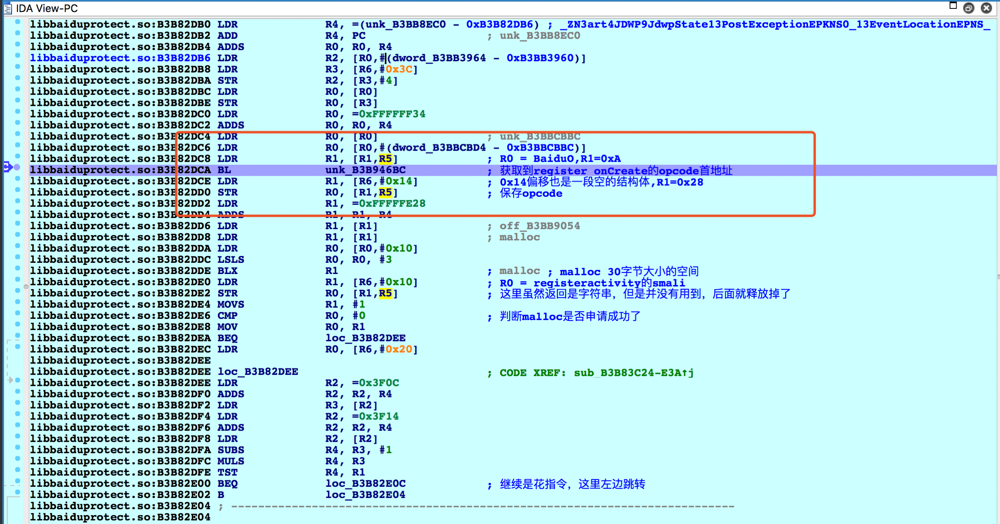
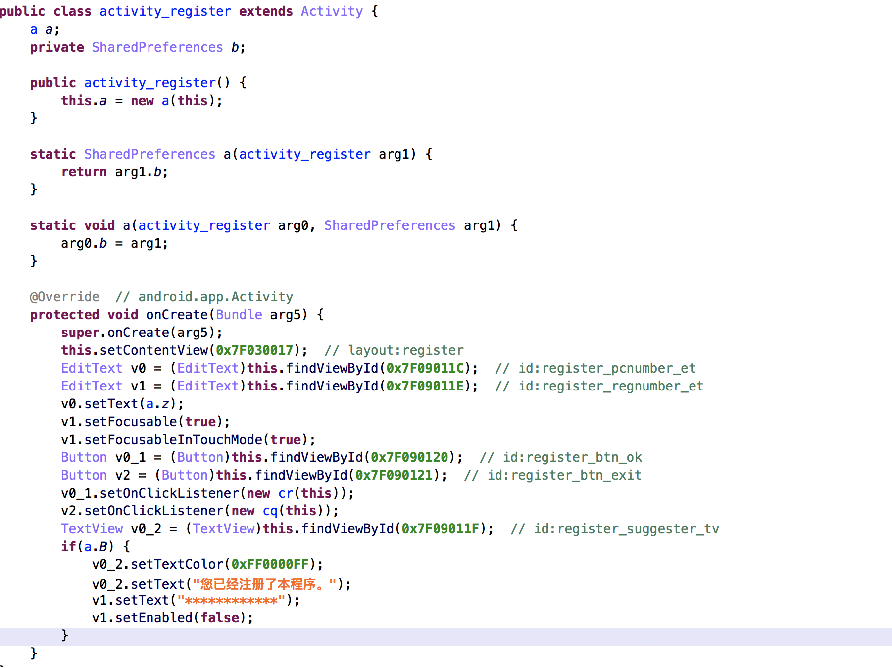
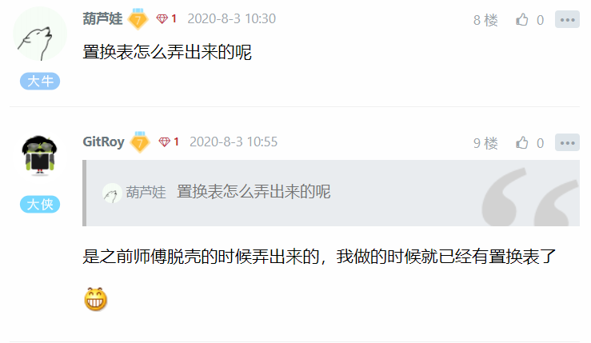

# 脱壳成长之路(3)-初识VMP

url：https://bbs.pediy.com/thread-260019.htm

### 0x0 样本信息

样本：17年BD加固
NativeHook：基于Substrate的Nativehook
Android系统: 6.0.1

### 0x1 IDAPython脚本辅助应对花指令

上一个样本中，分析壳的initarray时候，就发现有花指令和大循环，那时候没有处理，而是直接找了别的办法去脱出dex，这个样本，又一次遇到了带大量简单花指令的initarray，在老大的要求下，决定对抗一波。

 

简单的脚本界面

 



 

**log_saver：主要是保存动态调试保存so的日志**
**init_array:快速定位到so的initarray起始，提高一下每次调试的效率**
最后一个就是辅助调试花指令了
花指令详情:


 



 

汇编代码中有大量的形似与上面的指令，都是无效指令，分析的时候十分费时间，由于这个花指令特征非常明显，所以可以写脚本去辅助分析。
我的思路：
遍历整个代码匹配花指令的头，然后在花指令后面2句最终BEQ或者B的地址继续循环，直到不是花指令为止，下断点。这里面有可能会遇到真正有用的代码在花指令中，这种情况，可以try一下，catch的时候在头部地址下段即可

 

核心代码：

```
# 脚本一定要在线程中执行，否则会卡住主线程，导致界面卡死
def loop_flower_code(self, cur_addr):
    dsm = idaapi.generate_disasm_line(cur_addr)
    dsm = str(dsm)
    if '0x3F0C' in dsm and 'LDR' in dsm:
        try:
            print 'flower code start'
            self.flower_start = True
            addrbe = cur_addr + 0x18
            addrB = cur_addr + 0x1A
            dsmBe = idaapi.generate_disasm_line(addrbe)
            dsmB = idaapi.generate_disasm_line(addrB)
            f_addr = dsmBe.split('loc_')[1]
            s_addr = dsmB.split('loc_')[1]
            f_addr = int(f_addr, 16)
            s_addr = int(s_addr, 16)
            # 继续循环后面跳转的地址
            self.loop_flower_code(f_addr)
            self.loop_flower_code(s_addr)
        except BaseException:
            # 这里检测到不是标准的花指令，说明中间有有用的代码，所以在头部下断点
            idc.add_bpt(cur_addr, 1)
    elif self.flower_start:
        # 检测到已经不是花指令了，下断点
        print 'bpt:' + str(hex(cur_addr))
        self.flower_start = False
        idc.add_bpt(cur_addr, 1)
```

后面继续分析initarray，发现有so抹头，初始化反调试、和解密so的操作，篇幅原因就不截图了，印象笔记有完整的分析笔记，有需要的可以私我一哈。

### 0x2 dexdump，并修复大偏移

标准操作，dexdump，并且修复大偏移，这个操作就不再重复写了，有需求可以看我之前的文章。

 

贴一个dump出的dex


会发现，apk中的所有activity的onCreate函数被抽取了，然后调用了native的函数，现在仔细分析一下native函数

 

hook register_natvie 拿到动态注册函数的地址，然后进行分析

 

最终发现so中频繁调用JNI接口，于是简单的hook了一波

 

find cls android/app/Activity|onCreate
find cls com/nfbazi/xuankong/activity_register | setContentView
find cls android/widget/EditText
find cls com/nfbazi/xuankong/a/a
setText
setFocusable
setFocusableInTouchMode
find cls android/widget/Button
find cls com/nfbazi/xuankong/cr
<init>
find cls com/nfbazi/xuankong/cq
<init>
find cls android/widget/TextView
发现，之前java实现的功能，都用JNI实现了。于是开始了漫长的分析（过程十分漫长，我反复看了很多遍so）最终在老大的提示下，定位到下图结构体

 



 


 

codeitem相关：

 



 

置换:

 

正常
206F 001A 0054 invoke-super {v4, v5}, <void Activity.onCreate(ref) imp. @ _def_Activity_onCreate@VL>

 

处理后
2086 001A 0054 invoke-super {v4, v5}, <void Activity.onCreate(ref) imp. @ _def_Activity_onCreate@VL>

 

所以这里面0x86 对应 smali opcode 6F

### 0x3 修复nativeMethod

#### hook点:



#### dump code_item脚本

```
void *(*old_func)(void *baidu, int index);


void *new_func(void *baidu, int index) {

    //这里会Crash。不过不要紧，我们紧紧要他的code
    int startAddress = (int) baidu;
    BDList *list = (BDList *) startAddress;
    log("%x", list->onCreateCodeStart[0xA]);
    CreateCode *code = (CreateCode *) list->onCreateCodeStart[0xA];
    log("%x", code->index);
    int codeSize = code->codeSize;
    log("code size is %d", codeSize);
    FILE *codeFile =                          fopen("/data/data/com.nfbazi.xuankong/cache/code.dex", "w+");
    char *CodeItem = (char *) code->codeItem;
    fwrite(CodeItem + 2, 1, codeSize * 2, codeFile);
    fclose(codeFile);
    exit(0);
    return old_func(baidu, index);
}

/**
 * register函数启始地址
 * @param address
 */
void dumpCodeItem(void *address) {

    int addr = (int) address;
    int offest = 0x1785C;
    void *p_addr = (void *) (addr + offest);
    log("%p", p_addr);
    if (old_func == 0) {
        elf_hook_Direct(p_addr, (void *) &new_func, (void **) &old_func);
    }
}
```

#### 本地修复dex

```
#include <iostream>
#include <cstdio>

#define BYTE unsigned char
/**
 * 每个opcode长度
 */
static unsigned char OpLen[256] =
        {
                0x02, 0x02, 0x04, 0xFF, 0xFF, 0x04, 0xFF, 0x02, 0x04, 0xFF, 0x02, 0x02, 0x02, 0x02, 0x02, 0x02,
                0x02, 0x02, 0x02, 0x04, 0x06, 0x04, 0x04, 0x06, 0x0A, 0x04, 0x04, 0xFF, 0x04, 0x02, 0x02, 0x04,
                0x04, 0x02, 0x04, 0x04, 0x06, 0x06, 0x06, 0x02, 0x02, 0x04, 0xFF, 0x06, 0x06, 0x04, 0x04, 0x04,
                0x04, 0x04, 0x04, 0x04, 0x04, 0x04, 0x04, 0x04, 0x04, 0x04, 0x04, 0x04, 0x04, 0x04, 0xFF, 0xFF,
                0xFF, 0xFF, 0xFF, 0xFF, 0x04, 0x04, 0x04, 0x04, 0x04, 0x04, 0x04, 0x04, 0x04, 0x04, 0x04, 0x04,
                0x04, 0x04, 0x04, 0x04, 0x04, 0x04, 0x04, 0x04, 0x04, 0x04, 0x04, 0x04, 0x04, 0x04, 0x04, 0x04,
                0x04, 0x04, 0x04, 0x04, 0x04, 0x04, 0x04, 0x04, 0x04, 0x04, 0x04, 0x04, 0x04, 0x04, 0x06, 0x06,
                0x06, 0x06, 0x06, 0xFF, 0x06, 0x06, 0x06, 0x06, 0x06, 0xFF, 0xFF, 0x02, 0xFF, 0x02, 0xFF, 0x02,

                0x02, 0x02, 0x02, 0x02, 0x02, 0x02, 0x02, 0x02, 0x02, 0x02, 0x02, 0x02, 0x02, 0x02, 0x02, 0x02,
                0x04, 0x04, 0x04, 0x04, 0x04, 0x04, 0x04, 0x04, 0x04, 0x04, 0x04, 0x04, 0x04, 0x04, 0x04, 0x04,
                0x04, 0x04, 0x04, 0x04, 0x04, 0x04, 0x04, 0x04, 0x04, 0x04, 0x04, 0x04, 0x04, 0x04, 0x04, 0x04,
                0x02, 0x02, 0x02, 0x02, 0x02, 0x02, 0x02, 0x02, 0x02, 0x02, 0x02, 0x02, 0x02, 0x02, 0x02, 0x02,
                0x02, 0x02, 0x02, 0x02, 0x02, 0x02, 0x02, 0x02, 0x02, 0x02, 0x02, 0x02, 0x02, 0x02, 0x02, 0x02,
                0x04, 0x04, 0x04, 0x04, 0x04, 0x04, 0x04, 0x04, 0x04, 0x04, 0x04, 0x04, 0x04, 0x04, 0x04, 0x04,
                0x04, 0x04, 0x04, 0xFF, 0xFF, 0xFF, 0xFF, 0xFF, 0xFF, 0xFF, 0xFF, 0xFF, 0xFF, 0xFF, 0x06, 0xFF,
                0x06, 0xFF, 0x04, 0x04, 0x04, 0x04, 0x04, 0x04, 0x06, 0x06, 0x06, 0x06, 0xFF, 0xFF, 0xFF, 0xFF
        };

//置换表
int Res_OpBaidu[256] =
        {
                //0x00,0x01,0x02,0x03,0x04,0x05,0x06,0x07,          0x08,0x09,0x0A,0x0B,0x0C,0x0D,0x0E,0x0F,
                0xFF,0xFF,0xFF,0xFF,0xFF,0xFF,0xFF,0xFF,          0xFF,0xFF,0xFF,0xFF,0xFF,0xFF,0xFF,0xFF,       //      0
                0xFF,0xFF,0xFF,0xFF,0xFF,0xFF,0xFF,0xFF,          0xFF,0xFF,0xFF,0xFF,0xFF,0xFF,0xFF,0x00,       //      1
                0x0F,0x0E,0x11,0x10,0x18,0x19,0x1A,0x1B,          0x1C,0x12,0x13,0x14,0x15,0x16,0x17,0x01,       //      2
                0x02,0x03,0x08,0x09,0x04,0x05,0x06,0x07,          0x0A,0x0B,0x0C,0x0D,0x1D,0x1E,0x1F,0x23,       //      3
                0x24,0x20,0x21,0x22,0x25,0xFF,0x27,0x28,          0x29,0x2A,0x34,0x35,0x36,0x37,0xFF,0x49,       //      4
                0x4E,0x51,0x52,0x53,0x54,0x55,0xFF,0x2D,          0x31,0x32,0x33,0x38,0x39,0x3A,0x2E,0x2F,       //      5
                0x30,0x3B,0x3C,0x3D,0x44,0x45,0x46,0x4A,          0x4B,0x4C,0x4D,0x47,0x48,0x4F,0x50,0x56,       //      6
                0x5C,0x5D,0x5E,0x57,0x58,0x59,0x5A,0x5B,          0x62,0x63,0x64,0x65,0x5F,0x60,0x61,0x66,       //      7

                0x67,0x6A,0x6B,0x6C,0x6D,0x6E,0x6F,0x68,          0x69,0x70,0x71,0x72,0x82,0x83,0x84,0x85,       //      8
                0x86,0x74,0x78,0x7B,0x7C,0x7D,0x7E,0x7F,          0x75,0x76,0x77,0x80,0x81,0x87,0x88,0x89,       //      9
                0x8A,0x8B,0x93,0x94,0x95,0xA7,0xA8,0xA9,          0xAA,0xAB,0xAC,0x96,0x97,0x98,0x99,0x9A,       //      A
                0x9B,0x9C,0x9D,0xB4,0xB5,0xB6,0xC6,0xC7,          0xC8,0xC9,0x9E,0x9F,0xA0,0xA1,0xA2,0x8C,       //      B
                0x8D,0x8E,0x8F,0x90,0x91,0x92,0xA3,0xA4,          0xA5,0xA6,0xB7,0xB8,0xB9,0xBA,0xBB,0xBC,       //      C
                0xBD,0xBE,0xBF,0xAD,0xAE,0xAF,0xB0,0xB1,          0xB2,0xB3,0xCA,0xCB,0xCC,0xD5,0xD6,0xD7,       //      D
                0xD8,0xD9,0xDA,0xC0,0xC1,0xC2,0xC3,0xC4,          0xC5,0xDD,0xDE,0xDF,0xE0,0xE1,0xE2,0xFF,       //      E
                0xFF,0xFF,0xCD,0xCE,0xCF,0xD0,0xD1,0xD2,          0xD3,0xD4,0xDB,0xDC,0xFF,0xFF,0xFF,0xFF      //    F
        };

int main() {
    using namespace std;
    int i = Res_OpBaidu[0x86];
    cout << hex << i << endl;
    int length = OpLen[i];
    cout << hex << length << endl;
    FILE *codeFile = fopen("/Users/roy/CLionProjects/FixCodeItem/code.dex", "r");
    void *saveCode = malloc(214);
    fread(saveCode, 1, 214, codeFile);
    fclose(codeFile);

    FILE *fixFile = fopen("/Users/roy/CLionProjects/FixCodeItem/code_fix.dex", "w+");
    BYTE *codeChar = (BYTE *) saveCode;
    int len = 0;
    for (int j = 0; j < 214; ++j) {
        BYTE code = codeChar[j];
        int realopcode = Res_OpBaidu[code];
        if (j == len) {
            printf("real opcode is %x\n", code);
            codeChar[j] = realopcode;
            len = len + OpLen[realopcode];
        }

        printf("%x\n", code);
    }
    fwrite(codeChar, 1, 214, fixFile);
    fclose(fixFile);
//    fread()
    return 0;
}
```

### 0x4 完成


感谢我的老大！
感谢大家观看!


