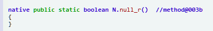
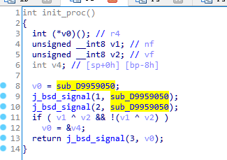

# 某抽取壳的原理简析

## 样本来自看雪3W班4月第3题。 

## 样本分析:

 jdax分析看看结构~ 发现是某加壳后的文件结构 

 

##  **GAD分析:**

 **从最早加载入口分析开始：**




 都是 native函数 并且都是动态注册的 frida hook RegisterNatives 找到绑定的函数 继续分析：


**由于该函数分析难度较大,我们下面直接通过系统源码层面进行脱壳原理分析 当然想要Dump DEX先把 反调试过掉**


## **反反调试:**

 **信号反调试, frida 反调试 jdb附加反调试等等 我们这里主要是把frida反调试过掉 让frida可以正常dump下DEX文件**




 **这个把注册函数设置为0 让其注册失败就可以过掉 其他反调试类似~ 那下面直接用frida实现 过一下反调试吧 让frida可以使用就行**

其他反调试可以自己尝试

 **frida anti:**

```
function Hook_bsd_signal() {
    var bsd_signal_fnc = Module.findExportByName(null, 'bsd_signal');
    console.log("bsd_signal_fnc  :", bsd_signal_fnc);
    Interceptor.attach(bsd_signal_fnc, {
        onEnter: function (args) {
            //this.context.r0 = ptr(0);
            var bsd_rfnc = this.context.r1;
            this.context.r1 = ptr(0);
            console.log("bsd_signal_fnc r0 ", this.context.r0);
            console.log("bsd_signal_fnc r1 ", bsd_rfnc," >>> ",this.context.r1);
            console.log("bsd_signal_fnc LR : ", this.context.lr);
            if (libexec_fnc == null) {
                libexec_fnc = Module.getBaseAddress('libexec_xgtl.so');
                console.log("libexec Addr :", libexec_fnc);
                Hook_gettimeofday();
                Hook_anti_61950_replace();
                Hook_anti_5D56C_replace();
            }
        },
        onLeave: function (retval) {
            console.log("bsd_signal_fnc retval:",retval);
        }
    });
}
function Hook_anti_61950_replace () {
    var anti_61950 = libexec_fnc.add(0x61951);
    console.log("anti_61950_replace addr :", anti_61950);
    Interceptor.replace(anti_61950, new NativeCallback(function (a0) {
        console.log("anti_61950_replace a0 :", a0);
        return 0;
    }, 'int', ['int']));
}
function Hook_anti_5D56C_replace () {
    var anti_5D56C = libexec_fnc.add(0x5D56D);
    console.log("anti_5D56C_replace addr :", anti_5D56C);
    Interceptor.replace(anti_5D56C, new NativeCallback(function (a1,a2,a3,a4) {
        return 0;
    }, 'int', ['int','int','int','int']));
}
```

**基本 frida 附加没问题了呢 还有些反调试这里没有继续找了 这样我们就可以直接实现dump dex文件了呢**

## **frida dump DEX** 

**关于整体Dump DEX 有很多点可以完成,在art下有如常用DexFile::OpenMemory() 主要是能通过DexFile类结构得到base,size即可**

**我这里采用的 art::DexFile::DexFile()函数,通常无论你怎么隐藏加密DEX最终都要通过系统函数加载到系统中,dump解决之**

先尝试dump DEX看看样本具体表现吧 然后再看情况处理

**调试模式启动App 然后frida 附加上 jdb 启动 记得要附加上 反反调试 不然会马上结束掉进程 就没意思了呢**

**
**

**frida Dump Dex:**

```
var processName = "com.xgtl.assistant";
function Dex_Dump_file(DumpClassName, Base, size) {
    var dex_begin = ptr(Base);
    var dex_size = size;
    //if (SavaSize.indexOf(dex_size) != -1) {return;}
    var Dex_magic = Memory.readUtf8String(dex_begin);
    if (Dex_magic.indexOf("035") > -1) {
        var Dex_fileName = DumpClassName + "_" + dex_size.toString() + ".dex";
        var dex_path = "/data/data/" + processName + "/" + Dex_fileName;
        console.log("Dex_DUMP FileName :", dex_path);
        var dex_file = new File(dex_path, "wb");
        var buffw = Memory.readByteArray(dex_begin, dex_size);
        //console.log(buffw);
        dex_file.write(buffw);
        dex_file.flush();
        dex_file.close();
        SavaSize.push(dex_size);
    }
}
function  hook_art_Base_addr() {
    var symbols = Module.enumerateSymbolsSync("libart.so");
 
    for (var i = 0; i < symbols.length; i++) {
        var symbol = symbols[i];
        if (symbol.name == "_ZN3art7DexFile10OpenMemoryEPKhjRKNSt3__112basic_stringIcNS3_11char_traitsIcEENS3_9allocatorIcEEEEjPNS_6MemMapEPKNS_10OatDexFileEPS9_") {
            art_DexFile_OpenMemory = symbol.address;
            console.log("art_DexFile_OpenMemory ", symbol.address, symbol.name);
        } else if (symbol.name == "_ZN3art11ClassLinker10LoadMethodERKNS_7DexFileERKNS_21ClassDataItemIteratorENS_6HandleINS_6mirror5ClassEEEPNS_9ArtMethodE") {
            art_ClassLinker_LoadMethod = symbol.address;
            console.log("art_ClassLinker_LoadMethod ", symbol.address, symbol.name);
        } else if (symbol.name == "_ZN3art7DexFileC2EPKhjRKNSt3__112basic_stringIcNS3_11char_traitsIcEENS3_9allocatorIcEEEEjPKNS_10OatDexFileE") {
            art_DexFile_DexFile = symbol.address;
            console.log("art_DexFile_DexFile ", symbol.address, symbol.name);
        }else if (symbol.name == "_ZN3art9ArtMethod6InvokeEPNS_6ThreadEPjjPNS_6JValueEPKc") {
            art_ArtMethod_Invoke = symbol.address;
            console.log("art_ArtMethod_Invoke ", symbol.address, symbol.name);
        }
    }
}
function Hook_art_DexFile_DexFile() {
    if (art_DexFile_DexFile != null) {
        Interceptor.attach(art_DexFile_DexFile, {
            onEnter: function (args) {
                this.dex_Base = args[1];
                this.dex_Size = args[2];
              console.log("dex_file Info:", this.dex_Base , this.dex_Size );
            },
            onLeave: function (retval) {
                console.log("= art_DexFile_DexFile DUMP =");
                Dex_Dump_file("DexFile", this.dex_Base ,this.dex_Size.toInt32());
            }
        });
    }
}
```

 具体就是根据android 加载 DEX 文件流程函数 在关键函数() dump 出解密后DEX文件 然后我们再根据具体处理

 跑一下看看dump那些文件吧

 

**这里有个小技巧过反调试 这jdb附加上会马上结束进程 如果我们在按下回车键后马上按 ctrl +c 关闭掉就能过掉了呢 然后app就正常启动了**


果然在包文件目录下Dump下来了些DEX 打开分析看看 是不是完整了呢~ pull 回来用GDA看看


发现大量抽取了方法代码 通过 H.i 函数进行还原 根据android源码 我们在他加载方法函数(LoadMethod) 再Dump DEX看看是不是已经部分还原了

## ** **

## **frida LoadMethod Dump:**


为了定位具体还原那个方法 我们也 hook H.i( ) 函数 打印一下 参数 就能知道还原那个方法ID了呢

在app随便点击些功能 我这里点击的(虚拟位置功能) 然后比对 看看有没有还原了部分方法代码吧


果然重新Dump下来一个 我们比较原来的看看吧 随便找几个ID看看 有没有还原


这里 r2 就是 H.i函数参数id 我们根据这个用 jdax查找看看 定位到这里


 这个是DexFile 函数Dump下来的 还没有还原的方法定位

 继续打开 LoadMethod() 加载方法 Dump下来的DEX定位到相应位置看看效果吧~

 

 已经还原为正常代码了呢~ 再找几个看看 

 --》》 

 确实已经部分还原了呢~ 


 **从上面可以大概得知无论你怎么抽取最后还是要走系统函数流程加载方法然后运行流程** 

 **所以根据android源码来定制脱壳方法就很方便 当然还有其他对抗修改系统源码方式 具体方式具体研究吧~**

 

 根据上面分析流程知道 只要主动调用函数就能跑出真正的代码 当然正常分析算法

 只要在真实APP运行 就能跑出自己需要的部分关键代码 感觉这样抽取函数就没什么意义 但对于重打包效果还是很好的吧~（瞎猜）

 

 我们用frida 稍微实现下主动调用吧 看看是否就跑出正常代码（我菜鸟）

 com.xgtl.aggregate.utils.f

 

 原始还没有主动调用代码信息

 

 主动调用类下所有void参数方法 我们跑一下主动调用然后dump下来会怎么样呢~是否已经是正常代码

 

 有很多无法正常调用~ 我们看看正常主动调用的是否已经跑出正常代码呢

 


 **确实已经跑出了正常代码~ 这就是大概的解决类抽取的方案基础原理了吧**

 **大多基础原理都是根据系统源码逻辑来的 所以学好系统源码很重要的呢 本人一知半解 分析有出入望指正 基本分析到这里了~**

 **886~**


