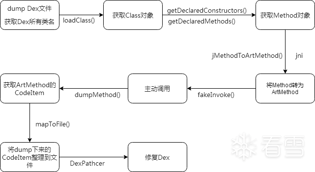
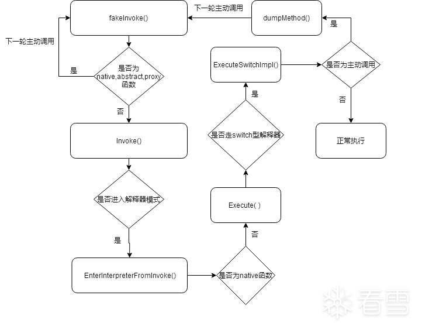

# AUPK：基于Art虚拟机的脱壳机

### 一. 背景

如今,随着开发者安全意识的提高,加壳的app比比皆是,反而不加壳的并不多见.对于一款加壳的app,脱壳是逆向工程中非常重要的一个步骤.有一个好的脱壳机,可以大大节省逆向人员的时间与精力.

 

android系统的换代升级非常块,在4.4版本后舍弃了以往的dalvik虚拟机,取而代之的是更高效的art虚拟机.在android脱壳领域,有许多前辈共享了其思路,代码,使本人得已站在巨人的肩膀上进行学习,研究.如[FART：ART环境下基于主动调用的自动化脱壳方案](https://bbs.pediy.com/thread-252630.htm)中,[hanbingle](https://bbs.pediy.com/user-home-632473.htm)大佬开源的基于art的主动调用方案:[FART](https://github.com/hanbinglengyue/FART).

###### 那么,既然有了FART,为什么我还要写AUPK呢?

1. FART是通过ClassLoader里的path_list来获取DexFile对象，再通过以下方法来获取到所有类,

   ```
   package dalvik.system.DexFile;
   String[] getClassNameList(DexFile dexFile,Object mCookie);
   ```

	进而获取到所有Method对象并进行主动调用.这种方案在大多数情况下非常有效,但对某些壳,如某南极动物壳,这里无法获取到关键的DexFile对象,导致无法进行后面的主动调用.AUPK提供了其他思路来应对这种情况.

1. FART的调用链只到了Invoke函数即返回,对于许多函数恢复时机更晚的抽取壳,如某加密,某叠字壳,如果函数是第一次执行,此时dump下来的codeItem,显然是未解密的,AUPK构造了更深的调用链,以及更晚的dump时机来解决这一问题.

论坛也有许多其他的大佬，提供了ART下的主动调用脱壳思路，但遗憾的是，均未开源。所以我决定自己实现一个脱壳机。

### 二. 原理

整体流程图：

 



##### 脱壳

关于如何整体dump Dex文件，网上有诸多的解决方案,各家都有不同的脱壳点，如`DexFile:init`,`DexFile::OpenCommon`等，其原理是因为dex文件在进行加载的时候，必定会调用这些函数，且此时能方便的拿到`DexFile`对象,从而进行dump。AUPK的脱壳点在`ExecuteSwitchImpl`，当满足特定条件时，类中的某些函数必定会走到这里，此时可以通过栈帧拿到ArtMethod对象，进而获取到DexFile对象。

 

在[拨云见日：安卓APP脱壳的本质以及如何快速发现ART下的脱壳点](https://bbs.pediy.com/thread-254555.htm)一文中,作者阐明了,不管壳是否禁用了dex2oat,类的初始化函数始终运行在ART下的inpterpreter模式,即class.<clinit>函数是必定要运行到Execute函数中的,当app运行时,不可避免的要加载dex,加载、链接、解析、初始化类，而当有类进行初始化的时候，就一定会走到Execute

 

Execute部分代码如下所示:

```
// interpreter.cc
static inline JValue Execute(
        Thread *self,
        const DexFile::CodeItem *code_item,
        ShadowFrame &shadow_frame,
        JValue result_register,
        bool stay_in_interpreter = false) SHARED_REQUIRES(Locks::mutator_lock_){
    if (kInterpreterImplKind == kMterpImplKind)
    {
        if (transaction_active)
        {
            // No Mterp variant - just use the switch interpreter.
            return ExecuteSwitchImpl<false, true>(self, code_item, shadow_frame, result_register,
                                                  false);
        }
        else if (UNLIKELY(!Runtime::Current()->IsStarted()))
        {
            return ExecuteSwitchImpl<false, false>(self, code_item, shadow_frame, result_register,
                                                   false);
        }
        else
        {
            while (true)
            {
                // Mterp does not support all instrumentation/debugging.
                if (MterpShouldSwitchInterpreters())
                {
                    return ExecuteSwitchImpl<false, false>(self, code_item, shadow_frame, result_register,false);
                }
                bool returned = ExecuteMterpImpl(self, code_item, &shadow_frame, &result_register);
                if (returned)
                {
                    return result_register;
                }
                else
                {
                    // Mterp didn't like that instruction.  Single-step it with the reference interpreter.
                    result_register = ExecuteSwitchImpl<false, false>(self, code_item, shadow_frame,result_register, true);
                    if (shadow_frame.GetDexPC() == DexFile::kDexNoIndex)
                    {
                        // Single-stepped a return or an exception not handled locally.  Return to caller.
                        return result_register;
                    }
                }
            }
        }
    }
    else if (kInterpreterImplKind == kSwitchImplKind)
    {
        if (transaction_active)
        {
            return ExecuteSwitchImpl<false, true>(self, code_item, shadow_frame, result_register,
                                                  false);
        }
        else
        {
            return ExecuteSwitchImpl<false, false>(self, code_item, shadow_frame, result_register,
                                                   false);
        }
    }
    else
    {
        DCHECK_EQ(kInterpreterImplKind, kComputedGotoImplKind);
        if (transaction_active)
        {
            return ExecuteGotoImpl<false, true>(self, code_item, shadow_frame, result_register);
        }
        else
        {
            return ExecuteGotoImpl<false, false>(self, code_item, shadow_frame, result_register);
        }
    }
    ...
 }
```

可以看到，Execute会根据当前选择的解释器类型，进入不同的解释器去执行，当我们手动把默认的解释器改为`kSwitchImplKind`，则可以让Execute默认走swich型解释器，从而进入ExecuteSwitchImpl

```
// interpreter.cc
//static constexpr InterpreterImplKind kInterpreterImplKind = kMterpImplKind;
static constexpr InterpreterImplKind kInterpreterImplKind = kSwitchImplKind;
```

在ExecuteSwitchImpl函数中，通过shadow_frame.GetMethod()可以拿到当前ArtMethod对象，再通过artMethod->GetDexFile()可以获取DexFile对象，

 

最后通过DexFile对象的Begin(),Size()获取到起始位置和大小，来dump Dex文件.

```
template <bool do_access_check, bool transaction_active>
    JValue ExecuteSwitchImpl(Thread *self, const DexFile::CodeItem *code_item,
                             ShadowFrame &shadow_frame, JValue result_register,
                             bool interpret_one_instruction) SHARED_REQUIRES(Locks::mutator_lock_){
    ArtMethod *artMethod = shadow_frame.GetMethod();
    bool isFakeInvokeMethod = Aupk::isFakeInvoke(self, artMethod);
 
    if (!isFakeInvokeMethod && strstr(PrettyMethod(shadow_frame.GetMethod()).c_str(), "<clinit>") != nullptr)
    {      
        const DexFile *dexFile = artMethod->GetDexFile();
        char feature[] = "ExecuteSwitchImpl";
        Aupk::dumpDexFile(dexFile, feature);
        Aupk::dumpClassName(dexFile, feature);
    }
}
```

与此同时，在dumpClassName函数中，获取Dex文件的所有类名,并写入到文件(关于这一步的作用,后面会讲到)：

```
json root;
for (size_t i = 0; i < dexFile->NumClassDefs(); i++)
{
    const DexFile::ClassDef &classDef = dexFile->GetClassDef(i);
    const char *descriptor = dexFile->GetClassDescriptor(classDef);
    root["count"] = i + 1;
    root["data"][i] = descriptor;
}
ofstream oFile;
oFile.open(fileName, ios::out);
if (oFile.is_open())
{
    oFile << root;
    oFile.close();
    LOG(INFO) << "AUPK->dump class name:success:" << fileName;
}
```

到这里,我们已经拿到了Dex文件，以及Dex文件包含的所有类的类名。

 

若想对函数进行主动调用，则必须得到函数对应的ArtMethod对象，以下方法将jMethod转为ArtMethod


```
// aupk_method.cc
ArtMethod *jMethodToArtMethod(JNIEnv *env, jobject jMethod)
{
    ScopedFastNativeObjectAccess soa(env);
    ArtMethod *method = ArtMethod::FromReflectedMethod(soa, jMethod);
    return method;
}
```

在Java中，Method对象可以通过Class对象的成员方法getDeclaredMethods()来获得

```
// 获取目标类的所有构造函数
Constructor constructors[] = klass.getDeclaredConstructors();
for (Object constructor : constructors)
{
    String methodName=klass.getName()+constructor.toString();
    classInfo.methodMap.put(methodName,constructor);
    count++;
}
 
// 获取目标类的所有成员函数
Method[] methods = klass.getDeclaredMethods();
for (Method method : methods)
{
    String methodName=klass.getName()+method.toString();
    classInfo.methodMap.put(methodName,method);
    count++;
}
```

所以，只要获取到了所有的Class对象，那么就可以得到所有的ArtMethod对象。在前面，我们获取到了Dex里包含的所有类的名字，此时便可对这些类进行加载，并通过上述方法获取到所有Method对象。

```
// 通过类名加载类，得到Class对象
Class klass=getClassLoader().loadClass(className);
```

>小结：首先通过类名加载并获取类对象，再通过类对象获取类中所有的方法，进而将方法传入native层，转为artMethod，并进行主动调用。

至此，已经可以拿到所有的ArtMethod对象了。

 

接下来就可以构造参数，并对其进行主动调用：

```
void Aupk::aupkFakeInvoke(ArtMethod *artMethod) SHARED_REQUIRES(Locks::mutator_lock_)
{
    if (artMethod->IsAbstract() || artMethod->IsNative() || (!artMethod->IsInvokable()) || artMethod->IsProxyMethod())
    {
        return;
    }
    JValue result;
    Thread *self = Thread::Current();
    uint32_t args_size = (uint32_t)ArtMethod::NumArgRegisters(artMethod->GetShorty());
 
    if (!artMethod->IsStatic())
    {
        args_size += 1;
    }
    std::vector<uint32_t> args(args_size, 0);
    if (!artMethod->IsStatic())
    {
        args[0] = 0x12345678;
    }
    artMethod->Invoke(self, args.data(), args_size, &result, artMethod->GetShorty());
}
```

在解释执行模式下,Native方法和动态Proxy方法没有意义,所以直接跳过,抽象方法不能执行,需要其子类提供实现,所以也直接跳过

> 需要注意的是，函数的第一个参数要赋值为除0以外的任何值,因为后面判断 CHECK(arg[0]!=nullptr)

在art中，系统会在app安装或运行过程中对dex文件进行dex2oat，将其中的函数编译成目标代码，而不再是虚拟机执行的字节码，同时也保留了原来由虚拟机执行的字节码，所以art代码既可以运行在解释器模式下，也可以作为quick_code来执行。为了使主动调用的函数能够到达`ExecuteSwitchImpl`函数，这里使主动调用的函数强制走解释器：

```
//art_method.cc
void ArtMethod::Invoke(Thread *self, uint32_t *args, uint32_t args_size, JValue *result,const char *shorty)
{
    ...
    bool isFakeInvokeMethod = Aupk::isFakeInvoke(self, this);
    if (UNLIKELY(!runtime->IsStarted() || Dbg::IsForcedInterpreterNeededForCalling(self, this) || isFakeInvokeMethod))
    {
      if (IsStatic())
      {      
        art::interpreter::EnterInterpreterFromInvoke(
            self, this, nullptr, args, result, /*stay_in_interpreter*/ true);
      }
      else
      {
        mirror::Object *receiver =
            reinterpret_cast<StackReference<mirror::Object> *>(&args[0])->AsMirrorPtr();      
        art::interpreter::EnterInterpreterFromInvoke(
            self, this, receiver, args + 1, result, /*stay_in_interpreter*/ true);
      }
    }
    else
    {
        ...
        if (!IsStatic())
        {
          (*art_quick_invoke_stub)(this, args, args_size, self, result, shorty);
        }
        else
        {
          (*art_quick_invoke_static_stub)(this, args, args_size, self, result, shorty);
        }
        ...
    }
}
```

这样一来，主动调用时，函数不管是静态还是非静态，都会走art::interpreter::EnterInterpreterFromInvoke，分析EnterInterpreterFromInvoke函数可知，如果调用的方法为非native方法，则会进入Execute函数继续执行,而native方法，并非我们所关注的对象，所以在主动调用前，会过滤掉native函数

```
void EnterInterpreterFromInvoke(Thread *self, ArtMethod *method, Object *receiver,
                                    uint32_t *args, JValue *result,
                                    bool stay_in_interpreter){
    ...
    if (LIKELY(!method->IsNative()))
    {
        JValue r = Execute(self, code_item, *shadow_frame, JValue(), stay_in_interpreter);
        if (result != nullptr)
        {
            *result = r;
        }
     }
    else
    {
        ...
    }
    ...
}
```

如上文所述，进入Execute后,函数最终会进入ExecuteSwitchImpl执行。在ExecuteSwitchImpl函数中，准备工作都已做好，函数指令即将开始执行，对于大多数壳来说，此时函数的code_item都已修复，否则函数无法正常执行，这也是为什么会将主动调用链构造到这里的原因。事实上，对于大多数壳，在这里都可以获取到已被恢复的code_item，个别情况，如在函数体内部goto跳转进行自解密的情况，则需要单独处理：

```
bool firstInsIsGoto = false;
if (isFakeInvokeMethod)
{
    inst_data = inst->Fetch16(0);
    // 当执行的为方法的第一条指令时
    if (dex_pc == 0)
    {
        if (inst->Opcode(inst_data) == Instruction::GOTO ||
            inst->Opcode(inst_data) == Instruction::GOTO_16 ||
            inst->Opcode(inst_data) == Instruction::GOTO_32)
        {
            // 如果第一条指令为goto,则继续执行
            firstInsIsGoto = true;
        }
        else
        {
            // 如果第一条指令不是goto,则直接dumpMethod
            char feature[] = "ExecuteSwitchImpl";
            Aupk::dumpMethod(method, feature);
            return JValue();
        }
    }
 
    if(inst->Opcode(inst_data) == Instruction::INVOKE_STATIC)
    {
        if (firstInsIsGoto)
        {
            // 如果指令为invoke-static,且第一条指令为goto,则等invoke-static执行完毕后再dumpMethod
            DoInvoke<kStatic, false, false>(self, shadow_frame, inst, inst_data, &result_register);
            char feature[] = "ExecuteSwitchImpl";
            LOG(INFO)<<"AUPK->ExecuteSwitchImpl goto:"<<PrettyMethod(shadow_frame.GetMethod());
            Aupk::dumpMethod(method, feature);
            return JValue();
        }
    }
}
```

上述处理方式并不通用，需要根据具体的情况来作处理，总的来说，dump时机一定要在函数指令被恢复之后，但又要在函数真正的指令被执行之前。

 

除了我们主动调用的函数，依然有大量的其他函数会执行到`ExecuteSwitchImpl`，所以我们需要在此处进行判断：如果是我们主动调用的函数，则不让其执行真正的指令，否则正常执行。那么，如何判断函数调用是否为我们主动调用的呢？

 

这里可采用的方法多种多样，AUPK中采取了如下方式：在最开始，我们创建了一个主动调用线程，那么在进行fakeInvoke的时候，可以保存当前的`Thread`对象，以及即将进行主动调用的`ArtMethod`对象，在主动调用过程中，比对这两个值，即可判断是否为主动调用的函数。不过，此方式需要过滤掉我们主动调用过程中，所用到的java层函数，否则会引发各种错误。


```
// aupk.cc
static void Aupk_native_fakeInvoke(JNIEnv *env, jclass, jobject jMethod) SHARED_REQUIRES(Locks::mutator_lock_)
{
    if (jMethod != nullptr)
    {
        Thread *self = Thread::Current();
        ArtMethod *artMethod = jMethodToArtMethod(env, jMethod);
        // 保存Thread对象
        Aupk::setThread(self);
        // 保存ArtMethod对象
        Aupk::setMethod(artMethod);
        // 发起主动调用
        Aupk::aupkFakeInvoke(artMethod);
    }
    return;
}
 
Thread *Aupk::aupkThread = nullptr;
ArtMethod *Aupk::aupkArtMethod = nullptr;
 
 
void Aupk::setMethod(ArtMethod *method)
{
    aupkArtMethod = method;
}
 
void Aupk::setThread(Thread *thread)
{
    aupkThread = thread;
}
 
bool Aupk::isFakeInvoke(Thread *thread, ArtMethod *method) SHARED_REQUIRES(Locks::mutator_lock_)
{
    if (aupkThread == nullptr || aupkArtMethod == nullptr || thread == nullptr || method == nullptr)
    {
        return false;
    }
    if ((thread->GetTid() == aupkThread->GetTid()) &&
        strcmp(PrettyMethod(method).c_str(), PrettyMethod(aupkArtMethod).c_str()) == 0)        
    {                                        
        return true;
    }
    return false;
}
```

我画了一张图，来对上述流程做一个总结

 



 

其中`fakeInvoke()`为主动调用的入口，省略了非主动调用的函数的执行流程。

##### 修复

###### 修复的整体思路如下：

- 解析dump下来的Dex文件
- 遍历Dex文件所有direct_method和virtual_method,并获取其index
- 根据index去找到dump下来的函数信息的code_item
- 将code_item回填
- 部分壳需要还原dex_header中的 Magic字段

其所需的知识主要是对dex文件结构的理解，网上已有许多相关资料，此处不多赘述。

### 三.实验

首先安装目标app

