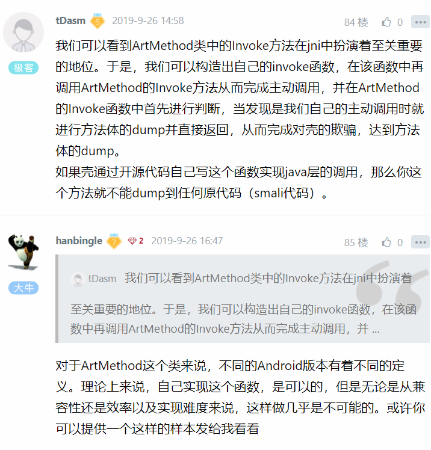

# FART：ART环境下基于主动调用的自动化脱壳方案 

# FART：ART环境下基于主动调用的自动化脱壳方案

## 一、App启动流程

这里以一张图说明App进程的创建流程：


 

通过Zygote进程到最终进入到app进程世界，我们可以看到ActivityThread.main()是进入App世界的大门，下面对该函数体进行简要的分析，具体分析请看文末的参考链接。

```
5379    public static void main(String[] args) {
5380        Trace.traceBegin(Trace.TRACE_TAG_ACTIVITY_MANAGER, "ActivityThreadMain");
5381        SamplingProfilerIntegration.start();
5382
5383        // CloseGuard defaults to true and can be quite spammy.  We
5384        // disable it here, but selectively enable it later (via
5385        // StrictMode) on debug builds, but using DropBox, not logs.
5386        CloseGuard.setEnabled(false);
5387
5388        Environment.initForCurrentUser();
5389
5390        // Set the reporter for event logging in libcore
5391        EventLogger.setReporter(new EventLoggingReporter());
5392
5393        AndroidKeyStoreProvider.install();
5394
5395        // Make sure TrustedCertificateStore looks in the right place for CA certificates
5396        final File configDir = Environment.getUserConfigDirectory(UserHandle.myUserId());
5397        TrustedCertificateStore.setDefaultUserDirectory(configDir);
5398
5399        Process.setArgV0("<pre-initialized>");
5400
5401        Looper.prepareMainLooper();
5402
5403        ActivityThread thread = new ActivityThread();
5404        thread.attach(false);
5405
5406        if (sMainThreadHandler == null) {
5407            sMainThreadHandler = thread.getHandler();
5408        }
5409
5410        if (false) {
5411            Looper.myLooper().setMessageLogging(new
5412                    LogPrinter(Log.DEBUG, "ActivityThread"));
5413        }
5414
5415        // End of event ActivityThreadMain.
5416        Trace.traceEnd(Trace.TRACE_TAG_ACTIVITY_MANAGER);
5417        Looper.loop();
5418
5419        throw new RuntimeException("Main thread loop unexpectedly exited");
5420    }
5421}

```

对于ActivityThread这个类，其中的sCurrentActivityThread静态变量用于全局保存创建的ActivityThread实例，同时还提供了public static ActivityThread currentActivityThread()静态函数用于获取当前虚拟机创建的ActivityThread实例。ActivityThread.main()函数是java中的入口main函数,这里会启动主消息循环，并创建ActivityThread实例，之后调用thread.attach(false)完成一系列初始化准备工作，并完成全局静态变量sCurrentActivityThread的初始化。之后主线程进入消息循环，等待接收来自系统的消息。当收到系统发送来的bindapplication的进程间调用时，调用函数handlebindapplication来处理该请求

```
private void handleBindApplication(AppBindData data) {
    //step 1: 创建LoadedApk对象
    data.info = getPackageInfoNoCheck(data.appInfo, data.compatInfo);
    ...
    //step 2: 创建ContextImpl对象;
    final ContextImpl appContext = ContextImpl.createAppContext(this, data.info);
 
    //step 3: 创建Instrumentation
    mInstrumentation = new Instrumentation();
 
    //step 4: 创建Application对象;在makeApplication函数中调用了newApplication，在该函数中又调用了app.attach(context)，在attach函数中调用了Application.attachBaseContext函数
    Application app = data.info.makeApplication(data.restrictedBackupMode, null);
    mInitialApplication = app;
 
    //step 5: 安装providers
    List<ProviderInfo> providers = data.providers;
    installContentProviders(app, providers);
 
    //step 6: 执行Application.Create回调
    mInstrumentation.callApplicationOnCreate(app);
```

在 handleBindApplication函数中第一次进入了app的代码世界，该函数功能是启动一个application，并把系统收集的apk组件等相关信息绑定到application里，在创建完application对象后，接着调用了application的attachBaseContext方法，之后调用了application的onCreate函数。由此可以发现，app的Application类中的attachBaseContext和onCreate这两个函数是最先获取执行权进行代码执行的。这也是为什么各家的加固工具的主要逻辑都是通过替换app入口Application，并自实现这两个函数，在这两个函数中进行代码的脱壳以及执行权交付的原因。

## 二、APP加壳原理以及运行流程

在第一节的App启动流程中我们最终可以得出结论，app最先获得执行权限的是app中声明的Application类中的attachBaseContext和onCreate函数。因此，壳要想完成应用中加固代码的解密以及应用执行权的交付就都是在这两个函数上做文章。下面这张图大致讲了加壳应用的运行流程。


当壳在函数attachBaseContext和onCreate中执行完加密的dex文件的解密后，通过自定义的Classloader在内存中加载解密后的dex文件。为了解决后续应用在加载执行解密后的dex文件中的Class和Method的问题，接下来就是通过利用java的反射修复一系列的变量。其中最为重要的一个变量就是应用运行中的Classloader，只有Classloader被修正后，应用才能够正常的加载并调用dex中的类和方法，否则的话由于Classloader的双亲委派机制，最终会报ClassNotFound异常，应用崩溃退出，这是加固厂商不愿意看到的。由此可见Classloader是一个至关重要的变量，所有的应用中加载的dex文件最终都在应用的Classloader中。

因此，只要获取到加固应用最终通过反射设置后的Classloader，我们就可以通过一系列反射最终获取到当前应用所加载的解密后的内存中的Dex文件。

随着加壳技术的发展，为了对抗dex整体加固更易于内存dump来得到原始dex的问题，各加固厂商又结合hook技术，通过hook dex文件中类和方法加载执行过程中的关键流程，来实现在函数执行前才进行解密操作的指令抽取的解决方案。此时，就算是对内存中的dex整体进行了dump，但是由于其方法的最为重要的函数体中的指令被加密，导致无法对相关的函数进行脱壳。由此，Fupk3诞生了，该脱壳工具通过欺骗壳而主动调用dex中的各个函数，完成调用流程，让壳主动解密对应method的指令区域，从而完成对指令抽取型壳的脱壳。

## 三、现有ART环境下自动化脱壳工具及优缺点

针对虚拟机运行过程中类的加载执行流程进行修改从而完成脱壳的集大成者算是dexhunter。dexhunter分别实现了dalvik和art环境下的加固app的脱壳。然而，当前针对dexhunter的脱壳原理来对抗dexhunter的技术也不断被应用，比如添加无效类并在这些类的初始化函数加入强制退出相关的代码以及检测dexhunter的配置文件等。其次，当前ART环境下的脱壳技术还有基于dex2oat编译生成oat过程的内存中的dex的dump技术，该方法依然是整体型dump，无法应对指令抽取型加固,同时，当前一些壳对于动态加载dex的流程进行了hook，这些dex也不会走dex2oat流程；以及基于dex加载过程中内存中的DexFile结构体的dump技术。例如，在ART下通过hook OpenMem函数来实现在壳进行加载DexFile时对内存中的dex的dump的脱壳技术，以及在2017年的DEF CON 25 黑客大会中，Avi Bashan 和 SlavaMakkaveev 提出的通过修改DexFile的构造函数DexFile::DexFile()，以及OpenAndReadMagic()函数来实现对加壳应用的内存中的dex的dump来脱壳技术。上面这些脱壳技术均无法实现对指令抽取型壳的完全脱壳。与此同时，F8left实现并开源了Dalvik环境下的基于主动调用的脱壳技术，完美实现了对抗指令抽取型壳的解决方案。但是随着Android的升级，Dalvik虚拟机已经逐渐淡出了视野，当前的很多应用已经不支持安装在4.4以下系统中，这就导致fupk3也即将走向末路。相信F8left大佬也早已实现了ART环境下的基于主动调用的脱壳技术，但是却由于某些原因并未开源。本人在前人基础上，提出一种ART环境下的基于主动调用的的脱壳技术解决方案，并最后实现该解决方案，这里先分别提供arm模拟器、x86模拟器以及nexus5的脱壳镜像供广大安全研究人员测试使用(建议手头有nexus5手机的用户选择使用nexus5镜像，虚拟机下使用较慢)，并提供意见和建议，也欢迎大家共同参与到我的工作中，对Fart进行进一步的完善。在后续待更完善后会将该项目开源。

## 四、FART脱壳原理以及实现

FART脱壳的步骤主要分为三步：

1.内存中DexFile结构体完整dex的dump

2.主动调用类中的每一个方法，并实现对应CodeItem的dump

3.通过主动调用dump下来的方法的CodeItem进行dex中被抽取的方法的修复

下面分别对每一步的实现原理进行介绍。

## 1. 内存中DexFile结构体完整dex的dump

该步同Avi Bashan 和 SlavaMakkaveev 在DefCon 2017上提出的通过修改DexFile的构造函数DexFile::DexFile()，以及OpenAndReadMagic()函数来实现对加壳应用的内存中的dex的dump来脱壳的原理类似。不同之处在于Avi Bashan 和 SlavaMakkaveev是通过修改系统中DexFile中提供的相关函数来实现dump，实际上壳完全可以自实现一套Dex文件的内存加载机制从而绕过这种dump方法。本文提出的是通过选择合适的时机点获取到应用解密后的dex文件最终依附的Classloader，进而通过java的反射机制最终获取到对应的DexFile的结构体，并完成dex的dump。接下来主要介绍具体实现细节。

首先，对于获取Classloader的时机点的选择。在第一节的App启动流程以及第三节中APP加壳原理和执行流程的介绍中，可以看到，APP中的Application类中的attachBaseContext和onCreate函数是app中最先执行的方法。壳都是通过替换APP的Application类并自己实现这两个函数，并在这两个函数中实现dex的解密加载，hook系统中Class和method加载执行流程中的关键函数，最后通过反射完成关键变量如最终的Classloader，Application等的替换从而完成执行权的交付。因此，我们可以选在任意一个在Application的onCreate函数执行之后才开始被调用的任意一个函数中。众所周知，对于一个正常的应用来说，最终都要由一个个的Activity来展示应用的界面并和用户完成交互，那么我们就可以选择在ActivityThread中的performLaunchActivity函数作为时机，来获取最终的应用的Classloader。选择该函数还有一个好处在于该函数和应用的最终的application同在ActivityThread类中，可以很方便获取到该类的成员。

```
private Activity performLaunchActivity(ActivityClientRecord r, Intent customIntent) {
        ......
        
Activity activity = null;
        try {
            java.lang.ClassLoader cl = r.packageInfo.getClassLoader();
//下面通过application的getClassLoader()获取最终的Classloader，并开启线程，在新线程中完成内存中的dex的dump以及主动调用过程，由于该过程相对耗时，为了防止应用出现ANR，从而开启新线程，在新线程中进行，主要的工作都在getDexFilesByClassLoader_23
            //addstart
            packagename=r.packageInfo.getPackageName();
            //mInitialApplication
            //final java.lang.ClassLoader finalcl=cl
            if(mInitialApplication!=null){
            final java.lang.ClassLoader finalcl=mInitialApplication.getClassLoader();
            new Thread(new Runnable() {
            @Override
            public void run() {              
                                getDexFilesByClassLoader_23(finalcl);
                            }
                        }).start();
 
                }
            
            //addend
          }
}
```

getDexFilesByClassLoader_23()函数的主要流程就是通过一系列的反射，最终获取到当前Classloader中的mCookie，即Native层中的DexFile。为了在C/C++中完成对dex的dump操作。这里我们在framework层的DexFile类中添加两个Native函数供调用：

在文件libcore/dalvik/src/main/java/dalvik/system/DexFile.java中

```
private static native void dumpDexFile(String dexfilepath,Object cookie);
private static native void dumpMethodCode(String eachclassname, String methodname,Object cookie, Object method)
```

这两个函数分别用于完成内存中dex的dump以及构造主动调用链，完成方法体的dump

在对应的c++文件中添加这两个Native函数的实现并完成注册：

art/runtime/native/dalvik_system_DexFile.cc文件中

```
static void DexFile_dumpDexFile(JNIEnv* env, jclass, jstring filepath,jobject cookie) {
  std::unique_ptr<std::vector<const DexFile*>> dex_files = ConvertJavaArrayToNative(env, cookie);
  if (dex_files.get() == nullptr) {
    DCHECK(env->ExceptionCheck());
    return;
  }
  int dexnum=0;
  char dexfilepath[1000];
  for (auto& dex_file : *dex_files) {
      const uint8_t* begin_=dex_file->getbegin();  // Start of data.
      size_t size_=dex_file->getsize();  // Length of data.
      int dexfilesize=(int)size_;
      const char *filepathcstr = env->GetStringUTFChars(filepath, nullptr);
      memset(dexfilepath,0,1000);
      sprintf(dexfilepath,"%s_%d_%d",filepathcstr,dexfilesize,dexnum);
      dexnum++;
 //由于部分壳通过hook libc中的关键文件读写函数来防止dump，这里直接使用系统调用完成dex文件的dump
      int fp=open(dexfilepath,O_CREAT|O_APPEND|O_RDWR,0666);
      write(fp,(void*)begin_,size_);
      fsync(fp); 
      close(fp);
}
}
```

上面实现了对Classloader中加载的dex的dump，那么如何实现对类中函数的主动调用来实现函数粒度的脱壳呢？下面开始介绍主动调用的设计

## 2. 类函数的主动调用设计实现

对类函数的主动调用链的构造我们或许可以从JNI提供的相关函数的源码可以得出参考。JNI提供了一系列java层函数与Native层函数交互的接口。当需要在Native层中的c/c++函数中调用位于java层的函数时，需要先获取到该函数的jmethodid然后再通过诸如jni中提供的call开头的一系列函数来完成对java层中函数的调用。我们以jni中的CallObjectMethod函数为例，进行分析。下面开始源码分析：

```
 static jobject CallObjectMethod(JNIEnv* env, jobject obj, jmethodID mid, ...) {
    va_list ap;
    va_start(ap, mid);
    CHECK_NON_NULL_ARGUMENT(obj);
    CHECK_NON_NULL_ARGUMENT(mid);
    ScopedObjectAccess soa(env);
    JValue result(InvokeVirtualOrInterfaceWithVarArgs(soa, obj, mid, ap));
    va_end(ap);
    return soa.AddLocalReference<jobject>(result.GetL());
  }
```

该函数中通过(InvokeVirtualOrInterfaceWithVarArgs(soa, obj, mid, ap)函数来完成调用，下面看该函数内容：

该函数首先对jmethodid进行了转换，转换成ArtMethod对象指针，进而通过函数InvokeWithArgArray完成调用，下面再看InvokeWithArgArray函数内容

```
JValue InvokeVirtualOrInterfaceWithVarArgs(const ScopedObjectAccessAlreadyRunnable& soa,
                                           jobject obj, jmethodID mid, va_list args) {
  ......
  ArtMethod* method = FindVirtualMethod(receiver, soa.DecodeMethod(mid));
  ......
  InvokeWithArgArray(soa, method, &arg_array, &result, shorty);
  .....
}
```

下面看 InvokeWithArgArray函数:

```
static void InvokeWithArgArray(const ScopedObjectAccessAlreadyRunnable& soa,
                               ArtMethod* method, ArgArray* arg_array, JValue* result,
                               const char* shorty)
    SHARED_LOCKS_REQUIRED(Locks::mutator_lock_) {
  uint32_t* args = arg_array->GetArray();
  if (UNLIKELY(soa.Env()->check_jni)) {
    CheckMethodArguments(soa.Vm(), method->GetInterfaceMethodIfProxy(sizeof(void*)), args);
  }
  method->Invoke(soa.Self(), args, arg_array->GetNumBytes(), result, shorty);
}
```

该函数最终通过调用ArtMethod类中的Invoke函数完成对java层中的函数的调用。由此，我们可以看到ArtMethod类中的Invoke方法在jni中扮演着至关重要的地位。于是，我们可以构造出自己的invoke函数，在该函数中再调用ArtMethod的Invoke方法从而完成主动调用，并在ArtMethod的Invoke函数中首先进行判断，当发现是我们自己的主动调用时就进行方法体的dump并直接返回，从而完成对壳的欺骗，达到方法体的dump。下面开始代码部分。在libcore/dalvik/src/main/java/dalvik/system/DexFile.java的另一个Native函数DexFile_dumpMethodCode中

```
static void DexFile_dumpMethodCode(JNIEnv* env, jclass, jstring eachclassname, jstring methodname,jobject cookie,jobject method) {
ScopedFastNativeObjectAccess soa(env);
  ArtMethod* called_method = ArtMethod::FromReflectedMethod(soa, method);
   method ->myfartInvoke(method );
  return; 
  }
```

可以看到代码非常简洁，首先是对Java层传来的Method结构体进行了类型转换，转成Native层的ArtMethod对象，接下来就是调用ArtMethod类中myfartInvoke实现虚拟调用，并完成方法体的dump。下面看ArtMethod.cc中添加的函数myfartInvoke的实现主动调用的代码部分：

```
void ArtMethod::myfartInvoke(ArtMethod* artmethod)
{   JValue *result=nullptr;
    Thread *self=nullptr;
    uint32_t temp=6;
    uint32_t* args=&temp;
    uint32_t args_size=6;
    artmethod->Invoke(self, args, args_size, result, "fart");
}
```

这里代码依然很简洁，只是对ArtMethod类中的Invoke的一个调用包装，不同的是在参数方面，我们直接给Thread*传递了一个nullptr，作为对主动调用的标识。下面看ArtMethod类中的Invoke函数：

```
void ArtMethod::Invoke(Thread* self, uint32_t* args, uint32_t args_size, JValue* result,
                       const char* shorty) {
                             // unsigned int tempresult=(unsigned int)self;
    if (self== nullptr) {
        LOG(INFO) <<"art_method.cc::Invoke is invoked by myfartinvoke";
        dumpArtMethod(this);
        return;
        } 
......
```

该函数只是在最开头添加了对Thread*参数的判断，当发现该参数为nullptr时，即表示是我们自己构造的主动调用链到达，则此时调用dumpArtMethod()函数完成对该ArtMethod的CodeItem的dump，这部分代码和fupk3一样直接采用dexhunter里的，这里不再赘述。到这里，我们就完成了内存中DexFile结构体中的dex的整体dump以及主动调用完成对每一个类中的函数体的dump，下面就是修复被抽取的函数部分。

## 3. 抽取类函数的修复

壳在完成对内存中加载的dex的解密后，该dex的索引区即stringid，typeid,methodid,classdef和对应的data区中的string列表并未加密。而对于classdef中类函数的CodeItem部分可能被加密存储或者直接指向内存中另一块区域。这里我们只需要使用dump下来的method的CodeItem来解析对应的被抽取的方法即可，这里我提供了一个用python实现的修复脚本。

## 4. 实验验证部分

下面进入到最激动人心的实验验证部分了，也顺便说一下Fart脱壳工具的使用方法和流程：

Fart的使用流程主要包含四步：

①　编写fart工具配置文件并push到/data/fart，并添加所有用户可读写权限。

如，我要脱壳的应用包名为com.example.dexcode,则此时fart的文件为第一行为包名，第二行为该应用安装后的私有目录，这里是/data/data/com.example.dexcode

 

②　安装应用，并点击启动应用，进入脱壳阶段。

在应用进入主页面Activity时开始正式脱壳阶段，会在应用私有目录下生成dump下来的dex文件以及函数体文件。该过程较为耗时，再次建议该过程喝杯茶。

③　将脱壳dump下来的dex和函数体文件pull到电脑上fart目录下

待脱壳完成后，在应用私有目录下会生成相关dump文件，将这些文件拷贝到电脑fart目录即可。例如这里dump下来的是以_data_app开头的dex文件和722044_ins.bin文件。其中前者dump下来的dex文件大小为722044，和函数体文件722044_ins.bin文件一一对应关系。

 

④　在fart目录下运行Python修复脚本fart.py，输出即为反编译后的修复函数的smali代码。参数依次为dump下来的dex文件以及函数体文件。如:python fart.py -d dumpdex -i ins_file>>repired.txt。这里dump的dex和函数体文件按照dump下来的dex文件大小一一对应。比如，如果dump下来的dex文件文件大小为1000，则对应的函数体文件则为1000_ins.bin。整个修复过程视要修复的dex文件大小决定，当文件较大时，修复过程较漫长，建议先喝杯茶。待修复完成后，打开repired.txt，即可看到对应的被抽空的函数的真正方法体信息。如下图，可以看到被抽空的函数已经完成了修复(这是哪家的壳我就不说了)。

 

文章最后附上github:https://github.com/hanbinglengyue/FART

其中提供了nexus5和arm模拟器镜像，以及供修复的fart.py脚本，建议使用nexus5镜像，脱壳更快。

参考链接：

https://github.com/zyq8709/DexHunter

https://github.com/F8LEFT/FUPK3

https://www.jianshu.com/p/a1f40b39b3de

http://gityuan.com/2016/03/26/app-process-create/

https://www.jianshu.com/p/6037f6fda285


后记：

\----------------------------------------------------------------------------------------------------------------------------------------

感谢大家对该项目的支持。对于该篇文章，最重要的是主动调用链的构造，以及脱壳的原理。文中的实现也只是最简单的一种实现，在实际应用中依然存在着各种不完美。大家在看懂了我的文中描述的原理和流程后，可以根据自己的技术特长，设计不同的脱壳架构并实现。文中的主动调用链的构造依然不够深入，只到了ArtMethod的invoke层，再往下可以深入到java函数的interpreter模式和quick模式执行，打算以后有时间再写一篇这方面的内容。


# 评论区





