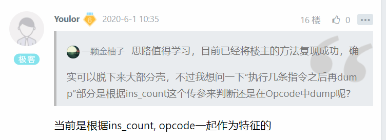

# Youpk: 又一款基于ART的主动调用的脱壳机

## 原理

Youpk是一款针对Dex整体加固+各式各样的Dex抽取的脱壳机

 

基本流程如下:

1. 从内存中dump DEX
2. 构造完整调用链, 主动调用所有方法并dump CodeItem
3. 合并 DEX, CodeItem

### 从内存中dump DEX

DEX文件在art虚拟机中使用DexFile对象表示, 而ClassLinker中引用了这些对象, 因此可以采用从ClassLinker中遍历DexFile对象并dump的方式来获取.

```
//unpacker.cc
std::list<const DexFile*> Unpacker::getDexFiles() {
  std::list<const DexFile*> dex_files;
  Thread* const self = Thread::Current();
  ClassLinker* class_linker = Runtime::Current()->GetClassLinker();
  ReaderMutexLock mu(self, *class_linker->DexLock());
  const std::list<ClassLinker::DexCacheData>& dex_caches = class_linker->GetDexCachesData();
  for (auto it = dex_caches.begin(); it != dex_caches.end(); ++it) {
    ClassLinker::DexCacheData data = *it;
    const DexFile* dex_file = data.dex_file;
    dex_files.push_back(dex_file);
  }
  return dex_files;
}
```

另外, 为了避免dex做任何形式的优化影响dump下来的dex文件, 在dex2oat中设置 CompilerFilter 为仅验证

```
//dex2oat.cc
compiler_options_->SetCompilerFilter(CompilerFilter::kVerifyAtRuntime);
```

### 构造完整调用链, 主动调用所有方法

1. 创建脱壳线程

```
//unpacker.java
public static void unpack() {
    if (Unpacker.unpackerThread != null) {
        return;
    }
 
    //开启线程调用
    Unpacker.unpackerThread = new Thread() {
        @Override public void run() {
            while (true) {
                try {
                    Thread.sleep(UNPACK_INTERVAL);
                }
                catch (InterruptedException e) {
                    e.printStackTrace();
                }
                if (shouldUnpack()) {
                    Unpacker.unpackNative();
                }  
            }
        }
    };
    Unpacker.unpackerThread.start();
}
```

2. 在脱壳线程中遍历DexFile的所有ClassDef

```
//unpacker.cc
for (; class_idx < dex_file->NumClassDefs(); class_idx++) {
```

3. 解析并初始化Class

```
//unpacker.cc
mirror::Class* klass = class_linker->ResolveType(*dex_file, dex_file->GetClassDef(class_idx).class_idx_, h_dex_cache, h_class_loader);
StackHandleScope<1> hs2(self);
Handle<mirror::Class> h_class(hs2.NewHandle(klass));
bool suc = class_linker->EnsureInitialized(self, h_class, true, true);
```

4. 主动调用Class的所有Method, 并修改ArtMethod::Invoke使其强制走switch型解释器

```
//unpacker.cc
uint32_t args_size = (uint32_t)ArtMethod::NumArgRegisters(method->GetShorty());
if (!method->IsStatic()) {
    args_size += 1;
}
 
JValue result;
std::vector<uint32_t> args(args_size, 0);
if (!method->IsStatic()) {
    mirror::Object* thiz = klass->AllocObject(self);
    args[0] = StackReference<mirror::Object>::FromMirrorPtr(thiz).AsVRegValue(); 
}
method->Invoke(self, args.data(), args_size, &result, method->GetShorty());
 
//art_method.cc
if (UNLIKELY(!runtime->IsStarted() || Dbg::IsForcedInterpreterNeededForCalling(self, this)
|| (Unpacker::isFakeInvoke(self, this) && !this->IsNative()))) {
if (IsStatic()) {
art::interpreter::EnterInterpreterFromInvoke(
self, this, nullptr, args, result, /*stay_in_interpreter*/ true);
} else {
mirror::Object* receiver =
reinterpret_cast<StackReference<mirror::Object>*>(&args[0])->AsMirrorPtr();
art::interpreter::EnterInterpreterFromInvoke(
self, this, receiver, args + 1, result, /*stay_in_interpreter*/ true);
}
}
 
//interpreter.cc
static constexpr InterpreterImplKind kInterpreterImplKind = kSwitchImplKind;
```


5. 在解释器中插桩, 在每条指令执行前设置回调

```
   //interpreter_switch_impl.cc
   // Code to run before each dex instruction.
     #define PREAMBLE()                                                                 \
     do {                                                                               \
       inst_count++;                                                                    \
       bool dumped = Unpacker::beforeInstructionExecute(self, shadow_frame.GetMethod(), \
                                                        dex_pc, inst_count);            \
       if (dumped) {                                                                    \
         return JValue();                                                               \
       }                                                                                \
       if (UNLIKELY(instrumentation->HasDexPcListeners())) {                            \
         instrumentation->DexPcMovedEvent(self, shadow_frame.GetThisObject(code_item->ins_size_),  shadow_frame.GetMethod(), dex_pc);                                                                                  \
       }                                                                                \
     } while (false)
```

6. 在回调中做针对性的CodeItem的dump, 这里仅仅是简单的示例了直接dump, 实际上, 针对某些厂商的抽取, 可以真正的执行几条指令等待CodeItem解密后再dump

```
//unpacker.cc
bool Unpacker::beforeInstructionExecute(Thread *self, ArtMethod *method, uint32_t dex_pc, int inst_count) {
  if (Unpacker::isFakeInvoke(self, method)) {
      Unpacker::dumpMethod(method);
    return true;
  }
  return false;
}
```


### 合并 DEX, CodeItem

将dump下来的CodeItem填充到DEX的相应位置中即可. 主要是基于google dx工具修改.

### 参考链接

FUPK3: https://bbs.pediy.com/thread-246117.htm

 

FART: https://bbs.pediy.com/thread-252630.htm

## 刷机

1. 仅支持pixel 1代
2. 重启至bootloader: `adb reboot bootloader`
3. 解压 Youpk_sailfish.zip 并双击 `flash-all.bat`
   百度云：https://pan.baidu.com/s/1ySSy2vNW5TyFjH1LNAcd5w
   提取码：vseh

## 使用方法

1. **该工具仅仅用来学习交流, 请勿用于非法用途, 否则后果自付！**
2. 配置待脱壳的app包名, 准确来讲是进程名称

```
adb shell "echo cn.youlor.mydemo >> /data/local/tmp/unpacker.config"
```

3. 启动apk等待脱壳
   每隔10秒将自动重新脱壳(已完全dump的dex将被忽略), 当日志打印unpack end时脱壳完成

4. pull出dump文件, dump文件路径为 `/data/data/包名/unpacker`

```
adb pull /data/data/cn.youlor.mydemo/unpacker
```

5. 调用修复工具 dexfixer.jar, 两个参数, 第一个为dump文件目录(必须为有效路径), 第二个为重组后的DEX目录(不存在将会创建)

```
java -jar dexfixer.jar /path/to/unpacker /path/to/output
```

   适用场景

1. 整体加固
2. 抽取:
   - nop占坑型(类似某加密)
   - naitve化, 在<clinit>中解密(类似早期阿里)
   - goto解密型(类似新版某加密?najia): https://bbs.pediy.com/thread-259448.htm

## 常见问题

1. dump中途退出或卡死，重新启动进程，再次等待脱壳即可
2. 当前仅支持被壳保护的dex, 不支持App动态加载的dex/jar


# 评论


