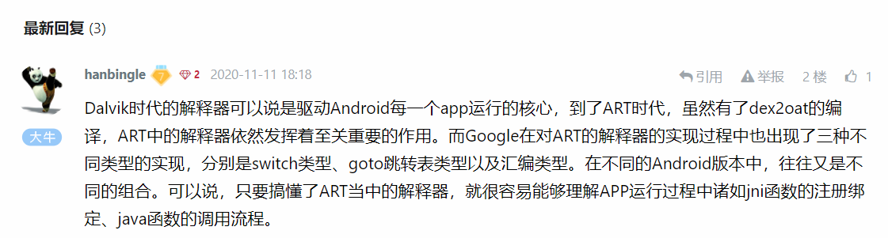

# frida跟踪应用中所有运行在解释模式的java函数 

url：https://bbs.pediy.com/thread-263210.htm


看雪3w班7月第二题，主要考察对ART解释器源码熟悉程度。


### 解释器概览

[interpreter.cc](http://androidxref.com/8.0.0_r4/xref/art/runtime/interpreter/interpreter.cc)

```
231 enum InterpreterImplKind {
232   kSwitchImplKind,        // Switch-based interpreter implementation.
233   kMterpImplKind          // Assembly interpreter
234 };
235
236 static constexpr InterpreterImplKind kInterpreterImplKind = kMterpImplKind;   //解释器的实现模式由该全局变量控制，默认汇编实现
237
```

ps：Android7.0有三种解释模式

```
229  enum InterpreterImplKind {
230    kSwitchImplKind,        // Switch-based interpreter implementation.
231    kComputedGotoImplKind,  //Computed-goto-based interpreter implementation. goto跳转表模式
232    kMterpImplKind          // Assembly interpreter
233  };
234  static std::ostream& operator<<(std::ostream& os, const InterpreterImplKind& rhs) {
235    os << ((rhs == kSwitchImplKind)
236                ? "Switch-based interpreter"
237                : (rhs == kComputedGotoImplKind)
238                    ? "Computed-goto-based interpreter"
239                    : "Asm interpreter");
240    return os;
241  }
```

如果想查看函数的调用，可以通过hook如下函数，并通过ShadowFrame参数使用`shadow_frame.GetMethod()->PrettyMethod()`获取函数信息

```
template<bool do_access_check, bool transaction_active>
extern JValue ExecuteSwitchImpl(Thread* self, const DexFile::CodeItem* code_item,
                                ShadowFrame& shadow_frame, JValue result_register,
                                bool interpret_one_instruction);
 
template<bool do_access_check, bool transaction_active>
extern JValue ExecuteGotoImpl(Thread* self, const DexFile::CodeItem* code_item,
                              ShadowFrame& shadow_frame, JValue result_register);
 
// Mterp does not support transactions or access check, thus no templated versions.
extern "C" bool ExecuteMterpImpl(Thread* self, const DexFile::CodeItem* code_item,
                                 ShadowFrame* shadow_frame, JValue* result_register);
```

**frida hook追踪函数调用**

```
function hook_Impl() {
    var module_libart = Process.findModuleByName("libart.so");
    var symbols = module_libart.enumerateSymbols();
    var ArtMethod_ExecuteSwitchImpltt = null;
    var ArtMethod_ExecuteSwitchImpltf = null;
    var ArtMethod_ExecuteSwitchImplff = null;
    var ArtMethod_ExecuteMterpImpl = null;
 
    //_ZN3art11interpreter17ExecuteSwitchImplILb1ELb1EEENS_6JValueEPNS_6ThreadEPKNS_7DexFile8CodeItemERNS_11ShadowFrameES2_b ; art::interpreter::ExecuteSwitchImpl<true,true>(art::Thread *,art::DexFile::CodeItem const*,art::ShadowFrame &,art::JValue,bool)
    //_ZN3art11interpreter17ExecuteSwitchImplILb1ELb0EEENS_6JValueEPNS_6ThreadEPKNS_7DexFile8CodeItemERNS_11ShadowFrameES2_b ; art::interpreter::ExecuteSwitchImpl<true,false>(art::Thread *,art::DexFile::CodeItem const*,art::ShadowFrame &,art::JValue,bool)
    //_ZN3art11interpreter17ExecuteSwitchImplILb0ELb0EEENS_6JValueEPNS_6ThreadEPKNS_7DexFile8CodeItemERNS_11ShadowFrameES2_b ; art::interpreter::ExecuteSwitchImpl<false,false>(art::Thread *,art::DexFile::CodeItem const*,art::ShadowFrame &,art::JValue,bool)
 
    for (var i = 0; i < symbols.length; i++) {
        var symbol = symbols[i];
        var address = symbol.address;
        var name = symbol.name;
        var indexinterpreter = name.indexOf("interpreter");
        var indexExecuteSwitchImpl = name.indexOf("ExecuteSwitchImpl");
        var indexExecuteMterpImpl = name.indexOf("ExecuteMterpImpl");
        var indexShadowFrame = name.indexOf("ShadowFrame");
        var indextt = name.indexOf("b1ELb1");
        var indextf = name.indexOf("b1ELb0");
        var indexff = name.indexOf("b0ELb0");
        var ArtMethod_PrettyMethod = null;
        if (name.indexOf("ArtMethod") >= 0 && name.indexOf("PrettyMethod") >= 0 && name.indexOf("Eb") >= 0 ) {
            console.log(name);
            ArtMethod_PrettyMethod = address;
        }
        if (indexinterpreter >= 0
            && indexExecuteSwitchImpl >= 0
            && indexShadowFrame >= 0
            && indextt >= 0) {
            console.log(name);
            ArtMethod_ExecuteSwitchImpltt = address;
        }
        if (indexinterpreter >= 0
            && indexExecuteSwitchImpl >= 0
            && indexShadowFrame >= 0
            && indextf >= 0) {
            console.log(name);
            ArtMethod_ExecuteSwitchImpltf = address;
        }
        if (indexinterpreter >= 0
            && indexExecuteSwitchImpl >= 0
            && indexShadowFrame >= 0
            && indexff >= 0) {
            console.log(name);
            ArtMethod_ExecuteSwitchImplff = address;
        } 
        if(indexExecuteMterpImpl >= 0) {
            console.log(name);
            ArtMethod_ExecuteMterpImpl = address;
        }
    }
 
    var module_libext = null;
    if (Process.arch === "arm64") {
        module_libext = Module.load("/data/app/libext64.so");
    } else if (Process.arch === "arm") {
        module_libext = Module.load("/data/app/libext.so");
    }
 
    if (ArtMethod_ExecuteSwitchImpltt != null) {
        Interceptor.attach(ArtMethod_ExecuteSwitchImpltt, {
            onEnter: function (args) {
            }, onLeave: function (retval) {
            }
        });
    }
 
    if (ArtMethod_ExecuteSwitchImpltf != null) {
        Interceptor.attach(ArtMethod_ExecuteSwitchImpltf, {
            onEnter: function (args) {
            }, onLeave: function (retval) {
            }
        });
    }
 
    if (ArtMethod_ExecuteSwitchImplff != null) {
        Interceptor.attach(ArtMethod_ExecuteSwitchImplff, {
            onEnter: function (args) {
                var shadow_frame = args[2];
                var artMethodObj = ptr(shadow_frame).add(Process.pointerSize);
 
                if (module_libext != null) {
                    var addr_PrettyMethod = module_libext.findExportByName("PrettyMethod");
                    var PrettyMethod = new NativeFunction(addr_PrettyMethod, "void", ["pointer", "pointer", "pointer", "int"])
 
                    var result = Memory.alloc(0x100);
                    try {
                        PrettyMethod(ArtMethod_PrettyMethod, artMethodObj, result, 0x100);
                        //console.log(result.readCString());
 
                        console.log("ArtMethod_ExecuteSwitchImplff java_class:", result.readCString());
 
                    } catch (error) {
                        console.log("ArtMethod_ExecuteSwitchImplff" + error);
                    }
                }
            }, onLeave: function (retval) {
            }
        });
    }
 
    if (ArtMethod_ExecuteMterpImpl != null) {
        Interceptor.attach(ArtMethod_ExecuteMterpImpl, {
            onEnter: function (args) {
            }, onLeave: function (retval) {
            }
        });
    }
}
```

### ART下函数执行模式

`interpreter模式`：由ART下的`解释器解释执行`。对于任何一个运行在`Interpreter模式`下的`java函数`，最终都会走到`ART下的解释器`中运行。
流程：
从`ArtMethod`类中的`EnterInterpreterFromInvoke`开始分析`Execute->ExecuteMterImpl`或者`ExecuteSwitchImpl`。
[interpreter.cc#Execute](http://androidxref.com/8.0.0_r4/xref/art/runtime/interpreter/interpreter.cc#Execute)

```
238 static inline JValue Execute(
239    Thread* self,
240    const DexFile::CodeItem* code_item,
241    ShadowFrame& shadow_frame,
242    JValue result_register,
243    bool stay_in_interpreter = false) REQUIRES_SHARED(Locks::mutator_lock_) {
244  DCHECK(!shadow_frame.GetMethod()->IsAbstract());
245  DCHECK(!shadow_frame.GetMethod()->IsNative());
246  if (LIKELY(shadow_frame.GetDexPC() == 0)) {  // Entering the method, but not via deoptimization.
247    if (kIsDebugBuild) {
248      self->AssertNoPendingException();
249    }
250    instrumentation::Instrumentation* instrumentation = Runtime::Current()->GetInstrumentation();
251    ArtMethod *method = shadow_frame.GetMethod();
252
253    if (UNLIKELY(instrumentation->HasMethodEntryListeners())) {
254      instrumentation->MethodEnterEvent(self, shadow_frame.GetThisObject(code_item->ins_size_),
255                                        method, 0);
256    }
257
258    if (!stay_in_interpreter) {
259      jit::Jit* jit = Runtime::Current()->GetJit();
260      if (jit != nullptr) {
261        jit->MethodEntered(self, shadow_frame.GetMethod());
262        if (jit->CanInvokeCompiledCode(method)) {
263          JValue result;
264
265          // Pop the shadow frame before calling into compiled code.
266          self->PopShadowFrame();
267          ArtInterpreterToCompiledCodeBridge(self, nullptr, code_item, &shadow_frame, &result);
268          // Push the shadow frame back as the caller will expect it.
269          self->PushShadowFrame(&shadow_frame);
270
271          return result;
272        }
273      }
274    }
275  }
276
277  shadow_frame.GetMethod()->GetDeclaringClass()->AssertInitializedOrInitializingInThread(self);
278
279  // Lock counting is a special version of accessibility checks, and for simplicity and
280  // reduction of template parameters, we gate it behind access-checks mode.
281  ArtMethod* method = shadow_frame.GetMethod();
282  DCHECK(!method->SkipAccessChecks() || !method->MustCountLocks());
283
284  bool transaction_active = Runtime::Current()->IsActiveTransaction();
285  if (LIKELY(method->SkipAccessChecks())) {
286    // Enter the "without access check" interpreter.
287    if (kInterpreterImplKind == kMterpImplKind) {
288      if (transaction_active) {
289        // No Mterp variant - just use the switch interpreter.
290        return ExecuteSwitchImpl<false, true>(self, code_item, shadow_frame, result_register,
291                                              false);
292      } else if (UNLIKELY(!Runtime::Current()->IsStarted())) {
293        return ExecuteSwitchImpl<false, false>(self, code_item, shadow_frame, result_register,
294                                               false);
295      } else {
296        while (true) {
297          // Mterp does not support all instrumentation/debugging.
298          if (MterpShouldSwitchInterpreters() != 0) {
299            return ExecuteSwitchImpl<false, false>(self, code_item, shadow_frame, result_register,
300                                                   false);
301          }
302          bool returned = ExecuteMterpImpl(self, code_item, &shadow_frame, &result_register);
303          if (returned) {
304            return result_register;
305          } else {
306            // Mterp didn't like that instruction.  Single-step it with the reference interpreter.
307            result_register = ExecuteSwitchImpl<false, false>(self, code_item, shadow_frame,
308                                                              result_register, true);
309            if (shadow_frame.GetDexPC() == DexFile::kDexNoIndex) {
310              // Single-stepped a return or an exception not handled locally.  Return to caller.
311              return result_register;
312            }
313          }
314        }
315      }
316    } else {
317      DCHECK_EQ(kInterpreterImplKind, kSwitchImplKind);
318      if (transaction_active) {
319        return ExecuteSwitchImpl<false, true>(self, code_item, shadow_frame, result_register,
320                                              false);
321      } else {
322        return ExecuteSwitchImpl<false, false>(self, code_item, shadow_frame, result_register,
323                                               false);
324      }
325    }
326  } else {
327    // Enter the "with access check" interpreter.
328    if (kInterpreterImplKind == kMterpImplKind) {
329      // No access check variants for Mterp.  Just use the switch version.
330      if (transaction_active) {
331        return ExecuteSwitchImpl<true, true>(self, code_item, shadow_frame, result_register,
332                                             false);
333      } else {
334        return ExecuteSwitchImpl<true, false>(self, code_item, shadow_frame, result_register,
335                                              false);
336      }
337    } else {
338      DCHECK_EQ(kInterpreterImplKind, kSwitchImplKind);
339      if (transaction_active) {
340        return ExecuteSwitchImpl<true, true>(self, code_item, shadow_frame, result_register,
341                                             false);
342      } else {
343        return ExecuteSwitchImpl<true, false>(self, code_item, shadow_frame, result_register,
344                                              false);
345      }
346    }
347  }
348}
```

### Switch型解释器的实现

[interpreter_switch_impl.cc](http://androidxref.com/8.0.0_r4/xref/art/runtime/interpreter/interpreter_switch_impl.cc)

```
//可以修改这个宏，在指令执行前记录信息
65 #define PREAMBLE()                                                                              \
66   do {                                                                                          \
67     if (UNLIKELY(instrumentation->HasDexPcListeners())) {                                       \
68       instrumentation->DexPcMovedEvent(self, shadow_frame.GetThisObject(code_item->ins_size_),  \
69                                        shadow_frame.GetMethod(), dex_pc);                       \
70     }                                                                                           \
71  } while (false)
72
 
106 JValue ExecuteSwitchImpl(Thread* self, const DexFile::CodeItem* code_item,
107                          ShadowFrame& shadow_frame, JValue result_register,
108                          bool interpret_one_instruction) {
    ...
124  do {
125    dex_pc = inst->GetDexPc(insns);   //pc取址
126    shadow_frame.SetDexPC(dex_pc);
127    TraceExecution(shadow_frame, inst, dex_pc);  //代码自带的trace smali的功能
128    inst_data = inst->Fetch16(0);
       //解析opcode
129    switch (inst->Opcode(inst_data)) { 
130      case Instruction::NOP:
131        PREAMBLE();   
132        inst = inst->Next_1xx();
133        break;
134      case Instruction::MOVE:
135        PREAMBLE();
136        shadow_frame.SetVReg(inst->VRegA_12x(inst_data),
137                             shadow_frame.GetVReg(inst->VRegB_12x(inst_data)));
138        inst = inst->Next_1xx();
139        break;   
}
```

### TraceExecution函数的实现

[interpreter_common.h](http://androidxref.com/8.0.0_r4/xref/art/runtime/interpreter/#481)

```
478 // Set true if you want TraceExecution invocation before each bytecode execution.
//如果需要打开trace将该值置为true，但是开启后所有app的smali指令执行都会trace，会导致系统卡顿，可以考虑做筛选trace
479 constexpr bool kTraceExecutionEnabled = false;
480
 
/*
参数含义
ShadowFrame: 当前执行的java函数的栈针，pc之类的信息都可以从这里获取
Instruction: 可以输出指令的反汇编详细信息
*/
481 static inline void TraceExecution(const ShadowFrame& shadow_frame, const Instruction* inst,
482                                  const uint32_t dex_pc)
483    REQUIRES_SHARED(Locks::mutator_lock_) {
484  if (kTraceExecutionEnabled) {
485 #define TRACE_LOG std::cerr
486    std::ostringstream oss;
487    oss << shadow_frame.GetMethod()->PrettyMethod() //当前的函数名
488        << android::base::StringPrintf("\n0x%x: ", dex_pc) //当前执行位置pc
489        << inst->DumpString(shadow_frame.GetMethod()->GetDexFile()) << "\n";  //当前执行指令的反汇编信息
490    for (uint32_t i = 0; i < shadow_frame.NumberOfVRegs(); ++i) { //遍历寄存器的值信息
491      uint32_t raw_value = shadow_frame.GetVReg(i);
492      ObjPtr<mirror::Object> ref_value = shadow_frame.GetVRegReference(i);
493      oss << android::base::StringPrintf(" vreg%u=0x%08X", i, raw_value);
494      if (ref_value != nullptr) {
495        if (ref_value->GetClass()->IsStringClass() &&
496            !ref_value->AsString()->IsValueNull()) {
497          oss << "/java.lang.String \"" << ref_value->AsString()->ToModifiedUtf8() << "\"";
498        } else {
499          oss << "/" << ref_value->PrettyTypeOf();
500        }
501      }
502    }
503    TRACE_LOG << oss.str() << "\n";
504 #undef TRACE_LOG
505  }
506 }
```

`Instruction`类有一个`DumpString`函数，可以输出当前指令的解析信息
[dex_instruction.h](http://androidxref.com/8.0.0_r4/xref/art/runtime/dex_instruction.h)

```
604  // Dump decoded version of instruction
605  std::string DumpString(const DexFile*) const;
```

[dex_instruction.cc](http://androidxref.com/8.0.0_r4/xref/art/runtime/dex_instruction.cc)

```
166 std::string Instruction::DumpString(const DexFile* file) const {
167  std::ostringstream os;
168  const char* opcode = kInstructionNames[Opcode()];
169  switch (FormatOf(Opcode())) {
170    case k10x:  os << opcode; break;
171    case k12x:  os << StringPrintf("%s v%d, v%d", opcode, VRegA_12x(), VRegB_12x()); break;
172    case k11n:  os << StringPrintf("%s v%d, #%+d", opcode, VRegA_11n(), VRegB_11n()); break;
173    case k11x:  os << StringPrintf("%s v%d", opcode, VRegA_11x()); break;
174    case k10t:  os << StringPrintf("%s %+d", opcode, VRegA_10t()); break;
175    case k20t:  os << StringPrintf("%s %+d", opcode, VRegA_20t()); break;
176    case k22x:  os << StringPrintf("%s v%d, v%d", opcode, VRegA_22x(), VRegB_22x()); break;
177    case k21t:  os << StringPrintf("%s v%d, %+d", opcode, VRegA_21t(), VRegB_21t()); break;
178    case k21s:  os << StringPrintf("%s v%d, #%+d", opcode, VRegA_21s(), VRegB_21s()); break;
179    case k21h: {
180        // op vAA, #+BBBB0000[00000000]
181        if (Opcode() == CONST_HIGH16) {
182          uint32_t value = VRegB_21h() << 16;
183          os << StringPrintf("%s v%d, #int %+d // 0x%x", opcode, VRegA_21h(), value, value);
184        } else {
185          uint64_t value = static_cast<uint64_t>(VRegB_21h()) << 48;
186          os << StringPrintf("%s v%d, #long %+" PRId64 " // 0x%" PRIx64, opcode, VRegA_21h(),
187                             value, value);
188        }
189      }
        ...
```

### trace smali修改点

1、解释器改为switch模式
[interpreter.cc](http://androidxref.com/8.0.0_r4/xref/art/runtime/interpreter/interpreter.cc)

```
236 static constexpr InterpreterImplKind kInterpreterImplKind = kSwitchImplKind;
```

2、修改TraceExecution函数，针对感兴趣的函数筛选trace
[interpreter_common.h](http://androidxref.com/8.0.0_r4/xref/art/runtime/interpreter/#481)

```
static inline void TraceExecution(const ShadowFrame& shadow_frame, const Instruction* inst, const uint32_t dex_pc)
    REQUIRES_SHARED(Locks::mutator_lock_) {
    //拿到当前函数名
    const char* methodName = shadow_frame.GetMethod()->PrettyMethod().c_str();
    //比较函数名和感兴趣函数
    if(strstr(methodName, "MainActivity") != nullptr) {
        std::ostringstream oss;
    oss << shadow_frame.GetMethod()->PrettyMethod() //当前的函数名
        << android::base::StringPrintf("\n0x%x: ", dex_pc) //当前执行位置pc
        << inst->DumpString(shadow_frame.GetMethod()->GetDexFile()) << "\n";  //当前执行指令的反汇编信息
        LOG(ERROR) << oss.str() << "\n";  //以ERROR级别输出trace日志
    }
}
```

### frida trace smali

1、使用解释模式
runtime.cc里面有个Runtime::Init函数, 搜GetInstrumentation()->ForceInterpretOnly();, 在Runtime初始化的时候,调用一下ForceInterpretOnly就走解释模式了
[runtime.cc](http://androidxref.com/8.0.0_r4/xref/art/runtime/runtime.cc)

```
1074  if (runtime_options.GetOrDefault(Opt::Interpret)) {
1075    GetInstrumentation()->ForceInterpretOnly();
1076  }
```

2、hook TraceExecution函数
[interpreter_common.h](http://androidxref.com/8.0.0_r4/xref/art/runtime/interpreter/#481)


