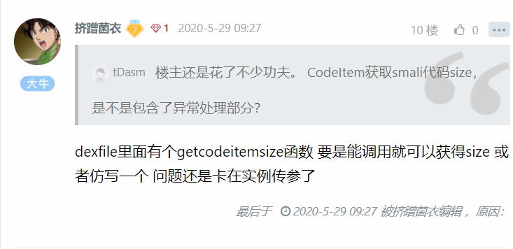
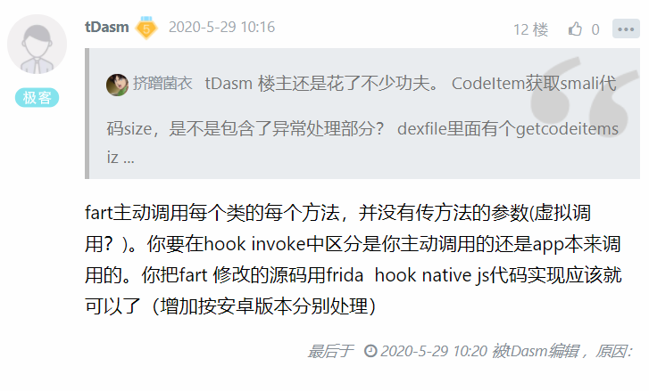
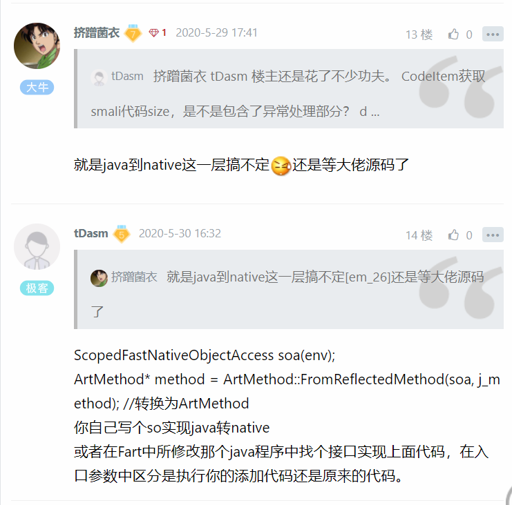
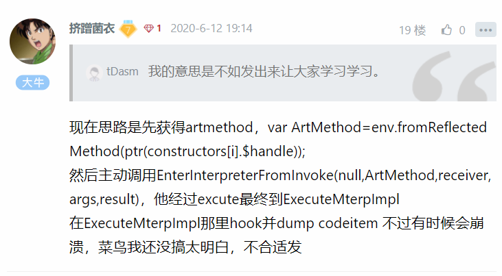

# 对类抽取加固的一点尝试与遇到的问题

url：https://bbs.pediy.com/thread-259796.htm


菜鸟最近认真学习了寒冰大佬的fart，因为没钱买手机，想尝试通过hook的方法达到类似的效果，遇到了不少问题，这里希望大佬来指点一下

这里先总结下各位大佬的文章资料

\- ThomasKing：https://bbs.pediy.com/user-627520.htm

\- 《来自高纬的对抗 - 逆向TinyTool自制》：https://bbs.pediy.com/thread-215953.htm)

-https://github.com/hanbinglengyue/FART：https://github.com/hanbinglengyue/FART

\- 三篇文章：https://bbs.pediy.com/user-632473.htm)。

\- `Github`：https://github.com/r0ysue/AndroidSecurityStudy：https://github.com/r0ysue/AndroidSecurityStudy

\- 这篇文章：https://blog.csdn.net/click_idc/article/details/80591686

\- `FART`的`github`发布页：https://github.com/hanbinglengyue/FART.git

\- 这篇51-android：https://github.com/snowdream/51-android

\- 《FART源码解析及编译镜像支持到Pixel2(xl)》：https://www.anquanke.com/post/id/201896

\- 《拨云见日：安卓APP脱壳的本质以及如何快速发现ART下的脱壳点》：https://bbs.pediy.com/thread-254555.htm

\- 《FART正餐前甜点：ART下几个通用简单高效的dump内存中dex方法》：https://bbs.pediy.com/thread-254028.htm

\- 来自高纬的对抗：定制ART解释器脱所有一二代壳：https://mp.weixin.qq.com/s/3tjY_03aLeluwXZGgl3ftw


1.对于类抽取加固，个人理解就是通过各种方式把CodeItem清空,修改偏移等，等到执行方法的时候在解密还原，这样可以防止内存dump

还原的思路就是主动触发时把CodeItem dump出来，这里大佬提到了可以在ArtMethod::Invoke里面dump，源码里用到这2个函数

\+ const DexFile* dex_file = GetDexFile();

\+ const DexFile::CodeItem* code_item= GetCodeItem();

这2个函数好像都是inline的函数，这里遇到第一、二个问题，frida中，inline函数怎么hook，ArtMethod是一个实例，实例方法怎么调用，

解决不了就解决一个简单一点的，如何通过ArtMethod::Invoke的参数找到CodeItem，没办法只能去翻源码，在art_method.cc源码里，找到这样一个函数

```
uint32_t ArtMethod::FindCatchBlock(Handle<mirror::Class> exception_type,
                                   uint32_t dex_pc, bool* has_no_move_exception) {
  const DexFile::CodeItem* code_item = GetCodeItem();
...}


inline const DexFile::CodeItem* ArtMethod::GetCodeItem() {//调用在FindCatchBlock
  return GetDexFile()->GetCodeItem(GetCodeItemOffset());
}
```

于是ida打开libart.so看函数汇编，r0是artmethod实例，dexfile地址=[[[artmethod]+16]+16],begin

地址[[[[artmethod]+16]+16]+4]，CodeItemOffset偏移[artmethod+8],最终偏移begin+Offset

```
000AFAFE                 MOV             R5, R0 ；把r0给r5
000AFB1A                 LDR             R0, [R5] ; r0是class
000AFB1C                 LDR             R0, [R0,#0x10] ; r0+16是 dex_cache
000AFB1E                 LDR             R0, [R0,#0x10] ; r0+16是dexfile
000AFB20                 LDR             R1, [R5,#8] ; r1=*artmethod+8=offset
000AFB24                 LDR             R0, [R0,#4] ; r0=begin
000AFB20                 LDR             R1, [R5,#8] ; r1=*artmethod+8=offset
000AFB26                 ADD             R1, R0  ; 这里r1就是最后的偏移了
```

原汇编

```
.text:000AFAF8                 PUSH.W          {R4-R11,LR} ; Push registers
.text:000AFAFC                 SUB             SP, SP, #0x54 ; Rd = Op1 - Op2
.text:000AFAFE                 MOV             R5, R0  ; Rd = Op2
.text:000AFB00                 LDR             R0, =(off_467098 - 0xAFB0A) ; Load from Memory
.text:000AFB02                 STR             R3, [SP,#0x78+var_6C] ; Store to Memory
.text:000AFB04                 MOV             R4, R2  ; Rd = Op2
.text:000AFB06                 ADD             R0, PC  ; off_467098
.text:000AFB08                 STR             R1, [SP,#0x78+var_68] ; Store to Memory
.text:000AFB0A                 LDR             R0, [R0] ; Load from Memory
.text:000AFB0C                 LDR             R0, [R0] ; Load from Memory
.text:000AFB0E                 STR             R0, [SP,#0x78+var_28] ; Store to Memory
.text:000AFB10                 LDR             R0, [R5,#4] ; r5+4=access_flag
.text:000AFB12                 TST.W           R0, #0x40000 ; Set cond. codes on Op1 & Op2
.text:000AFB16                 BNE.W           loc_AFE68 ; Branch
.text:000AFB1A                 LDR             R0, [R5] ; r0是class
.text:000AFB1C                 LDR             R0, [R0,#0x10] ; r0+16是 dex_cache
.text:000AFB1E
.text:000AFB1E loc_AFB1E                               ; CODE XREF: art::ArtMethod::FindCatchBlock(art::Handle<art::mirror::Class>,uint,bool *)+376↓j
.text:000AFB1E                 LDR             R0, [R0,#0x10] ; r0+16是dexfile
.text:000AFB20                 LDR             R1, [R5,#8] ; r1=*artmethod+8=offset
.text:000AFB22                 CBZ             R1, loc_AFB2A ; Compare and Branch on Zero
.text:000AFB24                 LDR             R0, [R0,#4] ; r0=dex_file
.text:000AFB26                 ADD             R1, R0  ; 这里r1就是最后的偏移了
```

这里贴一下结构

通过ArtMethod找到declaring_class_找到dex_cache_找到dex_file_找到begin，然后相加得到offset

```
class ArtMethod{
 protected:

  GcRoot<mirror::Class> declaring_class_;

  std::atomic<std::uint32_t> access_flags_;

  uint32_t dex_code_item_offset_;

  uint32_t dex_method_index_;//12

  uint16_t method_index_;

  uint16_t hotness_count_;

  struct PtrSizedFields {

    mirror::MethodDexCacheType* dex_cache_resolved_methods_;

    void* data_;
    
    void* entry_point_from_quick_compiled_code_;
  } ptr_sized_fields_;
}
class MANAGED Class {
  HeapReference<ClassLoader> class_loader_;

  HeapReference<Class> component_type_;
  
  HeapReference<DexCache> dex_cache_;
  ...
}
class MANAGED DexCache {
  HeapReference<String> location_;
  // Number of elements in the call_sites_ array. Note that this appears here
  // because of our packing logic for 32 bit fields.
  uint32_t num_resolved_call_sites_;

  uint64_t dex_file_;               // const DexFile*
  uint64_t resolved_call_sites_;    // GcRoot<CallSite>* array with num_resolved_call_sites_
                                    // elements.
  uint64_t resolved_fields_;        // std::atomic<FieldDexCachePair>*, array with
  ...
  }
```

于是我们可以通过hook ArtMethod::Invoke，手动触发method调用获得codeitem

```
var minvoke = Module.findExportByName("libart.so", "_ZN3art9ArtMethod6InvokeEPNS_6ThreadEPjjPNS_6JValueEPKc");
Interceptor.attach(invoke, {
    onEnter: function (args) {
            {
            // console.log("get artmtd "+args[0]);
            var classs=ptr(args[0]).readU32()
            // console.log("get classs "+classs);
            var dex_cache=(ptr(classs).add(16)).readU32()
            var dexfile=(ptr(dex_cache).add(16)).readU32()
            var begin=ptr(dexfile).add(4).readU32()
            var offset=(ptr(args[0]).add(8)).readU32()
            // console.log("get begin "+begin);
            // console.log("get offset"+offset);
            // var index=ptr(args[0]).add(16).readU32()
            // console.log("get index "+index);
            var codeitem=ptr(begin).add(offset)
            console.log("get codeitem "+codeitem);
            // Memory.protect(ptr(codeitem), 64, 'rw-');
            var codesize=(ptr(codeitem).add(12).readU32())*2
            // var codesize=GetCodeItemSize(codeitem)
            console.log("get size "+codesize)

            var code=ptr(codeitem).add(16).readByteArray(codesize)
            console.log(code)
            }
        
         },
            onLeave: function (retval) {

        }
    });
```

codeitem结构

```
struct CodeItem {
    uint16_t registers_size_;            // the number of registers used by this code
                                         //   (locals + parameters)
    uint16_t ins_size_;                  // the number of words of incoming arguments to the method
                                         //   that this code is for
    uint16_t outs_size_;                 // the number of words of outgoing argument space required
                                         //   by this code for method invocation
    uint16_t tries_size_;                // the number of try_items for this instance. If non-zero,
                                         //   then these appear as the tries array just after the
                                         //   insns in this instance.
    uint32_t debug_info_off_;            // file offset to debug info stream
    uint32_t insns_size_in_code_units_;  // size of the insns array, in 2 byte code units
    uint16_t insns_[1];                  // actual array of bytecode.

   private:
    DISALLOW_COPY_AND_ASSIGN(CodeItem);
  };
```

这里还可以更深一层通过hook art::interpreter::EnterInterpreterFromInvoke通过artmethod获得codeitem，不过要先强制解释执行，hook IsForcedInterpreterNeededForCallingImpl，返回结果永远为true


2.上面已经可以通过主动触发函数获得相应的codeitem了，比如点击一些vip按钮什么的看看其中的逻辑，但是无法达到主动调用，认真学习寒冰大佬的代码，模仿大佬的思路尝试获得所有类的所有方法,这一步很顺利

```
function frida_Java() {
    Java.perform(function () {
        if(Java.available)
        {
            var ActivityThread=Java.use("android.app.ActivityThread");
            var AppBindData=Java.use("android.app.ActivityThread$AppBindData")
            var LoadedApk=Java.use("android.app.LoadedApk")
            var Application=Java.use("android.app.Application")
            var ClassLoader=Java.use("dalvik.system.BaseDexClassLoader")
            var DexPathList=Java.use("dalvik.system.DexPathList")
            var Element=Java.use("dalvik.system.DexPathList$Element")
            var DexFile=Java.use("dalvik.system.DexFile")
            var System=Java.use("java.lang.System")

    ActivityThread.performLaunchActivity.implementation=function(){  
    console.log("Found performLaunchActivity" );
    var activityThread=ActivityThread.currentActivityThread()
    activityThread=Java.cast(activityThread,ActivityThread)

    var BoundApplication=activityThread.mBoundApplication.value
    BoundApplication=Java.cast(BoundApplication,AppBindData)

    var info=BoundApplication.info.value
    info=Java.cast(info,LoadedApk)

    var mApplication=info.mApplication.value
    mApplication=Java.cast(mApplication,Application)

    var classLoader=mApplication.getClassLoader()
    console.log("get ClassLoader"+classLoader);

    // Java.classFactory.loader = classloader

    classLoader=Java.cast(classLoader,ClassLoader)
    var pathList=classLoader.pathList.value
    // console.log("get pathList" );
    pathList=Java.cast(pathList,DexPathList)
    var dexElements=pathList.dexElements.value  
    for(var i=0;i<dexElements.length;i++)
    {   var env=Java.vm.getEnv()
        var dexElement=Java.cast(dexElements[i],Element)
        var dexFile=dexElement.dexFile.value
        dexFile=Java.cast(dexFile,DexFile)
        var mCookie=dexFile.mCookie.value//mCookie就是native层所加载dex文件结构的标识
        
        var classes=dexFile.getClassNameList(mCookie)
        console.log("get classes" );
        for(var i=0;i<classes.length;i++)
        {
            // console.log("Found class "+classes[i]);
            
            var classa=Java.classFactory.use(classes[i])
            var constructors=classa.class.getDeclaredConstructors()
            for(var i=0;i<constructors.length;i++)
            {
                console.log("Found constructors "+constructors[i]);
            }
            var funcs=classa.class.getDeclaredMethods()

            for(var i=0;i<funcs.length;i++)
            {
                console.log("Found funcs "+funcs[i]);

            }

        }

    }

    return this.performLaunchActivity(arguments[0],arguments[1]);
    }
    
            
        }else{
            console.log("error");
        }
    });
}       
setImmediate(frida_Java,0);
```

3.目前卡在主动调用这一步了，大佬是通过ArtMethod::Invoke主动调用，然而ArtMethod是一个实例，类方法可以通过new NativeFunction调用，实例方法的实例怎么调用呢，我翻了frida的官网api没搞明白，

我又想了个办法，再往下一层，通过art::interpreter::EnterInterpreterFromInvoke主动调用，这样ArtMethod就是一个指针可以传进去，问题还是没有解决，如何通过frida把java层jmethod作为参数传递到native层呢，如何获得java实例的指针，这里希望各位大佬带带菜鸟

梳理一下frida遇到的问题：

1. inline函数如何hook问题，目前没办法只能翻源码找调用，然后根据汇编自己实现一下
2. 实例方法调用问题，如何把实例通过new NativeFunction调用传进去，例如调用ArtMethod::Invoke的时候，必须用ArtMethod的实例作为调用者，菜鸟目前完全没法解决
3. 如何把java层的method转换成native层ArtMethod指针，我看网上有通过Unsafe的方法获得实例地址，但是还是没搞出来


再次向大佬献出自己的膝盖，希望大佬指点一条明路








