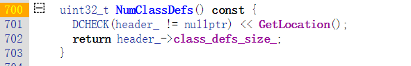
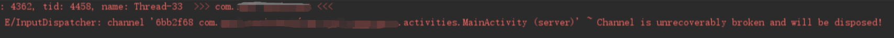
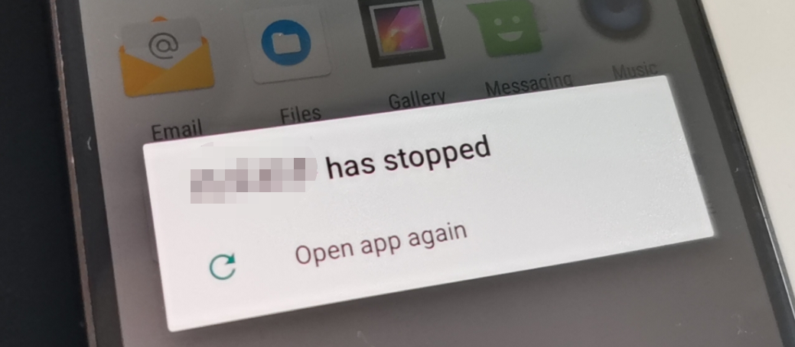
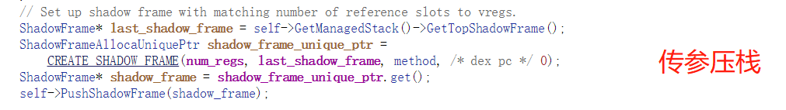
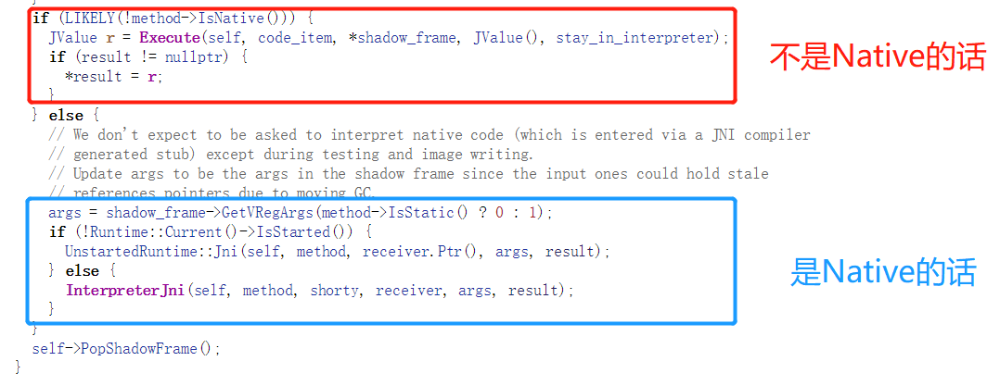
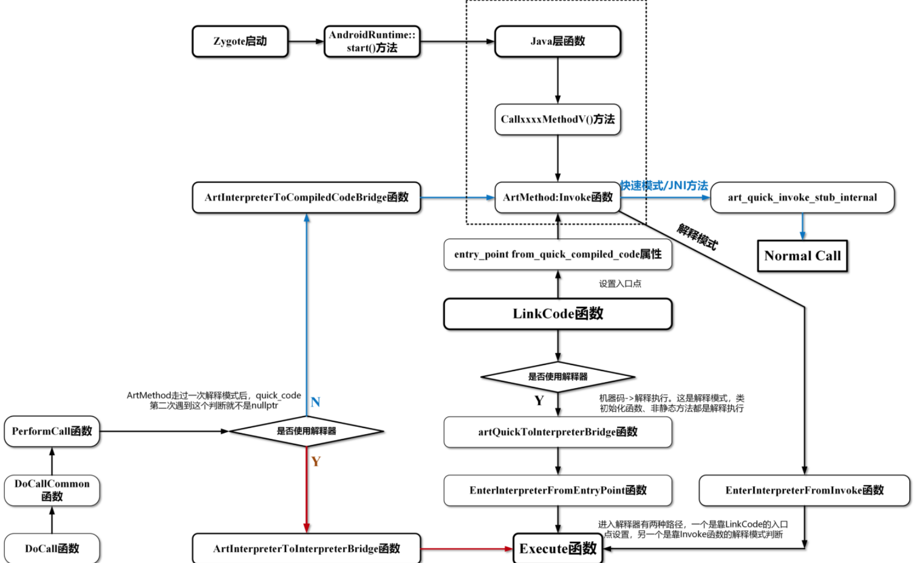
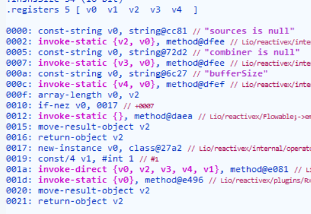
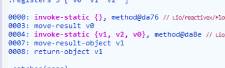
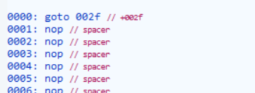
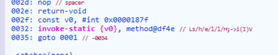

# 将FART和Youpk结合来做一次针对函数抽取壳的全面提升

## 0x00 声明

​    **相信授人以鱼不如授人以渔。**


## 0x01 前言

作为App安全逆向分析的第一步，针对加固手段衍生的脱壳技术正在蓬勃发展，由于本人所学知识还未能进入VMP阶段，因此本帖就基于目前常见的函数抽取壳而展开。

**学术界有了不少有意思的脱壳系统。**AppSpear搜集内存中的运行时Dalvik数据结构(Dalvik Data Structure，以下简称DDS)来重新组装一个正常的Dex文件。一般而言，一个应用程序只能通过某些固定的系统服务完成转换。因此，AppSpear就选择通过监控某些JNI接口并确定何时开始收集Dalvik数据结构。其次，无论加固厂商加密原始数据有多复杂，Dalvik都很少修改原始字节码的语义。Dex加载过程结束后，从DDS中就可观察到原App的字节码的准确内容。最后取出anti-analysis代码并进一步综合Dex文件、清单文件和其他资源文件然后重打包并进行解包分析。

有很多研究者开始对整个运行环境进行监控从而观察内存读写操作来抓住解包时机。Lei X等人提出了一种新的自适应方法，并开发了一个名为PackerGrind的新系统来脱壳应用程序。PackerGrind是取得了一定的效果，但是如果打包的应用程序将不同的代码加载到相同的内存中，并在不同的条件下执行它们，PackerGrind就因为缺乏语义信息从而无法判断哪些代码是真实的；DROIDUNPACK 是Duan Y 等人提出的一种脱壳工具，基于整个系统仿真监视程序执行和内存操作执行。由于DROIDUNPACK是建立在整个系统仿真之上，实施反仿真技术将不可避免地破坏后续的分析而且成本相对后面要讲到的脱壳工具来说较大。

**看雪论坛中出现了不少前辈们的作品。**DexHunter是在Android系统代码调用函数dvmDefineClass(Dalvik下的函数)进行类加载之前，主动地一次性加载并初始化Dex文件所有的类。DexHunter主要关注如何在内存中定位和转储Dex。DexHunter脱壳过程中所使用的location和fileName是其技术人员通过人工分析得到的，通过对每个加固服务的加固方式进行详细地分析和研究，选择固定的特征字符串作为脱壳开始的标志。采用这样的方法有一个明显的限制：如果加固厂商针对不同的App有不同特征的加固方法，那么DexHunter就不能再准确地定位出脱壳起点。

Fupk3是由美团大佬写的一个Android半自动脱壳机，首先遍历gDvm中的dvmUserDexFiles结构，获取所有cookie; 其次对内存中的Dex文件，遍历触发函数，并通过在解析器处插桩，截取解密后的code_item,获取code_item后直接返回不执行该函数。然后对内存中截取出来的数据进行重组，生成Dex文件。最后利用修改过的smali/baksmali对dump下来的dex文件进行修复。Fupk3基于Android 系统 KTU84P (4.4.4_r1)开发，可以对没被虚拟化的Java层函数进行转储。然而，Fupk3还是基于Dalvik环境的自动化脱壳方案，其中Fupk3首次将脱壳粒度细化到函数级别。DexHunter和Fupk3都可以应对函数抽取型加固壳。但很可惜的是，两个优秀方案以及前文提及的AppSpear由于环境的限制无法应对Android8.0以及更高版本ART的系统变化。

时间点来到2019年，FART横空出世，结合了DexHunter和Fupk3的优点(主动调用链不影响正常调用的构造和CodeItem结尾计算方法)，开始着力于ART高版本环境下函数粒度的主动调用。FART告诉我们的一个道理是：无论函数抽取壳做得有多么复杂，一定存在某一个时刻，Dex的部分数据肯定是还原的状态。通过三种组件的配合使用可以达到一种“输入->输出”自动化的流程，并且寒冰老师也在他的文章中提及三个组件可以分离使用，这种组件独立性为结合Frida提供了无限的可能性。稍微多嘴讲一下FART的一些优秀特征：

### 关于Fart的脱壳点：

有两点，一个点是Execute函数，另一个点就是送到主动调用链的时候。

>①初始化函数<clinit> - Execute => dumpDexFileByExecute
>
>②其他正常函数=> DexFile_dumpMethodCode => myfartInvoke => Invoke => dumpArtMethod

### 关于主动调用链：

```
 ①启动fart线程-(getClassloader来获取ClassLoader)>

  ②fartwithClassLoader-(反射获取mCookie)>

  ③loadClassAndInvoke-(dumpMethodCode将各种函数转化成ArtMethod类型并送入我们的fake_Invoke参数包装)>

  ④送入系统的Invoke-(调用dumpArtMethod实现第二个脱壳点)。
```


### Fart主动调用前提：

>①获取appClassLoader；
>
>②通过ClassLoader加载到所有类 ；
>
>③通过每个类获取到该类下的所有方法【包括构造函数和普通函数】。


### Youpk

**时间再次推移到2020年。**一款针对Dex整体加固和应对各式各样Dex抽取的脱壳机——Youpk于看雪论坛诞生。作者在参考链接中明确表示是结合了Fupk3和FART二者的优点，其特色是着重于加深主动调用流程至Switch解释器的每条汇编指令执行前回调。Youpk在回调中仅仅做了一项操作：对CodeItem的直接转储。当然，Youpk作者在文中提及，针对某些厂商的抽取, **可以等待几条指令真正被执行且CodeItem解密后再进行dump**。

```
//interpreter_switch_impl.cc
// Code to run before each dex instruction.
  #define PREAMBLE()                                                                 \
  do {                                                                               \
    inst_count++;                                                                    \
    bool dumped = Unpacker::beforeInstructionExecute(self, shadow_frame.GetMethod(), \
                                                     dex_pc, inst_count);            \
    if (dumped) {                                                                    \
      return JValue();                                                               \
    }                                                                                \
    if (UNLIKELY(instrumentation->HasDexPcListeners())) {                            \
      instrumentation->DexPcMovedEvent(self, shadow_frame.GetThisObject(code_item->ins_size_),  shadow_frame.GetMethod(), dex_pc);                                                                                                                                              \
    }                                                                                \
  } while (false)
```

 从Youpk最关键的回调过程来分析，beforeInstructionExecute这个方法的传参依靠ins_count即指令数就可以判断执行了多少条指令。比如ins_count等于5时代表已经执行了5条指令。不过，我们可以通过一些加固壳中的反编译内容发现有些指令是参差不齐的，有可能关键解密相关函数一次在3条以内，一次在5条以外，如果来来回回查看个数似乎略失自动化的意义。

  **因此我们通过接下来结合对Youpk的分析，强化FART。**


## 0x02 实验

 Youpk在文中写到构造主动调用链时，检索Dex文件中所有的类时类的数目大小通过NumClassDefs()来获得，坐标在/art/runtime/dex_file.h

  

  而FART中调用原生方法getClassNameList获取当前dexfile对象下的所有类名并存储为数组便于进行类的遍历，Youpk在遍历类的时候是在unpacker.cc中进行，说明它此时已经进入了Native层，FART的遍历还是在Java层，这一区别可能涉及到Java和C++中循环开销这里先暂且不涉及太多。Youpk选择类似forName的方式解析并初始化Class，因为初始化会帮我们链接并设置好非常多的信息。

  FART中我们的Java层传递过来的method是使用反射方法加载的，但我们并没有对它真正进行调用，而是通过dumpMethodCode函数把它转为ArtMethod函数并传递给了Invoke，这流程是一种模拟调用【FART中**dumpMethodCode这个函数就是模拟了CallxxxxxMethod的流程**】。

   因此根据Youpk的解析并初始化思路，我选择在jobject2ArtMethod中进行一些修改。因为这里是Method转ArtMethod的关键之处。我们可以用Java到Native的方式去类似地实现一个：观察GetMethodID函数源码实现，最终调用的FindMethodID是以“初始化—为ArtMethod赋值—加密ArtMethod使其成为jmethodID类型”为流程进行的。不过，现在我们需要的并不是让其加密，因为我们不是真正地去使用CallxxxxMethod，而是将其在构造后直接送入ArtMethod::Invoke。现在目的明确且为了符合Youpk思路，我们只需要完成最重要的事情——**初始化**，然后再返回即可。

  主要修改art/runtime/native/java_lang_reflect_Method.cc

```
extern "C" ArtMethod* jobject2ArtMethod(JNIEnv* env, jobject javaMethod) {
  ScopedFastNativeObjectAccess soa(env);
  ArtMethod* method = ArtMethod::FromReflectedMethod(soa, javaMethod);
    //add
  ObjPtr<mirror::Class> declaring_class = method->GetDeclaringClass();
  if (UNLIKELY(!declaring_class->IsInitialized())) {
    StackHandleScope<1> hs(soa.Self());
    HandleWrapperObjPtr<mirror::Class> h_class(hs.NewHandleWrapper(&declaring_class));
    if (!Runtime::Current()->GetClassLinker()->EnsureInitialized(soa.Self(), h_class, true, true)) {
      return nullptr;
    }
  }
    //addend
  return method;
}
```

对其他壳还好，但是在实际某款App的测试中发现这个初始化会引起一些问题（经研究发现这个壳当看到如果**对这些activities中的关键类进行初始化就对程序进行了一种退出保护**）






在这种情况下Youpk可能就失去了后续所有步骤的进行，因此初始化这里还需要借鉴FART的策略：**通过壳最后的ClassLoader，经过反射思路使用不带初始化过程的loadClass加载类**，并且这里要在Java层中进行，方便将类进行传递和储存。

### 根据Youpk的思路，构造完整的主动调用链

  从LinkCode源码中可以知道，无论一个类方法是通过解释器执行，还是直接以本地机器指令执行，均可以通过ArtMethod类的成员函数GetEntryPointFromCompiledCode获得其入口点，并且该入口不为NULL。不过，Invoke并没有直接调用该入口点，而是通过Stub来间接调用。 这是因为ART需要设置一些特殊的寄存器。同时，ArtMethod::Invoke会在其中判断需要执行的函数时运行在什么模式的，①解释模式②Quick模式③JNI函数

  我们要恢复的函数肯定是会在解释模式下执行的【这个原因我会在后面讲到】，因此我们只关注这一部分区域

![img](data:image/png;base64,iVBORw0KGgoAAAANSUhEUgAAA+wAAADdCAYAAAAhF/gdAAAAAXNSR0IArs4c6QAAAARnQU1BAACxjwv8YQUAAAAJcEhZcwAAEnQAABJ0Ad5mH3gAAFfTSURBVHhe7b1PjCVJnucVx73BgjhClxZxoAXaWjiDBCeYbgTEKgbBCNHZQrWz5OxKTGuXRc1WjUKRM9IsIoWmUSkkLrQmQsHkzCilrFKqRYsDmRt5aEWsNsWqDrvMJUVlKmsvKy5zc+xnbuZuZm7//D17Hs/f+3ykX2Y8d3P772a/r5v5eycdAAAAAAAAAOwdCHYAAAAAAACAPQTBDgAQ5X13dX6l/s1REwYAAAAAYDNWKdhvzy+6W/M3bAZ1CIfA0I/fXXWn5617NIIdAADwmR6Emnm9VZiNue0uTk66k53FD9CzOsF+e37SXbwxH2AjknUog9rJaXf1znwGeDDedjfP8zJ40o/fXHSn1y2l874I9nJdwENB20CMVv3ikPrX++7m8cvuznyKUxNmeXbvd+5nueOoOe9sQYFaM6+3CrMB769P0SSwCFsIdvNUqfRkSd0kOoxjG980wQ139/Tn3Sef9vZomNTedk+cY0OYp2/NeWEM88njV93H+5dDPJ98mhk0vXCjPbnvT398/mw8rtNz0jHxemFCs3msyI8bz1D2D6+6R+GxkNygpdtqRYLd1JOt/weh9sltoe/Mwe3328Szn4jj0pcp2YeFRD9uO3nuVrBHxwIZj8x5wYbJ1sXSNOjL2XEwqIP9JNFPG97nsBlVc7452p7K8avINJ6HuWfGfGycluOXJP2rmjCWpef9nM+0LXPKrfDn/nL45mgfscLvH6jUCQVq5vVWYebCzgtYii0Eu3nKlrsR7c19Zhza4WbfpIPLjR9e108m04nRfyrdD3LPupsP5oBGXfvcmdBlEqieiGTyD+Pr0ZOq6yhE4tVhwrTCcBX50eXynBKFmgCeJB2FWB067NMKuyrHTWlCNpPdgzvD0q/PakVbuu/UIG3ulTfnvNTUYSsapyXlTDu8uX6szlW3RYndCnYhHC96p9zvH3JsO+d/V2zXl6PjoL6nN49zadL9dLu6GVjyHl6SHZeras7fIfnxq54wnmXvmf4hxyT9jYWixFe6tiKMLu9S837BZ2pGudy67oe5IuX7tkLKnVhcs358lQCv0AlV1MzrrcLMA8EOS7HTLfHyNEtu1BZPJyWuaTyVgv25cg5kAvfE7QKCXSaWSJzRSVe4V/m0cdbkR09c/iB/9zQ96Mfr0GGPBLvU0YML8TlI3VVNBOm+U0Zdm+hPsbpasg5bpyXxpZyRUj9ut31xecEuaLHhtHOuLh6WbfqyKXtsjNuxmGtJum22qxuLxL+qcbCSXZeras7fIa3u2TAe+bzUPaPHoWBsEu6ebjF/tRDsC1L0mZpRKrf4utuPJ9VoX7CFYG9HzbzeKswcEOywFCsR7PKULiYk6wX7Ry1u3QFv14I9PcBOJ93Ie2qV+fGfwOfed0vVoctST5NLSP3uwcr5XKpEe7rvlElN6rF2X7IO26eVdngr+rE4FE2ciYcR7P2DuLGPpOtiM+y4nHNaasJs15dj4+BygqoV6bbZrm56lryHl2T35aqa83dIq3s2jGexe0bXXaKNNn44IO2+JsFe4zO1olTutD+5C0TUJn33BxLsVfN6qzAzQLDDUmwg2GUQM1tcjPlO3fS8a5uJ95SQlEGsUrDL/94T42CiayzYw61sLpNJV02Ak23stflxwn18/jIzoNeI8YT4kDTU5K3N1J+uS32sn2R0mdRnt8w2jJ70TRz6vBtf6Hyo9hzODRZMZMaZiJ6zcah49QqLhFF5tvnLx5Vus2qKoj3ddzRu3Rhznaa+TnMTd2Ud6nz4YbyyV7R5fVqKUj0HfeJOtVe8LSr6sV4daDGJ1ojxmjBp7Hjh07eNbXcJI3Ux9uG+jsKxwTuv+siTp9N7UujFeN4RrQmzbV/W+fXKoeIL6yKIwxMQVX3UUHOf14Sp7qeJujHX62uCuGaPg0IuzxX1Y/uMXOf1H7cdmtXzcuWqmvOFJftFg3iq7hnBjUfZ7PtGh4m0y4R+rBriUxYtl0bCluLMhPHqLxLGlEunH9SjO1bWjpPFuSaoYzGvnoWaNtekyj2t395yPsDmWKEeNStyrWA/O9Wr8G6YUQuUdIKDWc13w2oLRXXNvN4qTC0S19nm8z/AHLZaYbc3d+pGbLbCnrzBegdgOgjGBXs/eNqBLpi8ZfANBvY0MojGB8xhMnisJtrExONPGL1NylCdn74OntyrPMUmbkvVIFUQH5InlYZM7npi8uqzL1dYjiGsQp9X9eI5UDrv5uNA6nhIYpIzk2R/fT/h9fmSeJ120+Hc6/t0bRls/01ZdgJKDuLpvqPzE7a5qvNo3zD9Jl1H+TqUdvHjTeSr0OY9hfYq1HNfnrBdIveEUNWPW+0U2SPBLuPJUB9B/QlSh27fmdT5LtiuL8fGQa8uwn4R1MtAqY+a/jReF8n3pL4SdVzbTzN102wcrMmzUKifVP+a9Muqeq7IzwLlqprza9KpCVPTLxrFU7xnhDCeDe6bPh03v3HkWq8MuTFBnyvFuV2Y4r0lZa4dJ3NzjVxXmqtr2nygVG65NlWv7cn67lawi52ZuW8Q8dO5MK8TZK6W8249m2OTuGrm9VZhKqjyRQDacVyCXf5WE0w/mKtrdybY+4F3Opn16DBuWuFAL8zIj53Ekw6QUDW4VAj2TDp6sgzKMTgDCp3PwLmIXWPbNVseTWKS8yZTN4wfr5u3gVn9IIGu69TqZLrvRJ2AHKY94vmtrUOLhI/kq9DmPfm0SvUcu0/i/UJR1Y8bTciqXPsi2Cdhgn46ra9EezZlu76sy+WFUfGlHG1L7P4s9NFp//LrV6gZC2b100zdxNozHs9299VAoX5i+ZmKDUVFPVflZ4Fy1cz5NenUhin1i1bx6Lby6sG9Z4Q2941OJysgU0j6qXFH7olSnNuFifVltw7D+szmNzfXVIxvNW0+Uip3rl7bUyXY3RVwXVcxkV3QCZnrpuyZYNeouKryDrA96xDsyRusn5zCSU4Gv5Rg7wdGGfjUtbsS7HbC0BPidBDWYYJJd/IO8pz8xJyrCTWDVIVgDx07h+lk6E9asfOxY7ZdY46ET2KS8yZTN4wbb/+3OCxTK9VlBpmAznIDeLrvCLpv6DzUT85Sx9N2qahD3W/cckfSLLR5Ty6tUj1LfUyvjfcLoaIfV4n6Gh5IsJt2sXUSrYvwng/Hi6oxYVu268v6vDfGqb5ix2Sd/8h1sePZPlpxH5gw0/4pZutwbj9N103smng829xXDhuM29H8V9RzVX4WKFd5zq9JpyZMTb9oFU//OXnPCK3uGzk3abcEOm63TPF+35exFOd2YWJ92Tsm5aoeJ/NzjW6LZHlr2tylVG6JL1Wv7VlMsAvuin0uXM283irMDHiHHZZiJYJdOcXbfumc+VvQA+3TV/5EFw7kWWRwjQ+efdy+UxCbQIppzclPdtKxpOpwBrkJXuFNjIZ9F+zlNGYgE8FZSbyl+46PhAsmd1Wu6Jf9RNs/Xz4t8r1rJHwkX4U278mlVarnvpzh+Xi/ECr6sTgATb5U5oEEu9S50zbRuoi0uY5rcAqXcO626MsKnd/UGJcc0yJpZvtovH/51IwFc/tpum5i18Tj2ea+cthg3O7rf049z8jPAuUqz/k16dSEqekXreIx5cj5Ba3um1j7D7zvPprj1fOIRvIQy5vLdmFifTlah3o8Ko2TtT5T33bTeii1uUup3Ll6bc+igt3Bho2mXTOvtwozAwQ7LMVKBHsfVywemTBizob7JW7h5D0MsO5kJZNXbCJUcU1FklwfHzz1ZFCINznpumnNyY+eXEuTXLoOq8lN8IrYZLm/gj3RdxR39+kyJqkS60K670Tx6lxdm+gT0+15mTqM9peEQ1Bo8558e+XrOX5t6hqh1I9lXKpxDso8jGCXsrvHovdIMD7E76Nds01fNmWP9WdNok8F5dZk+2gfT7T/OfNCeSyY20/TdRNrq3j7bXNfORTu4WT/CseIQjzV+VmgXDVzfk065TB1/aJVPPl7RkjUrdRVo/vmo6pb3S/mzCMaaYPIfO2xXZjSvRW/z9LM8pmC+qzpXyOlcufqtT0T310LcvPwYoeCvUcelMg1/sOSmnm9VZg5INhhKVYj2FVq0e1JegLzBrrpwDadvM117mQVm9D0IBobJFPHI/HqsDWTbjBgz8lPpWBP1aHFtldyMMtO8Iogz33bjM6DfM5Npi7eZKfKN/kWfU1QZxZPwLphAmdG15vv3Eh+Js5OCZnAzmpFW6INFbG0/frp8x/2i6RjkKrDRLn71QaVRrjzJNfmhmx7lepZ0gj6vv8lWCG5flyxZb6a5QW71GO46tO3jdvPpQ+Fbd4fG1eOpvFYive5oibMdn3ZlGsyxjmE/cKUMYy32Ed1PNM69eKpGQtm9dN83YTXxI4JW91XlkL9yDV+/cT6l6JUz7X5Uey6XFVzfk06NWFq+kWjeHQZcveMEMaz1X0zzbPbbrEyRecRjeTDzVeM7cJ4+TP4x/q6qBkne9J+Z1ifk7Rr+7GmVO6pX+vS++Jb7qB0CUR5H7+ph4aCPT7PSJ076Wlq5vVWYeaBYIel2ECw26dfUxuEub2hQ4vczLNQ8cbEvwyC8cHXCBx9PBwM1QBpJiv/+tCc68wEFpodgL14TNy9A96bDObZtMxEXJ0fIchTfDJwSNShkHLSo/mJOg1uffflteX/jS9uvOOCG6830QlmstPnw7Tcc4PZdh/z4KYvcchP5PRhnToM4prko4RMVDXbqwp9RxMLE5Td7U/WknnO1WGQlsRh20PyVN/mhlxaQqGevfTUvWM/J8uW6MfSh/Micw67FeyxtozVXb+i5Tuafr1In485e+qaSHz9fZ537rJhGvRlr71z/SqIx01jVh+N9PcJFWNBsZ8W6sa93l4TOzawxX1VWz8S7pESV+HYbamNR1NRh5qdlatuzh+oyW9FGC9PqfFry3i8c6n6t7S6b0p5jtxXNv4hzcI9oakJE+Slt9Hfc8tl8+kf+0ezxsmB2FwTy+/MfqypKHfNnG9Fccq3m8/Uz9fzaujba9/HCmxjZzIfVugEIYzPMXcer5nXW4WZyy7iBIix1Qr7Q3B73vAp4pFCHcIhMOnHmYdRm7Fbwd6OXsx7zq0gzmDJsYejR0TNREgAHBybj5Nr8JlEtB+kcKyZ11uF2QjzwKJm4QZgC1Yn2LWDfMYWlO2gDuEQcPpx7U6HWaxFsAu9M+qtxCDWoYC32kp/gYNn03Fy332mA/Xpaub1VmEA9pwVCnYAAAAAgGNHxDq7JgEOHQQ7AAAAAAAAwB6yvGC//t+67rf/etf99/9t1/1Pv4dhGIZhGIZh2K7tb/+Nrvsfn3Tdn/+5ccoBYA0sJ9j/2T/rur/8l7ruX/nnMQzDMAzDMAxbzP7i+Pf3/oWue/7HxkEHgH1nGcEuT/L+yr/mDBoYhmEYhmEYhj2Y/fGNcdQBYJ/ZvWAXsf5vfhIfKNynfRiGYRiGYRiG7cBiPrc69s0/Mg47AOwruxfsX/7P0wHi3/he1/3w3+u63/ud+Ds2C9i7/+QvdP/Xb8fPYXU2qcPf/rXuf//xT70wE6sJM9P+vx//FdoSwzAMwzAsZX/3b3Xdv/tvdd0n/6Lvk//mf2UcdgDYV3Yv2P+bH/sDw1/+V4Mvu7jtLk5OuhOx3O8kvrnowzh2er3hrx+ruCbX3r/0f5vT2JN7c34Gd0/bxNMUU75m+YjVoeL99Wl38cZ8SFATZg635/ymPAAAAECRX/+B75fLZwDYa3Yv2OUbKd2B4a/+h+aERX5DsiDYrVg/u1Khnc8nmwg1eUCQu+5t9+TTZ93NB/NxJiLWPVGcE8ofXnU3LQR0TTwqzKNmgj1Xh+qcbackNWHqQbADAAAAVPA7f0f54872eFlYA4C9ZveC/e9dOAOD+l8+z0RWZLdaUXeQuPLxbCPY1bWPX3UfzSfLx+fPokI5dXwureKppVSHt+cnxRX0mjC1INgBAAAAKpDt8Vasi8lnANhrdi/YGwwM7QS7rOafdlfvzMcoWwr2T192d+bTyNvu5nmYdwnbYsW7VTy1VNSh7IDIvd4g1ISpBMEOAAAAUAGCHWB1PKBgd7bCG/NXXKfnXdtMvJe2wwsFwR55190Vy/376znB/767eexf31so9Hsh7oZ55In+ynjMVvjoORcvXJiWS0UdvrvqTluEqUHiabi9HgAAAOBgQbADrI69WGGX7dEiwlNbpJutsFeJxIxgF1EbbnlXAn4ibh1Rn1757gV36rwIfz/eVL7y8YzI9QnBPnm/PVMHVXVY82CkJkyBVqIfAAAA4BhAsAOsDgT7hJmCPYcV7tFraoW2RcLvRrDHHw4k4twnwa5R8bDCDgAAAFAGwQ6wOo5LsFeJxIxgV8gXvPWr5+kwIXqb/NO35pOlQmgH29TjaW4r2Oc+OKiowxpR33B1nHfYAQAAACpAsAOsjiMT7C2/dK5fhfbeC1cCO/rzalp4h2I5L5T7d+HdayT8LgR7X456wc6XzgEAAACsEgQ7wOo4MsHex5WPp1awG2Tb+7B6rq6NbX+PbqXPCO2kwN/dCnvsS+bunse3/5fqUNoz1ZaWmjC1INgBAAAAKkCwA6yOoxPsKrXClu60YI/93rkcG8VuL37Dd9an74j3eMeVSH/i/O1/CZzdii/5Umk897fXJ+PxSAl2hX7X3i9z/rfdc3VY89pBTZh6EOwAAAAAFSDYAVbHAwr29M+2DcJctk1Hzp9s+yVjKt6J+He+2d01T7TGwkTEeRgmJtY1RpjH4gnTkjjs+/MTIZ2Lxz03WOSBRCS9LLE6VMjDldLKeU2YObSODwAAAOAgQbADrI69WGF/CG7PS++yQ4lJHSZEvEdNmNnIiv1Js3fiAQAAAA4SBDvA6jhawd6v8LOVejucOpRvfS8J5powAAAAALAbEOwAq+OIBTsAAAAAwBGBXw6wOhDsAAAAAADHAH45wOpAsAMAAAAAHAP45QCrA8EOAAAAAHAM4JcDrA4EOwAAAADAMYBfDrA6EOwAAHCU3J7zSyEAcGTglwOsDgQ7AADsKe+7m+dvzd9tuT0/6S7emA8AAMcCfjnA6kCwPyT3L7tPPv159+TefIbV8fH5M92GUXu6G6HRBNP3QqMvLke27zx+1X004RZlj/rFUD+7uI/eXHSn1+/NBwCAIwK/HGB1INgnfNO9OLnsrq+/M593yIdX3aMWzrCK5+YQhdZKyqWFRSiwRPhsKroWLffb7smnz7qbD+bjptAHNyLad1Saj1q0yVY06hfbIvdRc8F+212csBUeAI4UBDvA6kCwh7x73V0vJdgbIU7/Ia6MrqVcUdEl3Cuxt4HgWbbcbYQZfXAzkn3nwR+AHK5gf399yuo6ABwvCHaA1YFgD/jm/LK7LAh2cfhOTvLvP9aEaYM41oe4lXnZcm3TplPR9ba7eb6pIFi6PVsIM/rgpkz7zu7e2Z5Hi37RgOaC/X13dXbaXb0zHwEAjg0EO8DqOADB/l33+qwX2Z6dvVZnFGbF3B5/IWLrzQsvrIhzK9Sjdv6NxDTQC7e805cNo7e82vdDX3Z35vCAeY/0kYg+87e20LF/bONwLRKfl56J1+LGbxzju6c2bB+XFhXmOvu3G15TEc9ALj8LlstlmzadiC6VryeRvOxLe/okhNme5Xl1fbAyL5O+I+2xaZncsMrGBw2mPCqdG3utimusx0i5tukXkTy7x7wHIMk8G+T8UB/9AxQd1qszRbY9XdgODwBHDoIdYHWsXrAPQtsR1d9dX+tj3iq53ep+1p+T8NXX7gxxQGPOcu/IP3qsHOrBWe2d7ulqX+q4QTuybhp9+IlDaxxjEQM6Ln3d6LDb/IzXGREw5M9QiKc6PwuVqwWegEwIhn1rz5GEMFPQBxuUq6JMYd+ZlEcolUnOe+3Yi9sh7zq8/dyf6/MpeXavs2zZLyQ/gaj++PylH18pz4Ipt0XS9s4L1e2peHfVnSLYAeCYQbADrI7D3BJvVtBjgr0kxvdJsIeOu3aUZ4qKwcF3iTjTvfOcjieWn6mjrCjEU52fhcrVAl03broqzbCd9q09R/LCjD64ZTw1ZfLSVe0RllHIxpPIp5sXqachHXfcSZVx234h8brXq89P3XJW5FmQzyateN+b054KBDsAHDsIdoDVcSCCPb4tPirY7Vb5BHu1wh4RffPEUn9OHP2pRUROTCgY4mlHnPpsPDPys1C5WiB1E4qu8B32fWvPkbwwow9uWa6KMvl9R8Ube4c9F49+aBFpQ/d4Y8Fe0y902WyeVf69NGryLJhyiyifto8wpz0FtsQDwJGDYAdYHasX7FZgX55cd6/tu8W5FfYjFOzxcwEVwmKSdszpzsYzIz8LlasFWpjEVvMc9q09R5YR7C3yHE173/tgRZlKfUeTi0fXQWwccdpWwiws2Me2kTSC/NXkWZByK/Gt8yd/T+pqTnsKfOkcABw5CHaA1bFywd7/Zron1oWWgl1fF8TfDNdx9ql2igsOq6xMTa9Rx+8D579CWEzi0c50kP9CPNX5WahcLZC6iYouJUrsT3PtW3uONBBm9EEPL56KMm0t2FP5lGts3A8h2E3cIrhT57J5FoJyx+q8vj175Msj+Vk3ADhaEOwAq+NABLv59nfBfVddf8GcEduVgn34BnnzRXT9F9O9UCmN9N8W3uJn3VoI9sBhVY659w3leiXLd4wlnqijXBIWngMveY84yoV4qvOjWKJclm3aVNfNRHT5bSth9qk9R1oIM/qgZRJPTZm2FuwKOe+NJX3dDHmRvC4u2BU6X/F4inkWJuWO5HdGe/awLR4AjhgEO8DqWP877I5At/bizSjkL3/4rPtD59xovggfmb4PPzwMMPTCrdXPulkbnVrtxJvj1gmOHRtw44s5/0F67vVuvINF4ugd8rfDipnYJvFoMvnxWKBclk3bNJqONZOeG8bmMXZsYIlya7EUhFNmRc4+5lnCraUP1uTFC5PI56wyBW06ClZ/pVseQth47ob4jXBu3S9EhKfyKyTzrHDPGdGeTKu2PS1vLlhlB4DjBMEOsDoO5EvnYNeIo1x0ggF2CH0QWnJ7zrvsAHCE4JcDrA4EOxRxV7WSq3sAO4Q+CO2RL6BjazwAHBn45QCrA8EOAAAAAHAM4JcDrA4EOwAAAADAMYBfDrA6EOwAAAAAAMcAfjnA6kCwAwAAAAAcA/jlAKsDwQ4AAAAAcAzglwOsDgQ7AAA049uvvuy+5tf3ADSrvx/eXXWn5/yWwkGBXw6wOhDse8377ubxy+7OfNpv5CeSTrqTo5/Ya9psTe0K+8e33c2Pfran/ee++/Ly3vwNcOwcyP3w5qI7veYp3MGAXw6wOhDs+8iHV90j+5vTn5aF3d1TG7YufHPUZH5yosS6WLVgv+0uZl+zx9S02cx2BfB4/6J79MmPu0+07algv//6eFbX77/sPvvss+7LJfTYkmlBOw7ofnh/fdpdvDEfYN3glwOsDgT7XvO2e1IQdh+fP+s+efrWfJKV2593j57vykPoRXb0SbsV7dXi26zIH4pgHyi3WV2YCj686m5w4I+Qu+5JSbArcX/zK/P3Ynzbff1VokO+/7r74rMvthcvKp6v96XP6zItJKJbpbVP9deSpcql26G2H2fuhyoy8+2DoPJzdqVmblg9+OUAqwPBvteUhJ0I9GfdzQfzcdfIu2zNBPuhspxgl4c1Tw7R+YYCZcH+8Y9+2j1ZWrDff5kRlPfdlw0E+7dffcEq8xYcav0tV64Z/Th7P1SQm28fiNvzE1bZDwH8coDVgWDfa/ZLsMtkLaIcwZ5jKcEucfwcwX6UlAS7nP/xwoL92+7ry6/Vvw7eNm4ROl+qf8Pjc5A42Ba+OYdafzsu10b9OHI/zCQ73z4UMs8f/Rx/AOCXA6wOBHtr7l+ad5RHm4gq713m3Bb2lLDrxZqbRm+7Ee/WcYianbytYD871asCbhj/ibyzFT563mBWF9xw2lo6C6atdP277fb4VffRBNGvHNgwBvudAXGxvLlgd9Oyf2sbXnkQ+tcehnODOfG5ZTHXjt9zsO2DgpDvutdnl93lSWBnr9UZw7vX3bVz7oW095sXXvjraxM6COvbi+6bXJhzfbYNv/qZeVdc2e/2NXb3u4n3x713y3/cPfqjiJvuxmfMCmpZDQ+vs2nFRXdKsMuX0flp9FbYPt+CxGqirHyKqPlMiRcRMF9fqr/V5y++CurIiB/XxviU+PncP9ebEU4DvXBzwwzpmC3l+vjnvZAa8qZslthz45rkQWHKotN2y2XSnUWTtGrrT+GlF7STG7/5IrV70542Lluncp1bvza8piKegVx+WpSrMi/V/dii4p3VpxyK820wN+r5086/xkTkyzvnwzE7b7rXetvbp/Oyf96gr7/osrOwyQsr8XsMgh1gdSDYWyJC3BF7GiWePEGuxbormnLvnZfE37Ir7NYByK6wuxP9IOLj771Zx2Q6sdsvpHMdA3MsEdemiDB+pOow/B4AV4zrMEH7iABuLdgFm58xPSPQPdEuTPM5QYS7um7Iq+57bfvLN+dTsfzd9bU+NohwixHa12f9ebnGu34Q4kaYOw8Dxri+6V54YQRzzH1I0AoR2kqwi4DW4lmL8592N0PzyGdXEPei2RPtEuZHL/xxQcXrhhHRHgr9Ic0JpRX2Pg/LrbBXrCYaYRQVMSKmQjGrwk/FUC/QUkJIhJZ/jQh4d/uyXO+LufvLiLirxlltDRCB98XnSuQNQjWf9zIt0irkQYtaN40+/KQdpC1VWlLfOi593VjPNj/jdX08Y/4MhXiq89OiXKW8WHL9eEDFX7ofKsjOt4LdMn9mhLkS5YPYDx+kuw+6rWgf5lI73552V+/0gczcLWELgh32HwQ7wOpAsLckJtgDokJPhFX0uhUK9qxj4JMU7IXrWqJXsgMxHAr0pQX7RJxPHvIIlYL900KYXWBWz1OCPXpOsKvu7kp5eMzGsQtxHsOsjKfEb1RUyzWuQI8J9oBVC3YlYlICxluZ/KoXRJOVSRFHVavPBWE2QcL7okvyM16vRHAoImeRF9GhQNVCdiI2a2mRVr7+BrHqIgI18jAlJ1pj+ZmKZkUhnur8tChXTZlK/dii4krFM4dawZ4NUzEvx9MZV9z9+RnBfhAg2AFWB4K9MVpw6a3HMSFtVkvtdmXPYgLuSAW7YOMztqvtdTEx/tCCPUyrDx+2c/0K++6Jb4tPCvaU2J6ssI8r+F5cwXZ6vcV+V5gV9jipLehivqC2294/cVfnHdYr2DOriZ4IUoLTCqSIOBoEUfYLvSoEuxaGvZiKx+eI9K2FVV5Eh2IuLqJraZFWrv76c2O9uRYR2pkHHfG0Jf9BW2TjmZGfFuXK5cXrr/l+rNNrsLouVAv23IPtink5uwVfmZe+vhbBvnoQ7ACrA8G+M0RkhUK8QmR5HLFgd3AdiqTzsiGrEOzRrez7Idjt9vfLk+vu9bCdsrDCnlsdD8S4NnfFPWDYUq8sumq/LRWCfZ4w7r8QLiboVynYlWipEr2xFdYoIuwCMTWQE2bqSr3q6V4n4acPAO4v+2P3X20rrA5PsFe1ZVZoJ9KObTHPxjMjPy3KVSjTQKkf194PFSwt2KvmVonPjQvWCYIdYHUg2HdNIJpE6E1XUNXx+5iw2nPBrid+897bDgV7j92i57xn14BVCHa9tT0Mvw+C3b5P7oh1YVPBHm5/r8au8Af5aEFWsPeiOhTawt2v8j0gjHedgl2JodrVxJhgyxEVUBnxFRVSEj6Spor7i0slrDYWz5ZDEuwqhcv4Fu/7++CCgriNpi3XhPkvxFOdnxblKuRlINuPZ9wPFWTn2+Fzen7VVMzLNp2JEA/TU8icvavdbrAgCHaA1YFgb4iIrVBATQSYXi31hVbsup7tBHsviBsK3GDy7+M32+MaCnbrQPjH/S+ia1W2mECeHBPhG/nm+F0Jdv91CgmbeMjjPvxR/epJGCYj2NvUnxXszrb0YVu7Euz6y+UcEV1cYU9847yYEfF2Rd/fBu9/EV3Tfl8Q7PYb4l1xLOI791mYCHRJx3nPXc7LFvrNBHsv9of4VR6fOGk1qx8lclqsJorAC+NJiVtPfCnxNIhuLaR80SZx9FvilZD6yk0gIeRnszbBnqk/IVGHkzauEOz+qwiS94hoLonk2vwoti5XrWDP0eh+GMjNt8IcwT5cZ+dR97rx2LjKbo55cfP++sGAYAdYHQj2luiV0ODd9NiXyRnRbsNMxFgsHmWuQBSxFp4P4+kn+MqtblUkfpJtcAqMaQfDcQzEhok/8vMxxoZ8hvE5ZkV8i7JZ4e3WXeyY5Nn97gE5but/CFPRZjVh+ocFbyfpRXH7UeSBgmdBP2zWNxyBbu3Fm1HIa3EeCdOb+03vdnv7dJXc+9b52JZ5Y1bEN+kbRjB7lvriOCPabbjJiruIcee8tklc/vvwEoeIbvu3JhaPsqiod/MUpNWm7RuuJopYUoLKs8kXixmM+IqGCeIRAdeLx3D1NRTwM3HzMNgoUG2aYlZExo5V0TqtXP0JQXru9W68g0XikHBfqPqVVW8bbpN4NJn8eGxYrll5ydJ2db0nMd9aoT6xuJi297u1i2vn+rOpaB/Nj08epIcP16OY+bsqLDwMCHaA1YFgP3Bksj7UifMQy9YL9m2EVD37VX+xn3ATxuNzvlzukPt9C7aun9ariUuy5ryvgF6wt5Wue8+h9yklwusf8MmDhoY7+6A9+OUAqwPBftDIxHmoW9gOr2zeynj0Z/5aso/1l94SP++b4A+537fgOOtHtk3rFdTo1ud+2/ZktdWz+Jb0+SyZ1rJ4K9YbrVTD3iEr+uH77TnmhoflwS8HWB0I9oNFnPJDfcp9yGVbAvrG8UL9AAAcNfjlAKsDwQ4AAAAAcAzglwOsDgQ7AAAAAMAxgF8OsDoQ7AAAAAAAxwB+OcDqQLADAAAAABwD+OUAq+PBBLv8rNDJCV9+NGJ+B5VvVwUAAACAXYBgB1gdD7vC/gA///H++rQ7UcJ4336jWfLF70YDAAAAwM5AsAOsjgfeEn/bXSwi2OWnjGRFf7R9E8e35/xuNAAAAADsEAQ7wOo4EsE+0m/FR7ADAAAAwJGBYAdYHQj2PQHBDgAAAAA7BcEOsDoQ7HsCgh0AAAAAdgqCHWB1PLBgl3fLWwjV6TvqJ2dX6uiUrGCXL8Fz47DmPVSoT6saSXfbOAAAAAAAciDYAVbHAwt2of85s81XvPvrvZ+Ie3ORFNJpwW7jcR8gmGNDPPPSqkI/JGB1HQAAAAB2DIIdYHWsfoXd/kzb6bUrl8dV8FCYJwW7XV3PCO+5adVz212wwg4AAAAAuwTBDrA6Vv8OuxXgKfPFdUawC3a13FhK7KcsTGsOvMMOAAAAADsFwQ6wOg5GsNeK5axgd3DFuY17blpzQLADAAAAwE5BsG/JP+m6Xyo7dn75i97+zHzO8WeFsKXzzVDtdvlbXfcTsT8wx9bB6gW73abufzGcQm9xd941N9QK9h673b2PZ25ac0CwAwAAAMBOQbBvxy+V2JN6+96/v4DA3FeU8P2B6T+XFQ8vflIIWzrfDCff31PtOGCO/0Ad29M2Xb1g13GIiPZWvs2xGV86Z8W4f9zGbcX0vLTmgGAHAAAAgJ2CYN8CR/D95BfmWAoV9idK1P9gAwvj/jMVl5hd1f7lH6gwZqVYX+O05w/MyrGsJIfxzrFs+Zx6WJVgV9i0XMEuD2G+Z4+rsu/hDoqHFezyzvjWgl0YhfRorgCOne9tEN7B++uuxUW8a9uLbXlgULfqDwAAAACwAQj2zXFX10XUWSHt2oD62xXSc8wTy+pvKyZrzK78X6r/Y+drbVPBHquTQZCrODc535KYYBf+7A/8el7i4cEMHkyw9yvdrCqPmAcBTR5gAAAAAAAEINg3RAm4kgAPt8kPK+LKrIDWYt85PpgSjDZ+TywH6doVcPtZ3sW2cbgCV78X7ohQN1zS3PDqcxInT56wDfLawsI63ZaUYBf2WLQ/8JZ4AAAAAABYBPzyzXBXrN2t4654zonLYXU+IhQ1KREcY0ZYK1DtVvkcw0OFVB4tqfTV37HXACScjjdyrnhe5WUpwS7Igw4R7dkHFsuDYAcAAAAAOAbwy+fjrrxOBLIReHIuJ/KsGE4K55QIVoiI9L7VPBFWVshlW7mHk7+cuLcPFErhNIn0Uwxb3hNhS+c16py7TX5TcwV77HzKHhgEOwAAAADAMYBfPhMl1qw4jYnt0oqtxokjKeodYf1Lc0jjXDsI2tgxhc1LmIa7O8CL2+A+kEjlzxOwKsyQvvrbPRejhWB3y7C0td6WvwEIdgAAAACAYwC/fB6DII+INndVOiaELa4gToXLhZlsp1fCNhTspTRS5ZC47XWp1X+3nCWLCf7S76yXzgsI9h3DwAAAAAAA8PDgl9cTCtXw/erUOW/7uhKiVhBbwS1b1+0XvcmqtPuFc1Fx6MShBXpEsFtBXrPlXl+n4pT3ze3n3DvucwW7PDxw62MjU2l69aDy767kb2rDe/rq/9Q3/cfsgUGwAwAAAAAcA/jlM1BCTUSuCEgrmGvMil/7BWb2uF35zgng1JZ07x14ky/5LILdrq4XV4Kd61zLifUYbv5j29jd1f5NbVer2jbve7BqPgcEOwAAAADAMYBfPhNXEMuqr3xWZn8CTcTu5JgKF27hdoVtStCmxLpgr9FhVFyuYLdp5a4X3JV81/RqtpO/EnY1Xywn2OeuYovZOty1YBfLvcawZyDYj5633c3z9+ZvAAAAADhY8Mvn4wp2iz3mrk67x9yVXBGtTVHxuYJdELEbQ45fqrxIvtx219vOg2NiP1Fhs++Tq3NuXCXBPld0b3NtDQj2BPs0MNy/7D759Ofdk3vz+Rj48Kp7pMos5Q7L/vH5M33s0UzB3l/3rLv5YA7ADviH3YvP/u3uUuzyH5pjAAAAAFuAYJ/PJoJdEKEsolN/qVogbL0t7hlEYHrvdhuz7SfC1jtnBHdMpIvp805edPyRcNZSX4BnTb8Lr465uKJbztv39WvM5ntXgt3mLVa2Pea4BLsRr0cj2HV5XWH9tnsSEe1zBXv/4GPHgl3l/abUTu+uutOT0+7qnfl8UPzT7vXnCHYAAABoCIJ9PpsKdsuw2u5cP0ewu+1VMhG6dlu5e9zd9q63notAdoS7PFRwv4ROXxPJm7sd3rVY3cTC1VpKsEveNzJ7vZO32O6APYUt8QfM3dPI6rmI7cevuo/m40aCfQEkX+UHK7fdxcEKdgAAAIDG4JfPxxV5w0q2U4fhsVDoWpHrvmNeK9iFUHy678eHv4MuJkiakic5HxJ7gOCi01D5CncF2HrQq/o2fbduTFnc+pLV91lmyhYT7Ns8CBjKqupjyFukbvYUBPse8/76tDs5Oeku3pgDEZJhJqvrhuD4fgr26U6AgTcXTnlFsF+of8PjsCS2D6aMNgEAANgT8MvnM1coeiI8EIh267cVpnYLe2hWeMcofelbiZJgTzF8uZ0q3yDYVfqeQJe8m8+bbGvPXdtEsKv82rwj2B12NjC8724e/1yvFt88Ne9oP31r3q+Wzy+7OxPSboWfHBfMe+32ekFWpr2wNWEsblhlnuicE4+iF0L5FeRkGJ3WNM5QDFvBPtabMmcF3iNXj4J3PvFufDaMaVPnfG9+WoNAPL/qrrT1wvD0esaDh/fPu2v7jriyF1If90+Hz2LXX/3TPqy7Pd3a58+778zZnt2F0XmzBHm02+W/uXSODXEW0ptVBwAAALB6EOzzGUSkI3DtMVecx47N3dJuLSUmQ9Fqf099zvvYGwl2lY5NV1beXcEuDGJ+h4JdcHcSDKbSdEV4NIy5XrAPPGp2N+wJ615hN+KvF5+9EO0FoAi/2DvWEiYmYhUicJWIFgGt49NxB3GUwmiR7F6TWCmuSWtbkoK9F8VWKGvBrupqFM7++TiRetRlcI9F4vHaS5B4YuXur53UW0iLVXUjWq8//5u9SFUCeBC/WgzbL3/7m91rWxQragfxO35BnBW43301xtdTE4+PzYcn2IXodUacT/JUkV6xDgAAAOAgQLDPZxCRcwW7EopWSIoAHbbOK5Nwtg3c49ZSgt3dDh+aK9olL9Et58okfgkveYqd16aud0WuTVfXgVMud4XfbqG39WDztYnNEvtOfmpWza1gn/XA4mFZv2AfVoNdEZkSfAXBHhPXLtkwiTTlmnDFuiatbZkh2O1q/0Aszx7TehwePrgE8UgY/0GAxBOrh7xg91bYr2+7201W2C3OKnNsNdkKb//cuHItYnoqzp1jRhzXxBOSFOzDdVMxbsPOSq9QBwAAAHAgINjns6lgd4VruAJuBfCsVV4lRnU+1LWDYHZWl+W4TWfTlX1rnmA26cpxLdATgt2y74J9ePgwJ42HBcFuEXEZCteQXJjUKnnseE1a2yJpRMvqi2S7Jd5D5zlRT5qwHvv6Hrewu1ZqkxiZsOE77GdXKnR4fAZWrBZWuVN2/dU/zopuSzmeqVBOC/bwgUC4uj4zvUIdlOAddgAAgJWAYJ/PpoI9t/V6E8FurwnfIQ9X8kWESl6iK+fK5q6wTwRupWCPCmLn2tg2/uy1KZw4awS7TSOVhz0EwW5pIthjcUuaDyDYY+kKwQOEloI9L8blmgaC3UX/rJv50rlNqRTs6ZXn/Cq5pRzPlJxgd7fhv7jsV9fduGelt6VgBwAAgJWAYJ+PK/CGbetOHYbHrAiXVW45FhO1cwW7J2RjgtmsguufbzOHUsx9h92GH8RwLP1anGubiWUnzhrBHn4R4ApAsFu2FeypNOWacHv5IoI9tgVdEeQnKthjefaY1mM0LcXdvS1nXz/RMM/DtOYI9i1/1q0gVmPb3TX6un5L+rCaPXnfuxfVIppr4gnJC3YnXW1Pu2/McWFWegh2AACA4wDBPh9XsNdYjQifK9jtar0WmAnBLF++VsPsL50TgSsPCszHrQS7EcuzVtBLzBXsTvg5OxweEAS7pUZEl8LIeS9+SS8h4isEu91qnNtSnA0TrKb3n/386HfYI3mOCeuRSD0m4vbKruvHX/WfhDF4DwBU3E+y+dmColidfqHccMxeY+NQNopre50V0hXxBJQEu5vudCV9RnoIdgAAgOMAwT4fK9hdcVc6JuI5utXcmBWMIlxj58WsoB0EthW52whmxWzBrpBV/YFE+vYhREurEvZOfmpXzCfb/CNIe+pXAzao48asWLD3olzekxZhJwJPvzOtBPydFqHO+9NGTI7vVYv1wrEXrMG5YHW5JsyAFqVjuKk4duIQy6xk92J8w591G+gFuE0vFMcfn6v6CsLkxbpC6jOW76Ceo/EE9ZNMy40rU0cb44hd3/yV6p5R/KbDtQozbrEPbSrKI18+51FIb1YdAAAAwOpBsM/HCtxZgt387db1XNNbxs2KtHwexGhCMGvU50uV39gDAGtV77Abs9/87pFIf+8Fu5NXt31SDz1su+fCLMS6V9hhEfSDBkc0688LbOkHAAAAgIbgl8/HClFXDBYFuwobE8DWrMDMiWYRqsNKsPo84AjUmGC351pYVKjm0s8Qe4jh1t/GOPmRNpIV8V/a+lf159bH8N68c01qp4H7AOKBv5wOwQ5lalbOAQAAAGC/wS+fj31/3BWnJcFeworBYlglPCVOTzA6YjMm2B9qhT2HK9Z1mU25quogQAS5PBD5pbpO59MR1iVz69EV5LFy7NHvtSPYAQAAAACOAfzymTjC0hV7iwl2hawWe2wgmF02eYfdY2b6kp6tQzdNV8TLw4PowwGDuz19jkm88oBChL38Zr23vd5p28nWe6eMcx8o7AAEOwAAAADAMYBfPo+UuF1SsE+YKZhDlhLssgJuw+myRtKTlfIwTFS4O+I6Zq4ol+trvyjOfRDginb3YULtF9ntEAQ7AAAAAMAxgF8+A0eYRoW1EYbW7BbqoxXs6m+9Td2UzbXSl8FFrxHxrq7TIlrSVGFE0Ms3t+vjbtpbYNtNzL4m4D5EeOD31wUEOwAAAADAMYBfXo+7+hoTbe5512pE9KEJ9lRd6J9F64MUCVfkxTbO4xxUGVzRvnj6ZRDsAAAAAADHAH75PPS3jCdEtWybdgWmrADXCuhDXGEfvqRN6mGLbeR6m7ypnyVXt6Ve3G33Uo49WF0XEOwAAADQhNvzi+7W/L123l+fdicnJ6OdzynZ++7qzLlW2em18wsr766601nxwaGj750l+gV++XxqV4jnoL/lXGwDwS3Ybfiboq83f29CLP1t8rNPxMr2wCDYAaAx77ub5/xOP6ydt6of8xOWc7g9P+ku3pgPB8D764vu6p35sC1vLnzBLsSOwVHi3Tu77hf45QCrA8G+99x2Fxs93YdD5vb81HMk756Ov5Nv7cm9ObkgH58/69N/Ghfsw/nQHr/qPpowm+CX/2V3Z44fG2G/qOb+pa67h+gzD8aHV92joc/4Zbf99NFMwd5f96y7+WAOLEmrlblN40mIDBEi/Qrz+lbei4L9wx93f/L973dX2n6/+7/N4SiJ+pFV/K0ecsxtL32vbzJGvu9uHk/vFWEYf8NxfCXjyq7mpWoifWPrfpEDvxxgdSDY9x5nW91Wzlgv/A/3af6ayzcn731/cCdycZY8hyjnJCmRcrNr50nSTwh2jZz3HCHjCOauyaCdreHaPq65Qmv9TPvFLIx43XfHuhm6vK6wfts9Ccov/Wp2P9L33o4Fe+4eVo7/ydmV6g0ViNA7STzgmROPRsawiCCXeMy8JcJ9beNzXrD/g+4XSqj/yZ9+13+8+/28aE8Idl13s+o6woz2+vj8VfcknDOq6e8Tf6w243dM3K5oXNHzSFAG/SAiUa5282ji3mnRL1LglwOsDgT7saCdswMW7GsuX3XeRZSFDrZyoCIOhTgfMScpdbwpswW7QgudTVd9HmhFc2+I9QvIIY74RIwH/XIjwb4AxXtYxpMqR1+EQqbfVMcjwvY0On65x1Nh9pmcYP/wp7/ZXf21P+7Goee77u//NUfAhyQFe/8wY+vV1Kr2UuPl01fd3cZ92wh2d/w2ojwqbFdETLD35Z3OLy3n0dx9sbNXTPDLAVYHgv1IsNsS1+Yw1bLm8tXlPSXKxKGICd3Y+7e9s7W3gn0jh+/YBftxinVxcuWeyTmzyTCT1XVDcHw/BXvlPZwSb7ISO9SJs7LnHXeoFIHJPuiI1I1f13hA0oI9Ls6nIt4hI9h1/bd6nSHbXmZekL6+0Xirrn/6Ut0nzpyjxu5Hagw+TMHe7x7w77eW82hh/G7VL0LwywFWB4K9FTJRKodHnJ7B8TFOkDV/spaBejynzZtop+c9Z2pIz3yrqBPuxFk1sWIwapOJIJOnmvKd/x3zt8pTcM7N07y6ytfTvPLVML9dpmEUkzYx5uSpPu+SZnpS798fzIlWs2VRVkE8C4V+74i4YaKCxa6opMJ4gt2J0zpDE3Heh5nEk01nmtfeUkJsDOPFI3mx50yeh/cxw/qpiEcfc+OMObGl+hNqwiT7hWlvlfaNLYsqm3ZIdXxOubx0Ig9+aupnTh26YZUNTu+cOBS9GM84uopkGJ1WpKyBI24F+1hvymLtKZTqces2r72HHWQMCsclhX2QcXJ+1V1p68ecpJhMxDOS2tKrMNfeqjST8Svx+/rssrs8CezstTqjePe6u3aOv9DzxQsv7PW1Ec5BWN9edN/kwpzrsx5pwd5vh/9FWPm5bfFqjsvWcaoO55JrL9X3+/4tfT3Rd4J7VGwUpyL4lTkiVu7TJ0rEe/fGvowrQmU8ccEu9WTnlIp7cE6eNZl7R6jpF8Z3mjxsy4FgB1gdCPbW6AFWOT/KkbbCaxBmgwiTQVqOOc6kFayRidZePxmQXZFrr0vEY520tNNUmadS+dw82fIOxwLnuVhX9fVULl8NNr0xntG57csybctY2jYed6I1xyLtm897XqwPOI6C56x4xFYLRsSx8EWC66wYjCPmOnCTMJIX46wI4gglHahUnnU6roPT530qdOR45mFFbTwmz1IHOi/6Oifeini0wJOVpqHskfquqb+qPBf6hZeOpGGvT9WXhIk5lIZS/QilMLrd3Wv6fHn1U5POtuh8xMrq17Ntz7HeY+0QEqnHmvb02kuI9AtNf61XZzly4s2MpVWOfi4ePY5nBPswtrkPO8fw35xPBfN319f62CDEBSO0r8/6cxLeu3YQ4kaYOw8Cxni+6V54YQRzzD4gcEgKdvNlc80Eu54fpnU4zD8JS7Zdor3ulLDus5zoR9IPQ9Gq7pexr/Yr9ONcIfGoOOWeij7M2pNxRSjEMxXsfR1Ny1VxD9aUS8jdO5p4v9gaBDvA6kCwt8Y4KDKZpibnuEAbnZlwEi4Kdnditum7xxR5UTgjT6XyJQS1LYN3TSGuOfVUKl8NNo6YGI8J7QFT5iHtRBukyOZdx1Uh2C3aeYk5GcJMZ1+H952M0VGzpEWXoEWPF14h523+nLAug6Pj4l43MM2jS3U8cizm5Blq4tEOX1CWsPw19VeV51K/8Bxv12lO9YEKxzpTP5psmES6Yblq0tkWnUasrH0ebfvE2nOS3wnTeqxpz5p+0ZNqvwSRfjKOc1fd1fX4kDQ7dub6mz4XExVKbJz1q+vjmKrGb5VuJqUes4IeE+yT4xa76u6ulIfHbBwRcR7joQX7xkTbS/Wdp2Ofi/Zvb9yI0Qv28VrVT+X/5H2xJ+OKUEhLl0md9yysH03FPVhTLiF571gQ7ADQg2BvjR6A82JtWKVNWDipFwW7IzBT6ZcEbXWeSuWL5UkRE8OluObUU6l8ZdIPTKaMYV3z0rb1YCwXZznvkt4M0a4QATB1NiocDb0S4DotrhiuFAvirKi0dR5izprnTIlDFwruPp0xD66F8UnYlGCfEY/Jc5y6eEJxLvjHaupvXtmT/WIXgj1ZP4ZcmNQKU3i8Jp1tkTSiZZU6GOsm1p59fjP1NKnHmvas6ReWGWFlfA3HVjMu9eNRL6j1ee94QCwej7iokHFNx6fHeXtehQ3mhp74tvioYE+J7ckK+7h678UTbKfXW+wTHNSW+MnYriwiskfhGhtXe8E+3AfqXtL3iNxTmwr2JcYVoZCWLne0DCEV92BNuTQFQd6yX7gg2AFWB4K9NXqAVSIt4+BUrWg4LCnYi3kqlS+WJ8U2gr2mnpYS7EM53NULU+ZS3abC1OU9Ic6UYxL9eRnrUJmPPXlHYyqwJbzr9PiCJok4Kzac/B06QcGx6cOFuQIm5lgKM+LJOlh18ZQFe039zSm7kO4X+yfYY/FLuk771aSzNUGalsDJbynY8+0p19S2eWX/kLE1NUZb9PhbEAM18aizsT4o454dS/UYKGO/iu8qGF/t9vfLk+vu9TCmZlbYc6vjgRjX5q64Bwxb6pXFVu0P6kvn1L3l9Zugv0/p+6U/JxjBbu4heXddXy/37YMJ9opxRSik9TCCPfPQVWjVL0IQ7ACrA8HeGu0EKeck4+RExaugr407PhK+qWAP0qrOU6l8sTzpSUkdc9MXCnHNqadS+WoYhHWYnn4KLnG/0P9P3sU3ZS4L7si1ivq8xyZ35ZjEnAxxZCbHM45G1PGR8K7T018/ETGKu+dOWoGzMtnuK+fdvMnnIO3JNYa7+9AJCvPoUx1PwcGqiacs2Ovqr77slki/8NrfdZpTfWDHjnUq3VhfqHJ0tyNax0FeooI9zO+EaT2W27PyvtKk2s9Bxo+z9PwzUBoja+NRyBgWjn8yno7H+jHU/14Pwb5T7oh1YRPBHm5/r8au7gd5UKQFu7rFVvazbuP765aKviR496QV7P21w72QvC/2ZFwRCmk9jGCXPsbPugFAGQR7a7QTpByTzMQ5Oi8RhyZyXQvBHobt43Sdp8o8lcpn03HisfmfOGvFuppRT8XyVWDzo2ysa5sHiWvMz3Deuab/8rzT7n/5WS/A/fZy4wmYlfde+I9xB46TISkS3ONK1D1x/va/9Mo4MHqVQqXx3Dgf4ogEKxcSznNeJs5K4OBMnKn+vJffRH6mTpJcmxbs1fGUHKyKeORzWOeTYzX1V112l6BfSBxDHe+DYFfosrtpSJpBXmrSUdiHXP495pMNo+vYaYdEncfyG7uvRiL1WNOeNf3CkLyHBRlLkuPpDGbHI+NbMGbpcc05pj/bBwQqvB7vrGB3tqYPW9uVYNdfMGeEdHGFPfFt82JGxNvVfH8bfOyL6Hpygt1uix8Eem47vKDKHxdmkbqbS7G91H3vvL9u0X3cud9ifU6OjX3eCvbgWum/UbG7J+OKUIhHl6dKsBfuQaGmXAOp9m/QL1Ig2AFWB4K9FY5w8y014MpgnAtrV2Snpid97fw4x7XzE8TpTeDT+KaObCZPteUz+Rq++d2am5dZdVWqJ0tN+WoopBfJ+8Ub5xopZ9g2jsXzND/v7m8ai/PgvZeoLCkqjHjQ4ULnRDs+fhzaiVF/T8WFH27APWccFhuH2G98cTOed9IfwrhOjptXZWGZqsudicfN22App60yHns8dkyTqz9Loewp+n7Ri3J73VBPqlx3Q56Mgxuk09soHGvqZ1YdBmW3/WpWHIpejGdWhxXlML1jb9ObChVVX0GYYjtIfcbyXdOeNf1CcONy05KxyTz024pN44kIUvvQRJvEOYyfTrs4At3aizejkL/84bPuD51zo/kCu9/ePl0l975xPrZl3ljsXfa8YBd60X6lLSPWhUj9CFJHm81VhmJ7jeOBN75GxuqwD2ob+tgYj75XVFj7/yTsnowrwuy0Umm4JO7BuePYQOLeqeoXxt+Y1YcQ7ACrA8EObdlk8gAAWCHaQQ8d9uqVtcPDfZC4LLGfcBPG47kvl0vhPXAQm/UgY/ogdiLYEyIejg/v3pnVL6Sfzbzv8MsBVgeCHdphxPpgZ3O2VO6C2Gp5zGIr9gAABWpWzo8KEQ8PNZ6mt8RvItZ3TqsdEXAgmHtnbr/YpB/hlwOsDgQ7AAAAAMAxgF8OsDoQ7AAAAAAAxwB+OcDqQLADAAAAABwD+OUAqwPBDgAAAABwDOCXA6wOBDsAAAAAwDGAXw6wOhDsAABwlNye8wsRAHBk4JcDrA4EOwAA7Cnvu5vnu/ld89vzk+5iH3/uCwBgl+CXA6wOBPtDcv9S/3bvk3vzGVbHx+fPht9gntjT3QiNJpi+Fxp9cTmyfefxq+6jCbcoe9QvhvrZxX305qI7vT7230wHgKMEvxxgdSDYJ3zTvTi57K6vvzOfd8iHV92jFs6wiufmEIXWSsqlhUUosET4bCq6Fi332+7Jp8+6mw/m46bQBzci2ndUmo9atMlWNOoX2yL3UXPBfttdnLAVHgCOFAQ7wOpAsIe8e91dLyXYGyFO/yGujK6lXFHRJdwrsbeB4Fm23G2EGX1wM5J958EfgByuYH9/fcrqOgAcLwh2gNWBYA/45vyyuywIdnH4Tk7y7z/WhGmDONaHuJV52XJt06ZT0fW2u3m+qSBYuj1bCDP64KZM+87u3tmeR4t+0YDmgv19d3V22l29Mx8BAI4NBDvA6jgAwf5d9/qsF9menb1WZxRmxdwefyFi680LL6yIcyvUo3b+jcQ00Au3vNOXDaO3vNr3Q192d+bwgHmP9JGIPvO3ttCxf2zjcC0Sn5eeidfixm8c47unNmwflxYV5jr7txteUxHPQC4/C5bLZZs2nYgula8nkbzsS3v6JITZnuV5dX2wMi+TviPtsWmZ3LDKxgcNpjwqnRt7rYprrMdIubbpF5E8u8e8ByDJPBvk/FAf/QMUHdarM0W2PV3YDg8ARw6CHWB1rF6wD0LbEdXfXV/rY94qud3qftafk/DV1+4McUBjznLvyD96rBzqwVntne7pal/quEE7sm4affiJQ2scYxEDOi593eiw2/yM1xkRMOTPUIinOj8LlasFnoBMCIZ9a8+RhDBT0AcblKuiTGHfmZRHKJVJznvt2IvbIe86vP3cn+vzKXl2r7Ns2S8kP4Go/vj8pR9fKc+CKbdF0vbOC9XtqXh31Z0i2AHgmEGwA6yOw9wSb1bQY4K9JMb3SbCHjrt2lGeKisHBd4k4073znI4nlp+po6woxFOdn4XK1QJdN266Ks2wnfatPUfywow+uGU8NWXy0lXtEZZRyMaTyKebF6mnIR133EmVcdt+IfG616vPT91yVuRZkM8mrXjfm9OeCgQ7ABw7CHaA1XEggj2+LT4q2O1W+QR7tcIeEX3zxFJ/Thz9qUVETkwoGOJpR5z6bDwz8rNQuVogdROKrvAd9n1rz5G8MKMPblmuijL5fUfFG3uHPRePfmgRaUP3eGPBXtMvdNlsnlX+vTRq8iyYcoson7aPMKc9BbbEA8CRg2AHWB2rF+xWYF+eXHev7bvFuRX2IxTs8XMBFcJiknbM6c7GMyM/C5WrBVqYxFbzHPatPUeWEewt8hxNe9/7YEWZSn1Hk4tH10FsHHHaVsIsLNjHtpE0gvzV5FmQcivxrfMnf0/qak57CnzpHAAcOQh2gNWxcsHe/2a6J9aFloJdXxfE3wzXcfapdooLDqusTE2vUcfvA+e/QlhM4tHOdJD/QjzV+VmoXC2QuomKLiVK7E9z7Vt7jjQQZvRBDy+eijJtLdhT+ZRrbNwPIdhN3CK4U+eyeRaCcsfqvL49e+TLI/lZNwA4WhDsAKvjQAS7+fZ3wX1XXX/BnBHblYJ9+AZ580V0/RfTvVApjfTfFt7iZ91aCPbAYVWOufcN5Xoly3eMJZ6oo1wSFp4DL3mPOMqFeKrzo1iiXJZt2lTXzUR0+W0rYfapPUdaCDP6oGUST02ZthbsCjnvjSV93Qx5kbwuLtgVOl/xeIp5FibljuR3Rnv2sC0eAI4YBDvA6lj/O+yOQLf24s0o5C9/+Kz7Q+fcaL4IH5m+Dz88DDD0wq3Vz7pZG51a7cSb49YJjh0bcOOLOf9Beu71bryDReLoHfK3w4qZ2CbxaDL58VigXJZN2zSajjWTnhvG5jF2bGCJcmuxFIRTZkXOPuZZwq2lD9bkxQuTyOesMgVtOgpWf6VbHkLYeO6G+I1wbt0vRISn8isk86xwzxnRnkyrtj0tby5YZQeA4wTBDrA6DuRL52DXiKNcdIIBdgh9EFpye8677ABwhOCXA6wOBDsUcVe1kqt7ADuEPgjtkS+gY2s8ABwZ+OUAqwPBDgAAAABwDOCXA6wOBDsAAAAAwDGAXw6wOhDsAAAAAADHAH45wOpAsAMAAAAAHAP45QCrA8EOAAAAAHAM4JcDrA4EOwAAgOLbr77svuaXAwEGVn9PvLvqTs/5LQgP/HKA1YFg32vedzePX3Z35tN+Iz+RdNKdMDECQJZvu5sf/WwPx7X77svLe/M3ABzMPfHmoju95kncAH45wOpAsO8jH151j+xvTn9aFux3T23YuvDNUZPhyYkS62LVgv22u5h9zbHxTffi5LK7FDv/xhyDQ+HDn/5+9/c/mA/HwPsX3aNPftx9om0PBfv918e1un7/ZffZZ591Xy6hx5ZMC9pxQPfE++vT7uKN+XDs4JcDrA4E+17ztntSEOAfnz/rPnn61nySFfmfd4+e72qG7UV29Em1Fe3V4tusyCPYM3zXvT5DsO8bt+cX6k7YlH/Q/eL73++utP3mcQn2gbvuSU6wK2F/8yvz92J82339VUJNvv+6++KzL7YXLiqer/dJsOpyLSSiW6S1b/XXiiXLpduhti9n7okqMv7Cg6Dyc3alPA/ALwdYHwj2vaYk2EWgP+tulnL65V2wZoIdYJ1sJ9gtItwR7DE+/tFPuydLC/b7LzNi8r77soFg//arL1hh3oJDrb9lyzWjL2fviQpy/sIDcXt+wiq7gF8OsDoQ7HvNfgl2mexElCPY4ZhBsG9LTrDLuR8vLNi/7b6+/Fr96+Bt4RaR86X6Nzw+B4mDLeGbc6j1t0C5NurLkXtiJll/4aEQPwUfBb8cYIUg2Ftz/9J5n7y3J+GE6L2jntvCnhLsctxPo7fdiHc78UbNTn5WsJ+d6qfqbhj/ibazFT563mCezrvhtLWcbN+97q7tO+LKXkg+3rwYPotdX3/Xh3W3p1s7e62OhtSEK4WZntd5swR5tNvlvzl3jhXiG87PqoMWRPIitml+gvC+veh0zaTCbPiawSoE+69+Zt4VV/a7/Qhy97uJ98e9d8t/3D36o4ib7sZnzIpqWREPr7NpxYV3TLDLF9H58feW2TrfisRKoqx8iqD5TAkXES9fX6q/1ecvvgrqxwgf18b4lPD53D/XmxFNA71wc8N46Zgt5frc572QGvKnbJbgc+Oa5ENhyqPTd8tm0p3F1mnV1p/CSyuoPzdu8yVq96Y9bVy2PuU6t25teE1FPAO5/CxYLqG6L1tUvLP6lEPRXwjmdj3/W//B2K/91q+Nn+2c71432do+9SumYRQ6jsL4bfJy0CvxCHaA1YFgb4kI8cevuo/mo0YJeE+Qa7HuivDce+f7tcIuX9oiE1l2hd2dKAcRH39vzE7s04nRfiGdO7GaY4m4tsIIuuuz60HIDeJXizr75W/X3et3/SWDiPSE8fglcVZUfnc9xtlTG1ePzYcn2IXoNUYMR/NUSK9YB22IxWnrKCbEs/kZhLgR5rb8Xly2/DaMYI5F6jtK6uGRsc1WkBZaYRehrQS7CGgtnrU4/2l3Y7OsP7uiuBfOnmiXMD964Y9rKl43jIj2UOgPaU7IrbD36S+3wl6xkmhEUVTAiJgKhawKPxVCvUBLiSARWf41IuDDrcsShy/o7i8jAq8aZ7U1QATeF58rkTeI1Xz+y2ybViF9LWrd+Pvwk3aQtlTpSH3ruPR1Yz3bvIzX9fGMeTMU4qnOz0LlGsj15QGVRumeqCDrLwhmXD0968OJMB/Evoh06z+4D+ntWOz5AdZfOO2uhjku5XtI2BYPXFcOgh1gdSDYWxIT7AHyje6TFXdZlY9et0LBXpxcR5KCvXBdc5wV2NhqclRQOuLQiumpOHeOGXFYG5clKdiHa6ZC3A1bnV6hDnaKybeXbk1+7IMH94FCeMzGUyvOK1jVlnizMp4SwFFRLde4Aj0m2ANWK9iVgEmJF29V8qteDE1WJUUYVa08F4TZBAk/FVySpzEOJYJDITmLvIgORaoWsxPBWcu2aeXrbxCqLiJOIw9TcoI1lpepaFYU4qnOz5LlKvVli4orFc8cagX7tj5FPJ1xxd33LxDsGgQ7wOpAsDdGf2t7cnt6v5o+3coultr6foSCXbDxGdvp9rSCqBtWdhPWC8q06Hapi2skLdhHMd7n26QflKE6vR0I2zRjXUXzItTkZxD14+q5La8XlxXxxnLtU8PqBLvZEj8ltQ1dzBfUdtv7J+7qvMM6BXtmJdETQEpsWoEUEUaDGMp+mVeFYNfCsBdS6fgckb61sMqL6FDMxY7Vs21aufrrz4315lpEaGcecsTLKHkP2iIbz4z8LFEur8/m+7JOs8HqulAt2FMP5it9iuwWfGVe+vp6BDuCHWB9INh3hn3PfLr9fbLCnuSIBbuDOyEnJ/9tqBTsoZj2mSfY83GN5AS7OjtswX9xHlmlVlSnt5BgHx4yRHYGeHmszU8gxrW5K+4Btj7Eatsg5NAE+zxx3H8pXEzQr06wK8FSJXhjK6xRRNhFxJQmJ8zUlXrF071OwscfANxf9sfvv9pWWB2WYK9qy6zQTpQxtr08G8+M/CxUroFSX669JypYWrBX+QYSpxvfsYJgB1gdCPZdI9vdh99JV67q0/j76nf3Y5iRPRfsevI0743tULD32C1uzntqrSiIw0FkhkJQXzcKz0EMTgRjL6xFINbGZckLdl+A+u9p91SnVyuQtyLyPr2wqWAPt79XYx+uTOu7hsMR7L2oDoW2cPer9DWaIN71CXYlhmpXEmOCLUdUPGXEV1RESfhEmir+Ly6VsNpYPFsORbCr2C/j27vv74MLCsI2Wka5Jsx7IZ7q/CxUroFsX55xT1SQ9ReGz2n/oNansOlMhHiYnkJ8jp3u1lsLCHaA1YFgb4hshw9Xz+XY9Evn/FX22HU92wn2XhA3FLjBBNrHb8RLQ8FuJ2D/uP9FdE3LVhSH40r2KCojX1xm41E2Cmx7rRXTlXEZSoLdTTO+Yjwz74k6aFPfY16G8rj5118wZ0R0sU2E+NZ6bUbE2wcWfv3ZfEwfcCzGhz/u/uT73+9+Ebm5m/btgmC33xDvCmQR37nPwkSgSzrOe+5yXrbQzxfswUMElb8nTjrN6kYJnBYriSLwwnhSwtYTX0o4DYJbiyhftEkc/ZZ4JaK+CjOaEfOzWJNgz9SfkKjDSRtXCHb/VQTJd0Q0lwRybX4US5Srikb3xEDOXxBqBftwjfUBwmvG4+Mquzk2CdfiYesBgGAHWB0I9pZEftIt+mVypZ91i8WjzBX1slIfng/j6SfIyq1iVSR+km2YWI3pCdqZXMWGiTPy8yvGhnyG8TlmRXyTsjli0beYkBvF5vbhSmHSQnQqymtWizPpVdZBs74USe/FGyd/P3zW/aFzbrRpXfcPM6bltiJd11Vsy7yx5EOQnSIr69/vrjzzV9pb1LUVzJ6lvjjOiHYbbrLiLmLcOa9tEpf/PrzEIcLb/q2JxaNsIurd/ATptOmHDVcSRSgpQeXZ5IvFDEZ8RcME8YiA68VjbPU1JuJn4OZjsFGk2nTFrJCMHauiZVq5+hOCtNxr3TgHi8Qh4b5QdSur3jbcJvFoMvnxWKBcZdqurvck/AUr1Cc2FdP2frd2ce1cO/gUQuBvaPPjk4WAcHEgivE/qsKuFQQ7wOpAsB84MuEd6sRzyGXbR/arvseHGv5DjPH4wwjyNtC302xdN61XEpdm7fnfY3rB3la2roJD71NKhNc/5JMHDQ13Ju4j+OUAqwPBftDIxHOoW8AOuWz7yD7Wd3onwprFOn07x/HWjWyd1iuo0a3P/dbtyWqrZ/Et6fNZMq3l8FarN1qlhr1EVvTD99tzzA2/RvDLAVYHgv1gEcf2UJ8SH3LZ9hHqezmo6zTUDQDA1uCXA6wOBDsAAAAAwDGAXw6wOhDsAAAAAADHAH45wOpAsAMAAAAAHAP45QCrA8EOAAAAAHAM4JcDrI4HE+zy0zwnJ3yBEAAAAADAIiDYAVbHw66wH8PPZwAAAAAA7AMIdoDV8cBb4m+7CwQ7AAAAAMDuQbADrA4EOwAAAADAMYBgB1gdCHYAAAAAgGMAwQ6wOhDsAAAAAADHAIIdYHU8sGB/312dXSjZDgAAAAAAOwXBDrA6HliwC7fdxclJd/HGfAQAAAAAgPYg2AFWByvsAAAAAADHAIIdYHXwDjsAAAAAwDGAYAdYHQh2AAAAAIBjAMEOsDoQ7AAAAAAAxwCCHWB17F6w/97v+APDxf9gTggIdgAAAACARfh7F8of/4vGL1f//92/ZU4AwL6ye8H+2399FOti/8G/Y04o3lx0Jwh2AAAAAIDd86P/zPfL/8u/ak4AwL6ye8H+k9/yB4a/9C/pweH//Y/+Qvc7/9yvde9kKw6GYRiGYRiGYbsxWVn/r/+LrvvX/2XfL//P/2PjsAPAvrJ7wf7//GM1INitN67FjmEYhmEYhmEYtoj9yY1x2AFgX9m9YBfOfxofJDAMwzAMwzAMW95+4z81jjoA7DPLCHbh8/8uPlhgGIZhGIZhGLacPfr1rvvzPzdOOgDsM8sJduH//D+67td/0Ju8RxN7xwbDMAzDMAzDsHb2t//G6IP/r18axxwA1sCygh0AAAAAAAAAqkCwAwAAAAAAAOwhswX77flJd3Jy2l29MweOntvu4kTVCb8nDwAAAAAAAA3ZbIX93VV3urBAfX992p0oYXzxxhzYEyRf+5YnAAAAAAAAWD8bbom/7S4WEezvu6szWdEfbd/E8e35haoNAAAAAAAAgLbsuWAf6bfiI9gBAAAAAADgOECwbwmCHQAAAAAAAHYBgn1LEOwAAAAAAACwCzYU7PJueQuhOn1H/eTsSh2dkhXs8iV4bhzWJg8V6tOrQtLd5noAAAAAAACABBsKdqH/ObPNV7z7672fiHtzkRTRacFu43EfIJhjXjzz0iuiHxKwug4AAAAAAAC7oOv+fwCKRRPjeCHLAAAAAElFTkSuQmCC)

首先判断是否是Native化的函数，如果是则主动调用没有意义，反之，则进入主动调用连。

```
//art/runtime/art_method.cc
//ArtMethod::Invoke
if (Callflag == 5201314){
        const DexFile::CodeItem* code_item= this->GetCodeItem();
        if(LIKELY(code_item != nullptr)){
            ManagedStack fragment;
            self->PushManagedStackFragment(&fragment);
            if(IsStatic()){
                art::interpreter::EnterInterpreterFromInvoke(
                    self, this, nullptr, args, result, false);
                    LOG(ERROR)<<"EnterInterpreterFromInvoke is ok!";
            }else{
                art::interpreter::EnterInterpreterFromInvoke(
                    self, this, nullptr, args+1, result, false);
                    LOG(ERROR)<<"EnterInterpreterFromInvoke is ok!";
            }
            self->PopManagedStackFragment(fragment);
        }
        return;
    }
}
//addend
```

可以看到，进行了静态函数和非静态函数的判断，静态函数的参数数量会比非静态少一个，因为非静态需要一个对象。构造“完整”的主动调用链首先**一定要把握好一个重要原则“不真实执行”**，一些参数可以设置为空，但关键的参数还是得构造，比如这里我们将receiver的位置置空，由于其他位置不能是nullptr，所以都需要我们根据能执行程度而构造，例如self是当前线程、ArtMethod的位置则是this以及参数个数的位置是args和args+1。而且在构造的同时，在函数的最前方需要加入**识别主动调用链到来的标志——5201314。**我们将继续进入解释模式下的EnterInterpreterFromInvoke函数，并且当主动调用链完成调用之后我们直接return，不让它继续真实执行。

  EnterInterpreterInvoke这个函数前面部分都在做参数压栈操作，最后几行才真正进入主题。



①如果不是Native，那么调用Execute执行，Execute就是ART的解释器入口代码，Dex的字节码是通过ArtMethod::GetCodeItem函数获得，由Execute逐条执行。




②Native函数则调用InterpreterJni。InterpreterJni通过GetEntryPointFromJni来获得native的函数的入口点，跳转并执行。

**显而易见，我们想要搞定的函数肯定不是Native，因此走①。**


**构造思路：**

  在经过构造失败多次后发现，EnterInterpreterInvoke这个函数在它的逻辑中有个不得不提的操作就是它会通过SetVRegReference去追溯参数内容，因此如果参数不合法，会造成异常。在构造这个函数内部逻辑的时候，首先想到由于我们自定义传递的参数有一些是Null（或者因无法实际获取其真实的内容而假设构造的参数存在），因此不让其指向o.Ptr和receiver.Ptr的指针。我们选择使用SetVReg来替代，因为这是一个ART源码中默认使用的方法。可以发现EnterInterpreterInvoke中Switch语句default中使用SetVReg函数来进行传参，且在最末尾明确看到它是不会去解引用参数的内容的。SetVRegLong则与SetVReg同理：

```
271    void SetVReg(size_t i, int32_t val) {

272      DCHECK_LT(i, NumberOfVRegs());

273      uint32_t* vreg = &vregs_[i];

274      *reinterpret_cast<int32_t*>(vreg) = val;

275      // This is needed for moving collectors since these can update the vreg references if they    

276      // happen to agree with references in the reference array.      

277     if (kMovingCollector && HasReferenceArray()) {

278        References()[i].Clear();

279      }

280    }
```

原理是源码在非解引用的情况中均使用SetVReg和SetVRegLong来进行参数的传递，而不去使用SetVReference解引用我们构造的参数。前面也讲到，主动调用链来的函数并非Native函数，我们最终是会进入Execute函数，因此在Execute前面的函数我们都需要保留并完整地执行完成。当真正执行完Execute之后保存结果寄存器的值，然后抛出栈帧并返回。

  Execute函数中如果有 jit，并且 jit 编译出了对应 method 的 quick code，那么选择通过 ArtInterpreterToCompiledCodeBridge 这个去执行对应的 quick code。如果这些条件不满足，那么根据kInterpreterImplKind选择 Mterp 或者 Switch 类型的解释器实现来解释执行对应的 Dalvik 字节码。

   因为默认使用 Mterp 类型的 Interpreter 实现，所以大多数情况下会调用 ExecuteMterpImpl() 函数来解释执行 Dalvik 字节码。Mterp底层是由汇编语言实现，虽然执行效率很高，但是改动非常麻烦。因此在构造时选择解释器的类型为Switch方式，原因是它的底层由C++代码实现，可读性高且可操作空间大。

  Interpreter的工作目的就是将传进来的Java方法使用机器能理解的语言去解释将会执行的操作。Switch实现方式是通过计步器逐条执行指令。ExecuteSwitchImpl中首先通过GetDexPC()获取初始时候的执行步数；**Instruction::At(insns + dex_pc)**获得将要执行的指令语句（insns是codeitem的基地址）；再根据指令选择将要执行的case条件；执行完相应操作之后通过**Next_?xx函数**跳转到下一次将要执行的指令（本次执行的指令占几个字节，？就为几）；每次执行完一个循环，重新设置计步器。

  通过前面的一些提到的关键函数，我画了一张流程图出来便于梳理过程和加深理解：





  **本帖所讲的是右侧第二种进入解释器的路径，因为这可以让所有的函数都可以进入解释模式。第一种进入方法静态方法就不是经过Execute，因此无法全面覆盖所有的函数。**

  **这张图中，有一个判断函数值得注意，即ShouldUseInterpreterEntrypoint(是否使用解释器)函数**

```
bool ClassLinker::ShouldUseInterpreterEntrypoint(ArtMethod* method, const void* quick_code) {
    if (UNLIKELY(method->IsNative() || method->IsProxyMethod())) {
      return false;
    }
   
    if (quick_code == nullptr) {
      return true;
    }
   
    Runtime* runtime = Runtime::Current();
    instrumentation::Instrumentation* instr = runtime->GetInstrumentation();
    if (instr->InterpretOnly()) {
      return true;
    }
   
    if (runtime->GetClassLinker()->IsQuickToInterpreterBridge(quick_code)) {
      // Doing this check avoids doing compiled/interpreter transitions.
      return true;
    }
   
    if (Dbg::IsForcedInterpreterNeededForCalling(Thread::Current(), method)) {
      // Force the use of interpreter when it is required by the debugger.
      return true;
    }
    ....
}
```

可以看到上面每个判断条件都会作为是否使用 Interpreter 模式的一个依据，我们主要关注一下下面几个条件：

```
quick_code == nullptr
instr->InterpretOnly()
IsQuickToInterpreterBridge(quick_code)
……
当上面这几个条件有一个满足时，ShouldUseInterpreterEntrypoint 就会返回 true，使用 Interpreter 模式
```

到这里可能会有个疑问：**quick_code那又是怎么获取到的呢？**

```
const void* quick_code = method->GetEntryPointFromQuickCompiledCode();
  //机器码地址为空或者是调试状态等，需要解释模式
  bool enter_interpreter = class_linker->ShouldUseInterpreterEntrypoint(method, quick_code);
 
  if (method->IsStatic() && !method->IsConstructor()) {
    //静态方法且不是类初始化"<clinit>"方法，设置入口地址为art_quick_resolution_trampoline
    //跳转到artQuickResolutionTrampoline函数。该函数和类的解析有关
    //初始化完毕后会调用FixupStaticTrampolines()来更新入口地址为正确的机器码。
    method->SetEntryPointFromQuickCompiledCode(GetQuickResolutionStub());
  } else if (quick_code == nullptr && method->IsNative()) {
    //jni方法，设置入口地址为art_quick_generic_jni_trampoline，跳转到artQuickGenericJniTrampoline函数。
    method->SetEntryPointFromQuickCompiledCode(GetQuickGenericJniStub());
  } else if (enter_interpreter) {
    //解释执行，设置入口地址为art_quick_to_interpreter_bridge，跳转到artQuickToInterpreterBridge函数。
    method->SetEntryPointFromQuickCompiledCode(GetQuickToInterpreterBridge());
  }
```

 在LinkCode中，第一句代码就是quick_code的获取方式，它使用了GetEntryPointFromQuickCompiledCode方法。ArtMethod对象第一次链接的时候肯定是需要运行在解释模式下的，因为在进入LinkCode之前没有其他函数会执行**SetEntryPointFromQuickCompiledCode这个步骤，因此这里是设置入口点的起始位置。那么，进入解释模式的判断点****ShouldUseInterpreterEntrypoint中quick_code为nullptr只有可能是一个函数第一次执行的时候。因此当对象第二次经过这个判断时，就会返回false，并经过流程再次路过ArtMethod::Invoke然后进入Quick模式。**


Fupk3中F8大佬曾在论坛提示过，针对“**有的函数抽取加固，是在原函数中插入一些还原相关的新指令，要真正执行时才能真正还原**”这样的情况时：预读取一条指令，判断是否是壳的解密代码，如果是的话需要执行完再dump method。

  那么问题一就来了，**什么才是已还原的指令该有的第一条指令呢？**



  可以看到，正常的指令正如上图所展示的那样，有很多的invoke-xxx指令，也有很多参数的赋值。由于有多样的特征我们不好定量，我们可以反其道而行之，可以**观察壳中的第一条指令是什么**，如果是像这样的壳




  我们就可以判断执行的时候第一条指令是否为goto相关指令，**如果是则需要真正执行这个流程**，若不是可以直接dump method。

  那么问题二就来了：怎么真正执行goto以后的这个流程？



  可以看到上图的goto 002f是强转到002f的位置上进行参数的赋值，随后进入invoke-static中调用，invoke-xxxx是开启下一个调用的“跳板”，我们针对这个指令做处理，令其执行完后dump，不再执行后面的goto 0001的操作。下面是invoke-static指令相关代码：

```

 case Instruction::INVOKE_STATIC: {
        PREAMBLE();
        bool success = DoInvoke<kStatic, false, do_access_check>(
            self, shadow_frame, inst, inst_data, &result_register);
        POSSIBLY_HANDLE_PENDING_EXCEPTION(!success, Next_3xx);
        break;
      }
```

因此我们可以如下进行改动：

```
//针对每一种dex指令处理。每种dex之前，都有一个PREAMBLE宏，就是调用instrumentation的DexPcMovedEvent函数。     
 case Instruction::INVOKE_STATIC: {
        PREAMBLE();//这里保留
        //修改
        //调用DoInvoke，这个函数是真正执行invoke-static逻辑的关键。
        bool success = DoInvoke<kStatic, false, false>(
            self, shadow_frame, inst, inst_data, &result_register);
        //POSSIBLY_HANDLE_PENDING_EXCEPTION(!success, Next_3xx);
        //执行完就返回到主动调用链入口处等待下一个函数
        return JValue();
      }
```

而据Youpk作者的思路，PREAMBLE()所用到的beforeInstructionExecute在art_method.cc中我原本是这么写的

```
//addYoupk
extern "C" bool beforeInstructionExecute(ArtMethod *method, uint32_t dex_pc, int count_ins, int Callflag ) REQUIRES_SHARED(Locks::mutator_lock_) {
  //判断主动调用链标识
  if (Callflag == 5201314 && count_ins > 2) {
        dumpArtMethod(method);
    return true;
  }
  return false;
}
//addYoupkend
```

我在Youpk的帖子中问道“执行几条指令之后再dump”部分是根据ins_count这个传参来判断还是在Opcode中dump呢？“

  作者回答到“通过Opcode和ins_count共同判断”。  

  我们现将这个代码“提”出来，放在ExecuteSwitchImpl进入Switch **Opcode**选择之前，做**预读一条代码**再做是否dump的决定。

  但是在这之前我们可以学习一下源码是怎么提取指令的：

```
  do {
    dex_pc = inst->GetDexPc(insns);//表示计步器，等于几就是第几+1条指令，从0开始
    shadow_frame.SetDexPC(dex_pc);
    TraceExecution(shadow_frame, inst, dex_pc);
    inst_data = inst->Fetch16(0);
    switch (inst->Opcode(inst_data))
    ....
    后面就是各种Opcode case语句
```

明白了，那就可以有【如果是针对goto指令->Invoke-static指令的话】

```
if(dex_pc == 0){
    //直接把case紧挨着的Instruction指令粘贴过来
    if(inst->Opcode(inst_data)!=Instruction::GOTO){
        //如果不是，则直接执行beforeInstructionExecute的核心dump代码
          if (Callflag == 5201314) {
                dumpArtMethod(method);
                return JValue();
    }
}
```

再回到Invoke-static指令的解释中，我们可以知道关键逻辑在于DoInvoke这个函数。


DoInvoke是一个模板函数，能处理invoke-direct/static/super/virtual/interface等指令。

现在我们处于方法A中，接下来看A如何调用B

  ①method_idx为方法B在dex文件里method_ids数组中的索引

  ②找到方法B对应的对象。它作为参数存储在方法A的ShadowFrame对象中。

  ③sf_method代表ArtMethod* A

  ④FindMethodFromCode查找目标方法B对应的ArtMethod对象，即ArtMethod* B。

```
template<InvokeType type, bool is_range, bool do_access_check>static inline bool DoInvoke(Thread* self,
                            ShadowFrame& shadow_frame,
                            const Instruction* inst,
                            uint16_t inst_data,
                            JValue* result) {
  //method_idx为方法B在dex文件里method_ids数组中的索引
  const uint32_t method_idx = (is_range) ? inst->VRegB_3rc() : inst->VRegB_35c();
  //找到方法B对应的对象。它作为参数存储在方法A的ShadowFrame对象中。。
  const uint32_t vregC = (is_range) ? inst->VRegC_3rc() : inst->VRegC_35c();
  ObjPtr<mirror::Object> receiver =
      (type == kStatic) ? nullptr : shadow_frame.GetVRegReference(vregC);
  //sf_method代表ArtMethod* A
  ArtMethod* sf_method = shadow_frame.GetMethod();
  //FindMethodFromCode查找目标方法B对应的ArtMethod对象，即ArtMethod* B。
  ArtMethod* const called_method = FindMethodFromCode<type, do_access_check>(
      method_idx, &receiver, sf_method, self);
 
  if (UNLIKELY(called_method == nullptr)) {
  } else if (UNLIKELY(!called_method->IsInvokable())) {
  } else {
    ...
    return DoCall<is_range, do_access_check>(called_method, self, shadow_frame, inst, inst_data,
                                             result);
  }}
```

DoCall又进一步调用DoCallCommon，DoCallCommon又在return中调用PerformCall

```
inline void PerformCall(Thread* self,
                        const CodeItemDataAccessor& accessor,
                        ArtMethod* caller_method,
                        const size_t first_dest_reg,
                        ShadowFrame* callee_frame,
                        JValue* result,
                        bool use_interpreter_entrypoint)
    REQUIRES_SHARED(Locks::mutator_lock_) {
  if (LIKELY(Runtime::Current()->IsStarted())) {
    if (ShouldUseInterpreterEntrypoint) {
      //解释模式，debug或者机器码不存在，调用ArtInterpreterToInterpreterBridge
      interpreter::ArtInterpreterToInterpreterBridge(self, accessor, callee_frame, result);
    } else {
      //ArtMethod第二次经过时
      //以机器码执行方法B，调用ArtInterpreterToCompiledCodeBridge
      interpreter::ArtInterpreterToCompiledCodeBridge(
          self, caller_method, callee_frame, first_dest_reg, result);
    }
  } else {
    interpreter::UnstartedRuntime::Invoke(self, accessor, callee_frame, result, first_dest_reg);
  }}
```

 结合我上面贴的图分析，之后会经过ShouldUseInterpreterEntrypoint进行判断quick_code是否为null，由于当前的ArtMethod已经进入过一次解释器，因此再次碰到这个判断时，此时的quick_code已经被LinkCode设置好，会走else分支，调用ArtInterpreterToCompiledCodeBridge函数并重新进入ArtMethod::Invoke：

```
void ArtInterpreterToCompiledCodeBridge(Thread* self,
                                        ArtMethod* caller,
                                        ShadowFrame* shadow_frame,
                                        uint16_t arg_offset,
                                        JValue* result)
    REQUIRES_SHARED(Locks::mutator_lock_) {
  ArtMethod* method = shadow_frame->GetMethod();
  EnsureInitialized();
  //又回到最初FART进来的Invoke，且此时Invoke最终需要调用到entry_point_from_quick_compiled_code_完成真实调用
  method->Invoke(self, shadow_frame->GetVRegArgs(arg_offset),
                 (shadow_frame->NumberOfVRegs() - arg_offset) * sizeof(uint32_t),
                 result, method->GetInterfaceMethodIfProxy(kRuntimePointerSize)->GetShorty());}
```

由于我们又回到了art_method.cc，因此很容易直接调用FART的最终dump的API（和之前写的做好区分工作）：

```
     if(fromExecuteSwitch){
        if (!IsStatic()) {
         (*art_quick_invoke_stub)(this, args, args_size, self, result, shorty);
        }else{
         (*art_quick_invoke_static_stub)(this, args, args_size, self, result, shorty);
        }
        //在真实调用结束后马上dump
        dumpArtMethod(this);
        return;
     }
```

至此，结合Youpk启发的思路，加上寒冰大佬不断深入讲解的FART，一个完整的主动调用链就构造完成。之后的启发是无穷的，基本上又可以解决另一类函数抽取壳。


### 关于动态加载Dex的脱壳：

  Youpk作者说到，不支持App动态加载的dex/jar，而FART中的API可以解决这个问题，可以使用Frida融合进去强化这个功能。Fart中getClassLoader则是通过反射获取加壳App最终的ClassLoader，也就是替换、修正以后的ClassLoader，因为我们要通过这个ClassLoader去加载App自己的Dex，如果ClassLoader不对的话就无法完成对其中的类的加载。在动态加载的过程中，最终依附的ClassLoader是DexClassLoader，而对于在Java中所用的非静态方法都会在堆中存在相应的实例，使用Frida众多API中寻找实例的函数——Java.choose，就可以完成对DexClassLoader对象的获取，最终可当作必要参数传入FartwithClassLoader。


# 0x03 结论

  个人觉得函数抽取是一个非常有意思的研究点，FART内部逻辑的严谨性不言而喻，之后发展的工具如果是ART环境下，我觉得都可以结合到FART当中，因为FART是一个框架，而不是仅仅作为工具存在，通过这个框架可以有很广泛的延展性。Youpk也做到了非常深的主动调用路径，不过作者可能没有将其深入版本再写出来，这里就先抛砖引玉了。

  FART给了我很多的乐趣。:）