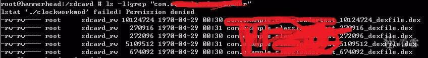

# 拨云见日：安卓APP脱壳的本质以及如何快速发现ART下的脱壳点

我在文章《FART：ART环境下基于主动调用的自动化脱壳方案》中简单对当前的几个脱壳方法进行了总结，然而并没有对每一种的具体原理进行分析。同时，在文章《FART正餐前甜点：ART下几个通用简单高效的dump内存中dex方法》中，通过对ART下类加载执行流程进行源码分析，又给出了几个新的ART下通用的简单高效的脱壳点。但是，我在写上述文章的时候，并没有对当前安卓平台加固APP的脱壳本质进行总结；同时，也没有总结给出快速定位发现安卓中通用脱壳点的方法。这里要感谢看雪的邀请，让我能够有幸成为看雪的一名讲师。我在看雪的线下培训班：《安卓高级研修班》课程上已经对当前网上公开的一些脱壳方法的原理进行了深入的分析，同时总结出了脱壳的本质以及如何快速发现ART环境下的脱壳点。相信听了我的《安卓高级研修班》的课程的大佬们目前也都已经发现了ART下新的通用脱壳点并付诸实际应用中，这也是我为什么说发现“海量”脱壳点的原因。这里，也相信在看懂了本文关于对脱壳的本质和快速发现ART下的脱壳点的方法后，大家也可以开始自己的“脱壳点”挖掘的工作中。这里先抛砖引玉，我在《安卓高级研修班》课程上也给出了ART下的一个未公开的通用脱壳点和脱壳镜像。关于这部分内容将在本文的第三节，作为本文的结束彩蛋送给大家。


## 一、发现脱壳的本质

## 1、现有脱壳方法原理分析

首先看下Dalvik下hook dvmdexopenpartal、dexfileparse函数来实现脱壳的原理。

先看dexFileParse函数代码：

```
/*
284 * Parse an optimized or unoptimized .dex file sitting in memory.  This is
285 * called after the byte-ordering and structure alignment has been fixed up.
286 *
287 * On success, return a newly-allocated DexFile.
288 */
289DexFile* dexFileParse(const u1* data, size_t length, int flags)
290{
291    DexFile* pDexFile = NULL;
292    const DexHeader* pHeader;
293    const u1* magic;
294    int result = -1;
295
296    if (length < sizeof(DexHeader)) {
297        ALOGE("too short to be a valid .dex");
298        goto bail;      /* bad file format */
299    }
300
301    pDexFile = (DexFile*) malloc(sizeof(DexFile));
302    if (pDexFile == NULL)
303        goto bail;      /* alloc failure */
304    memset(pDexFile, 0, sizeof(DexFile));
305
306    /*
307     * Peel off the optimized header.
308     */
309    if (memcmp(data, DEX_OPT_MAGIC, 4) == 0) {
310        magic = data;
311        if (memcmp(magic+4, DEX_OPT_MAGIC_VERS, 4) != 0) {
312            ALOGE("bad opt version (0x%02x %02x %02x %02x)",
313                 magic[4], magic[5], magic[6], magic[7]);
314            goto bail;
315        }
316
317        pDexFile->pOptHeader = (const DexOptHeader*) data;
318        ALOGV("Good opt header, DEX offset is %d, flags=0x%02x",
319            pDexFile->pOptHeader->dexOffset, pDexFile->pOptHeader->flags);
320
321        /* parse the optimized dex file tables */
322        if (!dexParseOptData(data, length, pDexFile))
323            goto bail;
324
325        /* ignore the opt header and appended data from here on out */
326        data += pDexFile->pOptHeader->dexOffset;
327        length -= pDexFile->pOptHeader->dexOffset;
328        if (pDexFile->pOptHeader->dexLength > length) {
329            ALOGE("File truncated? stored len=%d, rem len=%d",
330                pDexFile->pOptHeader->dexLength, (int) length);
331            goto bail;
332        }
333        length = pDexFile->pOptHeader->dexLength;
334    }
335
336    dexFileSetupBasicPointers(pDexFile, data);
337    pHeader = pDexFile->pHeader;
338
339    if (!dexHasValidMagic(pHeader)) {
340        goto bail;
341    }
342
343    /*
344     * Verify the checksum(s).  This is reasonably quick, but does require
345     * touching every byte in the DEX file.  The base checksum changes after
346     * byte-swapping and DEX optimization.
347     */
348    if (flags & kDexParseVerifyChecksum) {
349        u4 adler = dexComputeChecksum(pHeader);
350        if (adler != pHeader->checksum) {
351            ALOGE("ERROR: bad checksum (%08x vs %08x)",
352                adler, pHeader->checksum);
353            if (!(flags & kDexParseContinueOnError))
354                goto bail;
355        } else {
356            ALOGV("+++ adler32 checksum (%08x) verified", adler);
357        }
358
359        const DexOptHeader* pOptHeader = pDexFile->pOptHeader;
360        if (pOptHeader != NULL) {
361            adler = dexComputeOptChecksum(pOptHeader);
362            if (adler != pOptHeader->checksum) {
363                ALOGE("ERROR: bad opt checksum (%08x vs %08x)",
364                    adler, pOptHeader->checksum);
365                if (!(flags & kDexParseContinueOnError))
366                    goto bail;
367            } else {
368                ALOGV("+++ adler32 opt checksum (%08x) verified", adler);
369            }
370        }
371    }
372
373    /*
374     * Verify the SHA-1 digest.  (Normally we don't want to do this --
375     * the digest is used to uniquely identify the original DEX file, and
376     * can't be computed for verification after the DEX is byte-swapped
377     * and optimized.)
378     */
379    if (kVerifySignature) {
380        unsigned char sha1Digest[kSHA1DigestLen];
381        const int nonSum = sizeof(pHeader->magic) + sizeof(pHeader->checksum) +
382                            kSHA1DigestLen;
383
384        dexComputeSHA1Digest(data + nonSum, length - nonSum, sha1Digest);
385        if (memcmp(sha1Digest, pHeader->signature, kSHA1DigestLen) != 0) {
386            char tmpBuf1[kSHA1DigestOutputLen];
387            char tmpBuf2[kSHA1DigestOutputLen];
388            ALOGE("ERROR: bad SHA1 digest (%s vs %s)",
389                dexSHA1DigestToStr(sha1Digest, tmpBuf1),
390                dexSHA1DigestToStr(pHeader->signature, tmpBuf2));
391            if (!(flags & kDexParseContinueOnError))
392                goto bail;
393        } else {
394            ALOGV("+++ sha1 digest verified");
395        }
396    }
397
398    if (pHeader->fileSize != length) {
399        ALOGE("ERROR: stored file size (%d) != expected (%d)",
400            (int) pHeader->fileSize, (int) length);
401        if (!(flags & kDexParseContinueOnError))
402            goto bail;
403    }
404
405    if (pHeader->classDefsSize == 0) {
406        ALOGE("ERROR: DEX file has no classes in it, failing");
407        goto bail;
408    }
409
410    /*
411     * Success!
412     */
413    result = 0;
414
415bail:
416    if (result != 0 && pDexFile != NULL) {
417        dexFileFree(pDexFile);
418        pDexFile = NULL;
419    }
420    return pDexFile;
421}
```

该函数主要就是对内存中的dex内容进行解析，最终返回一个DexFile结构体供虚拟机使用，函数的参数部分包含了内存中的dex文件的起始地址和大小，因此，在这里可以实现对app的脱壳。

下面再看dvmDexFileOpenPartial函数：代码如下

```
146int dvmDexFileOpenPartial(const void* addr, int len, DvmDex** ppDvmDex)
147{
148    DvmDex* pDvmDex;
149    DexFile* pDexFile;
150    int parseFlags = kDexParseDefault;
151    int result = -1;
152
153    /* -- file is incomplete, new checksum has not yet been calculated
154    if (gDvm.verifyDexChecksum)
155        parseFlags |= kDexParseVerifyChecksum;
156    */
157
158    pDexFile = dexFileParse((u1*)addr, len, parseFlags);
159    if (pDexFile == NULL) {
160        ALOGE("DEX parse failed");
161        goto bail;
162    }
163    pDvmDex = allocateAuxStructures(pDexFile);
164    if (pDvmDex == NULL) {
165        dexFileFree(pDexFile);
166        goto bail;
167    }
168
169    pDvmDex->isMappedReadOnly = false;
170    *ppDvmDex = pDvmDex;
171    result = 0;
172
173bail:
174    return result;
175}
```

该函数里最后调用了dexFileParse函数来得到解析后的DexFile结构体，函数的参数部分也包含了内存中dex的起始地址和大小，因此这里也是可以脱壳的。事实上Dalvik下类似这种的脱壳点还有很多。

接下来看下为什么通过对ART下OpenMemory函数hook或下断能够进行脱壳，当前很多壳通过对openmem函数进行hook来对抗该脱壳法，因此该方法针对某些壳可能已经失效。

OpenMemory函数在DexFile类中被调用，相关源码如下：

```
272std::unique_ptr<const DexFile> DexFile::OpenMemory(const std::string& location,
273                                                   uint32_t location_checksum,
274                                                   MemMap* mem_map,
275                                                   std::string* error_msg) {
276  return OpenMemory(mem_map->Begin(),
277                    mem_map->Size(),
278                    location,
279                    location_checksum,
280                    mem_map,
281                    nullptr,
282                    error_msg);
283}
```

可以看到OpenMemory函数的参数中包含了内存中dex的起始位置和大小，因此，能够通过该函数进行脱壳。

在17年的DEF CON 25 黑客大会中，Avi Bashan 和 SlavaMakkaveev 提出的通过修改DexFile的构造函数DexFile::DexFile()，以及OpenAndReadMagic()函数来实现对加壳应用的内存中的dex的dump来脱壳技术，下面我们就来看这两个函数的具体代码。首先看DexFile类的构造函数的源码：

```
395DexFile::DexFile(const uint8_t* base, size_t size,
396                 const std::string& location,
397                 uint32_t location_checksum,
398                 MemMap* mem_map,
399                 const OatDexFile* oat_dex_file)
400    : begin_(base),
401      size_(size),
402      location_(location),
403      location_checksum_(location_checksum),
404      mem_map_(mem_map),
405      header_(reinterpret_cast<const Header*>(base)),
406      string_ids_(reinterpret_cast<const StringId*>(base + header_->string_ids_off_)),
407      type_ids_(reinterpret_cast<const TypeId*>(base + header_->type_ids_off_)),
408      field_ids_(reinterpret_cast<const FieldId*>(base + header_->field_ids_off_)),
409      method_ids_(reinterpret_cast<const MethodId*>(base + header_->method_ids_off_)),
410      proto_ids_(reinterpret_cast<const ProtoId*>(base + header_->proto_ids_off_)),
411      class_defs_(reinterpret_cast<const ClassDef*>(base + header_->class_defs_off_)),
412      find_class_def_misses_(0),
413      class_def_index_(nullptr),
414      oat_dex_file_(oat_dex_file) {
415  CHECK(begin_ != nullptr) << GetLocation();
416  CHECK_GT(size_, 0U) << GetLocation();
417}
```

可以看到该构造函数的参数中依然是包含了内存中dex的起始位置和大小，因此，能够通过修改该函数进行脱壳。下面为添加的代码，在代码中只需要调用write将内存中的dex写入文件即完成脱壳。

```
+   LOG(WARNING) << "Dex File: Filename: "<< location;                                          
+   if (location.find("/data/data/") != std::string::npos) {                                    
+     LOG(WARNING) << "Dex File: OAT file unpacking launched";                                  
+     std::ofstream dst(location + "__unpacked_oat", std::ios::binary);                         
+     dst.write(reinterpret_cast<const char*>(base), size);                                     
+     dst.close();                                                                              
+   } else {                                                                                    
+     LOG(WARNING) << "Dex File: OAT file unpacking not launched";                              
+   }          
```

接下来再看OpenAndReadMagic函数，该函数打开了dex文件并进行魔数的校验，源码如下：

```
59static int OpenAndReadMagic(const char* filename, uint32_t* magic, std::string* error_msg) {
60  CHECK(magic != nullptr);
61  ScopedFd fd(open(filename, O_RDONLY, 0));
62  if (fd.get() == -1) {
63    *error_msg = StringPrintf("Unable to open '%s' : %s", filename, strerror(errno));
64    return -1;
65  }
66  int n = TEMP_FAILURE_RETRY(read(fd.get(), magic, sizeof(*magic)));
67  if (n != sizeof(*magic)) {
68    *error_msg = StringPrintf("Failed to find magic in '%s'", filename);
69    return -1;
70  }
71  if (lseek(fd.get(), 0, SEEK_SET) != 0) {
72    *error_msg = StringPrintf("Failed to seek to beginning of file '%s' : %s", filename,
73                              strerror(errno));
74    return -1;
75  }
76  return fd.release();
77}
```

因此添加如下代码，即可完成脱壳。

```
+   struct stat st;
+   // let's limit processing file list
+
+   LOG(WARNING) << "File_magic: Filename: "<<filename;
+   if (strstr(filename, "/data/data") != NULL) {
+     LOG(WARNING) << "File_magic: DEX file unpacking launched";
+     char* fn_out = new char[PATH_MAX];
+     strcpy(fn_out, filename);
+     strcat(fn_out, "__unpacked_dex");
+
+     int fd_out = open(fn_out, O_WRONLY | O_CREAT | O_EXCL, S_IRUSR | S_IWUSR | S_IRGRP | S_IROTH);
+
+     if (!fstat(fd.get(), &st)) {
+       char* addr = (char*)mmap(NULL, st.st_size, PROT_READ, MAP_PRIVATE, fd.get(), 0);
+       int ret=write(fd_out, addr, st.st_size);
+       ret+=1;
+       munmap(addr, st.st_size);
+     }
+
+     close(fd_out);
+     delete[] fn_out;
+   } else {
+     LOG(WARNING) << "File_magic: DEX file unpacking not launched";
+   }
```

接下来分析在java层进行脱壳的典型案例：Fdex2的原理以及如何对Fdex2进行拓展使用。

先看Fdex2的关键代码部分：

```
XposedHelpers.findAndHookMethod("java.lang.ClassLoader", lpparam.classLoader, "loadClass", String.class, Boolean.TYPE, new XC_MethodHook() {
            protected void afterHookedMethod(MethodHookParam param) throws Throwable {
                super.afterHookedMethod(param);
                Class cls = (Class) param.getResult();
                if (cls == null) {
                    //XposedBridge.log("cls == null");
                    return;
                }
                String name = cls.getName();
                XposedBridge.log("当前类名：" + name);
                byte[] bArr = (byte[]) Dex_getBytes.invoke(getDex.invoke(cls, new Object[0]), new Object[0]);
                if (bArr == null) {
                    XposedBridge.log("数据为空：返回");
                    return;
                }
                XposedBridge.log("开始写数据");
                String dex_path = "/data/data/" + packagename + "/" + packagename + "_" + bArr.length + ".dex";
                XposedBridge.log(dex_path);
                File file = new File(dex_path);
                if (file.exists()) return;
                writeByte(bArr, file.getAbsolutePath());
            }
            } );
    }
  
    public void initRefect() {
        try {
            Dex = Class.forName("com.android.dex.Dex");
            Dex_getBytes = Dex.getDeclaredMethod("getBytes", new Class[0]);
            getDex = Class.forName("java.lang.Class").getDeclaredMethod("getDex", new Class[0]);
        } catch (ClassNotFoundException e) {
            e.printStackTrace();
        } catch (NoSuchMethodException e) {
            e.printStackTrace();
        }
  
    }
  
    public  void writeByte(byte[] bArr, String str) {
        try {
            OutputStream outputStream = new FileOutputStream(str);
            outputStream.write(bArr);
            outputStream.close();
        } catch (IOException e) {
            e.printStackTrace();
        }
```

可以看到，fdex2通过对类"java.lang.ClassLoader”中的loadClass进行hook，进而获取到该函数执行后返回的Class对象cls。对于"java.lang.ClassLoader”类中的loadClass函数是Android中加载Class流程中的一个关键函数，因此，Fdex2选择hook这个函数。本来在java中来操作指针以及dump内存是非常困难的事情，然而，Android系统源码却恰好提供了java.lang.Class类中的getDex函数，用于通过一个Class对象来获取到其所属的dex对象，以及com.android.dex.Dex类中的getBytes函数，用于通过一个dex对象来获取到该dex对象在内存中的字节流。正是有了这两个api的支持，才能够实现在java代码中实现对内存中的dex的dump。因此，便可以利用这两个api对Fdex2的脱壳原理进行拓展使用。比如，所有的app的组件信息都会在Manifest.xml文件中进行注册，那么我们就可以知道该加壳app中dex必然包含的一些类，如Activity类名、Service类名等，那么我们就可以通过使用各种hook技术完成对该app的hook，获取到这些类的Class对象，如首先通过反射获取到app最终的Classloader，然后再通过classloader的loadClass获取到某一个已知类的Class对象，然后再配合getDex和getBytes这两个api便可以实现对该类所属的dex的脱壳。

最后，再提一下根据Classloader来脱壳，看雪上也有对这个方法的介绍。通过对源码分析，可以看到app加载的所有的dex都依附在对应的Classloader中，那么，便可以通过一系列的反射最终获取到每一个dex文件的DexFile对象，具体流程可以首先通过反射，获取加固app最终的Classloader，然后再通过反射获取到BaseDexClassloader类中的DexPathList pathList对象，再然后获取pathList对象中的Element[]类型的dexElements对象，最后，便可以获取到Element类型对象中的DexFile dexFile对象，进而再获取到DexFile对象中的关键元素： mCookie，那么接下来就可以通过mCookie在C/C++层完成对dex的dump操作。

## 2、总结Android脱壳的本质

上面对当前的一些主流的脱壳方法进行了简单的原理分析。可以得出结论：Android APP脱壳的本质就是对内存中处于解密状态的dex的dump。首先要区分这里的脱壳和修复的区别。这里的脱壳指的是对加固apk中保护的dex的整体的dump，不管是函数抽取、dex2c还是vmp壳，首要做的就是对整体dex的dump，然后再对脱壳下来的dex进行修复。要达到对apk的脱壳，最为关键的就是准确定位内存中解密后的dex文件的起始地址和大小。那么这里要达成对apk的成功脱壳，就有两个最为关键的要素：

1、内存中dex的起始地址和大小，只有拿到这两个要素，才能够成功dump下内存中的dex

2、脱壳时机，只有正确的脱壳时机，才能够dump下明文状态的dex。否则，时机不对，及时是正确的起始地址和大小，dump下来的也可能只是密文。

其中，通过上一小节对当前的一些脱壳方法的原理分析可以看到，Dalvik下的脱壳都是围绕着一个至关重要的结构体：DexFile结构体，而到了ART以后，便演化为了DexFile类。可以说，在ART下只要获得了DexFile对象，那么我们就可以得到该dex文件在内存中的起始地址和大小，进而完成脱壳。下面是DexFile结构体的定义以及DexFile类的定义源码：

Dalvik下DexFile结构体：

```
struct DexFile {
501    /* directly-mapped "opt" header */
502    const DexOptHeader* pOptHeader;
503
504    /* pointers to directly-mapped structs and arrays in base DEX */
505    const DexHeader*    pHeader;
506    const DexStringId*  pStringIds;
507    const DexTypeId*    pTypeIds;
508    const DexFieldId*   pFieldIds;
509    const DexMethodId*  pMethodIds;
510    const DexProtoId*   pProtoIds;
511    const DexClassDef*  pClassDefs;
512    const DexLink*      pLinkData;
513
514    /*
515     * These are mapped out of the "auxillary" section, and may not be
516     * included in the file.
517     */
518    const DexClassLookup* pClassLookup;
519    const void*         pRegisterMapPool;       // RegisterMapClassPool
520
521    /* points to start of DEX file data */
522    const u1*           baseAddr;
523
524    /* track memory overhead for auxillary structures */
525    int                 overhead;
526
527    /* additional app-specific data structures associated with the DEX */
528    //void*               auxData;
529};
530
```

ART下DexFile类,代码较长，只贴出片段吧：

```
54class DexFile {
55 public:
56  static const uint8_t kDexMagic[];
57  static const uint8_t kDexMagicVersion[];
58  static constexpr size_t kSha1DigestSize = 20;
59  static constexpr uint32_t kDexEndianConstant = 0x12345678;
61  // name of the DexFile entry within a zip archive
62  static const char* kClassesDex;
64  // The value of an invalid index.
65  static const uint32_t kDexNoIndex = 0xFFFFFFFF;
67  // The value of an invalid index.
68  static const uint16_t kDexNoIndex16 = 0xFFFF;
70  // The separator charactor in MultiDex locations.
71  static constexpr char kMultiDexSeparator = ':';
73  // A string version of the previous. This is a define so that we can merge string literals in the
74  // preprocessor.
75  #define kMultiDexSeparatorString ":"77  // Raw header_item.
78  struct Header {
79    uint8_t magic_[8];
80    uint32_t checksum_;  // See also location_checksum_
81    uint8_t signature_[kSha1DigestSize];
82    uint32_t file_size_;  // size of entire file
83    uint32_t header_size_;  // offset to start of next section
84    uint32_t endian_tag_;
85    uint32_t link_size_;  // unused
86    uint32_t link_off_;  // unused
87    uint32_t map_off_;  // unused
88    uint32_t string_ids_size_;  // number of StringIds
89    uint32_t string_ids_off_;  // file offset of StringIds array
90    uint32_t type_ids_size_;  // number of TypeIds, we don't support more than 65535
91    uint32_t type_ids_off_;  // file offset of TypeIds array
92    uint32_t proto_ids_size_;  // number of ProtoIds, we don't support more than 65535
93    uint32_t proto_ids_off_;  // file offset of ProtoIds array
94    uint32_t field_ids_size_;  // number of FieldIds
95    uint32_t field_ids_off_;  // file offset of FieldIds array
96    uint32_t method_ids_size_;  // number of MethodIds
97    uint32_t method_ids_off_;  // file offset of MethodIds array
98    uint32_t class_defs_size_;  // number of ClassDefs
99    uint32_t class_defs_off_;  // file offset of ClassDef array
100    uint32_t data_size_;  // unused
101    uint32_t data_off_;  // unused
102
103   private:
104    DISALLOW_COPY_AND_ASSIGN(Header);
105  };
106
107  /
.......
```

可以看到，ART下DexFile类中定义了两个关键的变量： begin_、size_以及用于获取这两个变量的Begin()和Size()函数。这两个变量分别代表着当前DexFile对象对应的内存中的dex文件加载的起始位置和大小。当然也有其他的方法来获取到内存中的dex加载的起始位置和大小。可以说，只要有了这两个值，我们就可以完成对这个dex的dump。

## 二、ART下基于关键字的快速定位脱壳点方法

在上一小节，我对当前Android加固app脱壳的本质进行了总结。其中，ART下影响脱壳的关键的一个类就是DexFile，那么我们便可以围绕这个类，实现在Android庞大的系统源码中快速定位脱壳点，从而能够找到“海量”的脱壳点。这里再总结给出两种快速定位脱壳点的方法。

## 1、直接查找法

这里的直接查找法就是指以DexFile为关键字，在庞大的源码库中检索定位可能的脱壳点。如参数中出现DexFile类型的、返回值为DexFile类型的、函数流程中出现DexFile类型的源码位置。在获取到DexFile对象以后，然后再通过该对象的Begin()和Size()函数获取到该DexFile对象对应的内存中的dex的起始地址和大小即可进行dex的dump。如下图的检索过程，可以轻松定位出网上公开的基于dex2oat流程进行脱壳的脱壳点，同时，也可以看到那个脱壳点只是dex2oat流程中的一个脱壳点而已。


## 2、间接查找法

间接法就是指以DexFile为出发点，寻找能够间接获取到DexFile对象的。如通过ArtMethod对象的getDexFile()获取到ArtMethod所属的DexFile对象的这种一级间接法等；然后再在海量源码中以ArtMethod为关键字进行检索，检索那些参数中出现ArtMethod类型的、返回值为ArtMethod类型的、函数流程中出现ArtMethod类型的源码位置；

再比如通过Thread的getCurrentMethod()函数首先获取到ArtMethod或者通过ShadowFrame的getMethod获取到ArtMethod对象，然后再通过getDexFile获取到ArtMethod对象所属的DexFile的二级间接法以及通过ShadowFrame对象的GetMethod()函数获取到当前栈中执行的ArtMethod对象，然后再获取DexFile对象等等的二级间接法。

好了，上面已经给出了如何快速在庞大的源码库中定位可能的脱壳点的方法了，大家就可以开始自己的“挖宝”行动了！接下来，便进入了本文的彩蛋部分了。

## 三、彩蛋：送出一个未公开的脱壳点

## 1、原理分析

众所周知，ART下引入了dex2oat来对dex进行编译，生成每一个java函数对应的native代码，来提高运行效率。但是，dex2oat并不是对dex中的所有函数进行编译，通过对dex2oat的源码进行分析，最终可以到达CompilerDriver类的CompileMethod函数，可以看到dex2oat对dex进行编译的过程中是按照函数粒度进行编译的。

```
2255void CompilerDriver::CompileMethod(Thread* self, const DexFile::CodeItem* code_item,
2256                                   uint32_t access_flags, InvokeType invoke_type,
2257                                   uint16_t class_def_idx, uint32_t method_idx,
2258                                   jobject class_loader, const DexFile& dex_file,
2259                                   DexToDexCompilationLevel dex_to_dex_compilation_level,
2260                                   bool compilation_enabled) {
2261  CompiledMethod* compiled_method = nullptr;
2262  uint64_t start_ns = kTimeCompileMethod ? NanoTime() : 0;
2263  MethodReference method_ref(&dex_file, method_idx);
2264
2265  if ((access_flags & kAccNative) != 0) {
2266    // Are we interpreting only and have support for generic JNI down calls?
2267    if (!compiler_options_->IsCompilationEnabled() &&
2268        InstructionSetHasGenericJniStub(instruction_set_)) {
2269      // Leaving this empty will trigger the generic JNI version
2270    } else {
2271      compiled_method = compiler_->JniCompile(access_flags, method_idx, dex_file);
2272      CHECK(compiled_method != nullptr);
2273    }
2274  } else if ((access_flags & kAccAbstract) != 0) {
2275    // Abstract methods don't have code.
2276  } else {
2277    bool has_verified_method = verification_results_->GetVerifiedMethod(method_ref) != nullptr;
2278    bool compile = compilation_enabled &&
2279                   // Basic checks, e.g., not <clinit>.
2280                   verification_results_->IsCandidateForCompilation(method_ref, access_flags) &&
2281                   // Did not fail to create VerifiedMethod metadata.
2282                   has_verified_method &&
2283                   // Is eligable for compilation by methods-to-compile filter.
2284                   IsMethodToCompile(method_ref);
2285    if (compile) {
2286      // NOTE: if compiler declines to compile this method, it will return null.
2287      compiled_method = compiler_->Compile(code_item, access_flags, invoke_type, class_def_idx,
2288                                           method_idx, class_loader, dex_file);
2289    }
2290    if (compiled_method == nullptr && dex_to_dex_compilation_level != kDontDexToDexCompile) {
2291      // TODO: add a command-line option to disable DEX-to-DEX compilation ?
2292      // Do not optimize if a VerifiedMethod is missing. SafeCast elision, for example, relies on
2293      // it.
2294      (*dex_to_dex_compiler_)(*this, code_item, access_flags,
2295                              invoke_type, class_def_idx,
2296                              method_idx, class_loader, dex_file,
2297                              has_verified_method ? dex_to_dex_compilation_level : kRequired);
2298    }
2299  }
2300  if (kTimeCompileMethod) {
2301    uint64_t duration_ns = NanoTime() - start_ns;
2302    if (duration_ns > MsToNs(compiler_->GetMaximumCompilationTimeBeforeWarning())) {
2303      LOG(WARNING) << "Compilation of " << PrettyMethod(method_idx, dex_file)
2304                   << " took " << PrettyDuration(duration_ns);
2305    }
2306  }
2307
2308  if (compiled_method != nullptr) {
2309    // Count non-relative linker patches.
2310    size_t non_relative_linker_patch_count = 0u;
2311    for (const LinkerPatch& patch : compiled_method->GetPatches()) {
2312      if (!patch.IsPcRelative()) {
2313        ++non_relative_linker_patch_count;
2314      }
2315    }
2316    bool compile_pic = GetCompilerOptions().GetCompilePic();  // Off by default
2317    // When compiling with PIC, there should be zero non-relative linker patches
2318    CHECK(!compile_pic || non_relative_linker_patch_count == 0u);
2319
2320    DCHECK(GetCompiledMethod(method_ref) == nullptr) << PrettyMethod(method_idx, dex_file);
2321    {
2322      MutexLock mu(self, compiled_methods_lock_);
2323      compiled_methods_.Put(method_ref, compiled_method);
2324      non_relative_linker_patch_count_ += non_relative_linker_patch_count;
2325    }
2326    DCHECK(GetCompiledMethod(method_ref) != nullptr) << PrettyMethod(method_idx, dex_file);
2327  }
2328
2329  // Done compiling, delete the verified method to reduce native memory usage. Do not delete in
2330  // optimizing compiler, which may need the verified method again for inlining.
2331  if (compiler_kind_ != Compiler::kOptimizing) {
2332    verification_results_->RemoveVerifiedMethod(method_ref);
2333  }
2334
2335  if (self->IsExceptionPending()) {
2336    ScopedObjectAccess soa(self);
2337    LOG(FATAL) << "Unexpected exception compiling: " << PrettyMethod(method_idx, dex_file) << "\n"
2338        << self->GetException()->Dump();
2339  }
2340}
```

可以看到在进行编译前进行了判断,最终可以发现，dex2oat对类的初始化函数并没有进行编译，那么也就是说类的初始化函数始终运行在ART下的inpterpreter模式，那么最终必然进入到interpreter.cc文件中的Execute函数，进而进入ART下的解释器解释执行。因此，我们便可以选择在Execute或者其他解释执行流程中的函数中进行dex的dump操作。事实上，当前一些壳通过阻断dex2oat的编译过程，导致了不只是类的初始化函数在解释模式下执行，也让类中的其他函数也运行在解释模式下。

## 2、实现代码

下面进入到代码部分了，最终我们只需要在Execute函数中添加一些代码即可，修改后的Execute函数代码如下：

```
static JValue Execute(Thread* self, const DexFile::CodeItem* code_item, ShadowFrame& shadow_frame,
                      JValue result_register)
    SHARED_LOCKS_REQUIRED(Locks::mutator_lock_);
 
static inline JValue Execute(Thread* self, const DexFile::CodeItem* code_item,
                             ShadowFrame& shadow_frame, JValue result_register) {
      //addcodestart
    char *dexfilepath=(char*)malloc(sizeof(char)*1000);   
    if(dexfilepath!=nullptr)
    {
    ArtMethod* artmethod=shadow_frame.GetMethod();
    const DexFile* dex_file = artmethod->GetDexFile();
    const uint8_t* begin_=dex_file->Begin();  // Start of data.
    size_t size_=dex_file->Size();  // Length of data.
    int size_int_=(int)size_;
    int fcmdline =-1;
    char szCmdline[64]= {0};
    char szProcName[256] = {0};
    int procid = getpid();
    sprintf(szCmdline,"/proc/%d/cmdline", procid);
    fcmdline = open(szCmdline, O_RDONLY,0644);
    if(fcmdline >0)
    {
        read(fcmdline, szProcName,256);
        close(fcmdline);
    }
             
    if(szProcName[0])
    {
            memset(dexfilepath,0,1000);               
            sprintf(dexfilepath,"/sdcard/%s_%d_dexfile.dex",szProcName,size_int_);     
            int dexfilefp=open(dexfilepath,O_RDONLY,0666);
            if(dexfilefp>0){
                                close(dexfilefp);
                                dexfilefp=0;
                                       
                            }else{
                                        int fp=open(dexfilepath,O_CREAT|O_APPEND|O_RDWR,0666);
                                        if(fp>0)
                                        {
                                            write(fp,(void*)begin_,size_);
                                            fsync(fp); 
                                            close(fp);  
                                            }  
                             
                                }
    }
 
    if(dexfilepath!=nullptr)
    {
        free(dexfilepath);
        dexfilepath=nullptr;
    }                        
   }
 //addcodeend
  DCHECK(!shadow_frame.GetMethod()->IsAbstract());
  DCHECK(!shadow_frame.GetMethod()->IsNative());
  shadow_frame.GetMethod()->GetDeclaringClass()->AssertInitializedOrInitializingInThread(self);
 
 
 
  bool transaction_active = Runtime::Current()->IsActiveTransaction();
  if (LIKELY(shadow_frame.GetMethod()->IsPreverified())) {
    // Enter the "without access check" interpreter.
    if (kInterpreterImplKind == kSwitchImpl) {
      if (transaction_active) {
        return ExecuteSwitchImpl<false, true>(self, code_item, shadow_frame, result_register);
      } else {
        return ExecuteSwitchImpl<false, false>(self, code_item, shadow_frame, result_register);
      }
    } else {
      DCHECK_EQ(kInterpreterImplKind, kComputedGotoImplKind);
      if (transaction_active) {
        return ExecuteGotoImpl<false, true>(self, code_item, shadow_frame, result_register);
      } else {
        return ExecuteGotoImpl<false, false>(self, code_item, shadow_frame, result_register);
      }
    }
  } else {
    // Enter the "with access check" interpreter.
    if (kInterpreterImplKind == kSwitchImpl) {
      if (transaction_active) {
        return ExecuteSwitchImpl<true, true>(self, code_item, shadow_frame, result_register);
      } else {
        return ExecuteSwitchImpl<true, false>(self, code_item, shadow_frame, result_register);
      }
    } else {
      DCHECK_EQ(kInterpreterImplKind, kComputedGotoImplKind);
      if (transaction_active) {
        return ExecuteGotoImpl<true, true>(self, code_item, shadow_frame, result_register);
      } else {
        return ExecuteGotoImpl<true, false>(self, code_item, shadow_frame, result_register);
      }
    }
  }
}
```

## 3、测试效果

在修改完代码并完成脱壳镜像的编译后(这里提供一个已经编译好的nexus5的6.0镜像供大家体验,链接：https://pan.baidu.com/s/1vt6roAFf_tdayp_QB1taZQ

提取码：wqn2)，就可以愉快的开始测试脱壳效果了。这里要注意，我在代码中对dex直接保存到了SD卡的根目录下，因此在安装完app后，记得到设置中授予app读写SD卡权限，不然无法写入脱壳的dex。这里我就随便选择了几个最新版的加固厂商的加固app进行测试了，下面是测试效果：

数字壳测试效果




可以看到能够dump成功：


某梆脱壳效果：


好了，就到这里吧，大家可以下载镜像测试其他的壳。

\----------------------------------------------------------------------------------------------

鉴于很多人手里没有nexus5手机，重新编译又比较费劲，这里再同时提供arm、x86模拟器镜像

链接：https://pan.baidu.com/s/1au7MShA1Ei_u9iDMM5JRoQ
提取码：23d5