# 记录向：单纯使用Frida书写类抽取脱壳工具的一些心路历程和实践 

**开篇要求：**

FART通过对系统源码修改编译，生成脱壳rom，完成对dex的函数粒度的修复；其中FART的主动调用链构造的深度可以结合壳的修复时机进行定制。**当前很多抽取壳在类的加载流程当中就已经完成了被抽取函数的修复。**

试想一下，如果不考虑FART当中主动调用链的构造，能否**单纯用Frida这个hook框架实现一个能够在函数粒度上解决抽取壳的脱壳脚本？**


**关于Fart的脱壳点：**

一个是Execute函数，另一个就是送到主动调用链的时候

- <clinit> - Execute => dumpDexFileByExecute
- 其他正常函数 - DexFile_dumpMethodCode => myfartInvoke => Invoke => dumpArtMethod


**关于主动调用链：**

启动fart-(getClassloader来获取ClassLoader)>fartwithClassLoader-(反射获取mCookie)>loadClassAndInvoke-(dumpMethodCode将各种函数转化成ArtMethod类型并送入我们的fake_Invoke参数包装)->送入系统的Invoke-(调用dumpArtMethod实现第二个脱壳点)


在这里我们看出Fart主动调用前提：

**获取appClassLoader，通过ClassLoader加载到所有类 ，通过每个类获取到该类下的所有方法【包括构造函数和普通函数】**

**++++++++++++++++++++++++++++++++++++++++动手环节++++++++++++++++++++++++++++++++++++++++++**

> 获取appClassLoader，通过ClassLoader加载到所有类

**1.首先实现和的功能【加载App最后依附的ClassLoader下的所有的类】：**

```
//加载当前ClassLoader下的所有的类
function load_all_class() {
    if (Java.available) {
        Java.perform(function () {
            var DexFileclass = Java.use("dalvik.system.DexFile");
            var BaseDexClassLoaderclass = Java.use("dalvik.system.BaseDexClassLoader");
            var DexPathListclass = Java.use("dalvik.system.DexPathList");
            Java.enumerateClassLoaders({
                onMatch: function (loader) {
                    console.log("loader:",loader);
                    //为了排除BootClassLoader和不相关的ClassLoader
                    if((loader.toString().indexOf("java.lang.BootClassLoader")==-1)&&(loader.toString().indexOf("zip")==-1) ){
                        try {
                            var BaseDexClassLoader_obj = Java.cast(loader, BaseDexClassLoaderclass);
                            var pathList = BaseDexClassLoader_obj.pathList.value;
                            var pathList_obj = Java.cast(pathList, DexPathListclass)
                            var ElementsArray = pathList_obj.dexElements.value;
                            console.log("ElementsArray---->",ElementsArray);
                            //下面三行是为了验证appClassLoader是哪一个
                            //var ActivityThreaeclass = Java.use("android.app.ActivityThread");
                            //var classloader = ActivityThreaeclass.getClassloader();
                            //console.log("appClassLoader is :",classloader );
                            for (var index in ElementsArray) {
                                var element = ElementsArray[index];
                                try {
                                        try{var dexfile = element.dexFile.value;}catch(e){}
                                     
                                         var dexfileobj = Java.cast(dexfile, DexFileclass);
                                         const classNames = [];
                                         const enumeratorClassNames = dexfileobj.entries();
                                         while (enumeratorClassNames.hasMoreElements()) {
                                            var className = enumeratorClassNames.nextElement().toString();
                                            classNames.push(className);
                                            //指定加载某个类
                                            if(className.indexOf("com.aipao.hanmoveschool.activity.LoginActivity")>=0){
                                                console.log("ClassName : " ,className);
                                                loader.loadClass(className);
                                            }  
                                        }     
                                }catch(e){
                                    console.log(e)
                                }
                            }
                        } catch (e) {
                            console.log(e);
                        }
                    }
                },
                onComplete: function () {
                    console.log("[*]load_all_class success！");
                }
            })
        });
    }
}
```


> 通过每个类获取到该类下的所有方法【包括构造函数和普通函数】

2.接下来完成的功能

```
//把上面的核心加载处进行修改，调用load_all_methods方法
                                             
                                            //指定加载某个类
                                            if(className.indexOf("com.aipao.hanmoveschool.activity.LoginActivity")>=0){
                                                console.log("ClassName : " ,className);
                                                //loader.loadClass(className);
                                                //每个类都要去把自己的所有函数加载进来
                                                load_all_methods(loader,className);
                                            }
```

```
//加载每个类下的所有函数
function load_all_methods(loader,classname){
    if (Java.available) {
        Java.perform(function () {
            //获取当前类的投射，即xxxxx.class这个方法，hookClassCast这个就是返回值
            var clazz = loader.loadClass(classname);
            var ClassUse = Java.use("java.lang.Class");
            var hookClassCast = Java.cast(clazz,ClassUse);
            console.log("hookClassCast is :",hookClassCast);
            console.log("------------------------------Constructors-------------------------------");
            var Constructors = hookClassCast.getDeclaredConstructors();
            console.log(Constructors);
            console.log("---------------------------------Methods---------------------------------");
            var Methods = hookClassCast.getDeclaredMethods();
            console.log(Methods,"\n");
        });
    }
}
```

**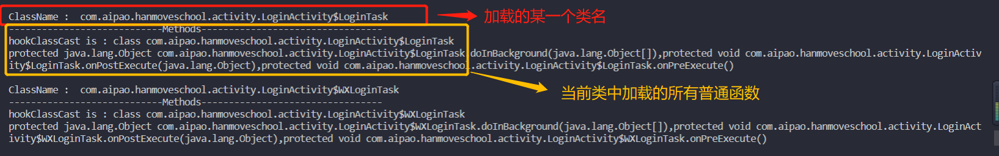**

**增加构造函数Constructors**

**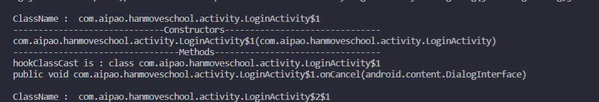**


现在Constructor和Method都可以打印出来了，接下来就是将它们送给ArtMethod::Invoke中，进行一种“虚拟的”调用。


此时来了第一个疑惑点：**能把我们的这些方法“送”到ArtMethod::Invoke去吗？**


================================**分析FART中的主动调用链**===================================

DexFile_dumpMethodCode中使用了jobject2ArtMethod函数【这个很重要】

```
static void DexFile_dumpMethodCode(JNIEnv* env, jclass, jobject method) {

  if(method!=nullptr)

  {

          ArtMethod* proxy_method = jobject2ArtMethod(env, method);

          myfartInvoke(proxy_method);

      }     

  return;

}
```


**而这里其实只是传递给Invoke然后再在Invoke中dumpArtMethod，可以说直到dumpArtMethod之前是没有执行任何具有功能性的代码。**

**可以发现Fart使用的主动调用链的深度其实是：jobject2ArtMethod这个函数决定的。**

```
extern "C" ArtMethod* jobject2ArtMethod(JNIEnv* env, jobject javaMethod) {

  ScopedFastNativeObjectAccess soa(env);

  ArtMethod* method = ArtMethod::FromReflectedMethod(soa, javaMethod);

  return method;

}
```


**通过 mirror::ArtMethod::FromReflectedMethod 获取了Java对象的在native层的 ArtMethod指针**

```
ArtMethod* ArtMethod::FromReflectedMethod(const ScopedObjectAccessAlreadyRunnable& soa, jobject jlr_method) {

    ObjPtr<mirror::Executable> executable = soa.Decode<mirror::Executable>(jlr_method);

    DCHECK(executable != nullptr);

    return executable->GetArtMethod();

  }
```


这里，我想到了一个不错的点子，我通过遍历method方法并对每一个方法进行一个调用，由于缺少参数，或者其他原因，最后肯定不能成功执行。

但是我们可以使用hook_native方式提前在load_all_class之前执行等待Java层的**.invoke方法（注意是小写的invoke，这是java方法）**到来，由于Java层的.invoke方法最终会调用InvokeMethod，因此我们hook它。

代码如下：

```
function hook_native() {
     
    var module_libart = Process.findModuleByName("libart.so");
    var symbols = module_libart.enumerateSymbols();
    var ArtMethod_Invoke = null;
     
    for (var i = 0; i < symbols.length; i++) {
        var symbol = symbols[i];
        var address = symbol.address;
        var name = symbol.name;
        //var indexArt = name.indexOf("Art");
        var indexInvoke = name.indexOf("InvokeMethodERKNS");
        if ( indexInvoke >= 0) {
            console.log(name);
            ArtMethod_Invoke = address;
            console.log(ArtMethod_Invoke);
        }
    }
    if (ArtMethod_Invoke) {
        Interceptor.attach(ArtMethod_Invoke, {
            onEnter: function (args) {
                try {   
                    console.log("soa is :",args[0],"javaMethod is :",args[1]);//观察结果，打印第一个(soa)和第二个参数(javamethod)
                } catch (error) {
                    console.log(error);
                }
            }, onLeave: function (retval) {
            }
        });
    }   
}
```

并注意函数method的调用

```
function load_all_methods(loader,classname){
    if (Java.available) {
        Java.perform(function () {
            //获取当前类的cast，即xxxxx.class这个方法，hookClassCast这个就是返回值
            var clazz = loader.loadClass(classname);
            var ClassUse = Java.use("java.lang.Class");
            var hookClassCast = Java.cast(clazz,ClassUse);
            console.log("hookClassCast is :",hookClassCast);
            console.log("------------------------------Constructors-------------------------------");
            var Constructors = hookClassCast.getDeclaredConstructors();
            console.log(Constructors);
            console.log("---------------------------------Methods---------------------------------");
            var Methods = hookClassCast.getDeclaredMethods();
            for(var i =0; i<Methods.length;i++){
                var method = Methods[i];
                method.setAccessible(true);
                try{method.invoke(null,null);
                    console.log("method:",method,"is invoke ok!")}catch(e){console.log(e)}
            }
            console.log(Methods,"\n");
        });
    }
}
```

可以发现每一个调用都来到了InvokeMethod这个函数来，我们的Hook是成功的！

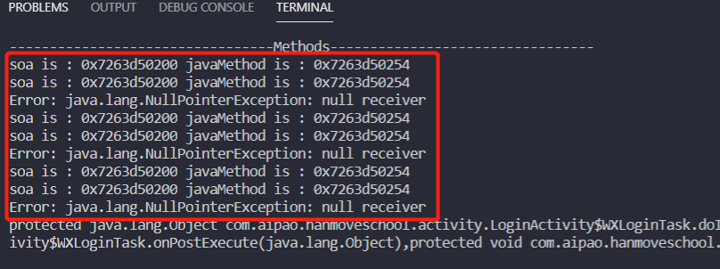


**而且通过后面打印的内容发现****soa的值是固定的。**

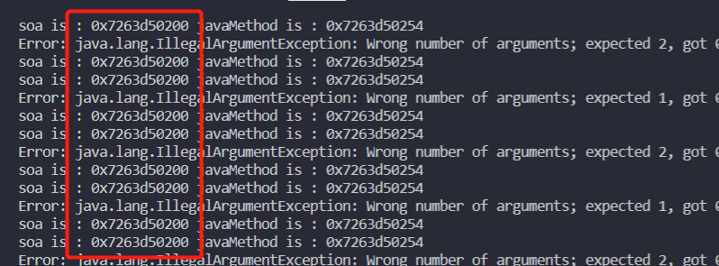

接下来我们尝试打印一下每一个Method一一对应的ArtMethod对象指针，**看看到底是不是这样？**

**不过hook什么函数才能拿到ArtMethod指针呢？我们继续来看源码中InvokeMethod函数，如下图框框所示：**

**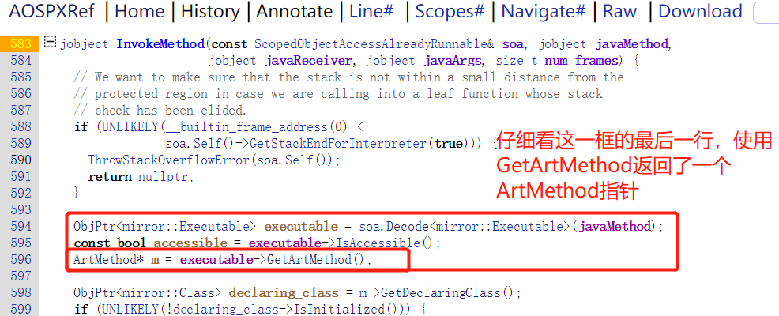**

**关键词来了，GetArtMethod！因此我们可以写下如下脚本：**

```
  ``//我们来hook GetArtMethod的返回值``  ``if` `(addr_GetArtMethod) {``    ``Interceptor.attach(addr_GetArtMethod, {``      ``onEnter: ``function` `(args) {``          ``//console.log("hook GetArtMethod!");``      ``}, onLeave: ``function` `(retval) {``        ``console.log(``"java_ArtMethod_ptr:"``,retval);``      ``}``    ``});``  ``}``}
```

验证，**我想取得每个Method对应的ArtMethod的想法得以成真：**

**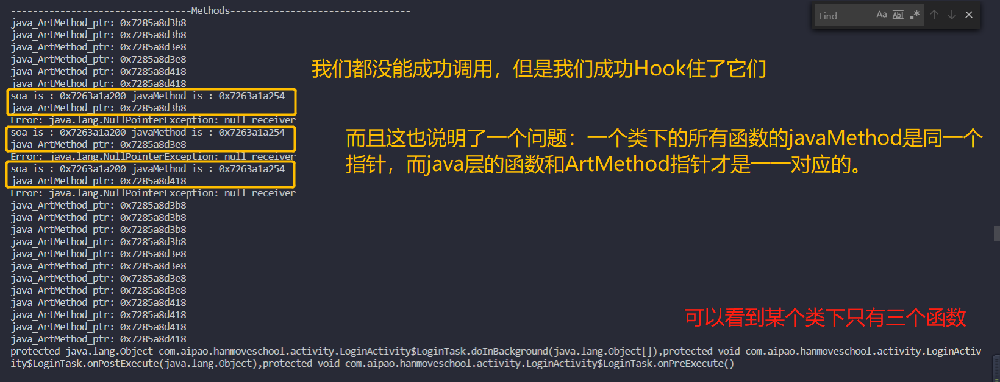**


我们都知道，ArtMethod指针和ArtMethod对象是两个不同的概念，

我们首先来通过FART的源码内容，尝试一下我们拿到的这个ArtMethod指针可否进行主动调用？

```
//主要是送给myfartInvoke
//我们来hook GetArtMethod的返回值
    if (addr_GetArtMethod) {
        Interceptor.attach(addr_GetArtMethod, {
            onEnter: function (args) {
                    //console.log("hook GetArtMethod!");
            }, onLeave: function (retval) {
                console.log("java_ArtMethod_ptr:",retval);//拿到ArtMethod指针
                
                var artmethod_ptr = retval;
                var myAutoDInvoke = new NativeFunction(addr_myfartInvoke, "void", ["pointer"]);
                myfartInvoke(artmethod_ptr);
              
            }
        });
    }
```

可以发现，已经成功使用frida调用myfartInvoke并产生了对应的bin文件

**因此我们的这个ArtMethod指针是正确的！**

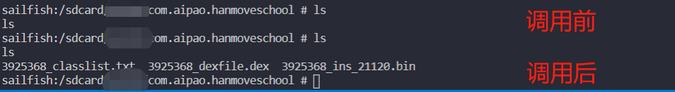

当时偷了个懒，在这里替换成源码中的dumpArtMethod发现也是可以的

```
 //我们来hook GetArtMethod的返回值
            if (addr_GetArtMethod) {
                Interceptor.attach(addr_GetArtMethod, {
                    onEnter: function (args) {
                            //console.log("hook GetArtMethod!");
                    }, onLeave: function (retval) {
                        console.log("java_ArtMethod_ptr:",retval);
         
                        var artmethod_ptr = retval;
                        if(artmethod_maps.length==0){
                            artmethod_maps[0]=ptr(artmethod_ptr);
                        }else if(artmethod_maps[file]==undefined){
                                    artmethod_maps[file]=ptr(artmethod_ptr);
                        }
                        file++;
                        var dumpArtMethod = new NativeFunction(addr_dumpArtMethod, "void", ["pointer"]);
                        console.log("dumpArtMethod_in :",dumpArtMethod );
                        //dumpArtMethod(artmethod_ptr);
                        dumpArtMethod_out(artmethod_ptr);
                    }
                });
            }
```

**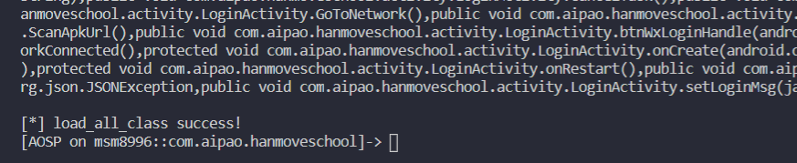**

****

虽然**没有达成要求的"纯用frida"**的条件，因此思路写在这里纪念一下**（**算是一种->**只调用FART的一个API**而达成的目标，逃**）**


**另外一种解决方法：**

**去遍历所有的类并且在Java层加载，能够修复那种执行的时候把代码填充回dex的，也就是占坑型。**

**我是用Java层写了个仿照fart的loadAllClass的流程【由于可以照抄源码，因此这里具体我就省略了】，然后把dex使用base64加密（创建dex加载前会解密），到时候使用DexClassLoader将其加载，并通过参数类型new Object了method的参数，这样一来函数就可被我们调用。【这里我可能绕弯了，不过多一种思路，不亏！】**

**Dex：**

```
  public static void loadAllClass(ClassLoader classLoader) {
        int i;
        Method[] methods;
        Constructor<?> cons[];
        Class clazz;
        try {
            Iterator Ir = EnumerateClass.getClassNameList(classLoader).iterator();
            while(true) {
                if(!Ir.hasNext()) {
                    return;
                }
                Object obj = Ir.next();
                clazz = classLoader.loadClass(((String)obj));
                methods = clazz.getDeclaredMethods();
                cons = clazz.getDeclaredConstructors();
                Log.d("Frida_UNPACK", "load class: " + clazz.getName());
                i = 0;
                while(i < methods.length){
                    Method method = methods[i];
                  Object[] objs = new Object[method.getParameterTypes().length];
                  Log.d("FRiDA_UNPACK", "try to load method: " + clazz.getName() + "-->" + method.getName());
                   method.invoke(null, objs);//其实只调用方法就好，构造函数用处不是很大
                  Log.d("FRiDA_UNPACK", "success");
                  ++i;
                }
       }catch(Throwable e){}
    }
```

然后使用base64在线工具对其Hex内容加密以备后续使用**，另外注意：我这里的loadAllClass是静态方法。**

**除开省略的base64之外的Frida完整脚本如下：**

```
var dex_maps = {};
//脱壳点是DefineClass，当然大家也可以换成别的
function hook_dex(){
    var openmemory = Module.findExportByName("libart.so", "_ZN3art11ClassLinker11DefineClassEPNS_6ThreadEPKcmNS_6HandleINS_6mirror11ClassLoaderEEERKNS_7DexFileERKNS9_8ClassDefE");
    if(openmemory != undefined) {
        console.log("DefineClass at" + openmemory);
        Interceptor.attach(openmemory, {
            onEnter: function (args) {
                var dex_file= args[5];
                var base = ptr(dex_file).add(Process.pointerSize).readPointer();
                var size = ptr(dex_file).add(Process.pointerSize + Process.pointerSize).readUInt();
     
                if (dex_maps[base] == undefined) {
                    dex_maps[base] = size;
                    console.log("hook_dex:", base, size);
                }
            },
            onLeave: function (retval) {
     
            }
        });
    }
}
 
function get_self_process_name() {
    var openPtr = Module.getExportByName('libc.so', 'open');
    var open = new NativeFunction(openPtr, 'int', ['pointer', 'int']);
 
    var readPtr = Module.getExportByName("libc.so", "read");
    var read = new NativeFunction(readPtr, "int", ["int", "pointer", "int"]);
 
    var closePtr = Module.getExportByName('libc.so', 'close');
    var close = new NativeFunction(closePtr, 'int', ['int']);
 
    var path = Memory.allocUtf8String("/proc/self/cmdline");
    var fd = open(path, 0);
    if (fd != -1) {
        var buffer = Memory.alloc(0x1000);
 
        var result = read(fd, buffer, 0x1000);
        close(fd);
        result = ptr(buffer).readCString();
        return result;
    }
 
    return "-1";
}
 
function loadClassAndDump(){
    if(Java.available) {
        Java.perform(function(){
            var dexBase64 = "(这里放置调用所有方法的dex文件的base64加密格式，篇幅问题，我就省点地方)";
            var application = Java.use("android.app.Application");
            var BaseDexClassLoader = Java.use("dalvik.system.BaseDexClassLoader");
            var Base64 = Java.use("android.util.Base64");
            var FileOutputStream = Java.use("java.io.FileOutputStream");
            var DexClassLoader = Java.use("dalvik.system.DexClassLoader");
  
            var reflectClass = Java.use("java.lang.Class");
 
            if(application != undefined) {
                 
                var Context_class = Java.use("android.content.Context");
                var currentApplication = Java.use("android.app.ActivityThread").currentApplication();
                var context = currentApplication.getApplicationContext();
                var castedContext = Java.cast(context,Context_class);
                var classloader = castedContext.getClassLoader();
                var filesDir = castedContext.getFilesDir();
                var codeCacheDir = castedContext.getCodeCacheDir();
                    if(classloader != undefined) {
                        var dexbytes = Base64.decode(dexBase64, 0);
                        var dexpath = filesDir + "/emmm.dex";
                        var fout = FileOutputStream.$new(dexpath);
                        fout.write(dexbytes, 0, dexbytes.length);
                        fout.close();
                        console.log("write dex to " + dexpath);
     
                        var dexstr = dexpath.toString();
                        var cachestr = codeCacheDir.toString();
     
                        var dyndex = DexClassLoader.$new(dexstr, cachestr, cachestr, classloader);
                        console.log(dyndex.toString());
                        var EnumerateClass = dyndex.loadClass("com.Youzi.EnumerateClass");
                        var castedEnumerateClass = Java.cast(EnumerateClass, reflectClass);
                        var methods = castedEnumerateClass.getDeclaredMethods();
                        // loadAllClass
                        var loadAllClass = undefined;
                        for(var i =0; i<methods.length;i++){
                            var method = methods[i];
                            method.setAccessible(true);
                            if(method.getName()=="loadAllClass"){
                                loadAllClass = method;
                            }
                        }
                                                //找到loadAllClass方法
                        if(loadAllClass != undefined) {
                            console.log("loadAllClass: " + loadAllClass.toString());
                            var args = Java.array('Ljava.lang.Object;',[classloader]);
                            var classlist = loadAllClass.invoke(null , args);//之前说过这个函数是静态方法，因此直接调用
                            console.log("start dump dex ");
                            //开始dump
                            for(var base in dex_maps) {
                                var size = dex_maps[base];
                                var magic = ptr(base).readCString();
                                if(magic.indexOf("dex") == 0) {
                                    var process_name = get_self_process_name();
                                    if (process_name != "-1") {
                                         var dex_path = "/data/data/" + process_name + "/files/" + base.toString(16) + "_" + size.toString(16) + ".dex";
                                         console.log("[find dex]:", dex_path);
                                         var fd = new File(dex_path, "wb");
                                         if (fd && fd != null) {
                                            var dex_buffer = ptr(base).readByteArray(size);
                                                 fd.write(dex_buffer);
                                                 fd.flush();
                                                 fd.close();
 
                                        }
                                    }
                                    console.log("write file to " + dex_path);
                                }
                            }
                        }
                    } else {
                        console.error("unable get classloader");
                    }
               }
        });
    }
}
function main() {
    hook_dex();
}
 
setImmediate(main);
```

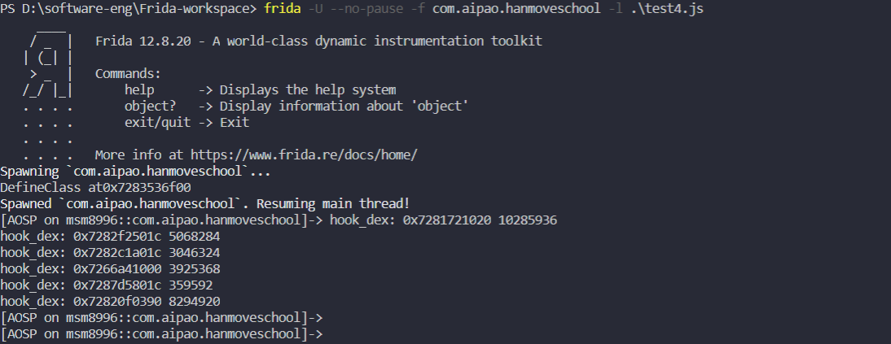

开始调用loadClassAndDump()，这个函数是开始主动调用+dump


**一系列已经修复好的dex生成，不需要另外使用修复脚本（算个小优点吧2333）。**

**
**

可以看见，面对**占坑型抽取**还是可以完美解决的(**偏移型则**需要使用**C++指针辅助**，**这是Java的软肋)**。

总结起来就是使用了dex来辅助（这一步其实可以写进Frida里头，但是我想介绍动态加载dex这种思路供大家学习），但是**整体均在Frida环境中完成【基本上是纯Java和JavaScript环境】**，没有跨平台，符合开篇要求。

****

**最后，Thank you for using Frida!** 


分析样本：阳光体育

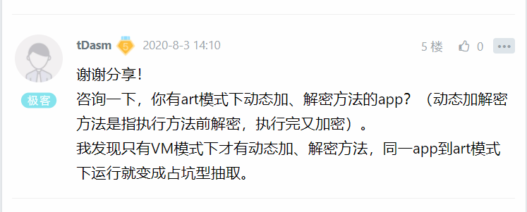


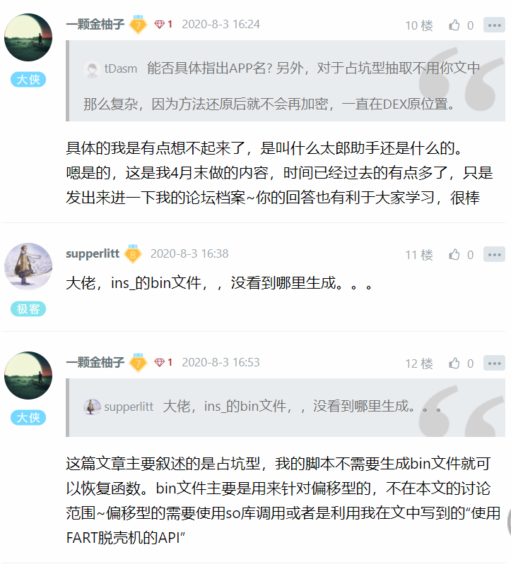

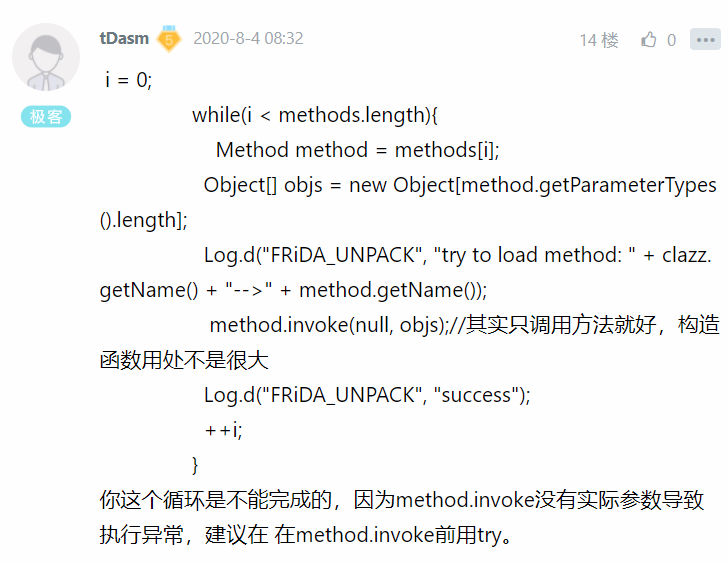

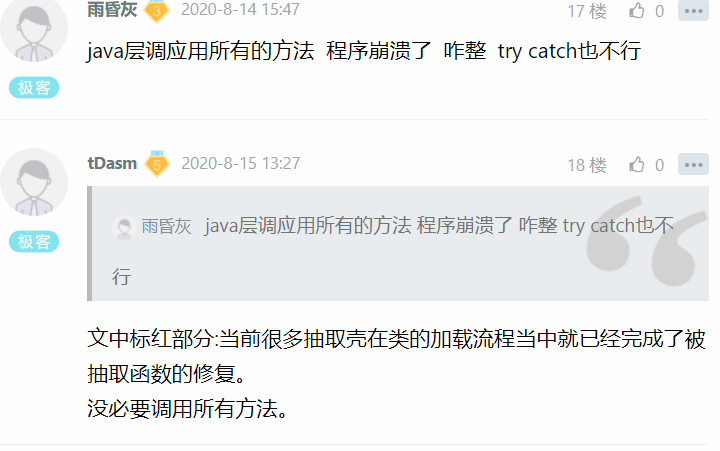