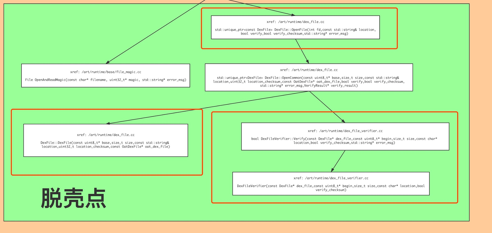
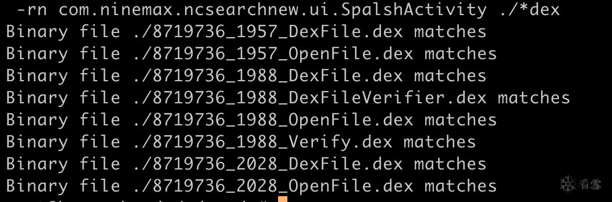

# 某类抽取加固APP的脱壳与修复

url：https://bbs.pediy.com/thread-258510.htm

写在前面
APP来自看雪安卓2w班3月份题目，题目主要关键点在于dex的dump和恢复，但是实际上由于这个APP的壳保护较弱，实际上如果脱壳点时机稍微晚一点，就可以完全dump下来，也不需要修复。不过为了应对其他无法完整dump下来的APP，解题时还是采用了较为一般的方法。

## 描述

使用至少两种方法完成对dex的dump和修复

## 解题过程

### 脱壳

选取脱壳点

这里选取我之前总结的[调用图](https://bbs.pediy.com/thread-258243.htm)中的`DexFileVerifier::Verify`和`DexFileVerifier`以及`OpenFile`函数与`DexFile::DexFile`函数作为脱壳点，
在函数中插入以下dump dex的代码

```
char dexfilepath[100]={0};
int pid=getpid();
sprintf(dexfilepath,"/sdcard/%d_%d_OpenFile.dex",(int)(size),pid);
//fopen
int fd=open(dexfilepath,O_CREAT|O_RDWR,0666);
if(fd>0)
{
    write(fd,base,size);
    close(fd);
}
```

- 编译源码,刷机，
  刷机成功后，安装并给予应用存储权限，然后运行app，并在sdcard目录下使用`grep`命令过滤dex，最终得到脱壳后的文件如下

  

### 修复

dump下来之后就是修复，使用FART确认是否有抽取的dex，

### 修复方式1:

上`fart.py`,然后一一分析想要分析的方法
最终修复效果


### 修复方式2:

我自己写了一个脚本，关键代码如下

```
# -*- coding: utf-8 -*-
 
def delblankline():
    global insfilename
    infopen = open(insfilename, 'r',encoding="utf-8")
    outfopen = open(insfilename + '_out', 'w',encoding="utf-8")
    db = infopen.read()
    outfopen.write(db.replace(';','\n'))
    outfopen.close()
    infopen.close()
    f.close()
 
def read_one_line(line):
    #print(line)
    frags = line.split(',')
    if len(frags) == 5:
        _name = frags[0].split(':')[1]
        _method_idx = int(frags[1].split(':')[1])
        _offset =  int(frags[2].split(':')[1])
        _code_item_len = int(frags[3].split(':')[1])
        _ins = frags[4].split(':')[1].replace("}\n", "")
        return _name,_method_idx,_offset,_code_item_len,_ins
    else:
        return '',-1,-1,-1,''  
    #print(dex.base64_decode())
    #data = json.loads(line,encoding = 'utf-8')
    #print(data)
 
class dex_method:
    name = ''
    method_idx = 0
    offset = 0
    code_item_len = 0
    ins_raw = ''
    ins = b''
    def __init__(self,_name,_method_idx,_offset,_code_item_len,_ins):
        self.ins_raw = _ins
        self.name,self.method_idx,self.offset,self.code_item_len,self.ins = _name,_method_idx,_offset,_code_item_len,base64.b64decode(_ins)
        #print(_name,_method_idx,_offset,_code_item_len,self.ins_raw)
 
    def repair_dex(self,fd):
        if self.offset > 0:
            fd.seek(self.offset, 0)
            if len(self.ins) == self.code_item_len:
                #print('reapir method = ',self.name,'repair code = ',self.ins_raw)
                fd.write(self.ins) 
 
def main():
    init()
    global filename
    global insfilename
    global method_name
    global all_methods
    delblankline()
    dex_file = open(filename,'rb+')        
    #bin_file =
    if all_methods:
        with open(insfilename + '_out',encoding='utf-8') as f:
            for line in f:
                _name,_method_idx,_offset,_code_item_len,_ins = read_one_line(line)
                method = dex_method(_name, _method_idx, _offset, _code_item_len, _ins)
                method.repair_dex(dex_file)
    else:
        found = False
        with open(insfilename + '_out',encoding='utf-8') as f:
            for line in f:
                _name,_method_idx,_offset,_code_item_len,_ins = read_one_line(line)
                if method_name in _name:
                    found = True
                    method = dex_method(_name, _method_idx, _offset, _code_item_len, _ins)
                    print('find method = ' + method.name)
                    method.repair_dex(dex_file)
                else:
                    pass
        if found == False:
            print('don\'t find method = ',method_name)     
                #break
 
 
if __name__ == '__main__':
    main()
```

这个脚本是实现的抽取壳中空间不变的情况，使用方法和完整代码见[here](https://github.com/Simp1er/FartRepair)，程序个人完成，如果有bug,欢迎指摘。最终修复效果如下：


 

与@hanbingle师傅的修复脚本修复后的一致。

 

最后，题目见附件