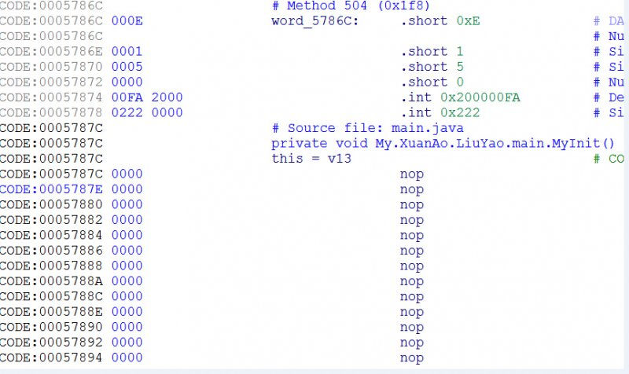

# APK加固之类抽取分析与修复

url：https://bbs.pediy.com/thread-203615.htm

测试环境与工具
手机系统: 华为U9508 android 4.2.2
IDA Pro 6.8
AndroidKiller 1.2

高手不要见笑，仅供小菜玩乐,有不对或不足的地方还请多多指教，不胜感激! 
**0x00    简单介绍**
    目前我己知的APK加固主要有以下两种方式（或有其它的方式有待发现）
隐藏dex文件：通过对目标DEX文件进行整体加密或压缩方式把整个dex转换为另外一个文件存放在assets文件夹中或者其它地方，然后利用类加载器技术进行内存解密并加载运行。
修改dex结构：抽取DexCode中的字节码指令后用零去填充，或者修改方法属性等操作，运行时在内存中做修正、修复等处理工作。
**0x01    APK加固前后对比**
    整体来看一下原始APK包和加固后的APK包结构相关变化


      图1
图1所示加固后的APK包变化如下:
新增2个文件夹：
assets文件夹中增加3个文件
data
dx
pk
lib文件夹中增加了2个so文件
libedog.so
libfdog.so
被修改的文件:
AndroidManifest.xml
classes.dex
**0x02    壳流程分析**
    我们用AndroidKiller反编译加固后的APK, 反编译出错，错误日志如下:

      图2
从图2可以看出反编译时出现了很多错误，我们用IDA对DEX进行反编译查看代码，发现方法指令都被零填充了，反编译后代码显示为nop样式，如图3所示。

      图3
我们再来看看APK中的AndroidManifest.xml文件被修改了什么地方？

      图4
从图4看到AndroidManifest.xml中的application新增了如下项做为壳的入口android:name="com.edog.AppWrapper"该类为壳的入口，继续分析AppWrapper都做了些什么？

      图5

      图6

      图7
从图5-7可以看出最终会调用到libedog.so中的dl函数，下面就开始动态调试分析该so的功能流程（如何动态调试就不说了，网上己经有很多的教程了）。
通过动态分析libedog.so中的dl函数主要功能是: 获得系统版本号->验证加固前后的签名是否一致->反调试->将抽走的指令映射到内存中还原指令时用到->HOOK函数dvmResolveClass->结束。
代码流程如下：

```
libedog.so:5D692C18             Java_com_edog_ELibrary_d1
libedog.so:5D692C18
libedog.so:5D692C18             var_F0= -0xF0
libedog.so:5D692C18             var_EC= -0xEC
libedog.so:5D692C18             var_E4= -0xE4
libedog.so:5D692C18             var_1C= -0x1C
libedog.so:5D692C18             arg_0=  0
libedog.so:5D692C18
libedog.so:5D692C18 F0 B5       PUSH            {R4-R7,LR}
libedog.so:5D692C1A 28 4F       LDR             R7, =(dword_5D6A5E60 - 0x5D692C24)
libedog.so:5D692C1C B7 B0       SUB             SP, SP, #0xDC
libedog.so:5D692C1E 00 93       STR             R3, [SP,#0xF0+var_F0]
libedog.so:5D692C20 7F 44       ADD             R7, PC ; dword_5D6A5E60
libedog.so:5D692C22 3F 68       LDR             R7, [R7]
libedog.so:5D692C24 3C 99       LDR             R1, [SP,#0xF0+arg_0]
libedog.so:5D692C26 04 1C       MOVS            R4, R0
libedog.so:5D692C28 3B 68       LDR             R3, [R7]
libedog.so:5D692C2A 01 91       STR             R1, [SP,#0xF0+var_EC]
libedog.so:5D692C2C A9 21       MOVS            R1, #0xA9
libedog.so:5D692C2E 35 93       STR             R3, [SP,#0xF0+var_1C]
libedog.so:5D692C30 03 68       LDR             R3, [R0]
libedog.so:5D692C32 89 00       LSLS            R1, R1, #2
libedog.so:5D692C34 22 4D       LDR             R5, =(aFjFj0fjFjFj4fj - 0x5D692C42)
libedog.so:5D692C36 5B 58       LDR             R3, [R3,R1]
libedog.so:5D692C38 11 1C       MOVS            R1, R2
libedog.so:5D692C3A 00 22       MOVS            R2, #0
libedog.so:5D692C3C 98 47       BLX             R3
libedog.so:5D692C3E 7D 44       ADD             R5, PC                  ; "$fj] fj]0fj](fj],fj]4fj]i]"
libedog.so:5D692C40 2D 68       LDR             R5, [R5]                ; "$fj] fj]0fj](fj],fj]4fj]i]"
libedog.so:5D692C42 20 4E       LDR             R6, =(aFjFj0fjFjFj4fj+4 - 0x5D692C50)
libedog.so:5D692C44 28 60       STR             R0, [R5]
libedog.so:5D692C46 20 1C       MOVS            R0, R4
libedog.so:5D692C48 00 F0 5C F8 BL              _Z17ANDROID_API_LEVELP7_JNIEnv
libedog.so:5D692C4C 7E 44       ADD             R6, PC                  ; " fj]0fj](fj],fj]4fj]i]"
libedog.so:5D692C4E 36 68       LDR             R6, [R6]                ; " fj]0fj](fj],fj]4fj]i]"
libedog.so:5D692C50 30 60       STR             R0, [R6]
libedog.so:5D692C52 20 1C       MOVS            R0, R4
libedog.so:5D692C54 00 F0 82 F8 BL              _Z24ANDROID_PLATFORM_VERSIONP7_JNIEnv
libedog.so:5D692C58 20 1C       MOVS            R0, R4
libedog.so:5D692C5A 00 F0 A9 F8 BL              _Z22ANDROID_PLATFORM_MODELP7_JNIEnv
libedog.so:5D692C5E 20 1C       MOVS            R0, R4
libedog.so:5D692C60 00 F0 D0 F8 BL              _Z22ANDROID_PLATFORM_BRANDP7_JNIEnv
libedog.so:5D692C64 20 1C       MOVS            R0, R4
libedog.so:5D692C66 01 99       LDR             R1, [SP,#0xF0+var_EC]
libedog.so:5D692C68 00 F0 8A FC BL              _Z6verifyP7_JNIEnvP8_jobject ; 比较加固前后的签名是否一致
libedog.so:5D692C6C 16 49       LDR             R1, =(aDataDataSLibLi - 0x5D692C76)
libedog.so:5D692C6E 2A 68       LDR             R2, [R5]
libedog.so:5D692C70 03 A8       ADD             R0, SP, #0xF0+var_E4
libedog.so:5D692C72 79 44       ADD             R1, PC                  ; "/data/data/%s/lib/libfdog.so"
libedog.so:5D692C74 FF F7 B0 EE BLX             sprintf
libedog.so:5D692C78 03 A8       ADD             R0, SP, #0xF0+var_E4
libedog.so:5D692C7A 01 1C       MOVS            R1, R0
libedog.so:5D692C7C 00 F0 02 FD BL              _Z4antiPKcS0_           ; 反调试
libedog.so:5D692C80 00 F0 3E F9 BL              _Z10openMemoryv         ; 将抽走的指令映射到内存中来
libedog.so:5D692C80                                                     ; assets中的data文件
libedog.so:5D692C84 23 68       LDR             R3, [R4]
libedog.so:5D692C86 A9 22 92 00 MOVS            R2, #0x2A4
libedog.so:5D692C8A 9B 58       LDR             R3, [R3,R2]
libedog.so:5D692C8C 00 99       LDR             R1, [SP,#0xF0+var_F0]
libedog.so:5D692C8E 20 1C       MOVS            R0, R4
libedog.so:5D692C90 00 22       MOVS            R2, #0
libedog.so:5D692C92 98 47       BLX             R3
libedog.so:5D692C94 0D 49       LDR             R1, =(unk_5D6A2A0D - 0x5D692C9A)
libedog.so:5D692C96 79 44       ADD             R1, PC
libedog.so:5D692C98 FF F7 A4 EE BLX             strstr
libedog.so:5D692C9C 00 28       CMP             R0, #0
libedog.so:5D692C9E 02 D1       BNE             loc_5D692CA6
libedog.so:5D692CA0 33 68       LDR             R3, [R6]
libedog.so:5D692CA2 14 2B       CMP             R3, #0x14               ; 判断版本
libedog.so:5D692CA4 00 DD       BLE             loc_5D692CA8            ; 根据操作系统的版本
libedog.so:5D692CA4                                                     ; hook对应的dvmResolveClass函数
libedog.so:5D692CA6
libedog.so:5D692CA6             loc_5D692CA6                            ; CODE XREF: Java_com_edog_ELibrary_d1+86j
libedog.so:5D692CA6 01 20       MOVS            R0, #1
libedog.so:5D692CA8
libedog.so:5D692CA8             loc_5D692CA8                            ; CODE XREF: Java_com_edog_ELibrary_d1+8Cj
libedog.so:5D692CA8 00 F0 E8 FB BL              _Z7restorei             ; 根据操作系统的版本
libedog.so:5D692CA8                                                     ; hook对应的dvmResolveClass函数
libedog.so:5D692CAC 35 9A       LDR             R2, [SP,#0xF0+var_1C]
libedog.so:5D692CAE 3B 68       LDR             R3, [R7]
libedog.so:5D692CB0 9A 42       CMP             R2, R3
libedog.so:5D692CB2 01 D0       BEQ             loc_5D692CB8
libedog.so:5D692CB4 FF F7 9C EE BLX             sub_5D6929F0
libedog.so:5D692CB8             ; ---------------------------------------------------------------------------
libedog.so:5D692CB8
libedog.so:5D692CB8             loc_5D692CB8                            ; CODE XREF: Java_com_edog_ELibrary_d1+9Aj
libedog.so:5D692CB8 37 B0       ADD             SP, SP, #0xDC
libedog.so:5D692CBA F0 BD       POP             {R4-R7,PC}
libedog.so:5D692CBA             ; End of function Java_com_edog_ELibrary_d1
libedog.so:5D692CBA
libedog.so:5D692CBA             ; -------------------------------------
```

**0x03    指令还原算法分析**
原始指令还原时机就是在dvmResolveClass的hook函数中对对指令进行解密还原，以下结构的中的几个值会用到，因为被保护后的方法中的 debugInfoOff的值被修改成从0x20000000开始的一个值，该值在指令还原时起到重要作用。

```
struct DexCode {
    u2  registersSize;
    u2  insSize;
    u2  outsSize;
[COLOR="Red"]    u2  triesSize;
    u4  debugInfoOff;      /* file offset to debug info stream */
    u4  insnsSize;        /* size of the insns array, in u2 units */[/COLOR]
    u2  insns[1];
};
```

指令还原大致流程如下：
判断是否为保护的类->判断debuginfo值大于0x1FFFFFFF->将debuginfo值左移8位再右移6位->将移位后的值加上加密指令在内存中的开始址取4字节做为偏移->将偏移加上加密指令在内存中的开始地址定位到对应方法的指令->解密指令并还原->清零debuginfo值->结束。
解密指令算法流程如下：(每4字节进行xor)
XorArray函数中进行解密操作->将方法debuginfo值进行crc32计算得到一个值->crc32计算得到的值与指令每4字节进行xor->4字节结束后再将crc32值用PolyXorKey函数生成一个新的4字节数做为密钥,一直循环到解密完成。
代码流程如下

```
libedog.so:5D693144
libedog.so:5D693144             _Z13restoreMethodP11ClassObjectP6Method ; CODE XREF: _Z10replaceFunP11ClassObjectjb+22p
libedog.so:5D693144                                                     ; _Z10replaceFunP11ClassObjectjb+3Ap
libedog.so:5D693144
libedog.so:5D693144             var_34= -0x34
libedog.so:5D693144             Debug_info= -0x30
libedog.so:5D693144             var_2C= -0x2C
libedog.so:5D693144             codeSize= -0x28
libedog.so:5D693144             data= -0x24
libedog.so:5D693144             codeoffset= -0x1C
libedog.so:5D693144
libedog.so:5D693144 F0 B5       PUSH            {R4-R7,LR}
libedog.so:5D693146 89 B0       SUB             SP, SP, #0x24
libedog.so:5D693148 0F 1E       SUBS            R7, R1, #0
libedog.so:5D69314A 5C D0       BEQ             loc_5D693206
libedog.so:5D69314C 84 69       LDR             R4, [R0,#0x18]
libedog.so:5D69314E 00 2C       CMP             R4, #0
libedog.so:5D693150 59 D0       BEQ             loc_5D693206
libedog.so:5D693152 20 1C       MOVS            R0, R4
libedog.so:5D693154 4C 21       MOVS            R1, #'L'
libedog.so:5D693156 FF F7 A0 EC BLX             strchr
libedog.so:5D69315A 00 28       CMP             R0, #0
libedog.so:5D69315C 53 D0       BEQ             loc_5D693206
libedog.so:5D69315E 3E 6A       LDR             R6, [R7,#0x20]
libedog.so:5D693160 00 2E       CMP             R6, #0
libedog.so:5D693162 50 D0       BEQ             loc_5D693206
libedog.so:5D693164 35 1C       MOVS            R5, R6
libedog.so:5D693166 10 3D       SUBS            R5, #0x10
libedog.so:5D693168 AA 68       LDR             R2, [R5,#8]
libedog.so:5D69316A 02 92       STR             R2, [SP,#0x38+Debug_info]
libedog.so:5D69316C EB 88       LDRH            R3, [R5,#6]
libedog.so:5D69316E EA 68       LDR             R2, [R5,#0xC]
libedog.so:5D693170 03 93       STR             R3, [SP,#0x38+var_2C]
libedog.so:5D693172 04 92       STR             R2, [SP,#0x38+codeSize]
libedog.so:5D693174 25 4B       LDR             R3, =0x1FFFFFFF
libedog.so:5D693176 02 9A       LDR             R2, [SP,#0x38+Debug_info]
libedog.so:5D693178 9A 42       CMP             R2, R3                  ; 判断debuginfo值大于 0x1FFFFFFF (因为被保护的方法debuginfo从0X20000000开始)
libedog.so:5D69317A 44 D9       BLS             loc_5D693206
libedog.so:5D69317C 24 49       LDR             R1, =(aLandroid - 0x5D693184)
libedog.so:5D69317E 20 1C       MOVS            R0, R4
libedog.so:5D693180 79 44       ADD             R1, PC                  ; "Landroid/"
libedog.so:5D693182 FF F7 30 EC BLX             strstr                  ; 是系统的类就跳过
libedog.so:5D693186 00 28       CMP             R0, #0
libedog.so:5D693188 3D D1       BNE             loc_5D693206
libedog.so:5D69318A 36 78       LDRB            R6, [R6]
libedog.so:5D69318C 01 96       STR             R6, [SP,#0x38+var_34]
libedog.so:5D69318E 00 2E       CMP             R6, #0
libedog.so:5D693190 39 D1       BNE             loc_5D693206
libedog.so:5D693192 20 4B       LDR             R3, =(aFjFj0fjFjFj4fj+0xC - 0x5D69319C)
libedog.so:5D693194 07 A8       ADD             R0, SP, #0x38+codeoffset
libedog.so:5D693196 07 96       STR             R6, [SP,#0x38+codeoffset]
libedog.so:5D693198 7B 44       ADD             R3, PC                  ; "(fj],fj]4fj]i]"
libedog.so:5D69319A 1B 68       LDR             R3, [R3]                ; "(fj],fj]4fj]i]"
libedog.so:5D69319C 1B 68       LDR             R3, [R3]                ; data数据
libedog.so:5D69319E 05 93       STR             R3, [SP,#0x38+data]
libedog.so:5D6931A0 02 9B       LDR             R3, [SP,#0x38+Debug_info]
libedog.so:5D6931A2 05 9A       LDR             R2, [SP,#0x38+data]
libedog.so:5D6931A4 19 02       LSLS            R1, R3, #8
libedog.so:5D6931A6 89 09       LSRS            R1, R1, #6
libedog.so:5D6931A8 89 18       ADDS            R1, R1, R2
libedog.so:5D6931AA 04 22       MOVS            R2, #4
libedog.so:5D6931AC FF F7 68 EC BLX             memcpy_0
libedog.so:5D6931B0 03 9A       LDR             R2, [SP,#0x38+var_2C]
libedog.so:5D6931B2 04 9C       LDR             R4, [SP,#0x38+codeSize]
libedog.so:5D6931B4 93 00       LSLS            R3, R2, #2
libedog.so:5D6931B6 08 34       ADDS            R4, #8
libedog.so:5D6931B8 E4 18       ADDS            R4, R4, R3
libedog.so:5D6931BA 13 1C       MOVS            R3, R2
libedog.so:5D6931BC 01 33       ADDS            R3, #1
libedog.so:5D6931BE 9B 00       LSLS            R3, R3, #2
libedog.so:5D6931C0 E4 18       ADDS            R4, R4, R3
libedog.so:5D6931C2 64 00       LSLS            R4, R4, #1
libedog.so:5D6931C4 20 1C       MOVS            R0, R4
libedog.so:5D6931C6 FF F7 26 EC BLX             malloc
libedog.so:5D6931CA 22 1C       MOVS            R2, R4
libedog.so:5D6931CC 06 1C       MOVS            R6, R0
libedog.so:5D6931CE 01 99       LDR             R1, [SP,#0x38+var_34]
libedog.so:5D6931D0 FF F7 5C EC BLX             memset_0
libedog.so:5D6931D4 29 1C       MOVS            R1, R5
libedog.so:5D6931D6 22 1C       MOVS            R2, R4
libedog.so:5D6931D8 30 1C       MOVS            R0, R6
libedog.so:5D6931DA FF F7 52 EC BLX             memcpy_0
libedog.so:5D6931DE 04 9B       LDR             R3, [SP,#0x38+codeSize]
libedog.so:5D6931E0 05 9A       LDR             R2, [SP,#0x38+data]
libedog.so:5D6931E2 07 99       LDR             R1, [SP,#0x38+codeoffset]
libedog.so:5D6931E4 5D 00       LSLS            R5, R3, #1
libedog.so:5D6931E6 02 98       LDR             R0, [SP,#0x38+Debug_info]
libedog.so:5D6931E8 51 18       ADDS            R1, R2, R1
libedog.so:5D6931EA 01 23       MOVS            R3, #1
libedog.so:5D6931EC 2A 1C       MOVS            R2, R5
libedog.so:5D6931EE 01 F0 1E EF BLX             dbone_crypt_ins         ; 解密指令
libedog.so:5D6931F2 01 9B       LDR             R3, [SP,#0x38+var_34]
libedog.so:5D6931F4 34 1C       MOVS            R4, R6
libedog.so:5D6931F6 10 34       ADDS            R4, #0x10
libedog.so:5D6931F8 01 1C       MOVS            R1, R0
libedog.so:5D6931FA B3 60       STR             R3, [R6,#8]             ; 清空Debug_info
libedog.so:5D6931FC 20 1C       MOVS            R0, R4
libedog.so:5D6931FE 2A 1C       MOVS            R2, R5
libedog.so:5D693200 FF F7 3E EC BLX             memcpy_0                ; 还原指令
libedog.so:5D693204 3C 62       STR             R4, [R7,#0x20]
libedog.so:5D693206
libedog.so:5D693206             loc_5D693206                            ; CODE XREF: _Z13restoreMethodP11ClassObjectP6Method+6j
libedog.so:5D693206                                                     ; _Z13restoreMethodP11ClassObjectP6Method+Cj ...
libedog.so:5D693206 09 B0       ADD             SP, SP, #0x24
libedog.so:5D693208 F0 BD       POP             {R4-R7,PC}
libedog.so:5D693208             ; End of function _Z13restoreMethodP1
解密指令
libedog.so:5D69502C
libedog.so:5D69502C             dbone_crypt_ins                         ; CODE XREF: _Z13restoreMethodP11ClassObjectP6Method+AAp
libedog.so:5D69502C
libedog.so:5D69502C             DecMode= -0x1C
libedog.so:5D69502C             codeSize= -0x18
libedog.so:5D69502C             codedata= -0x14
libedog.so:5D69502C             key= -0x10
libedog.so:5D69502C             crckey= -8
libedog.so:5D69502C
libedog.so:5D69502C 00 48 2D E9 STMFD           SP!, {R11,LR}
libedog.so:5D695030 04 B0 8D E2 ADD             R11, SP, #4
libedog.so:5D695034 18 D0 4D E2 SUB             SP, SP, #0x18
libedog.so:5D695038 10 00 0B E5 STR             R0, [R11,#key]
libedog.so:5D69503C 14 10 0B E5 STR             R1, [R11,#codedata]
libedog.so:5D695040 18 20 0B E5 STR             R2, [R11,#codeSize]
libedog.so:5D695044 1C 30 0B E5 STR             R3, [R11,#DecMode]      ; 1
libedog.so:5D695048 10 30 4B E2 SUB             R3, R11, #-key
libedog.so:5D69504C 03 00 A0 E1 MOV             R0, R3
libedog.so:5D695050 04 10 A0 E3 MOV             R1, #4
libedog.so:5D695054 47 01 00 EB BL              _Z5crc32Phj
libedog.so:5D695058 00 30 A0 E1 MOV             R3, R0
libedog.so:5D69505C 08 30 0B E5 STR             R3, [R11,#crckey]
libedog.so:5D695060 1C 30 1B E5 LDR             R3, [R11,#DecMode]
libedog.so:5D695064 01 00 53 E3 CMP             R3, #1
libedog.so:5D695068 06 00 00 1A BNE             loc_5D695088
libedog.so:5D69506C 08 20 1B E5 LDR             R2, [R11,#crckey]
libedog.so:5D695070 18 30 1B E5 LDR             R3, [R11,#codeSize]
libedog.so:5D695074 02 00 A0 E1 MOV             R0, R2
libedog.so:5D695078 14 10 1B E5 LDR             R1, [R11,#codedata]
libedog.so:5D69507C 14 20 1B E5 LDR             R2, [R11,#codedata]
libedog.so:5D695080 80 00 00 EB BL              _Z8XorArrayjPhS_j
libedog.so:5D695084 0D 00 00 EA B               loc_5D6950C0
libedog.so:5D695088             ; ---------------------------------------------------------------------------
libedog.so:5D695088
libedog.so:5D695088             loc_5D695088                            ; CODE XREF: dbone_crypt_ins+3Cj
libedog.so:5D695088 1C 30 1B E5 LDR             R3, [R11,#DecMode]
libedog.so:5D69508C 00 00 53 E3 CMP             R3, #0
libedog.so:5D695090 06 00 00 1A BNE             loc_5D6950B0
libedog.so:5D695094 10 20 1B E5 LDR             R2, [R11,#key]
libedog.so:5D695098 18 30 1B E5 LDR             R3, [R11,#codeSize]
libedog.so:5D69509C 02 00 A0 E1 MOV             R0, R2
libedog.so:5D6950A0 14 10 1B E5 LDR             R1, [R11,#codedata]
libedog.so:5D6950A4 14 20 1B E5 LDR             R2, [R11,#codedata]
libedog.so:5D6950A8 B1 00 00 EB BL              _Z13XorArray_0x99jPhS_j
libedog.so:5D6950AC 03 00 00 EA B               loc_5D6950C0
libedog.so:5D6950B0             ; ---------------------------------------------------------------------------
libedog.so:5D6950B0
libedog.so:5D6950B0             loc_5D6950B0                            ; CODE XREF: dbone_crypt_ins+64j
libedog.so:5D6950B0 18 30 9F E5 LDR             R3, =(aUsageDbone_cry - 0x5D6950BC)
libedog.so:5D6950B4 03 30 8F E0 ADD             R3, PC, R3              ; "USAGE:dbone_crypt_ins(key,ins,ins_lenth"...
libedog.so:5D6950B8 03 00 A0 E1 MOV             R0, R3
libedog.so:5D6950BC 99 F6 FF EB BL              puts
libedog.so:5D6950C0
libedog.so:5D6950C0             loc_5D6950C0                            ; CODE XREF: dbone_crypt_ins+58j
libedog.so:5D6950C0                                                     ; dbone_crypt_ins+80j
libedog.so:5D6950C0 14 30 1B E5 LDR             R3, [R11,#codedata]
libedog.so:5D6950C4 03 00 A0 E1 MOV             R0, R3
libedog.so:5D6950C8 04 D0 4B E2 SUB             SP, R11, #4
libedog.so:5D6950CC 00 88 BD E8 LDMFD           SP!, {R11,PC}
libedog.so:5D6950CC             ; End of function dbone_crypt_ins
libedog.so:5D6950CC
libedog.so:5D6950CC             ; -------------
 
//循环解密
libedog.so:5D695288             _Z8XorArrayjPhS_j                       ; CODE XREF: dbone_crypt_file+180p
libedog.so:5D695288                                                     ; dbone_crypt_ins+54p
libedog.so:5D695288
libedog.so:5D695288             codeSize= -0x24
libedog.so:5D695288             codedata1= -0x20
libedog.so:5D695288             codedata= -0x1C
libedog.so:5D695288             crckey= -0x18
libedog.so:5D695288             crckey1= -0x14
libedog.so:5D695288             crckeyaddr= -0x10
libedog.so:5D695288             crckeyindex= -0xC
libedog.so:5D695288             index= -8
libedog.so:5D695288
libedog.so:5D695288 00 48 2D E9 STMFD           SP!, {R11,LR}
libedog.so:5D69528C 04 B0 8D E2 ADD             R11, SP, #4
libedog.so:5D695290 20 D0 4D E2 SUB             SP, SP, #0x20
libedog.so:5D695294 18 00 0B E5 STR             R0, [R11,#crckey]
libedog.so:5D695298 1C 10 0B E5 STR             R1, [R11,#codedata]
libedog.so:5D69529C 20 20 0B E5 STR             R2, [R11,#codedata1]
libedog.so:5D6952A0 24 30 0B E5 STR             R3, [R11,#codeSize]
libedog.so:5D6952A4 18 30 1B E5 LDR             R3, [R11,#crckey]
libedog.so:5D6952A8 14 30 0B E5 STR             R3, [R11,#crckey1]
libedog.so:5D6952AC 14 30 4B E2 SUB             R3, R11, #-crckey1
libedog.so:5D6952B0 10 30 0B E5 STR             R3, [R11,#crckeyaddr]
libedog.so:5D6952B4 00 30 A0 E3 MOV             R3, #0
libedog.so:5D6952B8 08 30 0B E5 STR             R3, [R11,#index]
libedog.so:5D6952BC 00 30 A0 E3 MOV             R3, #0
libedog.so:5D6952C0 0C 30 0B E5 STR             R3, [R11,#crckeyindex]
libedog.so:5D6952C4 00 30 A0 E3 MOV             R3, #0
libedog.so:5D6952C8 08 30 0B E5 STR             R3, [R11,#index]
libedog.so:5D6952CC 1E 00 00 EA B               loc_5D69534C
libedog.so:5D6952D0             ; ---------------------------------------------------------------------------
libedog.so:5D6952D0
libedog.so:5D6952D0             loc_5D6952D0                            ; CODE XREF: _Z8XorArrayjPhS_j+E0j
libedog.so:5D6952D0 08 30 1B E5 LDR             R3, [R11,#index]
libedog.so:5D6952D4 20 20 1B E5 LDR             R2, [R11,#codedata1]
libedog.so:5D6952D8 03 30 82 E0 ADD             R3, R2, R3
libedog.so:5D6952DC 08 20 1B E5 LDR             R2, [R11,#index]
libedog.so:5D6952E0 1C 10 1B E5 LDR             R1, [R11,#codedata]
libedog.so:5D6952E4 02 20 81 E0 ADD             R2, R1, R2
libedog.so:5D6952E8 00 10 D2 E5 LDRB            R1, [R2]
libedog.so:5D6952EC 0C 20 1B E5 LDR             R2, [R11,#crckeyindex]
libedog.so:5D6952F0 10 00 1B E5 LDR             R0, [R11,#crckeyaddr]
libedog.so:5D6952F4 02 20 80 E0 ADD             R2, R0, R2
libedog.so:5D6952F8 00 20 D2 E5 LDRB            R2, [R2]
libedog.so:5D6952FC 02 20 21 E0 EOR             R2, R1, R2
libedog.so:5D695300 FF 20 02 E2 AND             R2, R2, #0xFF
libedog.so:5D695304 00 20 C3 E5 STRB            R2, [R3]
libedog.so:5D695308 0C 30 1B E5 LDR             R3, [R11,#crckeyindex]
libedog.so:5D69530C 03 00 53 E3 CMP             R3, #3                  ; 比较key是否结束
libedog.so:5D695310 07 00 00 1A BNE             loc_5D695334
libedog.so:5D695314 14 30 1B E5 LDR             R3, [R11,#crckey1]
libedog.so:5D695318 03 00 A0 E1 MOV             R0, R3
libedog.so:5D69531C 6C FF FF EB BL              _Z10PolyXorKeyj
libedog.so:5D695320 00 30 A0 E1 MOV             R3, R0
libedog.so:5D695324 14 30 0B E5 STR             R3, [R11,#crckey1]
libedog.so:5D695328 00 30 A0 E3 MOV             R3, #0
libedog.so:5D69532C 0C 30 0B E5 STR             R3, [R11,#crckeyindex]
libedog.so:5D695330 02 00 00 EA B               loc_5D695340
libedog.so:5D695334             ; ---------------------------------------------------------------------------
libedog.so:5D695334
libedog.so:5D695334             loc_5D695334                            ; CODE XREF: _Z8XorArrayjPhS_j+88j
libedog.so:5D695334 0C 30 1B E5 LDR             R3, [R11,#crckeyindex]
libedog.so:5D695338 01 30 83 E2 ADD             R3, R3, #1
libedog.so:5D69533C 0C 30 0B E5 STR             R3, [R11,#crckeyindex]
libedog.so:5D695340
libedog.so:5D695340             loc_5D695340                            ; CODE XREF: _Z8XorArrayjPhS_j+A8j
libedog.so:5D695340 08 30 1B E5 LDR             R3, [R11,#index]
libedog.so:5D695344 01 30 83 E2 ADD             R3, R3, #1
libedog.so:5D695348 08 30 0B E5 STR             R3, [R11,#index]
libedog.so:5D69534C
libedog.so:5D69534C             loc_5D69534C                            ; CODE XREF: _Z8XorArrayjPhS_j+44j
libedog.so:5D69534C 24 20 1B E5 LDR             R2, [R11,#codeSize]
libedog.so:5D695350 08 30 1B E5 LDR             R3, [R11,#index]
libedog.so:5D695354 03 00 52 E1 CMP             R2, R3
libedog.so:5D695358 00 30 A0 D3 MOVLE           R3, #0
libedog.so:5D69535C 01 30 A0 C3 MOVGT           R3, #1
libedog.so:5D695360 FF 30 03 E2 AND             R3, R3, #0xFF
libedog.so:5D695364 00 00 53 E3 CMP             R3, #0
libedog.so:5D695368 D8 FF FF 1A BNE             loc_5D6952D0
libedog.so:5D69536C 04 D0 4B E2 SUB             SP, R11, #4
libedog.so:5D695370 00 88 BD E8 LDMFD           SP!, {R11,PC}
libedog.so:5D695370             ; End of function _Z8XorArrayjPhS_j
libedog.so:5D695370
libedog.so:5D695374
libedog.so:5D695374             ; =============== S U B R O U T

```

**0x04    编写修复程序**
修复程序主要分为解析dex与解密两个步骤来完成，这里只贴出部分代码详细的请看工程，代码写得比较粗操，看下思路就行了，有性趣的就慢慢撸吧！

```
void fixdexClassData()
{
 
    DexFile *dexFile = &gDexFile;
 
    char * Tag = "L";
    char * ClassTag = "Landroid/";
 
    const DexClassDef* classdef;
    u4 count = dexFile->pHeader->classDefsSize;
 
    printf("该DEX共有%d 个类\n", count);
 
    const u1* pEncodedData = NULL;
    DexClassData* pClassData = NULL;
    const char *descriptor = NULL;
 
 
    int FileSize = file_size();
 
    gCodeData = (u1*)malloc(FileSize);
    if (NULL == gCodeData)
    {
        printf("分配内存失败！\n");
        return;
    }
    memset(gCodeData, 0, FileSize);
 
    //获得加密指令数据
    GetCodeData(gCodeData, FileSize);
 
    if (NULL == gCodeData)
    {
        printf("获取加密指令数据出错！\n");
        return;
    }
 
    for(u4 i=0; i<count; i++){
        classdef = dexGetClassDef(dexFile, i);
 
        descriptor = getTpyeIdString(dexFile, classdef->classIdx);
 
        if (strstr(descriptor,Tag) == NULL)
        {
            continue;
        }
 
        //跳过一些系统的类
        if (strstr(descriptor, ClassTag) != NULL)
        {
            continue;
        }
 
        pEncodedData = dexFile->baseAddr + classdef->classDataOff;
        pClassData = dexReadAndVerifyClassData(&pEncodedData, NULL);
 
        if (pClassData == NULL) {
            continue;
        }
 
      FixdexMethodInsns(dexFile, pClassData, descriptor);
 
    }
 
}
 
void FixdexMethodInsns(DexFile *dexFile, const DexClassData*classData ,const char* className)
{
    int idx = 0;
    DexMethod *method = NULL;
    const DexMethodId* methodId = NULL;
    DexCode* code = NULL;
    const char* methodName;
    method = classData->directMethods;
    methodId = dexFile->pMethodIds;
    unsigned int CodeDataOffset = 0;
    u1 * tempCode = NULL;
    for (int i = 0; i < (int) classData->header.directMethodsSize; i++) {
        idx = classData->directMethods[i].methodIdx;
 
        methodId = dexGetMethodId(dexFile, idx);
        methodName = dexStringById(dexFile, methodId->nameIdx);
 
        DexCode* pCode = dexGetCode(dexFile, &classData->directMethods[i]);
        if (NULL == pCode)
        {
            continue;
        }
        //判断是否为保护后的方法，如果是就修复指令
        if ( (pCode->debugInfoOff > 0x1FFFFFFF) && (pCode->insns[0] == 0X00))
        {
            //求加密指令的偏移
            CodeDataOffset = pCode->debugInfoOff << 0x8;
            CodeDataOffset >>= 0x6;
            //解密指令
            tempCode = DecCode(gCodeData+CodeDataOffset, pCode->insnsSize*sizeof(u2), pCode->debugInfoOff, gCodeData);
            //修复指令
            memcpy(pCode->insns, tempCode, (pCode->insnsSize)*sizeof(u2));
            pCode->debugInfoOff = 0x00;
            printf("修复%s 类中的%s 方法成功! 大小%X\n",className, methodName,pCode->insnsSize);
            if (NULL != tempCode)
            {
                free(tempCode);
                tempCode = NULL;
            }
        }
    }
 
    for (int i = 0; i < (int) classData->header.virtualMethodsSize; i++) {
        idx = classData->virtualMethods[i].methodIdx;
 
        methodId = dexGetMethodId(dexFile, idx);
        methodName = dexStringById(dexFile, methodId->nameIdx);
 
        DexCode* pCode = dexGetCode(dexFile, &classData->virtualMethods[i]);
        if (NULL == pCode)
        {
            continue;
        }
        //判断是否为保护后的方法，如果是就修复指令
        if ( (pCode->debugInfoOff > 0x1FFFFFFF) && (pCode->insns[0] == 0X00))
        {
            //求加密指令的偏移
            CodeDataOffset = pCode->debugInfoOff << 0x8;
            CodeDataOffset >>= 0x6;
            //解密指令
            tempCode = DecCode(gCodeData+CodeDataOffset, pCode->insnsSize*sizeof(u2), pCode->debugInfoOff, gCodeData);
            //修复指令
            memcpy(pCode->insns, tempCode, (pCode->insnsSize)*sizeof(u2));
            pCode->debugInfoOff = 0x00;
            printf("修复%s 类中的%s 方法成功! 大小%X\n",className, methodName,pCode->insnsSize);
            if (NULL != tempCode)
            {
                free(tempCode);
                tempCode = NULL;
            }
        }
    }
    return;
}
unsigned int PolyXorKey(DWORD crckey)
{
    unsigned int dwKey;
    char temp;
    unsigned __int8 temp1;
    unsigned __int8 temp2;
    char *pKey;
    int temp3;
    int j;
    int i;
 
    j = 0;
    temp3 = 0;
    pKey = (char *)&dwKey;
    temp2 = 0;
    temp1 = 0;
    temp = 0;
    dwKey = crckey ^ 0xDF138530;
    i = 0;
    while ( i <= 3 )
    {
        temp2 = *pKey;
        j = 128;
        temp3 = 7;
        while ( j > 1 )
        {
            temp = (temp2 & j / 2) >> (temp3 - 1);
            temp1 = ((signed int)(unsigned __int8)(temp2 & j) >> temp3) ^ temp;
            temp1 <<= temp3;
            temp2 |= temp1;
            j /= 2;
            --temp3;
        }
        temp = temp2 & 1;
        temp1 = temp2 & 1 ^ temp2 & 1;
        *pKey = temp2;
        ++i;
        ++pKey;
    }
    return dwKey;
}
```

**0x05    测试与总结**
将加固后 APK中assets文件夹中的data文件与classes.dex放在修复程序同一个目录中，然后运行修复程序。

      图8
去掉AndroidManifest.xml中的壳入口，将修复后的classes.dex重新打包反编译，成功运行，如图9所示能正常反编译源码，至此，分析完毕。

      图9
壳流程总结:
AndroidManifest.xml中的壳入口->com.edog.AppWrapper->
so中Java_com_edog_ELibrary_d1->hook dvmResolveClass函数->在dvmResolveClass hook函数中修复指令->结束。

语言表达不行,说的很乱，自己都觉得文章没有任何逻辑可言，如果大家看完后能从中获得一些思路那也是好的, 不过这次分析让自己学到了很多，感谢APK加固作者。