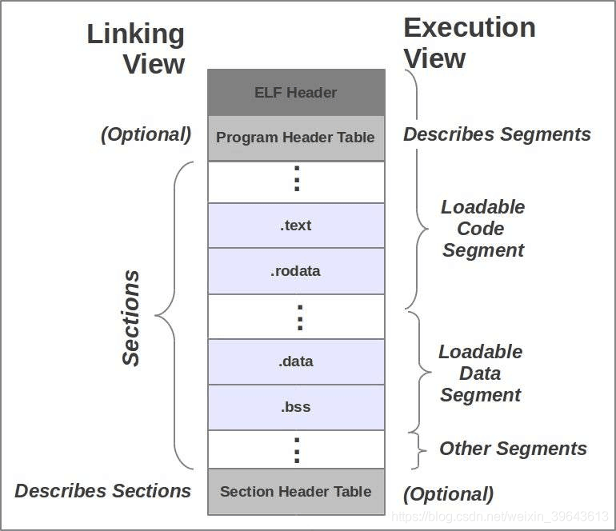

# ELF 文件格式

src:https://greagen.github.io/2020/05/21/ELF-Format/


# 一、概述
　　ELF 文件是Linux以及Unix系统下的标准二进制文件格式。ELF 文件包含可执行文件、动态链接文件、目标文件、内核引导镜像文件等1。ELF文件一般采用的后缀有:none, .axf, .bin, .elf, .o, .prx, .puff, .ko, .mod and .so。magic number 为：0x7F ‘E’ ‘L’ ‘F’。了解二进制文件结构是进行逆向工程、二进制文件分析等操作的基础和前提。
 工欲善其事必先利其器，几个分析ELF文件的工具：

•	`readelf` is a Unix binary utility that displays information about one or more ELF files. A free software implementation is provided by GNU Binutils.
•	`elfutils` provides alternative tools to GNU Binutils purely for Linux.
•	`elfdump` is a command for viewing ELF information in an ELF file, available under Solaris and FreeBSD.
•	`objdump` provides a wide range of information about ELF files and other object formats. objdump uses the [Binary File Descriptor library](https://en.wikipedia.org/wiki/Binary_File_Descriptor_library) as a back-end to structure the ELF data.
•	The Unix `file` utility can display some information about ELF files, including the instruction set architecture for which the code in a relocatable, executable, or shared object file is intended, or on which an ELF core dump was produced.
•	ftrace，ltrace，strace 跟踪二进制文件中的符号调用、函数调用等。

本文主要内容基于《Linux二进制分析》一书。

# 二、基本概念
## 1. ELF 文件类型
ELF文件可以被标记为以下几种类型：

•	`ET_NONE`: 未知类型。该标记的文件类型不确定或者还未定义。
•	`ET_REL`:　重定位文件（目标文件, xxx.o ）。可重定位文件是还未链接到可执行文件的独立代码，即编译后的 .o 文件。
•	`ET_EXEC`: 可执行文件。这类文件也成为程序，是一个进程开始的入口。
•	`ET_DYN`:　共享目标文件，即动态链接文件，.so 文件。在程序运行时被装载并链接到程序的进程镜像中。
•	`ET_CORE`: 核心文件。在程序崩溃或者进程传递了一个SIGSEGV信号（分段违规）时，会在核心文件中记录整个进程的镜像信息。可以使用GDB读取这类文件来辅助调试并查找程序崩溃的原因。

## 2. File header
文件头是ELF文件的最开头部分，从文件的 0 偏移量开始。文件头信息是除了文件头之外的剩余部分文件的一个映射。该部分主要记录了ELF文件类型，程序头个数，节个数等等。通过`readelf -h`命令查看文件头信息，样例如下所示:

```c
$ readelf -h libpng16.so.16
ELF Header:
  Magic:   7f 45 4c 46 02 01 01 00 00 00 00 00 00 00 00 00 
  Class:                             ELF64
  Data:                              2's complement, little endian
  Version:                           1 (current)
  OS/ABI:                            UNIX - System V
  ABI Version:                       0
  Type:                              DYN (Shared object file)
  Machine:                           Advanced Micro Devices X86-64
  Version:                           0x1
  Entry point address:               0x6230
  Start of program headers:          64 (bytes into file)
  Start of section headers:          253104 (bytes into file)
  Flags:                             0x0
  Size of this header:               64 (bytes)
  Size of program headers:           56 (bytes)
  Number of program headers:         10
  Size of section headers:           64 (bytes)
  Number of section headers:         28
  Section header string table index: 27
```


ELF头的源码定义以及各个字段的意义2。

简要说明如下：

```c
typedef struct {
        unsigned char   e_ident[EI_NIDENT]; // 开头取16字节数据，显示文件标志等信息。
        Elf64_Half      e_type;  // 显示第一小节中所示的文件类型
        Elf64_Half      e_machine; //CPU 架构，有一百种之多，见源码定义文档中。
        Elf64_Word      e_version;
        Elf64_Addr      e_entry; 
        Elf64_Off       e_phoff; // 程序头表偏移
        Elf64_Off       e_shoff; //节头表偏移
        Elf64_Word      e_flags;
        Elf64_Half      e_ehsize; // elf header size
        Elf64_Half      e_phentsize; //程序头实体size，程序头表中的所有实体都具有相同的size
        Elf64_Half      e_phnum; // 程序头个数
        Elf64_Half      e_shentsize; //节头实体size，节头表中所有实体均有相同size
        Elf64_Half      e_shnum; //节头个数
        Elf64_Half      e_shstrndx; //节头字符串表节索引。即.shstrtab的索引
} Elf64_Ehdr;
```

每个ELF文件包含一个文件头，后面紧接文件数据。后面的数据包括：程序头和节头等。

## 3. segment & section
段（segment）和节（section）是二进制文件内容的两个重要概念。许多人经常把二者搞混。我们首先看一下wiki上对二者的解释。

>The segments contain information that is needed for run time execution of the file, while sections contain important data for linking and relocation. Any byte in the entire file can be owned by one section at most, and orphan bytes can occur which are unowned by any section.

一个段包含零个至多个节，一个elf文件包含零个或多个段。

二者的区别也体现在接下来的程序头和节头的概念中。

>An ELF file has two views: the program header shows the segments used at run time, whereas the section header lists the set of sections of the binary.

程序头描述的是段的信息。程序头表是程序头列表，跟在 ELF 头的后面。

段提供执行层面的操作，与OS交互，其中可加载的段（loadable segments）加载到进程镜像。段告诉操作系统该段是否应该被加载到内存中，该段的可读可写属性等。节提供链接层面的信息，包含指令、符号表，重定向信息等，与链接器打交道。节告诉链接器的是跳转符号、指令原始内容等。没有节头表，程序仍然可以正常运行，因为节头表没有对程序的内存布局进行描述，对程序内存布局的描述是在程序头表中。节头对于程序的运行来说不是必须的。

也就是说，可重定位文件不存在程序头，因为.o 文件会被链接到可执行文件中，不会直接加载到内存中执行。此外，编译后的.o 文件链接后可能会增加新的节，比如.dynsym等，此类的节与动态链接和运行时重定位有关。关于节的详细介绍见下文第五章节。




## 4. Program header
程序头是对段（segment）的描述，程序头表是文件中所有段组成的程序头列表，跟在最开始的 ELF 头后面。ELF 头中的`e_phoff`定义了文件中的程序头表的偏移量。程序头的源码定义见官方文档说明3。

```c
typedef struct {
	Elf64_Word	p_type; // 程序头类型
	Elf64_Word	p_flags; //段的权限
	Elf64_Off	p_offset; //该段的偏置
	Elf64_Addr	p_vaddr; // 虚拟地址
	Elf64_Addr	p_paddr; // 物理地址
	Elf64_Xword	p_filesz; // 段大小
	Elf64_Xword	p_memsz; 
	Elf64_Xword	p_align;
} Elf64_Phdr;
```

程序头类型有十余种，详细说明见官方文档。常见的程序头类型有五种：`PT_LOAD`, `PT_DYNAMIC`, `PT_NOTE`, `PT_INTERP`, `PT_PHDR`。

样例如下：

```c
$ readelf -l libpng16.so.16

Elf file type is DYN (Shared object file)
Entry point 0x6230
There are 10 program headers, starting at offset 64

Program Headers:
  Type           Offset             VirtAddr           PhysAddr
                 FileSiz            MemSiz              Flags  Align
  LOAD           0x0000000000000000 0x0000000000000000 0x0000000000000000
                 0x0000000000004cf8 0x0000000000004cf8  R      1000
  LOAD           0x0000000000005000 0x0000000000005000 0x0000000000005000
                 0x0000000000023795 0x0000000000023795  R E    1000
  LOAD           0x0000000000029000 0x0000000000029000 0x0000000000029000
                 0x000000000000a560 0x000000000000a560  R      1000
  LOAD           0x00000000000338f0 0x00000000000348f0 0x00000000000348f0
                 0x0000000000000710 0x0000000000000718  RW     1000
  DYNAMIC        0x0000000000033908 0x0000000000034908 0x0000000000034908
                 0x0000000000000230 0x0000000000000230  RW     8
  NOTE           0x0000000000000270 0x0000000000000270 0x0000000000000270
                 0x0000000000000024 0x0000000000000024  R      4
  NOTE           0x0000000000033540 0x0000000000033540 0x0000000000033540
                 0x0000000000000020 0x0000000000000020  R      8
  GNU_EH_FRAME   0x000000000002d4b8 0x000000000002d4b8 0x000000000002d4b8
                 0x0000000000000e94 0x0000000000000e94  R      4
  GNU_STACK      0x0000000000000000 0x0000000000000000 0x0000000000000000
                 0x0000000000000000 0x0000000000000000  RW     10
  GNU_RELRO      0x00000000000338f0 0x00000000000348f0 0x00000000000348f0
                 0x0000000000000710 0x0000000000000710  R      1

 Section to Segment mapping:
  Segment Sections...
   00     .note.gnu.build-id .gnu.hash .dynsym .dynstr .gnu.version .gnu.version_d .gnu.version_r .rela.dyn .rela.plt 
   01     .init .plt .plt.sec .text .fini 
   02     .rodata .eh_frame_hdr .eh_frame .note.gnu.property 
   03     .init_array .fini_array .data.rel.ro .dynamic .got .bss 
   04     .dynamic 
   05     .note.gnu.build-id 
   06     .note.gnu.property 
   07     .eh_frame_hdr 
   08     
   09     .init_array .fini_array .data.rel.ro .dynamic .got 
```

### 4.1 PT_LOAD
一个可执行文件至少包含一个 `PT_LOAD `类型的段。这类段是可装载的段，将会被装载或映射到内存中。例如，存放程序代码的text段和存放全局变量的动态链接信息的data段会被映射到内存中，根据p_align中的值进行内存对齐。text 段（代码段）权限一般设置为`PF_X| PF_R`(读和可执行)，通常将data段的权限设置为`PF_W	PF_R`)（读和写）。千面人病毒会修改被感染的程序的text段的权限。在程序头的段标记（`p_flags`）处增加`PF_W`标记来修改text段的权限。

### 4.2 PT_DYNAMIC-动态段的Phdr
动态段是动态链接文件独有的段，包含了动态链接器所必需的一些信息。在动态段中包含了一些标记值和指针。包括但不限于以下内容：

•	运行时需要链接的共享库列表
•	全局偏移表的地址
•	重定位条目的相关信息

动态段包含`.dynamic`节，该段中有个独特的标志，`_DYNAMIC`，它包含的是以下结构的一个array4。

```c
typedef struct {
	Elf64_Sxword	d_tag;
   	union {
   		Elf64_Xword	d_val;
   		Elf64_Addr	d_ptr;
	} d_un;
} Elf64_Dyn;
extern Elf64_Dyn	_DYNAMIC[];
```

### 4.3 PT_NOTE
`PT_NOTE`类型的段可能保存了特定供应商或系统相关的信息。官方解释如下3：

>Sometimes a vendor or system builder needs to mark an object file with special information that other programs will check for conformance, compatibility, etc. Sections of type `SHT_NOTE` and program header elements of type `PT_NOTE` can be used for this purpose. The note information in sections and program header elements holds a variable amount of entries.

事实上可执行程序运行时是不需要这个段的，这个段就成了很容易被病毒感染的一个地方。感兴趣的话可以自行搜索NOTE段病毒感染的相关信息。

### 4.4 PT_INTERP
`PT_INTERP`段是对程序解释器位置的描述。

### 4.5 PT_PHDR
该段保存了程序头表的位置和大小。没少好说的，官方解释如下：

>The array element, if present, specifies the location and size of the program header table itself, both in the file and in the memory image of the program. This segment type may not occur more than once in a file. Moreover, it may occur only if the program header table is part of the memory image of the program. If it is present, it must precede any loadable segment entry. See ``Program Interpreter’’ below for more information.

### 4.6 Text 段和 Data 段
代码程序段和数据段实际上不是段的类型，只是按照段内容划分的重用概念。

代码段包含的是可读可执行的指令和只读的数据，一般包含以下一些节:

```c
.text
.rodata
.hash
.dynsym
.dynstr
.plt
.rel.got
```

数据段包含的是可读可写的数据和指令，通常包含一些一些节:

```c
.data
.dynamic
.got
.bss
```

如上所示，`PT_DYNAMIC`段也指向`.dynamic`节，而且实际上，`.plt`节不仅可以出现在text段，也可能属于数据段，这都依赖于处理器。更多信息可以查阅`Global Offset Table'and Procedure Linkage Table`

## 5. Section header
在每个段中，代码或者数据会被划分为不同的节。节头表是对所有节的位置和大小的描述，用于链接和调试。如果二进制文件中缺少节头，并不意味着节不存在，只是没有办法通过节头来引用节，对于调试器和反编译成程序来说只是可以参考的信息变少了。节头也可以被故意从节头表中删去来增加调试和逆向工程的难度。GNU的`binutils`工具，像`objdump`，`objcopy`还有`gdb`等都需要依赖节头定位到存储符号数据的节来获取符号信息。可以使用`readelf -S`查看节头信息：

```c
$ readelf -S libpng16.so.16
There are 28 section headers, starting at offset 0x3dcb0:

Section Headers:
  [Nr] Name              Type             Address           Offset
       Size              EntSize          Flags  Link  Info  Align
  [ 0]                   NULL             0000000000000000  00000000
       0000000000000000  0000000000000000           0     0     0
  [ 1] .note.gnu.build-i NOTE             0000000000000270  00000270
       0000000000000024  0000000000000000   A       0     0     4
  [ 2] .gnu.hash         GNU_HASH         0000000000000298  00000298
       0000000000000800  0000000000000000   A       3     0     8
  [ 3] .dynsym           DYNSYM           0000000000000a98  00000a98
       0000000000001b60  0000000000000018   A       4     1     8
  [ 4] .dynstr           STRTAB           00000000000025f8  000025f8
       0000000000001564  0000000000000000   A       0     0     1
  [ 5] .gnu.version      VERSYM           0000000000003b5c  00003b5c
       0000000000000248  0000000000000002   A       3     0     2
  [ 6] .gnu.version_d    VERDEF           0000000000003da8  00003da8
       0000000000000038  0000000000000000   A       4     2     8
  [ 7] .gnu.version_r    VERNEED          0000000000003de0  00003de0
       00000000000000c0  0000000000000000   A       4     3     8
  [ 8] .rela.dyn         RELA             0000000000003ea0  00003ea0
       00000000000000d8  0000000000000018   A       3     0     8
  [ 9] .rela.plt         RELA             0000000000003f78  00003f78
       0000000000000d80  0000000000000018  AI       3    23     8
  [10] .init             PROGBITS         0000000000005000  00005000
       000000000000001b  0000000000000000  AX       0     0     4
  [11] .plt              PROGBITS         0000000000005020  00005020
       0000000000000910  0000000000000010  AX       0     0     16
  [12] .plt.sec          PROGBITS         0000000000005930  00005930
       0000000000000900  0000000000000010  AX       0     0     16
  [13] .text             PROGBITS         0000000000006230  00006230
       0000000000022555  0000000000000000  AX       0     0     16
  [14] .fini             PROGBITS         0000000000028788  00028788
       000000000000000d  0000000000000000  AX       0     0     4
  [15] .rodata           PROGBITS         0000000000029000  00029000
       00000000000044b8  0000000000000000   A       0     0     32
  [16] .eh_frame_hdr     PROGBITS         000000000002d4b8  0002d4b8
       0000000000000e94  0000000000000000   A       0     0     4
  [17] .eh_frame         PROGBITS         000000000002e350  0002e350
       00000000000051ec  0000000000000000   A       0     0     8
  [18] .note.gnu.propert NOTE             0000000000033540  00033540
       0000000000000020  0000000000000000   A       0     0     8
  [19] .init_array       INIT_ARRAY       00000000000348f0  000338f0
       0000000000000008  0000000000000008  WA       0     0     8
  [20] .fini_array       FINI_ARRAY       00000000000348f8  000338f8
       0000000000000008  0000000000000008  WA       0     0     8
  [21] .data.rel.ro      PROGBITS         0000000000034900  00033900
       0000000000000008  0000000000000000  WA       0     0     8
  [22] .dynamic          DYNAMIC          0000000000034908  00033908
       0000000000000230  0000000000000010  WA       4     0     8
  [23] .got              PROGBITS         0000000000034b38  00033b38
       00000000000004c8  0000000000000008  WA       0     0     8
  [24] .bss              NOBITS           0000000000035000  00034000
       0000000000000008  0000000000000000  WA       0     0     1
  [25] .gnu.build.attrib NOTE             0000000000037008  00034000
       0000000000009b58  0000000000000000           0     0     4
  [26] .gnu_debuglink    PROGBITS         0000000000000000  0003db58
       0000000000000034  0000000000000000           0     0     4
  [27] .shstrtab         STRTAB           0000000000000000  0003db8c
       0000000000000122  0000000000000000           0     0     1
Key to Flags:
  W (write), A (alloc), X (execute), M (merge), S (strings), l (large)
  I (info), L (link order), G (group), T (TLS), E (exclude), x (unknown)
  O (extra OS processing required) o (OS specific), p (processor specific)
```

### 5.1 .text 节
该节保存的是代码指令。因此节的类型为`SHT_PROGBITS`。该类型官方定义为:

>`SHT_PROGBITS`The section holds information defined by the program, whose format and meaning are determined solely by the program.

### 5.2 .rodata 节
.rodata 保存了只读的数据。例如代码中的字符串。

```c
printf("Hello world\n");
```

因为.rodata节是只读的，它存在于只读段中。因此，.rodata是在text段而不是data段。该节类型同样也是 `SHT_PROGBITS`。

### 5.3 .plt 节
该节保存的是动态链接器从共享库导入的函数所必须的相关代码。因为保存的是代码，同样也存在与text段中，且节类型为`SHT_PEOGBITS`。相关详细信息可查看过程链接表（Procedure Linkage Table，PLT）。

### 5.4 .data 节
.data 节存在于data段，保存的是初始化的全局变量等数据，节类型也为`SHT_PROGBITS`。

### 5.5 .bss 节
.bss节保存的是未经初始化的全局变量数据，也是data段的一部分。占用空间不超过4字节，仅表示这个节本身的空间。程序加载时数据被初始化为0，在程序执行期间可以进行赋值。由于该节没有保存实际的数据，因此节类型为`SHT_NOBITS`。

### 5.6 .got.plt节
.got 节保存了全局偏移表。.got 节和.plt 节一起提供了对导入的共享库函数的访问入口，由动态链接器在运行时进行修改。该节与程序执行有关，因此节类型为`SHT_PROGBITS`。

### 5.7 .dynsym 节
该节保存的是动态链接相关的导入导出符号，该节保存在text段中，节类型被标记为`SHT_DYNSYM`。

### 5.8 .dynstr 节
该节保存的是动态符号字符串表，是三种字符串表之一。表中的字符串以空字符为终止符，代表了符号的名称。

三种字符串表

```c
1. .dynstr
2. .shstrtab
3. .strtab
```

### 5.9 .rel.* 节
重定位节保存了重定位相关的信息，这些信息描述了如何在链接或者运行时对ELF目标文件的某部分内容或者进程镜像进行补充或者修改，节类型为`SHT_REL`。

### 5.10 .hash节
.hash 节有时也成为.gnu.hash，保存了一个用于查找符号的哈希表。[Hash Table](https://refspecs.linuxfoundation.org/elf/gabi4+/ch5.dynamic.html#hash) 相关内容可查阅链接。

### 5.11 .symtab 节
该节包含的是一个[Symbol Table](https://refspecs.linuxfoundation.org/elf/gabi4+/ch4.symtab.html)，保存了符号信息，节类型为`SHT_SYMTAB`。

### 5.12 .strtab 节
该节包含了的是字符串，大多数是符号表的实体名，即符号字符串表，.symtab 节中的`st_name`条目引用的信息。该节类型为`SHT_STRTAB`。

### 5.13 .shstrtab 节
该节保存的是节头字符串表，表中以空字符截止的字符串为各个节的节名。ELF文件头中的节头字符串表偏移索引变量e_shstrndx即为该节的索引。

## 6. symbol - ELF符号
符号是对某种类型的变量和代码（例如全局变量和函数）的符号引用。例如，printf() 函数会在动态符号表.dynsym 中有一个指向该函数的符号条目。在大多数共享库和动态链接可执行文件中，存在两个符号表:.dynsym 和 .symtab。

.dynsym 保存了来自外部文件符号的全局符号。例如printf() 此类的库函数。.dynsym保存的符号是.symtab所保存的符号的子集。后者还保存了可执行文件本地的全局符号，例如全局变量或者是本地函数。因此.symtab保存了所有的符号，而.dynsym只保存了动态/全局符号。

.dynsym被标记为ALLOC（A），而.symtab没有标记。有A标记意味着运行时分配并装入内存。而.symtab 不是运行是必需的，因此不会被装载到内存中。.dynsym 保存的符号是运行时动态链接器所需要的唯一符号，是必需的。而.symtab符号表只是用来进行调试和链接，因此有时为了节省空间，会将.symtab 符号表从生产二进制文件中删除。

符号的源码定义中，st_name 变量指向符号表中字符串表（.dynstr 或者 .strtab）的字符串偏移。偏移位置保存的是符号的名称字符串，例如 printf。

## 6.1 st_info
st_info 定义了符号的类型和绑定属性。

### 6.1.1 符号类型
•	`STT_NOTYPE`: 符号类型未定义
•	`STT_FUNC`: 该符号与函数或者其他可执行代码关联
•	`STT_OBJECT`: 该符号与数据目标文件关联

### 6.1.2 符号绑定
•	`STB_LOCAL`: 本地符号在目标文件之外是不可见的。目标文件包含了符号的定义，例如声明一个为static的函数
•	`STB_GLOBAL`: 全局符号对于所有要合并的目标文件来说都是可见的。一个全局符号在一个文件中进行定义后，另一个文件可以对这个符号进行引用。类比源码不同 .c 文件编译为 .o 文件，各个文件之间可能存在函数调用关系，不同的 .o 目标文件链接打包在一起。
•	`STB_WEAK`: 与全局绑定类似。不过比 `STB_GLOBAL` 的优先级低。被标记为 `STB_WEAK` 的符号有可能被同名的未被标记为 `STB_WEAK `的符号覆盖。类似源码中的符号名作用域和优先级。

符号类型和符号绑定通过函数进行打包转换成 st_info 的值。

符号的存在可以大大方便调试、反编译等工作。但是符号也可以被去掉。

一个二进制文件的符号表 .symtab 可以很容易地被去掉，但是动态链接可执行文件会保留.dynsym，因此文件中会显示导入库的符号。如果一个文件通过静态编译，或者没有使用libc进行链接，然后使用strip命令清理。这个文件就不会有符号表，此时动态符号表也不存在，因为不是必需的。符号删除后，函数名会被替换成sub_xxxx的形式，增加辨识难度。

## 7. 重定位
重定位的作用是将符号定义和符号引用进行链接。可重定位文件（.o文件）包含了如何修改节内容的相关信息，进而使链接过程中能够获取所需信息。例如obj1.o中调用了函数foo()，obj2.o中定义了foo()函数，链接器将二者进行分析，获取重定位信息，然后将两个文件链接到一个可执行文件。符号的引用（obj1.o）或被解析成符号的定义（obj2.o）。

重定位前符号引用位置的地址为隐式加数（32位系统为: -sizeof(uint32_t)），根据重定位类型（例如，R_386_PC32）,采用相应的新地址计算方式（S + A - P）获得新的偏移量，新的偏移量指向函数定义，然后使用新的偏移量替换原来符号引用处的值。

## 8. 动态链接
可执行文件如果调用了其他动态链接文件中的函数，动态链接器会修改可执行文件中的**GOT**(Global Offset Table，全局偏移表)。**GOT**位于数据段（.got.plt 节）中，因为**GOT**需要是可写的。链接前，GOT中保存的跳转地址为**PLT**（.plt，过程链接表，保存相关代码，在text段）中相应条目的地址，动态链接器解析动态库中的函数地址后，根据**PLT**中的条目信息，首先跳转到相应的**GOT**条目，将该条目中原来指向**PLT**中相应调目的跳转地址改为解析的共享库函数地址。

### 8.1 动态段
动态段有一个节头，可以通过节头来引用动态段，此外还可以通过程序头来引用动态段。动态链接器需要在运行时引用动态段，但是节头不能被加载到内存中，所以动态段需要有相关的程序头。动态段保存了`ElfN_Dyn`结构体组成的数组。其中`d_tag`字段保存了类型的定义参数。以下为一些比较重要的类型值：
•	`DT_NEEDED`: 保存了该文件所需的共享库名的字符串表偏移量。
•	`DT_SYMTAB`: 动态符号表的地址，对应的节名为 .dynsym
•	`DT_HASH`: 符号散列表的地址，对应的节为 .hash (有时命名为 .gnu.hash)
•	`DT_STRTAB`: 符号字符串表的地址，对应节名为 .dynstr
•	`DT_PLTGOT`: 全局偏移表的地址

当动态库被加载到内存中时，链接器会获取库的动态段，并将符号表添加到符号表链（创建link_map条目并载入链表）中，符号表链存储了所有映射到内存的共享库的符号表。链接器构建完依赖列表后，挨个处理每个库的GOT，更新偏移地址。

# Reference
[1] [ELF Format wiki](https://en.wikipedia.org/wiki/Executable_and_Linkable_Format)

[2] [ELF File header defination in source code.](https://refspecs.linuxfoundation.org/elf/gabi4+/ch4.eheader.html)

[3] [Program Header](https://refspecs.linuxfoundation.org/elf/gabi4+/ch5.pheader.html)

[4] [PT_DYNAMIC](https://refspecs.linuxfoundation.org/elf/gabi4+/ch5.dynamic.html#dynamic_section)

[5] [Sections](https://refspecs.linuxfoundation.org/elf/gabi4+/ch4.sheader.html)