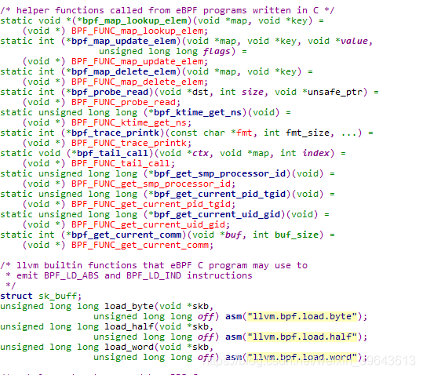

# Linux内核工程导论——网络：Filter（LSF、BPF、eBPF）

src:https://blog.csdn.net/ljy1988123/article/details/50444693?utm_medium=distribute.pc_relevant.none-task-blog-BlogCommendFromMachineLearnPai2-3.channel_param&depth_1-utm_source=distribute.pc_relevant.none-task-blog-BlogCommendFromMachineLearnPai2-3.channel_p


# 概览

LSF(Linux socket filter)起源于BPF（Berkeley Packet Filter）。基础从架构一致。但使用更简单。LSF内部的BPF最早是cBPF（classic）。后来x86平台首先切换到eBPF（extended）。但因为非常多上层应用程序仍然使用cBPF（tcpdump、iptables），而且eBPF还没有支持非常多平台，所以内核提供了从cBPF向eBPF转换的逻辑，而且eBPF在设计的时候也是沿用了非常多cBPF的指令编码。

可是在指令集合寄存器。还有架构设计上有非常大不同（比如eBPF已经能够调用C函数，而且能够跳转到另外的eBPF程序）。

可是新的eBPF一出来就被玩坏了，人们非常快发现了它在内核trace方面的意义，它能够保证绝对安全的获取内核运行信息。是内核调试和开发人员的不二选择。所以针对这个方面，比如kprobe、ktap、perf eBPF等优秀的工作逐渐产生。反而包过滤部门关注的人不够多。

tc（traffic controll）是使用eBPF的一角优秀的用户端程序，它同意不用又一次编译模块就能够动态加入删除新的流量控制算法。netfilter的xtable模块，配合xt_bpf模块。就能够实现将eBPF程序加入到hook点。来实现过滤。当然，内核中提供了从cBPF到eBPF编译的函数，所以，不论什么情况下想要使用cBPF都能够。内核会自己主动检測和编译。

# bpf主要用途
其核心原理是对用户提供了两种SOCKET选项：SO_ATTACH_FILTER和SO_ATTACH_BPF。同意用户在某个sokcet上加入一个自己定义的filter，仅仅有满足该filter指定条件的数据包才会上发到用户空间。

因为sokect有非常多种，你能够在各个维度的socket加入这样的filter。假设加入在raw socket。就能够实现基于全部IP数据包的过滤（tcpdump就是这个原理），假设你想做一个http分析工具，就能够在基于80port（或其它http监听port）的socket加入filter。另一种使用方式离线式的。使用libpcap抓包存储在本地，然后能够使用bpf代码对数据包进行离线分析，这对于实验新的规则和測试bpf程序非常有帮：SO_ATTACH_FILTER插入的是cBPF代码。SO_ATTACH_BPF插入的是eBPF代码。eBPF是对cBPF的增强，眼下用户端的tcpdump等程序还是用的cBPF版本号，其载入到内核中后会被内核自己主动的转变为eBPF。

```
echo 2 > /proc/sys/net/core/bpf_jit_enable
1
```

通过像这个写入0/1/2能够实现关闭、打开、调试日志等bpf模式。

在用户空间使用。最简单的办法是使用libpcap的引擎。因为bpf是一种汇编类型的语言，自己写难度比較高，所以libpcap提供了一些上层封装能够直接调用。然而libpcap并不能提供全部需求，比方bpf模块开发人员的測试需求，还有高端的自己定义bpf脚本的需求。这样的情况下就须要自己编写bpf代码，然后使用内核tools/net/文件夹下的工具进行编译成bpf汇编代码。再使用socket接口传入这些代码就可以。

bpf引擎在内核中实现。可是bpf程序的工作地点非常多须要额外的模块来支持。经常使用的有netfilter自带的xtable、xt_bpf 能够实如今netfilter的hook点运行bpf程序、cls_bpf和act_bpf能够实现对流量进行分类和丢弃（qos）。

内核对bpf的完整支持是从3.9開始的，作为iptables的一部分存在，默认使用的是xt_bpf，用户端的库是libxt_bpf。iptables一開始对规则的管理方式是顺序的一条条的运行。这样的运行方式难免在匹配数目多的时候带来性能瓶颈，加入了bpf支持后。灵活性大大提升。

以上全部提到的能够使用bpf的地方均指同一时候可使用eBPF和cBPF。因为内核在运行前会自己主动检查是否须要转换编码。

# 其它的BPF程序

前面说的bpf程序是用来做包过滤的，那么bpf代码仅仅能用来做包过滤吗？非也。内核的bpf支持是一种基础架构。仅仅是一种中间代码的表达方式。是向用户空间提供一个向内核注入可运行代码的公共接口。仅仅是眼下的大部分应用是使用这个接口来做包过滤。其它的如seccomp BPF能够用来实现限制用户进程可使用的系统调用，cls_bpf能够用来将流量分类，PTP dissector/classifier（干啥的还不知道）等都是使用内核的eBPF语言架构来实现各自的目的，并不一定是包过滤功能。

# 用户空间bpf支持
工具：tcpdump、tools/net、cloudfare、seccomp BPF、IO visitor、ktap

# cBPF汇编架构分析
cBPF中每一条汇编指令都是例如以下格式：

```c
struct sock_filter {    /* Filter block */
    __u16   code;   /* Actual filter code */
    __u8    jt; /* Jump true */
    __u8    jf; /* Jump false */
    __u32   k;      /* Generic multiuse field */
};
```

一个列子：op:16, jt:8, jf:8, k:32

code是真实的汇编指令，jt是指令结果为true的跳转，jf是为false的跳转，k是指令的參数，依据指令不同不同。

一个bpf程序编译后就是一个sock_filter的数组，而能够使用相似汇编的语法进行编程，然后使用内核提供的bpf_asm程序进行编译。

bpf在内核中实际上是一个虚拟机。有自己定义的虚拟寄存器组。和我们熟悉的java虚拟机的原理一致。

这个虚拟机的设计是lsf的成功的所在。cBPF有3种寄存器：

```c
  A           32位，全部载入指令的目的地址和全部指令运算结果的存储地址
  X           32位。二元指令计算A中參数的辅助寄存器（比如移位的位数。除法的除数）
  M[]         0-15共16个32位寄存器。能够自由使用
```
我们最常见的使用方法莫过于从数据包中取某个字的数据内来做推断。依照bpf的规定，我们能够使用偏移来指定数据包的不论什么位置，而非常多协议非经常常使用而且固定。比如port和ip地址等，bpf就为我们提供了一些提前定义的变量。仅仅要使用这个变量就能够直接取值到相应的数据包位置。比如：

```
  len                                   skb->len
  proto                                 skb->protocol
  type                                  skb->pkt_type
  poff                                  Payload start offset
  ifidx                                 skb->dev->ifindex
  nla                                   Netlink attribute of type X with offset A
  nlan                                  Nested Netlink attribute of type X with offset A
  mark                                  skb->mark
  queue                                 skb->queue_mapping
  hatype                                skb->dev->type
  rxhash                                skb->hash
  cpu                                   raw_smp_processor_id()
  vlan_tci                              skb_vlan_tag_get(skb)
  vlan_avail                            skb_vlan_tag_present(skb)
  vlan_tpid                             skb->vlan_proto
  rand                                  prandom_u32()
```

更可贵的是这个列表还能够由用户自己去扩展。各种bpf引擎的详细实现还会定义各自的扩展。

# eBPF汇编架构分析
因为用户能够提交cBPF的代码，首先是将用户提交来的结构体数组进行编译成eBPF代码（提交的是eBPF就不用了）。然后再将eBPF代码转变为可直接运行的二进制。cBPF这在非常多平台还在使用，这个代码就和用户空间使用的那种汇编是一样的。可是在X86架构。如今在内核态已经都切换到使用eBPF作为中间语言了。也就是说x86在用户空间使用的汇编和在内核空间使用的并不一样。

可是内核在定义eBPF的时候已经尽量的复用cBPF的编码，有的指令的编码和意义，如BPF_LD都是全然一样的。然而在还不支持eBPF的平台，cBPF则是唯一能够直接运行的代码。不须要转换为eBPF。


eBPF对每个bpf语句的表达与cBPF稍有不同，例如以下定义：

```c
struct bpf_insn {
    __u8    code;       /* opcode */
    __u8    dst_reg:4;  /* dest register */
    __u8    src_reg:4;  /* source register */
    __s16   off;        /* signed offset */
    __s32   imm;        /* signed immediate constant */
};
```
其寄存器也不同：

```
    * R0    - return value from in-kernel function, and exit value for eBPF program
    * R1 - R5   - arguments from eBPF program to in-kernel function
    * R6 - R9   - callee saved registers that in-kernel function will preserve
    * R10   - read-only frame pointer to access stack

```

为了配合更强大的功能，eBPF汇编架构使用的寄存器有所添加，上述的寄存器的存在。充分体现了函数调用的概念。而不再是载入处理的原始逻辑。有了函数调用的逻辑设置能够直接调用内核内部的函数（这是一个安全隐患。可是内部有规避机制）。不但如此，因为这样的寄存器架构与x86等CPU的真实寄存器架构非常像，实际的实现正是实行了直接的寄存器映射，也就是说这些虚拟的寄存器实际上是使用的同功能的真实的寄存器。这无疑是对效率的极大提高。而且。在64位的计算机上这些计算机将会有64位的宽度。完美的发挥硬件能力。可是眼下的64位支持还不太完好。但已经可用。


眼下的内核实现。仅仅能够在eBPF程序中调用预先定义好的内核函数，不能够调用其它的eBPF程序(可是能够通过map的支持跳转到其它eBPF程序。然后再跳回来，后面有介绍)。这看起来无关紧要。可是却是一个极大的能力。这就意味着你能够使用C语言来实现eBPF程序逻辑。eBPF仅仅须要调用这个C函数就好了。

# eBPF的数据交互：map

eBPF不可是程序，还能够訪问外部的数据，重要的是这个外部的数据能够在用户空间管理。这个k-v格式的map数据体是通过在用户空间调用bpf系统调用创建、加入、删除等操作管理的。

用户能够同一时候定义多个map，使用fd来訪问某个map。

有一个特殊种类的map。叫program arry，这个map存储的是其它eBPF程序的fd，通过这个map能够实现eBPF之间的跳转，跳转走了就不会跳转回来，最大深度是32，这样就防止了无限循环的产生（也就是能够使用这个机制实现有限循环）。更重要的是，这个map在运行时能够通过bpf系统调用动态的改变，这就提供了强大的动态编程能力。比方能够实现一个大型过程函数的中间某个过程的改变。实际上一共同拥有3种map：

```c
BPF_MAP_TYPE_HASH, //hash类型
BPF_MAP_TYPE_ARRAY,  //数组类型
BPF_MAP_TYPE_PROG_ARRAY,  //程序表类型
```

# eBPF的直接编程方法

除了在用户空间通过nettable和tcpdump来使用bpf，在内核中或者在其它通用的编程中能够直接使用C写eBPF代码。可是须要LLVM支持，[样例](https://github.com/torvalds/linux/tree/master/samples/bpf)。


在用户空间通过使用bpf系统调用的BPF_PROG_LOAD方法。就能够发送eBPF的代码进内核，如此发送的代码不须要再做转换，因为其本身就是eBPF格式的。假设要在内核空间模块使用eBPF，能够直接使用相应的函数接口插入eBPF程序到sk_buff，提供强大的过滤能力。


Linux提供的系统调用bpf，用于操作eBPF相关的内核部分：

```c
#include <linux/bpf.h>
int bpf(int cmd, union bpf_attr *attr, unsigned int size);

```

[bpf man page](http://www.man7.org/linux/man-pages/man2/bpf.2.html)

这个函数的第一个參数cmd就是内核支持的操作种类。包含BPF_MAP_CREATE、BPF_MAP_LOOKUP_ELEM、BPF_MAP_UPDATE_ELEM、BPF_MAP_DELETE_ELEM、BPF_MAP_GET_NEXT_KEY、BPF_PROG_LOAD 6种。然而，从名字上就能够发现，有5种是用来操作map的。这个map前面说过。是用户程序和内核eBPF程序通信的唯一方式。这5个调用类型都是给用户空间的程序使用的。最后一个BPF_PROG_LOAD 方法用来向内核中载入eBPF代码体。

第二个參数attr则是cmd參数的详细參数了，依据cmd的不同而不同，假设load的话还包含了完整的eBPF程序。

值得注意的是。每个map和eBPF都是一个文件。都有相应的fd，这个fd在用户空间看来与其它fd无异。能够释放能够通过unix domain socket在进程间传递。假设定义一个raw类型的socket。在其上附上eBPF程序过滤程序。其甚至就能够直接充当iptable的规则使用。

# 内核中与bpf相关的内核模块子系统

act_bpf
cls_bpf
IO visitor:这可能是基于eBPF相关的最大型的系统了。由多个厂商參与。
xtable、xt_bpf

# bpf用于内核TRACING
我们知道eBPF有map数据结构，有程序运行能力。那么这就是完美的跟踪框架。比方通过kprobe将一个eBPF程序插入IO代码，监控IO次数。然后通过map向用户空间汇报详细的值。用户端仅仅须要每次使用bpf系统调用查看这个map就能够得到想要统计的内容了。那么为何要用eBPF，而不是直接使用kprobe的c代码本身呢？这就是eBPF的安全性。其机制设计使其永远不会crash掉内核。不会与正常的内核逻辑发生交叉影响。

能够说，通过工具选择避免了可能发生的非常多问题。

更可贵的是eBPF是原生的支持tracepoint，这就为kprobe不稳定的情况提供了可用性。

# 业界对eBPF的tracing使用
[Brendan Gregg’s Blog](http://www.brendangregg.com/blog/2015-05-15/ebpf-one-small-step.html) 描写叙述了一个使用eBPF进行kprobe測试的样例。
[ktap](http://ktap.org/)创造性的使用eBPF机制实现了内核模块的脚本化，使用ktap，你能够直接使用脚本编程。无须要编译内核模块，就能够实现内核代码的追踪和插入。这背后就是eBPF和内核的tracing子系统。

bpf subcommand to perf：华为也在为bpf加入perf脚本的支持能力。

能够看出来，eBPF起源于包过滤，可是眼下在trace市场得到越来越广泛的应用。

# 意义和总结
也就是说眼下使用传统的bpf语法和寄存器在用户空间写bpf代码。代码在内核中会被编译成eBPF代码，然后编译为二进制运行。传统的bpf语法和寄存器简单，更面向业务，相似于高层次的编程语言，而内核的eBPF语法和寄存器复杂。相似于真实的汇编代码。

那么为何内核要大费周章的实现如此一个引擎呢？因为轻量级、安全性和可移植性。

因为是中间代码，可移植性不必说，可是使用内核模块调用内核的函数接口一般也是可移植的。所以这个并非非常重要的理由。eBPF代码在运行的过程中被严格的限制了禁止循环和安全审查，使得eBPF被严格的定位于提供过程式的运行语句块，甚至连函数都算不上，最大不超过4096个指令。所以这就是其定位：轻量级、安全、不循环。

上面说了几个bpf的用途。但远不至于此。

<http://www.tcpdump.org/papers/bpf-usenix93.pdf>

<http://lwn.net/Articles/498231/>

<https://www.kernel.org/doc/Documentation/networking/filter.txt>