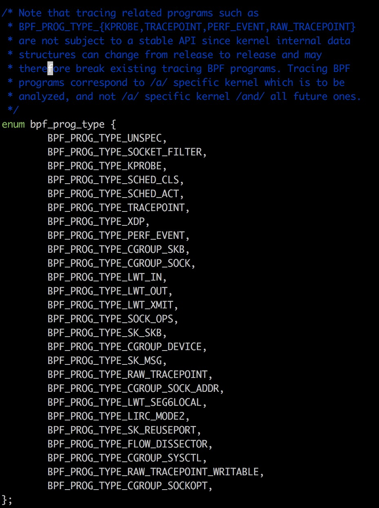
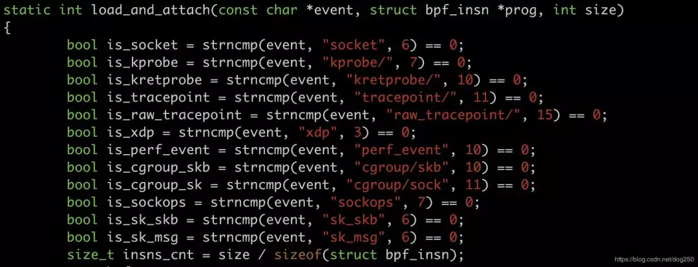
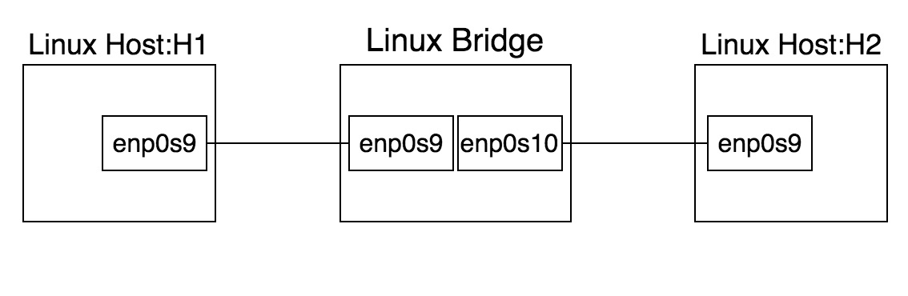

# 实现一个基于的学习型网桥

eBPF技术风靡当下，eBPF字节码正以星火燎原之势被HOOK在Linux内核中越来越多的位置，在这些HOOK点上，我们可以像编写普通应用程序一样编写内核的HOOK程序，与以往为了实现一个功能动辄patch一整套逻辑框架代码(比如Netfilter)相比，eBPF的工作方式非常灵活。

我们先来看一下目前eBPF的一些重要HOOK点：





将来这个is_XXX序列肯定会不断增加，布满整个内核（有点密集恐惧症症状了...）。

> eBPF可以实现大部分内核数据的采集功能，但这些没意思。有点意思的是eBPF还可以完成内核路径的HOOK，换句话说，eBPF可以向内核注入一段代码，至于这段代码可以干什么，随他去吧！

本文将描述如何用eBPF实现一个学习型网桥的快速转发，并将其部署在XDP。

在开始之前，为了让所有人都能看懂本文，我们先来回顾一些前置知识，如果暂时还不懂这些前置知识，没关系，先把程序run起来是一个很好的起点，如果到时候你觉得没意思，再放弃也不迟。


# 1. 前置知识

## 1.1. 什么是BPF和eBPF

简单来讲，BPF是一套完整的 **计算机体系结构** 。和x86，ARM这些类似，BPF包含自己的指令集和运行时逻辑，同理，就像在x86平台编程，最终要落实到x86汇编指令一样，BPF字节码也可以看成是汇编指令的序列。我们通过tcpdump的-d/-dd参数可见一斑：

```
[root@localhost ~]# tcpdump -i any tcp and host 1.1.1.1 -d
(000) ldh      [14]
(001) jeq      #0x86dd          jt 10    jf 2
(002) jeq      #0x800           jt 3    jf 10
(003) ldb      [25]
(004) jeq      #0x6             jt 5    jf 10
(005) ld       [28]
(006) jeq      #0x1010101       jt 9    jf 7
(007) ld       [32]
(008) jeq      #0x1010101       jt 9    jf 10
(009) ret      #262144
(010) ret      #0
[root@localhost ~]#
```

BPF的历史非常古老，早在1992年就被构建出来了，其背后的思想是， ***“与其把数据包复制到用户空间执行用户态程序过滤，不如把过滤程序灌进内核去。”***

遗憾的是，BPF后来并没有大行其道，其应用仅仅被局限在非常有限的且并不起眼的比如抓包领域。因此，由于它的语法并不复杂，人们直接手写BPF汇编指令码经简单封装即可生成最终的字节码。

手写BPF指令码，然后加载，这是一件简单的事情，它无法形成一股洪流把所有人卷入其中。

当人们认识到BPF非常强壮的功能并欲将其大用时，指令系统以及操作系统内核均已经持续进化了好多年，这意味着简单的BPF不能再满足需要，它需要 ***“被复杂化”*** 。

于是就出现了eBPF，即extended BPF。总体而言，eBPF相比BPF有了以下改进：

1. 更复杂的指令系统。
2. 更多可调用的函数。
3. …

详情可参见下面的链接：
https://lwn.net/Articles/740157/

就像汇编语言进化到C语言一样，直接手写eBPF字节码除了炫技之外显得即笨拙又低效，手写eBPF指令显得一无是处，被经理嘲笑，于是人们重走了老路，人们开始使用C语言直接编写eBPF程序，然后用编译技术将其编译成eBPF字节码。

遗憾的是，目前eBPF体系结构还不被gcc支持，不过很快就会支持了：
https://lwn.net/Articles/796317/

当下，我们不得不使用 ***特定的编译器*** 来编译eBPF的C代码，比如clang。

## 1.2. 什么是XDP

XDP，即eXpress Data Path，它其实是位于网卡驱动程序里的一个快速处理数据包的HOOK点，为什么快？基于以下两点：

1. 数据包处理位置非常底层，避开了很多内核skb处理开销。
2. 可以将很多处理逻辑Offload到网卡硬件。

显而易见，在XDP这个HOOK点灌进来一点eBPF字节码，将是一件令人愉快的事情。

## 1.3. 学习型网桥

Linux的Bridge模块就是一个学习型网桥，其实就是一个现代交换式以太网交换机，它可以从端口学习到MAC地址，在内部生成MAC/端口映射表，以优化转发效率。

本文我们将用eBPF实现的网桥就是一个学习型网桥，并且它的数据路径和控制路径相分离，用eBPF字节码实现的正是其数据路径，它将被灌入XDP，而控制路径则由一个用户态程序实现。

## 1.4. 如何编译eBPF程序

理论的学习自在平时（比如厕上，床上，车上），但当一个程序员打开电脑的时候，最快的速度run起来一些东西才是令人愉悦的，否则干嘛不用手机。

我们谁都不想花大量的时间在环境的搭建上。对于eBPF程序，内核源码树的samples/bpf目录将是一个非常好的起点。

以我自己的实验环境为例，我使用的是Ubuntu 19.10发行版，5.3.0-19-generic内核，安装源码后，编译之，最后编译samples/bpf即可：


```
root@zhaoya-VirtualBox:/usr/src/linux-source-5.3.0/linux-source-5.3.0/samples/bpf# make
make -C ../../ /usr/src/linux-source-5.3.0/linux-source-5.3.0/samples/bpf/ BPF_SAMPLES_PATH=/usr/src/linux-source-5.3.0/linux-source-5.3.0/samples/bpf
make[1]: Entering directory '/usr/src/linux-source-5.3.0/linux-source-5.3.0'
	CALL    scripts/checksyscalls.sh  
	CALL    scripts/atomic/check-atomics.sh  
	DESCEND  objtool  
	...
```

samples/bpf目录下的代码都是比较典型的范例，我们照猫画虎就能实现我们想要的功能。

大体上，每一个范例均由两个部分组成：

1. XXX_kern.c文件：eBPF字节码本身。
2. XXX_user.c文件：用户态控制程序，控制eBPF字节码的注入，更新。

即然我们要实现一个网桥，那么文件名我们可以确定为：

1. xdpbridgekern.c
2. xdpbridgeuser.c

同时我们修改Makefile文件，加入这两个文件的相关编译描述即可：

```
root@zhaoya-VirtualBox: samples/bpf# cat Makefile
...hostprogs-y += xdp2
hostprogs-y += xdp_bridge
hostprogs-y += xdp_router_ipv4
...
xdp_bridge-objs := xdp_bridge_user.o
xdp_router_ipv4-objs := xdp_router_ipv4_user.o
...
always += xdp2_kern.o
always += xdp_bridge_kern.o
always += xdp_router_ipv4_kern.o
```

环境具备，只差代码。

# 2. 网桥XDP快速转发的实现

对上述前置知识有了充分的理解之后，代码就非常简单了，我们剩下的工作就是填充xdpbridgekern.c和xdpbridgeuser.c两个C文件，然后make它们。

我们先来看xdpbridgekern.c文件：

```C
// xdp_bridge_kern.c
#include <uapi/linux/bpf.h>
#include <linux/if_ether.h>
#include "bpf_helpers.h"

// mac_port_map保存该交换机的MAC/端口映射
struct bpf_map_def SEC("maps") mac_port_map = {
	.type = BPF_MAP_TYPE_HASH,    
	.key_size = sizeof(long),    
	.value_size = sizeof(int),    
	.max_entries = 100,
};

// 以下函数是网桥转发路径的eBPF主函数实现
SEC("xdp_br")
int xdp_bridge_prog(struct xdp_md *ctx)
{    
	void *data_end = (void *)(long)ctx->data_end;
    void *data = (void *)(long)ctx->data;    
    long dst_mac = 0;    
    int in_index = ctx->ingress_ifindex, *out_index;    
    // data即数据包开始位置    
    struct ethhdr *eth = (struct ethhdr *)data;    
    char info_fmt[] = "Destination Address: %lx   Redirect to:[%d]   From:[%d]\n";
    
    // 畸形包必须丢弃，否则无法通过内核的eBPF字节码合法性检查    
    if (data + sizeof(struct ethhdr) > data_end) {
    	return XDP_DROP;    
    }
    
    // 获取目标MAC地址    
    __builtin_memcpy(&dst_mac, eth->h_dest, 6);
    
    // 在MAC/端口映射表里查找对应该MAC的端口    
    out_index = bpf_map_lookup_elem(&mac_port_map, &dst_mac);    
    if (out_index == NULL) {         
    	// 如若找不到，则上传到慢速路径，必要时由控制路径更新MAC/端口表项。        
    	return XDP_PASS;    
    }
    
    // 非Hairpin下生效    
    if (in_index == *out_index) { // Hairpin ?        
    	return XDP_DROP;    
    }
    
    // 简单打印些调试信息    
    bpf_trace_printk(info_fmt, sizeof(info_fmt), dst_mac, *out_index, in_index);
    
    // 转发到出端口    
    return  bpf_redirect(*out_index, 0);
}
char _license[] SEC("license") = "GPL";
```

这里有必要说一下内核对eBPF程序的合法性检查，这个检查一点都不多余，它确保你的eBPF代码是安全的。这样才不会造成内核数据结构被破坏掉，否则，如果任意eBPF程序都能注入内核，那结局显然是细思极恐的一场悲剧，我们不能犯形而上学的错误。

现在继续我们的用户态C代码：


```c
// xdp_bridge_user.c

#include <stdio.h>
#include <signal.h>
#include <sys/socket.h>
#include <net/if.h>
#include <bpf/bpf.h>
#include <linux/bpf.h>
#include <linux/rtnetlink.h>
#include "bpf_util.h"

int flags = XDP_FLAGS_UPDATE_IF_NOEXIST;
static int mac_port_map_fd;
static int *ifindex_list;

// 退出时卸载掉XDP的eBPF字节码
static void int_exit(int sig)
{
	int i = 0;
	for (i = 0; i < 2; i++) {
		bpf_set_link_xdp_fd(ifindex_list[i], -1, 0);
	}
	exit(0);
}

int main(int argc, char *argv[])
{
	int sock, i;
	char buf[1024];
	char filename[64];
	static struct sockaddr_nl g_addr;
	struct bpf_object *obj;
	struct bpf_prog_load_attr prog_load_attr = {
		// prog_type指明eBPF字节码注入的位置，我们网桥的例子中当然是XDP
		.prog_type	= BPF_PROG_TYPE_XDP,
	};
	int prog_fd;

	snprintf(filename, sizeof(filename), "xdp_bridge_kern.o");
	prog_load_attr.file = filename;

	// 载入eBPF字节码
	if (bpf_prog_load_xattr(&prog_load_attr, &obj, &prog_fd)) {
		return 1;
	}

	mac_port_map_fd = bpf_object__find_map_fd_by_name(obj, "mac_port_map");
	ifindex_list = (int *)calloc(2, sizeof(int *));

	// 我们的例子中仅仅支持两个端口的网桥，事实上可以多个。
	ifindex_list[0] = if_nametoindex(argv[1]);
	ifindex_list[1] = if_nametoindex(argv[2]);

	for (i = 0; i < 2/*total */; i++) {
		// 将eBPF字节码注入到感兴趣网卡的XDP
		if (bpf_set_link_xdp_fd(ifindex_list[i], prog_fd, flags) < 0) {
			printf("link set xdp fd failed\n");
			return 1;
		}
	}
	signal(SIGINT, int_exit);

	bzero(&g_addr, sizeof(g_addr));
	g_addr.nl_family = AF_NETLINK;
	g_addr.nl_groups = RTM_NEWNEIGH;

	if ((sock = socket(AF_NETLINK, SOCK_DGRAM, NETLINK_ROUTE)) < 0) {
		int_exit(0);
		return -1;
	}

	if (bind(sock, (struct sockaddr *) &g_addr, sizeof(g_addr)) < 0) {
		int_exit(0);
		return 1;
	}

	// 持续监听socket，捕获Linux网桥上传的notify信息，从而更新，删除eBPF的map里特定的MAC/端口表项
	while (1) {
		int len;
		struct nlmsghdr *nh;
		struct ndmsg *ifimsg ;
		int ifindex = 0;
		unsigned char *cmac;
		unsigned long lkey = 0;

		len = recv(sock, buf, sizeof(buf), 0);
		if (len <= 0) continue;

		for (nh = (struct nlmsghdr *)buf; NLMSG_OK(nh, len); nh = NLMSG_NEXT(nh, len)) {
			ifimsg = NLMSG_DATA(nh) ;
			if (ifimsg->ndm_family != AF_BRIDGE) {
				continue;
			}

			// 获取notify信息中的端口
			ifindex = ifimsg->ndm_ifindex;
			for (i = 0; i < 2; i++) {
				if (ifindex == ifindex_list[i]) break;
			}
			if (i == 2) continue;

			// 获取notify信息中的MAC地址
			cmac = (unsigned char *)ifimsg + sizeof(struct ndmsg) + 4;

			memcpy(&lkey, cmac, 6);
			if (nh->nlmsg_type == RTM_DELNEIGH) {
				bpf_map_delete_elem(mac_port_map_fd, (const void *)&lkey);
				printf("Delete XDP bpf map-[HW Address:Port] item Key:[%lx]  Value:[%d]\n", lkey, ifindex);
			} else if (nh->nlmsg_type == RTM_NEWNEIGH) {
				bpf_map_update_elem(mac_port_map_fd, (const void *)&lkey, (const void *)&ifindex, 0);
				printf("Update XDP bpf map-[HW Address:Port]  item Key:[%lx]  Value:[%d]\n", lkey, ifindex);
			}
		}
	}
}

```

用户态程序同样很容易理解。

数据面和控制面分离，这是网络设备的标准路数，几十年前就这样了，熟悉Cisco CEF的当然知道这意味着什么，现如今我们也能简单实现一个了，很有趣不是吗？

然而code is cheap，so make it running。

# 3. run起来

执行make之后，我们可以得到可执行文件xdpbridge以及eBPF字节码文件xdpbridge_kern.o，在当前目录下直接执行即可：

```
root@zhaoya-VirtualBox:samples/bpf# ./xdp_bridge enp0s9 enp0s10

```

在另一个终端查看eBPF字节码里的map，即MAC/端口映射表：

```
root@zhaoya-VirtualBox:/home/zhaoya# bpftool p |tail -n 4
166: xdp  name xdp_bridge_prog  tag 956a68e9ac54a0b3  gpl
	loaded_at 2019-11-08T01:14:46+0800  uid 0
	xlated 576B  jited 340B  memlock 4096B  map_ids 105
	btf_id 114
root@zhaoya-VirtualBox:/home/zhaoya# bpftool map dump id 105
Found 0 elements
root@zhaoya-VirtualBox:/home/zhaoya#

```


OK，一切顺利。现在让我们正式用它搭建一个网桥吧。

暂时X掉xdp_bridge程序的运行，让我们一步一步来。

首先构建下面的拓扑：



中间的Linux Bridge主机（后面简称主机B）的enp0s9，enp0s10网卡将是我们注入eBPF字节码的位置。

现在让我们在主机B上创建一个标准的Linux网桥：

```
brctl addbr br0;
brctl addif br0 enp0s9;
brctl addif br0 enp0s10;
ifconfig br0 up;
```


在主机H1和主机H2的enp0s9上配置同网段的地址：

```bash
H1-enp0s9:40.40.40.201/24
H2-enp0s9:40.40.40.100/24
```

互相ping确认是通的，并且主机B的enp0s9/enp0s10可以抓到双向包，这说明主机B的Linux标准网桥工作是OK的。

接下来，停掉这一切，把br0也删除掉。重新运行xdp_bridge程序，确认OK后创建Linux标准网桥，从H1来ping H2，很畅通，同时我们会发现主机B的xdp_bridge程序的输出：

```bash
root@zhaoya-VirtualBox:/usr/src/linux-source-5.3.0/linux-source-5.3.0/samples/bpf# ./xdp_bridge enp0s9 enp0s10
Update XDP bpf map-[HW Address:Port]  item Key:[683dbb270008]  Value:[4]
Update XDP bpf map-[HW Address:Port]  item Key:[683dbb270008]  Value:[4]
Update XDP bpf map-[HW Address:Port]  item Key:[e7f09f270008]  Value:[5]
Update XDP bpf map-[HW Address:Port]  item Key:[e7f09f270008]  Value:[5]

Update XDP bpf map-[HW Address:Port]  item Key:[e6f09f270008]  Value:[4]
```

很显然，eBPF的map学习到了新的MAC地址，我们可以用bpftool确认：

```bash
root@zhaoya-VirtualBox:~# bpftool p |tail -n 4
170: xdp  name xdp_bridge_prog  tag 956a68e9ac54a0b3  gpl
	loaded_at 2019-11-08T01:26:19+0800  uid 0
	xlated 576B  jited 340B  memlock 4096B  map_ids 107
	btf_id 117
root@zhaoya-VirtualBox:~# bpftool map dump id 107
key: 08 00 27 9f f0 e7 00 00  value: 05 00 00 00
key: 08 00 27 9f f0 e6 00 00  value: 04 00 00 00
key: 08 00 27 bb 3d 68 00 00  value: 04 00 00 00
Found 3 elements
```

此时，主机B的enp0s9和enp0s10就抓不到任何H1和H2之间单播包了。广播包仍然会被上传到慢速路径被标准Linux网桥处理。

我们看trace日志：

```bash
root@zhaoya-VirtualBox:~# cat  /sys/kernel/debug/tracing/trace_pipe
          <idle>-0     [003] ..s. 44274.198178: 0: Destination Address: e6f09f270008   Redirect to:[4]   From:[5]

...
```

虽然主机B的网卡上没有抓到包，但如何确保数据包真的就是从XDP的eBPF字节码转发走的而不是直接飞过去的呢？

很好的问题，这作为下一个练习不是更好吗？嗯，你应该试试加一个统计功能，而这个并不复杂。

# 4. 资源与引用

本文只是抛砖引玉，如果觉得不过瘾，是时候穿着皮鞋就着啤酒戴着墨镜读一下下面的资源了：
https://arthurchiao.github.io/blog/cilium-bpf-xdp-reference-guide-zh/
https://docs.cilium.io/en/v1.6/bpf/
https://github.com/tklauser/filter2xdp
https://klyr.github.io/posts/ebpf/
https://linux.cn/article-9507-1.html
[https://jvns.ca/blog/2017/06/28/notes-on-bpf—ebpf/](https://jvns.ca/blog/2017/06/28/notes-on-bpf---ebpf/)
https://www.iovisor.org/technology/xdp
…
对了，如果你在使用VirtualBox搭建桥接环境遇到问题的时候，请参考这篇：
https://blog.csdn.net/dog250/article/details/102972031

经理必须穿一次白风衣，白西装，白皮鞋，并且搭配黑袜子，一定要戴墨镜，不然绝不是真正的经理。

------

浙江温州皮鞋湿，下雨进水不会胖。