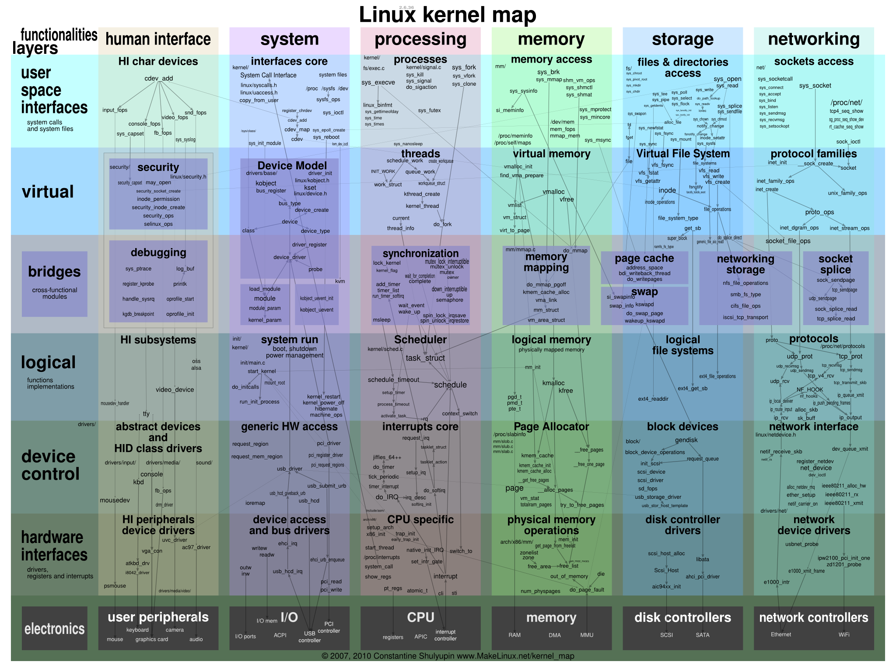
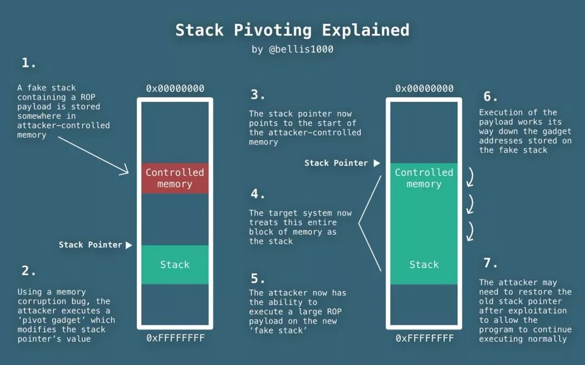
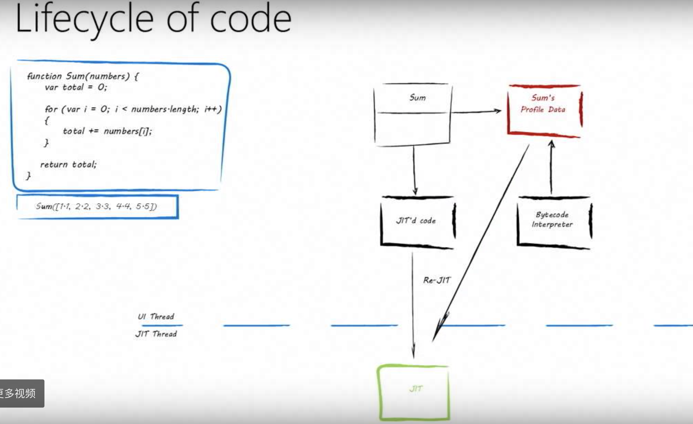
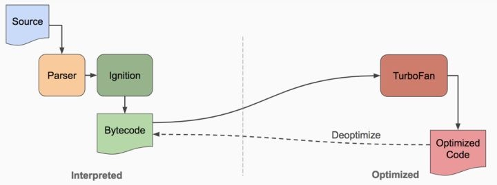
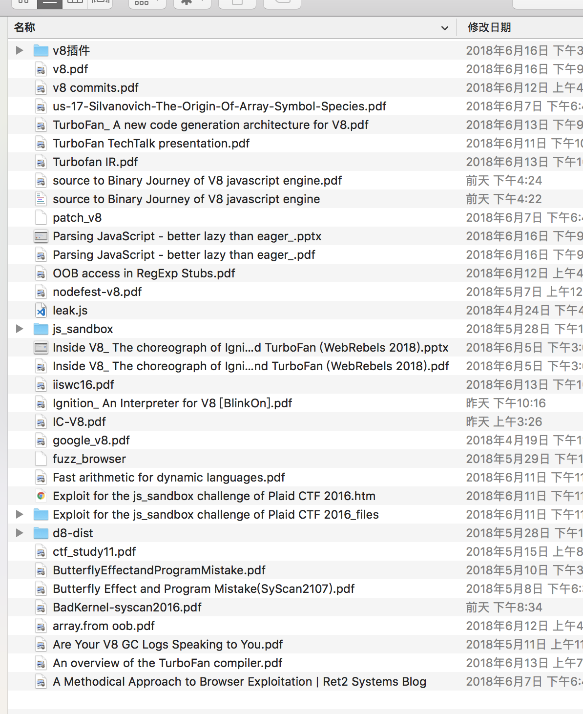
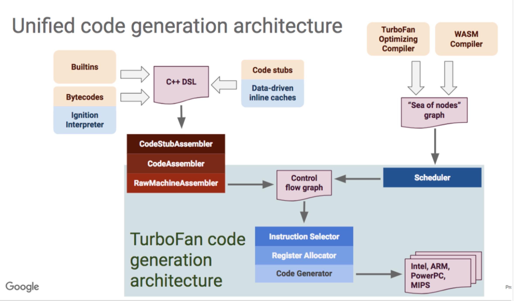
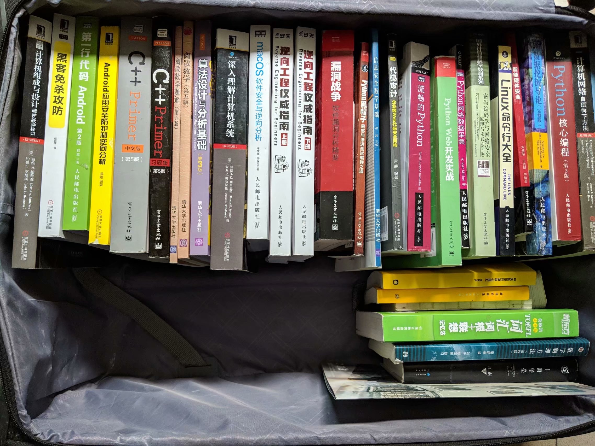
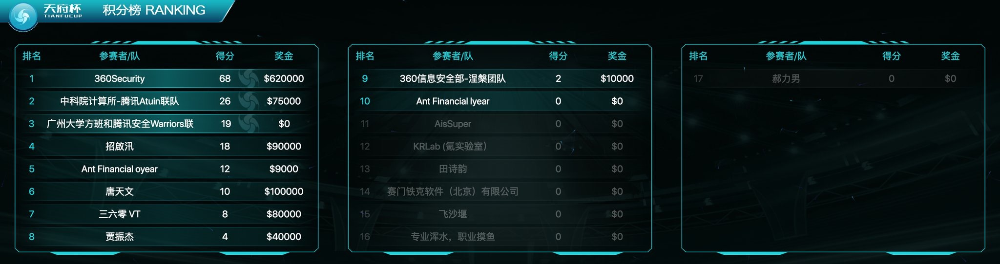
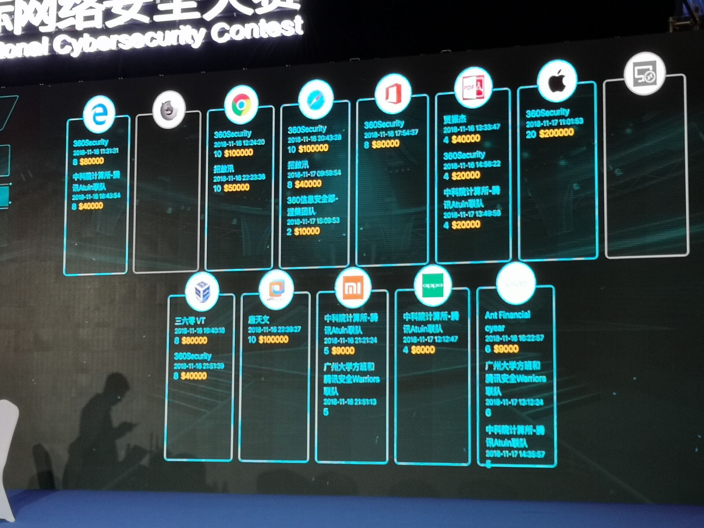
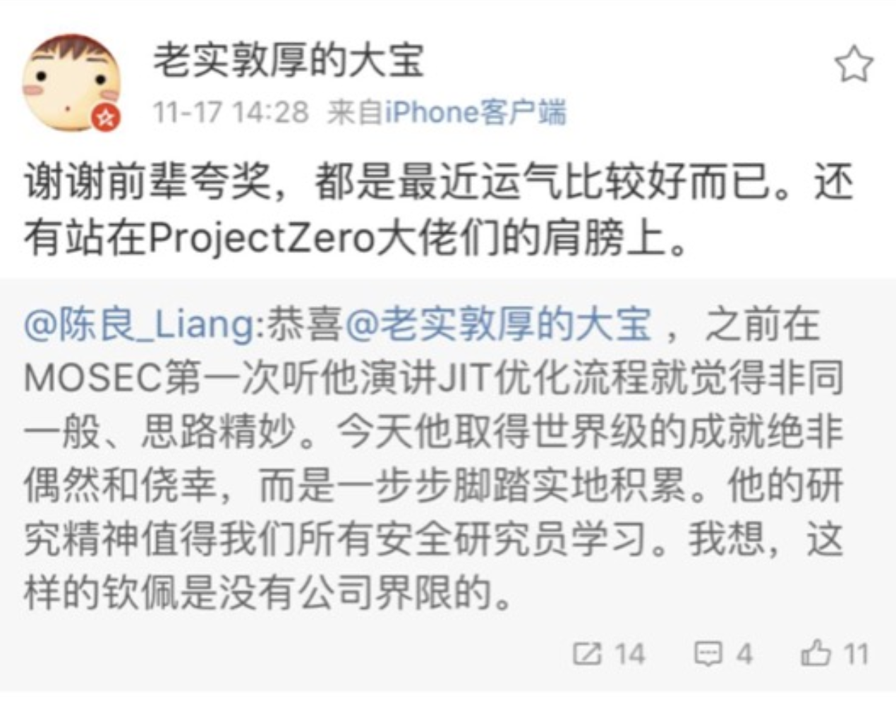

## 2018-1-28

1.看玄武实验室的每日安全推送（主要是看了android挖矿，p2p蠕虫）
2.配置shadow
尝试用gdb和gdbserver来调试
https://github.com/CENSUS/shadow
https://developer.android.com/ndk/downloads/index.html?hl=zh-cn
http://kiya.studio/2017/06/21/android-gdb/
shadow文档的几个坑点

- arm-linux-androideabi-gdb，也就是gdb-arm版没有提供，要自己找，我装了一个ndk r10e，然后弄了一个，嗯，r11移除了gdb。
- 在gdb remote之前，文档里没有写forward转发，导致我试的时候一直refuse

3.晚上最大的收获是看到了一个不错的blog（android逆向CTF）
http://kiya.studio/2333/03/03/android-reversing-skills/#more

## 2018-1-29

1. 看玄武的[每日安全推送](https://mp.weixin.qq.com/s/mOaXkGTY2704P6TV2KBvwg)，主要看了WinAFL
2. nexus5被我刷成砖……然后顺手把刷机、root和装xposed全都整理了一遍。
3. webkit的poc断点找到了，可以调了
4. 做了一道阿里CTF第二题，一道关于反调试的题。

## 2018-1-31

1. 看AI直播调webkit，感觉调浏览器好难呀。
2. 看玄武的[每日安全推送](https://mp.weixin.qq.com/s/M4QZxs_G-lZ810o_i2KJhA)，主要关注了反调试和使用Strava 热力图来推断军事基地位置，很有趣的思路。
3. 研究了一下加固原理和脱壳基础：dvmDexFileOpenPartial，还挺简单的。
4. 研究了ptrace和调试器原理，了解了ptrace反调试的一些技巧

## 2018-2-1

1. 本来想今天研究一下ndk编译的，不过睡着了……然后也没看什么东西
2. 帮学弟解决了一些搭建博客的bug，顺便自己把博客的主题配色，代码高亮，搜索，评论什么的都修改或添加了，好看多了……

## 2018-2-2

1. 看玄武的[每日安全推送](https://xuanwulab.github.io/cn/secnews/2018/02/02/index.html)
2. 钓鱼网站那个很有趣，我就测试了一下，然后因为ss代理不走终端，找了[一篇文章](https://juejin.im/entry/5821840cd203090055134cc0)和[另一篇文章](https://blog.kelu.org/tech/2017/07/06/parallels-vm-use-proxy-with-host-on-mac.html)，配置了一下就好了~
3. 自己实践了一下那个钓鱼工具，实践文章和终端那个都可以在”杂项”分类里找到
4. 研究了一下怎么用ndk-build编译一个能在手机上运行的c程序，这样明天就可以尝试hook了

## 2018-2-3

1. 今天没有玄武的推送看~
2. 研究了android native层hook，算是学到不少东西了。

## 2018-2-4

1. 写了第一个xposed程序~遇到了一些坑，不过还是趟过去了。
2. 修改nexus5的boot.img,打开系统调试，又坑了我一会。。

## 2018-2-5

1. 今天出去怠惰了（茶）
2. xposed继续学习了一下，学会了一些姿势，感觉还是不错的~

## 2018-2-6

1. 研究了怎么搭建shadowsocks服务端和优化
2. 自己写了一个基于flask的B/S端口扫描器，代码太难看就不放了（茶

## 2018-2-7

1. 继续看玄武每日推送[2.6](https://mp.weixin.qq.com/s/FM-mZh1e8YQP0MWrV1IlVw)和[2.7](https://mp.weixin.qq.com/s/2JMrsyyuTErVy-pXRoL3Jg)
   wordpress DOS有点意思，不过没搞懂，另外主要看了android安全公告2月版，看懂了一些（限于原理），开发太菜了。
2. 学习了android的jni开发，基本的都摸了一遍。

## 2018-2-8

1. 继续昨天的jni学习，摸清了native方法的动态注册
2. 研究了下.init_array,结合jni动态注册，做了一道CTF题
3. 继续看玄武每日推送[2.8](https://mp.weixin.qq.com/s/sqPmC-z-HiH4UKArE1Gdgw),这篇[钓鱼](https://www.fireeye.com/blog/threat-research/2018/02/reelphish-real-time-two-factor-phishing-tool.html)的有趣
4. 给AI写了个爬页面上文件的爬虫。

## 2018-2-9

1. 研究android构建过程，Gradle工作流程
2. 读玄武每日推送（存了个移动端静态分析的github准备好好看看）

## 2018-2-10

1. 研究Dex文件格式和修复
2. 学习了用ddms来dump出运行内存做题的技巧。
3. 学习了新建android工程，调so文件解题。

## 2018-2-11

1. 把昨天看到一道递归算法的android re做了，感觉现在做一般的CTF都有点思路了，做看雪的还是GG，还要提高姿势水平。
2. 今天上午看到我在知乎的提问有师傅回答我了：https://www.zhihu.com/question/266901100/answer/316607339，然后作死的又打开了这个洞CVE-2015-3864，嗯...我调没调出来，忙活了一上午，断点都没断下来，但是起码……嗯，我记住了名字！libstagefright，我是记住了……别等我学会了来找你。。
3. 今天下午做完题就又瞎看了一会，思考我是不是选错了方向……android的调试贼麻烦，资料还贼少，看了看看雪，主要是浏览器、文件格式和内核，虽然其实都一样的，那些资料也不多，没法挖洞的……认识的dalao又少，没法充分交流QAQ，唉，感觉我是不是不适合当黑客，看vulcan的师傅微博，月月一大批CVE，就我什么都挖不到，不过今晚看了看师傅们的博客，他们的心路历程给了我很大勇气，是的，我早就不打算退后了，只有前进而已。

## 2018-2-12

1. 今天刷空间看到moctf比赛，就参加了下，把android/linux re做掉就没看了。
2. 依然很迷茫，不过其实想想，我开始学二进制，其实也就不到半年，进步速度并不是不能接受，只是在技能进阶上卡住了又没人交流而已，嗯，再想想好了。

## 2018-2-13到19

1. 这些天几乎都过年去了……然后唯一做了点事就是把自己的课程设计做了，[PortScan](https://github.com/eternalsakura/PortScan)
2. 新年新气象，最近家里的事情也是乱七八糟，能多学点赚钱的技术分担压力就好了。
3. 下学期的计划——fuzz、CVE漏洞研究、前端后端的一些Web开发（写点相关项目练手），然后找实习。
4. 学会了一项新的运动，保龄球，很有意思。
5. 最近一直什么都没学，自己也在反思一些东西，寻找一个前进的点。
   比如浏览器，文件格式，还是内核，或者其他，还是都不是。
   安全只是个抽象的概念，具体化了才能变成业务。
   我还需要探究一段时间，读很多的漏洞分析文章，追随前辈们走过的路途，再进一步反思。
   “一个漏洞的产生到漏洞利用至少会经历好几个阶段：Bug –> exploitable bug(vulnerability) –> poc –> exploit –> reliable/weaponized exploit。虽然大家都喜欢把fuzzing出来的bug讲成blah-blah-blah的故事或者作为PR，但我们真正关心的漏洞应该是能到最后两个阶段的vulnerability。”

## 2018-2-20到21

1. 返校真是艰难……飞机火车客车出租全都转了一遍才到……
2. 晚上收拾了下房间，看了看看雪，发现师傅做的有趣CTF题，https://bbs.pediy.com/thread-224686.htm
3. 群里在讨论内存管理和hook，被推荐了一本腾讯的手游安全的书《游戏安全：手游安全技术入门》，还不错，可以入个门……
4. 看到一个博客提供了一些自定义ROM的资料，最近也想改，看到了就记录一下。https://my.oschina.net/ibuwai/blog?catalog=3379629&temp=1519222237338

## 2018-2-22

1. 看了《手游安全技术那本书》，学习了注入技术。
2. 下午买了考虫的口语能力提升班，然后学习了下
3. 晚上在seebug逛，找各种二进制漏洞分析的资料，然后看到了陈良的ppt,remet的github,韩子诺的文章，还有很多很多……CVE-2014-7911感觉可以调调，我得整理整理我搜的资料，然后按照原理->漏洞分析->exp去学习w

## 2018-2-23到25

1. 是的，仔细算算，我已经编译AOSP编译了三天了，而且还没编译好……现在已经基本放弃在mac上编译了，我现在突然想,flanker大神之所以用ubuntu做主力机……是不是因为在mac上编译不出AOSP呀……(逃)
2. 明天在旧电脑上装win/ubuntu的双系统，要不是因为这学期有win网络编程和c#开发……我就直接烧ubuntu进去了（撑脸
3. 嗯，不用明天了，在今天的收尾……新学期的开始……我终于是守得云开见月明，把AOSP弄出来了！

## 2018-2-26

1. 学习了stack pivot，[劫持栈指针](http://tacxingxing.com/2017/05/10/stack-pivot/)
2. 学习了heap spray,[堆喷](http://secwiki.neu.edu.cn/wiki/images/f/fe/内存喷射在安卓Root利用中_陈良.pdf)
3. 学习了[虚表攻防](http://pwn4.fun/2016/11/20/C-虚函数调用攻防战/)
4. 了解android[root](https://www.blackhat.com/docs/us-15/materials/us-15-Xu-Ah-Universal-Android-Rooting-Is-Back.pdf)
5. Time-of-check Time-of-use (TOCTOU) Race Condition
6. 今天还是认真的研究了一下之前没调出来的cve-2015-3864，因为这个漏洞有完整的利用链资料，非常的棒，虽然可能调不了什么的，但是理解这个利用过程也很有意义。
   还是要感谢一下看雪师傅的[文章](https://bbs.pediy.com/thread-222893.htm)，还加了好友0.0，感觉要是我一开始就是编译的AOSP去调试……可能寒假就调出来了2333，反正感觉今天还是很有收获的。

## 2018-2-27

1. 一上午调了道64位rop，还没调出来..exm???是这题的错还是我的错…多看看别人的exp好了，以前还是做题不够，积累不够。
2. 继续看stagefright好了，争取今天多少调一调。
3. 好吧，没看进去，gp0的exp大致看懂了，不过metaphor的思路还是费解，可能我现在的理解力还是不够。
4. 下午一直在整理之前看的ptmalloc的一些基本概念，虽然意义不是很大，但是理一理总是好的，还是要为ctf-wiki打call，里面写了非常多的干货，明天继续整理。

## 2018-2-28

1. 体育课累死……密码学数学基础有趣。
2. 今天把heap exploit的unlink整理了一下，虽然最后那个例子有点问题，我换了两个系统都没成功，但是原理还是理清了，真的是都快忘了……

## 2018-3-1

1. 又混了篇看雪的优秀，感觉还是蛮有成就感的，自己发的文章都不是优秀就是精品。
2. 今天有点怠惰呢，明天要继续努力。

## 2018-3-2

1. 今天一天都在整理fastbin的一个内容（其实还玩了一会Web，黑掉学校OJ嘿嘿嘿）
2. 这道赛题略难，然后跟团队练习赛的PragyanCTF，感觉这赛题像是file io啊。。谁出的题这么皮。。

## 2018-3-3

1. 生日快乐~自己，去订了蛋糕，今天继续研究了一下那个fastbin的题，真的很难。。
2. 把android kernel也编译了出来，这次真的是可以调了。。

## 2018-3-4

1. 今天和实验室大一的聊了下，然后把我能知道的东西，方向什么的，都聊了一下。
2. 9447 CTF 2015的fastbin是真的难……我还是不懂，算了算了，明天看点别的吧，这个todo。
3. 今天和一个师傅聊了下IoT漏洞应该怎么挖，受益匪浅，但是转换为具体的硬实力还需要多看多学多调。

## 2018-3-5

1. 今天把那道fastbin的题认真的理了理，其实也不是很难，然后又把pragyan ctf2018的两道pwn题做了一下，第一道还好，那个目录遍历没理解上，看了wp会了，第二道就有点迷，静态链接下的格式化字符串漏洞，没办法覆盖got表，看了一篇wp是覆盖malloc_hook，这不是我白天看的那道fastbin的套路么……真的是……然后打开栈执行，这……真是脑洞，又感觉自己很菜……
2. 嗯w，文章又被看雪推送了，还是感觉蛮不错的……希望能认识更多人吧w，今天看了看玄武每日推送的目录，非常nice，准备找个时间把这段时间没看的都啃一下。

## 2018-3-6

1. 上周的比赛，搞到今天总算是大致调完了，就只剩一个点不懂，也是实在搞不懂了，教主说的很有道理，只有把文章写成博客，发出去，才能检验你到底对这个东西的理解怎么样，事实上，也只有在学习中的我，才会如此详细的写wp吧。

## 2018-3-7-8

1. 这两天把漏洞战争的环境大致搭了一下，从用windbg到看到符号，还是折腾了一下。

## 2018-3-9-10

1. 调了一下漏洞战争堆的第一个binary，然后熟悉了一下工具使用，还是nice.
2. 调了cve-2012-1876的poc，发现了一些书上没有提到的地方和一个错误，就不提勘误了…都出了这么久了…原理差不多懂了，很有趣。
3. 今天有意想不到的收获，或者说机会吧，希望我能把握好，然后做好安全研究，成为一个优秀的黑客。
4. 列一个CVE调试计划吧，目前进度1/10
   浏览器
5. 7 CVE-2012-1876,堆溢出（p2o ie9)
6. 3 CVE-2011-0027,整数溢出漏洞 (p2o ie8)
7. 6 CVE-2013-2551,整数溢出漏洞(p2o ie10)
8. 4 CVE-2013-1347,UAF(ie)
   android
9. 7 CVE-2014-3153 anroid kernel提权

## 2018-3-11-12

1. 这两天进度比较低迷，第一天直接莽上去调exp然后被打脸…今天把vupen的文章仔细读了一遍，把整个利用过程理解了一下。
2. 说来有个有趣的点，p2o之后cve-2012-1876不是应该补了么，怎么在win8+ie10上还能利用，更有趣的是vupen明明用这个洞getshell了ie9，但是为什么keen在Study of Exploit Migitation in Modern Browsers这个ppt上说了bstr的分配不再能被利用，那vupen到底是怎么写的exp…
3. 最近的计划（才怪…

- 编译的前端后端
- kernel的漏洞
- 看diff写poc…

## 2018-3-13-14

1. 密码学数学基础和算法这些课也就算了，晚上还有软件开发的课，各种文档什么的…能不能好好lu代码，把之前写的项目project答辩完了。
2. 等到了想等的结果，收心认真学习了。
3. 晚上把计算机系统素养里的部分内容（VM）又看了一下，十分有意义。
4. 为了学编译原理，先自己lu一个c语言解释器了解个大概吧。

## 2018-3-15-17

1. 这几天把write a c interpret看完了，大致了解了编译器前后端，当然肯定现在还是不会写的。
2. 调cve-2012-7864,虽然称不上调通exp，但是大部分都调出来了，poc调的很顺利，在exp就处处踩坑。
3. 说来好像webkit的dom的堆被分开了，以后就不会有那么多uaf了。

## 2018-3-18-20

1. 日记还是要每天记……都忘了自己每天做了什么了……把c++的project做完了，做了两道pwn题。
2. 看了一下LCTF2017的题目,large bin的unlink确实没练过，还有一道simpleVM改的题，都做做好了。

## 2018-3-21-25

lctf2017的题目里学到不少东西，另外关于堆利用的姿势实在是不足，此外无libc利用这个也要再学习一下。
这几天除了两个project写，还打了强网杯，感觉就是什么都不会吧。。可能不该死磕一道题，应该都看看？…啊啊啊，难受死了，离顶尖水平差的根本不是一点半点……
还看了一篇清华的论文，非常nice。http://jcs.iie.ac.cn/ch/reader/view_abstract.aspx?file_no=20180101&flag=1
还是有的挫败呢，离别人的水平。

## 2018-3-26

1.读玄武每日推送[http://chuansong.me/n/2253059751415].

- mark一下[windows kernel漏洞利用](https://rootkits.xyz/blog/2018/03/kernel-uninitialized-heap-variable/)，mark一下k0师傅的[UBUNTU 16.04 EBPF ARBITRARY READ/WRITE 漏洞分析](https://whereisk0shl.top/post/2018-03-21)和360src的[这篇](https://cert.360.cn/report/detail?id=ff28fc8d8cb2b72148c9237612933c11),看来调kernel还是有的调。
- 看到的[ARM exp开发](https://github.com/sashs/arm_exploitation/blob/master/exploitation_on_arm_based_systems.pdf)就很简略，感觉学不到什么东西。
- mark一个超棒的[linux kernel交互图](http://www.makelinux.net/kernel_map/)，还能在页面上点击跳转到资料
  [](https://sakura-1252236262.cos.ap-beijing.myqcloud.com/2018-03-26-LKM3_2048.png)
- 还有一个Stack pivoting exploit的图收了,不知道他们怎么画的图这么好看。
  [](https://sakura-1252236262.cos.ap-beijing.myqcloud.com/2018-03-26-030340.jpg)
- [windows注册表审计](https://static1.squarespace.com/static/552092d5e4b0661088167e5c/t/5a00963153450a8779b23489/1509987890282/Windows)感觉以后用得到
- [p2o的沙盒逃逸漏洞](https://twitter.com/_niklasb/status/977141034059747328)这个感觉十分有意思。
- blackhat上总有很多好议题，比如这个[绕过ASLR的新思路](https://www.blackhat.com/docs/asia-18/asia-18-Marco-return-to-csu-a-new-method-to-bypass-the-64-bit-Linux-ASLR-wp.pdf)

2.准备配linux kernel的调试环境，真的是……配不起来啊，双机调试，拉取符号文件，设置串口，改配置开启调试功能。rbq,rbq
3.加入了chamd5团队，有师傅一起学pwn，一起讨论真是太棒了QVQ

## 2018-3-27

1. 上午和出强网杯kernel题的师傅聊了一下kernel的调试环境搭建和赛题，师傅人蛮好。。
   搭建的话，muhe师傅的https://www.anquanke.com/post/id/85837

**编译linux 注意去掉不必要的东西，然后编译busybox 然后插入内核写linux init 最后制作cpio**
这样就可以qemu+gdb调试了，很nice。

1. 下午和晚上忙各种杂七杂八的事情反正……不过总算还是把要复盘的赛题做完了。
2. 另外，感觉自己的努力和天赋还是被人肯定的，加油吧，自己QVQ。

## 2018-3-28

1. 人生这种东西，其实就是起起落落落落落落落落落落落落落落落落落落落落落落落落落落落落，23333
   瞎看了半天linux inside，还看了下linux x86-64 asm，感觉没什么进展。
2. 晚上在知乎提了个问题，别人指了一条很nice的路线给我，还和其他人get了一点点资料，感觉我应该也是可以搞的吧，嗯哼。
   其实今天一直比较浮躁，还是昨天晚上的一些后遗症吧，还有就是期望和现实的落差……
   不过冷静的回想一下，不能让自己立刻从舒适区脱离，从新掌握新的知识，那怎么进步呢？且行且努力（乖巧

## 2018-3-29

1. 这几天事挺多的，今天才把blackhat的ppt都下载下来,然后看了下[linux符号解析](https://0x00sec.org/t/linux-internals-the-art-of-symbol-resolution/1488)还发现了一个[正在开发中的linux病毒](https://github.com/elfmaster/skeksi_virus)
2. 收集了蛮多linux kernel资料慢慢啃……今天啃了两个ppt，纯英文的那么多……我也是很意外自己读起来没什么障碍的……
   学什么都要一步一步呀，能调通一个，调试就没什么了，后面的学习速度就看对于kernel和保护的理解了。

## 2018-3-30-31

1. 这两天发生的事情还蛮多的，最近发生的一些事让我觉得，自己调的真洞还是太少，调就要调出来还要能调通，不过说实话吧……浏览器和kernel的洞真的不好调，我学二进制又不久……现在比赛练pwn都来不及，还要分身调洞，确实有点难啊……
2. 不过kernel的ppt啃了俩，感觉纯英文的资料也就那个样子了，读起来还是挺流畅的，要是真的不懂换成中文我也不懂……
3. 把kernel题的环境搭起来了，有师傅请教真的是比自己搞好太多……另外堆的题感觉有感觉了，准备给自己一个比较长的训练周期，比如十天，彻底脑内模拟透，最近进步还是蛮多，加油。
   mark一个师傅的[博客](http://veritas501.space/2018/03/28/两次CTF比赛总结/)

## 2018-4-1-3

1. 打了一场0ctf，感觉自己还是太菜，不过在师傅们的帮助下，把能搞懂的题都搞懂了，学到很多很多东西，还是很开心的。
2. 写wp太麻烦了坦白说。。不过还是写吧，不写的话自己都不知道能记得多久……

## 2018-4-4-11

1. 这几天电脑键盘坏了，电脑送修什么都没干。下了个吃鸡手游，嗯，还挺好玩的，今天早上电脑到了删了。
2. 把0ctf2018的4道pwn复盘完了，折腾kernel调试环境。。还是挺麻烦的。
3. 想要的很简单，得到却很难，好想去实验室做安全研究。

## 2018-4-12

1. 今天从qemu+gdb，各种花式报错，到搭建内核的双机调试，简直了……总算最后是勉强在win机器上弄好了。
   今天得到的一个启发是，先找一个可以用的方案去做，不要想什么一次做到最好，到有机会再换方案。
2. 英语作业还没做……唉……赶作业赶作业……

## 2018-4-13

1. 今天也是一堆事情，睡到中午然后开始做ddctf，那个逆向的mips还有android逆向的RSA，pwn的win kernel exploit真的是有、意思。反正我不想做了，不如学习一个[新姿势](https://blog.betamao.me/2018/02/26/ptmalloc小记/)
2. linux kernel调试的环境算是彻底搭好了，今天解决了两个昨天没解决的bug，已经可以看到源码了。

## 2018-4-14-15

1. 解决了内核不能单步调试的问题，然后在复习信安数学了。。再不看要凉了
2. 仔细跟了一下poc，感觉还是能看懂的。

## 2018-4-16-17

1. 自己看了下日记，4月除了修电脑配环境，几乎什么都没做，这段时间心态太浮躁了，嗯，加个太，也要准备投几家实习了，本来以为可以拿到的offer，都感觉凉了，不过算了，我是要去实验室做安全研究的人呢。
2. 分析了cve-2017-8890的漏洞成因和模型还有patch

## 2018-4-18

1. 今天也是一堆的课，晚上和师傅们聊天聊八卦去了。。结果只把UAF对象的分配和释放调了调。
2. 了解了一下实验室面试啥的，要好好调CVE了。

## 2018-4-19

1. 看了看师傅们的面试题，觉得其实自己还能再抢救一下。。
2. 今天看了长亭的kernel的洞，感觉分析成因还是很好分析的…但是exp调起来麻烦，也懒得写博客记录了，今天把webkit的调试记录了一下，明明好久之前就搞了，结果到现在还是这样没什么进展（茶

## 2018-4-20-21

1. 编了一天v8，搞不出来，墙真讨厌。
2. 调（看）了一个webkit的UAF漏洞，还行，感觉最难懂的还是对象之间的引用关系太复杂，还有就是回调函数跟着跟着容易找不到自己在哪。
   “我是谁，谁在打我。”（逃）

## 2018-4-22-24

1. 打了一场*ctf，又学到了新姿势。
2. 在看v8，看JIT，看R大的回答，xjb搜文章，还是不错。
3. 调通了p2o的一个v8的oob的洞，cve-2017-5053,还是不难。

## 2018-4-25-28

- 补一些浏览器的基础吧
- 学习了一下一个新的内核洞，有新的trick总结
- 最近觉得该搞搞利用了，路由器固件也可以玩一下，安全研究这么有趣，什么都能摸一下（才怪

## 2018-4-29-30

1. 国赛打完了，各种不走心，状态奇差，混进赛区半决赛了，CTF也玩到这了吧先，后面好好研究浏览器。
2. 看了Natalie Silvanovich写的How to Find JavaScript Vulnerabilities with Code Review

- Determine intended functionality
- Review implementation of important features
- Review previously reported bugs
- Brainstorm likely vulnerable areas
- Review code!
  Mozilla docs (MDN) is a great start for JS

1. 想翻一些议题视频看的时候翻到了一个仓库，js vul的，存一下，[js-vuln-db](https://github.com/tunz/js-vuln-db)

## 2018-4-31-5.2

1. 看了一个js optimized code[视频](https://www.microsoft.com/en-us/research/video/chakra-script-optimized-code/)，虽然是chakra的
   [](https://sakura-1252236262.cos.ap-beijing.myqcloud.com/2018-05-02-074634.png)
   不过感觉，有点没用…这些我都知道（
2. 看v8的gc,利用和各种，反正还是挺迷的，先看吧QVQ
3. 看到一幅很棒的图，新的v8的执行图？
   [](https://sakura-1252236262.cos.ap-beijing.myqcloud.com/2018-05-02-151804.jpg)
4. 看webkit技术内幕找灵感，看洞有点看不明白了。

## 2018-5-3

1. 下午在看书，然后突然接了玄武的面试，患得患失吧，之前面试都没这种感觉。
2. 总结一下面试：
   CTF和内核这种充数的不算，好歹面的是浏览器组。
   主要是讲了v8的一个洞，然后oob有一个点没分析清楚，我需要透彻的再搞一下了，还是太菜。
   感谢给我讲了这个点的sky师傅，面的时候被问到这里真心紧张了。
   面了45分钟，口干舌燥，最后我提问的时候，问了自己读浏览器源码的方法是否合适，万分期望能过。
   也问了我对各种缓解机制的了解，然后就是漏洞利用，我讲的每一个洞，都被问了怎么利用，这个答的太差了，真的只是说说思路了，自己搞，写exp，真的没试过……该提升这方面的技能了，不能停滞不前！
3. CTF暂时不玩了，在拿到offer之前。

## 2018-5-4

1. webkit技术内幕里关于v8有一些描述，有一些帮助。
2. 理解了一下原型链是什么。

## 2018-5-5-9

1. 有点忘了自己都做了什么？最近做的东西周期越来越长，分开来看每天都没什么好记的（都是借口……最近太兴奋和激动有点摸鱼）
2. 玄武实验室的offer拿到了~我最初想要的都有了，以后只需要往着安全研究员和优秀黑客的方向继续努力就行。
3. 最近有在翻v8的一些日语资料，翻完了会放出来吧，一边看资料一边查资料读slide打基础，还有鲸书准备读。

## 2018-5-10

1. 继续翻v8 exploit的资料，大概翻完了1/3，看到了GC机制那里。
2. 下午上机组实验太伤脑子了……茶，然后最近准备再调一个v8的oob写wp了，不过还得等等…一样一样来。
3. c++有点不熟了呀，还是要再搞搞……

## 2018-5-11

1. 继续翻v8资料，理解引擎很重要，在此基础上调洞比起靠感觉还是要好点的，纯靠感觉容易偏。
2. 翻完了gc，好像稍微懂一点了。
3. 今天其实发生了很多事情吧，不过不方便写在日记里，就这样吧。

## 2018-5-12

1. 继续翻v8，总算翻到了对象存储（其实这部分该最先讲吧……）
2. 准备信息系统开发的答辩什么的，下周开始要准备复习功课了。

## 2018-5-13-14

1. 今天把v8的ppt的引擎基础部分翻完了，入职的事情也都搞的差不多了，剩下就是在去之前好好努力了。
2. 感觉路由器这种硬件可以玩玩……相对好挖洞呢。。

## 2018-5-15-6-9

这段时间沉迷期末考试无法自拔？？？嘤嘤嘤
有个小插曲，因为弄错了考试时间导致挂科，吃一堑长一智。。。
好了，开始记笔记了。

## 2018-6-10-11

把v8 exploit的PPT翻译收了个尾，重新整理了下v8的学习思路。
从漏洞函数回溯调用路径，断点调试等，还有exp的常用思路。

## 2018-6-12-14

最近脚上起了个小疮去了两趟医院，走路还好疼，真的是非常不顺利了。

## 2018-6-15

在mac上编译了v8，之前是在win上编译的，不得不说……有个坑点就是在16.04上面，不checkout到旧的分支，是无法编译成功的，耽误了一天。
然后认真的研究了一下fast Properties和hidden class，拿gdb打debugprint看了很多东西学习，记笔记记笔记。

## 2018-6-16

翻译了Source to Binary Jounrney of V8 javascript engine
categories，get了新知识，v8的体系结构还要多调试理解。
另外，再需要啃一本鲸书，理解一下编译优化技术。

## 2018-6-17

[](https://sakura-1252236262.cos.ap-beijing.myqcloud.com/2018-06-18-180229.png)积累着读了一点PPT
突然发现也已经看了和写了，还调试了不少东西了，慢慢的对v8从生疏到开始渐渐熟悉，不过到挖掘漏洞的方法论可能还要再过一段时间吧。
毕竟v8代码我都没咋读过，翻翻pipeline.cc了解下Turbofan的一些API

## 2018-6-18

学习了阅读v8的bytecode，和了解bytecode的生成和解释执行还有to graph的过程

## 2018-6-19

今天开始要复习一点算法呢。
学习了v8增加的gdb命令使用,读了
https://github.com/danbev/learning-v8/blob/master/README.md
真的难懂，看了一下午，没什么头绪。。
[](https://sakura-1252236262.cos.ap-beijing.myqcloud.com/2018-06-19-115842.jpg)
关于代码生成，Builtins和Runtime还是云里雾里，头疼。
写了个小工具来转换unsigned long long和double
v8的对象存储又看了一遍。。。结果今天还是没复习算法。。睡觉睡觉。

## 2018-6-20-21

搬家，寄了一些东西回家，整理了整理书，虽然我看的都是电子书，但是还是存了这么多呀。
三年不长，但也不短。
[](https://sakura-1252236262.cos.ap-beijing.myqcloud.com/2018-06-21-173058.jpg)
晚上收拾了我最后一点东西，把入职需要的材料办完，要走了呢。

## 2018-6-22-23

复习了几道动态规划的算法题，要考试啦。
另外最好的消息是迟到了。。只做了十分钟的计算机组成原理居然及格了。。感谢老师，师生情太深了，感动感动。
这段时间发生了不少事情，然后让我又想明白了一些事情，这段时间确实，没怎么学的进去，学的并不好。
今天看了蛮久的漏洞，不知道其他人是什么样，但是在我最烦最难受的时候，安全研究是最能让我平静下来的一件事情。
我喜欢这样，虽然目前很多地方做的并不好，但是可以慢慢学习~
写了个case CVE-2016-1646，还有另外一个JIT的洞，有点难懂。

## 2018-6-24-25

调v8一个麻烦就是编译，得想个办法.
http://eternalsakura13.com/2018/06/26/v8_environment/
总算是搞定了，最近一些技术文章读的少了，思路不够开阔，学习学习……
还有算法考试要到了。。趴桌，继续在看动态规划和贪婪

## 2018-6-26

学习了CVE-2016-5198，原理就是在JIT优化之后，会直接从n中取出直接取出自定义属性数组中，对应于某属性偏移的字段，而不做任何合法性校验。

都还需要总结（

## 2018-6-27-28

1. 看了一些内核的资料，整理整理，顺便给人鸡汤了一下。。
2. 刷算法，准备期末。。凉了啊。。

## 2018-6-29

1. 累的要死的一天,飞机晚点了三个小时，卒……
2. 看了一些资料，学会了如何成为一个合格的安全研究员（打了鸡血
3. 在mathias这里住下了~New story要开始了

## 2018-6-30-7-2

1. 这两天在忙着入职，装电脑和认识同事。
2. 和导师说了自己最近在做什么，从tools和Bug study的角度，然后他让我继续搞v8，得偿所愿，不过估计要干活要明天了，说是要分析的洞还没给我。
3. [ Browser ] Microsoft Edge Chakra 引擎 UAF 漏洞分析 (CVE-2018-0946)：https://www.fortinet.com/blog/threat-research/an-analysis-of-the-use-after-free-bug-in-microsoft-edge-chakra-engine.html
   https://bugs.chromium.org/p/project-zero/issues/detail?id=1534&desc=3
4. [ Browser ] CVE-2018-5146
   http://blogs.360.cn/blog/how-to-kill-a-firefox/
   A神之前就说在写一个没有poc的exp，不知道是不是这个洞，突然想到。
   others（同事写的root cause和exploit，还有怎么用shadow来分析堆，很有意义。
5. 看了鲸书1-4章，不少熟悉的名词……interesting

## 2018-7-3

刚入职这段时间确实是最宽松的一段时间了，只需要学习就行了，没有什么其他KPI，后面应该就多了。
今天分析CVE-2017-0234，不过主要花时间都花在环境搭建上，漏洞触发和分析并不难，或者说还好。

## 2018-7-4

1. 今天把CVE-2017-0234的分析报告初版写完了，掌握了vs和windbg的两种很棒的调试方法，然后在编译v8，算是学到了一点东西，得再加强code review的能力。
2. 成功在win上编译好了v8，可以玩一下。

## 2018-7-5

1. 0234还要分析第二版，不过还不急，今天在自己分析其他v8的漏洞，一个p2o的洞的利用，思路真是棒，学到了学到了~
   https://docs.google.com/document/d/1tHElG04AJR5OR2Ex-m_Jsmc8S5fAbRB3s4RmTG_PFnw/edit

## 2018-7-6

1. 上班摸鱼好几天，今天下午听了各个大佬每周做的事情和科总的分享，觉得要走的路还很长。
2. 目前的计划：
   先看一些代码和语言标准；
   talk和blog（可以看看如何移植v8，并思考其中可能出现的漏洞
   Firefox的[fuzz](https://github.com/MozillaSecurity/funfuzz/tree/master/src/funfuzz/js/jsfunfuzz)（编译原理不止要领会意义，更要能写出来。
   另外是关于win下用到了v8的各种软件的调试，也是一个学习面（比如可以看看漏洞战争等资料学习windbg和常规利用）

**你要用较少的时间走完别人走了很久的路，所以你要跑起来，要飞快地跑起来。**

1. 和导师聊过自己分析的第一版漏洞，发现很多问题，我需要更深入的思考。其实安全研究有点像一个侦探游戏，每一行都是线索，我漏掉一点东西就拼不出完整的拼图。（因缺思厅
   PoC能否修改？怎么修改？思考如下：

- 不同的对象能否触发？举例：一定要是Uint32Array或者ArrayBuffer么?
- 是否一定用到循环？去掉循环行不行？怎么精简PoC?
  为什么JIT优化去掉边界？它为什么会去掉边界？（和4GB有关，这种特殊的buffer分配方式）
  （去掉边界的代码是三行，代表一个JIT生成的可选项，为什么要这么选？）

## 2018-7-7

1. 今天上午去办了个房卡，一个月4000，押二付一，资产清零2333，其实居住条件就一般啦，只是离公司近，方便加班（摸鱼）
2. 今天和朋友聚了个餐，以后就全吃公司救济粮了~
3. 继续看0234，直接挂win API没调到点子上，但是最后还是换了个想法搜到了。。还行。。方向没错。
4. 思考和调试新的攻击方法，趴桌。

## 2018-7-8

1. 把0234第二版写好了（调试分析昨天已经结束了，今天只是整理文案……）
2. 然后看c++对象模型，很有意思。
3. 研究了一下js fuzzer
4. 继续思考和调试某个洞（或者说软件）的新的攻击方法。

## 2018-7-9

1. 下午就是在部署fuzz和抄代码,然后xx发了个webkit的洞，我看看……还有公司推送了一个dlmalloc的。。都看看
2. 导师说我写的FUZZ是浪费时间2333，嗯，是这样的，我不用太心急，这就是有人带的好处……很多点能够及时纠正（然后一下午没了2333
   沿着各个组件，各个组件都出过什么漏洞这个线索去分析好了，人的力量才是无穷大的。
   嗯，先把思路和相关知识建立起来。

## 2018-7-10-11

1. 在这找test看，https://cs.chromium.org/chromium/src/v8/test/mjsunit/es6/regress/
2. v8相关的索引，https://v8.paulfryzel.com/docs/master/index.html
3. 看每天的commit，https://github.com/v8/v8/commits/master
4. 看gpz的漏洞，每天写一篇分析（当然不可能放出来（逃
   https://www.exploit-db.com/author/?order_by=date_published&order=desc&pg=1&a=7725
5. 最近在思考一些个人研究是否要放博客上，仔细想了想还是算了，漏洞理解的思路，比很多东西要宝贵吧。

## 2018-7-12

1. 现在想要挖到洞，想学会漏洞利用，顺便，月乃安利了一个repo,PPP的https://github.com/theori-io/pwnjs
2. 这两天可能因为一些原因心情异常烦躁，一方面是弱的不行的自己，一方面是想要的更多，哇，真想哭……好了，杂事就不管了，我又不是神，怎么可能面面俱到。
3. 闭关，博客会更新日记，在有一定系统化的总结思路之前，博客不会再更新文章了（日更变月更？）

## 2018-7-13

今天开了个组会，可以说是非常开心了……
每天东看瞎看，没看点有用的东西……（发呆

然后导师给了我下一版要继续分析清楚的点。

1. VritualAlloc分配的和GC管理的区别，GC机制
2. 开发者为什么这么设计这个？为什么之前不限制4GB
   （明明超过4GB就会OOB，为什么还去掉上界，他们就真的是觉得4GB足够大？其实不是；patch补的其实是没问题的，虽然依然可以dos，但是这个不是大问题，应该还是要从GC的角度去再思考一下，或者其他？）
3. 这个内存管理是实现有问题还是设计有问题？实现有问题那么还有哪些地方是这么实现的，设计同理。要比开发者更了解他们所写的软件（：
   安全研究的本质还是回归到对开发者的代码的深层次理解，一层一层的往下深挖，才能挖到线索，挖到真相（

太菜了太菜了……受不了我自己了……
今天的收获是和刘炜师傅指点了我好多，一些源码里的疑问搞的清楚了，还解决了其他问题，nice……每天学的都比较痛并快乐着了。

## 2018-7-14

一觉睡到下午一点半……23333，还好周末，不过平常起得也不早，还好在玄武，要不然要被开了……
然后晚上和川神还有夜影他们约了个饭，感觉还不错~(然后吃完了滚回来加班)
今天看了点chakra，分析了cve-2016-7189，用英文写了wp，明天再整理一下pattern（root cause比较好写，只是关于callback我调了一下，挺好玩的）
type confused还是很普遍的漏洞，但是其实还是不大好覆盖到每个点去看，有没有什么好思路呢（发呆

## 2018-7-15-18

这几天真的有点懵……或者说有点迷茫，开始搞chakra，代码还是那么难啃，不过比v8好搞多了……
关于开发者的假设最后还是弄清楚了，其实就还好，是我分析的时间间隔有点长，没直接串起来，一个宽度问题。
在想明白之前觉得自己要被开了，现在还好。
今天游走了一天，把zdi的博客上的一些分析看了，有点意思，但是还不够。
另外我又要继续分析了。
为什么VirtualAlloc比GC更不安全，GC机制。
导师让我找几个渲染引擎的老的UAF洞看看~（估计就16年的吧
感觉又要踩坑……
搭了一个VPN服务器，这样就不用担心v8拉取不下来了……
https://cloud.tencent.com/developer/article/1154896
人生苦短我用docker

## 2018-7-19-24

1. 看了看雪峰会，sky师傅讲浏览器的议题很有意思。
2. 看洞，整理一些loki的洞看。
3. 准备开始JIT之旅
   TODO List

中科大的编译原理课程，比较简单
http://mooc.study.163.com/course/1000002001?tid=1000003000#/info
http://staff.ustc.edu.cn/~bjhua/courses/compiler/2014/

斯坦福的CS143，编译基础
https://lagunita.stanford.edu/courses/Engineering/Compilers/Fall2014/about
斯坦福的CS243，编译优化
http://infolab.stanford.edu/~ullman/dragon/w06/w06.html

CMU，编译基础
http://www.cs.cmu.edu/~rjsimmon/15411-f15/
CMU，编译优化
http://www.cs.cmu.edu/afs/cs.cmu.edu/academic/class/15745-s16/www/

1. pizlo的PPT很nice
   http://www.filpizlo.com/slides/pizlo-dls2017-vmil2017-jscvm-slides.pdf
2. 开始0236……

## 2018-7-25-26

分析漏洞更深入了，思考的过程和思路慢慢搭起来了。
今天开始看编译原理。记录一些有趣的问题

```
perfect hashing
1. 什么是（关键字的）完美哈希？
没有关键字冲突的哈希函数
2. 如何构造完美哈希？试列举一到两种算法。
目前用的比较多的是gperf算法
为什么需要构造完美哈希？用关键字单链表是否f可以？
因为完美哈希一次匹配，的时间效率为O(1),而链表要扫描一遍，时间效率为O(N)
```

正则表达式代码生成工具
http://www.txt2re.com/
NFA->DFA,有限状态自动机

递归下降分析算法
LL(1),ANTIR

## 2018-7-27

总结一下今天，组会上分享的刚好是浏览器相关的东西，学到很多，此外最重要的是听了别人每周在干什么，也慢慢的知道了自己以后研究该看什么。
此外就是在看编译原理了，JIT始终是一个大的攻击面，而且写js/dom fuzz也绕不开编译原理，要吃掉这块始终不容易。。我还是太菜了。

## 2018-7-28-29

1. 这两天看了realworld ctf,和继续学习编译原理,看的还算快。。
2. spectre的漏洞利用和同事聊了一下，还是没做出来这个题，等官方wp学习一下，说来长亭这个比赛很有意思了……
   说来vm escape已经变成常规题了……23333，可以学习一个了…
   代码量还是不够啊，等这段时间搞完，就大量抄和读了……（没什么自己的需求，就不自己写了）
   积累积累积累

## 2018-7-30

终于看得懂《IFuzzer: An Evolutionary Interpreter Fuzzer
Using Genetic Programming》说的什么了。
不过确实有局限性，充其量是个demo，想自己写一个了。
commit要看，标准要读，漏洞要调，代码要写。
小孩子才做选择，我全都要。

## 2018-7-31-8-2

ctf pwn中的v8漏洞利用的坑差不多结了。。思路很多但是终究还是那些东西，利用都是好搞的，回归挖洞（笔记不放）

学会用antlr4（词法/语法分析）写点东西开了个头。。不过预计搞起来也很快
（IFuzzer: An Evolutionary Interpreter Fuzzer using Genetic Programming）
主要是参考这篇paper学习一下，有很多想法了。

然后剩下的主要工作就是学习编译优化，审计一下v8的JIT（看刘炜师傅写的两篇wp很有启发，看得出他对v8 IR有很多理解了，我也可以就这一块多做一些总结输出。。。

和朋友聊了一下，有的东西没有想象中的难，赶紧做出点东西，然后往前走吧。

## 2018-8-3

1. 日子一天天的过……今天发工资了蛮开心2333
2. 今天分享的东西蛮有意思，听大家说这周做了什么，关于Fuzz的讨论也有意思，貌似有点上路了，这些基础的积累都是有意义的。
3. 这周清理了一些坑，然后挖了更多坑，结了antlr4之后准备开始污点分析之旅了。
   顺手列一下煜博推荐的paper：
   All You Ever Wanted to Know About
   Dynamic Taint Analysis and Forward Symbolic Execution (but might have been afraid to ask)
   VUzzer: Application-aware Evolutionary Fuzzing
   Towards Efficient Heap Overflow Discovery
4. 发现一个好玩的网站的样子：http://www.vxjump.net/
5. 最后再贴一个编译优化的，还是CMU的，不过年份不同。
   http://www.cs.cmu.edu/afs/cs/academic/class/15745-s06/web/schedule.html
6. 本来最后了，不过还有新的最后，……
   sky师傅和我讲下一步干嘛了。

最后和我说了一下，其实ArrayBuffer的这种分配方式，可以完美bypass 64位ASLR
其实这里又涉及一个点，那就ASLR的必要条件是虚拟地址空间足够大，而我们的物理地址空间很小，不可能堆喷喷满。
但是……我们可以用0x10000的内存去占位4G，那么其实只要喷2G就可以了……这就bypass了，2333

这些小特性，大特性，系统特性，各种特性的深入理解和消化绝对是十分重要的。
我体验了一次如何从0234发现0236的过程，收获颇丰。

## 2018-8-4-9

1. 结束了antlr4的学习，fuzz进程挂起。
2. 开始看v8源码，真多……真难懂2333……我好菜。
3. 听同事说，有人看了两个月编译优化被开了。。好方。。加班看书看到2点。。
   找到一个不错的PPT。http://sei.pku.edu.cn/~xiongyf04/SA/2015/
4. 今天和sky师傅聊了一下，收获很多，思路很重要，不仅是挖洞的思路，调洞的思路，学习的思路，分析的思路，都很重要。
5. 今天花时间整理了一下gpz的洞和bugs上能找到的JIT的洞，还是挺凌乱的，也开始思考一些JIT的攻击面的本质，结点的处理等等，把文件都翻了一下。

## 2018-8-9-18

1. 好像很久没写日记了。。不知道为什么。。可能是突然泄气，人的情绪总是飘忽不定，对我们这种人更是如此。
2. 还是写一下这段时间做了什么，还是JIT、JIT、JIT，说来我是从什么时候开始想要挖浏览器漏洞呢？为什么选择这么一条路呢？回忆一下又觉得当年浪费了太多时间在无意义的事情上（比如CTF，Android），应该好好看webkit的……叹气
   不过说来这几天看到的JIT的资料还不错，大宝写了JIT漏洞的分析。
   http://www.filpizlo.com/slides/pizlo-icooolps2018-inline-caches-slides.pdf
   https://saelo.github.io/presentations/blackhat_us_18_attacking_client_side_jit_compilers.pdf
   https://blogs.projectmoon.pw/2018/08/17/Edge-InlineArrayPush-Remote-Code-Execution/
   从目前js引擎的攻击面来看，wasm和JIT可能是最可能出洞的点了。。也不好搞也不好搞2333
   https://googleprojectzero.blogspot.com/2018/08/the-problems-and-promise-of-webassembly.html
3. 周六睡到中午，然后去了长亭的“无pwn不欢”线下沙龙，领了衣服和杯子，感动。
   冠成大佬的分享很nice，似乎一下子点出了我觉得逆向越来越迷的关键……
   https://github.com/A7um/slides/blob/master/2018/re_methodology.pdf
   链接:https://pan.baidu.com/s/1K6Wdj1L6Dt5LJb7R-7GLhA 密码:jgks
4. 之前冠成大佬经常逆国产小软件挖洞，然后我一直不知道是咋搞的。。

**现在想想，或许能够熟练的掌握trace+disassembly/指令记录+分析，这样的一种逆向能力，是十分重要的（如果是国产小软件，再加上如何从二进制文件搜索开源代码吧）**
**至于说，和做CTF一样，逆向各种神奇的架构和算法，我觉得是没必要的。**
嘛，虽然我还都不会，不过姑且给自己找到了一个学习的思路和方法，还是收获蛮多。
\5. 这段时间的主要工作是在分析CVE-2017-5121，关于v8 escape analysis phase，不过没有patch，这个漏洞是发生在6.1版本之前，6.2之后换掉了整个escape analysis，重新实现了一遍。
这个漏洞实际上是逃逸分析将一个对象分析为不会逃逸后，将其初始化节点删除，而又有LoadElement/LoadField的节点使用它。本质上是由于有依赖关系的节点的访问顺序不正确导致的。

## 2018-8-19

1. 真的是硬生生赖床到一点半，饿的要死了才爬起来上班……
2. 试图去搜和v8有关的design paper读，但是没找到，ORZ。。浪费时间。。
3. 分析load elimination phase，学到不少东西。

## 2018-8-20

我觉得挖edge怕不是loki的KPI吧。。又是挖了一堆，其中有一个还和大宝的撞了，是不是大佬的思路都是一样的……ORZ
今天可以分析学习一个。
今天各种填学校回去要交的材料，然后申请盖章，ORZ。
各种麻烦死。

- [Edge] [CVE-2018-8298] [1582] 1582 - Microsoft Edge: Chakra: Bugs in InitializeNumberFormat and InitializeDateTimeFormat - project-zero - Monorail
  https://bugs.chromium.org/p/project-zero/issues/detail?id=1582
- [Edge] [None] [1578] 1578 - Microsoft Edge: Chakra: JIT: Type confusion with InlineArrayPush - project-zero - Monorail
  https://bugs.chromium.org/p/project-zero/issues/detail?id=1578
- [Edge] [CVE-2018-8291] [1576] 1576 - Microsoft Edge: Chakra: DictionaryPropertyDescriptor::CopyFrom doesn’t copy all fields - project-zero - Monorail
  https://bugs.chromium.org/p/project-zero/issues/detail?id=1576
- [Edge] [CVE-2018-8279] [1570] 1570 - Microsoft Edge: Chakra: Parameter scope parsing bug - project-zero - Monorail
  https://bugs.chromium.org/p/project-zero/issues/detail?id=1570
- [Edge] [CVE-2018-8288] [1565] 1565 - Microsoft Edge: Chakra: JIT: ImplicitCallFlags check bypass with Intl - project-zero - Monorail
  https://bugs.chromium.org/p/project-zero/issues/detail?id=1565

## 2018-8-21

1. 昨天看的一点点东西更新了一篇笔记，就当理理思路了。
2. 昨天要的证明总算开下来了，心里松了一口气，下面调整一下自己的作息，好好工作了。
3. R大讲了一些turboFan IR设计的东西，给了一些paper读，非常nice
   https://www.zhihu.com/question/290982869/answer/474629999
4. 最近在调的那个洞，通过改源码，打印遍历路径，确实看到了一些不一样的东西，差不多分析了0.1吧。。明天继续磕
5. v8新出了一个wasm的编译器Liftoff好像，又有新东西可以看了ORZ
   https://v8project.blogspot.com/2018/08/liftoff.html
6. 和学长聊天，原来他刚毕业那会还在keen team实习过，那时候科恩还没并入腾讯。

## 2018-8-22-23

1. 这周末就要跑路了，这个洞还没分析的很好，不过还是学到了不少东西。
   JIT里面的算法相关的代码看了不少了，还读了paper，找到了一些IR的paper读。
   trace的log基本能看懂不少了。
   心态平和了很多，虽然我还是看不懂并且很可能一直看不懂ORZ。
2. 不过总算写好了第一版报告。

## 2018-8-24-25

1. 我一直不是一个很聪明的人，但是我确实是一个喜欢隔一段时间反思一下自己的人，重新审视了一下从7-8月我所学，其实本来我能做的更好，只是因为自己的懒和菜没有看更多，也该收拾心情往前走了。

## 2018-8-26-31

1. 回了一趟学校，把外出实习申请和体测搞完了，然后sky师傅让我准备一个分享。。ORZ，我咋都不会啊，好方，在线等挺急的。
2. 收到留用短信，还是蛮开心，加油加油。
3. v8 GC相关的东西准备看一下，先罗列一下资源

- Are your v8 garbage collection logs speaking to you?Joyee Cheung -Alibaba Cloud(Alibaba Group)
  https://www.slideshare.net/NodejsFoundation/are-your-v8-garbage-collection-logs-speaking-to-youjoyee-cheung-alibaba-cloudalibaba-group
  https://www.youtube.com/watch?v=DSBLAG2IvsY
- Jank Busters Part Two: Orinoco
  https://v8project.blogspot.com/2016/04/jank-busters-part-two-orinoco.html
- 2016 Beijing node live-Chau Yee Cheung-Are Your V8 GC Logs Speaking to You?
  https://www.youtube.com/watch?v=ZWtvUxl6Pyo
- 垃圾回收的算法与实现
  http://library1.ga/_ads/2CCD392F898D2D1DFAD1271E01CF1CB0
- A tour of V8: Garbage Collection
  http://jayconrod.com/posts/55/a-tour-of-v8-garbage-collection
- Memory management in Blink
  https://chromium.googlesource.com/chromium/src/+/0e94f26e8/third_party/WebKit/Source/wtf/Allocator.md
- V8 —— 你需要知道的垃圾回收机制
  https://juejin.im/post/5b398981e51d455e2c33136b
- 解读 V8 GC Log（二）: 堆内外内存的划分与 GC 算法
  https://yq.aliyun.com/articles/592880?spm=a2c4e.11153959.0.0.abf75fbdaPONjd

## 2018-9-1-3

1. 有点无聊，不想写日记了。
2. 这两天在看其他phase，审相关的一个新洞，一个不错的攻击面，说不定有洞可以挖。
3. 和我关系不错的一个同事今天离职了，有点小难过。
4. 这两天在看了一点编译优化的算法。
5. 想去蹭北大的课旁听，不知道值得不。
   https://xiongyingfei.github.io/SA/2017/main.htm
6. R大的回答依然很赞。。
   https://www.zhihu.com/question/28679215/answer/43883727

## 2018-9-4-5

1. 整理了一下v8的pipeline，重新调试分析了从bytecode->graph这么一个过程，然后把一个类型混淆导致的OOB写了一下分析。
2. 看chakra的笔记，明月师傅太棒了。ORZ

## 2018-9-6-14

1. 日记写的越来越少了，感觉慢慢习惯社畜生活√
2. 做分享用的PPT，把v8 IR/GC等等写了一下，说来今天是v8 10周年来着……
3. 收到录用电话，以后就是xlabのsakura。
4. 写了两篇分析给导师，天天审代码ORZ。
5. 对，我现在就是饿了在等夜宵（6:15)
6. 这周真是摸鱼……不行不行……要振作！
7. 以后要习惯早睡了，半夜突然心跳过速，4点多……去医院待到六点多降下来了，还好医生说除了心率快，其他的波形都正常……就是熬夜+焦虑吧。。
   马上买了个小米手环……强制自己12点睡着，命重要命重要ORZ
8. 录用函发下来了，等十月中旬谈薪资待遇，乖巧.jpg

## 2018-9-15-16

1. 上周怠惰了一周，下周准备开始从能利用的漏洞开始看了，JIT算法什么的先放一边，然后给自己点高效的正反馈。

## 2018-9-17-21

1. 这周看了几个能利用的漏洞，整理了一下exp写法，龚广那个oob read->任意地址读写的写法真的好6……，主要在对外发exp的就那么几个人，lokihardt，大宝，龚广，KK。
2. 今天lw师傅分享了v8 UAF，绝赞，加上v8的wasm整理一下下一阶段的工作，继续学习。

## 2018-9-22

1. 今天整理了一下接下来看什么，先把v8 oob和type confused的几种利用方法和primitive写了一下，ArrayBuffer的backing store这块涉及PartitionAlloc就不是很懂，学习看看。

## 2018-9-23-28

1. 这周主要还是顺着JIT的洞看了一下，主要就是loki交的几个洞。

   762874是lastIndexOf中Range Analysis出错，本来范围应该是(-1,maxlength)，但是它代码是写的是(-1,maxlength-1)，然后范围分析错了之后，通过简单构造，可以在优化的时候觉得索引始终在数组边界内，于是就在simplifed lowering里reduce掉了checkbounds。

   但是在新版本v8里，它不会对checkbounds进行消除，加了一个flag，只能在终端启动的时候选择禁用，无法绕过。

   ```
     var i = 'A'.repeat(2**28 - 16).indexOf("", 2**28);
     i += 16; // real value: i = 2**28, optimizer: i = 2**28-1
     i >>= 28; // real value i = 1, optimizer: i = 0
     i *= 100000; // real value i = 100000, optimizer: i = 0
     if (i > 3) {
       return 0;
     } else {
       var arr = [0.1, 0.2, 0.3, 0.4];
       return arr[i];
     }
   }
   ```

   然后就把typer这块代码顺着大致看了看。

还调了一个之前异常里触发的callback，bugs:798644
然后在for-loop里改掉了array的类型，从DICTIONARY_ELEMENTS->HOLEY_ELEMENTS。
loki用了一个unshift来把dictionary重新compact，patch里是在for-loop里加了一个类型检查，然后在新版v8里unshift不再能重新compact了，这个特性也没了。
本质上其实还是一个prerequisite不满足引起的fastpath bug，但是loki能想到这么触发真的很厉害。

还有一个在InferReceiverMaps因为new.target被直接当成JSFunction处理，但是其实这里可以接收任何带有constructor的JSReceiver，于是就类型混淆了，之前看过，但是没写笔记，也没好好看这个洞能不能利用，就翻出来想调一下重新看一下。

最后是之前v8 6.9提到的dataview的新特性

Dataview在6.9版本做了比较大的更新

- runtime从c++迁移到CSA,用torque(一种用于生成CSA的DSL)重写
- JSCall中进行builtin inline

然后我主要是在审JSCall里对DataView的runtime inline的地方，刚开始看。
其他的就想了一些调试看代码的方法，后面我会总结一下写个文档。

## 2018-9-29-10-8

1. 最近主要就是在学漏洞利用，感觉不错，你看，整天搞分析的时候觉得想写利用，现在天天写利用又觉得还是想再做点分析，矛盾++
2. 博客好久没更新了，文章全都更新在本地了。。不过有v8的问题欢迎一起讨论学习啦（给大佬递茶）。。QQ/Wechat在关于页面有……
3. 慢慢习惯了现在的工作呢，每天想做就有一堆事情可以做，不想做可以什么都不做……

## 2018-10-9-10-27

1. 整理一下最近学了什么，分析清楚了几个v8的JIT漏洞，暂时把v8的exp学习告一段落了，剩下的都不好写。
2. 搞了一个无脑杂交的js fuzz，效果还行，出乎我的意料
3. 漏洞会挖到的。

## 2018-10-28-10-29

1. 整理了一下朋友给我的win kernel exploit资料，准备后面学习一下。
   win kernel环境搭建
   https://bbs.pediy.com/thread-247019.htm
   基础知识
   https://rootkits.xyz/blog/
   https://xiaodaozhi.com/
   顺便推一下他的博客。
   https://www.redog.me/
   https://github.com/redogwu/windows_kernel_exploit

2. 顺便归档一下其他的资料
   vm escape资料
   https://dangokyo.me/2018/03/02/go-for-vm-escape/
   IE漏洞资料
   [https://github.com/wnagzihxa1n/BrowserSecurity/blob/master/%E5%AD%A6%E4%B9%A0%E8%B5%84%E6%96%99.md](https://github.com/wnagzihxa1n/BrowserSecurity/blob/master/学习资料.md)

3. 看了一下seccon2018的wp，艺术字那个题没找到wp，但是trick很多做不来，看了一道入门rop和kidvm；看了一下google ctf2018 Final，两道chrome的题目都不太会做，卒。

4. 今天上午开了实验室大会，很有意思。

5. 需要看一下wasm的东西了，blink to do，又是坑
   https://bugs.chromium.org/p/chromium/issues/detail?id=826434
   https://bugs.chromium.org/p/chromium/issues/detail?id=836141
   https://bugs.chromium.org/p/project-zero/issues/detail?id=1642

6. 需要记录一下google ctf2018的一个有趣的challenge。

   这个赛题应该是涉及两个知识点，一个是v8的range analysis和remove checkBounds

   一个是浏览器里的浮点数是有精度极限的，合理构造能得到有趣的东西。

   https://gctf-2018.appspot.com/#challenges/pwn-just-in-time

   https://developer.mozilla.org/en-US/docs/Web/JavaScript/Reference/Global_Objects/Number/MAX_SAFE_INTEGER

   ```
   function opt() {
     x = 0.1;
     x = x + 2 + Number.MAX_SAFE_INTEGER ;
     return x
   }
   
   opt();
   b=opt();
   %OptimizeFunctionOnNextCall(opt);
   a = opt();
   print(b);
   print(a);
   ...
   ...
   9007199254740994
   9007199254740992
   ```

   ## 2018-10-30-11-8

7. 最近还是在主要花时间写利用和分析JIT上，理解checkbounds remove和checkmaps remove对我帮助很大。似乎能够建立起一套新的利用方式。

8. 用gdb直接调试手机chrome真的是个大坑。

## 2018-11-9-11-10

1. 看google ctf2018那道题，想完整的调一下chrome上的rce，小书包掏出IDA，现在的最大的问题是我需要逆向出math.cos这样的数学函数来帮我下断点，不然我写不了利用。
   这可太难了。有没有大佬教教我~
2. （11-17日补充）：搞出来了，也没有很难，摊手。

## 2018-11-17

[](https://sakura-1252236262.cos.ap-beijing.myqcloud.com/2018-11-17-114730.jpg)
[](https://sakura-1252236262.cos.ap-beijing.myqcloud.com/2018-11-17-115025.jpg)
今天是想说一下天府杯啦，xuanwu lab第二，lw师傅打了三个手机浏览器项目，很厉害，明年我也要打。
其实打手机浏览器我已经准备了很多了，很多chrome v8能利用的漏洞，我都在linux上写了exp，剩下的事情并不复杂了，只要能调试和简单的逆向，然后适配手机就OK了。
所以其实呢平时多积累1day的exploit是很有意义的一件事情，到用到的时候就简单适配就好了。
让我感慨比较多的还是大宝，大宝太强了，他一个人可以搞定所有的浏览器，而且花了并不长的时间学习和搞定了ios的越狱。
[](https://sakura-1252236262.cos.ap-beijing.myqcloud.com/2018-11-17-120007.png)
https://www.anquanke.com/post/id/149939
顺手mark一下他当时的议题，虽然找不到PPT，mosec就是这点不好，完全不公开，只能找到这点资料了。

我现在在xuanwu lab做的并不是很好，挖v8的洞也挖不到，写利用也用不到我，感觉自己的工作就是完全在自学，比较边缘化，但是大家都是这么过来的，总有需要我忙起来的时候，在那之前我只需要不断的积累积累和积累。

其实在这里我想提一件好玩的事情，那就是，**如果你不尝试，你永远不知道自己能做到哪一步。**
看过我日记的话应该知道，我其实只是从今年二三月份才开始调试CVE的，而且是先搞的内核的漏洞，而浏览器漏洞可能在面试之前只搞过两个周多些（可能更短，然后在实习之前又有很多其他杂七杂八的事情干扰了我，比如期末考试），在实习之前才花了些时间补充了一些基础知识，但我知道远远不够。
然后我面过了xuanwu lab的浏览器组，似乎也拿到了其他的offer（似乎）
在实习的大概四个月里，我学会了如何去审计和分析，积累浏览器特性；
学习了如何写一个能跑起来的js fuzz；
学会了如何调试chrome，在PC上写一个完整的chrome exploit；
一些推特上的大佬给了我不少帮助，感觉大佬们真的是很平易近人了，还有其他朋友和我一起研究了不少东西，我觉得很开心。

我们这个行业发展是很快的，要跟上前面的人的进度，就必须跑起来，飞快的跑起来。

后面的打算是，和大宝说的差不多，一是仔细审计和分析学习历史漏洞，找找how to bypass patch的点，二是好好学习一下其他浏览器上的JIT，比如edge比如jsc，重点学习大宝和loki的洞，寻找更多的启发性的点。
积累下去，我会变得更好的，我确定。

## 2018-11-19

1. 今天在翻jsc的漏洞exploit，认识了一个越狱大佬，和大佬交流了一下，然后学会了怎么单独编译jsc和怎么找patch。
   后面预备写一个jsc漏洞利用系列，todo it。
2. https://www.w3.org/TR/wasm-js-api-1/
   今天在翻wasm的文档，调试分析https://bugs.chromium.org/p/chromium/issues/detail?id=766253，看partitionAllocation的头秃，d8还调不了，配了一下windbg的调试环境，搞了一下符号和断点。
3. 感觉有锅（项目），但是估计不是我背锅，继续干活。。困死我了。
4. 终于找到了，可以写exp了。

## 2018-11-22

1. 这周前两天配调试环境+去医院。
2. 后两天分析root cause+去医院，倒是找到了root cause和它可能产生的影响，但是到了在partitionAlloc堆上调试exp，又懵了……
   感觉在做一道非常难的pwn题。。

## 2018-11-23

1. 先说结论https://cs.chromium.org/chromium/src/base/allocator/partition_allocator/partition_freelist_entry.h?g=0&l=23
   猜我已经全猜出来了，后面整理文档。漏洞很有意思。

2. 这个漏洞的root cause就是在一个wasm实例化`InstanceBuilder::InstanceBuilder`的时候
   因为触发了一次回调。

   ```
   int InstanceBuilder::ProcessImports(Handle<FixedArray> code_table,
     ...
     ...
         MaybeHandle<Object> result =
           module_->is_asm_js() ? LookupImportAsm(index, import_name)
                                : LookupImport(index, module_name, import_name);
   ```

   于是又进行了一次wasm2的实例化，因为wasm的实例化里有这么一个判断。
   它会先把已有的compiled_module对象拿来用，首先检查它有没有owner，如果有了就克隆一份。
   因为我们是在还没有设置owner之前就触发了回调再次实例化，于是两个wasm对象的compiled_module是一样的。

   ```
   Handle<WasmCompiledModule> original;
       {
         DisallowHeapAllocation no_gc;
         original = handle(module_object_->compiled_module());
         if (original->has_weak_owning_instance()) {
           owner = handle(WasmInstanceObject::cast(
               original->weak_owning_instance()->value()));
         }
       }
       ...
       if (original->has_weak_owning_instance()) {
         // Clone, but don't insert yet the clone in the instances chain.
         // We do that last. Since we are holding on to the owner instance,
         // the owner + original state used for cloning and patching
         // won't be mutated by possible finalizer runs.
         DCHECK(!owner.is_null());
         ...
         TRACE("Cloning from %d\n", original->instance_id());
   ```

   在后面grow掉wasm2的buffer的时候，会将两个instance的wasm_memory_reference都改掉。

   ```
   void RelocInfo::update_wasm_memory_reference(
       Isolate* isolate, Address old_base, Address new_base,
       ICacheFlushMode icache_flush_mode) {
   //  DCHECK(IsWasmMemoryReference(rmode_));
       printf("new_base is :%p\n",new_base);
       printf("old_base is :%p\n",old_base);
     Address updated_reference = new_base + (wasm_memory_reference() - old_base);
       printf("updated_reference is:%p\n",updated_reference);
     // The reference is not checked here but at runtime. Validity of references
     // may change over time.
     set_embedded_address(isolate, updated_reference, icache_flush_mode);
   }
   ```

   具体的还要再看看，剩下主要还是在看partitionAlloc，
   利用基本上是搞明白了，一些细节的东西还是要整理一下。

3. 组会被问chrome sandbox escape，啥都不会的我。。太菜了ORZ

4. 这周基本上就是在调试wasm的漏洞，和实现一个arraybuffer oob r/w的exp吧，后者geohot在2014年就搞过了23333.

## 2018-11-27

1. 这一周基本上都在医院辗转度过……考虑是植物神经紊乱吧。
   摸鱼休息，调整饮食和作息，锻炼身体，不知不觉已经老了ORZ。
   说到底。。经常凌晨三四点睡觉还不吃早饭。。能苟活到现在我也太幸运了。。
2. 可惜了realworld ctf，估计是不能去了，这段时间还是养病重要。。要吃清淡了。。趴桌
3. 把partitionAlloc大概看了看，基本没问题了，利用也基本写完了，不过在任意地址读写的原语之后，如何得到一个完整的exp，还要商榷一下，windbg很厉害。。’dx -r1 isolate’
   cheat engine也很厉害……
   不过说来调的时候发现了很多有意思的东西，可以顺手再逆一下chrome了。
   另外在看之前的东西的时候，发现typedArray的elements里原来就有存arraybuffer的backingstore，越界直接写这里就行了。。
4. 准备看下天府杯的那个洞了，基本上定位到了patch，这两天调一下看看。
5. 试图编译chrome apk，然后用来恢复符号，看看能不能在国产手机浏览器上找到点有用的调试符号。这个真的是很头疼呀，也不太好意思问同事，趴桌。

## 2018-11-30

1. 一周结束了，整理一下这周，最近十点睡八点起，过得很有规律，也挺好的，身体也在康复中，很遗憾realworld ctf不能去了，多休息吧。
2. 在最新版chrome上面写了exp，简单的栈劫持+mprotect弹计算器，挺开心的。
3. 说来大概从开始写利用也搞了两个月了，稍微有点进度感人，但是总算还是搞的差不多了，对GC管理还要再熟悉，不过很开心了。
4. 接下来主要看看chrome sandbox escape fuzz，然后loki最近在挖jsc的漏洞，这个也值得好好学习一下。
5. 最近似乎经常有人问我二进制怎么入门……之前看过一个杨博士以前说的，手写一个cpu，手写一个内核，手写一个编译器，然后我觉得最好再手写一个STL库。然后就入门了（逃

## 2018-12-3

1. 扁桃体发炎的我完美错过realworld ctf，熬夜熬的ORZ
   看了看rw的赛题，safari jsc那道题基本上就是抄的saelo p2o2018的漏洞造的洞，clobeerWorld代表删除之前做出的任何关于类型信息的假设,然后长亭造的这个洞把它删掉了，即假定在for-in循环中检索对象的property是没有副作用的，感觉比v8里好懂多了…
   exp如果不是因为最近的那个缓解机制的话，应该复制粘贴就能写了。。23333
2. 病了两周的我今天在补笔记，很多细节忘干净了。ORZ

## 2018-12-4

1. 今天因为学校要交材料回去补第七学期外出实习的证明，置换学分。所以感慨一下，自己的人生好像在走钢丝，一不小心就GG了
   熟悉我的人可能知道，我学校很一般23333
   我的小伙伴也觉得：没有强大的背景和资源倒不一定意味着没有前途，只是容错率低得多罢了，在别人探索人生享受诗和远方的时候就不得不找准一条路走到黑，一个环节出了问题，就GG了
   为什么同样是这个行业，有的人就不会焦虑，因为差距呀。
2. 然后一件开心的事情是，我导师今天终于和我聊了一下，我还以为我被忘了23333，继续努力就是了。
   没什么可以选择的，就算掉下去了，我能做的，也只有让自己不要摔的太惨而已。
3. 补了cve-2017-15401的笔记，完全是windbg和cheatengine写出来的exp可还行（滑稽

## 2018-12-5

1. 龚神的洞看不懂。
2. 最近在一种思路出了好几个洞，也是厉害，在我觉得没东西看的时候，突然爆炸。。

## 2018-12-9

1. 最近仔细看了看，龚神的洞是worker的序列化和反序列化的问题，这个点从来也没去看过，感觉大家估计也不懂这个东西该怎么用，还是很神奇的一件事情。
2. 最近对逻辑漏洞十分感兴趣，得益于同事花了两天挖到了一个windows的提权0day
3. sqlite的漏洞，可以拿来打Chrome，之前看过一点相关的东西
   https://worthdoingbadly.com/sqlitebug/

## 2018-12-10-17

1. 最近就一直在解决1710的exp的问题，解决不了，陷入自闭。。
   https://bugs.chromium.org/p/project-zero/issues/detail?id=1710
2. 今天休息一下看看safari 0.5day。
   http://phrack.org/papers/attacking_javascript_engines.html
   https://github.com/niklasb/sploits/blob/master/safari/regexp-uxss.html

## 2018-12-17-26

1. 最近一直在摸鱼，群星真好玩.jpg，然后在找方向，一直以来靠分析漏洞和写利用来续了一波命，但是还是没搞懂该怎么挖洞，也没人能告诉我chrome v8的洞怎么挖，论编程的能力，这两年在学校靠自己真的没锻炼出啥来，突然开始意识到自己基础薄弱什么都不会了。
   别人在学校的时候，就通过上课+实验的方式打了很好的基础，而我……感觉一路走来都是自己一个人xjb搞，偶尔和师傅们交流一下，方向上感觉没什么大的问题，就是真的，嗯，我太弱了。希望大家不要犯这种错误了，但是要是再来一次的话，我还是会选择先进实验室再说。
2. 操作系统基础学习资料，顺便安利CSAPP
   https://nju-ics.gitbooks.io/ics2016-programming-assignment/content/
   https://github.com/Changochen/nju-pa
3. 逻辑漏洞学习，顺便安利James Forshaw，一直想学也一直没学，就先todo list了
   [https://conference.hitb.org/hitbsecconf2017ams/materials/D2T3%20-%20James%20Forshaw%20-%20Introduction%20to%20Logical%20Privilege%20Escalation%20on%20Windows.pdf](https://conference.hitb.org/hitbsecconf2017ams/materials/D2T3 - James Forshaw - Introduction to Logical Privilege Escalation on Windows.pdf)
4. 工控协议Fuzz的一个比较有趣的资料？
   https://mp.weixin.qq.com/s/QcGd746CkQVIxx847Zp8Jg
5. 想学fuzz，等35C3 talk的PPT。

## 2018-12-27-31

1. 35c3 video和日程整理
   [https://media.ccc.de](https://media.ccc.de/)
   https://fahrplan.events.ccc.de/congress/2018/Fahrplan/schedule/3.html
2. 开始fuzz之旅
   From Zero to Zero Day-Jonathan Jacobi
   https://www.youtube.com/watch?v=xp1YDOtWohw
   Attacking Chrome IPC-nedwill
   https://www.youtube.com/watch?v=39yPeiY808w
   The Layman’s Guide to Zero-Day Engineering
   https://www.youtube.com/watch?v=WbuGMs2OcbE
3. 简述一下From Zero to Zero Day里我觉得有趣的东西
   - 基础很重要，其中最重要的就是c/c++/os(或者你具体研究的那个系统，比如浏览器)internal/能用python或者其他语言coding来实现自己的想法。
     最后一点我觉得[KT](https://ktkitty.github.io/)师傅搞的非常棒，可惜我太菜了。
   - 通过CTF或者具体的简单的小软件来学习关于漏洞的基础知识，不要害怕失败，从其他人的解法中你依然能学到非常多的东西，这里建议follow defcon预选赛和defcon的赛题，其他的可以不做，没有什么意义。
     推荐一个系列教程
     http://liveoverflow.com/capture_the_flag/index.html
     https://www.youtube.com/channel/UClcE-kVhqyiHCcjYwcpfj9w
     但是要注意，不要在“浅水区”待太久，你只要确保自己有继续进行研究的能力即可，我觉得半年可以完成这些事情，然后继续往下。
   - 接下来需要的就是eat sleep pwn,repeat;2333
     这里的建议是，当你掌握了一些trick和思路之后，你可以尝试去理解真实的漏洞，理解其中的pattern
     比如你可以去看google project zero提交的漏洞，并研究他们。
   - 后面的部分是一个有趣的漏洞和它的exp，不过这部分其实有点无聊。

我似乎懂了些什么有趣的东西，从jsc开始实践。why not v8?it’s difficult…）

1. 继续简述一下Attacking Chrome IPC里的一些我觉得关键的地方
   - 练习代码审计
     1. 拿到一个已经存在的漏洞报告
     2. 知道漏洞大概发生在什么地方，或者是什么模块，不要去看完整的漏洞描述，尝试去发现漏洞。
     3. 如果你失败了，看一下漏洞报告，并且去总结你错过了什么地方。
     4. 重复这个过程，直到你觉得OK为止。
   - 练习fuzz
     1. 请确定自己有充分的审计上的练习
     2. 拿到一个漏洞，通过自己写fuzz去trigger它。
   - protobuf-mutator+libfuzzer

年终的最后几天，是一边睡觉一边和这些有趣的talk度过的，还看了35c3的v8题目，有一个逃逸分析的点想了半个月没想到，是我蠢了。
有趣的挑战，明年要继续努力了，夯实基础，砥砺前行。
一个人久了真的很累呀，新的一年，找个朋友一起住，一起打打游戏，搞搞研究，开开心~熬过这半年就好了。

## 2019-1-1-2

1. 写一个能跑的js fuzz，然后慢慢调。
   lighthouse+lcov–>feedback
   dharma–>语法生成
   将两部分结合一下就是一个能跑的js fuzz，写代码真麻烦2333
   今天大概看了看dharma的语法描述文件怎么写，想想要写一堆语法描述就麻烦。。
2. youtube上看到一个小系列The Art of Fuzzing，upx是真的很好fuzz。。很快一堆crash
   然后是google的libfuzzerTutorial很有趣。
   https://github.com/google/fuzzer-test-suite/blob/master/tutorial/libFuzzerTutorial.md
3. 所以今天大概最后就是再看了一下webkid。

## 2019-1-3-9

1. 研究safari jsc
   safari JIT exploit
   https://www.youtube.com/watch?v=bqehb-YZ9jo
   https://share.weiyun.com/5IJZPBp
   fuzz book
   [https://www.fuzzingbook.org](https://www.fuzzingbook.org/)
   pizlo jsc
   http://www.filpizlo.com/slides/pizlo-splash2018-jsc-compiler-slides.pdf
   http://www.filpizlo.com/
   其他乱七八糟的paper
   https://llvm.org/devmtg/2014-10/Slides/Trick-FTL.pdf
   Array Bounds Check Elimination for the Java HotSpotTM Client Compiler
   http://www.ssw.uni-linz.ac.at/Research/Papers/Wuerthinger07/Wuerthinger07.pdf

## 2019-1-12

1. 研究编译原理
   https://www.bilibili.com/video/av17669734/?p=77
   刷完视频刷书，重新看感觉有新收获，得到的认知就是：

- 要知道你看的这个东西是用来做什么的，解决什么问题的
- 它具体可能是怎么实现的，js引擎里是怎么实现的
- modern compiler和书里的不同之处

## 2019-4-2

不写日记感觉不能梳理自己每天在干嘛，就写一下好了。

1. 学习saelo的两个spiderMonkey漏洞
   https://bugs.chromium.org/p/project-zero/issues/detail?id=1791
   https://bugs.chromium.org/p/project-zero/issues/detail?id=1810
2. 学习saelo的jsc漏洞
   https://bugs.chromium.org/p/project-zero/issues/detail?id=1753
   关于ArrayWithSlowPutStorage

## 2019-4-24

1. 在漫长的时间里无所作为，开始反省自己遇到的瓶颈到底是什么，除了chakra，其他浏览器的JIT优化漏洞总是越来越少了。
   首先是在我花了很长时间的浏览器JIT优化方面，已经很久没有chrome v8的有趣漏洞出现了，我分析了龚广天府cup的漏洞，以及最近的那个FileReader的漏洞，有趣的是，它们的漏洞pattern都是，在处理超长的数据或者其他东西的时候，没有处理好，导致畸形数据或者错误的程序执行逻辑产生，但是并不太好迅速的针对进行审计。
   我依然更感兴趣在优化漏洞上，尤其是大宝发现的那些chakra漏洞，非常有趣，但是v8里没有chakra那些奇奇怪怪的设计。
2. fuzz依然是我更感兴趣的方向，但是单纯js fuzz已经没什么前途了。。
   和Atum这样的顶级二进制选手聊过之后，感觉自己在更多的软件实现，尤其是内核的一些东西上的欠缺，要更理解这些系统机制以及如何操纵它们才可以。
   https://github.com/A7um/syscallhook
   强的令人发指。。
   通过顶级CTF来迭代知识依然是一个好的选择，抛弃掉无用的heap相关的赛题，剩下的题目质量依然很高很好，值得学习，尤其是c3 ctf。
3. 挖了这么久漏洞，终于明白了，攻击面和结合攻击面去fuzz，是最合适的挖洞方法，剩下就是code smell。
4. 我觉得逻辑漏洞是一个很有趣的方向，不知道有没有大佬带我玩，逆向一些国产小软件的进程间通信来找找漏洞啥的。

## 2019-4-25

最近分析的比较有趣的浏览器漏洞。
Issue 1793: Chrome: Integer overflow in NewFixedDoubleArray
https://bugs.chromium.org/p/project-zero/issues/detail?id=1793
CVE-2019-5786 FileReader UaF
OOB Write in ValueDeserializer::ReadDenseJSArray (Tian Fu Cup）
https://bugs.chromium.org/p/chromium/issues/detail?id=905940
https://bugs.chromium.org/p/chromium/issues/detail?id=906313
https://bugs.chromium.org/p/chromium/issues/detail?id=914731
现在看这些漏洞，有一些有趣的code smell了。浏览器对我来说慢慢的也已经变成了一个看得懂的东西呢，不过离挖到洞还早。

## 2019-6-5

我的CVE。

1. https://chromereleases.googleblog.com/2019/06/stable-channel-update-for-desktop.html
   [$TBD][950328] Medium CVE-2019-5831: Incorrect map processing in V8. Reported by yngwei(JiaWei, Yin) of IIE Varas and **sakura of Tecent Xuanwu Lab** on 2019-04-07
2. https://support.apple.com/en-us/HT210123
   CVE-2019-8583: **sakura of Tencent Xuanwu Lab**, and dwfault working at ADLab of Venustech
   从开始搞浏览器到现在，差不多就是一年，去掉一些零零碎碎的做其他事情的时间，可能大概半年多一些，我也有自己的google和apple致谢了。
   刚刚好在我毕业答辩期间收到编号，可能是我的毕业礼物了，thanks~哈哈
   既然发了日记就说一下我的理解，在实习的这一年里认识了非常多的大佬，我在xuanwu lab的导师sky还有lw和明月师傅他们，r3kapig的Ne0和Atum他们，还有和我一起讨论学习的yngwei和dwfault,jessica他们，都给了我非常多的帮助和启发。
   在推特上面也认识了不少的朋友，以及follow了很多大佬，尤其是project zero的saelo，跟进最新的漏洞并分析，研究漏洞挖掘的新技术新手法，不断提升自己。
   所以学习这件事情，最重要的就是开阔视野，你以为的有用的东西并不真的有用，实际的漏洞挖掘考察的是对目标的理解和深度，并不是说和简单的CTF pwn一样，只是hack game，ctf非常有意义，但是也要认识到这一点，真正决定你能不能挖到漏洞的，永远是对目标软件的理解，并没有什么特别特别通用的知识。
   Just spend a long time learning and doing it, you will get better.

## 2019-6-6

最近这几天一直在想漫长的一个月做点什么，嗯，没错，我毕业了，毕业答辩结束，应该没什么幺蛾子的话，会顺利的会玄武上班。
然后就有点迷茫，暂时，嗯，暂时不太想继续肝JS engine了，花了太久，产出有限，希望做些有趣的事情，嗯，当然fuzz还会继续跑。
想学的东西有点多，我是出于兴趣在搞技术的，有些复杂的东西其实不太想牵扯到其中，我喜欢挖到漏洞，喜欢和厉害的人交流技术弥补不足。
还想学更多有趣的东西。

## 2019-6-23

1. 拿到了毕业证和学位证，准备入职了，列一下计划。
2. 和@aSiagaming一起解决gctf chrome sandbox escape pwn.
   https://capturetheflag.withgoogle.com/#challenges/sandbox-monochromatic
   题目出处应该是这个issue。
   https://bugs.chromium.org/p/project-zero/issues/detail?id=1755
   现在需要补充大量的基础知识。
3. 复习v8 JIT相关的知识和漏洞，准备一个share.
4. 开始打hacker101的ctf，练习一些web的基础知识。
5. 每天坚持锻炼和饮食。

## 2019-6-28

1. 上班第一周，全在搬砖，一点漏洞研究的事情没做，粗略的翻了下ned的议题还有chrome mojo。
2. 思想还需要转变，毕竟上班就是这样，leader让你干什么你就得干什么，哪怕你是造火箭的，也得来拧螺丝钉。
3. 虽然很想挖洞，也觉得工作和自己想象中不一样，不够帅，但是，还是要积极调整啊。
4. 我的第二个v8 cve可能要发下来了，开心。

## 2019-7-3

1. 爬虫写的越来越快了。。我可以写篇博客讲爬虫了。。

2. 学习natalie的挖洞思路，先把webrtc搭起来了。

   https://github.com/googleprojectzero/Street-Party/blob/master/WebRTC/record.patch

   natalie的编译脚本有点问题，改成下面这样就OK了,学习了一下谷歌的构建链。

   https://blog.csdn.net/Vincent95/article/details/70849035

   ```
   rtc_static_library("call") {
     sources = [
       "call.cc",
       "call_factory.cc",
       "call_factory.h",
       "degraded_call.cc",
       "degraded_call.h",
       "flexfec_receive_stream_impl.cc",
       "flexfec_receive_stream_impl.h",
       "receive_time_calculator.cc",
       "receive_time_calculator.h",
       "../test/rtp_file_writer.cc",
       "../test/rtp_file_writer.h",
     ]
   
     deps = [
       "../rtc_base:rtc_json",
   ```

3. 调试分析漏洞。

## 2019-7-8

1. 这周想给自己的漏洞写一下利用,CVE-2019-5831,issue-950328，这个洞是我回学校忙毕业的时候出的，一直没空仔细看，怎么说呢，从回学校毕业之后到现在，也有好几个月了，一直没有调试分析chrome漏洞了，其实对引擎的理解就还不够深刻，漏洞基本上是fuzz出的，这段时间也一直在考虑和去改fuzz，不过和大佬聊过之后觉得，挖漏洞这件事情，必须经常反思为什么别人能挖到，自己没挖到，是这个点没看到么，如果不是，那是什么原因。
   嗯，是我看的还不够仔细，那就从自己的漏洞开始搞吧。

## 2019-7-28

1. 这段时间基本上还是在改改FUZZ，然后挖到了我的第二个chrome v8 cve，其实是个很有趣的漏洞，等有空我会分享它，但总的来说，现在v8的JIT漏洞已经很难发现了，我现在主要发现的漏洞也不太和JIT有关，但是我很喜欢这类优化漏洞，所以我依然在梳理这方面的知识。
2. 因为一些原因，重新看了看自己以前分析过的漏洞，在重新写文档，发现以前写的东西真的是和shi一样难看。在某个瞬间之后，我好像对这些漏洞的理解提升了，嗯，没有任何原因，就是单纯的随便翻了翻资料，重新看了看代码，看了看IR。
3. 最近在腾讯的入职封闭培训，玩的还是很开心的，认识了更多有趣的人，嗯，都是大佬2333。其实最近是很迷茫的，对未来的迷茫，我好像走进了工作以后的第一个分叉点，但是开弓没有回头箭，我目前的目标就是认认真真的做安全研究，攻破每一个我没攻破过的目标。
4. 说了这么多废话，其实这次的日记更新想写一些心得，这是我和某个大佬凌晨在湖边闲聊学到的。
   在某个很长期的阶段，你会投身于某个领域，并对其进行深耕，但是如何保证你现在研究的，学到的知识，在五年后，甚至很短的一年后还有用，这其实是很难保证的，尤其是安全研究这个快速攻防迭代的领域，你积累下来的东西，很可能在下一年里就不再存在了，这当然有很多种不同的理解，其中之一是积累下来的东西还不够深，不够通用。
   我认为逆向和开发的能力是十分重要的，比如当想到一个idea之后，能快速实现的coding能力，以及做任何非开源软件的攻防都必须具备的逆向能力。
   嗯，说的比较笼统，但大家其实是可以思考一下，你学到的知识应该如何“保值”，如何提升自己的个人竞争力。

## 2019-8-8

最近还是挺烦的，各种烦心的事情，不过还是记录一下这段时间做了什么。
这段时间把loki挖的chakra的历史漏洞看了一下，主要理解一下chakracore的codebase，方便后面分析样本，然后准备写一个导入语料的功能，这样就可以通过根据筛选语料来导入更多的，嗯，基因突变，哈哈。
还是有很多事情想做，但是受限于能力没做成，不过，加油吧。test

## 2019-8-12

1. 写了一下fuzzilli导入语料
2. todo list:
   学习chrome sandbox escape
   https://labs.bluefrostsecurity.de/blog/2019/08/08/escaping-the-chrome-sandbox-via-an-indexeddb-race-condition/

## 2019-9-12

1. 最近我大概有新的chrome高危漏洞产出，期待下个月的致谢：），fuzz也有很多新思路在改了，target也不再局限在浏览器了
2. 嘛，发生了好多事情…各方面都是，即将顺利的从玄武离职，其中个中曲折就不说了，社会人心险恶（茶
3. 最近有挺多对安全研究和二进制漏洞挖掘怀有期望的年轻人问我问题，不过，我觉得他们需要好好审视几个问题。

第一，是否有足够扎实的开发或者逆向基础，包括但不限于以下。

```
1.C++ STL实现一套tiny STL且熟悉STL源码
2.Kernel自己实现一个，且熟悉Linux 2.6源码
3.使用LLVM backend pass实现过compiler，可参考UToronto Compiler Optimization且熟悉libfuzzer源码
```

第二，是否有追踪前沿的安全议题和漏洞，并有一些自己的思路和想法。
如果想清楚这些，并且能够做到上述的基础扎实，欢迎一起讨论问题呀2333

## 2019-10-24

1. 现在在360 alpha team端茶倒水学审计。
2. 彻底分成工作日记和生活日记了。。都快忘记更新了，good luck.

## 2020-1-11

新年快乐~民那桑

## 2021-1-23

新的一年发生了很多事，做个年末小总结。

1. 去年到今天挖了三个chrome的高危漏洞，sqlite漏洞若干，从完全fuzzer转向代码审计，新的一年预计还会再深挖一些其他方向，捡一点软柿子捏捏。
2. 做了一些内核方面的安全研究探索，不过有点失败，然后补了若干基础知识。
3. 业余时间教了一些小朋友，不少都去大厂实习了。

## other

1. 最近开始在B站直播，sakuraの从零开始学逆向？有时候码码代码聊聊天这样。
   http://live.bilibili.com/22771008
2. 直播群号: 1077381221