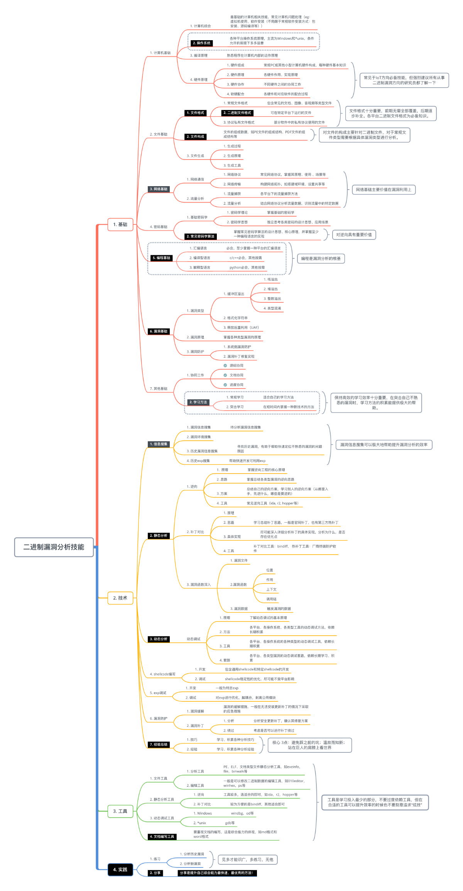

# 二进制漏洞分析技能脑图

url: https://bbs.pediy.com/thread-266137.htm

简单总结二进制漏洞分析的个人认为需要掌握的技能表，由于本人才疏学浅，技术积累存在盲点，**希望各位二进制漏洞分析的大师傅多多提出意见，大家一起来丰富该脑图**，为看雪中想从事二进制漏洞分析的新人朋友提供一点建议。

 

现对其中部分内容做简单说明：

1. 重视基础

   二进制方向十分看中基础的牢固程度，因此在前期最好打牢基础，厚积而薄发，在后续的发展中才能快速进步。

2. 多实践

   实践出真知，唯有多练习才能学到更多。

3. 重视分享

   分享真的可以快速提升研究员的综合能力，在技术能力之外，有很多其他能力也决定了你的发展空间。

4. 重视文档

   不管是开发文档、分析文档、协同文档，现在基本都是团队作战，一定保证文档的质量，提升协同效率。

   