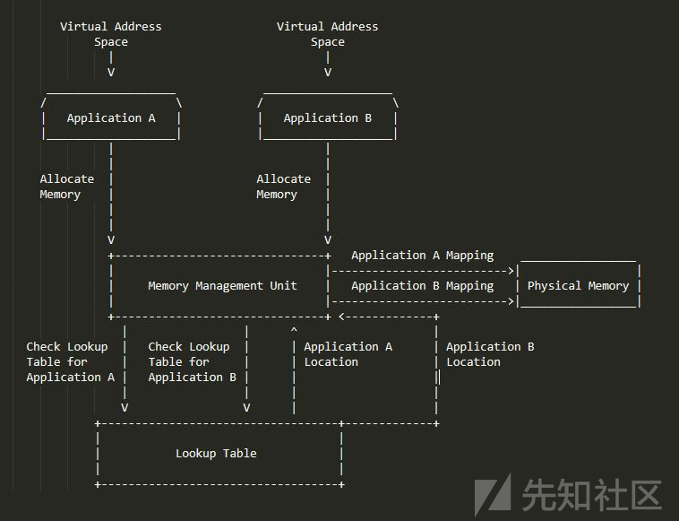
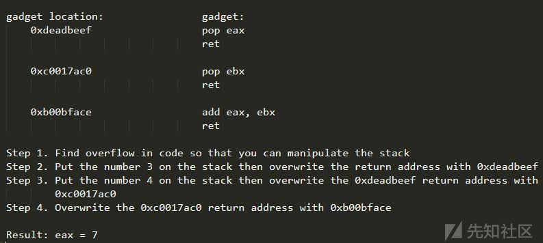

# 白话二进制漏洞攻击方式第一部分

翻译自：https://hackernoon.com/binary-exploitation-eli5-part-1-9bc23855a3d8

# **0x00-前言**

在本系列文章中，我将详细介绍不同类型的二进制漏洞，解释它们是什么，它们如何工作，它们背后的技术以及一些防御他们的手段。在本系列文章中，我将尽力用任何人(从初学者到1337 h4x0r(hacker))都能理解的方式解释这些攻击，防御，技术和概念。
请注意：同时我将添加一些关键的必备知识部分，希望对这些攻击做出更多技术性的解释来帮助我们更容易理解，但本系列文章将不会介绍精通二进制漏洞攻击方式这个领域的所有信息/概念/技术。
本文将介绍以下内容：
0×01.必备知识：应用程序内存
0x02.必备知识：堆栈
0x03.必备知识：函数调用和返回
0x04.攻击：堆栈缓冲区溢出
0x05.攻击：return-to-libc(ret2libc)攻击

# **0x01-必备知识：应用程序内存**

执行程序时，应用程序会被加载到内存中，但是计算机内存是有限的，因此，在将内容加载到内存时，必须非常小心它们是否会覆盖其他的应用程序。因此，计算机使用一种名为虚拟内存的概念，可以使用早期的21世纪早期电视节目Drake and Josh的场景来完美地总结，其中Drake和Josh在寿司店的工作是将寿司装到盒子里：
在这个场景中，Drake和Josh的这份工作需要他们将通过传送带传来的寿司装进盒子里。此外，虽然所有寿司盒子看起来完全相同，但至关重要的每个盒子只能包含一种寿司。
那么，让我们分解这个类比并将其与虚拟内存的概念联系起来：
**寿司传送带：**正如我上面所说，计算机必须非常小心和准确地将应用程序数据放在内存中，以免被覆盖。虽然计算机可以简单地将应用程序小心地放在物理内存中，但这最终会导致问题，因为应用程序片段会迅速填满整个空间。在上面的例子中，可以将各个寿司看作应用程序分配的应用程序片段或内存块，而整个寿司集合（每个盒子装6个寿司）可以看作应用程序本身。
**Drake和Josh：**为了避免单种的寿司填满传送带的问题，Drake和Josh将它们装进单独的盒子里，然后允许它们沿着传送带向下移动。就像Drake和Josh一样，您的计算机也会将应用程序组织并设置到容器中，叫做虚拟内存位置。这些虚拟内存位置（或虚拟地址空间）让应用程序相信它可以完全控制整个内存范围。但是，当应用程序调用某个位置或尝试在其虚拟地址空间内分配内存而不是被授予对任意物理内存的访问权限时，计算机CPU（中央处理单元）中非常重要的一小块硬件称为MMU （内存管理单元）将应用程序的调用的位置映射到物理内存的特定区域，并帮助进行任何的内存操作。此内存映射允许计算机通过集中的查找表的方式来组织和处理具有动态内存要求的多个应用程序。

同样需要注意的是虽然应用程序的所有代码都包含在其虚拟地址空间中，但应用程序通常使用动态链接库（DLL），例如libc或kernel32。这些DLL只是外部（不存储在应用程序的地址空间中）系统应用程序或从自定义应用程序中导入的。以下面的代码为例：

正如您所看到的，在这个6行程序中，我实际上没有定义printf是什么。但是，这个程序仍然没有问题的输出“Hello World”。 这是因为printf函数是libc中定义的系统函数，它是标准的C库。在编译过程中，libc从外部链接到可执行文件。在Linux系统上，您可以使用ldd命令查看程序的共享库依赖项。

如果您正在看上面的截图并想知道0xb7e99000是什么意思，它是内存中libc库的地址。内存地址以十六进制格式表示。请[单击此处](https://www.khanacademy.org/math/algebra-home/alg-intro-to-algebra/algebra-alternate-number-bases/v/hexadecimal-number-system)以获取有关十六进制的更多信息。

# **0x02-必备知识：堆栈**

堆栈是一个大型数据结构，用于在运行时存储应用程序信息和数据。可以通过以下类比简单地解释堆栈的功能：
鲍勃是一家高档餐厅的洗碗工，每天晚上鲍勃都有一堆盘子要洗。此外，整晚上一旦有桌子被清理，就将有更多的盘子添加到鲍勃的洗碗池里。如果鲍勃从一堆盘子中取出不是顶部的盘子，那么这个盘子以上的盘子都会掉落并且摔坏。
现在不是鲍勃和洗碗池而是一台计算机和一堆数据对象。每当数据压入到堆栈，它就会被添加到堆栈的顶部，无论何时数据弹出堆栈都从堆栈的顶部移出。也就是后进先出（LIFO：Last In First Out）的机制。
程序使用堆栈来保存各种各样的东西，比如函数指针（函数在内存中的位置）和变量。

# **0x03 - 必备知识：函数调用和返回**

看看下面的代码：

在此代码段中，我们看到定义add函数需要2个整型参数A，B。在主函数中，我们调用add函数，将1传入到A,2传入到B。如果我们将这些代码分解为它的底层机器语音的代码，我们会看到：

如您所见，当使用参数调用函数时，程序首先将两个参数都压入堆栈，然后执行调用语句。这个调用语句重定向到程序指令指针（指令指针就像你用来跟踪你正在读取哪个单词的小铅笔。指令指针总是指向即将执行的指令（即将要执行的指令））到被调用函数的地址。但是，在导航到被调用函数之前，call语句将其下面的一条指令的地址推送到堆栈，这样当添加函数返回时，它就会知道从哪里开始继续处理。函数应该返回的位置的地址称为函数返回指针。

# **0x04 - 攻击：堆栈缓冲区溢出**

在深入了解堆栈缓冲区溢出及其工作原理的技术细节之前，让我们先看一下快速，易于理解的类比：
过去爱丽丝和鲍勃经常约会，但爱丽丝最终与鲍勃分手了。随着时间的推移，爱丽丝继续生活，但鲍勃无法从极度的悲伤中走出来。现在，爱丽丝准备嫁给罗伯特哈克曼，他是鲍勃的情敌。鲍勃变成了一个令人毛骨悚然的怪人，他通过秘密访问爱丽丝的电子邮件帐户，监视爱丽丝的所有婚礼计划。鲍勃看到爱丽丝聘请了一位著名的婚礼蛋糕设计师，设计师希望爱丽丝根据自己的口味偏好修改部分食谱。设计师给爱丽丝一个推荐的成分列表，但他说他可以做任何她想吃的。Bob打开了设计师电子邮件附带的文件，发现食谱的自定义行看起来像：
...然后，我们将通过添加______为糖霜添加味道。在那之后，我们将添加一些巧克力....
Bob注意到如果你在行中输入“Banana”，文本将如下所示：
...然后，我们将通过添加香蕉来增加糖霜的味道。在那之后，我们将添加一些巧克力......
但是，如果Bob将“草莓”输入该行，则文本将如下所示：
...然后，我们将通过添加草莓来增加糖霜的味道，我们将添加一些巧克力......
鲍勃意识到这将是破坏爱丽丝婚礼的完美方式，他所要做的就是用他恶心的版本覆盖其余的食谱！在爱丽丝的婚礼当天，设计师揭开他制作的蛋糕发现它是用冷冻蛋黄酱制成并且被虫子覆盖着的！
堆栈缓冲区溢出（就像Bob的攻击一样）会覆盖开发人员不打算覆盖的数据，从而可以完全控制程序及其输出。
那么，现在让我们在现实世界中看到它。看一下来自exploit-exercises.com的以下代码：

在上面的函数中，我们看到创建了一个名为buffer的字符类型数组，其大小为64.然后，我们看到modified变量设置为0和以buffer变量作为参数调用的gets函数。最后，我们看到一个IF语句，检查modified是不是0.显然，在这段代码中没有地方把modified这个变量设置为0以外的任何数，那么我们如何更改呢？
好吧，我们先来看看获取功能文档：

如您所见，gets函数只接受用户输入。但是，该函数不检查用户输入是否实际适合我们存储的数据结构（在本例中为缓冲区），因此，我们能够溢出数据结构并影响堆栈上的其他变量/数据。此外，由于我们知道所有变量都存储在堆栈中，并且我们知道modified变量的值是多少（0），我们所要做的就是输入足够的数据来覆盖modified变量。我们来看一个图：

如您所见，如果恶意用户输入太多文本，他们可以覆盖modified变量和堆栈上的任何其他内容，包括返回指针。这意味着如果恶意代理能够控制程序堆栈，它们实际上可以控制整个程序并使其执行任何他们想要的操作。他们可以简单地将堆栈上函数返回指针覆盖掉并且指向携带某个恶意payload的自定义指针。

# **0x05.攻击：return-to-libc(ret2libc)攻击**

在我们讨论return-to-libc（ret2libc）攻击之前，让我们花点时间更深入地讨论libc。
(从第0x01节)我们知道，libc是标准的C库。这意味着它包含C编程语言中包含的所有通用系统函数。现在，如果恶意用户能够控制程序执行其中一些功能，该怎么办？
嗯，这就是ret2libc。对于ret2libc的后果的一个完美类比可能是[黑客帝国系列](https://www.imdb.com/title/tt0133093/)。回想一下经典的“Guns, lots of guns”场景。操作员TANK，能够完全绕过并重新编译黑客帝国，使得大量枪支出现整个空间。
你可以想到像这样返回libc，我们能够控制黑客帝国（标准C库）并使它做任何我们想做的事情。
在它的基础上，ret2libc攻击实际上是基于堆栈缓冲区溢出。回想一下我在第0x04节末尾所说的内容，如果恶意代理可以覆盖堆栈上的数据，它们可以简单地覆盖返回指针以指向libc中的特定函数，并通过它传递任何payload必要的参数。
用于ret2libc攻击的最常见功能之一是系统函数。我们来看看它的文档：

如您所见，system命令只执行shell命令（shell是linux命令行）。此外，如果我们读上面的描述，我们可以看到system只执行/bin/sh -c <command>(/bin/sh是实际的shell命令)，并且命令通过参数传递给函数。
因此，我们所要做的就是获取易受攻击的程序机器的命令行访问权限，首先将“/bin/sh”作为参数推送到堆栈，然后将函数返回或调用指针替换为系统函数的内存地址，以便/bin/sh作为函数参数被调用，最后启动shell并授予我们对系统的完全访问权限。

# **0x06 - 第1部分结论**

在本文中，我们讨论了：
1.虚拟内存以及应用程序如何在内存处理
2.动态链接库和libc
3.堆栈
4.如何调用函数以及函数返回的工作机制
5.堆栈缓冲区溢出
6.返回libc（ret2libc）攻击
我希望这篇文章很有帮助。

# 白话二进制漏洞攻击方式第二部分

翻译自：https://medium.com/@danielabloom/binary-exploitation-eli5-part-2-8fd71bf214b9

“ Wait a minute. Using an RX modulator, I might be able to conduct a mainframe cell direct and hack the uplink to the download.” — [Hackerman, Kung Fury](https://www.youtube.com/watch?v=1uvr7CJazqE)

# **0x00 - 前言**

本文是白话二进制漏洞攻击方式系列文章的第二部分。
在整篇文章中，我们将介绍：
0x01 - 必备知识：权限和异常处理
0x02 - 防御：Stack Canaries
0x03 - 攻击：格式字符串漏洞
0x04 - 攻击：SEH Overwrites
0x05 - 防御：DEP/NX
让我们开始吧！

# **0x01 - 必备知识：权限和异常处理**

随着您越来越多地使用计算机，您可能会经常听到Kernel(内核)和userland(用户态)这两个术语。如果我们尝试搜索内核的定义，我们会发现：
*内核是操作系统的核心，可以完全控制系统上的所有内容（处理器，内存，芯片等）。每当程序需要做任何事情（即写入文件，打开网络连接等）时，它都会暂时将对用户空间处理的控制权交给内核。*
虽然这个定义让我们对内核的内容有了很好的理解，但让我们快速看看我的第五篇文章[Explain Spectre and Meltdown Like I'm 5 ](https://hackernoon.com/explain-spectre-and-meltdown-like-im-5-494a6ba61061)的解释：
*每当蝙蝠侠和正义联盟的其他成员在与超级罪犯作战时，阿尔弗雷德（蝙蝠侠的管家）（内核）就会控制蝙蝠侠的基地（处理者），这样他能够提供重要信息并帮助正义联盟获胜。当正义联盟击败坏人时，蝙蝠侠解除并收回了阿尔弗雷德的控制权。*
为了减轻负担，内核是操作系统为您的应用程序完成所有繁重的工作（即内存管理等）的后端。而另一方面，用户态是常规应用程序运行内存空间。就像蝙蝠侠和正义联盟一样，用户态应用程序在需要特权信息时将控制权移交给内核（阿尔弗雷德）。
这种权限分离的方式在计算机中大量使用。然而，虽然蝙蝠侠和正义联盟只有两类特权，但计算机有4个独立的“戒指”特权。

如您所见，应用程序在最低权限环中运行。但是，显然有时应用程序需要访问某些特权信息或功能（即建立网络连接，内存管理功能等）。在这种情况下，应用程序将使用称为syscalls的特定函数，它们充当不同特权环之间的桥梁。
形容特权戒指的一种简单方法可能是视频游戏中的等级：
为了提高整个游戏中的一般能力（无论是升级护甲或武器，进入不同的世界，还是最终从[尖刺的乌龟身上拯救公主](https://www.mariowiki.com/Bowser)），玩家必须通过不同的关卡。如果玩家试图跳过一个级别，他/她就没有足够的力量或资源在他们跳到的关卡中击败BOSS！ 他们会失败！

当用户态应用程序尝试访问特权信息时，应用程序将失败并出现异常。这意味着应用程序将崩溃并输出崩溃报告。除了尝试从非特权（用户空间）环境访问特权内存或函数之外，由于许多原因，程序可能都会因异常而失败。例如，如果一个程序试图将某个数据除以0（我们都知道不能这样做），程序将失败并抛出ArithmeticException的异常。
现在，虽然简单地理解程序可能失败的原因很重要，但我们需要讨论程序失败时实际发生的情况。这就是结构化异常处理（SEH）的用武之地。在我们讨论结构化异常处理程序是什么以及它们如何工作之前，让我们以[夺宝奇兵](https://en.wikipedia.org/wiki/Indiana_Jones_(franchise))为例：
在1981年的电影“夺宝奇兵之法柜奇兵”中，琼斯和他的团队继续寻找失落的约柜方舟。沿着他的路线，琼斯和他的团队遇到了许多陷阱，例如毒镖和巨石，这些陷阱是由秘密的压力板或开关触发的。琼斯和他的团队必须努力生存通过所有这些陷阱，以实现他们的目标。
在夺宝奇兵之法柜奇兵中，琼斯和他的团队必须通过整个地牢和洞穴中设置陷阱。这些陷阱是在琼斯出生前几年设计的，用来保护这次冒险的中心的金色雕像。同样，程序有各自的陷阱，从权限不匹配和访问拒绝到逻辑和算术错误，程序有很多方法可以防止（处理）错误或错误的操作。此外，程序员能够通过函数来实现自定义异常处理程序如try-catch代码块，利用try尝试代码块，再使用catch捕捉处理他们时发生的任何错误或异常。
在许多操作系统中（我们将更具体地讨论Microsoft的结构化异常处理），正好有一个系统来处理最初未被异常处理程序捕获的任何异常。也就是说，如果捕获到错误但未正确处理错误，操作系统将提升异常处理的方式将捕获的异常重定向到单独的结构化异常处理程序。如果异常继续无法正确处理，应用程序将崩溃。

另外需要注意的一点是，当程序因异常而失败时，程序会非常短暂地获得对更高级别的访问权限，因为系统会检索有关崩溃的信息。

# **0x02 - 防御：Stack Canaries**

在[上一篇文章](https://xz.aliyun.com/t/3980)中，我们讨论了堆栈缓冲区溢出以及能够覆盖堆栈上数据的危险（或利益，取决于您在攻击中所处的角色）。多年来，为了防御这些攻击，已经在编译器和操作系统中执行了许多类型的防御。在本节中，我们将讨论Stack Canaries，它是一种非常常见且极其基本的溢出防御形式。
Stack Canaries实际上是参考the canary in a coal mine（煤矿中的金丝雀）命名的。
*在1913年左右，John Scott Haldane建议在深矿中使用金丝雀或其他温血动物以检测一氧化碳。理论认为，由于鸟类的身体对一氧化碳比人类的敏感度高得多，如果矿工看到鸟儿不行了，他们就会知道空气被一氧化碳污染了，因此，在受到气体的影响之前就可以离开洞穴了。*
就像煤矿中的金丝雀一样，Stack Canaries会警告程序有些事情是不对的，允许程序在任何恶意操作发生之前退出。这是通过在为局部变量分配空间之后在堆栈上放置一个长随机数并在函数返回之前检查长随机数来完成的。如果堆栈缓冲区溢出攻击覆盖堆栈的canary，程序将退出。

虽然Stack Canaries是针对溢出攻击的常用性防御，但它们远非无敌。我们接下来看看一些攻击。

# **0x03 - 攻击：格式化字符串漏洞**

击败Stack Canaries的一种简单的方法是找出它们在堆栈中的位置和随机值是什么，这样你就可以在溢出攻击期间完全覆盖Canaries。但是，正如我之前提到的，Stack Canary值是大的随机数，因此，要“知道”堆栈canary的位置就非常困难。此外，在为应用程序发掘漏洞时，您无法调试（在另一个特殊的程序中运行上述程序并在运行时通过控制其操作，显示数据和信息）这个程序并简单的查看堆栈/手动搜索Canaries。那么我们究竟如何检索这些信息呢？
好吧，这就是格式字符串漏洞的来源。在我们讨论实际漏洞之前，让我们先谈谈格式字符串是什么。
在许多编程语言中（虽然我们将在本文中专门讨论C），但有一个名为printf（或类似的东西）的输出函数。printf是用于格式化和打印数据的函数。要使用此功能，程序员输入：
printf（“格式”，变量）
例如，如果程序员想要打印出整数变量intvar的值，他们只需执行：
printf（“％i”，intvar）
在上面，％i被称为格式说明符，它只是指定要打印的变量的格式。虽然有许多有用的格式说明符，例如％s，它指定字符串值（一般文本，即“hello”，“123”等等（只要是双引号（“”）中的文本））。但是，在这种情况下，对我们来说最重要的两个格式说明符是：
％x  - 十六进制值的格式说明符
％n - 一种特殊格式说明符，它允许我们将实际的数据写入变量，而不是从变量中读取数据
你们中的一些人可能知道我要说什么了，但让我们来看一个小例子：
*Bob刚刚通过UHB注册了一些网上银行（代表UnHackable Bank）当Bob进入UHB网站时，他看到了“输入你的账号”提示。当Bob输入他的账号时，银行会显示他的账户信息，他可以自由查看并转移他的钱。有一天，鲍勃登录了银行的网站，但当提示“输入你的账号”时，Bob意外的输入了错误的账号。网站没有提示“不正确的帐户”，而是进入了另一个客户的帐户，并能够查看并转移这个客户的钱。*
能够显示任意信息是一个巨大的安全漏洞。如果能够显示和操纵任意信息则是一个灾难性的安全漏洞，而格式化字符串漏洞正是如此。
如果用户能够直接将字符串输入到printf语句而不进行任何类型的检查，他们只需输入％x即可显示堆栈上的信息，因为正如我们从上一篇文章中所知，堆栈上存储了变量和其他数据。此外，如果恶意用户继续输入％x，最终可能会泄漏极其敏感的信息，例如异常处理程序指针（重定向进行处理错误的函数的内存地址），甚至是Stack Canaries。
此外，能够从内存中查看任意数据是一个大问题，但如果恶意用户具有对printf调用的完全访问权限，他们也可以使用％n这种格式说明符覆盖数据。这意味着恶意用户可以复制并使用自己想要的值覆盖Stack Canaries，然后执行ret2libc攻击（在第一篇文章中讨论过）或覆盖函数返回指向其他恶意payload的指针。
我们来看一个小例子：

让我们将上图分解为几个部分。
*请注意：在上面的示例中堆栈被删除了，并没有显示*
首先看代码：

首先，我们设置了两个字符串类型变量inputvar和stackvar 。
接下来，我们通过readuserinput函数读取用户的输入，并将所述输入存储在inputvar变量中。然后，我们使用格式说明符为％s的printf语句并传入inputvar。
上述代码中的漏洞源于用户能够无需检查格式说明符直接影响printf语句。
现在，看看上面的整个攻击图。如您所见，当用户输入常规的，非格式说明符时，输入不会发生任何特殊情况。但是，当用户输入“ ％x％x％x”时，程序输出堆栈的内容（请注意：％x以十六进制格式输出堆栈的内容。在此示例中，我只使用基本文本和数字，以便它更容易理解）。此外，如果用户使用％n来覆盖堆栈的cookie和返回指针，他/她将能够将程序重定向到恶意的payload。

# **0x04 - 攻击：SEH Overwrites**

与ret2libc攻击非常相似，SEH（结构化异常处理程序）Overwrites是覆盖指向不同函数指针的攻击。但是，虽然ret2libc攻击基于覆盖返回指针以将程序重定向到特定的libc函数，SEH Overwrites通过覆盖异常处理程序指针函数，然后触发异常，以便程序重定向到我们恶意的payload。
你可以想象SEH溢出类似保险欺诈：
*Bob拥有一艘有大量保险单的船，保单的价值远远超过了这艘船本身。Bob作为罪犯，他决定试图通过燃气泄漏把船炸飞来欺骗保险公司，这样他就可以索赔保险金。经过几周的策划，Bob炸了他的船。经过一番调查后，保险公司无法明确证明Bob的船燃气泄漏但实际上没有爆炸，因此支付了索赔。*
与Bob的保险欺诈非常相似，SEH Overwrite攻击强制异常处理程序指向到恶意用户的payload，而不是正确的异常处理程序。这些攻击可以利用格式字符串漏洞或一般堆栈缓冲区溢出攻击来完成，因为异常处理程序指针也是存储在堆栈中的。要执行此漏洞，恶意代理需要覆盖异常处理程序指针以指向恶意payload，而不是实际的异常处理程序，然后用户需要触发异常。一旦捕获到该异常，它将被重定向到恶意函数，然后恶意函数可以丢弃异常并执行它的payload。

# **0x05 - 防御：DEP/NX**

到目前为止，您可能已经意识到不受限制地访问堆栈是一件非常危险的事情。此外，即使Stack Canaries充当防御，恶意用户也可以在格式字符串漏洞的帮助下轻松地重定向程序的执行，甚至可以轻松地将恶意函数和功能添加到程序中。然而，随着我们在这个系列的进展，你会很快发现虽然有很多攻击，但也有很多防御措施。在本节中，我们将谈论Data Execution Prevention(DEP)和Non-Executable memory(NX)。
能够联想到DEP和NX的好方法可能是原来的[点格棋](https://zh.wikipedia.org/wiki/點格棋)游戏。
在点和方框中，两个玩家以点网格开始。在每个回合中，玩家可以绘制一条连接两个点的线。两个玩家会用红色（玩家一）和绿色（玩家二）在点中着色，当画线使一个正方形封闭时，在区域内画一该玩家符号，表示占领。在游戏结束时，哪个玩家占领的区域大就会获胜。
现在，想象一下你脑袋里的那个盒子（或者从wikihow看下面的图片）：

我们假设每个正方形都是计算机上的内存区域，而不是点和框的网格。在红色区域是允许数据执行的，绿色区域则不允许数据执行。
这正是DEP和NX的意思。它们只是阻止在不同的内存区域中执行写入内存操作（即恶意代码）的机制。例如，大多数现代程序在堆栈上启用了DEP，因此恶意用户无法通过堆栈执行payload。
在理想的世界中，计算机可以在所有内存使用W^X(write xor execute)策略，但是有几个很大的原因无法这样做。W^X策略是一种内存可以专门写入或可以独占执行的策略，但是不能两者同时进行。由于多种原因所有存储器中部分不能按照这个策略进行工作，这些将在以后的文章中介绍。但是对于某些内存区域例如堆栈，DEP和NX的使用让使用这个策略成为可能。

# **0x05 - 第2部分结论**

在本文中，我们讨论了：
0×01.内核和特权环
0x02.异常和结构化异常处理程序
0x03.结构化异常处理程序覆盖攻击
0x04.格式化字符串和printf命令
0x05.格式字符串漏洞和利用
0x06. DEP/NX
我希望这篇文章很有帮助。请密切注意本系列的下一部分，我们将讨论更多的攻击和防御。
如果您还没有开始阅读，请阅读本系列的第一篇文章：
[白话二进制漏洞攻击方式第一部分](https://xz.aliyun.com/t/3980)

点击收藏 | 0关注 | 1

# 白话二进制漏洞攻击方式第三部分

翻译自：https://medium.com/@danielabloom/binary-exploitation-eli5-part-3-d1872eef71b3

“To err is human… to really foul up requires the root password.”
0×00 - 前言
本文是白话二进制漏洞攻击方式第三部分。
在整篇文章中，我们将介绍：
0x01 – 必备知识：寄存器
0x02 – 必备知识：堆和内存的分配
0x03 - 攻击：面向返回编程（ROP）
0x04 - 防御：地址空间布局随机化
0x05 - 攻击：Heap Spraying（堆喷射）
让我们开始吧！
**0x01 - 必备知识：寄存器**
在前面的文章中，我们讨论了诸如堆栈和汇编调用规范之类的概念。在本节中，我想扩展讨论一个程序存储数据的功能，并为您提供一些重要的汇编命令和更详细的概述。
如前文所述，堆栈是每个程序的地址空间内的存储区域，用于存储数据（即变量，存储位置等）。虽然堆栈可以看作程序的背包，每个程序也都有自己的口袋称为寄存器。寄存器是存储器的小区域，可以根据寄存器存储结构化或任意信息。存储结构化或任意信息的意思是某些寄存器存储特定类型的信息，例如ESP寄存器，它被称为堆栈指针并且是专有的在任何时刻都存储堆栈顶部的地址，而其他如EBX寄存器可以存储任意信息。当存储数据到寄存器中时，你必须通过MOV组件命令移动数据到寄存器中：

除了简单地存储数据之外，寄存器也可用于执行一般操作。我们来看一个例子：

对于那些可能还没有完全理解寄存器的人来说，让我们来看看我在本节前面提到的关于寄存器是程序口袋的这个概念。
*想象一下，你准备好休假一天。你穿着牛仔裤，T恤衬衫，背着背包。在你走之前，你需要收拾你的东西。你把钱包放在一个口袋里，把你的钥匙放在一个口袋里，把你的手机放在一个口袋里，把你的太阳镜放在一个口袋里，然后把不能放入口袋里的所有东西放入背包里。*
程序与此非常相似，虽然它们可以将任何数据存储在堆栈（背包）上，但寄存器（口袋）只能存储适合它们的数据。但是，程序可以更有效地从寄存器中检索数据而不是堆栈（尽管在现代计算机中，堆栈和寄存器之间的速度差异可以忽略不计）。

**0x02 - 必备知识：堆和内存分配**
我们现在讨论了两种存储数据的方法，堆栈和寄存器。这两个内存区域都非常适合存储普通变量，内存地址等。但是，如果你需要存储一些非常大的内容呢？或者如果你的程序需要比为堆栈分配的内存更多的内存呢？嗯，这就是堆的作用。堆只是内核为程序分配的一大块内存。如果堆栈是我们的背包，寄存器是我们的口袋，堆可以看作我们把东西放在晚上的房间里，你可能只需要房间的一个小角落来放置你的东西，但以防万一你需要更多空间时就可以随时分配到（更多的内存）。要在堆上分配内存，我们使用malloc函数。Malloc是一个C函数，可以分配所需的内存。例如，如果调用malloc(8)，程序将在堆上分配8个字节。malloc最常见的实现方式是Doug Lea实现，它将每个分配块的块大小存储在块之前的字节中。
让我们看一下内存分配，举个简单的例子：
*鲍勃在一家工厂工作。鲍勃被要求为A部分留出3个螺丝，为B部分留出4个螺丝.鲍勃在一张纸上写下“3-A”和“4-B”，然后在纸上放下7个螺丝。现在，鲍勃已在同一区域为这两个部件分配了正确数量的螺钉。*
看到了吗？很简单吧！如果我想在堆上分配8个字节的内存，我使用malloc（8）将0x08放在位于分配区域的内存位置之前的空间中。这样，如果我们以后需要分配更多内存，程序只需获取堆的基地址并向其添加先前分配的空间0x08！十分简单！
**0x03 - 攻击：面向返回编程（ROP）**
在本系列文章的前面，我们讨论了Return-to-libc（Ret2libc）攻击，其中攻击者覆盖了一个返回变量并强制程序通过libc库执行系统命令。在本节中，我们将讨论面向返回的编程，它可以被视为ret2libc的更高级版本（尽管它通常根本不涉及libc）。在ROP攻击中，攻击者操纵返回调用以返回汇编代码中的不同段(称为gadgets)允许攻击者基本上完全控制程序的执行。例如，攻击者可以不断定位到不同的gadgets，以便在程序中创建后门，而无需实际操作任何代码或内存区域（不在堆栈或堆上直接执行）！
在我们进一步讨论如何完成此攻击之前，我们需要深入了解实际的gadgets。gadgets是在应用程序中找到的汇编代码段，以return语句结尾。

由于gadgets是非恶意的，编译器构建，并且作为您尝试利用的程序的一部分代码片段，攻击者必须做的就是找到它们(可以通过简单地拆解程序或通过像[Ropper](https://github.com/sashs/Ropper)这样的小工具查找程序来完成)然后将它们的地址放在堆栈上。通过构建一系列gadgets，并小心地操纵堆栈中的数据，攻击者可以在程序中编写完美的后门，或者根据需要做任何事情。
我们来看一个例子：

正如您所看到的，如果攻击者能够操纵堆栈中的数据，他/她可以简单地压入变量并覆盖返回地址然后使用他/她想要的程序！在上面的例子中，我们所做的只是让程序把3和4相加，以便eax寄存器等于7，但是如果不是那么简单的相加，你使用整个gadgets链将不同的数据块压入到堆栈上，最终落地在具有网络调用的gadgets上，这些gadgets可以从计算机中提取数据并将其发送到攻击者持有的服务器。
**0x04 - 防御：地址空间布局随机化（ASLR）**
在本系列文章的前面部分，我们讨论了DEP/NX作为对存储区域（如堆栈和堆）中代码执行的可行防御。然而，对于像ret2libc和Return Oriented Programming这样的攻击，我们很快就能够击败这种防御机制。所以现在，如果我们无法抵御因ROP攻击而被执行的代码，并且由于格式字符串漏洞我们无法确保stack canaries的防御能力，我们如何防御二进制利用攻击呢？那么如果我们每次打开程序时随机化了内存段的内容呢？这正是地址空间布局随机化。每次执行程序时，堆栈，堆，.text部分（存储汇编代码的地方）和其他内存部分都以随机偏移的方式放入内存中，这样，程序本身可以完美运行，攻击者无法获取堆栈中重要数据的内存地址，也不能在每次尝试利用可执行文件时在同一位置找到相同的gadgets。此外，随着内核地址随机链接的进一步实现，攻击者甚至无法自信地定位像libc这样的链接库，因为每次初始化链接时，库将以随机偏移的加载到内存中。
这听起来像一个完美的解决方案，对吗？嗯，是也不是。虽然没错，ASLR使得开发漏洞攻击更加困难，但是恶意代理是聪明和坚韧的。在接下来的部分中，我们将讨论可以击败ASLR的攻击。
**0x05 - 攻击：堆喷射**
所以在我们进入Heap Spray之前，我需要先说我实际上跳过了本系列文章中的堆溢出攻击。这是因为它们非常类似于堆栈缓冲区溢出，在堆溢出中，攻击者获得了将任意数据写入堆的能力，并且只要DEP/NX未启用，攻击者就可以将恶意代码写入堆。但是，正如上面的ASLR部分所述，即使攻击者可以将恶意代码写入堆中，他/她也无法执行它，因为在内存中的代码会根据程序将恶意代码置于堆中的不同位置（通过ASLR的实现随机化）。那么，我们将如何寻找和执行此代码？
那么，如果不是只将恶意代码写入堆中的特定区域，我们将它复制到整个堆上，然后尝试在庞大的堆中的任何地方执行，那该怎么办呢？嗯，这正是堆喷射。这几乎是概率问题-向墙上扔箭，最后总有一些会插上去！
让我们把它分解成一个更基本的例子：
*鲍勃是一个盲人飞镖球员。显然，如果鲍勃只是扔了一个飞镖，他几乎没有机会击中靶心（因为他甚至看不到靶！）但是，如果鲍勃投掷1000个飞镖，其中至少有一个必然会击中目标的中心。*
如果我们将恶意代码放在堆中一次，那么在指向单个内存地址时我们就不太可能找到它，但是，如果堆完全充斥着我们的恶意代码，我们最终肯定会遇到它！
请注意，在64位系统上，堆喷射远不如32位系统有效，因为在32位系统上，您可以使用恶意代码完全填满堆，而在64位系统上，堆非常大，即使你试图喷射堆，你可能仍然无法找到你的恶意代码。
**0x06 - 结论**
在本文中，我们讨论了：
0×01. 寄存器
0x02. 堆
0x03. 内存的分配
0x04. 地址空间布局随机化
0x05. 内核地址随机链接
0x06. 面向返回编程
0x07. 堆喷射
我希望这篇文章很有帮助。