# AES128加密-S盒和逆S盒构造推导及代码实现

文档引用了《密码编码学与网络安全--原理和实践》里边的推导过程，如有不妥，请与我联系修改。

 

文档《FIPS 197》高级加密标准AES，里边有个S盒构造，涉及到了数论和有限域的一些概念，一脸懵逼，所以贱贱的研究了下，花了好久时间。

在网上找的S盒构造的详细步骤总是缺了点什么，要么步骤不详细，要么只贴了程序，难以搞清楚由几个基本概念一步一步推导出最终的S盒。最后，还是《密码编码学与网络安全--原理和实践》这本书讲得比较详细。教材果然还是经过精雕细琢过的，符合大部分人的认知过程。

这篇文章其一是记录下来这个学习步骤，其二是希望我的这篇能够更详细些。 

 

先贴出来《FIPS 197》中对S盒构造的描述步骤:

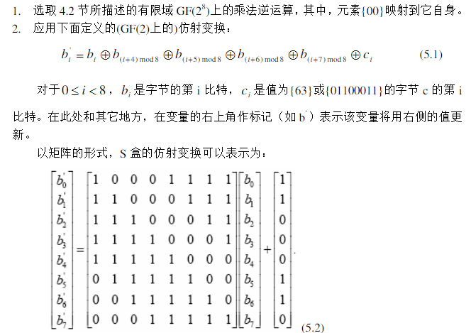

 

就这两条。实际上是三个步骤，《密码编码学与网络安全--原理和实践》教材里会讲得更详细些。

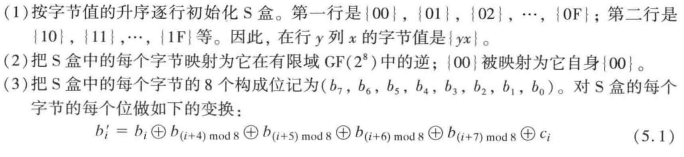

 

一下都按照《密码编码学与网络安全--原理和实践》教材里边的三个步骤进行推导。

步骤1、3都比较浅显，即使没有数论和有限域概念，一样可以编程写出来。

步骤一：

根据行标号和列标号组合成16X16的二维数组，行标号作为高4bit，列标号作为低4bit;

生成代码如下：

[](javascript:void(0);)

```
1     for(i=0;i<0x10;i++)
2     {
3         for(j=0;j<0x10;j++)
4         {
5             s_box_ary[i][j] = ((i<<4)&0xF0) + (j&(0xF));
6         }
7     }
```

[](javascript:void(0);)

代码产生的数组：

[](javascript:void(0);)

```
 1     0  1  2  3  4  5  6  7  8  9  A  B  C  D  E  F
 2  0  0  1  2  3  4  5  6  7  8  9  a  b  c  d  e  f
 3  1 10 11 12 13 14 15 16 17 18 19 1a 1b 1c 1d 1e 1f
 4  2 20 21 22 23 24 25 26 27 28 29 2a 2b 2c 2d 2e 2f
 5  3 30 31 32 33 34 35 36 37 38 39 3a 3b 3c 3d 3e 3f
 6  4 40 41 42 43 44 45 46 47 48 49 4a 4b 4c 4d 4e 4f
 7  5 50 51 52 53 54 55 56 57 58 59 5a 5b 5c 5d 5e 5f
 8  6 60 61 62 63 64 65 66 67 68 69 6a 6b 6c 6d 6e 6f
 9  7 70 71 72 73 74 75 76 77 78 79 7a 7b 7c 7d 7e 7f
10  8 80 81 82 83 84 85 86 87 88 89 8a 8b 8c 8d 8e 8f
11  9 90 91 92 93 94 95 96 97 98 99 9a 9b 9c 9d 9e 9f
12  a a0 a1 a2 a3 a4 a5 a6 a7 a8 a9 aa ab ac ad ae af
13  b b0 b1 b2 b3 b4 b5 b6 b7 b8 b9 ba bb bc bd be bf
14  c c0 c1 c2 c3 c4 c5 c6 c7 c8 c9 ca cb cc cd ce cf
15  d d0 d1 d2 d3 d4 d5 d6 d7 d8 d9 da db dc dd de df
16  e e0 e1 e2 e3 e4 e5 e6 e7 e8 e9 ea eb ec ed ee ef
17  f f0 f1 f2 f3 f4 f5 f6 f7 f8 f9 fa fb fc fd fe ff
```

[](javascript:void(0);)

本文重点叙述步骤2的推导。

步骤二：

这里边有三个概念：有限域、GF(2^8)、逆。

有限域：我的理解是，有一些元素构成了一个集合，集合中的一个或多个元素，进行某种运算，所得的结果仍然是集合中的元素。 元素，可以是具体的数字，也可以是字母，或是表达式，等等；某种运算，可以是加减乘除，或者逻辑运算，或者求余，或者是这几种运算的组合，等等。 这个定义当然很不严格，但是我觉得对于理解这个S盒推导够用了。

 

GF(2^8)：GF()是代表一个有限域，2^8=256，是指这个有限域内的元素的个数，即256个。

举个是有限域的集合的例子吧。

GF(7)={0，1，2，3，4，5，6}，它是关于任意两个元素的相加/乘积模7运算的有限域。特点是任意两个元素相加/乘积，对7取余数，这个余数仍然在GF(7)内。

截取《密码编码学与网络安全--原理和实践》中的例子：

> 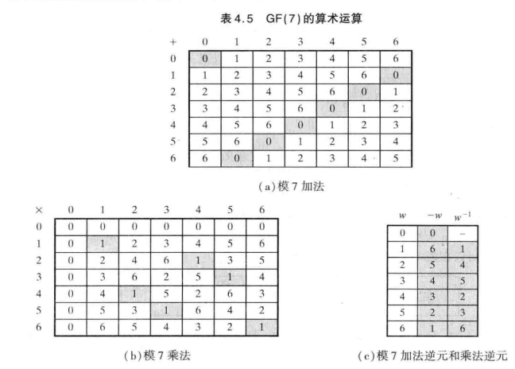
>
>  

 此外，这个GF(7)的7叫做阶，特点是阶与域内的元素都互素（互质）。

在计算机中，一个字节是8位，0~255刚好是一个字节所能代表的所有数字，但是呢，GF(256)，256对于0~255内的元素并不是每个都互素（互质），当以251为模时，251~255又不能用，造成浪费，所以不能直接使用上边的计算形式。但是我们还得必须用0~255这256个整数作为一个集合，通过某种运算构成有限域，所有只能把研究重点放在“某种运算”上。可能是为了区分GF(256)，所以用GF(2^8)。

 

逆：乘法逆元。定义：GF(p)，  (a)、(b)、(a-1)都在GF(p)内，其中(a)、(a-1)互为乘法逆元，则有：[(a) X (a-1)] mod p = 1；

 

第二个步骤，就是 在步骤一得到的数组基础上，对每个元素 在 GF(2^8)有限域上求解出乘法逆元，在原位置替换该元素。

如何求解有限域上的逆元？《密码编码学与网络安全--原理和实践》中从欧几里得算法开始做知识铺垫，到扩展欧几里得算法。我们可以得出求乘法逆元的一个程序上可实现的方法。

d=gcd(a,b)，d是a和b的最大公约数，或者叫最大公因子。求解步骤：

1、定义变量：r0, r1, r2

2、赋初值r0=a;r1=b;

3、求解r0、r1的余数：r3=r0 Mod r1;

4、更新变量：r0=r1;r1=r2;

5、从3开始重复，一直到求解的余数r1是0结束。

6、r0就是要求解的最大公约数。

```
long` `gcd(``long` `a, ``long` `b)``{``  ``long` `tmp;``  ``while``(b)``  ``{``    ``tmp=a;``    ``a=b;``    ``b=tmp%b;``  ``}``  ``return` `a;``}
```

欧几里得算法的关键是gcd(a,b)=gcd(b,(a mod b))；为什么能成立？

可以证明：

当a>b，就有，a=q1 * b + r1，r1 = a - q1 * b;

假设 d=gcd(a,b)，那么d分别是a和b的最大公因子，记作：d|a，d|b，所以：d|(a-q1 * b)=d|r1

所以有d=gcd(b,r1)=gcd(b, (a mod b));

《密码编码学与网络安全--原理和实践》里边讲解会更详细：

> 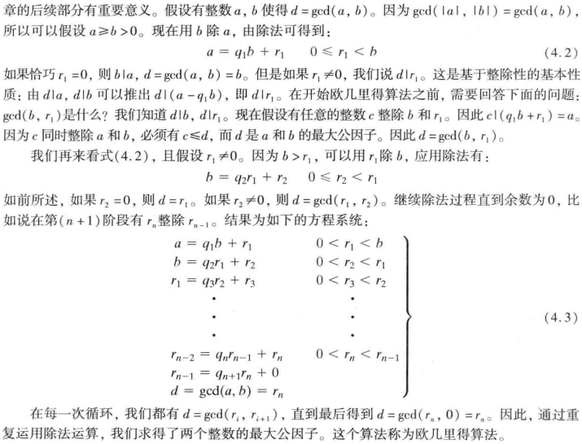
>
>  

 扩展欧几里得算法的计算步骤同欧几里得算法的步骤相似，由一个公式迭代计算，一直达到某个条件成立结束迭代，返回结果。

扩展欧几里得算法用来求解乘法逆元，为什么？

上边已经有了公式：[(a) * (a-1)] mod p = 1；

可以等效变换成：p * x + 1 = (a) * (a-1)

========>   - p * x + (a) * (a-1) = 1

 与ax+by=1的形式是不是很像？

与ax+by=gcd(a,b)=1的形式是不是很像？

gcd(a,b)=1,就是a、b互素即可。

可以看出，可以运用欧几里得算法的步骤计算乘法逆元，但是怎么计算呢？

这点我还是照搬《密码编码学与网络安全--原理和实践》里边的讲解步骤吧，我觉得不会比他讲得更好了。

> 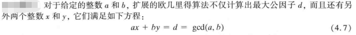
>
> 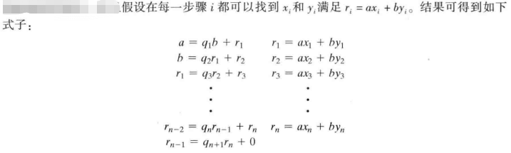
>
> 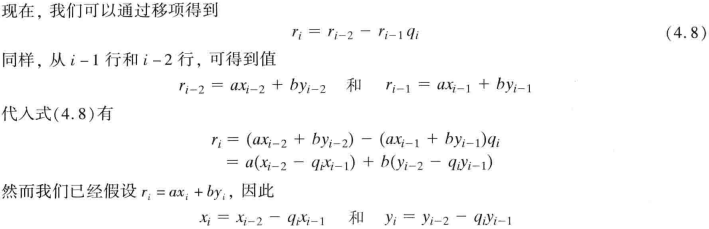
>
> 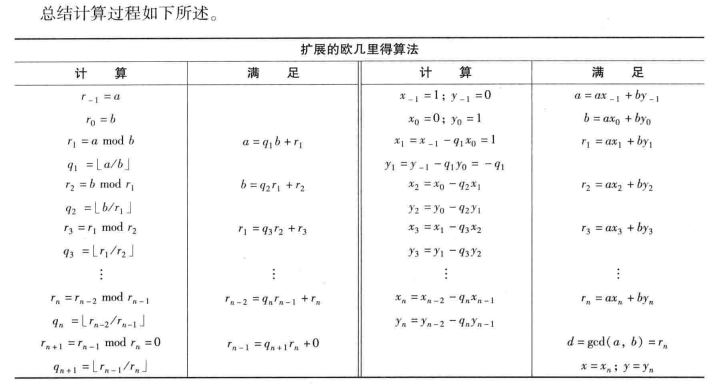

就是这样，初始条件：(R-1) = a; R0=b; (X-1)=1;X0=0;(Y-1)=0;Y0=1;

迭代步骤：Rn=(Rn-2) Mod (Rn-1)；Qn = [(Rn-2) /(Rn-1)]  {(Rn-2) /(Rn-1)的商}；Xn = (Xn-2) - (Xn-2) ；Yn = (Yn-2) - (Yn-2) 。

终止条件：Rn=1时，计算出来的Yn即是结果。

如果结果为负数，需要加上模值变为正数。

代码如下：

[](javascript:void(0);)

```
long multiplicativeInverse(long a, long b)
{
    long r0,r1,r2,q1,x0,x1,x2,y0,y1,y2;

    long d = gcd(a,b);
    if((d!=1)&&(d!=-1))
    {
        printf("a、b不互质\r\n");
        return -1;    
    }

    r0=a;
    r1=b;

    x0=1;
    y0=0;

    x1=0;
    y1=1;

    if((b==1)||(b==-1))
    {
        y2=y1;
    }

    while((r1!=1)&&(r1!=-1))
    {
        q1=r0/r1;

        r2=r0%r1;

        x2=x0-q1*x1;
        y2=y0-q1*y1;

        r0=r1;
        r1=r2;

        x0=x1;
        x1=x2;

        y0=y1;
        y1=y2;
    }

    if(y2 < 0)
    {
        y2=a+y2;
    }

    return y2;
}
```

[](javascript:void(0);)

 回归到GF(2^8)有限域，需要找到“某种运算”，使GF(2^8)有限域成立。这种运算是多项式除法运算。

多项式如下形式：

> 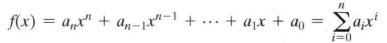

我们可以把GF(2^8)有限域内的每一个元素，按照下列方式写成多项式的形式：

设 字节a ∈ GF(2^8)，写成二进制的形式a=b7b6b5b4b3b2b1b0，用bn代表a的每一位，其中n是二进制数中的位置；

那么，bn当作系数，n作为变量x的指数；

可以把一个字节写成：

 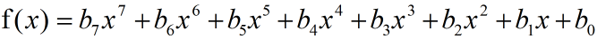

这种形式。

举例：

0x9A=(b)10011010，写成多项式形式：x^7+x^4+x^3+x。

多项式除法运算，计算规则：

1、遵循代数基本规则中的普通多项式运算规则；

2、系数运算遵循以2为模的加法和乘法运算；（原话是：系数运算以p为模，即遵循有限域Zp上的运算规则）；

3、如果乘法运算的结果是次数大于7(原文：n-1)的多项式，那么必须将其除以某个次数为8(原文：n)的即约多项式m(x)并取余式，对于多项式f(x)，这个余数可表示为：即r(x) = f(x) mod m(x)。

高级加密标准AES使用有限域GF(2^8)上的运算，其中即约多项式m(x)=x^8 + x^4 + x^3 + x + 1；

举例：

m(x)=x^8 + x^4 + x^3 + x + 1；

f(x) =x^6 + x^4 + x^2 + x + 1；g(x) =x^7 + x + 1；

f(x) * g(x) = (x^6 + x^4 + x^2 + x + 1) * (x^7 + x + 1)

​        = x^13 + x^11 + x^9 + x^8 + x^7

​                             \+ x^7 + x^5 + x^3 + x^2 + x

​                               \+ x^6 + x^4   + x^2 + x + 1

​       = x^13 + x^11 + x^9 + x^8 + x^6+ x^5 + x^4 + x^3 + 1

r(x) = [f(x) * g(x)] mod m(x)  =>  m(x) * q(x) + r(x) = f(x) * g(x)：

> 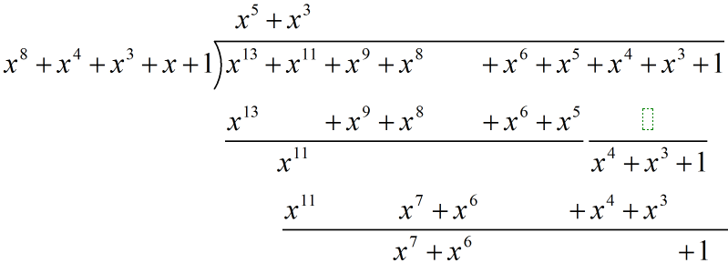
>
>  

 q(x) = x^5 + x^3；r(x) = x^7 + x^6 + 1。

上文已经讲到：扩展欧几里得算法用来求解乘法逆元。

 (b-1)*b mod a = 1；  => ax+by=1=gcd(a, b)

把a、b用多项式替代，形式如下：

b-1(x) * b(x) mod m(x) = 1  => m(x)v(x) + b(x)w(x) = 1 = gcd(m(x), b(x))

 直接引用上边求乘法逆元的步骤，用多项式直接替代数值计算：

重述如下：

1、把带求解的字节变换成多项式形式b(x);

2、初始条件：

(R-1) = m(x)；    R0=b(x)；

(v-1)(x)=1；      v0(x)=0；

(w-1)(x)=0；      w0(x)=1；

3、迭代步骤：

Rn(x)=(Rn-2)(x) Mod (Rn-1)(x)；

Qn(x) = [(Rn-2)(x) / (Rn-1)(x)]  即：{(Rn-2) /(Rn-1)的商}；

vn(x) = (vn-2)(x) - Qn(x)*(vn-2)(x) ；

wn(x) = (wn-2)(x) - Qn(x)*(wn-2) 。

4、终止条件：

Rn(x)=1时，计算出来的wn(x)即是结果多项式。

5、把wn(x)变换回字节。

上述步骤中，需要专门的多项式乘法、多项式除法、多项式求余运算的实现函数。

 多项式乘法函数：

[](javascript:void(0);)

```
//GF(2^8)的多项式乘法
uint16_t polynomialMutil(uint8_t a, uint8_t b)
{
    uint16_t tmp[8]={0};
    uint8_t i;
    for(i=0;i<8;i++)
    {
        tmp[i] = (a<<i)*((b>>i)&0x1);
    }

    tmp[0] = tmp[0] ^ tmp[1] ^ tmp[2] ^ tmp[3] ^ tmp[4] ^ tmp[5] ^ tmp[6] ^ tmp[7];
    
    return tmp[0];
}
```

[](javascript:void(0);)

多项式除法函数：

[](javascript:void(0);)

```
//找到最高位
uint8_t findHigherBit(uint16_t val)
{
    int i=0;
    while(val)
    {
        i++;
        val = val>>1;
    }
    return i;
}

//GF(2^8)的多项式除法
uint8_t gf28_div(uint16_t div_ed, uint16_t div, uint16_t *remainder)
{
    uint16_t r0=0; 
    uint8_t  qn=0;
    int bitCnt=0;

    r0=div_ed;

    bitCnt = findHigherBit(r0)-findHigherBit(div);
    while(bitCnt>=0)
    {
        qn = qn | (1<<bitCnt);
        r0 = r0 ^ (div<<bitCnt);
        bitCnt = findHigherBit(r0)-findHigherBit(div);
    }
    *remainder = r0;
    return qn;
}
```

[](javascript:void(0);)

多项式的扩展欧几里得算法：

[](javascript:void(0);)

```
//GF(2^8)多项式的扩展欧几里得算法
uint8_t extEuclidPolynomial(uint8_t a, uint16_t m)
{
    uint16_t r0, r1, r2;
    uint8_t  qn, v0, v1, v2, w0, w1, w2;

    r0=m;
    r1=a;

    v0=1;
    v1=0;

    w0=0;
    w1=1;

    while(r1!=1)
    {
        qn=gf28_div(r0, r1, &r2);

        v2=v0^polynomialMutil(qn, v1);
        w2=w0^polynomialMutil(qn, w1);

        r0=r1;
        r1=r2;

        v0=v1;
        v1=v2;

        w0=w1;
        w1=w2;
    }
    return w1;
}
```

[](javascript:void(0);)

至此，S盒变换的第二步骤实现完成。

根据 扩展欧几里得算法，得到的中间状态的S盒如下：

[](javascript:void(0);)

```
    0  1  2  3  4  5  6  7  8  9  A  B  C  D  E  F
 0  0  1 8d f6 cb 52 7b d1 e8 4f 29 c0 b0 e1 e5 c7
 1 74 b4 aa 4b 99 2b 60 5f 58 3f fd cc ff 40 ee b2
 2 3a 6e 5a f1 55 4d a8 c9 c1  a 98 15 30 44 a2 c2
 3 2c 45 92 6c f3 39 66 42 f2 35 20 6f 77 bb 59 19
 4 1d fe 37 67 2d 31 f5 69 a7 64 ab 13 54 25 e9  9
 5 ed 5c  5 ca 4c 24 87 bf 18 3e 22 f0 51 ec 61 17
 6 16 5e af d3 49 a6 36 43 f4 47 91 df 33 93 21 3b
 7 79 b7 97 85 10 b5 ba 3c b6 70 d0  6 a1 fa 81 82
 8 83 7e 7f 80 96 73 be 56 9b 9e 95 d9 f7  2 b9 a4
 9 de 6a 32 6d d8 8a 84 72 2a 14 9f 88 f9 dc 89 9a
 a fb 7c 2e c3 8f b8 65 48 26 c8 12 4a ce e7 d2 62
 b  c e0 1f ef 11 75 78 71 a5 8e 76 3d bd bc 86 57
 c  b 28 2f a3 da d4 e4  f a9 27 53  4 1b fc ac e6
 d 7a  7 ae 63 c5 db e2 ea 94 8b c4 d5 9d f8 90 6b
 e b1  d d6 eb c6  e cf ad  8 4e d7 e3 5d 50 1e b3
 f 5b 23 38 34 68 46  3 8c dd 9c 7d a0 cd 1a 41 1c
```

[](javascript:void(0);)

 

步骤三：S盒字节变换和逆S盒字节变换：

[](javascript:void(0);)

```
//S盒字节变换
uint8_t byteTransformation(uint8_t a, uint8_t x)
{
    uint8_t tmp[8]={0};

    for(uint8_t i=0;i<8;i++)
    {
        tmp[i]= (((a>>i)&0x1)^((a>>((i+4)%8))&0x1)^((a>>((i+5)%8))&0x1)^((a>>((i+6)%8))&0x1)^((a>>((i+7)%8))&0x1)^((x>>i)&0x1)) << i;
    }
    tmp[0] = tmp[0]+tmp[1]+tmp[2]+tmp[3]+tmp[4]+tmp[5]+tmp[6]+tmp[7];
    return tmp[0];
}

//逆S盒字节变换
uint8_t invByteTransformation(uint8_t a, uint8_t x)
{
    uint8_t tmp[8]={0};

    for(uint8_t i=0;i<8;i++)
    {
        tmp[i]= (((a>>((i+2)%8))&0x1)^((a>>((i+5)%8))&0x1)^((a>>((i+7)%8))&0x1)^((x>>i)&0x1)) << i;
    }
    tmp[0] = tmp[0]+tmp[1]+tmp[2]+tmp[3]+tmp[4]+tmp[5]+tmp[6]+tmp[7];
    return tmp[0];
}
```

[](javascript:void(0);)

 

S盒变换代码：

[](javascript:void(0);)

```
//S盒产生
void s_box_gen(void)
{
    uint8_t i,j;
    uint8_t s_box_ary[16][16] = {0};

//初始化S盒
    for(i=0;i<0x10;i++)
    {
        for(j=0;j<0x10;j++)
        {
            s_box_ary[i][j] = ((i<<4)&0xF0) + (j&(0xF));
        }
    }

    printf("    0  1  2  3  4  5  6  7  8  9  A  B  C  D  E  F");
    for(i=0;i<0x10;i++)
    {
        printf("\r\n%2x",i);
        for(j=0;j<0x10;j++)
        {
            printf(" %2x",s_box_ary[i][j]);
        }
    }
//求在GF(2^8)域上的逆，0映射到自身
    printf("\r\n");
    for(i=0;i<0x10;i++)
    {
        for(j=0;j<0x10;j++)
        {
            if(s_box_ary[i][j] != 0)
            {
                s_box_ary[i][j] = extEuclidPolynomial(s_box_ary[i][j],0x11B);
            }
        }
    }

    printf("\r\n\r\n    0  1  2  3  4  5  6  7  8  9  A  B  C  D  E  F");
    for(i=0;i<0x10;i++)
    {
        printf("\r\n%2x",i);
        for(j=0;j<0x10;j++)
        {
            printf(" %2x",s_box_ary[i][j]);
        }
    }
//对每个字节做变换
    for(i=0;i<0x10;i++)
    {
        for(j=0;j<0x10;j++)
        {
            s_box_ary[i][j]=byteTransformation(s_box_ary[i][j], 0x63);
        }
    }

    printf("\r\n\r\n    0  1  2  3  4  5  6  7  8  9  A  B  C  D  E  F");
    for(i=0;i<0x10;i++)
    {
        printf("\r\n%2x",i);
        for(j=0;j<0x10;j++)
        {
            printf(" %2x",s_box_ary[i][j]);
        }
    }
}
```

[](javascript:void(0);)

输出如下：

[](javascript:void(0);)

```
    0  1  2  3  4  5  6  7  8  9  A  B  C  D  E  F
 0  0  1  2  3  4  5  6  7  8  9  a  b  c  d  e  f
 1 10 11 12 13 14 15 16 17 18 19 1a 1b 1c 1d 1e 1f
 2 20 21 22 23 24 25 26 27 28 29 2a 2b 2c 2d 2e 2f
 3 30 31 32 33 34 35 36 37 38 39 3a 3b 3c 3d 3e 3f
 4 40 41 42 43 44 45 46 47 48 49 4a 4b 4c 4d 4e 4f
 5 50 51 52 53 54 55 56 57 58 59 5a 5b 5c 5d 5e 5f
 6 60 61 62 63 64 65 66 67 68 69 6a 6b 6c 6d 6e 6f
 7 70 71 72 73 74 75 76 77 78 79 7a 7b 7c 7d 7e 7f
 8 80 81 82 83 84 85 86 87 88 89 8a 8b 8c 8d 8e 8f
 9 90 91 92 93 94 95 96 97 98 99 9a 9b 9c 9d 9e 9f
 a a0 a1 a2 a3 a4 a5 a6 a7 a8 a9 aa ab ac ad ae af
 b b0 b1 b2 b3 b4 b5 b6 b7 b8 b9 ba bb bc bd be bf
 c c0 c1 c2 c3 c4 c5 c6 c7 c8 c9 ca cb cc cd ce cf
 d d0 d1 d2 d3 d4 d5 d6 d7 d8 d9 da db dc dd de df
 e e0 e1 e2 e3 e4 e5 e6 e7 e8 e9 ea eb ec ed ee ef
 f f0 f1 f2 f3 f4 f5 f6 f7 f8 f9 fa fb fc fd fe ff


    0  1  2  3  4  5  6  7  8  9  A  B  C  D  E  F
 0  0  1 8d f6 cb 52 7b d1 e8 4f 29 c0 b0 e1 e5 c7
 1 74 b4 aa 4b 99 2b 60 5f 58 3f fd cc ff 40 ee b2
 2 3a 6e 5a f1 55 4d a8 c9 c1  a 98 15 30 44 a2 c2
 3 2c 45 92 6c f3 39 66 42 f2 35 20 6f 77 bb 59 19
 4 1d fe 37 67 2d 31 f5 69 a7 64 ab 13 54 25 e9  9
 5 ed 5c  5 ca 4c 24 87 bf 18 3e 22 f0 51 ec 61 17
 6 16 5e af d3 49 a6 36 43 f4 47 91 df 33 93 21 3b
 7 79 b7 97 85 10 b5 ba 3c b6 70 d0  6 a1 fa 81 82
 8 83 7e 7f 80 96 73 be 56 9b 9e 95 d9 f7  2 b9 a4
 9 de 6a 32 6d d8 8a 84 72 2a 14 9f 88 f9 dc 89 9a
 a fb 7c 2e c3 8f b8 65 48 26 c8 12 4a ce e7 d2 62
 b  c e0 1f ef 11 75 78 71 a5 8e 76 3d bd bc 86 57
 c  b 28 2f a3 da d4 e4  f a9 27 53  4 1b fc ac e6
 d 7a  7 ae 63 c5 db e2 ea 94 8b c4 d5 9d f8 90 6b
 e b1  d d6 eb c6  e cf ad  8 4e d7 e3 5d 50 1e b3
 f 5b 23 38 34 68 46  3 8c dd 9c 7d a0 cd 1a 41 1c

    0  1  2  3  4  5  6  7  8  9  A  B  C  D  E  F
 0 63 7c 77 7b f2 6b 6f c5 30  1 67 2b fe d7 ab 76
 1 ca 82 c9 7d fa 59 47 f0 ad d4 a2 af 9c a4 72 c0
 2 b7 fd 93 26 36 3f f7 cc 34 a5 e5 f1 71 d8 31 15
 3  4 c7 23 c3 18 96  5 9a  7 12 80 e2 eb 27 b2 75
 4  9 83 2c 1a 1b 6e 5a a0 52 3b d6 b3 29 e3 2f 84
 5 53 d1  0 ed 20 fc b1 5b 6a cb be 39 4a 4c 58 cf
 6 d0 ef aa fb 43 4d 33 85 45 f9  2 7f 50 3c 9f a8
 7 51 a3 40 8f 92 9d 38 f5 bc b6 da 21 10 ff f3 d2
 8 cd  c 13 ec 5f 97 44 17 c4 a7 7e 3d 64 5d 19 73
 9 60 81 4f dc 22 2a 90 88 46 ee b8 14 de 5e  b db
 a e0 32 3a  a 49  6 24 5c c2 d3 ac 62 91 95 e4 79
 b e7 c8 37 6d 8d d5 4e a9 6c 56 f4 ea 65 7a ae  8
 c ba 78 25 2e 1c a6 b4 c6 e8 dd 74 1f 4b bd 8b 8a
 d 70 3e b5 66 48  3 f6  e 61 35 57 b9 86 c1 1d 9e
 e e1 f8 98 11 69 d9 8e 94 9b 1e 87 e9 ce 55 28 df
 f 8c a1 89  d bf e6 42 68 41 99 2d  f b0 54 bb 16
```

[](javascript:void(0);)

 

 

逆S盒变换代码：

[](javascript:void(0);)

```
//逆S盒产生
void inv_s_box_gen(void)
{
    uint8_t i,j;
    uint8_t s_box_ary[16][16] = {0};
    uint8_t b=0, bb=0;

//初始化S盒
    for(i=0;i<0x10;i++)
    {
        for(j=0;j<0x10;j++)
        {
            s_box_ary[i][j] = ((i<<4)&0xF0) + (j&(0xF));
        }
    }

    printf("    0  1  2  3  4  5  6  7  8  9  A  B  C  D  E  F");
    for(i=0;i<0x10;i++)
    {
        printf("\r\n%2x",i);
        for(j=0;j<0x10;j++)
        {
            printf(" %2x",s_box_ary[i][j]);
        }
    }
//对每个字节做变换
    for(i=0;i<0x10;i++)
    {
        for(j=0;j<0x10;j++)
        {
            s_box_ary[i][j]=invByteTransformation(s_box_ary[i][j], 0x05);
        }
    }

    printf("\r\n\r\n    0  1  2  3  4  5  6  7  8  9  A  B  C  D  E  F");
    for(i=0;i<0x10;i++)
    {
        printf("\r\n%2x",i);
        for(j=0;j<0x10;j++)
        {
            printf(" %2x",s_box_ary[i][j]);
        }
    }

//求在GF(2^8)域上的逆，0映射到自身
    printf("\r\n");
    for(i=0;i<0x10;i++)
    {
        for(j=0;j<0x10;j++)
        {
            if(s_box_ary[i][j] != 0)
            {
                s_box_ary[i][j] = extEuclidPolynomial(s_box_ary[i][j],0x11B);
            }
        }
    }

    printf("\r\n\r\n    0  1  2  3  4  5  6  7  8  9  A  B  C  D  E  F");
    for(i=0;i<0x10;i++)
    {
        printf("\r\n%2x",i);
        for(j=0;j<0x10;j++)
        {
            printf(" %2x",s_box_ary[i][j]);
        }
    }
}
```

[](javascript:void(0);)

 输出如下：

[](javascript:void(0);)

```
    0  1  2  3  4  5  6  7  8  9  A  B  C  D  E  F
 0  0  1  2  3  4  5  6  7  8  9  a  b  c  d  e  f
 1 10 11 12 13 14 15 16 17 18 19 1a 1b 1c 1d 1e 1f
 2 20 21 22 23 24 25 26 27 28 29 2a 2b 2c 2d 2e 2f
 3 30 31 32 33 34 35 36 37 38 39 3a 3b 3c 3d 3e 3f
 4 40 41 42 43 44 45 46 47 48 49 4a 4b 4c 4d 4e 4f
 5 50 51 52 53 54 55 56 57 58 59 5a 5b 5c 5d 5e 5f
 6 60 61 62 63 64 65 66 67 68 69 6a 6b 6c 6d 6e 6f
 7 70 71 72 73 74 75 76 77 78 79 7a 7b 7c 7d 7e 7f
 8 80 81 82 83 84 85 86 87 88 89 8a 8b 8c 8d 8e 8f
 9 90 91 92 93 94 95 96 97 98 99 9a 9b 9c 9d 9e 9f
 a a0 a1 a2 a3 a4 a5 a6 a7 a8 a9 aa ab ac ad ae af
 b b0 b1 b2 b3 b4 b5 b6 b7 b8 b9 ba bb bc bd be bf
 c c0 c1 c2 c3 c4 c5 c6 c7 c8 c9 ca cb cc cd ce cf
 d d0 d1 d2 d3 d4 d5 d6 d7 d8 d9 da db dc dd de df
 e e0 e1 e2 e3 e4 e5 e6 e7 e8 e9 ea eb ec ed ee ef
 f f0 f1 f2 f3 f4 f5 f6 f7 f8 f9 fa fb fc fd fe ff

    0  1  2  3  4  5  6  7  8  9  A  B  C  D  E  F
 0  5 4f 91 db 2c 66 b8 f2 57 1d c3 89 7e 34 ea a0
 1 a1 eb 35 7f 88 c2 1c 56 f3 b9 67 2d da 90 4e  4
 2 4c  6 d8 92 65 2f f1 bb 1e 54 8a c0 37 7d a3 e9
 3 e8 a2 7c 36 c1 8b 55 1f ba f0 2e 64 93 d9  7 4d
 4 97 dd  3 49 be f4 2a 60 c5 8f 51 1b ec a6 78 32
 5 33 79 a7 ed 1a 50 8e c4 61 2b f5 bf 48  2 dc 96
 6 de 94 4a  0 f7 bd 63 29 8c c6 18 52 a5 ef 31 7b
 7 7a 30 ee a4 53 19 c7 8d 28 62 bc f6  1 4b 95 df
 8 20 6a b4 fe  9 43 9d d7 72 38 e6 ac 5b 11 cf 85
 9 84 ce 10 5a ad e7 39 73 d6 9c 42  8 ff b5 6b 21
 a 69 23 fd b7 40  a d4 9e 3b 71 af e5 12 58 86 cc
 b cd 87 59 13 e4 ae 70 3a 9f d5  b 41 b6 fc 22 68
 c b2 f8 26 6c 9b d1  f 45 e0 aa 74 3e c9 83 5d 17
 d 16 5c 82 c8 3f 75 ab e1 44  e d0 9a 6d 27 f9 b3
 e fb b1 6f 25 d2 98 46  c a9 e3 3d 77 80 ca 14 5e
 f 5f 15 cb 81 76 3c e2 a8  d 47 99 d3 24 6e b0 fa


    0  1  2  3  4  5  6  7  8  9  A  B  C  D  E  F
 0 52  9 6a d5 30 36 a5 38 bf 40 a3 9e 81 f3 d7 fb
 1 7c e3 39 82 9b 2f ff 87 34 8e 43 44 c4 de e9 cb
 2 54 7b 94 32 a6 c2 23 3d ee 4c 95  b 42 fa c3 4e
 3  8 2e a1 66 28 d9 24 b2 76 5b a2 49 6d 8b d1 25
 4 72 f8 f6 64 86 68 98 16 d4 a4 5c cc 5d 65 b6 92
 5 6c 70 48 50 fd ed b9 da 5e 15 46 57 a7 8d 9d 84
 6 90 d8 ab  0 8c bc d3  a f7 e4 58  5 b8 b3 45  6
 7 d0 2c 1e 8f ca 3f  f  2 c1 af bd  3  1 13 8a 6b
 8 3a 91 11 41 4f 67 dc ea 97 f2 cf ce f0 b4 e6 73
 9 96 ac 74 22 e7 ad 35 85 e2 f9 37 e8 1c 75 df 6e
 a 47 f1 1a 71 1d 29 c5 89 6f b7 62  e aa 18 be 1b
 b fc 56 3e 4b c6 d2 79 20 9a db c0 fe 78 cd 5a f4
 c 1f dd a8 33 88  7 c7 31 b1 12 10 59 27 80 ec 5f
 d 60 51 7f a9 19 b5 4a  d 2d e5 7a 9f 93 c9 9c ef
 e a0 e0 3b 4d ae 2a f5 b0 c8 eb bb 3c 83 53 99 61
 f 17 2b  4 7e ba 77 d6 26 e1 69 14 63 55 21  c 7d
```

以上代码肯定不是最优代码，欢迎拍砖，并在留言区留下您宝贵意见，谢谢！