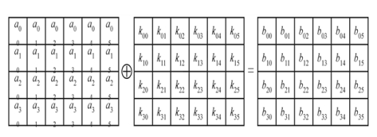

 

 


|      |                          |
| ---- | ------------------------ |
|      |  |

 


 

 

 

 

 

 

 

 

 

 

 

 

 

 

 

 

 

 

 

 

 

 

 

 

 

 

 

 

 

 

 


***\*实验一 密码算法实现（必做）\****

***\*[实验名称]\**** 

AES、RSA和RC4密码算法实现。

 

***\*[实验目的]\****

掌握对称密码算法AES、公钥密码算法RSA和序列密码算法RC4的基本原理，算法实现过程以及大数运算的方法。

 

***\*[实验内容]\****

\1. 分析AES算法、RSA算法和RC4算法的原理与测试过程。

\2. 写出算法流程，用程序设计语言将算法过程编程实现。

\3. 对输入的数据，验证加密和解密运算。

 

***\*[\*******\*实验步骤\*******\*]\****

\1. 预习AES算法、RSA算法和RC4算法。

\2. 用程序设计语言将算法过程编程实现。

\3. 输入明文I do like this book，密钥cryption，分别用三个算法进行加密和解密。

 

***\*[\*******\*实验\*******\*结果\*******\*]\****

\1. RC4算法

1.1	算法简介

RC4加密算法是大名鼎鼎的RSA三人组中的头号人物Ron Rivest在1987年设计的密钥长度可变的流加密算法簇。首先，用从1到256个字节的可变长度密钥初始化一个256个字节的状态盒S[256]。然后，通过S盒子对密钥按字节进行变换。最后可以得到变换后的密钥。对于加密，只要让密钥按字节与明文进行异或。而解密，只要让密钥按字节与密文进行异或。

1.2	算法实现

开始时，S中元素的值被置为按升序从0到255，即S[0]=0，S[1]=1，…… ，S[255]=255。同时对密钥key[key_len]的进行填充到随机序列密钥rc4key[256]中，(key_len为key的字节长度，且不大于256)。循环重复用key，直到rc4key的所有字节都被赋值。然后根据密钥re4key去对S盒进行变换。这些预操作可概括如下：

//S盒先初始化为s[0]=0,s[1]=1...s[255]=255

​	for(i = 0; i < 255; i++)

​		S[i]=i;

​		

//初始化序列化密钥

​	for(i = 0; i < 256; i++)

​	{

​		j = i % key_len ;

​		rc4key[i] = key_data[j];

​	}

​	

//根据密钥rc4key，填充S盒

​	for( j = 0, i = 0; i < 256; i++)

​	{

​		j = (rc4key[i] + S[i] + j) % 256;

​		swap(&S[i], &S[j]);	//交换S[i]和S[j]的数值

​	}

 

矢量S一旦完成初始化，输人密钥就不再被使用．密钥流的生成是从s[0]到S[255]，对每个S[i]，根据当前S的值，将S[i]与S中的另一字节置换．当S[255]完成置换后，操作继续重复，从S[0]开始。操作如下：

 

//生成随机序列密钥

for(counter = 0; counter < buffer_len; counter++)

​	{

​		i = (i + 1) % 256;

​		j = (S[i] + j) % 256;

​		swap(&S[i], &S[j]);

​		

​		t = (S[i] + S[j]) % 256;

​		rc4key[counter] = S[t];

​	}

 

这两个过程使用同样的函数即可，加密中，将k的值与下一明文字节异或；解密中，将k的值与下一密文字节异或。操作如下：

 

//将缓冲区数据和随机系列密钥进行异或，则可进行加密或者解密

​	for(i = 0; i < buffer_len; i++)

​		result[i] = buffer_data[i] ^ rc4key[i];

 

 

 

 

程序流程图

 

 

图1.1	RC4流程图

 

1.3运行结果

首先，输入密钥cryption，输入明文Idolikethisbook，实验结果如图1.2所示。

 

 

 

 

 

 

图1.2	加密结果1

 

如果密钥不变，明文变为idolikethisbook，实验结果如图1.3所示。可以看到，当密钥不变，明文做一小部分改变的时候（第一位由‘I’改变为‘i’），只有对应位的密文发生改变。


|      |                          |
| ---- | ------------------------ |
|      |  |

图1.3	加密结果2


如果明文不变，密钥变为cryptioN，实验结果如图1.3所示。可以看到，当密文不变，尽管密钥做一小部分改变（第八位由‘n’改变为‘N’），密文和原先的完全不同。


|      |                          |
| ---- | ------------------------ |
|      |  |

图1.3	加密结果2


 

\2. AES算法

2.1	算法简介

AES 是一种可用来保护电子数据的新型加密算法。特别是，AES 是可以使用 128、192 和 256 位密钥的迭代式对称密钥块密码，并且可以对 128 位（16 个字节）的数据块进行加密和解密。与使用密钥对的公钥密码不同的是，对称密钥密码使用同一个密钥来对数据进行加密和解密。由块密码返回的加密数据与输入数据具有相同的位数。迭代式密码使用循环结构来针对输入数据反复执行排列和置换运算。

2.2	算法实现

以加密函数为例，如下所示，首先对密钥进行预处理密钥扩展，然后明文进行Nr（Nr与密钥长度有关）次迭代运算，包括字节代换ShiftRows行移位、MixColumns、列混合以及AddRoundKey密钥加。

 

void Cipher()

{

  int i,j,round=0;

  // 把明文赋值到状态数组中

  for(i=0;i<4;i++)

​		for(j=0;j<4;j++)

​      state[j][i] = in[i*4 + j];

  // 先与初始轮密钥相加

  AddRoundKey(0); 

​	// 第一轮至（Nr-1）轮的迭代运算，第Nr轮不用进行列混合运算

  for(round=1;round<Nr;round++)

  {

​    SubBytes();	//字节代换

​    ShiftRows();	//行移位

​    MixColumns();	//列混合

​    AddRoundKey(round);	//密钥加

  }

  SubBytes();

  ShiftRows();

  AddRoundKey(Nr);

 

  // 加密结束，将机密结果填入数组out中以便输出

  for(i=0;i<4;i++)

​		for(j=0;j<4;j++)

​      out[i*4+j]=state[j][i];

}

 

解密函数的流程和加密函数是一致的，只是对于行变换、列变换、以及相关s盒子为加密的逆过程。

字节代换（SubBytes）字节代换是非线形变换，独立地对状态的每个字节进行。


|      |                          |
| ---- | ------------------------ |
|      |  |

行移位（ShiftRows）是将状态阵列的各行进行循环移位，不同状态行的位移量不同。第0行不移动，第1行循环左移C1个字节，第2行循环左移C2个字节，第3行循环左移C3个字节。位移量C1、C2、C3的取值与Nb有关。


|      |                          |
| ---- | ------------------------ |
|      |  |

 


列混合（MixColumns）是将状态阵列的每个列视为多项式，再与一个固定的多项式c(x)进行模x4+1乘法。Rijndael的设计者给出的c(x)为（系数用十六进制数表示）：c(x)=‘03’x3+‘01’x2+‘01’x+‘02’。


|      |                          |
| ---- | ------------------------ |
|      |  |

密钥加（AddRoundKey）是将轮密钥简单地与状态进行逐比特异或。轮密钥由种子密钥通过密钥编排算法得到，轮密钥长度等于分组长度Nb。


|      |                          |
| ---- | ------------------------ |
|      |  |

 


程序流程图

 

图2.1	AES流程图

 

2.3运行结果

首先，输入密钥cryption，输入明文Idolikethisbook，实验结果如图2.2所示。


|      |                          |
| ---- | ------------------------ |
|      |  |

图2.2	加密结果1


 

如果密钥不变，明文变为idolikethisbook，实验结果如图2.3所示。可以看到，当密钥不变，明文做一小部分改变的时候（第一位由‘I’改变为‘i’），密文与原先的完全不一样。

 

 

图2.3	加密结果2

 

如果明文不变，密钥变为cryptioN，实验结果如图2.4所示。可以看到，当密文不变，尽管密钥做一小部分改变（第八位由‘n’改变为‘N’），密文和原先的完全不同。


|      |                          |
| ---- | ------------------------ |
|      |  |

图2.4	加密结果3


 

\3. RSA算法

3.1	算法简介

RC4加密算法是大名鼎鼎的RSA三人组中的头号人物Ron Rivest在1987年设计的密钥长度可变的流加密算法簇。首先，用从1到256个字节的可变长度密钥初始化一个256个字节的状态盒S[256]。然后，通过S盒子对密钥按字节进行变换。最后可以得到变换后的密钥。对于加密，只要让密钥按字节与明文进行异或。而解密，只要让密钥按字节与密文进行异或。

1.2	算法实现

开始时，S中元素的值被置为按升序从0到255，即S[0]=0，S[1]=1，…… ，S[255]=255。同时对密钥key[key_len]的进行填充到随机序列密钥rc4key[256]中，(key_len为key的字节长度，且不大于256)。循环重复用key，直到rc4key的所有字节都被赋值。然后根据密钥re4key去对S盒进行变换。这些预操作可概括如下：

//S盒先初始化为s[0]=0,s[1]=1...s[255]=255

​	for(i = 0; i < 255; i++)

​		S[i]=i;

​		

//初始化序列化密钥

​	for(i = 0; i < 256; i++)

​	{

​		j = i % key_len ;

​		rc4key[i] = key_data[j];

​	}

​	

//根据密钥rc4key，填充S盒

​	for( j = 0, i = 0; i < 256; i++)

​	{

​		j = (rc4key[i] + S[i] + j) % 256;

​		swap(&S[i], &S[j]);	//交换S[i]和S[j]的数值

​	}

 

矢量S一旦完成初始化，输人密钥就不再被使用．密钥流的生成是从s[0]到S[255]，对每个S[i]，根据当前S的值，将S[i]与S中的另一字节置换．当S[255]完成置换后，操作继续重复，从S[0]开始。操作如下：

 

//生成随机序列密钥

for(counter = 0; counter < buffer_len; counter++)

​	{

​		i = (i + 1) % 256;

​		j = (S[i] + j) % 256;

​		swap(&S[i], &S[j]);

​		

​		t = (S[i] + S[j]) % 256;

​		rc4key[counter] = S[t];

​	}

 

这两个过程使用同样的函数即可，加密中，将k的值与下一明文字节异或；解密中，将k的值与下一密文字节异或。操作如下：

 

//将缓冲区数据和随机系列密钥进行异或，则可进行加密或者解密

​	for(i = 0; i < buffer_len; i++)

​		result[i] = buffer_data[i] ^ rc4key[i];

 

 

 

 

程序流程图

 

 

图1.1	RC4流程图

 

1.3运行结果

首先，输入密钥cryption，输入明文Idolikethisbook，实验结果如图1.2所示。

 

 

 

 

 

 

图1.2	加密结果1

 

如果密钥不变，明文变为idolikethisbook，实验结果如图1.3所示。可以看到，当密钥不变，明文做一小部分改变的时候（第一位由‘I’改变为‘i’），只有对应位的密文发生改变。


|      |                          |
| ---- | ------------------------ |
|      |  |

图1.3	加密结果2


如果明文不变，密钥变为cryptioN，实验结果如图1.3所示。可以看到，当密文不变，尽管密钥做一小部分改变（第八位由‘n’改变为‘N’），密文和原先的完全不同。


|      |                          |
| ---- | ------------------------ |
|      |  |

图1.3	加密结果2


 

 

 

 

 

 

 

 

***\*写出所编写程序的流程图和运行界面、运行结果。\****

 

***\*[问题讨论]\****

\1. 总结三种算法的特点，比较他们的性能；

\2. 分析实验中在编辑、编译、运行等各环节中所出现的问题及解决方法。

 

***\*[\*******\*算法代码\*******\*]\****

\1. RC4算法

 

\#include<stdio.h>

\#include<memory.h>

\#include<string.h>

\#define buf_size 1024

 

//随机序列密钥

unsigned char rc4key[256];

//S盒

unsigned char S[256];

 

 

//交换Si和Sj的值

void swap(unsigned char* Si, unsigned char* Sj)

{

  short int temp;

  temp = *Si;

  *Si = *Sj;

  *Sj = temp;

}

 

 

//初始化S盒

void prepare_key(unsigned char* key_data, short int key_len)

{

​	short int i;

​	short int j;

​	

​	//S盒先初始化为s[0]=0,s[1]=1...s[255]=255

​	for(i = 0; i < 255; i++)

​		S[i]=i;

​		

​	//初始化序列化密钥

​	for(i = 0; i < 256; i++)

​	{

​		j = i % key_len ;

​		rc4key[i] = key_data[j];

​	}

​	

​	//根据密钥rc4key，填充S盒

​	for( j = 0, i = 0; i < 256; i++)

​	{

​		j = (rc4key[i] + S[i] + j) % 256;

​		swap(&S[i], &S[j]);

​	}

}

 

 

//填充随机序列密钥

void create_key(short int buffer_len)

{

​	short int t;

​	short int i;

​	short int j;

​	short int counter;

 

​	for(counter = 0; counter < buffer_len; counter++)

​	{

​		i = (i + 1) % 256;

​		j = (S[i] + j) % 256;

​		swap(&S[i], &S[j]);

​		

​		t = (S[i] + S[j]) % 256;

​		rc4key[counter] = S[t];

​	}

}

 

 

//加解密

unsigned char* rc4(unsigned char* buffer_data, short int buffer_len)

{

​	short int i;

​	unsigned char* result;

​	result = (unsigned char*)malloc(sizeof(unsigned char)*buffer_len+1);

​	

​	//将缓冲区数据和随机系列密钥进行异或，则可进行加密或者解密

​	for(i = 0; i < buffer_len; i++)

​		result[i] = buffer_data[i] ^ rc4key[i];

​	result[i] = '\0';

​	//返回加密后的密文，或者解密后的明文

​	return result;

}

 

int main()

{

  short int i;

​	short int key_len;

​	unsigned char key_data[256];

​	short int buf_len;

​	unsigned char buf_data[buf_size];

​	unsigned char* result;

​	printf("RC4加密解密演示\n"); 

​	printf("输入密钥：");

​	scanf("%s",key_data);

​	key_len = strlen(key_data);

 

​	printf("输入密文：");

​	scanf("%s",buf_data);

​	buf_len = strlen(buf_data);

​	

​	prepare_key(key_data, key_len);

​	create_key(buf_len);

​	

​	result = rc4(buf_data, buf_len);

​	printf("加密后的密文：%s\n",result);

​	

​	result = rc4(result, buf_len);

​	printf("解密后的明文：%s\n",result);

​	getchar();

​	getchar();

  return 1;

}

 

2.	AES算法
```
\#include<string.h>

\#include<stdio.h>

\#include<math.h>

\#include<conio.h>

 

// 中间结果state的分组的矩阵有4行，列数记为Nb

\#define Nb 4

// 机密轮数，初始化为0

int Nr=0;

// 种子密钥以字节为元素的矩阵阵列表示，列数记为Nk，初始化为0

int Nk=0;

// Nc: 密钥长度，取(128, 192 , 256)中的一个值

int Nc = 128;

// in为密文，out为密文，state运算的为中间结果

unsigned char in[16], out[32], state[4][4];

// 轮密钥

unsigned char RoundKey[240];

// 输入的密钥

unsigned char Key[32];

// 定义多项式的相关运算

\#define xtime(x)  ((x<<1) ^ (((x>>7) & 1) * 0x1b))

\#define Multiply(x,y) (((y & 1) * x) ^ ((y>>1 & 1) * xtime(x)) ^ ((y>>2 & 1) * xtime(xtime(x))) ^ ((y>>3 & 1) * xtime(xtime(xtime(x)))) ^ ((y>>4 & 1) * xtime(xtime(xtime(xtime(x))))))

 

 

// S-box

int getSBoxValue(int num)

{

  int sbox[256] =  

​	{ 0x63, 0x7c, 0x77, 0x7b, 0xf2, 0x6b, 0x6f, 0xc5, 0x30, 0x01, 0x67, 0x2b, 0xfe, 0xd7, 0xab, 0x76,

  0xca, 0x82, 0xc9, 0x7d, 0xfa, 0x59, 0x47, 0xf0, 0xad, 0xd4, 0xa2, 0xaf, 0x9c, 0xa4, 0x72, 0xc0,

  0xb7, 0xfd, 0x93, 0x26, 0x36, 0x3f, 0xf7, 0xcc, 0x34, 0xa5, 0xe5, 0xf1, 0x71, 0xd8, 0x31, 0x15,

  0x04, 0xc7, 0x23, 0xc3, 0x18, 0x96, 0x05, 0x9a, 0x07, 0x12, 0x80, 0xe2, 0xeb, 0x27, 0xb2, 0x75,

  0x09, 0x83, 0x2c, 0x1a, 0x1b, 0x6e, 0x5a, 0xa0, 0x52, 0x3b, 0xd6, 0xb3, 0x29, 0xe3, 0x2f, 0x84,

  0x53, 0xd1, 0x00, 0xed, 0x20, 0xfc, 0xb1, 0x5b, 0x6a, 0xcb, 0xbe, 0x39, 0x4a, 0x4c, 0x58, 0xcf,

  0xd0, 0xef, 0xaa, 0xfb, 0x43, 0x4d, 0x33, 0x85, 0x45, 0xf9, 0x02, 0x7f, 0x50, 0x3c, 0x9f, 0xa8,

  0x51, 0xa3, 0x40, 0x8f, 0x92, 0x9d, 0x38, 0xf5, 0xbc, 0xb6, 0xda, 0x21, 0x10, 0xff, 0xf3, 0xd2,

  0xcd, 0x0c, 0x13, 0xec, 0x5f, 0x97, 0x44, 0x17, 0xc4, 0xa7, 0x7e, 0x3d, 0x64, 0x5d, 0x19, 0x73,

  0x60, 0x81, 0x4f, 0xdc, 0x22, 0x2a, 0x90, 0x88, 0x46, 0xee, 0xb8, 0x14, 0xde, 0x5e, 0x0b, 0xdb,

  0xe0, 0x32, 0x3a, 0x0a, 0x49, 0x06, 0x24, 0x5c, 0xc2, 0xd3, 0xac, 0x62, 0x91, 0x95, 0xe4, 0x79,

  0xe7, 0xc8, 0x37, 0x6d, 0x8d, 0xd5, 0x4e, 0xa9, 0x6c, 0x56, 0xf4, 0xea, 0x65, 0x7a, 0xae, 0x08,

  0xba, 0x78, 0x25, 0x2e, 0x1c, 0xa6, 0xb4, 0xc6, 0xe8, 0xdd, 0x74, 0x1f, 0x4b, 0xbd, 0x8b, 0x8a,

  0x70, 0x3e, 0xb5, 0x66, 0x48, 0x03, 0xf6, 0x0e, 0x61, 0x35, 0x57, 0xb9, 0x86, 0xc1, 0x1d, 0x9e,

  0xe1, 0xf8, 0x98, 0x11, 0x69, 0xd9, 0x8e, 0x94, 0x9b, 0x1e, 0x87, 0xe9, 0xce, 0x55, 0x28, 0xdf,

  0x8c, 0xa1, 0x89, 0x0d, 0xbf, 0xe6, 0x42, 0x68, 0x41, 0x99, 0x2d, 0x0f, 0xb0, 0x54, 0xbb, 0x16 

​	};

  return sbox[num];

}

 

 

// S-box的逆盒子，用于解密

int getSBoxInvert(int num)

{

​	int rsbox[256] =

​	{ 0x52, 0x09, 0x6a, 0xd5, 0x30, 0x36, 0xa5, 0x38, 0xbf, 0x40, 0xa3, 0x9e, 0x81, 0xf3, 0xd7, 0xfb

​	, 0x7c, 0xe3, 0x39, 0x82, 0x9b, 0x2f, 0xff, 0x87, 0x34, 0x8e, 0x43, 0x44, 0xc4, 0xde, 0xe9, 0xcb

​	, 0x54, 0x7b, 0x94, 0x32, 0xa6, 0xc2, 0x23, 0x3d, 0xee, 0x4c, 0x95, 0x0b, 0x42, 0xfa, 0xc3, 0x4e

​	, 0x08, 0x2e, 0xa1, 0x66, 0x28, 0xd9, 0x24, 0xb2, 0x76, 0x5b, 0xa2, 0x49, 0x6d, 0x8b, 0xd1, 0x25

​	, 0x72, 0xf8, 0xf6, 0x64, 0x86, 0x68, 0x98, 0x16, 0xd4, 0xa4, 0x5c, 0xcc, 0x5d, 0x65, 0xb6, 0x92

​	, 0x6c, 0x70, 0x48, 0x50, 0xfd, 0xed, 0xb9, 0xda, 0x5e, 0x15, 0x46, 0x57, 0xa7, 0x8d, 0x9d, 0x84

​	, 0x90, 0xd8, 0xab, 0x00, 0x8c, 0xbc, 0xd3, 0x0a, 0xf7, 0xe4, 0x58, 0x05, 0xb8, 0xb3, 0x45, 0x06

​	, 0xd0, 0x2c, 0x1e, 0x8f, 0xca, 0x3f, 0x0f, 0x02, 0xc1, 0xaf, 0xbd, 0x03, 0x01, 0x13, 0x8a, 0x6b

​	, 0x3a, 0x91, 0x11, 0x41, 0x4f, 0x67, 0xdc, 0xea, 0x97, 0xf2, 0xcf, 0xce, 0xf0, 0xb4, 0xe6, 0x73

​	, 0x96, 0xac, 0x74, 0x22, 0xe7, 0xad, 0x35, 0x85, 0xe2, 0xf9, 0x37, 0xe8, 0x1c, 0x75, 0xdf, 0x6e

​	, 0x47, 0xf1, 0x1a, 0x71, 0x1d, 0x29, 0xc5, 0x89, 0x6f, 0xb7, 0x62, 0x0e, 0xaa, 0x18, 0xbe, 0x1b

​	, 0xfc, 0x56, 0x3e, 0x4b, 0xc6, 0xd2, 0x79, 0x20, 0x9a, 0xdb, 0xc0, 0xfe, 0x78, 0xcd, 0x5a, 0xf4

​	, 0x1f, 0xdd, 0xa8, 0x33, 0x88, 0x07, 0xc7, 0x31, 0xb1, 0x12, 0x10, 0x59, 0x27, 0x80, 0xec, 0x5f

​	, 0x60, 0x51, 0x7f, 0xa9, 0x19, 0xb5, 0x4a, 0x0d, 0x2d, 0xe5, 0x7a, 0x9f, 0x93, 0xc9, 0x9c, 0xef

​	, 0xa0, 0xe0, 0x3b, 0x4d, 0xae, 0x2a, 0xf5, 0xb0, 0xc8, 0xeb, 0xbb, 0x3c, 0x83, 0x53, 0x99, 0x61

​	, 0x17, 0x2b, 0x04, 0x7e, 0xba, 0x77, 0xd6, 0x26, 0xe1, 0x69, 0x14, 0x63, 0x55, 0x21, 0x0c, 0x7d 

​	};

​	return rsbox[num];

}

 

 

// 异或轮常数Rcon

int Rcon[255] = {

  0x8d, 0x01, 0x02, 0x04, 0x08, 0x10, 0x20, 0x40, 0x80, 0x1b, 0x36, 0x6c, 0xd8, 0xab, 0x4d, 0x9a, 

  0x2f, 0x5e, 0xbc, 0x63, 0xc6, 0x97, 0x35, 0x6a, 0xd4, 0xb3, 0x7d, 0xfa, 0xef, 0xc5, 0x91, 0x39, 

  0x72, 0xe4, 0xd3, 0xbd, 0x61, 0xc2, 0x9f, 0x25, 0x4a, 0x94, 0x33, 0x66, 0xcc, 0x83, 0x1d, 0x3a, 

  0x74, 0xe8, 0xcb, 0x8d, 0x01, 0x02, 0x04, 0x08, 0x10, 0x20, 0x40, 0x80, 0x1b, 0x36, 0x6c, 0xd8, 

  0xab, 0x4d, 0x9a, 0x2f, 0x5e, 0xbc, 0x63, 0xc6, 0x97, 0x35, 0x6a, 0xd4, 0xb3, 0x7d, 0xfa, 0xef, 

  0xc5, 0x91, 0x39, 0x72, 0xe4, 0xd3, 0xbd, 0x61, 0xc2, 0x9f, 0x25, 0x4a, 0x94, 0x33, 0x66, 0xcc, 

  0x83, 0x1d, 0x3a, 0x74, 0xe8, 0xcb, 0x8d, 0x01, 0x02, 0x04, 0x08, 0x10, 0x20, 0x40, 0x80, 0x1b, 

  0x36, 0x6c, 0xd8, 0xab, 0x4d, 0x9a, 0x2f, 0x5e, 0xbc, 0x63, 0xc6, 0x97, 0x35, 0x6a, 0xd4, 0xb3, 

  0x7d, 0xfa, 0xef, 0xc5, 0x91, 0x39, 0x72, 0xe4, 0xd3, 0xbd, 0x61, 0xc2, 0x9f, 0x25, 0x4a, 0x94, 

  0x33, 0x66, 0xcc, 0x83, 0x1d, 0x3a, 0x74, 0xe8, 0xcb, 0x8d, 0x01, 0x02, 0x04, 0x08, 0x10, 0x20, 

  0x40, 0x80, 0x1b, 0x36, 0x6c, 0xd8, 0xab, 0x4d, 0x9a, 0x2f, 0x5e, 0xbc, 0x63, 0xc6, 0x97, 0x35, 

  0x6a, 0xd4, 0xb3, 0x7d, 0xfa, 0xef, 0xc5, 0x91, 0x39, 0x72, 0xe4, 0xd3, 0xbd, 0x61, 0xc2, 0x9f, 

  0x25, 0x4a, 0x94, 0x33, 0x66, 0xcc, 0x83, 0x1d, 0x3a, 0x74, 0xe8, 0xcb, 0x8d, 0x01, 0x02, 0x04, 

  0x08, 0x10, 0x20, 0x40, 0x80, 0x1b, 0x36, 0x6c, 0xd8, 0xab, 0x4d, 0x9a, 0x2f, 0x5e, 0xbc, 0x63, 

  0xc6, 0x97, 0x35, 0x6a, 0xd4, 0xb3, 0x7d, 0xfa, 0xef, 0xc5, 0x91, 0x39, 0x72, 0xe4, 0xd3, 0xbd, 

  0x61, 0xc2, 0x9f, 0x25, 0x4a, 0x94, 0x33, 0x66, 0xcc, 0x83, 0x1d, 0x3a, 0x74, 0xe8, 0xcb  };

 

 

// 产生各个轮密钥

void KeyExpansion()

{

  int i,j;

  unsigned char temp[4],k;

  // 首轮为密钥自身

  for(i=0;i<Nk;i++)

  {

​    RoundKey[i*4]=Key[i*4];

​    RoundKey[i*4+1]=Key[i*4+1];

​    RoundKey[i*4+2]=Key[i*4+2];

​    RoundKey[i*4+3]=Key[i*4+3];

  }

  // 其它轮密钥产生

  while (i < (Nb * (Nr+1)))

  {

​    for(j=0;j<4;j++)

​    {

​      temp[j]=RoundKey[(i-1) * 4 + j];

​    }

​    if (i % Nk == 0)

​    {

​			k = temp[0];

​			temp[0] = temp[1];

​			temp[1] = temp[2];

​			temp[2] = temp[3];

​			temp[3] = k;

​			temp[0]=getSBoxValue(temp[0]);

​			temp[1]=getSBoxValue(temp[1]);

​			temp[2]=getSBoxValue(temp[2]);

​			temp[3]=getSBoxValue(temp[3]);

​      temp[0] =  temp[0] ^ Rcon[i/Nk];

​    }

​    else if (Nk > 6 && i % Nk == 4)

​    {

​			temp[0]=getSBoxValue(temp[0]);

​			temp[1]=getSBoxValue(temp[1]);

​			temp[2]=getSBoxValue(temp[2]);

​			temp[3]=getSBoxValue(temp[3]);

​    }

​    RoundKey[i*4+0] = RoundKey[(i-Nk)*4+0] ^ temp[0];

​    RoundKey[i*4+1] = RoundKey[(i-Nk)*4+1] ^ temp[1];

​    RoundKey[i*4+2] = RoundKey[(i-Nk)*4+2] ^ temp[2];

​    RoundKey[i*4+3] = RoundKey[(i-Nk)*4+3] ^ temp[3];

​    i++;

  }

}

 

 

// 将轮密钥与状态进行抑或

void AddRoundKey(int round) 

{

  int i,j;

  for(i=0;i<4;i++)

​    for(j=0;j<4;j++)

​      state[j][i] ^= RoundKey[round * Nb * 4 + i * Nb + j];

}

 

 

// 从S-box中为state状态进行字节替换

void InvSubBytes()

{

  int i,j;

  for(i=0;i<4;i++)

​    for(j=0;j<4;j++)

​      state[i][j] = getSBoxInvert(state[i][j]);

}

 

 

// 行移位

void InvShiftRows()

{

  unsigned char temp;

  // 第一行右移动三列  

  temp=state[1][3];

  state[1][3]=state[1][2];

  state[1][2]=state[1][1];

  state[1][1]=state[1][0];

  state[1][0]=temp;

  // 第二行右移动二列   

  temp=state[2][0];

  state[2][0]=state[2][2];

  state[2][2]=temp;

  temp=state[2][1];

  state[2][1]=state[2][3];

  state[2][3]=temp;

  // 第一行右移动一列 

  temp=state[3][0];

  state[3][0]=state[3][1];

  state[3][1]=state[3][2];

  state[3][2]=state[3][3];

  state[3][3]=temp;

}

 

 

// 列混合

void InvMixColumns()

{

  int i;

  unsigned char a,b,c,d;

  for(i=0;i<4;i++)

  {   

​    a = state[0][i];

​    b = state[1][i];

​    c = state[2][i];

​    d = state[3][i];

​		// Multiply为一种运算，每个列视为GF(28)上的多项式，再与一个固定的多项式c(x)进行模x4+1乘法

​    state[0][i] = Multiply(a, 0x0e) ^ Multiply(b, 0x0b) ^ Multiply(c, 0x0d) ^ Multiply(d, 0x09);

​    state[1][i] = Multiply(a, 0x09) ^ Multiply(b, 0x0e) ^ Multiply(c, 0x0b) ^ Multiply(d, 0x0d);

​    state[2][i] = Multiply(a, 0x0d) ^ Multiply(b, 0x09) ^ Multiply(c, 0x0e) ^ Multiply(d, 0x0b);

​    state[3][i] = Multiply(a, 0x0b) ^ Multiply(b, 0x0d) ^ Multiply(c, 0x09) ^ Multiply(d, 0x0e);

  }

}


 

// 解密函数

void InvCipher()

{

  int i,j,round=0;

  for(i=0;i<4;i++)

​    for(j=0;j<4;j++)

​      state[j][i] = in[i*4 + j];

  AddRoundKey(Nr); 

  for(round=Nr-1;round>0;round--)

  {

​    InvShiftRows();

​    InvSubBytes();

​    AddRoundKey(round);

​    InvMixColumns();

  }

  InvShiftRows();

  InvSubBytes();

  AddRoundKey(0);

  for(i=0;i<4;i++)

  {

​    for(j=0;j<4;j++)

​    {

​      out[i*4+j]=state[j][i];

}

 

 

// 以下三个函数为前面相对应函数的逆过程，用于加密

void SubBytes()

{

  int i,j;

  for(i=0;i<4;i++)

​    for(j=0;j<4;j++)

​      state[i][j] = getSBoxValue(state[i][j]);

}

 

 

void ShiftRows()

{

  unsigned char temp;

  temp=state[1][0];

  state[1][0]=state[1][1];

  state[1][1]=state[1][2];

  state[1][2]=state[1][3];

  state[1][3]=temp;  

  temp=state[2][0];

  state[2][0]=state[2][2];

  state[2][2]=temp;

  temp=state[2][1];

  state[2][1]=state[2][3];

  state[2][3]=temp;

  temp=state[3][0];

  state[3][0]=state[3][3];

  state[3][3]=state[3][2];

  state[3][2]=state[3][1];

  state[3][1]=temp;

}

 

 

\#define xtime(x)  ((x<<1) ^ (((x>>7) & 1) * 0x1b))

void MixColumns()

{

  int i;

  unsigned char Tmp,Tm,t;

  for(i=0;i<4;i++)

  {   

​    t=state[0][i];

​    Tmp = state[0][i] ^ state[1][i] ^ state[2][i] ^ state[3][i] ;

​    Tm = state[0][i] ^ state[1][i] ; Tm = xtime(Tm); state[0][i] ^= Tm ^ Tmp ;

​    Tm = state[1][i] ^ state[2][i] ; Tm = xtime(Tm); state[1][i] ^= Tm ^ Tmp ;

​    Tm = state[2][i] ^ state[3][i] ; Tm = xtime(Tm); state[2][i] ^= Tm ^ Tmp ;

​    Tm = state[3][i] ^ t ; Tm = xtime(Tm); state[3][i] ^= Tm ^ Tmp ;

  }

}

 

 

// 加密函数

void Cipher()

{

  int i,j,round=0;

  // 把明文赋值到状态数组中

  for(i=0;i<4;i++)

​		for(j=0;j<4;j++)

​      state[j][i] = in[i*4 + j];

  // 先与初始轮密钥相加

  AddRoundKey(0); 

​	// 第一轮至（Nr-1）轮的迭代运算，第Nr轮不用进行列混合运算

  for(round=1;round<Nr;round++)

  {

​    SubBytes();

​    ShiftRows();

​    MixColumns();

​    AddRoundKey(round);

  }

  SubBytes();

  ShiftRows();

  AddRoundKey(Nr);

 

  // 加密结束，将机密结果填入数组out中以便输出

  for(i=0;i<4;i++)

​		for(j=0;j<4;j++)

​      out[i*4+j]=state[j][i];

}

 

 

// 对明文进行预处理，包括计算其空间

char *encrypt(char *str, char *key) 

{

  int i,j,Nl;

​	double len;

​	char *newstr;

​	char *str2;

  Nk = Nc / 32;

  Nr = Nk + 6;

  len= strlen(str);

  Nl = (int)ceil(len / 16);

  newstr = (char *)malloc(Nl*32);

  memset(newstr,0,sizeof(newstr));

  for(i=0;i<Nl;i++)

  {

​    for(j=0;j<Nk*4;j++)

​    {

​      Key[j]=key[j];

​      in[j]=str[i*16+j];

​    }    

​    KeyExpansion();

​    Cipher();

​    strcat(newstr,out);

  }

  return newstr;

}

 

 

// 对密文进行预处理，包括计算其空间

char *decrypt(char *str, char *key) 

{

  int i,j,len,Nl;

​	char *newstr;

  Nk = Nc / 32;

  Nr = Nk + 6;

  len= strlen(str);

  Nl = (int)ceil(len / 16);  

  newstr = (char *)malloc(16*Nl);

  memset(newstr,0,sizeof(newstr));   

  for(i=0;i<Nl;i++)

  {

​    for(j=0;j<Nk*4;j++)

​    {

​      Key[j]=key[j];

​      in[j]=str[i*16+j];

​    }     

​    KeyExpansion();

​    InvCipher();

​    strcat(newstr,out);

  }

  return newstr;

}

 

 

int main()

{

  char *str;

​	char *str2;

​	printf("AES加密解密演示\n");

​	printf("输入密钥：cryption\n");

​	printf("输入明文：idolikethisbook\n");

​	str= encrypt("idolikethisbook", "cryption");

  printf("加密后的密文：%s\n", str);

  str2 = decrypt(str, "cryption");

  printf("解密后的明文：%s\n", str2);

  getch();

  return 0;

}

```

 

 

 

 

 

 

 

***\*回答问题\****

 

 


***\*实验二 加密模式（选做）\****

***\*[实验目的]\****

1.了解密码算法的分组链接模式。

2.掌握和理解ECB模式、CBC模式的结构和算法原理。

 

***\*[实验内容]\****

\1. 分析ECB模式和CBC模式的加密过程。

\2. 用程序设计语言将算法过程编程实现。

\3. 输入明文：I do like this book

  加密算法E：AES，密钥为cryption；

  填充模式： 0

  初始化向量IV：goodluck

用两种模式进行加密，输出相应的密文。

 

***\*[\*******\*实验步骤\*******\*]\****

\1. 预习ECB模式和CBC模式加密模式的算法。

\2. 写出算法流程，用程序设计语言将算法过程编程实现。

\3. 输入指定的明文、密钥或初始化向量，输出密文，验证结果。

\4. 自己选择不同的输入，记录输出结果。

***\*写出所编写程序的流程图和运行界面、运行结果。\****

 

***\*[问题讨论]\****

\1. 总结两种加密模式的特点，错误扩散进行分析；

\2. 分析实验中在编辑、编译、运行等各环节中所出现的问题及解决方法。

***\*回答问题\****

 