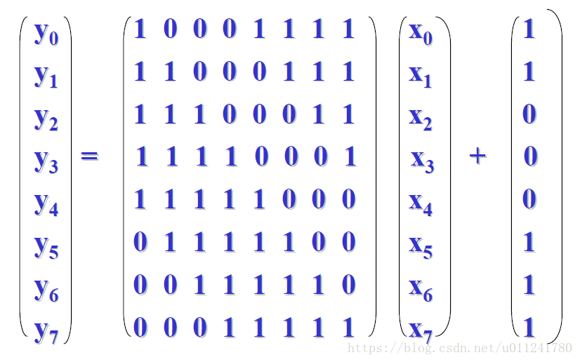
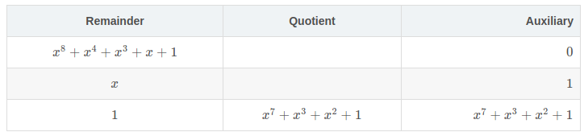

# 手动推导计算AES中的s盒的输出

url:https://blog.csdn.net/u011241780/article/details/80589273

# 初衷

为了解决一道密码学课后作业：

在AES中，对于字节 “00” 和 “01” 计算S盒的输出。

百度查了很久，很多都是浅尝则之，没有具体说明S盒计算的具体过程和方法，要么就是说直接使用S盒求出，搞的我很崩溃，本身也是半吊子。后来在这篇文章的帮助下，顺利找到了解决方法。

很明显，如果通过查表的方式，很容易就可以得出“63”“63”和 “7C”“7C”这两个输出。但是这道题不能这么做，需要手动计算S盒的输出。

# 算法过程简介

AES加密算法涉及4种操作：

字节替代（SubBytes）
行移位（ShiftRows）
列混淆（MixColumns）
轮密钥加（AddRoundKey）.
其中第一步字节替换，即SubBytes，它是作用在状态中每个字节上的一种非线性字节变换，这个变换（或称S_box
）按以下两步进行：
- 把字节的值用它的乘法逆来代替，其中 “00” 的逆就是它自己；
- 把经上一步处理后的字节值再进行如下定义的仿射变换：

## 因此第一步需要求多项式的乘法逆

又二进制多项式 b(x)b(x) 的乘法逆为满足
a(x)b(x)=1modm(x)
a(x)b(x)=1modm(x)

的二进制多项式 a(x)a(x) ,其中 a(x)=b−1(x)a(x)=b−1(x)

# 计算过程

## 1. 求乘法逆(Multiplicative Inverse)
在RJNDAEL中的不可约多项式为：
m(x)=x8+x4+x3+x+1
m(x)=x8+x4+x3+x+1

假设我们要求 a(x)a(x)的逆，对 a(x)a(x)和 m(x)m(x)使用扩展欧几里得算法可以得到形如
b(x)∗a(x)+s(x)∗m(x)=1
b(x)∗a(x)+s(x)∗m(x)=1

的等式，即等价于
b(x)∗a(x)=1(modm(x))
b(x)∗a(x)=1(modm(x))

其中 a(x)a(x)的逆为 b(x)b(x)

---

假设现在我们的输入是“02”“02”,根据已有S盒中得到的结果为“77”“77”,所以接下来我们要验证使用下面讲述的方法，最后计算的结果是否也是“77”“77”。

1. 可以得出“02”“02”对应的二进制多项式为 *x*x;
2. 接下来介绍的方法[来自这里](http://mathforum.org/library/drmath/view/51675.html),根据这个方法可以得到以下的表格：

表格的生成规则是：AuxiliaryAuxiliary 列的前两行以 0 和 1 开始，RemainderRemainder列的前两行通常以 m(x)m(x) 和 a(x)a(x)开始，如上表所示。接下来的行的计算方法是：取以当前行的前两行中的RemainderRemainder相除，得到的商放在QuotientQuotient列中，得到的余数放在RemainderRemainder列中。接着将当前号的quotientquotient值乘上一行的AuxiliaryAuxiliary(GF(28)GF(28)上的乘法)并且再加上(GF(28)GF(28)上的加法)上上【即前两行】一行的AuxiliaryAuxiliary列中的值，最后把计算的结果放到当前行的AuxiliaryAuxiliary 列上。当RemainderRemainder列减小到一时，AuxiliaryAuxiliary 列中的值就是a(x)a(x)对应的乘法逆。下面就上面的例子做一下说明：

1. AuxiliaryAuxiliary 列的前两行以 0 和 1 开始，所以表格AuxiliaryAuxiliary 列前两行填上 0 和 1；
2. 2.RemainderRemainder列的前两行通常以 m(x)m(x) 和 a(x)a(x)开始，所以表格RemainderRemainder列前两行填上x8+x4+x3+x+1x8+x4+x3+x+1和xx，其中a(x)a(x)为我们要求乘法逆的多项式，这里我们假设a(x)=xa(x)=x
3. 3.接下来用x8+x4+x3+x+1x8+x4+x3+x+1除以xx，得到商为x7+x3+x2+1x7+x3+x2+1，余数为11，分别填入QuotientQuotient列和RemainderRemainder列中。
4. 计算 AuxiliaryAuxiliary 列，将当前行的QuotientQuotient列的值，即x7+x3+x2+1x7+x3+x2+1，去乘上一行 AuxiliaryAuxiliary 列的值，即11,再去加上上一行的 AuxiliaryAuxiliary 列的值，即00,最后得到结果为(x7+x3+x2+1)∗1+0(x7+x3+x2+1)∗1+0，注意此处的运算都是GF(28)GF(28)上的乘法和加法。
5. 此时RemainderRemainder列已经等于11,所以x7+x3+x2+1x7+x3+x2+1就是xx的乘法逆。
   求乘法逆的过程到此结束，将x7+x3+x2+1x7+x3+x2+1转换为二进制即为1000110110001101，接下来进行第二步操作：仿射变换(Affine Transformation).

### 2. 仿射变换(Affine Transformation)
关于仿射变换可以参考这个论坛里的讨论，里面讲的已经很详细了，大致的过程就是矩阵运算，其中矩阵每一行和上一步求出乘法逆相与之后，再对得到的8位二进制进行异或，最后得到00或者11.比如：

       Input = 1  0  1  1  0  0  0  1 (LSB First)
       Row 0 = 1  0  0  0  1  1  1  1
       Bit 0 = 1  0  0  0  0  0  0  1 = 0
        
       Row 1 = 1  1  0  0  0  1  1  1
       Bit 1 = 1  0  0  0  0  0  0  1 = 0
        
       Row 2 = 1  1  1  0  0  0  1  1
       Bit 2 = 1  0  1  0  0  0  0  1 = 1
        
       Row 3 = 1  1  1  1  0  0  0  1
       Bit 3 = 1  0  1  1  0  0  0  1 = 0
        
       Row 4 = 1  1  1  1  1  0  0  0
       Bit 4 = 1  0  1  1  0  0  0  0 = 1
        
       Row 5 = 0  1  1  1  1  1  0  0
       Bit 5 = 0  0  1  1  0  0  0  0 = 0
        
       Row 6 = 0  0  1  1  1  1  1  0
       Bit 6 = 0  0  1  1  0  0  0  0 = 0
        
       Row 7 = 0  0  0  1  1  1  1  1
       Bit 7 = 0  0  0  1  0  0  0  1 = 0
注：LSB first表示低位在前

上一步求出1000110110001101，其低位在前即1011000110110001。接下来将inputinput 和 rowrow相与再将得到的所有bitbit进行异或运算，得到矩阵运算的结果0010100000101000，之后再和最后的矩阵向量1100011011000110进行GF(28)GF(28)上的加法运算，得到了1110111011101110。由于我们一直都是以低位在前进行运算，最后的结果需要换为 MSBfirstMSBfirst 高位在前，所以将1110111011101110倒着写得到最终结果011101111011101111。查看S_box的表格可知，输入0202最终得到7777，计算结果正确。至此AESAES的S盒计算过程已经摸索清除，至于其中更深层次的数学原理，如果有哪位大神知道的可以留言一下。

# 总结
起初是为了解决一道题，后来发现百度很久(不知道是不是我的打开方式有问题)，居然没有很整齐划一的方法可以解答这个问题，国内的论坛都是抄来抄去，没有人解决实质性的问题，幸亏后来在一些国外的论坛找到了答案。虽然这篇文章的讲到的一些原理还没有弄懂，我也不是很清楚为什么这么算就可以了。。。不过我相信后来的人再看到就有机会更深层次地挖掘，更好地弄懂这类问题。

码字不易，转载请注明出处
参考资料
1.http://mathforum.org/library/drmath/view/51675.html
2.https://crypto.stackexchange.com/questions/10996/how-are-the-aes-s-boxes-calculated
3.https://wenku.baidu.com/view/a1832d43b307e87101f696ac.html
4.https://www.cnblogs.com/luop/p/4334160.html
5.https://max.book118.com/html/2016/0222/35595572.shtm
