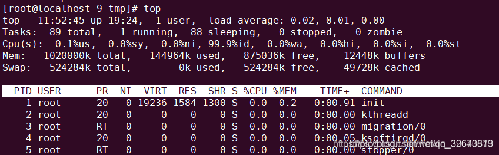
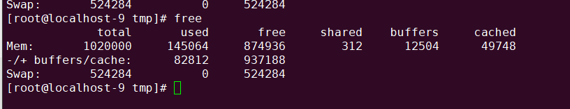
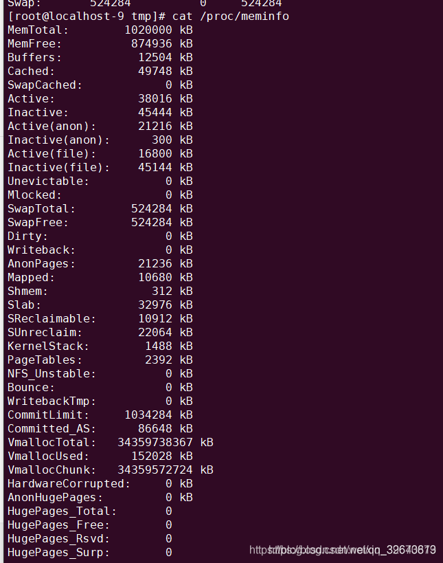
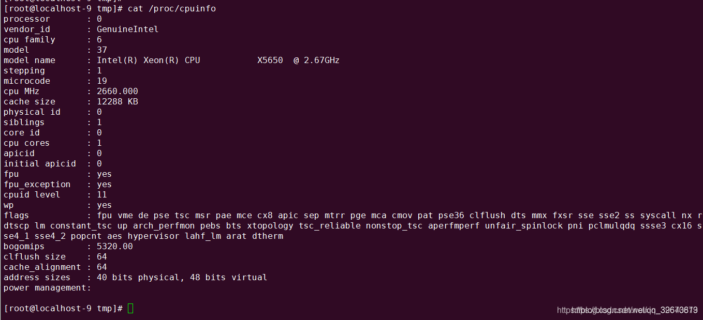
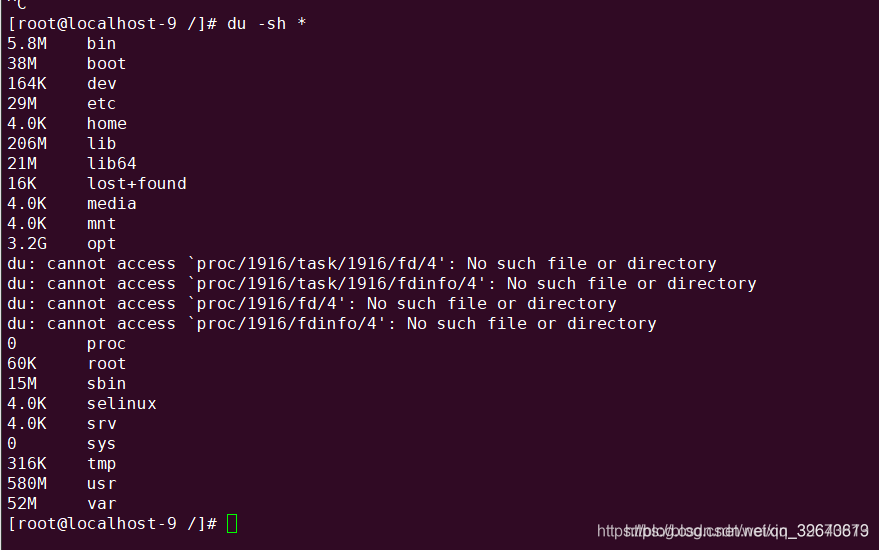
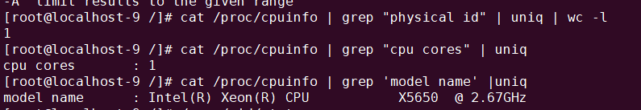

# Linux查看内存和cpu利用率的命令

src:https://blog.csdn.net/qq_32670879/article/details/85259916

参考资料：

<https://zhidao.baidu.com/question/287497401.html>

<https://blog.csdn.net/u011341352/article/details/53635484>

# 1、top命令

top - 

 up 后的字段展示，虚拟机运行时间（19小时24分钟），

1 user表示一个用户处于连接 状态，

load average: 1.15, 1.42, 1.44 — load average后面的三个数分别是1分钟、5分钟、15分钟的负载情况。
load average数据是每隔5秒钟检查一次活跃的进程数，然后按特定算法计算出的数值。如果这个数除以逻辑CPU的数量，结果高于5的时候就表明系统在超负荷运转了。

Tasks — 任务（进程），系统现在共有183个进程，其中处于运行中的有1个，182个在休眠（sleep），stoped状态的有0个，zombie状态（僵尸）的有0个。

第三行：cpu状态
6.7% us — 用户空间占用CPU的百分比。
0.4% sy — 内核空间占用CPU的百分比。
0.0% ni — 改变过优先级的进程占用CPU的百分比
92.9% id — 空闲CPU百分比
0.0% wa — IO等待占用CPU的百分比
0.0% hi — 硬中断（Hardware IRQ）占用CPU的百分比
0.0% si — 软中断（Software Interrupts）占用CPU的百分比

如果该linux机子是虚拟机，还有另外一个字段

（ st : time stolen from this vm by the hypervisor    表示hypervisor从这个vm窃取的时间）

第四行：内存状态

总量：1020000k

已使用：144964k

空闲量：875036k

缓存的内存量：12456k

第五行：交换区状态

意义同内存状态栏

2、free

3、cat /proc/meminfo

4、cat /proc/cpuinfo

 5、du -sh *

6、 查看CPU个数

cat /proc/cpuinfo | grep "physical id" | uniq | wc -l

7、查看CPU核数

cat /proc/cpuinfo | grep "cpu cores" | uniq

8、查看CPU型号

cat /proc/cpuinfo | grep 'model name' |uniq

