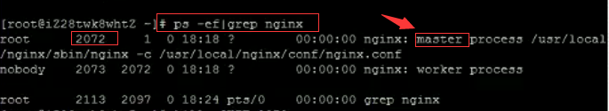
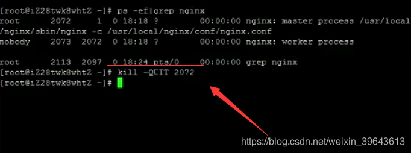
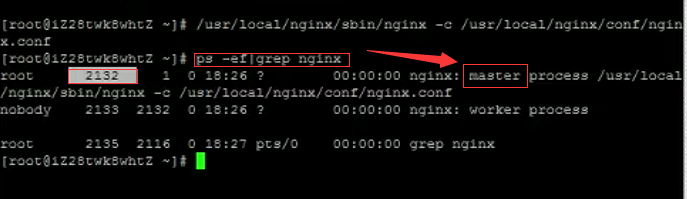
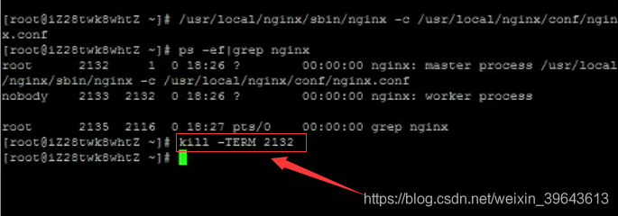
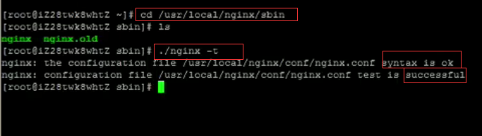
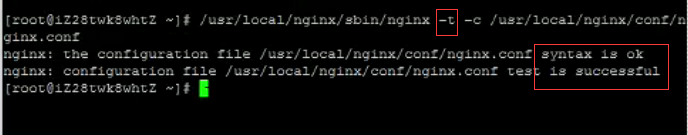
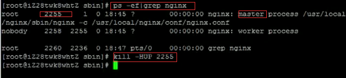

# Nginx的启动、停止与重启

src:https://www.cnblogs.com/codingcloud/p/5095066.html


# 启动
启动代码格式：nginx安装目录地址 -c nginx配置文件地址

例如：

```
[root@LinuxServer sbin]# /usr/local/nginx/sbin/nginx -c /usr/local/nginx/conf/nginx.conf
```

# 停止
nginx的停止有三种方式：

## 从容停止
### 1、查看进程号

```
[root@LinuxServer ~]# ps -ef|grep nginx
```


### 2、杀死进程

```
[root@LinuxServer ~]# kill -QUIT 2072
```

## 快速停止
### 1、查看进程号

```
[root@LinuxServer ~]# ps -ef|grep nginx
```


### 2、杀死进程

```
[root@LinuxServer ~]# kill -TERM 2132
或 [root@LinuxServer ~]# kill -INT 2132
```

## 强制停止

```
[root@LinuxServer ~]# pkill -9 nginx
```

# 重启
## 1、验证nginx配置文件是否正确
**方法一：进入nginx安装目录sbin下，输入命令./nginx -t**

看到如下显示 `nginx.conf syntax is ok  nginx.conf test is successful`

说明配置文件正确！


**方法二：在启动命令-c前加-t**


## 2、重启Nginx服务
 **方法一：进入nginx可执行目录sbin下，输入命令./nginx -s reload 即可**

**方法二：查找当前nginx进程号，然后输入命令：kill -HUP 进程号 实现重启nginx服务**




