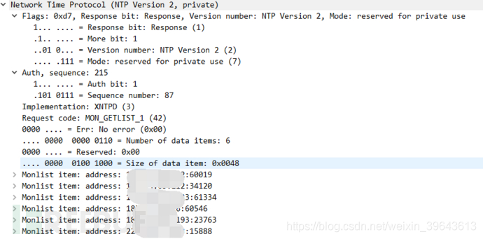

# NTP反射攻击复现

src:https://www.freebuf.com/articles/network/129288.html


# 0x01 故事起因

前两天以为freebuf上的网友stream（年龄、性别不详）私信我说他在阿里云上的服务器被NTP攻击了，流量超过10G，希望我帮忙一起分析一下，复现一下攻击。我这当代雷锋当然非常乐意了，于是我就和stream联系（勾搭）上了，今天我就详细讲一下我们一起复现NTP反射攻击的过程。


# 0x02 分析攻击数据
stream大兄弟把当时抓到的包发给了我，数据包不大只有31.4M


当我打开数据包看了下时间才知道这数据包可不小啊！只有0.011秒就抓了67598个包，粗略计算一下67598*482/0.011=2 962 021 454字节，将近3G/s也就是24Gbps，对我来说这样的流量已经很大了。


借助whireshark查看了一下源IP的情况，并排列了一下每个IP的发包数量，但是whireshark居然没有统计IP地址个数的地方，也可能是我没找到，于是我就另存为到一个txt文件中，查看行号计算数量，发现总共有3307个源IP（哈哈！这可都是宝贝啊！），


然后把这些IP地址都转换个格式存起来，留着下个阶段复现的时候用。

# 0x03 攻击复现
原本以为知道了IP了复现起来很简单呢，其实过程并不顺利（还是自己没经验）。

我先选了发包最多的那个IP测试一下，看看到底能不能返回monlist数据。


果然能返回monlist包，返回了大约100个482字节的包，我靠！这尼玛放大倍数非常让人兴奋啊！我还是too young啊，等我再次发包的时候就没有回应了。


孤零零的就一个包，后来我测试了好几个IP都是这种情况，有的甚至第一个包都不回，艹！这是怎么回事呢？于是我就去看了下NTP协议的报文格式。


看起来挺长，我其实也没看太懂，不过我们的目的是要发出monlist请求，所以我们只要清楚monlist的格式什么样就行了。后来我发现这个跟whireshark上的结构不太一样，后来我就直接去看whireshark上的注释了。


这就清晰多了，flags：

第一个bit是表示请求（0）还是应答（1）

第二个bit是是否闰秒，网上解释是有时由于地球潮汐等等的影响时间会差0.9秒，通过这个bit加上，这块对咱们没用

第三四五个bit时表示版本的，现在常用第二版，所以这里是010

剩下三个bit是模式，0未定义、1表示主动对等体模式、2表示被动对等体模式、3表示客户模式、4表示服务器模式、5表示广播模式或组播模式、6表示此报文为NTP控制报文、7预留给内部使用。这里我们要用的monlist是用的7

auth，sequence：

这字段的八个bit我没找到文献说明具体干嘛的，但是看样子是1bit奇偶校验，7bit序列号。

在下面那个implementation我就不知道是干嘛的了。。。。。惭愧惭愧。。

request code就是我们重点需要的monlist请求。

于是我对照着协议标准从新构造了一个请求报文发现跟我以前构造的一模一样。。。。。

```
str_monlist='\x17'+'\x00'+'\x03'+'\x2a'+20*'\x00'
```

这是怎么回事？我发的数据包没有错啊怎么就没回复呢？在这种情况下，就要借助一下已有的一些软件帮帮忙了，在这里我们可以使用ntpdc来帮忙。我用的是kali，上面已经安装好了这个工具，这个工具的作用就是能发出想要的ntp报文，我用它发一个ntp monlist请求先看看情况，用 ntpdc -c monlist  *.*.*.* 命令查看


看抓包情况


我发现我构造的数据包跟ntpdc的数据包就差了一堆00，于是我加上了180个00后整个世界都豁然开朗了。。。。

然后我修改了上次发的那个攻击脚本，把NTP的payload加了180个00，做了一下测试，攻击了一下stream的阿里云服务器


看看攻击效果


能打出2.2G的峰值，但是跟攻击者的10G 20G差很多，可能是我带宽的原因，当然也可能是攻击脚本不完美，日后还需要继续改进才行。

# 0x04 结语
首先感谢一下stream大兄弟的分享，让我能认识到我的不足，同时也分享出来让大家避免同样的错误，其次就是在网络攻击上或者其他事情上要大家要细心，一些看似没啥用的00就能影响结果。还有就是希望大家遇到攻击或者有什么新的方法多分享出来，大伙一起学习一起进步，有问题可以私信我或者加我qq 2289988238，我不一定能帮到你，但是多一个人多一份力量，我有时间的情况下一定是有问必答的。各位朋友下期再见！