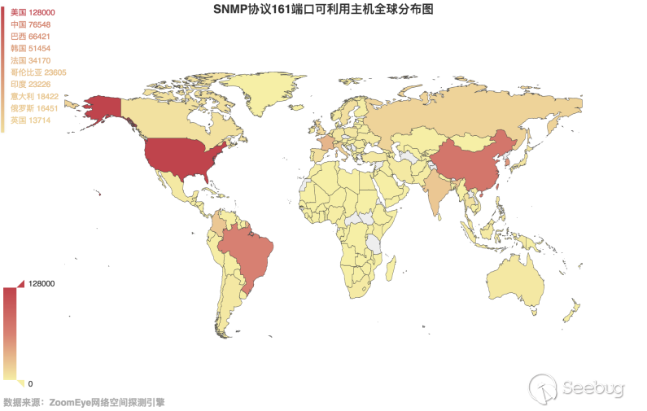

# 【ZoomEye专题报告】DDoS 反射放大攻击全球探测分析

src:https://paper.seebug.org/898/

**作者：知道创宇404实验室
ZoomEye专题：https://www.zoomeye.org/topic?id=Global-Detection-and-Analysis-of-Amplified-Reflection-DDoS-Attacks
PDF 版本：[下载](https://images.seebug.org/archive/DDos反射放大攻击全球探测分析-第五版_pr1mB6E.pdf)
English Version： https://paper.seebug.org/899/**

### 1.更新情况

| 版本   | 时间       | 描述                                                      |
| ------ | ---------- | --------------------------------------------------------- |
| 第一版 | 2017/08/07 | 完成第一轮数据统计，输出报告，完善文档格式                |
| 第二版 | 2017/08/14 | 完成第二轮数据统计，输出报告，完善文档格式                |
| 第三版 | 2017/11/15 | 完成第三轮数据统计，在第二轮的基础上增加对cldap的探测     |
| 第四版 | 2018/03/05 | 完成第四轮数据统计，在第三轮的基础上增加对Memcached的探测 |
| 第五版 | 2019/05/06 | 在第四轮数据统计基础上，增加对CoAP的探测，并完善为第五版  |

### 2.概述

DDos攻击是一种耗尽资源的网络攻击方式，攻击者通过大流量攻击，有针对性的漏洞攻击等耗尽目标主机的资源来达到拒绝服务的目的。

反射放大攻击是一种具有巨大攻击力的DDoS攻击方式。攻击者只需要付出少量的代价，即可对需要攻击的目标产生巨大的流量，对网络带宽资源（网络层）、连接资源（传输层）和计算机资源（应用层）造成巨大的压力，2016年10月美国Dyn公司的DNS服务器遭受DDoS攻击，导致美国大范围断网。事后的攻击流量分析显示，DNS反射放大攻击与SYN洪水攻击是作为本次造成美国断网的拒绝服务攻击的主力。由于反射放大攻击危害大，成本低，溯源难，被黑色产业从业者所喜爱。

在2017年8月3日到2017年8月6日期间ZoomEye网络空间探测引擎对全网进行第一轮的探测，统计可被利用进行DDoS反射放大攻击的主机数，发布了《DDoS反射放大攻击全球探测分析-第一版》，之后在2017年8月11日到2017年8月13日期间ZoomEye网络空间探测引擎再次对全网进行了探测，发布了《DDoS反射放大攻击全球探测分析-第二版》。之后在2017年11月13日到2017年11月15日期间，ZoomEye网络空间探测引擎探测到了另一个活动频繁的攻击——CLDAP DDoS反射放大攻击，随后对DDoS反射放大攻击进行了第三轮的探测，发布了《DDoS反射放大攻击全球探测分析-第三版》。

在2018年3月1日，ZoomEye又探测到在网络空间中频繁活动Memcached DRDoS， 进行第四轮对DDoS反射放大攻击的探测。

在2019年5月6日，ZoomEye又对网络空间种频繁活动的CoAP进行了DDoS反射放大攻击探测，并完善为第五版。

### 3.第五版放大攻击数据分析

[注：下面数据统计基于第四轮 2018/03/05 与 2019/05/06 CoAP数据]

2018年3月5日，进行了第四轮探测，ZoomEye网络空间探测引擎在对前面两轮6种DDoS攻击的探测的基础上，增加了对Memcached的探测。2019年5月6日，在第四轮基础上，增加了对CoAP的探测，并完善为第五版。

#### 3.1.CHARGEN

通过ZoomEye网络空间探测引擎获取到9万(95,010)台主机开放了19端口。然后对这9万主机进行放大倍率的探测，实际上只有1万(10,122)台主机开启了19点端口，占总数的10.65%。在开启了19端口的主机中，有6千(6,485)台主机的放大倍数能够达到10倍以上，占总数的64.07%，剩下的主机的放大倍数主要集中在2倍。相关数据如图3.1-1所示：

对放大倍数达到10以上的主机流量进行统计，我们总共发送了870KB(891,693 byte)的请求流量，得到了71M(74,497,401 byte)响应流量，产生了83倍的放大流量。假设一台主机1分钟内可以成功响应100个请求数据包，计算得到攻击流量有947Mbits/s。本轮探测对最大放大倍数进行了统计，得到了Chargen协议单次请求响应最高能放大319倍流量。

上面的数据和之前两次的的数据进行比较，Chargen DDoS攻击的危害并没有减小，反而有增大的趋势。

根据ZoomEye网络空间探测引擎的探测结果，对可利用的Chargen主机进行全球分布统计，见图3.1-2：

3.1-2 Chargen协议19端口可利用主机全球分布图

从图中可以看出仍然是韩国具有最多数量的可被利用进行DDos反射放大攻击的主机，我国排在第二 。下面，对我国各省份的情况进行统计，如图3.1-3所示：

3-1.3 Chargen协议19端口可利用主机全国分布图

#### 3.2.NTP

通过ZoomEye网络空间探测引擎获取到14万(147,526)台开启了UDP 123端口的主机。利用这些数据进行放大倍率探测，实际上只有1千(1,723)台主机开启了UDP 123端口，占总数的1.17%，放大倍数大于10的主机只有4台，占有响应主机总数的0.23%，具体数量见图3.2-1所示：

和上一次探测的结果相比，利用NTP进行反射DDoS攻击的隐患基本消除，不管是NTP服务器的总量还是可被利用服务器数量，都大幅度下降，尤其是本次探测中，只发现4台可被利用的NTP服务器，而且这4台皆位于日本。我国未被探测到可被利用的NTP服务器。

#### 3.3.DNS

通过Zoomeye网络空间探测引擎获取到2千万(21,261,177)台UDP 53端口相关的主机，对这些主机进行放大倍率探测，实际上只有384万(3,847,687)台主机开启了53端口，占了扫描总数的18.1%。在开启了53端口的主机中，有3万(31,999)台主机放大倍数在10倍以上，只占总数的0.83%，而放大倍数为1的主机有277万(2,776,027)台，具体数据见图3.3-1：

和上一版的数据相比，互联网上DNS服务器的和可被利用的DNS服务器数量均处于下降状态。

下面，再来看看这3万台放大倍数大于10的主机全球分布情况，如图3.3-2所示，可以看到，和上一轮相比，数量排名没啥变化，仍然是美国排在第一位。我们又对可利用主机在我国的分布情况进行了统计，如图3.3-3所示，和上一轮相比，湖北省的DNS服务器数量有了明显的提高。

3.3-2 DNS协议53端口可利用主机全球分布图

3.3-3 DNS协议53端口可利用主机全国分布图

#### 3.4.SNMP

通过Zoomeye网络空间探测引擎获取到1千万(11,681,422)台UDP 161端口相关的主机，对这些主机进行放大倍率探测，实际上有167万(1,677,616)台主机开启了161端口，占了扫描总数的14.36%。在开启了161端口的主机中，有61万(617,980)台主机放大倍数在10倍以上，占了总数的36.84%，具体数据见图3.4-1：

本次探测得到的数据和前一轮的数据相比较，探测到的SNMP主机数增加，而可利用的主机数却呈下降状态。

下面，再来看看这61万台放大倍数大于10的主机全球分布情况，如图3.4-2所示，可以看到，我国的主机量上升到了第二位。我们又对可利用主机在我国的分布情况进行了统计，如图3.4-3所示，台湾，北京，黑龙江仍然是受影响最深的几个省份之一。

3.4-2 SNMP协议161端口可利用主机全球分布图

3.4-3 SNMP协议161端口可利用主机全国分布图

#### 3.5.SSDP

通过Zoomeye网络空间探测引擎获取到3千万(32,522,480)台UDP 1900端口相关的主机，对这些主机进行放大倍率探测，实际上有60万(609,014)台主机开启了1900端口，占了扫描总数的1.87%。在开启了1900端口的主机中，有57万(572,936)台主机放大倍数在10倍以上，占了总数的94.08%，具体数据见图3.5-1：

下面，再来看看这57万台放大倍数大于10的主机全球分布情况，如图3.5-2所示，和上一轮探测的数据相比，没有明显的变化。 再对我国的数据进行统计，如图3.5-3所示，台湾仍是我国可被利用的主机数最多的省份，远远超过我国的其他省份。

3.5-2 SSDP协议1900端口可利用主机全球分布图

3.5-3 SSDP协议1900端口可利用主机全国分布图

#### 3.6.CLDAP

通过Zoomeye网络空间探测引擎获取到40万(403,855)台UDP 389端口相关的主机，对这些主机进行放大倍率探测，实际上有1万(17,725)台主机开启了389端口，占了扫描总数的4.39%。在开启了389端口的主机中，有1万(17,645)台主机放大倍数在10倍以上，占了总数的99.55%，具体数据见图3.6-1：

下面，再来看看这2万台放大倍数大于10的主机全球分布情况，如图3.5-2所示，可以看到，美国仍然是可被利用的CLDAP服务器数量最多的国家，我国依旧排第三位。我们又对可利用主机在我国的分布情况进行了统计，如图3.5-3所示，台湾依然是我国可被利用的主机数最多的省份，和香港一起远远超过我国的其他省份地区。

3.6-2 LDAP协议389端口可利用主机全球分布图

3.6-3 LDAP协议389端口可利用主机全国分布图

#### 3.7.Memcached

Memcached是一个自由开源的，高性能，分布式内存对象缓存系统。Memcached是以LiveJournal旗下Danga Interactive公司的Brad Fitzpatric为首开发的一款软件。现在已成为mixi、hatena、Facebook、Vox、LiveJournal等众多服务中提高Web应用扩展性的重要因素。Memcached是一种基于内存的key-value存储，用来存储小块的任意数据（字符串、对象）。这些数据可以是数据库调用、API调用或者是页面渲染的结果。Memcached简洁而强大。它的简洁设计便于快速开发，减轻开发难度，解决了大数据量缓存的很多问题。它的API兼容大部分流行的开发语言。本质上，它是一个简洁的key-value存储系统。一般的使用目的是，通过缓存数据库查询结果，减少数据库访问次数，以提高动态Web应用的速度、提高可扩展性。

Memcached Server在默认情况下同时开启了TCP/UDP 11211端口，并且无需认证既可使用Memcached的储存服务。2018年3月2日，ZoomEye对全网开启了UDP 11211端口，并且无需认证的Memcached进行探测，共得到14142个目标，并对这些目标进行全球分布统计，如图3.7-1所示：

3.7-1 Memcached可被利用主机全球分布图

从上图中可以明显的看出我国对安全问题的重视程度和国外仍然有较大的差距。在14142个有效目标中，有11368个目标的IP地址位于我国。下面再对我国的目标进行全国分布统计，如图3.7-2所示：

3.7-2 Memcached可被利用主机全国分布图

Memcached未开启认证的情况下，任何人都可以访问Memcached服务器，储存键值对，然后可以通过key来获取value。所以，为了摸清出全球Memcache可利用的情况，我们在Memcached储存一个key为1byte的，value为1kb的数据，然后我们再通过该key获取到value，这样就产生了将近1000倍的放大效果。Memcached在默认情况下还会开启UDP端口，所以这就导致了Memcached可以被利用来进行DDoS放射放大攻击。而Memcached能放大多少倍取决于：

1. Memcached服务器带宽
2. Memcached能储存的值的最大长度

利用自己的服务器进行一个测试，首先让能利用的Memcached储存一个1kb长度的值，然后同时向所有目标获取值，能收到886Mbit/s的流量，如图3.7-3所示：

3.7-3 流量统计图

#### 3.8.CoAP

CoAP（Constrained ApplicationProtocol）是一种应用在物联网网络的应用层协议，它的详细规范定义在RFC 7252。由于物联网设备大多都是资源限制型设备，例如有限的CPU、RAM、带宽等。对于这类设备来说想要直接使用现有网络的TCP和HTTP来实现设备间的通信显得很奢侈。为了让这部分资源受限的设备也能够顺利的接入网络，CoAP协议应运而生。CoAP指受限制的应用协议，是基于UDP实现的类HTTP协议。相比于HTTP协议，CoAP继承了HTTP协议的可靠传输，数据重传，块重传，IP多播等特点。并且CoAP利用二进制格式传递数据，这样使得CoAP请求更加的轻量化，并且占用的带宽更小。

CoAP协议规定提供服务的设备，必须提供./well-known/core的Uri-path并且默认绑定在5683端口上。2019年5月6日，通过Zoomeye网络空间探测引擎获取到857,031台UDP 5683端口相关的主机，对这些主机进行放大倍率探测，实际上有344,462台主机开启了5683端口，占了扫描总数的40.19%。在开启了5683端口的主机中，有137,207台主机放大倍数在10倍以上，占了总数的39.83%，具体数据见图3.8-1：

对响应主机全球分布情况分析如图3.8-2，可以看到主要分布在俄罗斯与中国：

3.8-2 CoAP可被利用主机全球分布图

对响应主机国内分布情况分析如图3.8-3，主要分布在江西、四川、新疆

3.8-3 CoAP可被利用主机全国分布图

另外，我们对国内设备的响应报文进行了简单分析，发现有大量设备的响应数据中都包含有Qlink关键字。

### 4.总结

和前面三轮探测的数据相比，在第四轮的探测中，变化最大的是NTP服务，当前互联网的NTP服务器已经没办法造成大流量的DDoS反射放大攻击了。与之相比，其他协议也或多或少的降低了可被利用的主机数量 。DDoS反射放大攻击仍然危害巨大，DDoS防御仍然刻不容缓。

从这次ZoomEye探测到的数据中，再和公网上的Memcached服务进行对比：

4-4 ZoomEye探测11211端口数量

在ZoomEye的数据库中，开启11211端口的目标有54万，其中美国有23万，中国有13万的目标，但是开启了UDP 11211端口的数据中，总量只有14142，其中美国有1070的目标，中国有11368个目标主机。

从这些数据对比中，可以看出美国对此类的安全事件有非常快的响应速度，中国和美国的差距还很大。

从放大效果来看，虽然可利用的目标已经缩减到1万的量级，但是仍然能造成大流量的DDos攻击。

对于Memcached的用户，我们建议关闭其UDP端口，并且启用SASL 认证，对于运营商，建议在路由器上增加的uRPF(Unicast Reverse Path Forwarding)机制，该机制是一种单播反向路由查找技术，用于防止基于源地址欺骗的网络攻击行为，利用该机制能使得UDP反射攻击失效。

第五版中，增加了对于CoAP的探测，从上面统计与分析的数据中可以看到，能被利用进行DDoS反射放大的主机主要分布在俄罗斯与中国，并且放大效果在10倍以上的主机也不少。对于使用CoAP的互联网服务，可以禁用UDP，不能禁用时确保请求与响应不要有倍数关系，也可以启用授权认证；对于企业用户，没有UDP相关业务，可以再上层或者本机防火墙过滤掉UDP包，可以寻求运营商提供UDP黑洞的IP网段做对外网站服务，也可以选择接入DDoS云防安全服务或删除协议默认路径; 对物联网用户，如果没有公网访问需求，物联网设备不启用公网IP，如果有公网访问需求，应添加防火墙规则，限制访问IP，减少互联网暴露面。

### 5.参考链接

1.Stupidly Simple DDoS Protocol (SSDP) generates 100 Gbps DDoS.
https://blog.cloudflare.com/ssdp-100gbps/
2.基于SNMP的反射攻击的理论及其实现.
http://drops.xmd5.com/static/drops/tips-2106.html
3.基于Memcached分布式系统DRDoS拒绝服务攻击技术研究.
https://paper.seebug.org/535/
4.ZoomEye Chargen dork.
https://www.zoomeye.org/searchResult?q=port%3A19
5.ZoomEye NTP dork.
https://www.zoomeye.org/searchResult?q=port%3A123
6.ZoomEye DNS dork.
https://www.zoomeye.org/searchResult?q=port%3A53
7.ZoomEye SNMP dork.
https://www.zoomeye.org/searchResult?q=port%3A161
8.ZoomEye LDAP dork.
https://www.zoomeye.org/searchResult?q=port%3A389
9.ZoomEye SSDP dork.
https://www.zoomeye.org/searchResult?q=port%3A1900
10.ZoomEye Memcached dork.
https://www.zoomeye.org/searchResult?q=port%3A11211
11.ZoomEye CoAP dork
https://www.zoomeye.org/searchResult?q=port%3A5683