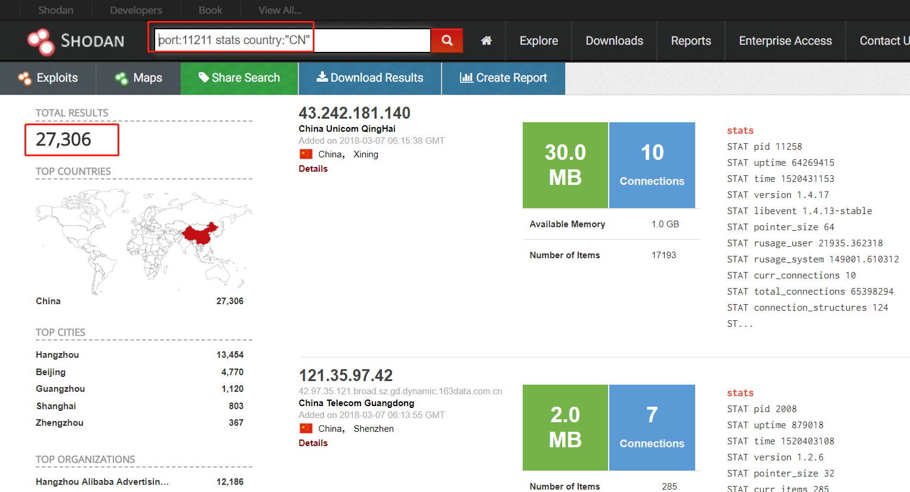
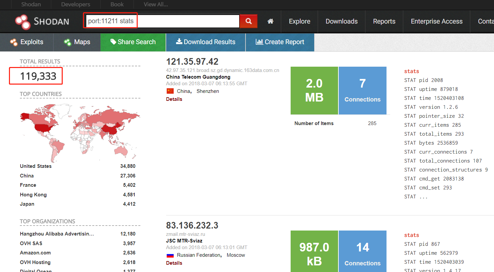
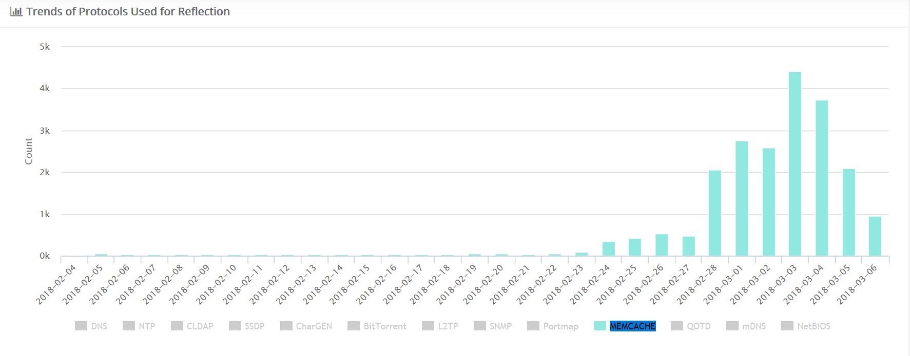
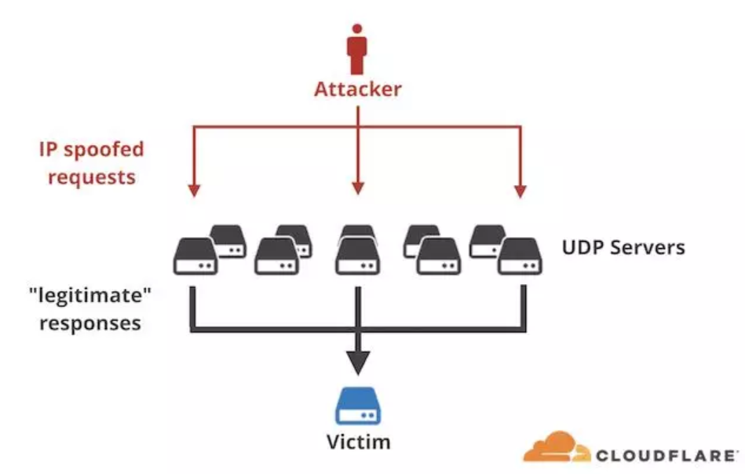
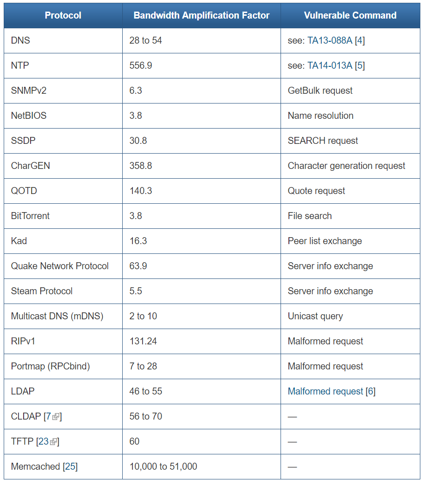
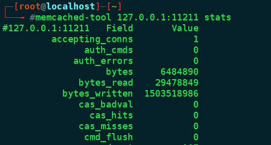
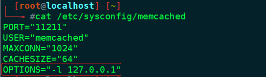

# 利用Memcached的反射型DDOS攻击

#### 0x00 影响面

最近几天，Memcached反射DDOS流量突然增大，引起了国内外多家安全厂商和机构的注意，我也在第一时间持续关注跟踪相关事件。

根据shodan的统计，国内受[影响的](https://www.dazhuanlan.com/2020/02/18/5e4bdf82b2e2f/)Memcached服务器大约有27300+个：



全球受影响的Memcached服务器大约有119000+个：



DDoSMon统计的Memcache DRDOS在现网中的情况：



#### 0x01 Memcached 反射DDOS攻击原理

###### 什么是反射DDOS（DRDOS）

反射DDOS是发送大量带有被害者IP地址的请求给反射服务器，反射服务器对IP地址源做出大量回应，形成拒绝服务攻击。CLOUDFLARE的这张图很好的解释了DDOS反射攻击过程：



###### UDP反射放大攻击需要满足的基本条件：

1.攻击者，需要能伪造IP，并发送大量伪造IP的请求给反射服务器。

2.反射服务器，上面需要运行着容易放大反射攻击的服务。

3.反射服务器的响应包最好远远大于请求包。

4.反射服务器对应的协议或服务在互联网上有一定的使用量。

本次事件中，攻击者发送大量带有被害者IP地址的UDP数据包给Memcached服务器，Memcached服务器对伪造的IP地址源做出大量回应，形成分布式拒绝服务攻击。

###### 本次攻击的特点：

1.memcache放大倍数高，最高可以达到51000倍左右。

2.可被利用的memcache服务器（反射服务器）数量很多，而且这些服务器网络拥有较高的带宽资源。

下面这张us-cert的表详细的给出了各类反射攻击的放大倍数：



仅从放大倍数看，memcached 反射DDOS危害要高于其他类型的反射DDOS。

###### Memcached DRDOS攻击流程

1.收集反射器,扫描端口和服务，获取不需要认证的Memcache。

2.上传指定数据到远程服务器Memcached上。

3.攻击者将自身IP伪造成攻击的目标IP地址，向Memcached反射服务器发送请求读取在Memcached中存储的数据。

4.Memcached在收到请求后，向伪造的IP回复放大了几万倍的数据包，造成反射DDOS攻击。

#### 0x02 Memcached环境搭建

系统centos7

安装：

```
yum -y install memcached
```

将memcached加入linux服务：

```
chkconfig --level 2345 memcached on
```

vi /etc/sysconfig/memcached来修改参数， 修改memcached的参数，主要涉及memcached启动绑定的端口、用户、最大连接、最大内存等.

```
PORT="11211"
USER="memcached"
MAXCONN="1024"
CACHESIZE="64"
OPTIONS=""
```

启动、关闭、重启memcached服务

```
systemctl start/stop/restart memcached.service
```

修改完配置参数后，需要重启memcached服务来完成参数的生效。

可使用memcached-tool来检测memcached的服务状态：

```
memcached-tool 127.0.0.1:11211 stats
```

正常情况下显示如下：



#### 0x03 DRDOS攻击测试

蜜罐搭建成功后我们对它进行了一些测试，可以看到，本次测试放大倍数基本上稳定在2w+多倍，太恐怖了。


#### 0x04Memcached反射DDOS防御

###### Memcached攻击流量清洗

1. 运营商处在边界配置UDP访问控制规则和BGP FlowSpec策略，将源端口为11211的流量进行阻断或限速。
2. 不具备路由权限的企业客客户，可以在抗DDOS设备上配置防护策略，同样可以对端口为11211的UDP流量进行阻断和限速。

###### Memcached系统防护加固

默认情况下Memcached没有配置任何认证鉴权措施，对所有网络可达的客户端可访问。为了避免Memcached系统被攻击者利用，各开发者和memcache管理者，需要对Memcached服务进行安全检查，进行一些加固。

###### 1.配置监听地址仅限本地回环地址

在 memcached的配置文件，或者启动参数中，使用”-l 127.0.0.1”指定监听的 ip 地址。



###### 2.配置防火墙 ACL 策略

使用 iptables 等手段控制 memcached 的端口ACL策略，示例如下：

仅限来自指定 IP 段的访问

```
iptables -t filter -A INPUT -p tcp -s 192.168.1.0/24 --dport 11211 -j ACCEPT
```

屏蔽任何其他 IP 对 Memcached 端口的访问

```
iptables -t filter -A INPUT -p tcp --dport 11211 -j DROP
```

###### 3. 配置认证鉴权策略

Memcached 1.4.3 及之后的版本，如果编译时开启了 –enable-sasl，则可以使用 sasl 配置认证。

安装

```
yum install cyrus-sasl
```

设置用于 Memcached 的 SASL 用户名密码,运行以下命令，指定需要的用户名，然后输入两次密码即可:

```
saslpasswd2 -a memcached -c [customized username]
```

由于 SASL 账户密码默认保存在 /etc/sasldb2 文件里，但是该文件权限为 0640 或者 0660，对于运行 Memcached 的 user/group 不可读，因此需要做一些权限上面的修改。

配置该文件的属组为 Memcached 运行所用的 group。

```
sudo chown :memcached /etc/sasldb2
```

配置 Memcached 启用 SASL 认证在 memcached 的配置文件，或者启动参数中，使用 “ -S ” 即可开启 SASL 认证示例配置：

```
PORT="11211"

USER="memcached"

MAXCONN="1024"

CACHESIZE="64"

OPTIONS="-S"
```

#### 0x05 追溯处置措施

这种反射DDOS攻击源追踪难点在于准确定位，在被攻击端，看到的IP都是真实的IP，都是被利用的反射放大节点服务器。和直接攻击不一样，因为有反射的因素，这时候看到的真实攻击IP不是真正的发起原始流量的IP。下面结合以往追溯DDOS攻击的经验给出几点建议**：**

###### 反射源上找线索

通过memcached蜜罐监测，看初期的信息采集阶段（比如找可用度反射放大源）很可能用的就是自己的IP，各种小动作会露出马脚，再多个维度关联，有时也能找出攻击者。

###### 失陷主机上找线索

在一次大流量过后，访问量高的IP都可以列为可疑目标，重点排查，尤其要注意筛选ICMP数据包，一般情况下攻击者有个习惯：就是在攻击的过程中和攻击结束都会用本机ping目标服务器，查看目标的存活性。如果运气好，能找出攻击者。

###### 运营商配合定位攻击者

通过memcached蜜罐的监测，根据以上测试过程中得出的Memcached DRDOS攻击的流量特征，和运营商配合，看哪些子网有非自己段的源IP流量出来，然后再做端的流量监测，比如HIDS，即为可以找出可疑IP。