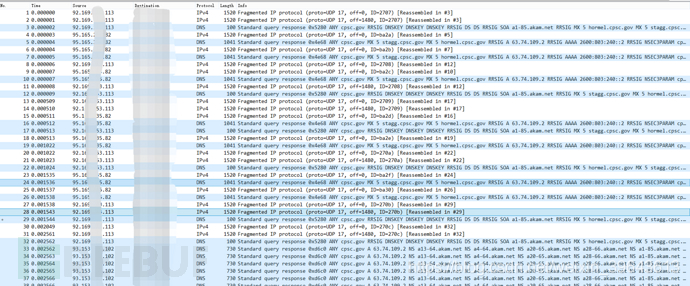
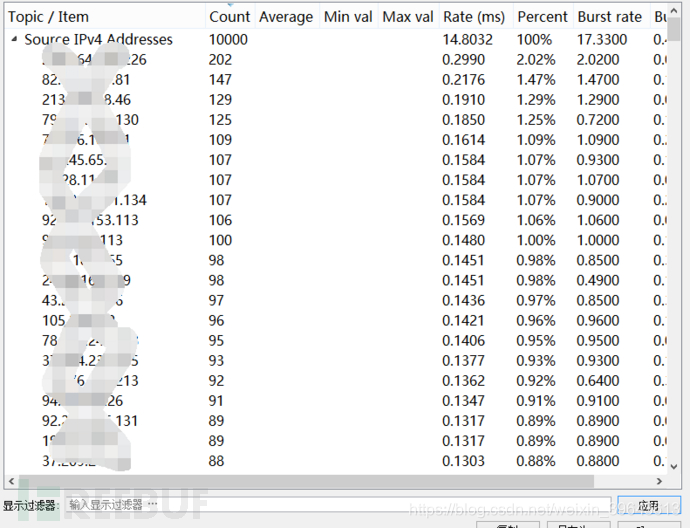
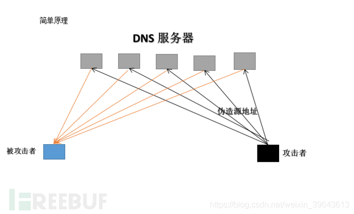
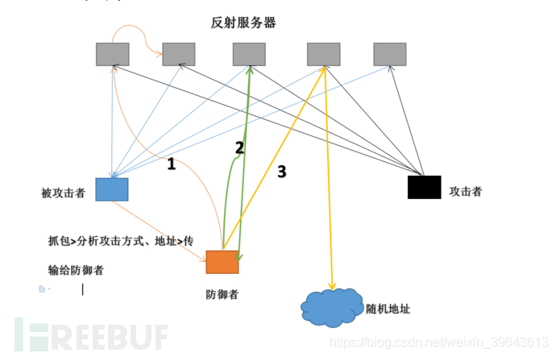
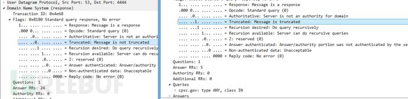
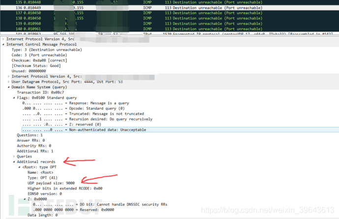

# 反射DDoS攻击的一点小想法

src:https://www.freebuf.com/articles/web/138163.html

# 0x01 为啥写这个

故事的起因呢就是前些日子我们受到了一次持续几分钟的反射型DDOS攻击，根据之后查看当时的取证数据，这次攻击是一次基于DNS协议的反射型DDOS攻击，攻击流量大约20G左右。

以下是当时抓包的截图

这次攻击中使用的域名是cpsc.gov  type为ANY，最大的返回包超过3000字节，放大倍数30倍-40倍，攻击者利用的DNS服务器大约有400个，鉴于我国带宽比较贵，我推测这些DNS服务器的平均带宽应该在50M-100M之间，所以这400个DNS服务器能发出的最大攻击流量也就应该在20G-40G之间，目前网络上可以发动DNS反射的服务器非常 非常多保守估计也要几千万，攻击者没有用过多的DNS服务器那说明攻击的攻击带宽受到限制，或者说攻击者只购买了20G流量来进行攻击，我猜测攻击者的初始流量大概在1G上下（多了没意义）。

以下是统计DNS服务器IP的截图

# 0x02 说说反射攻击的实现条件

反射攻击的实现主要是两方面

第一、请求包要小于回应包很多，他们之间相差的倍数就是反射攻击的放大倍数，目前比较受欢迎的是NTP、DNS、SSDP、SNMP等等，都是UDP协议上实现的。

第二、攻击方要能实现源地址的伪造，目前我国电信是不能随意伪造源地址发送数据的，电信全网都开启了松散的urpf（单播 反向路由查找技术 ），只能伪造同一网段的源地址，这让反射DDOS攻击受到很多的限制。

# 0x03 谈谈作为普通用户怎么防御

我这里说的普通用户不是指我们个人用户，而是指的各个企业，相对于运营商来说企业是普通用户。我们作为被攻击者当我们看到流量、当我们能做一些动作（比如丢弃数据包）的时候，这时候攻击的目的已经达到了，攻击流量已经阻塞了我们的下行流量接口。所以传统的抗DDOS设备对这种攻击是毫无办法的，目前广泛使用的方法是通过DNS切换域名对应IP来躲避攻击影响，目前来看这种方法很有效，但是也存在一些不足，就是我们的权威DNS解析记录的TTL会被靠近用户端的DNS服务器篡改，这导致不管我们把ttl改到多低，等到了用户那还是要有十分钟左右，在这段时间企业的业务是会受到很大影响的。当然还可以从运营商或云服务商那购买这种抗DDOS服务，这种方法很有效（至少在流量不是特别大的时候），但是价格是有点太贵啦。

# 0x04 有没有其他的办法呢？

有肯定是有的，不然我也不会写这个文章，但是我没有真正的实际部署过，只是在实验中取得了不错的效果。我要说的这种方法通过与攻击者相同的方式来减少攻击流量，主动的进行防御，可以快速的降低攻击流量到我们能接受的范围内。

说说实现原理吧

一般DDOS攻击都是花钱买黑客发动的攻击，要多大流量打多大流量，黑客攻击产业化，这样也有好处，就是使用的反射服务器数量不会过多，需要多少用多少，这就让我们防御方便实现。

比如说我们被攻击那次使用的反射DNS服务器是400个，流量是20G，这差不多就是这400个DNS服务器的极限了，如果恰巧两个黑客同时使用这400个DNS服务攻击两个IP，那么这两个被攻击IP所承受的流量应该是大约每个10G（理论上），这不就相当于说流量减小了一半吗。

这种方法主要是要引入一个第三方作为防御者，当被攻击者被DDOS攻击时，立刻抓包分析出攻击的地址（这里的地址是指反射服务器的ip地址）和利用的协议（NTP、DNS等）然后把这些信息传给防御者，防御者根据这些信息选择合适的防御方式，我们可以使用一台或者多台可以伪造地址的云主机作为防御者，带宽要在1G以上比较好。成本一台一个月大概1000多。

第一种防御方式，是获得了反射服务器的地址列表后，迅速进行排列，让排名靠前的一半也DDOS攻击靠后的一半，原因是按照数量排列靠前的说明发包多，也间接说明这个服务器带宽大，让他来攻击后面带宽小的比较容易起作用，这样消耗前一半的带宽，也阻塞后一半的入口带宽，如果效果好理论上能减少攻击流量的一半以上。但是这种方法对于NTP和ssdp的攻击不适用，因为NTP服务器和SSDP所在的网络大部分是在家庭网络（比如家用路由器），家庭网络上行带宽小下行带宽大，所以无法达到想要的效果。  

第二种防御方法，就是一种反射DDOS攻击的特殊形式，攻击自己的DDOS，因为防御者没有业务，所以把攻击流量都引到自己身上也不会有什么关系，如果防御者的带宽跟攻击者一样，那么理论上能是攻击流量减少50%。如果防御者比较多，减少的会更多。这种方式最好实现，不需要伪造地址，家庭宽带也可以。

第三种防御方式，跟第二种很像只不过发出的报文的源地址是随机的，也就是说在攻击全球的IP地址，不过这些流量被分散开了，对谁都不会有什么影响，这种方式我做过实验（不一定准），对于NTP反射的流量能减小70-80%，也就是说攻击流量能到原来的五分之一，但是实验时用的地址比较少，次数也只有一次所以我也不敢说效果能多好，不过按理说应该是比第二种好一些。

**防御者的其他形式**
用几台云主机来做防御者最简单，但是要想效果好就要数量和带宽跟得上，这就要一些投入，我有一些可能不好实现的想法在这里也讨论一下。

1、如果我们买入一批可以刷机的智能家用路由器（200台？），装上一个软件，就是第二种防御方式，然后发给各个员工们（自愿，公开用途不隐瞒），用各个员工们的家用宽带在必要时帮忙防御，防御时网络可能会阻塞，但是这个数量越多对每个家庭网络的影响越小，防御的效果也越好。这个成本低（一次投入）效果好。

控制方式可以是以域名方式请求一个网页，网页中内容大概是开关、持续时间、协议类型、ip地址列表等

2、这个方法违法，就是搞一大堆肉鸡来使用上面的三种方法来防御，这个不推荐。

当然只是百分比的降低攻击流量是没有太大效果的，因为目前我国带宽比较贵，好些公司可能只有百兆的带宽，而DDOS攻击又很便宜，20G的攻击也没几个钱，这样即使把20G的流量缩小到1G也是能造成很大影响的，怎么办呢？我们可以通过配合有些云服务商赠送的DDOS防御来使用，有些地方会赠送或者很便宜的买到5G、10G的DDOS防御，这样配合起来不就能防御住大几倍的攻击了吗！如果是在IDC中可以购买或者要求赠送（为了成本吗，能赠送就要赠送的）临时提高带宽的服务，攻击来的时候临时提高带宽配合以上方法来防御。

**这种防御的优缺点**
优点：毋容置疑那就是便宜啊，而且反应速度完全可控，效果也比较明显

缺点：非常大的局限性，只能防御部分的反射DDOS攻击，对于其他DDOS攻击无能为力，整体的流程相对比较复杂要在多个设备上完成。

具体的效果呢 我也不是很清楚，希望喜欢研究的朋友可以去研究一下，代码我有零零乱乱的几个部分，没有时间整合起来，需要的可以私下跟我要。

接下来在来个番外篇吧！

# 0x05 番外篇
我在复现DNS反射攻击的时候发现了一个问题，就是我获得的回应报文远远小于攻击者获得的回应报文，我获得的大概只有500多自己而攻击者获得的确有3000多字节，我们查询同样的域名cpsc.gov  同样的type为ANY，为啥结果不同呢，然后我对比了两个报文的差别

就是这里，一个是被截断过得一个是没有被截断过的，在我以前学的课本中说过UDP上的DNS协议超过512字节是会被截断的（记不太清了），为啥这个3000多字节的却没有被截断呢，然后我就苦苦寻找各种百度，然后我在再次查看攻击取证包时发现了几个ICMP报文，我打开ICMP报文之后我好像发现了宝！！！

乍一看是的ICMP报文实际上它包含了整个攻击者发出的完整DNS请求报文

在经过我百度之后才弄清楚这个是EDNS0，相当于对DNS协议的一种扩展吧，在这部分可以指定DNS返回报文的最大长度，图中指的UDP payload size：9000就是这个意思。知道这个关键之后再进行测试获得的返回报文就大了很多了。想玩DNS反射的童鞋们一定要注意这些细节啊。