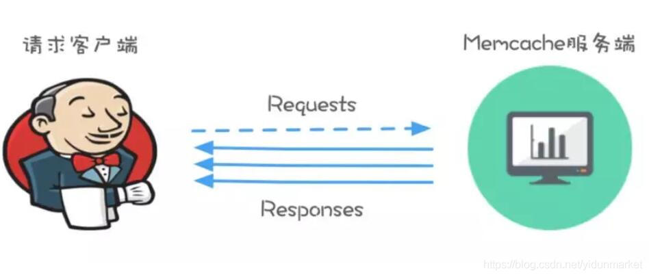
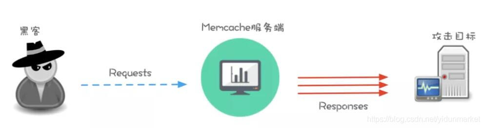
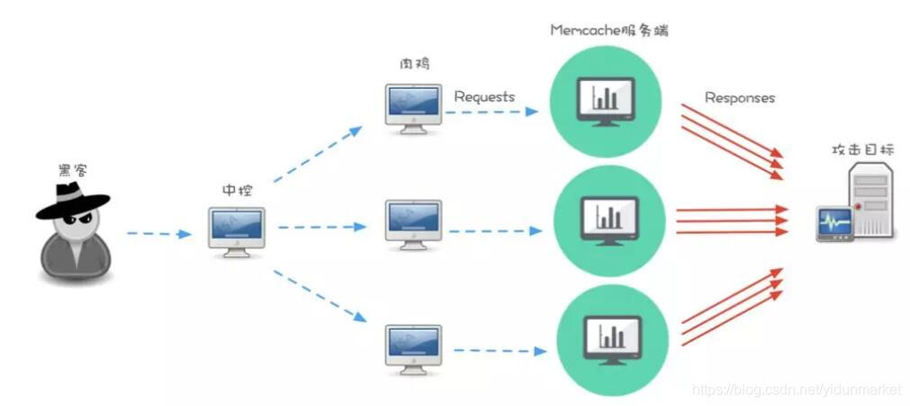
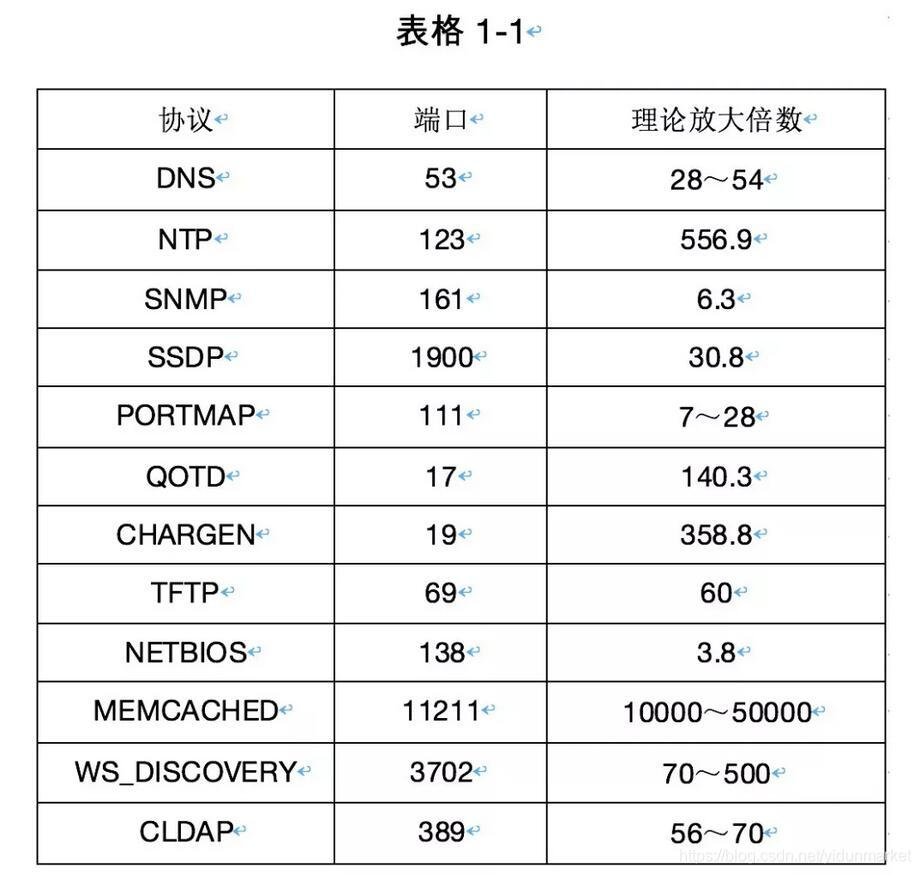
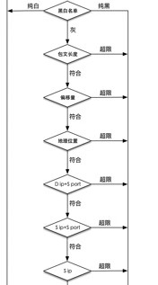

# 盘点：常见UDP反射放大攻击的类型与防护措施

src:https://blog.csdn.net/yidunmarket/article/details/101222095

本文作者为易盾实验室工程师

**一、DDoS攻击简介**

分布式拒绝服务攻击（Distributed Denial of Service）简称DDoS，亦称为阻断攻击或洪水攻击，是目前互联网最常见的一种攻击形式。DDoS攻击通常通过来自大量受感染的计算机（即僵尸网络）的流量，对目标网站或整个网络进行带宽或资源消耗，使目标无法处理大量数据包，导致服务中断或停止。

UDP是网络通信的标准协议，由于UDP数据包是无链接状态的服务，相对TCP而言，存在更少的错误检查和验证。攻击者可以更小代价的利用UDP 协议特性攻击目标主机，使其无法响应正确请求，甚至会导致线路拥塞。而UDP反射放大攻击，更是近几年最火热，被利用最多的攻击方式。成本之低，放大倍数之高，使各企业闻D色变。

**二、UDP反射放大攻击原理**

很多协议在响应包处理时，要远大于请求包，一个字节的请求十个字的响应，十个字节的请求一百个字的响应，这就是UDP反射放大攻击最根本的原理。以下将Memcached服务作为实例进一步介绍。

Memcached是一款开源的高性能分布式内存对象缓存服务，通过缓存来降低对数据库的访问请求，加快应用程序的响应效率，可以应用于各类缓存需求中。通过查询缓存数据库，直接返回访问请求，降低对数据库的访问次数。

也正是这种服务机制，使攻击者有了可乘之机，借用正常服务达到攻击的目的。Memcached支持UDP协议的访问请求，并且默认也会将UDP端口11211对外开放，因此攻击者只需要通过快速的端口扫描，便可以收集到全球大量没有限制的Memcached服务器，随后攻击者只需要向Memcached服务器的UDP:11211端口，发送伪造为源IP的攻击目标IP地址的特定指定请求数据包，服务器在收到该数据包后，会将返回数据发送至攻击目标的IP地址。

黑客攻击者如果利用恶意软件的传播，来控制大量僵尸网络，再利用大量僵尸网络作为请求源，向Memcached服务器发起请求，并伪造数据包和攻击目标IP，则该返回的数据包将成指数级上升，比原始请求数据包扩大几百至几万倍，从而通过反射加放大的形式，使攻击目标拥塞，无法正常提供服务。以达到低成本化，高隐蔽性的攻击手段。
**三、常见UDP反射类型**

除了常见的DNS，NTP等UDP反射放大攻击类型，目前还有其他十多种UDP协议，均可以用于反射放大攻击，如：SSDP、QOTD、SNMP、CHARGEN、LDAP、MEMCACHE、WS-DISCOVERY 等。放大倍数从几倍到几万倍，其中部分协议今天仍然非常流行。

此处整理了部分常见UDP反射放大协议，理论放大倍数和实际常见到的放大倍数作为对比，看看谁的放大威力更强。

由此可见，这种以小博大，四两拨千斤的效果使各企业异常头疼的，部分协议的UDP反射放大倍数，已经超越了单纯依靠技术可以防护的阶段，还需要投入大量的物料资源给予支持。

**四、常见防护方式**

针对此类强力的DDoS攻击方式，有哪些实用又性价比超高的防护手段？

因篇幅有限，下面来介绍比较好落地的防护流程，和几个简单有效的算法措施，可根据业务情况方便的开关增减，和闭环迭代，做到事前预防部署，事中策略对抗，事后分析总结。

通告类：关注各个设备和安全厂商，cncert发布的最新安全通告，及时更新针对性防护策略；

目标IP+源端口限速：可以用于控制反射性攻击，且可以预防未知的反射协议；

源IP限速：单个请求源IP的整体控制；

目标IP限速：单个攻击目标IP的整体可用性控制；

源IP+源端口限速：可以降低部分大客户源IP在访问请求时的副作用影响；

目标IP+目标端口限速：适用于目标IP端口开发范围较大时，可提高业务端口可用率，降低目标整体影响；

包文长度学习：通过对业务历史包文数据的统计学习，可以描绘出正常业务包大小的正态分布图，由此可以清晰识别出构造的超大或超小包攻击包文；

偏移字节数学习：检查学习各个UDP包文中相同偏移未知所包含的相同内容，并将此内容提出作为指纹特征，根据此指纹特征，可以判断UDP包文的丢弃或放行动作；

源端口波动限制：通过对业务正常的流量中，已知可被利用的UDP反射源端口进行统计，对源端口的数量执行监控，在这类源端口出现快速突增的波动时，将该源端口临时封禁，待源端口数量恢复后则解除封禁，可以大大降低攻击造成的影响性；

服务白名单：对于已知的UDP反射协议，如DNS服务器的IP地址添加为白名单，除此之外，其他源IP的53端口请求包，全部封禁，也可以大大减少反射可用点，使UDP反射放大攻击的影响面降低；

地理位置过滤器：针对业务用户的地理位置特性，在遇到UDP反射放大攻击时，可优先从用户量最少地理位置的源IP进行封禁阻断，直到将异常地理位置的源IP请求全部封禁掉，使流量降至服务器可处理的范围之内，或可有效减轻干扰流量，便于其他算法进一步处理；

扩容带宽服务器：增强带宽和服务器的处理能力，增加业务流量和处理极限的可容忍波动范围，可以减轻在防护过程中造成的影响；

改进高可用架构：同上，可以增加业务流量和处理极限的可容忍波动范围，可增加分布式节点，可用性自动调度等机制，以保障有节点中断时快速切换到可用节点。

**五、总结**

UDP反射放大攻击，是一种具有超大攻击威力，且成本低廉，难以追踪的DDoS攻击方式。如今的DDoS黑产链已经相当的完善和成熟，各个人员的分工，资源获取，集中管控，需求中介，简易化操作工具，方便快速的发起攻击，已经成为黑产界最喜爱的方式之一；

如今的DDoS攻击越来越普遍，每天都有各式各样的攻击不断在各处上演，攻击的流量也已经从G级别上升到T级别，一顿饭的价格，一支烟的时间，就可以给企业造成难以估计的经济损失和品牌受损。尤其是游戏类，金融类，电商类，都属于DDoS攻击的重灾区，如果能够充分借助大数据，人工智能技术，以及各大运营商，安全服务厂商的支持，和更有效的预警和防护处置方案，将会为企业的安全提供最有力的安全协同保障。