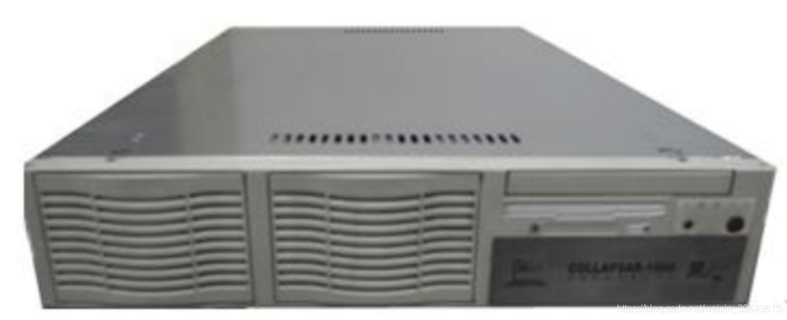
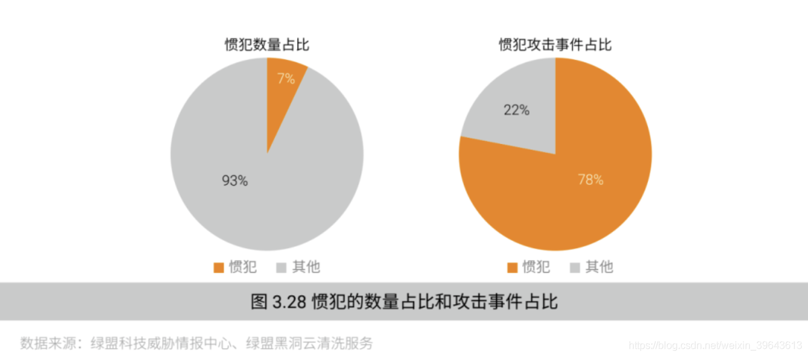
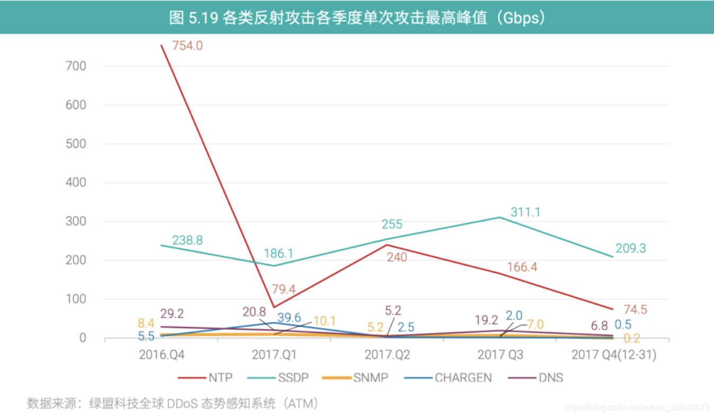
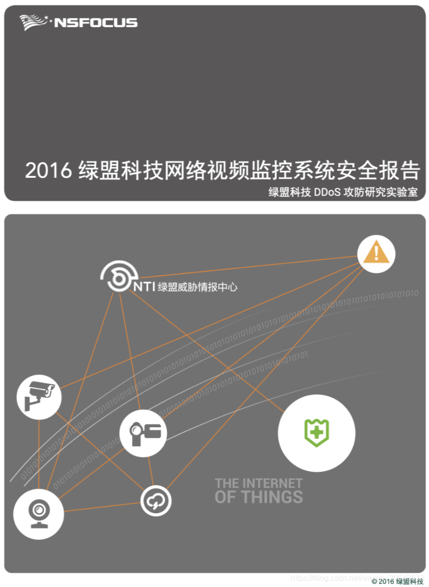
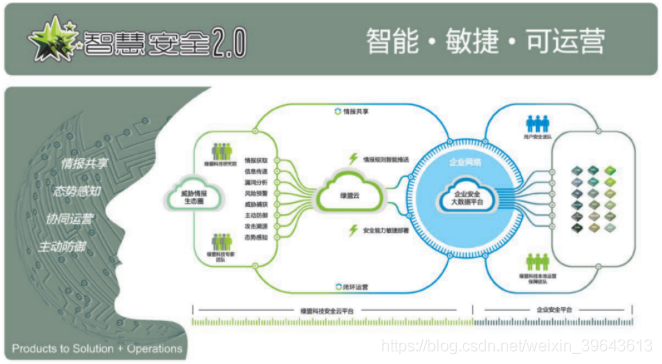
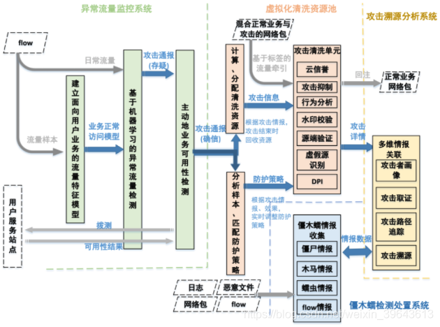
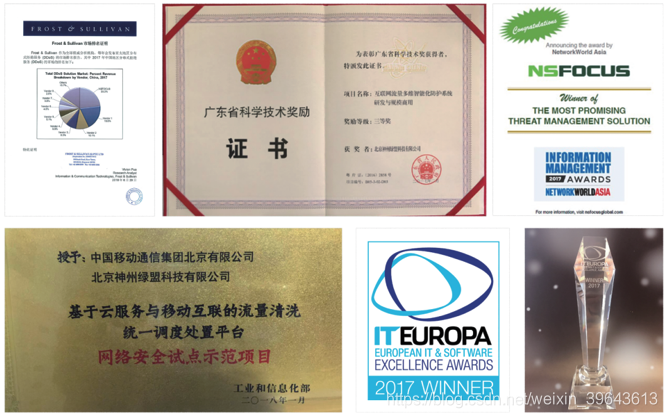
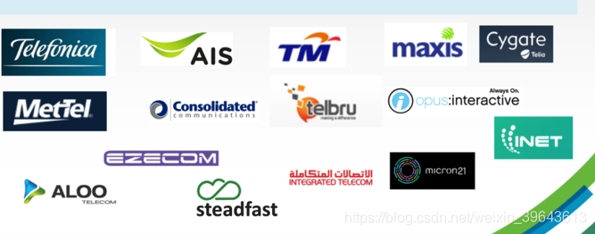
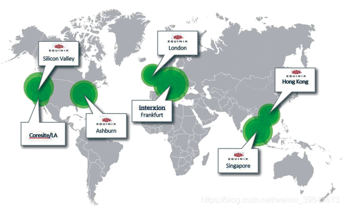

# 绿盟科技“黑洞”ADS

src:http://blog.nsfocus.net/ads-20years-0508/

>黑洞的发展史，就是当今DDoS攻击与防护的对抗史。路，从那一天开始……

黑洞的发展史，就是当今DDoS攻击与防护的对抗史。路，从那一天开始……

2002年10月25日，历经两年的技术研究和产品开发，绿盟科技“黑洞”正式面世。

在2005年之前，网络安全的相关法律还未出台，很多稍大一些的网站经常会受到黑产的勒索威胁，动不动就被DDoS，服务器瘫痪。正所谓“乱世出英雄”，危难时刻方显英雄身手。绿盟科技在这时出现，研发出针对当时主流 DDoS 攻击的防护产品——“黑洞”(Collapsar)。黑洞是中国第一款抗D产品，是这个细分品类的创造者和先行者，在黑洞之后才出现了思科、Arbor等友商的同类产品。天文学上说，“黑洞的质量是如此之大，它产生的引力场是如此之强，以至于任何物质都无法逃逸，哪怕是光”。

2020年是绿盟科技20岁生日，也是黑洞的18岁生日。当被问到黑洞是如何成为一款得到全球市场检验和认可的产品时，绿盟君脑海里不禁出现了一部放映机，回放着一个个”黑洞”故事。

黑洞的发展史，就是当今DDoS攻击与防护的对抗史。

路，从那一天开始。

# 1. 抵御“洪水”，“ 黑洞”降世

黑洞上市后很长一段时期里， “黑洞” 就是抗D产品代名词，甚至在一些主管机构文章中，就直接把抗D产品称为“黑洞”。那时，黑洞就等同于抗DDoS 技术。

很多网友会在网站上发表自己对黑洞、对抗D算法的理解。例如，有人讨论黑洞的反向探测技术， 写到 ：“黑洞不断向流量来的方向发送大量的反向数据，将攻击报文包围消灭掉……文中描述的黑洞，给人感觉不像是一台网络安全设备，更像是一台正负粒子对撞机，制造正负质子的对撞和湮灭。事实上，黑洞确是有反向探测技术的（现已经是公开的技术），但是无法像论坛帖子上所述，可通过反向的数据包消灭发送过来的 DDoS报文，黑洞只是通过反向探测技术来区分正常或恶意流量。

除去这些轶闻趣事，网络上还是会有很多对黑洞的研究。当时一些论坛上，有人公布自己的发现，宣称找到了黑洞的弱点，比如，有人反推黑洞的抗 D算法，然后研讨在黑洞防护下的绕过方式。面对这些挑战，黑洞组的同事们大多一笑而过，但也有个别，让大家感受到真正的威胁。

这其中，最著名的应该就是 CC 攻击了。

# 2. Challenge Collapsar，黑洞迎接CC挑战

CC 攻击的全名—Challenge Collapsar，翻译过来就是挑战黑洞。

挑战的起因是一次未如约进行的面试，叶博士当时因一些突发原因没能面试 Qaker，于是 Qaker 含怒埋头苦研，发布了专门针对黑洞Collapsar 的 CC（Challenge Collapsar）攻击。谁都不曾想到，此后CC攻击（以及后来的CC变种）给中国乃至世界互联网安全带来长期困扰。

棋逢高手甚欢喜，面对突如其来的新型 DDoS 攻击，黑洞组的同事们泛起缕缕喜悦，丝丝紧迫。在叶博士带领下，黑洞组开启自虐模式，潜心分析 CC 攻击表象及原理，并结合用户环境不断推演方案，力求防护的同时对业务的影响降到最低。设定方案、推演方案、驳斥方案、确立方案，理论逐渐完备，最终，黑洞对CC攻击的清洗能力得到广泛认可。

或许是不打不相识，抑或是相互欣赏，后来叶博士和Qaker成为朋友，经常一起探讨新型攻击的原理和对抗方式。保持旺盛的激情，形成清晰科学解决问题的逻辑体系，了解黑客所思所为，夯实关键技术实力，是成就全球知名安全产品的先决条件。魔高一尺，道高一丈。虽然 CC 攻击的发展危害了互联网安全，但它也激发了我们网络安全人员应对各种攻击的斗志。

# 3. DDoS的发展史就是黑洞演进史

算法是黑洞的宝贵资本，是产品的核心竞争力之一，它主要来源于技术研究和实战积累。

对客户而言，攻击是否能防住，业务是否受影响是衡量一款抗D产品的重要指标。如果攻击来了业务却掉线了，界面再好看的产品也是不合格。有时候，防护算法一个字节的不同，就可以使整个防护效果差之千里。攻防算法的提升没有太多的套路可循，如果没有时间和大量的客户积累，相信黑洞也无法达到其现在的防护能力。从这点来说，黑洞的成长应该真心感谢那些使用它的用户。

DDoS的发展史，就是黑洞的演进史，我们结合DDoS技术演进时间线，将DDoS攻击大致分为几个阶段：

## 第一阶段，虚假源DDoS攻击

早期的DDoS以虚假源攻击为主，简单粗暴但极为有效，聊天室聊着聊着可能就“死了”。这类攻击一般由工具或者仪表构造产生，因为其源IP虚假而无法响应黑洞探测报文的属性，一般传统的TCP-Flood防护算法就能够很好的清洗此类攻击，这块已经没有太多的技术门槛。

再后来，ISP也开始在网络接入层面启用URPF策略（注，URPF是一种单播反向路由查找技术，用于防止基于源地址欺骗的网络攻击行为，主要在网络接入层面启用），以期从大网架构层面直接过滤虚假源攻击。从我们的统计数据来看，URPF起到了一定效果，但仍有漏网之鱼，近几年虚假源Flood依然是DDoS攻击重要组成（参见绿盟科技历年DDoS威胁报告）。

实际上，虚假源DDoS攻击也并不是大家想象的那么“简单”。攻击者也在不断思考、改进和实践虚假源攻击的实战效果，因为这种攻击的”开销”实在是太低了，如果能以低成本的方式打垮对方，又何必去兴师动众发动更复杂、更高成本的攻击（攻击ROI）？以至于在DDoS攻防对抗史中，出现了一些增强型虚假源DDoS，也可以简单理解为第一代DDoS的Plus版本。

举个例子，大概在2010年，我们发现攻击者打出的虚假源攻击不再全随机源了，而是将攻击源IP伪造为真实服务器的地址段，比如伪装为某省某服务商的地址段，当黑洞去探测这些源IP真实性的时候，就很可能误认这些IP是真实存在的，从而探测算法失效，服务器崩溃，同时，这些服务商还被流量反射了，攻击者可谓一箭双雕，从另外一个角度讲，这也算最早期的DDoS反射攻击，更早于名震四方的的NTP反射。

当看到这些增强版攻击的时候，黑洞组的同事们都会异常兴奋，彻夜研究对策，提升黑洞防御能力。

## 第二阶段，针对知名协议，DDoS真实源攻击

CC攻击的重大改变在于，它不再简单利用虚假源发起攻击，而是利用真实源（比如网上的代理服务器），对 Web 服务器发起攻击（HTTP），以耗尽服务器资源。现如今，CC攻击（最早期的CC攻击是HTTP Flood）已有非常成熟的算法应对，比如，黑洞现已经内置9种CC防护算法。

广义上的CC攻击，应该还包括HTTPS 攻击、慢速攻击、连接耗尽、空连接攻击等，万变不离其宗，它们都有一个共同点，就是利用真实源发起攻击，攻击者利用真实源可跟随协议栈行为的特点，使得防御难度加大。

但知名协议（如HTTP、DNS）有一个好处，就是大家可以通过研究公开的RFC文档去了解协议的每一个细节（黑洞组员癖好之一：喜读RFC。绿盟科技的技术人员发明的不少抗D算法，就是在业余时间读RFC产生的灵感），而DDoS攻击和防御的平衡点往往就在毫厘之间，一点就破，不点破就会觉得很高深，其中也有多种算法被友商通过各种途径验证、学习并吸收。

为持续保持攻/防之间的这一点差距，一方面黑洞的技术人员潜心进行理论研究，保持算法先进性，比如在2012年，黑洞就已完全内置IPv6多种DDoS防护算法，提供v4/v6双栈防御能力，又比如近期火热的5G DDoS，我们也做了大量技术储备；另一方面，我们也会保持与前线（绿盟工程线/业务线同事、客户等）信息、实战的关注，紧跟攻击变化趋势。知己知彼，方能立于不败之地。

除了CC，还是有一些攻击，是曾让我们不安的。

## 第三阶段，针对私有协议，DDoS真实源攻击，SDK防护算法的诞生

对于DDoS防护设备，任何无法解码的流量都可以认为是私有协议流量，极难防御。知名协议大家还可以通过查看分析RFC，寻找蛛丝马迹，但当面对私有协议流量的时候，大家两眼一抹黑，除了限速不知道怎么办了，出现了攻守不平衡的局面。

大概在2012 年，黑洞为腾讯当时最火爆的某款游戏（那时候还没有王者荣耀）提供抗D防御——吸金的业务往往都会招来复杂且有针对性DDoS攻击。那段时间，黑洞组和腾讯安全中心的专家们（creativeLiu、jerrybai、cchen、junjunluo，现在都已是大佬）苦不堪言，但同时又很亢奋，经常探讨到深夜。攻击者的思路、手法都非常高明，很多高阶攻击手段都被用上，这样的对手难得一见，一度让我们怀疑攻击是“内行团伙”发起——我们也把这类攻击叫做游戏CC。

那段时间，我们先后发明了业务自学习Self-learning、XX-Retrans等新算法，成功应对了攻击。

但是俗话说，不怕贼敲门，就怕贼惦记。几个月后，算法被突破，游戏又开始出现掉线的情况。

2019年绿盟科技DDoS威胁报告——攻击惯犯的数量占比

## 第四阶段，超大反射攻击的出现，出现攻守资源不平衡的局面

2014年，一起峰值达到400Gbps的NTP反射攻击震惊全球网络，它使得原本小众的DDoS攻击进入平常人们的视野，超大反射攻击的出现，从根本上改变了 DDoS 对抗格局。

2017绿盟科技DDoS威胁报告—反射攻击流量趋势图

2016年，可谓热闹非凡。这一年的9月19日，OVH声称遭受了一起来自 145607个网络视频监控设备发起的峰值最高800Gbps的DDoS攻击。

紧接着9月20日，KrebsonSecurity遭受峰值达620Gbps的DDoS攻击。

10月，黑洞组联合绿盟威胁情报中心（NTI）和绿盟威胁响应中心，对外正式发布《网络视频监控系统安全报告》，对此类DDoS攻击源头进行了深度剖析。

2016年绿盟科技网络视频监控安全报告

我们认为，这几起攻击均来源于名叫Mirai的僵尸网络，据我们的统计，当时全球感染Mirai的物联网设备数量累计超过200万，遍布全球90多个国家和地区。我们推算了一下，光这一僵尸网络就具备发动峰值超过1.5Tbps 的攻击能力。后来2016年10月发生的“北美大面积网络瘫痪”事件和11月发生的“德国大范围用户断网”事件也相继印证了我们当时的这一观点。

当攻击者可以较低成本的利用网上资源，将攻击规模提升到百 G 甚至上 T 的级别，这是极为可怕的，物联网等设备带来的安全问题给全球的网络安全防护都带来巨大挑战。

# 4. 安全生态合作
2015年开始，绿盟科技陆续与电信云堤、腾讯云、阿里云、华为云、浪潮云等云服务商展开合作，实现各安全领域的优势能力互补，强强联合打造抗D混合清洗等安全方案，为企业客户提供最佳防护方案。既可帮助用户应对复杂应用层混合DDoS攻击，也可自动化应对突发的超大流量攻击。同时，黑洞也为各大云厂商的私有云客户提供强大的本地DDoS防护能力，成为私有云整体解决方案的一部分。

# 5. 打通天地，造就“云 – 地 -人 – 机”的立体防护体系

安全事件的偶发性，注定了产品不可能时刻都在客户面前秀肌肉、显实力，只在关键时刻一显身手。但是，安全专家不是时时有、处处有；超大流量云端防御费用高，也有流量绕道产生延时、第三方安全顾虑等问题；安全设备不是谁都精通，这些都是客观存在的问题。

如何在关键时刻一显身手？绿盟科技在很多年前，就已开始思考并践行解决这一难题，也就是业界熟知的 P2SO 战略。其中，黑洞系列产品就是该战略的践行者之一。

2015年，绿盟科技发布了以智能、敏捷、可运营为核心理念的智慧安全2.0战略，绿盟抗D的整体解决方案的发展建设，也是围绕这个理念展开。

# 6. 看得见的能力——绿盟科技全球DDoS态势感知系统（ATM）

2016 年，黑洞组主导的绿盟科技全球 DDoS 态势感知系统（ATM）开发完成。

基于该系统，我们可以实时清晰地观测到网络中实时发生的海量 DDoS 攻击事件，能够第一时间知道：谁被打了？被谁打了？怎么打的？打了多久？等等多维信息，此系统也是“由被动响应变主动响应，由非实时变成实时，由无数据变成有数据”战略的一个有效实践。

现如今，绿盟科技威胁情报中心NTI每年发布的《DDoS威胁报告》，其中就有ATM的贡献。记得有一年，我司情报与国际友商 PK 情报质量，其中有一个测试项就是PK恶意 IP数据质量，最终的结果是，绿盟科技的情报质量在数量、准确性、新鲜度等方面具备明显优势。

# 7. 智能、敏捷、可运营
这个场景可能很多运营人员会有体会 ：深夜，某VIP客户遭受国外黑客组织的大流量 DDoS 攻击，业务受到影响，客户紧急报障后经过一系列工单流程，最终在攻击发生后 20分钟找到对应后端运维部门，运维部门人员打开电脑—登陆 4A系统—登陆设备—最终发起流量清洗指令。最后虽然黑洞成功防御住攻击，但操作过程还是偏长，客户的业务也已受损。同时，当客户业务正常的时候，客户也没有渠道看到自己的业务安全数据和态势情况。

为帮助运营商做好安全增值运营能力建设，在运营商专家和绿盟运营商事业部的指导帮助下，黑洞组集中精英研发力量，一鼓作气迅速研发出绿盟流量清洗业务运营系统 ADBOS（Anti-DDoS Business Operation System），解决了若干过去抗D增值运营的痛点，极大提升运营效率和客户感知，打通抗D增值运营最后一公里。

# 8. 黑洞AI 出世

除了ADBOS系统，实际上我们还做了很多有意思有价值的事情，篇幅的原因就不具体一一展开描述。

黑洞某平台架构图

如前所述，我们将DDoS攻击发展分为4个阶段，每一个阶段都有鲜明的特点，以及对应的最佳的防护策略，但很多策略都是需要人为配置干预的，黑洞是否可以自己去生成DDoS算法、调整策略应对攻击呢？答案是，可以，而且我们的实践效果还不错。

2016年，在叶博士以及绿盟系统架构部的帮助指导下，我们发明了一种新的抗D方法/模型，叫做自适应拟态遗传DDoS防护算法，时髦一点的叫法就是AI抗D。

该算法主要使用黑洞防护过程数据进行训练，生成动态攻击防护模型库，在防护过程中根据流量模式自动计算最佳防护策略和参数，由机器自己去判断哪些流量大概率是攻击，哪些是业务，实现攻击流量高速精准识别和清洗。同时，云端可在线更新攻击样本库和信誉数据库，同步到清洗平台和设备，实现“一处被打，多处联动”的云化预警和防护机制，大大提高 DDoS 攻击的检测和清洗效率。

此外，为提升运营效率，我们将动态相似性聚类算法和自动协同防护模型引入到日常运维工作中， 基于动态聚类的流量检测及牵引联动模型，在传统的正常流量建模基础上，引入攻击数据进行建模，使得海量用户可进行自动聚类分组，并结合“流量监控+受保护服务”多维检测机制，配合智能研判实现数据流的自动牵引与复原， 当有主机受到攻击时，具备流量相似性及受攻击相似性的同聚类组其它主机也可预先进入防护准备状态。通过这一系列方法和手段，每一台黑洞的清洗精度和准确度，就可以在实战中不断得到增强，无需人工介入。

2016年，基于绿盟黑洞ADS、ADBOS平台以及多项专利防护算法等成果，绿盟科技和广东电信客户联合申报并获得了广东省科学进步三等奖。2018年，基于ADBOS平台的北京移动清洗项目成为工信部的电信和互联网行业网络安全试点示范项目，并在2019年工信部试点示范项目推介会上与各级主管机构，各行业客户等进行经验交流。

实际上，不仅是在运营商行业，黑洞在金融、游戏、政企、教育等行业均有最广泛的部署和应用，得到客户广泛认可。根据第三方分析机构 Frost&Sullivan 在2019 年 最 新 发 布 的《DDoS China Market Ranking Statement,CY2018》 和《DDoS Greater China Market Ranking Statement，CY2018》两份市场报告 ：绿盟抗拒绝服务系统 ADS（黑洞） 以市场占有率 21.2% 和 15.5% 的份额，名列大中华区及中国地区双第一。这也是黑洞在该报告中连续五年排名第一。

黑洞若干获奖图

在海外市场，绿盟科技黑洞也收获不断。2017 年 3 月，英国伦敦智能混合 DDoS 防御解决方案提供商 NSFOCUS 被授予“2017 年欧洲 IT ＆软件（www.iteawards.com）年度最佳安全解决方案奖。”与此同时，绿盟科技也是“年度公共部门与公用事业解决方案”和“年度安全供应商”两项大奖的决赛入围者，这是绿盟科技第一次同时入围三个国际安全奖项。

经过海内外绿盟人的不断努力，现如今绿盟科技黑洞的国际客户名单中，已经不乏Telefonica、TM、AIS等国际大牌运营商，收获满满。

部分绿盟科技黑洞海外客户

绿盟科技黑洞云清洗(DPS)节点分布示意图

十八年，作为绿盟科技产品中的一员，黑洞从当时只有10M清洗能力的单机产品，发展到今天分布式机框和云化的黑洞，黑洞能力已全球无处不在，黑洞每分每秒都在为全球用户抵御攻击，保障用户业务安全。我们相信，过硬的技术和服务是终极的营销手段，正如叶博士所说，过去打补丁、串葫芦的方式无法解决用户安全问题，需要对安全进行体系化的设计和落地。绿盟科技始终保持对最佳安全实践的关注，持续对国内外先进的安全架构进行跟踪研究，将最新的研究成果和实战经验，实现在智能安全运营平台及相关的产品上，为客户提供优质的产品和方案。