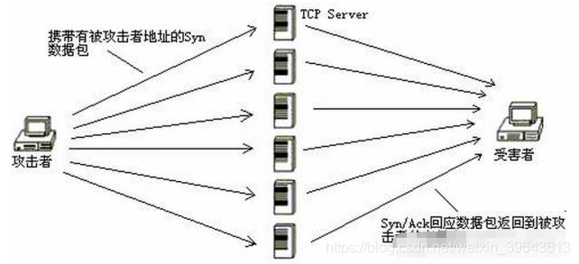
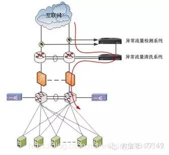
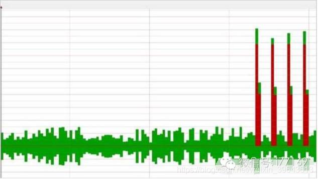
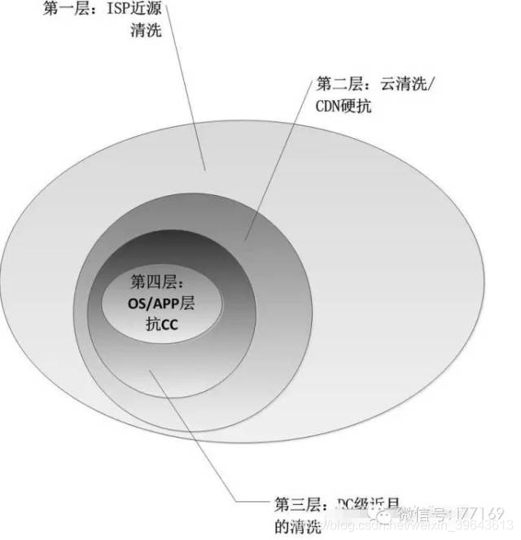
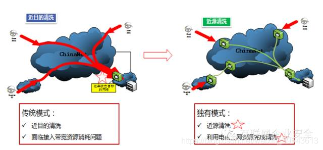

# 被骗几十万总结出来的Ddos攻击防护经验
src:http://www.77169.com/netadmin/HTML/20150918101159.shtm

# 前言
本人从事网络安全行业20年。有15年防ddos攻击防护经验。被骗了很多回(都说能防300G，500G，买完就防不住了)，本文当然重点给大家说明，ddos攻击是什么，中小企业如何防护，用到成本等。

2004年记得是，晚上我带着螺丝刀，晚上2点去机房维护，有ddos攻击，被警察当贼了，汗，那时华夏黑客同盟天天有攻击，远程连接不上得去机房，机房也不知道ddos是什么只知道流量大，一句话，你中病毒了。电信通机房惠普大厦机房。

# 关于DDoS及其发起方式

言归正传，首先我们说说ddos攻击方式，记住一句话，这是一个世界级的难题并没有解决办法只能缓解。

DDoS(Distributed Denial of Service，分布式拒绝服务)攻击的主要目的是让指定目标无法提供正常服务，甚至从互联网上消失，是目前最强大、最难防御的攻击之一。这是一个世界级的难题并没有解决办法只能缓解。

按照发起的方式，DDoS可以简单分为三类。

第一类以力取胜，海量数据包从互联网的各个角落蜂拥而来，堵塞IDC入口，让各种强大的硬件防御系统、快速高效的应急流程无用武之地。这种类型的攻击典型代表是ICMP Flood和UDP Flood，现在已不常见。

第二类以巧取胜，灵动而难以察觉，每隔几分钟发一个包甚至只需要一个包，就可以让豪华配置的服务器不再响应。这类攻击主要是利用协议或者软件的漏洞发起，例如Slowloris攻击、Hash冲突攻击等，需要特定环境机缘巧合下才能出现。

第三类是上述两种的混合，轻灵浑厚兼而有之，既利用了协议、系统的缺陷，又具备了海量的流量，例如SYN Flood攻击、DNS Query Flood攻击，是当前的主流攻击方式。

本文将一一描述这些最常见、最具代表性攻击方式，并介绍它们的防御方案。

# SYN Flood
SYN Flood是互联网上最经典的DDoS攻击方式之一，最早出现于1999年左右，雅虎是当时最著名的受害者。SYN Flood攻击利用了TCP三次握手的缺陷，能够以较小代价使目标服务器无法响应，且难以追查。

标准的TCP三次握手过程如下：

* 客户端发送一个包含SYN标志的TCP报文，SYN即同步(Synchronize)，同步报文会指明客户端使用的端口以及TCP连接的初始序号;

* 服务器在收到客户端的SYN报文后，将返回一个SYN+ACK(即确认Acknowledgement)的报文，表示客户端的请求被接受，同时TCP初始序号自动加1;

* 客户端也返回一个确认报文ACK给服务器端，同样TCP序列号被加1。

经过这三步，TCP连接就建立完成。TCP协议为了实现可靠传输，在三次握手的过程中设置了一些异常处理机制。第三步中如果服务器没有收到客户端的最终ACK确认报文，会一直处于SYN_RECV状态，将客户端IP加入等待列表，并重发第二步的SYN+ACK报文。重发一般进行3-5次，大约间隔30秒左右轮询一次等待列表重试所有客户端。另一方面，服务器在自己发出了SYN+ACK报文后，会预分配资源为即将建立的TCP连接储存信息做准备，这个资源在等待重试期间一直保留。更为重要的是，服务器资源有限，可以维护的SYN_RECV状态超过极限后就不再接受新的SYN报文，也就是拒绝新的TCP连接建立。

SYN Flood正是利用了上文中TCP协议的设定，达到攻击的目的。攻击者伪装大量的IP地址给服务器发送SYN报文，由于伪造的IP地址几乎不可能存在，也就几乎没有设备会给服务器返回任何应答了。因此，服务器将会维持一个庞大的等待列表，不停地重试发送SYN+ACK报文，同时占用着大量的资源无法释放。更为关键的是，被攻击服务器的SYN_RECV队列被恶意的数据包占满，不再接受新的SYN请求，合法用户无法完成三次握手建立起TCP连接。也就是说，这个服务器被SYN Flood拒绝服务了。

对SYN Flood ddos攻击软件,有兴趣的可以看看

`DarkShell软件使用编程教程+源码+测试手册` 我写的。

# DNS Query Flood
作为互联网最基础、最核心的服务，DNS自然也是DDoS攻击的重要目标之一。打垮DNS服务能够间接打垮一家公司的全部业务，或者打垮一个地区的网络服务。前些时候风头正盛的黑客组织anonymous也曾经宣布要攻击全球互联网的13台根DNS服务器，不过最终没有得手。

UDP攻击是最容易发起海量流量的攻击手段，而且源IP随机伪造难以追查。但过滤比较容易，因为大多数IP并不提供UDP服务，直接丢弃UDP流量即可。所以现在纯粹的UDP流量攻击比较少见了，取而代之的是UDP协议承载的DNS Query Flood攻击。简单地说，越上层协议上发动的DDoS攻击越难以防御，因为协议越上层，与业务关联越大，防御系统面临的情况越复杂。

DNS Query Flood就是攻击者操纵大量傀儡机器，对目标发起海量的域名查询请求。为了防止基于ACL的过滤，必须提高数据包的随机性。常用的做法是UDP层随机伪造源IP地址、随机伪造源端口等参数。在DNS协议层，随机伪造查询ID以及待解析域名。随机伪造待解析域名除了防止过滤外，还可以降低命中DNS缓存的可能性，尽可能多地消耗DNS服务器的CPU资源。

关于DNS Query Flood的代码，我在2011年7月为了测试服务器性能曾经写过一份代码，链接是DNS Query Flood攻击。同样的，这份代码人为降低了攻击性，只做测试用途。

# HTTP Flood
上文描述的SYN Flood、DNS Query Flood在现阶段已经能做到有效防御了，真正令各大厂商以及互联网企业头疼的是HTTP Flood攻击。HTTP Flood是针对Web服务在第七层协议发起的攻击。它的巨大危害性主要表现在三个方面：发起方便、过滤困难、影响深远。

SYN Flood和DNS Query Flood都需要攻击者以root权限控制大批量的傀儡机。收集大量root权限的傀儡机很花费时间和精力，而且在攻击过程中傀儡机会由于流量异常被管理员发现，攻击者的资源快速损耗而补充缓慢，导致攻击强度明显降低而且不可长期持续。HTTP Flood攻击则不同，攻击者并不需要控制大批的傀儡机，取而代之的是通过端口扫描程序在互联网上寻找匿名的HTTP代理或者SOCKS代理，攻击者通过匿名代理对攻击目标发起HTTP请求。匿名代理是一种比较丰富的资源，花几天时间获取代理并不是难事，因此攻击容易发起而且可以长期高强度的持续。

另一方面，HTTP Flood攻击在HTTP层发起，极力模仿正常用户的网页请求行为，与网站业务紧密相关，安全厂商很难提供一套通用的且不影响用户体验的方案。在一个地方工作得很好的规则，换一个场景可能带来大量的误杀。

最后，HTTP Flood攻击会引起严重的连锁反应，不仅仅是直接导致被攻击的Web前端响应缓慢，还间接攻击到后端的Java等业务层逻辑以及更后端的数据库服务，增大它们的压力，甚至对日志存储服务器都带来影响。

有意思的是，HTTP Flood还有个颇有历史渊源的昵称叫做CC攻击。CC是Challenge Collapsar的缩写，而Collapsar是国内一家著名安全公司的DDoS防御设备。从目前的情况来看，不仅仅是Collapsar，所有的硬件防御设备都还在被挑战着，风险并未解除。

# 慢速连接攻击

提起攻击，第一反应就是海量的流量、海量的报文。但有一种攻击却反其道而行之，以慢著称，以至于有些攻击目标被打死了都不知道是怎么死的，这就是慢速连接攻击，最具代表性的是rsnake发明的Slowloris。

TTP协议规定，HTTP Request以\r\n\r\n结尾表示客户端发送结束，服务端开始处理。那么，如果永远不发送\r\n\r\n会如何?Slowloris就是利用这一点来做DDoS攻击的。攻击者在HTTP请求头中将Connection设置为Keep-Alive，要求Web Server保持TCP连接不要断开，随后缓慢地每隔几分钟发送一个key-value格式的数据到服务端，如a:b\r\n，导致服务端认为HTTP头部没有接收完成而一直等待。如果攻击者使用多线程或者傀儡机来做同样的操作，服务器的Web容器很快就被攻击者占满了TCP连接而不再接受新的请求。

很快的，Slowloris开始出现各种变种。比如POST方法向Web Server提交数据、填充一大大Content-Length但缓慢的一个字节一个字节的POST真正数据内容等等。

# DDoS攻击进阶
## 混合攻击
以上介绍了几种基础的攻击手段，其中任意一种都可以用来攻击网络，甚至击垮阿里、百度、腾讯这种巨型网站。但这些并不是全部，不同层次的攻击者能够发起完全不同的DDoS攻击，运用之妙，存乎一心。

高级攻击者从来不会使用单一的手段进行攻击，而是根据目标环境灵活组合。普通的SYN Flood容易被流量清洗设备通过反向探测、SYN Cookie等技术手段过滤掉，但如果在SYN Flood中混入SYN+ACK数据包，使每一个伪造的SYN数据包都有一个与之对应的伪造的客户端确认报文，这里的对应是指源IP地址、源端口、目的IP、目的端口、TCP窗口大小、TTL等都符合同一个主机同一个TCP Flow的特征，流量清洗设备的反向探测和SYN Cookie性能压力将会显著增大。其实SYN数据报文配合其他各种标志位，都有特殊的攻击效果，这里不一一介绍。对DNS Query Flood而言，也有独特的技巧。

首先，DNS可以分为普通DNS和授权域DNS，攻击普通DNS，IP地址需要随机伪造，并且指明服务器要求做递归解析;但攻击授权域DNS，伪造的源IP地址则不应该是纯随机的，而应该是事先收集的全球各地ISP的DNS地址，这样才能达到最大攻击效果，使流量清洗设备处于添加IP黑名单还是不添加IP黑名单的尴尬处境。添加会导致大量误杀，不添加黑名单则每个报文都需要反向探测从而加大性能压力。

另一方面，前面提到，为了加大清洗设备的压力不命中缓存而需要随机化请求的域名，但需要注意的是，待解析域名必须在伪造中带有一定的规律性，比如说只伪造域名的某一部分而固化一部分，用来突破清洗设备设置的白名单。道理很简单，腾讯的服务器可以只解析腾讯的域名，完全随机的域名可能会直接被丢弃，需要固化。但如果完全固定，也很容易直接被丢弃，因此又需要伪造一部分。

其次，对DNS的攻击不应该只着重于UDP端口，根据DNS协议，TCP端口也是标准服务。在攻击时，可以UDP和TCP攻击同时进行。

HTTP Flood的着重点，在于突破前端的cache，通过HTTP头中的字段设置直接到达Web Server本身。另外，HTTP Flood对目标的选取也非常关键，一般的攻击者会选择搜索之类需要做大量数据查询的页面作为攻击目标，这是非常正确的，可以消耗服务器尽可能多的资源。但这种攻击容易被清洗设备通过人机识别的方式识别出来，那么如何解决这个问题?很简单，尽量选择正常用户也通过APP访问的页面，一般来说就是各种Web API。正常用户和恶意流量都是来源于APP，人机差别很小，基本融为一体难以区分。

慢速攻击，是通过巧妙的手段占住连接不释放达到攻击的目的，但这也是双刃剑，每一个TCP连接既存在于服务端也存在于自身，自身也需要消耗资源维持TCP状态，因此连接不能保持太多。如果可以解决这一点，攻击性会得到极大增强，也就是说Slowloris可以通过stateless的方式发动攻击，在客户端通过嗅探捕获TCP的序列号和确认维护TCP连接，系统内核无需关注TCP的各种状态变迁，一台笔记本即可产生多达65535个TCP连接。

前面描述的，都是技术层面的攻击增强。在人的方面，还可以有一些别的手段。如果SYN Flood发出大量数据包正面强攻，再辅之以Slowloris慢速连接，多少人能够发现其中的秘密?即使服务器宕机了也许还只发现了SYN攻击想去加强TCP层清洗而忽视了应用层的行为。种种攻击都可以互相配合，达到最大的效果。攻击时间的选择，也是一大关键，比如说选择维护人员吃午饭时、维护人员下班堵在路上或者在地铁里无线上网卡都没有信号时、目标企业在举行大规模活动流量飙升时等。

这里描述的只是纯粹的攻击行为，因此不提供代码，也不做深入介绍。

## 来自P2P网络的攻击
前面的攻击方式，多多少少都需要一些傀儡机，即使是HTTP Flood也需要搜索大量的匿名代理。如果有一种攻击，只需要发出一些指令，就有机器自动上来执行，才是完美的方案。这种攻击已经出现了，那就是来自P2P网络的攻击。

大家都知道，互联网上的P2P用户和流量都是一个极为庞大的数字。如果他们都去一个指定的地方下载数据，使成千上万的真实IP地址连接过来，没有哪个设备能够支撑住。拿BT下载来说，伪造一些热门视频的种子，发布到搜索引擎，就足以骗到许多用户和流量了，但这只是基础攻击。

高级P2P攻击，是直接欺骗资源管理服务器。如迅雷客户端会把自己发现的资源上传到资源管理服务器，然后推送给其他需要下载相同资源的用户，这样，一个链接就发布出去。通过协议逆向，攻击者伪造出大批量的热门资源信息通过资源管理中心分发出去，瞬间就可以传遍整个P2P网络。更为恐怖的是，这种攻击是无法停止的，即使是攻击者自身也无法停止，攻击一直持续到P2P官方发现问题更新服务器且下载用户重启下载软件时为止。

## CC
ChallengeCollapsar的名字源于挑战国内知名安全厂商绿盟的抗DDOS设备-“黑洞”，通过botnet的傀儡主机或寻找匿名代理服务器，向目标发起大量真实的http请求，最终消耗掉大量的并发资源，拖慢整个网站甚至彻底拒绝服务。

互联网的架构追求扩展性本质上是为了提高并发能力，各种SQL性能优化措施：消除慢查询、分表分库、索引、优化数据结构、限制搜索频率等本质都是为了解决资源消耗，而CC大有反其道而行之的意味，占满服务器并发连接数，尽可能使请求避开缓存而直接读数据库，读数据库要找最消耗资源的查询，最好无法利用索引，每个查询都全表扫描，这样就能用最小的攻击资源起到最大的拒绝服务效果。

互联网产品和服务依靠数据分析来驱动改进和持续运营，所以除了前端的APP、中间件和数据库这类OLTP系统，后面还有OLAP，从日志收集，存储到数据处理和分析的大数据平台，当CC攻击发生时，不仅OLTP的部分受到了影响，实际上CC会产生大量日志，直接会对后面的OLAP产生影响，影响包括两个层面，一个当日的数据统计完全是错误的。第二个层面因CC期间访问日志剧增也会加大后端数据处理的负担。

CC是目前应用层攻击的主要手段之一，在防御上有一些方法，但不能完美解决这个问题。

## 反射型

2004年时DRDOS第一次披露，通过将SYN包的源地址设置为目标地址，然后向大量的真实TCP服务器发送TCP的SYN包，而这些收到SYN包的TCP server为了完成3次握手把SYN|ACK包“应答”给目标地址，完成了一次“反射”攻击，攻击者隐藏了自身，但有个问题是攻击者制造的流量和目标收到的攻击流量是1:1，且SYN|ACK包到达目标后马上被回以RST包，整个攻击的投资回报率不高。

反射型攻击的本质是利用“质询-应答”式协议，将质询包的源地址通过原始套接字伪造设置为目标地址，则应答的“回包”都被发送至目标，如果回包体积比较大或协议支持递归效果，攻击流量会被放大，成为一种高性价比的流量型攻击。

反射型攻击利用的协议目前包括NTP、Chargen、SSDP、DNS、RPC portmap等等。

## 流量放大型
以上面提到的DRDOS中常见的SSDP协议为例，攻击者将Searchtype设置为ALL，搜索所有可用的设备和服务，这种递归效果产生的放大倍数是非常大的，攻击者只需要以较小的伪造源地址的查询流量就可以制造出几十甚至上百倍的应答流量发送至目标。

# 防御基础

攻击流量到底多大，这是一个关键问题。攻击量的大小。用的防护方法不一样。下面给你讲一讲，1G之内的防护方式。费用在，<1万，每月。

谈到DDoS防御，首先就是要知道到底遭受了多大的攻击。这个问题看似简单，实际上却有很多不为人知的细节在里面。

以SYN Flood为例，为了提高发送效率在服务端产生更多的SYN等待队列，攻击程序在填充包头时，IP首部和TCP首部都不填充可选的字段，因此IP首部长度恰好是20字节，TCP首部也是20字节，共40字节。

对于以太网来说，最小的包长度数据段必须达到46字节，而攻击报文只有40字节，因此，网卡在发送时，会做一些处理，在TCP首部的末尾，填充6个0来满足最小包的长度要求。这个时候，整个数据包的长度为14字节的以太网头，20字节的IP头，20字节的TCP头，再加上因为最小包长度要求而填充的6个字节的0，一共是60字节。

但这还没有结束。以太网在传输数据时，还有CRC检验的要求。网卡会在发送数据之前对数据包进行CRC检验，将4字节的CRC值附加到包头的最后面。这个时候，数据包长度已不再是40字节，而是变成64字节了，这就是常说的SYN小包攻击，数据包结构如下：

`|14字节以太网头部|20字节IP头部|20字节TCP|6字节填充|4字节检验|`

`|目的MAC|源MAC|协议类型| IP头 |TCP头|以太网填充 | CRC检验 |`

到64字节时，SYN数据包已经填充完成，准备开始传输了。攻击数据包很小，远远不够最大传输单元(MTU)的1500字节，因此不会被分片。那么这些数据包就像生产流水线上的罐头一样，一个包连着一个包紧密地挤在一起传输吗?事实上不是这样的。

以太网在传输时，还有前导码(preamble)和帧间距(inter-frame gap)。其中前导码占8字节(byte)，即64比特位。前导码前面的7字节都是10101010，1和0间隔而成。但第八个字节就变成了10101011，当主机监测到连续的两个1时，就知道后面开始是数据了。在网络传输时，数据的结构如下：

`|8字节前导码|6字节目的MAC地址|6字节源MAC地址|2字节上层协议类型|20字节IP头|20字节TCP头|6字节以太网填充|4字节CRC检验|12字节帧间距|`

也就是说，一个本来只有40字节的SYN包，在网络上传输时占的带宽，其实是84字节。

有了上面的基础，现在可以开始计算攻击流量和网络设备的线速问题了。当只填充IP头和TCP头的最小SYN包跑在以太网络上时，100Mbit的网络，能支持的最大PPS(Packet Per Second)是100×106 / (8 * (64+8+12)) = 148809，1000Mbit的网络，能支持的最大PPS是1488090。

## SYN Flood防御
前文描述过，SYN Flood攻击大量消耗服务器的CPU、内存资源，并占满SYN等待队列。相应的，我们修改内核参数即可有效缓解。主要参数如下：

`net.ipv4.tcp_syncookies = 1`

`net.ipv4.tcp_max_syn_backlog = 8192`

`net.ipv4.tcp_synack_retries = 2`

分别为启用SYN Cookie、设置SYN最大队列长度以及设置SYN+ACK最大重试次数。

SYN Cookie的作用是缓解服务器资源压力。启用之前，服务器在接到SYN数据包后，立即分配存储空间，并随机化一个数字作为SYN号发送SYN+ACK数据包。然后保存连接的状态信息等待客户端确认。启用SYN Cookie之后，服务器不再分配存储空间，而且通过基于时间种子的随机数算法设置一个SYN号，替代完全随机的SYN号。发送完SYN+ACK确认报文之后，清空资源不保存任何状态信息。直到服务器接到客户端的最终ACK包，通过Cookie检验算法鉴定是否与发出去的SYN+ACK报文序列号匹配，匹配则通过完成握手，失败则丢弃。当然，前文的高级攻击中有SYN混合ACK的攻击方法，则是对此种防御方法的反击，其中优劣由双方的硬件配置决定。

tcp_max_syn_backlog则是使用服务器的内存资源，换取更大的等待队列长度，让攻击数据包不至于占满所有连接而导致正常用户无法完成握手。net.ipv4.tcp_synack_retries是降低服务器SYN+ACK报文重试次数，尽快释放等待资源。这三种措施与攻击的三种危害一一对应，完完全全地对症下药。但这些措施也是双刃剑，可能消耗服务器更多的内存资源，甚至影响正常用户建立TCP连接，需要评估服务器硬件资源和攻击大小谨慎设置。

除了定制TCP/IP协议栈之外，还有一种常见做法是TCP首包丢弃方案，利用TCP协议的重传机制识别正常用户和攻击报文。当防御设备接到一个IP地址的SYN报文后，简单比对该IP是否存在于白名单中，存在则转发到后端。如不存在于白名单中，检查是否是该IP在一定时间段内的首次SYN报文，不是则检查是否重传报文，是重传则转发并加入白名单，不是则丢弃并加入黑名单。是首次SYN报文则丢弃并等待一段时间以试图接受该IP的SYN重传报文，等待超时则判定为攻击报文加入黑名单。

首包丢弃方案对用户体验会略有影响，因为丢弃首包重传会增大业务的响应时间，有鉴于此发展出了一种更优的TCP Proxy方案。所有的SYN数据报文由清洗设备接受，按照SYN Cookie方案处理。和设备成功建立了TCP三次握手的IP地址被判定为合法用户加入白名单，由设备伪装真实客户端IP地址再与真实服务器完成三次握手，随后转发数据。而指定时间内没有和设备完成三次握手的IP地址，被判定为恶意IP地址屏蔽一定时间。除了SYN Cookie结合TCP Proxy外，清洗设备还具备多种畸形TCP标志位数据包探测的能力，通过对SYN报文返回非预期应答测试客户端反应的方式来鉴别正常访问和恶意行为。

清洗设备的硬件具有特殊的网络处理器芯片和特别优化的操作系统、TCP/IP协议栈，可以处理非常巨大的流量和SYN队列。

## HTTP Flood防御
HTTP Flood攻击防御主要通过缓存的方式进行，尽量由设备的缓存直接返回结果来保护后端业务。大型的互联网企业，会有庞大的CDN节点缓存内容。

当高级攻击者穿透缓存时，清洗设备会截获HTTP请求做特殊处理。最简单的方法就是对源IP的HTTP请求频率做统计，高于一定频率的IP地址加入黑名单。这种方法过于简单，容易带来误杀，并且无法屏蔽来自代理服务器的攻击，因此逐渐废止，取而代之的是JavaScript跳转人机识别方案。

HTTP Flood是由程序模拟HTTP请求，一般来说不会解析服务端返回数据，更不会解析JS之类代码。因此当清洗设备截获到HTTP请求时，返回一段特殊JavaScript代码，正常用户的浏览器会处理并正常跳转不影响使用，而攻击程序会攻击到空处。

## DNS Flood防御

DNS攻击防御也有类似HTTP的防御手段，第一方案是缓存。其次是重发，可以是直接丢弃DNS报文导致UDP层面的请求重发，可以是返回特殊响应强制要求客户端使用TCP协议重发DNS查询请求。

特殊的，对于授权域DNS的保护，设备会在业务正常时期提取收到的DNS域名列表和ISP DNS IP列表备用，在攻击时，非此列表的请求一律丢弃，大幅降低性能压力。对于域名，实行同样的域名白名单机制，非白名单中的域名解析请求，做丢弃处理。

## 慢速连接攻击防御

Slowloris攻击防御比较简单，主要方案有两个。

第一个是统计每个TCP连接的时长并计算单位时间内通过的报文数量即可做精确识别。一个TCP连接中，HTTP报文太少和报文太多都是不正常的，过少可能是慢速连接攻击，过多可能是使用HTTP 1.1协议进行的HTTP Flood攻击，在一个TCP连接中发送多个HTTP请求。

第二个是限制HTTP头部传输的最大许可时间。超过指定时间HTTP Header还没有传输完成，直接判定源IP地址为慢速连接攻击，中断连接并加入黑名单。

# 不同攻击量对应方式
## 10G

如果超过，>10G 攻击，如果大于10G攻击软件防护就扯蛋，下面记住一句话，防ddos攻击大小于取决于你带宽的大小，与软件没关系。

国内现在100M带宽一个月就，便宜的8000，贵的2万多，1G带宽，8万，10G带宽，80万，你确定要自己防护?

业务逻辑很很多种，每家都不太一样，WEB类型，这个是攻击最多，防护方案更广，可以选择国内，国外，cdn加速等。游戏类型，这个必须得放在国内，放国外太卡，掉线，没人玩了。

解决办法就是找第三方防ddos解决商，0~50G防护，国内很多机房都可以防护，问题你给的钱够不够idc。

机房有一个总带宽，如果你攻击带宽太大就影响他正常客户，他就会找各种借口给你ip屏蔽。

很多攻击持续的时间非常短，通常5分钟以内，流量图上表现为突刺状的脉冲。

实际对机房没有什么影响，但是机房就给你ip屏蔽了，这个用于攻击游戏类网站，搞一会一掉线，用户全掉光了，50G之间，单机防护，浙江，江苏，广东，都可以防都可以防护，月成本，2万左右，(价格说小于1万那就是骗子，已经测试过)

网上很多说无视，320G防护，全是吹牛的，他说的320G，应当就是udp攻击，因为电信上层给屏蔽了udp带宽，广东有双线，合适放游戏类网站，速度快，防护还可以，广东有些ip是屏蔽国外的流量，还有屏蔽联通的流量，意思就是除了电信的别的地方的流量都过不来，就像这个ISP近源清洗。

## 100~200G

100～200G之个，这个现在是关键了，现在攻击这个是最多的，游戏类网站如果有怎么大攻击放国内，现在能有怎么大防护的，电信，广东，福州，广西，联通，有大连。

福州买过，2万多一个月，说防300G，130G就给封了，骗子，dns防护也不行，10G左右的dns攻击直接搞死了。

广东机房买过，3万一个月，100g 就给封了，不过广东可以秒解，买200个ip，还是能防一会，广东的直接访问不了dns,机房做策略了。

广西，这个正测试，前几天放了dns在广西机房，打死了。

DNS攻击防护也是重点，买了dnspod的最贵那个版本3万多/年，封了，dnspod也，老吴不在那了吗?搞别的去了，现在真是垃圾，指着dnspod防护差远了，我给大家介绍一下，google有dns防护，好用，比dnspod便宜很多，还有CF，也非常好，200刀，没打死过。

上面就浪费十来万，测试dns测试100G防护，总结的经验。

游戏的只能放国内，还得看是udp,还是tcp，所以防护范围小。WEB的防护比较多，可以考虑放国外。

现在国外比较能吹的，美国SK机房，防100G，买了，安排机器花了2天，这个攻击完了ip,封1小时，真心不行。机房还老掉线，花了1万左右可能一个月。美国hs机房，防80G，一个月8万，买了，打死了，他防到40G左右就给你封了，也跟骗子差不多，说是要加到200G防护，没看到。美国CD机房，最后花了>10万每月，找的他们老板防住了，但是dns防护不行。还有一家机房可以推荐，加拿大机房，单机防160G，集群480G，不封ip，防护还可以，缺点，卡，国内ping掉包，8000左右一个月，20元一个ip,

上面速度最快的是hs机房国内，150ms左右，没攻击的时候用用还行，有攻击防护差点意思。

我不是给机房做广告，我只是总结我最近防护的经验，国内可以放免备案的机房也有，资源联系方式，dns防攻击500G，都可以，你联系我。我可以免费告诉你这些资源的联系方式。

# 云加速

国内的云盾，收费死贵，防护不行，别看他家的了。

阿里云防护，单机防4个G，不贵，小企业可以用，缺点得备案，还有如果你有非法信息，他们可以直接给报官了(最垃圾的是这点)。

百度云加速，说是防1T攻击，我认真研究了一下，他是联合，国外的CF云加速，电信的云堤(近源清洗)说能防1T，攻击400G他转到CF国外，国内600G攻击，全是云堤防护的。

什么是近源清洗，就是江苏有攻击，到电信江苏的出口的时候，isp，中国电信直接不让他出口。

目前如中国电信的专门做抗DDOS的云堤提供了[近源清洗]和[流量压制]的服务，对于购买其服务的厂商来说可以自定义需要黑洞路由的IP与电信的设备联动，黑洞路由是一种简单粗暴的方法，除了攻击流量，部分真实用户的访问也会被一起黑洞掉，对用户体验是一种打折扣的行为，本质上属于为了保障留给其余用户的链路带宽的弃卒保帅的做法，之所以还会有这种收费服务是因为假如不这么做，全站服务会对所有用户彻底无法访问。对于云清洗厂商而言，实际上也需要借助黑洞路由与电信联动。

百度云加速，还没测试过，不评价，总结国内的厂商全是吹牛B的比较多，行业就这样。

国外的比较可靠，但是收费的确不便宜，三家，可以推荐。

* 亚马逊，30G攻击无视，攻击大了，也给你封了，推荐他最大优点，按流量收费，可以按小时收费，不要备案，国内还得先备案，这我买6个节点，用三天死了。

* CF加速，这个dns防护无敌，百度云加速就是联合的他家。

* akamai，这家是给苹果做防护的，说只有苹果发布会的打死过一次，我没试太贵了，1G，3.5元，一天估计就得5000左右一天，

cdn加速，是防CC的一个主要手段。

CDN/Internet层CDN并不是一种抗DDOS的产品，但对于web类服务而言，他却正好有一定的抗DDOS能力，以大型电商的抢购为例，这个访问量非常大，从很多指标上看不亚于DDOS的CC，而在平台侧实际上在CDN层面用验证码过滤了绝大多数请求，最后到达数据库的请求只占整体请求量的很小一部分。

对http CC类型的DDOS，不会直接到源站，CDN会先通过自身的带宽硬抗，抗不了的或者穿透CDN的动态请求会到源站，如果源站前端的抗DDOS能力或者源站前的带宽比较有限，就会被彻底DDOS。

# 结语
如果你是正规网站，你别怕有攻击，不会有怎么大攻击的，现在黑客主要攻击那些非正规的网站,H 站，棋牌，菠菜，都是攻击要钱的，

正规网站他不会天天来打死你，攻击你的都是竞争对手。

如果有一天，有人攻击你要钱，下面就是要做的事。

**立案和追踪**

目前对于流量在100G以上的攻击是可以立案的，这比过去幸福了很多。过去没有本土特色的资源甚至都没法立案，但是立案只是万里长征的第一步，如果你想找到人，必须成功完成以下步骤：

　　• 在海量的攻击中，寻找倒推的线索，找出可能是C&C服务器的IP或相关域名等

　　• “黑”吃“黑”，端掉C&C服务器

　　• 通过登录IP或借助第三方APT的大数据资源(如果你能得到的话)物理定位攻击者

　　• 陪叔叔们上门抓捕

　　• 上法庭诉讼

　　如果这个人没有特殊身份，也许你就能如愿，但假如遇到一些特殊人物，你几个月都白忙乎。而黑吃黑的能力则依赖于安全团队本身的渗透能力比较强，且有闲情逸致做这事。这个过程对很多企业来说成本还是有点高，光有实力的安全团队这条门槛就足以砍掉绝大多数公司。笔者过去也只是恰好有缘遇到了这么一个团队。

　　是有成功案例，燕郊，黄总，有人攻击他要钱，完了他打了几千，报警抓住了。但不是你报警就有人管你的，还得有关系(国情你懂的)不过，你可以找我呀，我可以告诉你怎么办呀。哈哈。

总结一下，WEB网站攻击，一般流量，直接syn,udp，打不死，就攻击你的dns,不行还能举报你。游戏网站，他不直接打死你，让你老掉线，玩不了，目的达到了。所以这类网站需要提前布置防护。还有支付类网站，中小企业，主要看攻击量的大小选择方案，如果你们公司不差钱，那就别向下看了，下面我可是报行业内幕，

*  <30G攻击， 3000左右一个月，非连续攻击，可用，单机防，

* <50G攻击，1万左右一个月，非连续攻击，可用，双机防，

* <100G攻击，2～3万，连续攻击/日，需要用集群防，

* <300G攻击，5～8万，连续攻击/日，需要集群，加CDN，学习百度云加速，国外的防护让CF帮着防，国内的找云堤防，

所以，总结一下那些公司是骗人的，你们不白花钱去再测试了。我已经测试过了。

时间紧很多点没有写全，写透，今后找个时间再总结分类。