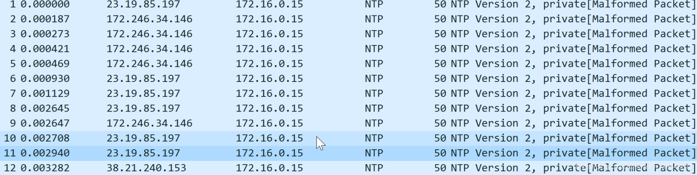
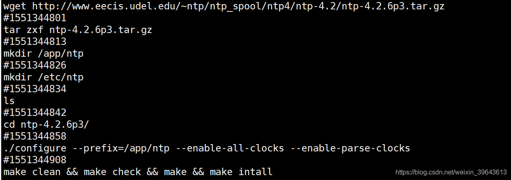

# 记一次被当成ddos发包机
src:https://cloud.tencent.com/developer/article/1401629

# 1. 变成肉鸡

吃个饭回来，xshell连着的服务器突然卡住了，动也动不了。重启，重开xshell，排除是xshell的问题，切换网络，排除是网络的问题。

重连发现显示已经连上了，但是#都返回不回来。用的是腾讯云，立马上控制台上查看。

出口带宽1m小水管一直是满的，也没开什么服务，如果是被D的话，腾讯云应该告警啊。

这网络堵得人ssh都连不上，简直生活不能自理。

关vps重启，发现还是这样。

关个几个小时再说，现在也没空搞。

# 2. 实战的机会来了
晚上11点开机，发现带宽又满了。我佛了。

* 腾讯云控制台开安全组策略，只允许22端口访问，先让我连上ssH再说。

这里腾讯云有个大锅，按理来说我开了安全组策略之后，应该没事了，可是还是，说明他的安全组策略并没有什么用。

拼死拼活ssh突然连上了，赶忙一个 `tcpdump -i eth0 -w temp.pcap`

然后又卡住了......

你连ssh都上不了，更别说朔源了。

正确操作时更换ip

* 上腾讯云控制台，将现有ip转换成弹性ip
* 再申请一个弹性ip，绑定新的弹性ip。
* 用新的ip ssh上去

换ip后已经不卡了，立马找到刚才那个tcpdump的pcap。

一看就明白了，全是ntp。我成肉鸡了。

果然，我ntp服务的123端口开着，可我啥时候装的这服务。

查看.bash_history明白了。

# 3. 正确操作

碰到这种被搞得ssh都上不了的情况，正确操作应该是。

* 到云控制台，切换安全组策略，只允许ssh端口被访问。（虽然我这碰到的安全组策略没啥用）
* 切换ip。 先将绑定的ip换成弹性ip，再申请一个新的弹性ip，绑定新的弹性ip，然后再ssh上去。（小心别把自己公网ip给释放掉找不回来了）