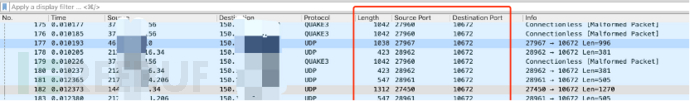
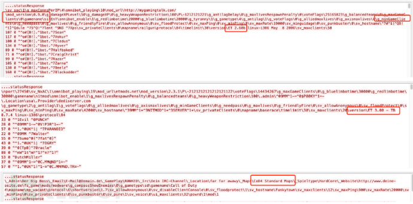
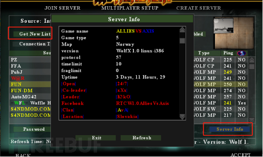
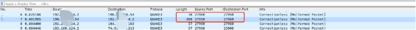
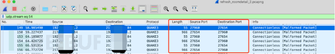
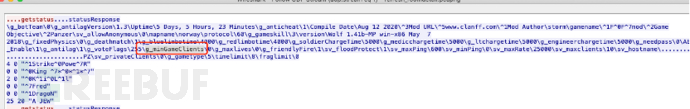
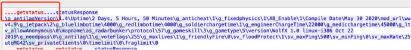
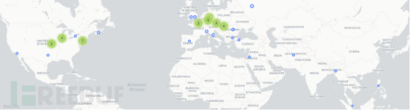
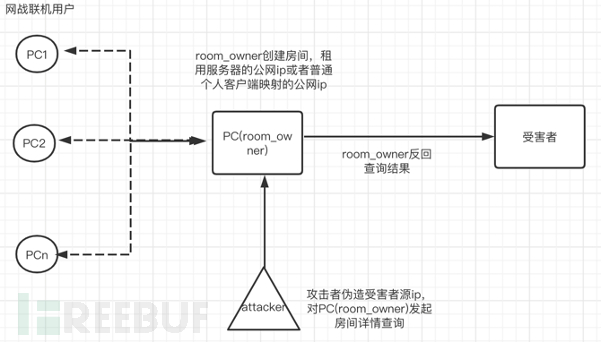

# 隐秘的角落：基于某款游戏利用的反射攻击分析

src:https://www.freebuf.com/news/254216.html

## 背景

从十月份开始，宙斯盾团队防护下的某款游戏业务持续遭受攻击，在对抗过程中，坏人不断变换攻击手法，包括且不限于四层连接攻击、七层CC攻击、TCP反射攻击、常规UDP反射和漏洞利用型DoS攻击。如此持以之恒的尝试背后，是巨大获利的驱动力存在。为了更加主动的感知到外部攻击手法的持续变化，团队针对此业务的网络流量进行了进一步的安全分析。

在近日，通过此流量安全分析机制，我们及时感知到了一个新手法的出现：基于某游戏的反射攻击。其主要利用早期游戏(Wolfenstein Enemy Territory、Cod4、Quake 3等）的联机网络对战功能发起，攻击流量规模并不大，较为隐秘。于此，我们将相关情况整理同步、分享与业界同行。

## 0x01 异常流量分析

### 1. 样本分析：

通过流量抓取分析，本次反射攻击源端口不固定，部分报文命中wireshark的端口规则被标记为quake3协议，包长范围423-1312，如下图所示：

与正常业务流量的私有二进制协议数据相比，攻击数据包的内容字符肉眼可读，其中几个字段能明显看出是游戏服务,如”version ET 2.60b / ET 3.00”，”mod version 0.9.0”,”ganmename”，” g_minGameClients”。

进一步搜索，查到某款经典游戏《Wolfenstein Enemy Territory》，缩写为ET，和抓包里的关键词匹配。根据协议类型quake3，查到游戏《雷神之锤3》。两个游戏同属同一家母公司，猜测这两个游戏使用了相同的底层引擎和协议规范。

同时分析捕获到的攻击源端口情况，发现大部分源ip端口存活开启，小部分源ip端口关闭。查找资料发现这里存在两种对战服被用作攻击源：1）长期租用公网服务器搭建的类似私服的对战局；2）个人临时开启的对战局。

### 2. 攻击复现：

《Wolfenstein Enemy Territory》（本次分析以此游戏为例，其他几个游戏原理类似）为《Return to Castal Wolfenstein》网络对战内容免费资料片，发行于2003年（和cs1.6同年代），支持linux/win/mac三种操作系统。

为了进一步复现分析，我们下载了ET游戏，进入网战平台，并对游戏交互进行了流量分析。

1）查询get new list ，会触发一个UDP请求操作（请求游戏自身服务器返回room列表），如下：

2）查询server info，数据交互过程如下：

Payload详情如图6，通过对比图2，发现报文结构和特征一致（根据不同版本和是否打mod，返回的信息略有不同），所以可以判断本次攻击是利用了《Wolfenstein Enemy Territory》客户端创建的对战房间作为反射源，进行的DDoS反射放大攻击。

交互报文内容细节如下图：

在查询server详情操作过程中，客户端只向对战房主的公网ip发送固定字段”getstatus”，而作为对战房主机器并不做任何校验，直接返回对战房间信息。请求和返回数据大小成倍数关系，此手法正是利用了协议交互的这一特点实现了流量的反射放大。

### 3. 反射放大倍数分析：

攻击主要利用查询server info操作发起的DDoS反射放大，直接用完整的UDP请求包和响应包相比，放大倍数1312/57≈23倍。

### 4. 溯源分布情况：

大部分来自欧美（以现网捕获为统计）

## 0x02 游戏对局类反射趋势

由于近年来公共网络服务建设在安全方面越来越规范，利用公共基础设施发起反射的门槛变高，同时此类公共基础服务发起的反射，网络层特征明显，很容易被过滤。如18年很火的memcached反射近一年内的频率降低了许多。因此黑客也在不断寻找别的替代攻击方式企图绕过现有防御系统，本次利用W.ET游戏的反射攻击就是其中一种探索。

对比业界分析其他几种对局类反射，总结他它们的共同点如下图所示：

**防御游戏对局反射放大的难点：**

1. 报文特征：源ip不固定，源端口在一定范围内随机，基于网络设备的acl特征拉黑容易误伤；

2. 游戏众多，隐蔽性高：比如业界之前发现的使用A2S_INFO协议（Dota2、反恐精英、求生之路、Aram）以及call of duty2/4版本端游，都可能存在此问题；

3. 混合攻击：单独一个游戏可利用的反射源有限（笔者在凌晨0点搜索发现房间数为40-50个），但是现网已经检测到混合多个游戏发起攻击的情况；

4. 漏洞修复困难：该类型游戏已经发行多年，在当时反射放大攻击并未进入公众视线，所以开发者未考虑被利用发起DDoS的安全问题。且游戏早已过了生命旺盛周期，无人针对漏洞进行修复；

## 0x03 攻击防护建议

综上，此次的攻击手法仍然是利用UDP无状态协议、服务端返回包远大于请求包的特点。在防范上，我们建议参考下面方式进行安全加固以及防护能力提升，以减少业务侧被攻击风险。

> 禁用不必要UDP服务和端口，减少威胁暴露面；
>
> 利用上游路由器或防火墙四层ACL过滤功能，拦截对应端口的UDP报文；
>
> 利用安全设备七层过滤功能，拦截对应攻击特征的UDP报文；
>
> 对战反射源基本位于国外，若无海外业务，可选择基于Geo-IP对海外源IP流量进行封禁；
>
> 选择接入专业的DDoS安全防护服务（如腾讯云T-Sec DDoS高防服务）

## 0x04 尾声 

兵无常势，水无常形，黑客攻击方式、手法也在随着业务的发展、技术的变革而不断改变，攻防对抗的难度也随之不断升级；唯有一直紧跟技术、业务发展趋势，持续不断进阶，才能在安全攻防对抗中取得先机。故而，安全无小事，一手建立起主动的流量安全分析和感知能力，一手建立起全面的安全防护体系，才有可能防微杜渐、防范于未然。