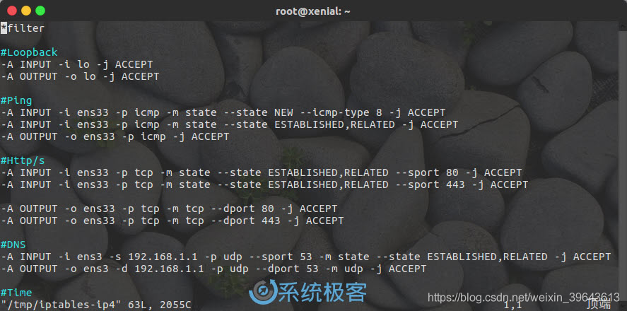
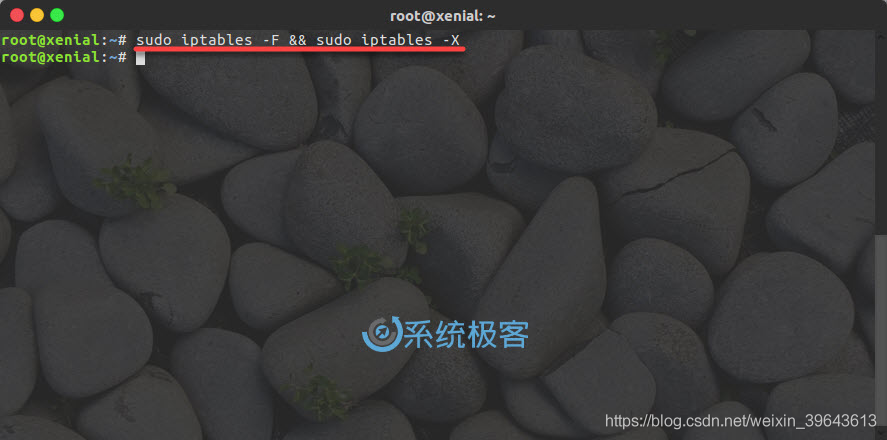
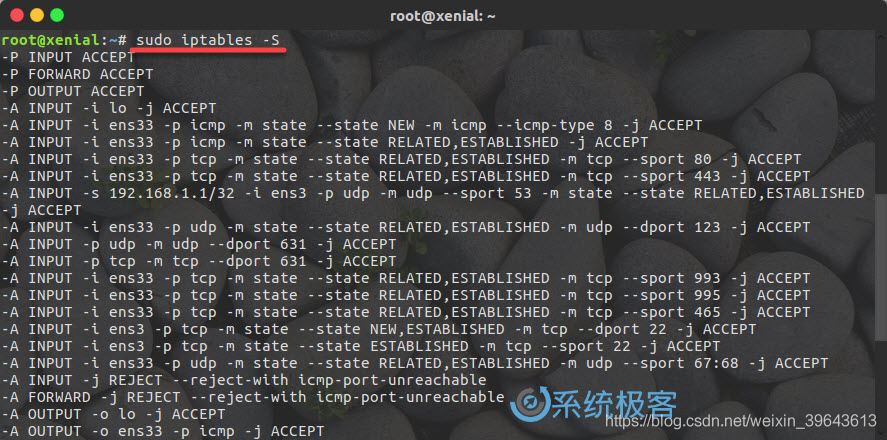
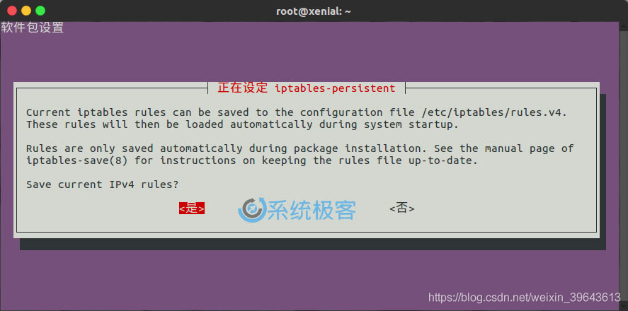

# Linux桌面系统iptables安全配置

src:https://www.sysgeek.cn/iptables-secure-linux-desktop/


Linux 的安全声誉一直比 Windows 系统要好，但它也并不完美。有许多 Linux 发行版都没有采用最佳的安全默认值，所以用户在安装好系统之后，大多需要自行实施安全配置。

例如：Linux 桌面安装完成后，默认的防火墙配置都不像 Windows 那样已经内置了很多常用的安全策略，而需要用户手动进行安全配置。

而不论是 Linux 桌面版还是服务器版本，都内置了 iptables 这一包过滤器（严格来说只是包过滤器的控制器），在本指南中，系统极客将向大家介绍如何使用 iptables 来保护您的 Linux 桌面系统安全。

# 什么是iptables
iptables 是内置于 Linux 内核中的包过滤器，几乎所有 Linux 发行版都自带了此功能。它是控制计算机进、出网络流量的最直接方式，在很多场景下都被当作防火墙来使用。

iptables 在开源领域、Linux 行业或普通用户中都有不小的名声，你不需要了解 iptables 的繁杂内容就可以在 Linux 桌面上有效地使用它，但还是需要掌握一些基本知识才能用好。

# iptables命令结构
所有 iptables 规则都遵循相同的基本结构。简单来说，每条规则其实都是可以单独执行的 iptables 命令，它会告诉 Linux 内核如何处理特定端口的流量。 示例如下：

```
-A INPUT -i eth0 -p tcp -m state --state ESTABLISHED,RELATED --sport 80 -j ACCEPT
```
上述命令看似复杂，但我们将其拆开来看的话，其实真的很简单。首先，这条规则的 -A 表示将此条规则附加到你的 iptables 规则上。

随后的 -i 标志指定了此规则所用的网络接口 eth0。（你在编写自己的规则时，请确保知道通过哪个网口连接到网络。）

-p 标志用于指定协议，以上这条规则适用于 tcp 协议。

-m 标志有点不同，它用于判断必须满足的条件才能使流量不被拒绝。 此规则的条件是状态。

–sport 代表「源端口」，它告诉 iptables 流量来自哪个端口。 还有一个 –dport 标志代表「目标端口」，它用于处理哪些端口流量可到达 OUTPUT。

最后还有 -j 标志，它用于对符合此条 iptables 规则的数据包执行 ACCEPT、DROP 或 REJECT 操作。

对于普通用户来说，最常见的 iptables 命令参数就是如此，普通桌面 Linux 用户应该够用了。但如果你想要详细并全面了解 iptables，还需要把表(tables)、链(chain)、规则(rules)以及 iptables 的数据包处理流程都研究清楚才行，在这里我们不做详细说明。

# 使用iptables规则文件
所有 Linux 用户在配置 iptables 策略时都可以逐条输入命令，但每次都单独配置的话会非常繁琐，而且不利于复用。所以，创建单独的 iptables 规则文件就要明智得多。

iptables 规则文件只要是文本文件类型即可，而且必需以如下格式开头和结尾。本文我们使用 /tmp/iptables-ip4 文件作为示例，在文件中添加以下两行，所有规则都被包在它们之间。

```
*filter
#规则
#规则
#规则
COMMIT
```

# 适用于Linux桌面安全的iptables规则

回到本文的主题，现在开始介绍用于保护 Linux 桌面安全的常见 iptables 规则。当然，如下规则只是对普通 Linux 桌面环境的安全建议，如果你还在运行其他服务或需要打开其他端口，也可以调整某些内容或添加自己的规则。

# Loopback
环回接口是 Linux 使用的内部接口：

```
-A INPUT -i lo -j ACCEPT
-A OUTPUT -o lo -j ACCEPT
```

# Ping
有许多用户都喜欢对自己的桌面计算机禁 Ping，但系统极客建议大家尽量不要对桌面系统禁 Ping，这对于日常的网络连接测试还是很有用的。如果要允许 ping，请添加下面的规则：

```
-A INPUT -i ens33 -p icmp -m state --state NEW --icmp-type 8 -j ACCEPT
-A INPUT -i ens33 -p icmp -m state --state ESTABLISHED,RELATED -j ACCEPT
-A OUTPUT -o ens33 -p icmp -j ACCEPT
```

# Web访问
大家日常办公的机器显然是需要访问网页的，所以可用如下规则打开 Web 服务访问：

```
-A INPUT -i ens33 -p tcp -m state --state ESTABLISHED,RELATED --sport 80 -j ACCEPT
-A INPUT -i ens33 -p tcp -m state --state ESTABLISHED,RELATED --sport 443 -j ACCEPT

-A OUTPUT -o ens33 -p tcp -m tcp --dport 80 -j ACCEPT
-A OUTPUT -o ens33 -p tcp -m tcp --dport 443 -j ACCEPT
```

当然，要将网站的域名解析为 IP 地址还需要允许 DNS 查询：

```
-A INPUT -i ens3 -s 192.168.1.1 -p udp --sport 53 -m state --state ESTABLISHED,RELATED -j ACCEPT
-A OUTPUT -o ens3 -d 192.168.1.1 -p udp --dport 53 -m udp -j ACCEPT
```

# 时间服务
大多数 Linux 桌面会使用 NTP 服务来设置和维护来自 Internet 的系统时间。 所以，需要允许你的计算机连接到 NTP 服务器以获取时间：

```
-A INPUT -i ens33 -p udp -m state --state ESTABLISHED,RELATED --dport 123 -j ACCEPT
-A OUTPUT -o ens33 -p udp -m udp --sport 123 -j ACCEPT
```

# 打印服务
除非你使用的是 USB 打印机或其它方式连接的外部打印机，不然还需要启用与 CUPS 的网络连接：

```
-A INPUT -p udp -m udp --dport 631 -j ACCEPT
-A INPUT -p tcp -m tcp --dport 631 -j ACCEPT
-A OUTPUT -p udp -m udp --sport 631 -j ACCEPT
-A OUTPUT -p tcp -m tcp --sport 631 -j ACCEPT
```

# 电子邮件
对于电子邮件的发送和接收可能会比较棘手，在这里我们允许的是使用 SSL 协议的电子邮件端口：

```
# IMAP
-A INPUT -i ens33 -p tcp -m state --state ESTABLISHED,RELATED --sport 993 -j ACCEPT
-A OUTPUT -o ens33 -p tcp -m tcp --dport 993 -j ACCEPT

# POP3
-A INPUT -i ens33 -p tcp -m state --state ESTABLISHED,RELATED --sport 995 -j ACCEPT
-A OUTPUT -o ens33 -p tcp -m tcp --dport 995 -j ACCEPT

# SMTP
-A INPUT -i ens33 -p tcp -m state --state ESTABLISHED,RELATED --sport 465 -j ACCEPT
-A OUTPUT -o ens33 -p tcp -m tcp --dport 465 -j ACCEPT
```

如果你还需要使用不安全的电子邮件，请替换这些端口。

# SSH服务
为了使用 SSH 连接还需要允许 SSH 数据包的流入和流出：

```
# Input
-A INPUT -i ens3 -p tcp -m state --state NEW,ESTABLISHED --dport 22 -j ACCEPT
-A OUTPUT -o ens3 -p tcp -m state --state ESTABLISHED --sport 22 -j ACCEPT
# Output
-A OUTPUT -o ens3 -p tcp -m state --state NEW,ESTABLISHED --dport 22 -j ACCEPT
-A INPUT -i ens3 -p tcp -m state --state ESTABLISHED --sport 22 -j ACCEPT
```

# DHCP服务
大多数 Linux 桌面都通过 DHCP 服务自动从路由器（或 DHCP Server）获取 IP 地址。 DHCP 服务使用自己专有的端口，所以也需要允许其数据包通行。

```
-A INPUT -i ens33 -p udp -m state --state ESTABLISHED,RELATED --sport 67:68 -j ACCEPT
-A OUTPUT -o ens33 -p udp -m udp --dport 67:68 -j ACCEPT
```

如果你使用静态 IP，则不需要这些规则。

# 拒绝其它数据包
日常需要用到的端口和协议都开放了，最后就需要告诉 iptables 绝对拒绝上面规则中没有明确允许的数据包内容：

```
-A INPUT -j REJECT
-A FORWARD -j REJECT
-A OUTPUT -j REJECT
```

一切准备妥当之后，你的 iptables 规则文件看起来应该像这样：


# 导入iptables规则
现在，你已经有了适用于自己环境 Linux 桌面安全的 iptables 规则，只需将它交给 iptables 来使用即可。不过，如果你此前已经添加了一些规则，可以通过如下命令将其清除：

```
sudo iptables -F && sudo iptables -X
```


清理完成后，使用如下命令导入 iptables 规则文件：

```
sudo iptables-restore < /tmp/itpables-ip4
```

如果要查看当前计算机正使用的新 iptables 规则，可以通过如下命令查看：

```
sudo iptables -S
```

# 配置iptables永久规则
要让 iptables 规则永久化的方法很多，而且不同 Linux 发行版的配置方式也不尽相同。出于 Debian 和 Ubuntu 系统最受广大 Linux 桌面用户的欢迎，所以以其作为示例。

在 Debian 和 Ubuntu 中有一款被称为 iptables-persistant 的应用可以在重启系统的过程中保存和恢复 iptables 规则，所以需要先安装：

```
sudo apt install iptables-persistent
```


在安装过程中，软件包会询问您是否要永久保存 iptables 配置，选择「是」就行。

将来在变更了 iptables 规则时，可以运行以下命令再次永久保存：

```
sudo service netfilter-persistent save
```